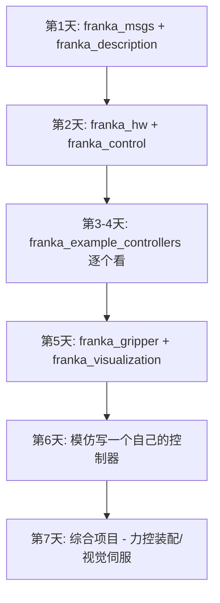

# franka_ros 深度解析 — 从底层到上层的完整学习指南

> 版本：0.7.0 | 官方仓库：https://github.com/frankaemika/franka_ros
> 本地路径：`franka_ws/src/franka_ros/`

---

## 📋 目录

1. [整体架构](#1-整体架构)
2. [franka_msgs — 消息/服务/动作定义](#2-franka_msgs--消息服务动作定义)
3. [franka_hw — 硬件抽象层](#3-franka_hw--硬件抽象层)
4. [franka_control — 控制中枢](#4-franka_control--控制中枢)
5. [franka_gripper — 夹爪控制](#5-franka_gripper--夹爪控制)
6. [franka_description — 机器人模型描述](#6-franka_description--机器人模型描述)
7. [franka_example_controllers — 示例控制器（核心）](#7-franka_example_controllers--示例控制器核心)
8. [franka_visualization — 可视化工具](#8-franka_visualization--可视化工具)
9. [综合实战：从零写一个自定义控制器](#9-综合实战从零写一个自定义控制器)
10. [附录：速查表](#10-附录速查表)

---

## 1. 整体架构

```
┌──────────────────────────────────────────────────────────┐
│                   你的 ROS 节点 (Python/C++)              │
│   向 topic 发命令 / 调 service / 从 topic 读状态          │
├──────────────────────────────────────────────────────────┤
│  franka_example_controllers (9 个示例控制器)              │
│  ┌──────────┬──────────┬────────────┬────────────────┐   │
│  │JointPos  │JointVel  │JointImp    │CartesianPose   │   │
│  │JointTorque           │CartesianVel│CartesianImp    │   │
│  │Force     │Elbow     │Model       │DualArm         │   │
│  └──────────┴──────────┴────────────┴────────────────┘   │
├──────────────────────────────────────────────────────────┤
│  franka_control: franka_control_node                     │
│  (controller_manager + ros_control 控制循环)              │
├──────────────────────────────────────────────────────────┤
│  franka_hw: FrankaHW                                     │
│  (hardware_interface::RobotHW 实现)                      │
│  read() ← libfranka 状态  |  write() → libfranka 命令    │
├──────────────────────────────────────────────────────────┤
│  libfranka (C++ SDK) — 网线直连机器人                    │
│  franka::Robot / franka::Model / franka::RobotState      │
├──────────────────────────────────────────────────────────┤
│              真实 Franka Panda 机器人                     │
└──────────────────────────────────────────────────────────┘

辅助包:
  franka_msgs        → 定义消息/服务/action
  franka_description → URDF + 3D 网格
  franka_gripper     → 夹爪独立控制
  franka_visualization → RViz 可视化
```

---

## 2. franka_msgs — 消息/服务/动作定义

**路径**: [`franka_ws/src/franka_ros/franka_msgs/`](franka_ws/src/franka_ros/franka_msgs/)
**依赖**: `std_msgs`, `actionlib_msgs`
**作用**: 定义了 Franka 机器人在 ROS 中通信所需的全部消息类型、服务接口和动作接口。

### 2.1 消息 (msg)

#### [`FrankaState.msg`](franka_ws/src/franka_ros/franka_msgs/msg/FrankaState.msg) — 最核心的消息

你一秒钟会收到 1000 次这个消息（机器人 1kHz 控制频率）。必须搞懂每个字段含义。

| 字段 | 类型 | 含义 | 用途 |
|------|------|------|------|
| `q[7]` | float64[7] | 7 个关节的**实际**角度 (rad) | 反馈当前位姿 |
| `q_d[7]` | float64[7] | 7 个关节的**期望**角度 (rad) | 和 `q` 对比看跟踪误差 |
| `dq[7]` | float64[7] | 实际关节速度 (rad/s) | 速度反馈 |
| `dq_d[7]` | float64[7] | 期望关节速度 (rad/s) | |
| `tau_J[7]` | float64[7] | 关节实际力矩 (Nm) | 力矩反馈 |
| `tau_J_d[7]` | float64[7] | 关节期望力矩 (Nm) | |
| `tau_ext_hat_filtered[7]` | float64[7] | **滤波后的外部力矩估计** ⭐ | 碰撞检测/力控 |
| `O_T_EE[16]` | float64[16] | 末端执行器在位姿矩阵 (4x4, 列主序) | **末端当前位姿** |
| `O_T_EE_d[16]` | float64[16] | 末端期望位姿 | 位姿跟踪误差 |
| `O_T_EE_c[16]` | float64[16] | 命令中的末端位姿 | |
| `F_T_EE[16]` | float64[16] | 法兰到末端的变换矩阵 | 装了夹爪/工具后需设置 |
| `EE_T_K[16]` | float64[16] | 末端到阻抗参考系的变换 | 阻抗控制参考系 |
| `O_F_ext_hat_K[6]` | float64[6] | 外部力的估计 (在阻抗参考系中) | [Fx,Fy,Fz,Tx,Ty,Tz] |
| `m_ee` | float64 | 末端执行器质量 | |
| `F_x_Cee[3]` | float64[3] | 末端执行器重心位置 | |
| `I_ee[9]` | float64[9] | 末端执行器惯量 (3x3) | |
| `m_load` | float64 | 负载质量 | |
| `m_total` | float64 | 总质量 (m_ee + m_load) | |
| `elbow[2]` | float64[2] | 肘部位置 [sign, q_b] | 冗余自由度 |
| `cartesian_collision[6]` | float64[6] | 笛卡尔碰撞检测状态 | |
| `joint_collision[7]` | float64[7] | 关节碰撞检测状态 | |
| `cartesian_contact[6]` | float64[6] | 笛卡尔接触状态 | |
| `joint_contact[7]` | float64[7] | 关节接触状态 | |
| `control_command_success_rate` | float64 | 控制命令成功率 | 网络质量指标 |
| `robot_mode` | uint8 | 机器人模式枚举 | 值见下面 |
| `current_errors` | Errors | 当前错误 | |
| `last_motion_errors` | Errors | 上一次运动的错误 | |

**`robot_mode` 枚举值**:
```python
ROBOT_MODE_OTHER = 0
ROBOT_MODE_IDLE = 1               # 空闲
ROBOT_MODE_MOVE = 2               # 运动中
ROBOT_MODE_GUIDING = 3            # 手动引导
ROBOT_MODE_REFLEX = 4             # 反射（错误触发）
ROBOT_MODE_USER_STOPPED = 5      # 用户停止
ROBOT_MODE_AUTOMATIC_ERROR_RECOVERY = 6  # 自动错误恢复
```

#### [`Errors.msg`](franka_ws/src/franka_ros/franka_msgs/msg/Errors.msg) — 错误码

共 37 种错误状态，全部是 `bool` 类型。需要记住常见的：

| 常见错误 | 含义 |
|----------|------|
| `joint_position_limits_violation` | 关节超限位 |
| `cartesian_position_limits_violation` | 笛卡尔空间超限位 |
| `self_collision_avoidance_violation` | 自碰撞检测触发 |
| `joint_velocity_violation` | 关节速度超出 |
| `cartesian_velocity_violation` | 笛卡尔速度超出 |
| `force_control_safety_violation` | 力控安全触发 |
| `joint_reflex` | 关节反射 |
| `cartesian_reflex` | 笛卡尔反射 |
| `power_limit_violation` | 功率限制 |
| `instability_detected` | 检测到不稳定 |

### 2.2 服务 (srv)

| 服务 | 请求参数 | 说明 |
|------|----------|------|
| [`SetEEFrame`](franka_ws/src/franka_ros/franka_msgs/srv/SetEEFrame.srv) | `F_T_EE[16]` (4×4 变换矩阵) | 设置法兰到末端执行器的变换，装了不同工具必须设 |
| [`SetKFrame`](franka_ws/src/franka_ros/franka_msgs/srv/SetKFrame.srv) | `EE_T_K[16]` (4×4 变换矩阵) | 设置阻抗控制的参考坐标系 |
| [`SetCartesianImpedance`](franka_ws/src/franka_ros/franka_msgs/srv/SetCartesianImpedance.srv) | `cartesian_stiffness[6]` | 设笛卡尔刚度 [x,y,z,rx,ry,rz] |
| [`SetJointImpedance`](franka_ws/src/franka_ros/franka_msgs/srv/SetJointImpedance.srv) | `joint_stiffness[7]` | 设关节刚度 7 个关节 |
| [`SetLoad`](franka_ws/src/franka_ros/franka_msgs/srv/SetLoad.srv) | `mass`, `F_x_center_load[3]`, `load_inertia[9]` | 设负载参数（质量/重心/惯量） |
| [`SetForceTorqueCollisionBehavior`](franka_ws/src/franka_ros/franka_msgs/srv/SetForceTorqueCollisionBehavior.srv) | 力矩+力的上下限 (26 个值) | 设碰撞检测阈值（简化版） |
| [`SetFullCollisionBehavior`](franka_ws/src/franka_ros/franka_msgs/srv/SetFullCollisionBehavior.srv) | 加速度/正常态的力矩和力上下限 (52 个值) | 设完整的碰撞检测阈值 |

**注意**：每个服务都返回 `bool success` + `string error`。

### 2.3 动作 (action)

| Action | 作用 | 输入 | 输出 |
|--------|------|------|------|
| [`ErrorRecovery`](franka_ws/src/franka_ros/franka_msgs/action/ErrorRecovery.action) | 清除机器人错误 | 无 | 无 |

`ErrorRecovery` 没有 goal，调用它就自动恢复错误状态。

### 🧪 动手验证

```bash
# 查看 FrankaState 实时数据
rostopic echo /franka_state_controller/franka_states

# 查看所有可调用的服务
rosservice list | grep franka

# 调用服务设置负载
rosservice call /franka_control/set_load "mass: 0.5
F_x_center_load: [0.0, 0.0, 0.05]
load_inertia: [0.0, 0.0, 0.0, 0.0, 0.0, 0.0, 0.0, 0.0, 0.0]"
```

---

## 3. franka_hw — 硬件抽象层

**路径**: [`franka_ws/src/franka_ros/franka_hw/`](franka_ws/src/franka_ros/franka_hw/)
**依赖**: `ros_control` 全家桶 + `libfranka`
**作用**: 把 `libfranka` 包装成 `ros_control` 的 `RobotHW`。

### 3.1 控制模式枚举

[`control_mode.h`](franka_ws/src/franka_ros/franka_hw/include/franka_hw/control_mode.h)

```cpp
enum class ControlMode {
    None = 0,
    JointTorque = (1 << 0),      // 1  → 力矩控制
    JointPosition = (1 << 1),    // 2  → 关节位置
    JointVelocity = (1 << 2),    // 4  → 关节速度
    CartesianVelocity = (1 << 3),// 8  → 笛卡尔速度
    CartesianPose = (1 << 4),    // 16 → 笛卡尔位姿
};
```

由于是 bitmask 设计，可以组合使用。常见组合：

| 组合 | 值 | 说明 |
|------|-----|------|
| `JointTorque \| JointPosition` | 3 | 力矩+位置（笛卡尔阻抗内部用了这个） |
| `JointTorque \| JointVelocity` | 5 | 力矩+速度 |
| `JointTorque \| CartesianPose` | 17 | 力矩+笛卡尔位姿 |
| `JointTorque \| CartesianVelocity` | 25 | 力矩+笛卡尔速度 |

### 3.2 核心类：`FrankaHW`

[`franka_hw.h`](franka_ws/src/franka_ros/franka_hw/include/franka_hw/franka_hw.h)

继承自 `hardware_interface::RobotHW`，是整个系统的关键。

#### 🔧 初始化流程（[`franka_hw.cpp`](franka_ws/src/franka_ros/franka_hw/src/franka_hw.cpp)）

```cpp
bool FrankaHW::init(ros::NodeHandle& root_nh, ros::NodeHandle& robot_hw_nh) {
    initParameters(root_nh, robot_hw_nh);  // 读取参数
    initRobot();                            // 通过 libfranka 连接真实机器人
    initROSInterfaces(robot_hw_nh);        // 注册 ROS 控制接口
    setupParameterCallbacks(robot_hw_nh);  // 动态参数回调
}
```

#### 注册的 ROS 接口

**关节级接口**（7 个关节各一个 handle）：

| 接口名 | 类型 | 说明 |
|--------|------|------|
| `JointStateInterface` | 状态 | 读 q, dq, tau_J |
| `PositionJointInterface` | 命令 | 发关节位置 q |
| `VelocityJointInterface` | 命令 | 发关节速度 dq |
| `EffortJointInterface` | 命令 | 发力矩 tau_J |

**Franka 特有接口**（每个接口只有 1 个 handle，以 arm_id 命名）：

| 接口名 | Handle 名 | 类型 | 说明 |
|--------|-----------|------|------|
| `FrankaStateInterface` | `panda_robot` | 状态 | 完整的 FrankaState |
| `FrankaPoseCartesianInterface` | `panda_robot` | 命令 | 发笛卡尔末端位姿 |
| `FrankaVelocityCartesianInterface` | `panda_robot` | 命令 | 发笛卡尔末端速度 |
| `FrankaModelInterface` | `panda_model` | 状态 | 动力学模型（雅可比/惯性矩阵等） |

#### 读写循环

```cpp
void FrankaHW::read(...) {
    // 从 libfranka 状态拷贝到 ROS 状态
    robot_state_ros_ = robot_state_libfranka_;
}

void FrankaHW::write(...) {
    // 从 ROS 命令拷贝到 libfranka 命令
    pose_cartesian_command_libfranka_ = pose_cartesian_command_ros_;
    // ...
}
```

#### `setRunFunction` — 核心调度

根据 `ControlMode` 决定调用 `libfranka` 的哪个 `robot.control()` 重载：

```cpp
switch (requested_control_mode) {
    case ControlMode::JointTorque:
        robot.control(controlCallback<Torques>, ...);
    case ControlMode::JointPosition:
        robot.control(controlCallback<JointPositions>, internal_controller, ...);
    case ControlMode::CartesianPose:
        robot.control(controlCallback<CartesianPose>, internal_controller, ...);
    // ...
}
```

**关键**：`JointPosition` 和 `CartesianPose` 等非力矩模式需要 `internal_controller` 参数（`joint_impedance` 或 `cartesian_impedance`），这告诉机器人底层用阻抗控制来实现位置/位姿追踪。

#### `controlCallback` 模板函数

每一帧（1kHz）执行的函数：

```cpp
T controlCallback(const T& command, Callback ros_callback,
                  const franka::RobotState& robot_state, franka::Duration time_step) {
    robot_state_libfranka_ = robot_state;
    read(now, period);                           // 读状态
    if (ros_callback && !ros_callback(...))      // 调 controller_manager.update()
        return MotionFinished(command);
    write(now, period);                          // 写命令
    if (commandHasNaN(command)) throw error;
    return command;
}
```

### 3.3 碰撞配置

在 [`franka_control_node.yaml`](franka_ws/src/franka_ros/franka_control/config/franka_control_node.yaml) 中定义的碰撞检测参数分为两组：

| 参数组 | 含义 |
|--------|------|
| `_acceleration` | **加速时**的阈值（运动过程中更宽松） |
| `_nominal` | **稳定时**的阈值（更严格） |

每组分**力矩**（7 个关节，单位 Nm）和**力**（6 维 [Fx,Fy,Fz,Tx,Ty,Tz]）：

```yaml
lower_torque_thresholds_nominal: [20.0, 20.0, 18.0, 18.0, 16.0, 14.0, 12.0]
lower_force_thresholds_nominal: [20.0, 20.0, 20.0, 25.0, 25.0, 25.0]
```

**值越小越敏感**。如果你的任务需要碰触物体，必须调大这些值。

### 🧪 动手验证

```python
# 从 Python 获取机器人状态
import rospy
from franka_msgs.msg import FrankaState

def cb(msg):
    print(f"关节角度: {msg.q}")
    print(f"末端位姿 (x,y,z): {msg.O_T_EE[12]}, {msg.O_T_EE[13]}, {msg.O_T_EE[14]}")
    print(f"外力估计: {msg.O_F_ext_hat_K}")

rospy.init_node("read_state")
rospy.Subscriber("/franka_state_controller/franka_states", FrankaState, cb)
rospy.spin()
```

---

## 4. franka_control — 控制中枢

**路径**: [`franka_ws/src/franka_ros/franka_control/`](franka_ws/src/franka_ros/franka_control/)
**作用**: 启动整个控制系统的核心节点。

### 4.1 启动文件分析

[`franka_control.launch`](franka_ws/src/franka_ros/franka_control/launch/franka_control.launch)

```xml
<launch>
  <arg name="robot_ip" default="192.168.1.51"/>   <!-- 机器人 IP -->
  <arg name="load_gripper" default="true" />      <!-- 是否加载夹爪 -->

  <!-- 1. 加载机器人 URDF 描述文件 -->
  <param name="robot_description" ... />

  <!-- 2. 启动夹爪节点（可选） -->
  <include file="$(find franka_gripper)/launch/franka_gripper.launch" ... />

  <!-- 3. ⭐ 核心：启动 franka_control_node -->
  <node name="franka_control" pkg="franka_control" type="franka_control_node"
        output="screen" required="true">
    <rosparam command="load" file="$(find franka_control)/config/franka_control_node.yaml" />
    <param name="robot_ip" value="$(arg robot_ip)" />
  </node>

  <!-- 4. 加载默认控制器（franka_state_controller） -->
  <rosparam command="load" file="$(find franka_control)/config/default_controllers.yaml" />
  <node name="state_controller_spawner" pkg="controller_manager" type="spawner"
        args="franka_state_controller"/>

  <!-- 5. 启动 robot_state_publisher（发布 TF） -->
  <node name="robot_state_publisher" ... />

  <!-- 6. 启动 joint_state_publisher（实际+期望） -->
  <node name="joint_state_publisher" ... />
</launch>
```

### 4.2 核心节点：`franka_control_node`

[`franka_control_node.cpp`](franka_ws/src/franka_ros/franka_control/src/franka_control_node.cpp)

```cpp
int main(int argc, char** argv) {
    // 1. 初始化 FrankaHW（连接机器人）
    FrankaHW franka_control;
    franka_control.init(public_node_handle, node_handle);

    // 2. 设置服务（collision_behavior, load, impedances 等）
    ServiceContainer services;
    franka_hw::setupServices(robot, node_handle, services);

    // 3. 设置 ErrorRecovery action server
    SimpleActionServer<ErrorRecoveryAction> recovery_action_server(...);

    // 4. 创建 ControllerManager
    ControllerManager control_manager(&franka_control, public_node_handle);

    // 5. 启动 4 线程的 AsyncSpinner
    AsyncSpinner spinner(4);
    spinner.start();

    // 6. 主控制循环
    while (ros::ok()) {
        // 等待控制器激活或无错误
        while (!franka_control.controllerActive() || has_error) {
            franka_control.update(robot.readOnce());
            control_manager.update(now, period);
        }
        // 运行控制循环（1kHz），通过 ros_callback 调用 controller_manager.update()
        franka_control.control([&](const ros::Time& now, const ros::Duration& period) {
            if (period.toSec() == 0.0) {
                control_manager.update(now, period, true);  // 重置
            } else {
                control_manager.update(now, period);         // 正常控制更新
                franka_control.enforceLimits(period);        // 限位
            }
        });
    }
}
```

### 4.3 控制流时序图

```
启动时:
  franka_control_node 启动
    ↓
  FrankaHW::init() 连接机器人
    ↓
  ControllerManager 创建
    ↓
  spawner 加载默认控制器 (franka_state_controller)
    ↓
  等待... 直到用户加载一个真正的运动控制器

运行时 (1kHz 循环):
  libfranka 回调触发
    ↓
  FrankaHW::controlCallback()
    ↓
  read() → 从 libfranka 读状态到 ROS 句柄
    ↓
  ros_callback() 调 controller_manager::update()
    ↓
  控制器 update() 执行 → 写命令到 ROS 句柄
    ↓
  write() → 从 ROS 句柄写命令到 libfranka
    ↓
  命令发回机器人
```

### 4.4 启动后产生的 ROS 接口

启动 `franka_control.launch` 后：

**Topics**:
```
/franka_state_controller/franka_states     → FrankaState (1000Hz)
/franka_state_controller/joint_states       → JointState
/franka_state_controller/joint_states_desired → JointState
/joint_states                              → JointState (合并)
/robot_state_publisher/...                  → TF
```

**Services**:
```
/franka_control/set_load
/franka_control/set_EE_frame
/franka_control/set_K_frame
/franka_control/set_cartesian_impedance
/franka_control/set_joint_impedance
/franka_control/set_force_torque_collision_behavior
/franka_control/set_full_collision_behavior
```

**Actions**:
```
/franka_control/error_recovery
```

### 🧪 动手验证

```bash
# 启动控制节点（替换 IP 为你的机器人 IP）
roslaunch franka_control franka_control.launch robot_ip:=172.16.0.2

# 查看所有活跃 topic
rostopic list

# 查看所有 service
rosservice list

# 查看控制参数
rosparam get /franka_control
```

---

## 5. franka_gripper — 夹爪控制

**路径**: [`franka_ws/src/franka_ros/franka_gripper/`](franka_ws/src/franka_ros/franka_gripper/)
**作用**: 独立控制 Franka Hand（二指夹爪）。

### 5.1 Action 接口

Python 中使用都需要通过 `actionlib` 调用。

#### [`Homing`](franka_ws/src/franka_ros/franka_gripper/action/Homing.action)

夹爪归零校准。每次上电后**必须先做 Homing** 才能使用。

```python
from franka_gripper.msg import HomingAction, HomingGoal
client = actionlib.SimpleActionClient("franka_gripper/homing", HomingAction)
client.wait_for_server()
client.send_goal(HomingGoal())
client.wait_for_result()
```

#### [`Move`](franka_ws/src/franka_ros/franka_gripper/action/Move.action)

移动到指定开口宽度。

```python
from franka_gripper.msg import MoveAction, MoveGoal
client = actionlib.SimpleActionClient("franka_gripper/move", MoveAction)
client.send_goal(MoveGoal(width=0.04, speed=0.1))  # 4cm, 0.1 m/s
```

#### [`Grasp`](franka_ws/src/franka_ros/franka_gripper/action/Grasp.action)

抓取（带力控）。是最常用的接口。

```python
from franka_gripper.msg import GraspAction, GraspGoal, GraspEpsilon
goal = GraspGoal()
goal.width = 0.03          # 目标宽度 3cm
goal.speed = 0.1           # 速度 0.1 m/s
goal.force = 10.0          # 夹持力 10N
goal.epsilon.inner = 0.005 # 内公差 5mm
goal.epsilon.outer = 0.005 # 外公差 5mm
client.send_goal(goal)
```

**`GraspEpsilon` 的作用**：当夹爪实际宽度满足 `|实际宽度 - 目标宽度| < epsilon` 时，认为抓取完成。内公差控制内边界，外公差控制外边界。

#### [`Stop`](franka_ws/src/franka_ros/franka_gripper/action/Stop.action)

紧急停止夹爪。

### 5.2 完整夹爪 Python 控制示例

```python
#!/usr/bin/env python3
import rospy
import actionlib
from franka_gripper.msg import HomingAction, HomingGoal
from franka_gripper.msg import MoveAction, MoveGoal
from franka_gripper.msg import GraspAction, GraspGoal, GraspEpsilon

rospy.init_node("gripper_demo")

# 1. 归零
homing = actionlib.SimpleActionClient("franka_gripper/homing", HomingAction)
homing.wait_for_server()
homing.send_goal(HomingGoal())
homing.wait_for_result()
print("归零完成")

# 2. 张开到 8cm
move = actionlib.SimpleActionClient("franka_gripper/move", MoveAction)
move.wait_for_server()
move.send_goal(MoveGoal(width=0.08, speed=0.1))
move.wait_for_result()
print("张开到 8cm")

# 3. 抓取（3cm, 10N 力）
grasp = actionlib.SimpleActionClient("franka_gripper/grasp", GraspAction)
grasp.wait_for_server()
goal = GraspGoal(width=0.03, speed=0.1, force=10.0,
                  epsilon=GraspEpsilon(0.005, 0.005))
grasp.send_goal(goal)
grasp.wait_for_result()
print(f"抓取结果: {grasp.get_result()}")
```

---

## 6. franka_description — 机器人模型描述

**路径**: [`franka_ws/src/franka_ros/franka_description/`](franka_ws/src/franka_ros/franka_description/)
**作用**: 提供 Franka Panda 的 URDF/XACRO 模型和 3D 显示网格。

### 6.1 文件结构

```
franka_description/
├── robots/
│   ├── panda_arm.urdf.xacro       # 入口：panda_arm.xacro + 参数
│   ├── panda_arm.xacro            # ⭐ 核心：定义 8 个 link + 8 个 joint
│   ├── panda_arm_hand.urdf.xacro  # 带夹爪的完整模型
│   ├── hand.urdf.xacro            # 夹爪 URDF
│   ├── hand.xacro                 # 夹爪宏定义
│   └── dual_panda_example.urdf.xacro  # 双臂配置
└── meshes/visual/
    ├── link0.dae ~ link7.dae      # 每个连杆的 3D 网格
    ├── hand.dae                   # 夹爪基座
    └── finger.dae                 # 夹爪手指
```

### 6.2 Panda 运动学参数

从 [`panda_arm.xacro`](franka_ws/src/franka_ros/franka_description/robots/panda_arm.xacro) 提取的完整运动学：

| 关节 | 父→子 | 类型 | 旋转轴 | 限位 (rad) | 最大力矩 | 最大速度 |
|------|-------|------|--------|-------------|----------|----------|
| joint1 | link0→link1 | revolute | Z | ±2.8973 (166°) | 87 Nm | 2.175 rad/s |
| joint2 | link1→link2 | revolute | Z | ±1.7628 (101°) | 87 Nm | 2.175 rad/s |
| joint3 | link2→link3 | revolute | Z | ±2.8973 (166°) | 87 Nm | 2.175 rad/s |
| joint4 | link3→link4 | revolute | Z | -3.0718~-0.0698 | 87 Nm | 2.175 rad/s |
| joint5 | link4→link5 | revolute | Z | ±2.8973 (166°) | 12 Nm | 2.610 rad/s |
| joint6 | link5→link6 | revolute | Z | -0.0175~3.7525 | 12 Nm | 2.610 rad/s |
| joint7 | link6→link7 | revolute | Z | ±2.8973 (166°) | 12 Nm | 2.610 rad/s |
| joint8 | link7→link8 | **fixed** | - | - | - | - |

**关节名称**：`panda_joint1` ~ `panda_joint7`

**连杆名称**：`panda_link0` ~ `panda_link8`

**重要几何关系**：

```
link0: [0, 0, 0.333] → joint1 → link1
link1: [0, 0, 0]     → joint2 (Z 轴, -90° 偏移) → link2
link2: [0, -0.316, 0] → joint3 (+90°) → link3
link3: [0.0825, 0, 0] → joint4 (+90°) → link4
link4: [-0.0825, 0.384, 0] → joint5 (-90°) → link5
link5: [0, 0, 0]     → joint6 (+90°) → link6
link6: [0.088, 0, 0] → joint7 (+90°) → link7
link7: [0, 0, 0.107] → joint8 (固定) → link8 (末端法兰)
```

### 6.3 为什么需要理解 URDF

1. **碰撞检测**：URDF 定义了碰撞几何体（圆柱体/球体）
2. **运动学**：TF 树、Forward Kinematics 基于此
3. **可视化**：RViz 显示需要
4. **MoveIt**：路径规划需要
5. **关节限位**：ROS 控制器通过 URDF 中的 `safety_controller` 标签获取软限位

### 🧪 动手验证

```bash
# 在 RViz 中显示模型（无需连接真实机器人）
roslaunch franka_visualization franka_visualization.launch robot_ip:=127.0.0.1

# 查看 TF 树
rosrun tf view_frames

# 查看关节信息
rosrun robot_state_publisher robot_state_publisher
```

---

## 7. franka_example_controllers — 示例控制器（核心）

**路径**: [`franka_ws/src/franka_ros/franka_example_controllers/`](franka_ws/src/franka_ros/franka_example_controllers/)
**作用**: 9 个官方示例，展示了每种控制方式的标准写法。

### 7.1 控制器总览

| # | 包名 | 继承自 | 控制模式 | 难度 |
|---|------|--------|----------|------|
| ① | [`JointPosition`](franka_ws/src/franka_ros/franka_example_controllers/src/joint_position_example_controller.cpp) | `controller_interface::Controller<JointInterface>` | JointPosition | ⭐ |
| ② | [`JointVelocity`](franka_ws/src/franka_ros/franka_example_controllers/src/joint_velocity_example_controller.cpp) | 同上 | JointVelocity | ⭐ |
| ③ | [`CartesianPose`](franka_ws/src/franka_ros/franka_example_controllers/src/cartesian_pose_example_controller.cpp) | `MultiInterfaceController` | CartesianPose | ⭐⭐ |
| ④ | [`CartesianVelocity`](franka_ws/src/franka_ros/franka_example_controllers/src/cartesian_velocity_example_controller.cpp) | 同上 | CartesianVelocity | ⭐⭐ |
| ⑤ | [`CartesianImpedance`](franka_ws/src/franka_ros/franka_example_controllers/src/cartesian_impedance_example_controller.cpp) | `MultiInterfaceController` | **JointTorque** (自己算力矩) | ⭐⭐⭐ |
| ⑥ | [`JointImpedance`](franka_ws/src/franka_ros/franka_example_controllers/src/joint_impedance_example_controller.cpp) | 同上 | **JointTorque** | ⭐⭐⭐ |
| ⑦ | [`Force`](franka_ws/src/franka_ros/franka_example_controllers/src/force_example_controller.cpp) | 同上 | **JointTorque** | ⭐⭐⭐⭐ |
| ⑧ | [`Elbow`](franka_ws/src/franka_ros/franka_example_controllers/src/elbow_example_controller.cpp) | 同上 | **JointTorque** | ⭐⭐⭐ |
| ⑨ | [`Model`](franka_ws/src/franka_ros/franka_example_controllers/src/model_example_controller.cpp) | 同上 | 只读不写 | ⭐ |
| ⑩ | [`DualArm`](franka_ws/src/franka_ros/franka_example_controllers/src/dual_arm_cartesian_impedance_example_controller.cpp) | 同上 | **JointTorque** | ⭐⭐⭐⭐⭐ |

### 7.2 两类控制器的根本区别

**第一类：使用内置运动生成器（①~④）**

通过 `franka_hw` 的 `PositionJointInterface` / `FrankaPoseCartesianInterface` 等接口发命令，底层由 `libfranka` 的内部控制器执行。简单、安全，但灵活性有限。

**第二类：自己算力矩（⑤~⑧、⑩）**

通过 `EffortJointInterface` 发力矩命令。需要自己实现控制律（PD + 重力补偿 + 零空间控制）。复杂、灵活，可以做阻抗/力控。

### 7.3 详细源码分析

#### ① JointPosition — 最简单的关节位置控制

```bash
roslaunch franka_example_controllers joint_position_example_controller.launch robot_ip:=172.16.0.2
```

控制模式：`JointPosition`，底层走了 `internal_controller=joint_impedance`。发关节角度目标，机器人自动用内部阻抗控制到达。

#### ② JointVelocity — 关节速度控制

同上，发的是关节速度。

#### ③ **CartesianPose — 笛卡尔位置控制** ⭐

[`cartesian_pose_example_controller.cpp`](franka_ws/src/franka_ros/franka_example_controllers/src/cartesian_pose_example_controller.cpp)

```cpp
class CartesianPoseExampleController
    : public controller_interface::MultiInterfaceController<
          franka_hw::FrankaPoseCartesianInterface>  // 只需要笛卡尔位姿接口
```

核心逻辑（只有 10 行）：

```cpp
void update(const ros::Time&, const ros::Duration& period) {
    elapsed_time_ += period;
    double radius = 0.3;
    double angle = M_PI / 4 * (1 - std::cos(M_PI / 5.0 * elapsed_time_.toSec()));
    double delta_x = radius * std::sin(angle);
    double delta_z = radius * (std::cos(angle) - 1);
    std::array<double, 16> new_pose = initial_pose_;
    new_pose[12] -= delta_x;   // 修改 x
    new_pose[14] -= delta_z;   // 修改 z
    cartesian_pose_handle_->setCommand(new_pose);
}
```

**效果**：机器人在 XZ 平面画一个弧形轨迹。

**⚠️ 限制**：必须先执行 `move_to_start.launch` 让机器人到达初始位姿 `[0, -pi/4, 0, -3pi/4, 0, pi/2, pi/4]`，否则控制器会拒绝启动。

#### ④ CartesianVelocity — 笛卡尔速度控制

与笛卡尔位姿类似，但发的是速度命令 `O_dP_EE[6]`。

#### ⑤ **CartesianImpedance — 笛卡尔阻抗控制** ⭐⭐⭐

[`cartesian_impedance_example_controller.h`](franka_ws/src/franka_ros/franka_example_controllers/include/franka_example_controllers/cartesian_impedance_example_controller.h)

```cpp
class CartesianImpedanceExampleController
    : public controller_interface::MultiInterfaceController<
          franka_hw::FrankaModelInterface,         // 需要动力学模型
          hardware_interface::EffortJointInterface, // 发力矩
          franka_hw::FrankaStateInterface>          // 需要状态
```

这是**最重要的控制器**，几乎所有高级控制（柔顺、装配、力控）都基于此。

**控制律**（在 [`cartesian_impedance_example_controller.cpp`](franka_ws/src/franka_ros/franka_example_controllers/src/cartesian_impedance_example_controller.cpp) 的 `update()` 中）：

```cpp
// 1. 获取状态
franka::RobotState robot_state = state_handle_->getRobotState();
std::array<double, 7> coriolis_array = model_handle_->getCoriolis();   // 科氏力
std::array<double, 42> jacobian_array = model_handle_->getZeroJacobian(kEndEffector);

// 2. 计算笛卡尔误差
Eigen::Matrix<double, 6, 1> error;
error.head(3) = 当前末端位置 - 目标位置;             // 位置误差
error.tail(3) = 姿态误差(四元数差);                   // 姿态误差

// 3. 计算任务空间力矩（笛卡尔 PD 控制）
tau_task = J^T * (-Kx * error - Dx * J * dq);

// 4. 计算零空间力矩（保持初始关节位姿）
tau_nullspace = (I - J^T * J_pinv) * (Kq * (q_d - q) - Dq * dq);

// 5. 总力矩 = 任务 + 零空间 + 重力补偿
tau_d = tau_task + tau_nullspace + coriolis;
```

**其中**：
- `Kx` = 笛卡尔刚度矩阵（6×6，默认 translational=200, rotational=10）
- `Dx` = 笛卡尔阻尼矩阵（6×6，自动设为 `2*sqrt(K)`，临界阻尼）
- `Kq` = 零空间刚度（默认 20）
- 科氏力 `coriolis` 补偿了动力学非线性

**交互方式**：
1. **RViz 拖动标记** → 通过 [`interactive_marker.py`](franka_ws/src/franka_ros/franka_example_controllers/scripts/interactive_marker.py) 发布到 `/equilibrium_pose` topic
2. **动态调参** → `rqt_reconfigure` 实时调整 `translational_stiffness`, `rotational_stiffness`, `nullspace_stiffness`
3. **直接发 topic** → 发布 `geometry_msgs/PoseStamped` 到 `/equilibrium_pose`

#### ⑥ JointImpedance — 关节空间阻抗控制

与笛卡尔阻抗类似，但在关节空间操作。可以在配置文件中独立设置每个关节的刚度和阻尼：

```yaml
joint_impedance_example_controller:
    k_gains: [600, 600, 600, 600, 250, 150, 50]   # 刚度 (Nm/rad)
    d_gains: [50, 50, 50, 20, 20, 20, 10]          # 阻尼
    radius: 0.1               # 运动半径
    acceleration_time: 2.0    # 加速时间
    vel_max: 0.15             # 最大速度
```

#### ⑦ **Force — 力控制** ⭐⭐⭐⭐

[`force_example_controller.cpp`](franka_ws/src/franka_ros/franka_example_controllers/src/force_example_controller.cpp)

实现的是**力控 + PI 补偿**：

```cpp
void update(const ros::Time&, const ros::Duration& period) {
    // 1. 获取雅可比和外部力矩
    tau_ext = tau_measured - gravity - tau_ext_initial_;  // 去重力+零偏

    // 2. 期望的末端力（Z 方向，支持负载质量）
    desired_force_torque(2) = desired_mass_ * -9.81;

    // 3. 力矩映射
    tau_d = J^T * desired_force_torque;

    // 4. PI 补偿（误差积分）
    tau_error_ += period * (tau_d - tau_ext);
    tau_cmd = tau_d + k_p * (tau_d - tau_ext) + k_i * tau_error_;

    // 5. 力矩率限制
    tau_cmd = saturateTorqueRate(tau_cmd, tau_J_d);
}
```

**关键**：初始 bias 校正 `tau_ext_initial_ = tau_measured - gravity` 在 `starting()` 中完成。这要求启动时末端已经接触物体。

#### ⑧ Elbow — 肘部控制（冗余自由度利用）

Panda 有 7 个自由度（= 6 维任务空间 + 1 个冗余自由度）。Elbow 控制器让你独立控制肘部位置（`elbow[2]`），而末端位姿不受影响。

#### ⑨ Model — 只读动力学模型

不写任何命令，只打印动力学参数。适合学习：

```cpp
std::array<double, 7> gravity = model_handle_->getGravity();
std::array<double, 42> jacobian = model_handle_->getZeroJacobian(kEndEffector);
std::array<double, 7> coriolis = model_handle_->getCoriolis();
std::array<double, 49> mass_matrix = model_handle_->getMassMatrix();
```

### 7.4 控制器配置详解

[`franka_example_controllers.yaml`](franka_ws/src/franka_ros/franka_example_controllers/config/franka_example_controllers.yaml)

每个控制器的 YAML 配置结构（以笛卡尔阻抗为例）：

```yaml
cartesian_impedance_example_controller:    # 控制器名称
    type: franka_example_controllers/CartesianImpedanceExampleController  # ⭐ 插件类型
    arm_id: panda                           # 机器人 ID
    joint_names:                            # 关节名称列表
        - panda_joint1
        - panda_joint2
        ...
```

**`type` 字段**的格式是 `包名/类名`，与源码中 `PLUGINLIB_EXPORT_CLASS` 匹配：

```cpp
PLUGINLIB_EXPORT_CLASS(
    franka_example_controllers::CartesianImpedanceExampleController,
    controller_interface::ControllerBase)
```

### 7.5 动态调参 (dynamic_reconfigure)

笛卡尔阻抗控制器的动态参数来自 [`compliance_param.cfg`](franka_ws/src/franka_ros/franka_example_controllers/cfg/compliance_param.cfg)：

```python
gen.add("translational_stiffness", double_t, 0, "平移刚度", 200, 0, 400)
gen.add("rotational_stiffness", double_t, 0, "旋转刚度", 10, 0, 30)
gen.add("nullspace_stiffness", double_t, 0, "零空间刚度", 0, 0, 100)
```

运行 `rqt_reconfigure` 即可在 GUI 中实时拖动滑块调整。调整后控制器内部用低通滤波平滑过渡：

```cpp
cartesian_stiffness_ = filter_params_ * cartesian_stiffness_target_
                       + (1 - filter_params_) * cartesian_stiffness_;
```

### 🧪 动手验证

```bash
# 1. 启动笛卡尔阻抗控制
roslaunch franka_example_controllers cartesian_impedance_example_controller.launch \
    robot_ip:=172.16.0.2

# 2. 手动发布目标位姿
rostopic pub /equilibrium_pose geometry_msgs/PoseStamped "{
  header: {frame_id: 'panda_link0'},
  pose: {position: {x: 0.3, y: 0.0, z: 0.5},
         orientation: {x: 0.0, y: 0.0, z: 0.0, w: 1.0}}
}" -1

# 3. 打开动态调参
rosrun rqt_reconfigure rqt_reconfigure
```

---

## 8. franka_visualization — 可视化工具

**路径**: [`franka_ws/src/franka_ros/franka_visualization/`](franka_ws/src/franka_ros/franka_visualization/)
**作用**: 在 RViz 中显示机器人状态。

### 8.1 启动文件

[`franka_visualization.launch`](franka_ws/src/franka_ros/franka_visualization/launch/franka_visualization.launch)

```xml
<launch>
  <!-- 加载 URDF -->
  <param name="robot_description" command="xacro '...panda_arm_hand.urdf.xacro'" />

  <!-- 连接机器人并发布关节状态 -->
  <node name="robot_joint_state_publisher" pkg="franka_visualization"
        type="robot_joint_state_publisher" />
  <node name="gripper_joint_state_publisher" pkg="franka_visualization"
        type="gripper_joint_state_publisher" />

  <!-- 发布 TF -->
  <node name="joint_state_publisher" ... />
  <node name="robot_state_publisher" ... />

  <!-- 启动 RViz -->
  <node pkg="rviz" type="rviz" args="-d franka_visualization.rviz" />
</launch>
```

### 🧪 动手验证

```bash
# 只需提供 IP（无需 franka_control 运行）
roslaunch franka_visualization franka_visualization.launch robot_ip:=172.16.0.2
```

---

## 9. 综合实战：从零写一个自定义控制器

以一个 **"恒力跟随曲面"** 的控制器为例，综合运用以上知识。

### 9.1 需求

当机器人末端在某个面上移动时，保持 Z 方向恒力 5N，同时跟踪 X/Y 方向的位姿目标。

### 9.2 源码

**`include/my_controller/my_controller.h`**:

```cpp
#pragma once
#include <controller_interface/multi_interface_controller.h>
#include <franka_hw/franka_model_interface.h>
#include <franka_hw/franka_state_interface.h>
#include <hardware_interface/joint_command_interface.h>
#include <geometry_msgs/PoseStamped.h>
#include <ros/node_handle.h>

namespace my_controller {

class MyController : public controller_interface::MultiInterfaceController<
                         franka_hw::FrankaModelInterface,
                         hardware_interface::EffortJointInterface,
                         franka_hw::FrankaStateInterface> {
 public:
  bool init(hardware_interface::RobotHW* robot_hw, ros::NodeHandle& node_handle) override;
  void starting(const ros::Time&) override;
  void update(const ros::Time&, const ros::Duration& period) override;

 private:
  std::unique_ptr<franka_hw::FrankaStateHandle> state_handle_;
  std::unique_ptr<franka_hw::FrankaModelHandle> model_handle_;
  std::vector<hardware_interface::JointHandle> joint_handles_;

  // 控制参数
  const double translational_stiffness_ = 200.0;
  const double rotational_stiffness_ = 10.0;
  const double desired_force_ = 5.0;  // 5N 恒力

  // 状态
  Eigen::Vector3d position_d_;
  Eigen::Quaterniond orientation_d_;
  Eigen::Matrix<double, 7, 1> q_d_nullspace_;
  Eigen::Vector3d tau_ext_initial_;

  // 工具函数
  Eigen::Matrix<double, 7, 1> saturateTorqueRate(
      const Eigen::Matrix<double, 7, 1>& tau_d_calculated,
      const Eigen::Matrix<double, 7, 1>& tau_J_d);
};

}  // namespace my_controller
```

**`src/my_controller.cpp`**:

```cpp
#include <my_controller/my_controller.h>
#include <franka/robot_state.h>
#include <pluginlib/class_list_macros.h>
#include <franka_example_controllers/pseudo_inversion.h>

namespace my_controller {

bool MyController::init(hardware_interface::RobotHW* robot_hw,
                        ros::NodeHandle& node_handle) {
  std::string arm_id;
  if (!node_handle.getParam("arm_id", arm_id)) return false;
  std::vector<std::string> joint_names;
  if (!node_handle.getParam("joint_names", joint_names) || joint_names.size() != 7)
    return false;

  // 获取模型接口
  auto* model_interface = robot_hw->get<franka_hw::FrankaModelInterface>();
  model_handle_ = std::make_unique<franka_hw::FrankaModelHandle>(
      model_interface->getHandle(arm_id + "_model"));

  // 获取状态接口
  auto* state_interface = robot_hw->get<franka_hw::FrankaStateInterface>();
  state_handle_ = std::make_unique<franka_hw::FrankaStateHandle>(
      state_interface->getHandle(arm_id + "_robot"));

  // 获取力矩接口
  auto* effort_interface = robot_hw->get<hardware_interface::EffortJointInterface>();
  for (size_t i = 0; i < 7; ++i)
    joint_handles_.push_back(effort_interface->getHandle(joint_names[i]));

  return true;
}

void MyController::starting(const ros::Time&) {
  franka::RobotState state = state_handle_->getRobotState();
  Eigen::Affine3d transform(Eigen::Matrix4d::Map(state.O_T_EE.data()));
  position_d_ = transform.translation();
  orientation_d_ = Eigen::Quaterniond(transform.linear());
  q_d_nullspace_ = Eigen::Map<Eigen::Matrix<double, 7, 1>>(state.q.data());

  // Bias correction for force control
  auto gravity = model_handle_->getGravity();
  Eigen::Map<Eigen::Matrix<double, 7, 1>> tau_measured(state.tau_J.data());
  Eigen::Map<Eigen::Matrix<double, 7, 1>> gravity_map(gravity.data());
  tau_ext_initial_ = tau_measured - gravity_map;
}

void MyController::update(const ros::Time&, const ros::Duration& period) {
  franka::RobotState state = state_handle_->getRobotState();
  auto coriolis = model_handle_->getCoriolis();
  auto jacobian_array = model_handle_->getZeroJacobian(franka::Frame::kEndEffector);

  Eigen::Map<Eigen::Matrix<double, 7, 1>> coriolis_map(coriolis.data());
  Eigen::Map<Eigen::Matrix<double, 6, 7>> jacobian(jacobian_array.data());
  Eigen::Map<Eigen::Matrix<double, 7, 1>> q(state.q.data());
  Eigen::Map<Eigen::Matrix<double, 7, 1>> dq(state.dq.data());
  Eigen::Map<Eigen::Matrix<double, 7, 1>> tau_J_d(state.tau_J_d.data());
  Eigen::Map<Eigen::Matrix<double, 7, 1>> tau_measured(state.tau_J.data());

  Eigen::Affine3d transform(Eigen::Matrix4d::Map(state.O_T_EE.data()));
  Eigen::Vector3d position(transform.translation());
  Eigen::Quaterniond orientation(transform.linear());

  // === 1. 笛卡尔阻抗控制（X/Y 方向） ===
  Eigen::Matrix<double, 6, 6> stiffness = Eigen::Matrix<double, 6, 6>::Zero();
  stiffness(0,0) = translational_stiffness_;  // X 刚
  stiffness(1,1) = translational_stiffness_;  // Y 刚
  stiffness(2,2) = 0.0;  // Z 方向刚度设为 0（力控）
  stiffness(3,3) = rotational_stiffness_;
  stiffness(4,4) = rotational_stiffness_;
  stiffness(5,5) = rotational_stiffness_;

  Eigen::Matrix<double, 6, 6> damping = 2.0 * stiffness.cwiseSqrt();

  // 误差
  Eigen::Matrix<double, 6, 1> error;
  error.head(3) = position - position_d_;
  error(2) = 0;  // Z 位置误差不补偿（留给力控）
  if (orientation.coeffs().dot(orientation_d_.coeffs()) < 0.0)
    orientation.coeffs() = -orientation.coeffs();
  Eigen::Quaterniond error_quat(orientation.inverse() * orientation_d_);
  error.tail(3) = -transform.linear() * Eigen::Vector3d(
      error_quat.x(), error_quat.y(), error_quat.z());

  Eigen::VectorXd tau_task(7);
  tau_task = jacobian.transpose() * (-stiffness * error - damping * (jacobian * dq));

  // === 2. 力控制（Z 方向恒力 5N） ===
  auto gravity = model_handle_->getGravity();
  Eigen::Map<Eigen::Matrix<double, 7, 1>> gravity_map(gravity.data());
  Eigen::VectorXd tau_ext(7) = tau_measured - gravity_map - tau_ext_initial_;

  Eigen::VectorXd desired_force(6);
  desired_force.setZero();
  desired_force(2) = desired_force_;  // Z 方向 5N
  Eigen::VectorXd tau_force(7) = jacobian.transpose() * desired_force;

  // === 3. 零空间控制 ===
  Eigen::MatrixXd jacobian_transpose_pinv;
  pseudoInverse(jacobian.transpose(), jacobian_transpose_pinv);
  Eigen::VectorXd tau_nullspace(7) =
      (Eigen::MatrixXd::Identity(7,7) - jacobian.transpose() * jacobian_transpose_pinv) *
      (20.0 * (q_d_nullspace_ - q) - 2.0 * sqrt(20.0) * dq);

  // === 4. 合成 + 力矩率限制 ===
  Eigen::VectorXd tau_d(7) = tau_task + tau_force + tau_nullspace + coriolis_map;
  tau_d = saturateTorqueRate(tau_d, tau_J_d);

  for (size_t i = 0; i < 7; ++i)
    joint_handles_[i].setCommand(tau_d(i));
}

}  // namespace my_controller

PLUGINLIB_EXPORT_CLASS(my_controller::MyController,
                       controller_interface::ControllerBase)
```

### 9.3 CMakeLists.txt

```cmake
cmake_minimum_required(VERSION 3.0)
project(my_controller)

find_package(catkin REQUIRED COMPONENTS
  controller_interface hardware_interface franka_hw franka_msgs
  pluginlib roscpp eigen_conversions
)

catkin_package(
  INCLUDE_DIRS include
  LIBRARIES ${PROJECT_NAME}
  CATKIN_DEPENDS controller_interface hardware_interface franka_hw
)

include_directories(include ${EIGEN3_INCLUDE_DIRS} ${catkin_INCLUDE_DIRS})

add_library(${PROJECT_NAME} src/my_controller.cpp)
target_link_libraries(${PROJECT_NAME} ${catkin_LIBRARIES})

# 注册插件
pluginlib_export_plugin_description_file(my_controller my_controller_plugin.xml)
```

### 9.4 插件描述文件 `my_controller_plugin.xml`

```xml
<library path="lib/libmy_controller">
  <class name="my_controller/MyController"
         type="my_controller::MyController"
         base_class_type="controller_interface::ControllerBase">
    <description>恒力跟踪控制器</description>
  </class>
</library>
```

### 9.5 运行

```bash
# 编译
cd ~/sunhan/franka_ws && catkin_make

# 启动控制
roslaunch franka_control franka_control.launch robot_ip:=172.16.0.2

# 加载你的控制器
rosparam load my_controller_config.yaml
rosservice call /controller_manager/load_controller "name: 'my_controller'"
rosservice call /controller_manager/switch_controller "start_controllers: ['my_controller']"
```

---

## 10. 附录：速查表

### 10.1 常用终端命令

```bash
# 启动控制
roslaunch franka_control franka_control.launch robot_ip:=172.16.0.2

# 加载示例控制器（先停 franka_state_controller）
rosservice call /controller_manager/switch_controller "{
  start_controllers: ['cartesian_impedance_example_controller'],
  stop_controllers: ['franka_state_controller'],
  strictness: 2
}"

# 或者直接通过 launch 文件（自动包含 franka_control）
roslaunch franka_example_controllers cartesian_impedance_example_controller.launch \
    robot_ip:=172.16.0.2

# 动态调参
rosrun rqt_reconfigure rqt_reconfigure

# 查看节点图
rqt_graph

# 查看机器人状态
rostopic echo /franka_state_controller/franka_states

# 错误恢复
rosservice call /franka_control/error_recovery "{}"
```

### 10.2 常见错误及解决

| 错误 | 原因 | 解决 |
|------|------|------|
| `joint_position_limits_violation` | 关节超出限位 | 手动引导回安全位置 |
| `cartesian_position_limits_violation` | 笛卡尔空间超限位 | 同上 |
| `instability_detected` | 控制器参数导致不稳定 | 降低刚度/增加阻尼 |
| `force_control_safety_violation` | 外力超出安全阈值 | 调大碰撞检测阈值 |
| 控制器拒绝启动: `not in expected position` | `CartesianPose` 需要特定初始位姿 | 先运行 `move_to_start.launch` |
| 通信超时 | 网络问题 | 检查网线/IP/防火墙 |

### 10.3 推荐学习路径



### 10.4 关键概念记忆卡

| 概念 | 一句话 | 所在包 |
|------|--------|--------|
| `FrankaHW` | 把 libfranka 包装成 ros_control RobotHW | franka_hw |
| `ControlMode` | bitmask 枚举，决定用什么控制模式 | franka_hw |
| `FrankaState` | 包含机器人完整状态的核心消息 | franka_msgs |
| `cartesian_impedance` | 末端柔顺控制，刚度可调 | example_controllers |
| `interactive_marker` | RViz 中拖拽控制机器人末端 | example_controllers |
| `dynamic_reconfigure` | 运行时调参数（刚度等） | example_controllers |
| `internal_controller` | libfranka 底层的关节/笛卡尔阻抗控制 | franka_control |
| `tau_ext_hat_filtered` | 滤波后的外力矩估计 | franka_msgs |
| `O_T_EE` | 末端位姿 4x4 矩阵（列主序） | franka_msgs |
| `PLUGINLIB_EXPORT_CLASS` | 注册 ROS 控制器的宏 | 所有控制器 |

---

> 🎯 **最终建议**：不要只读代码，每读一个包就运行对应的 launch 文件和 ros 命令。Franka 最牛逼的地方在于你可以用 `rostopic pub` 直接发命令就能看到机器人动起来，充分利用这个特性去实验。
