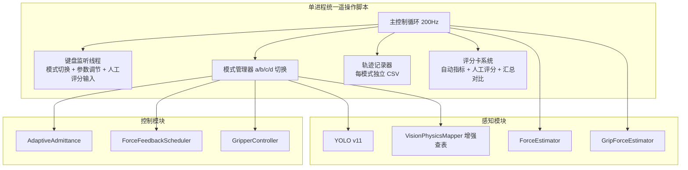
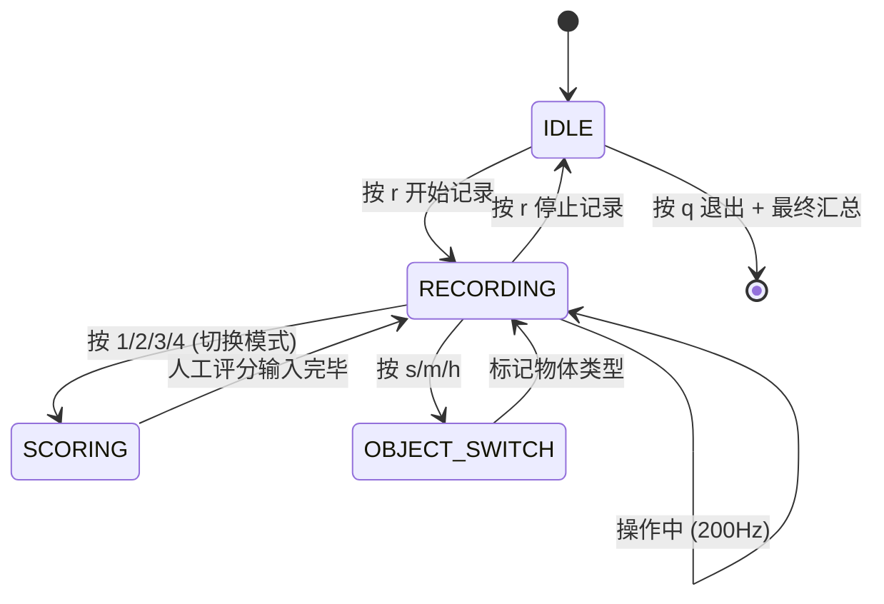
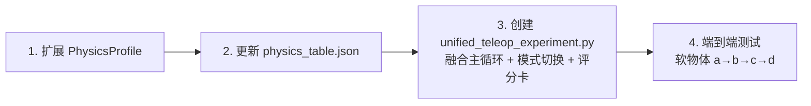

# 统一实验系统架构设计 v3

## 1. 实验流程（用户确认版）

```
放一个物体 → 按键依次切换 a/b/c/d 四种模式 → 评分对比 → 换下一个物体
```

```
┌──────────────────────────────────────────────────────────────────┐
│ 软物体 (海绵/泡沫)                                                  │
│   mode a (固定阻抗) → 操作 → 自动指标 + 人工评分                    │
│   mode b (人工选阻抗) → 操作 → 自动指标 + 人工评分                  │
│   mode c (自动YOLO+查表) → 操作 → 自动指标 + 人工评分               │
│   mode d (YOLO只选夹爪速度) → 操作 → 自动指标 + 人工评分            │
│   → 对比表格: c 综合最优                                           │
├──────────────────────────────────────────────────────────────────┤
│ 中等物体 (香蕉/苹果/塑料瓶)                                          │
│   同上四轮                                                         │
├──────────────────────────────────────────────────────────────────┤
│ 硬物体 (金属块/陶瓷杯/罐头)                                          │
│   同上四轮                                                         │
└──────────────────────────────────────────────────────────────────┘
最终结论: mode c (自适应阻抗) 在所有物体类型上均为最优
```

---

## 2. 核心参数表

| 参数 | 软物体 (soft) | 中等物体 (medium) | 硬物体 (hard) |
|------|-------------|-----------------|-------------|
| 典型示例 | 海绵、泡沫、面包 | 香蕉、苹果、塑料瓶 | 金属块、陶瓷杯、罐头 |
| **K_trans** (平动刚度) | **50 N/m** | **150 N/m** | **800 N/m** |
| **K_rot** (旋转刚度) | **5 Nm/rad** | **10 Nm/rad** | **50 Nm/rad** |
| **D_trans** (平动阻尼) | **14.1 Ns/m** | **24.5 Ns/m** | **56.6 Ns/m** |
| **D_rot** (旋转阻尼) | **4.5 Nms/rad** | **6.3 Nms/rad** | **14.1 Nms/rad** |
| **M** (质量) | **0.5 kg** | **1.0 kg** | **2.0 kg** |
| **gripper_speed** (夹爪速度) | **20 mm/s** | **50 mm/s** | **100 mm/s** |
| **gripper_force_limit** (夹爪力上限) | **8 N** | **20 N** | **60 N** |
| **YOLO 标签** | soft | medium | hard |

---

## 3. 四种模式定义

### Mode a — 固定阻抗
```
YOLO:        ❌ 不启用
力反馈:      ✅ 有，固定增益
导纳/阻抗:   使用 medium 级别固定参数: K_trans=150, K_rot=10, deadband=0.4
夹爪速度:    固定 0.05 m/s
操作员可调:  ❌ 不可调
```

### Mode b — 人工选阻抗
```
YOLO:        ✅ 启用（仅显示，不自动应用）
力反馈:      操作员手动调节 K_fb
导纳/阻抗:   操作员手动调节 K_trans
夹爪速度:    操作员手动调节 gripper_speed
操作员可调:  ✅ 键盘实时调节
```

### Mode c — 自动YOLO+查表（本文方法）
```
YOLO:        ✅ 启用
查表:        ✅ 全自动
力反馈:      ✅ 自适应增益
导纳/阻抗:   ✅ AdaptiveAdmittance 平滑切换
夹爪速度:    ✅ 查表自动
操作员可调:  ❌ 全自动
```

### Mode d — YOLO只选夹爪速度（消融）
```
YOLO:        ✅ 启用
力反馈:      固定增益 (同 mode a)
导纳/阻抗:   固定 (同 mode a)
夹爪速度:    ✅ 查表自动设定（唯一自适应参数）
操作员可调:  ❌
目的:        证明仅夹爪速度自适应不够，阻抗自适应是关键
```

---

## 4. 综合评分卡系统

### 4.1 评分维度（7 维度）

#### 自动计算维度

| # | 指标 | 计算方式 |
|---|------|---------|
| 1 | **用时 (s)** | `t_last − t_first` |
| 2 | **Omega.7 路径长度 (m)** | `Σ‖Δpos‖` 累计 3D 欧氏距离 |
| 3 | **末端外力峰值 (N)** | `max(‖F_ext‖)` |

#### 人工打分维度

| # | 指标 | 范围 | 说明 |
|---|------|------|------|
| 4 | **成功率** | 0 / 1 | 成功抓取并放置 = 1 |
| 5 | **NASA-TLX** | 0-100 | 综合工作负荷（6维度均值） |
| 6 | **损伤评分** | 0-3 | 0 = 无损伤, 3 = 严重损伤 |
| 7 | **人工评分** | 0-3 | 0 = 差, 3 = 优秀 |

### 4.2 预期参考值

| 指标 | 软物体 C 组 | 中等物体 C 组 | 硬物体 C 组 | 固定阻抗 A 组的问题 |
|------|-----------|------------|-----------|-----------------|
| **成功率** | >90% | >85% | >80% | 软物易损坏/硬物易打滑 |
| **完成时间** | 5-8s | 8-12s | 10-15s | 软物可能快但风险高/硬物反复调整慢 |
| **Omega7路径** | 0.3-0.5m | 0.5-0.8m | 0.6-1.0m | 软物可能短但夹坏/硬物长且不稳 |
| **外力峰值** | <5N | 5-15N | 15-30N | 软物可能超限/硬物可能不足 |
| **NASA-TLX** | <30 | 30-50 | 40-60 | 操作者紧张，负荷高 |
| **损伤评分** | 0-0.5 | 0-1 | 0-0.5 | 软物评分高（损伤大） |
| **人工评分** | 2.5-3 | 2-2.5 | 2-2.5 | 整体评分低 |

### 4.3 评分卡交互流程

每次模式切换（一段记录结束）后，终端打印评分卡并等待输入：

```
╔═══════════════════════════════════════════════════════════╗
║               📊 实验评分卡                                ║
╠═══════════════════════════════════════════════════════════╣
║  模式:  mode c (自动YOLO+查表)                            ║
║  物体:  soft (软物体)                                     ║
╠═══════════════════════════════════════════════════════════╣
║  ─────── 自动指标 ───────                                 ║
║  ⏱  完成时间:          12.1 s                             ║
║  📏 Omega.7 路径长度:   0.38 m                            ║
║  💪 末端外力峰值:        4.2 N                             ║
║  📐 平均力反馈:          1.8 N                             ║
╠═══════════════════════════════════════════════════════════╣
║  ─────── 人工评分 ───────                                 ║
║  成功率? (0=失败 / 1=成功):                              ║
║  NASA-TLX (0-100):                                       ║
║  损伤评分 (0=无损伤 ~ 3=严重):                            ║
║  人工评分 (0=差 ~ 3=优秀):                                ║
╚═══════════════════════════════════════════════════════════╝
>>> 请输入人工评分 (格式: 成功 NASA-TLX 损伤 人工, 如 1 25 0 3):
```

### 4.4 评分汇总对比表

同一物体四种模式全部完成后自动打印：

```
╔══════════════════════════════════════════════════════════════════════════╗
║                    📊 软物体 (soft) 四种模式对比                          ║
╠════════╤═══════╤════════╤══════════╤═══════╤══════╤══════╤══════════════╣
║  模式   │ 用时(s)│ 路径(m) │F_ext_max│ 成功率 │NASA-TLX│损伤(0-3)│人工(0-3)│
╠════════╪═══════╪════════╪══════════╪═══════╪══════╪══════╪══════════════╣
║ mode a  │  18.2  │  0.52   │   8.5   │   1   │  45   │   1   │     2       ║
║ mode b  │  15.8  │  0.48   │   7.2   │   1   │  35   │   1   │     2       ║
║ mode c  │  12.1  │  0.38   │   4.2   │   1   │  25   │   0   │     3   ★   ║
║ mode d  │  16.5  │  0.51   │   8.1   │   1   │  40   │   1   │     2       ║
╚════════╧═══════╧════════╧══════════╧═══════╧══════╧══════╧══════════════╝
                                    ★ mode c 综合最优
```

### 4.5 评分数据文件

与对应 CSV 同名，扩展名 `_score.json`：

```json
{
  "mode": "c",
  "object_label": "soft",
  "object_class": "sponge",
  "timestamp": "20260610_143308",
  "auto_metrics": {
    "completion_time_s": 12.1,
    "path_length_m": 0.38,
    "F_ext_peak_N": 4.2,
    "F_fb_mean_N": 1.8
  },
  "manual_scores": {
    "success": 1,
    "nasa_tlx": 25,
    "damage_score": 0,
    "human_score": 3
  }
}
```

---

## 5. 系统架构



---

## 6. 增强型 PhysicsProfile

```python
@dataclass
class PhysicsProfile:
    # === 阻抗控制参数 ===
    K_trans: float          # 平动刚度 (N/m)
    K_rot: float            # 旋转刚度 (Nm/rad)
    D_trans: float          # 平动阻尼 (Ns/m)
    D_rot: float            # 旋转阻尼 (Nms/rad)
    M: float                # 等效质量 (kg)

    # === 力反馈参数 ===
    K_fb: float             # 力反馈增益
    deadband: float         # 力反馈死区 (N)

    # === 夹爪参数 ===
    gripper_speed: float    # 夹爪闭合速度 (m/s)
    gripper_force_limit: float  # 夹爪力上限 (N)

    # === 视觉导纳参数 ===
    admittance_K: float     # 导纳刚度 (N/m)
    approach_speed: float   # 接近速度 (m/s)

    # === 元数据 ===
    label: str              # soft / medium / hard
    description: str
```

### 查表 JSON

```json
{
  "_soft_default": {
    "K_trans": 50, "K_rot": 5, "D_trans": 14.1, "D_rot": 4.5,
    "M": 0.5, "K_fb": 0.3, "deadband": 0.3,
    "gripper_speed": 0.02, "gripper_force_limit": 8.0,
    "admittance_K": 50, "approach_speed": 0.03,
    "label": "soft", "description": "软物体 — 海绵、泡沫、面包"
  },
  "_medium_default": {
    "K_trans": 150, "K_rot": 10, "D_trans": 24.5, "D_rot": 6.3,
    "M": 1.0, "K_fb": 0.5, "deadband": 0.4,
    "gripper_speed": 0.05, "gripper_force_limit": 20.0,
    "admittance_K": 150, "approach_speed": 0.05,
    "label": "medium", "description": "中等物体 — 香蕉、苹果、塑料瓶"
  },
  "_hard_default": {
    "K_trans": 800, "K_rot": 50, "D_trans": 56.6, "D_rot": 14.1,
    "M": 2.0, "K_fb": 1.0, "deadband": 0.5,
    "gripper_speed": 0.10, "gripper_force_limit": 60.0,
    "admittance_K": 800, "approach_speed": 0.08,
    "label": "hard", "description": "硬物体 — 金属块、陶瓷杯、罐头"
  }
}
```

---

## 7. 键盘映射

| 按键 | 功能 |
|------|------|
| `1` / `a` | 切换到 mode a (固定阻抗) |
| `2` / `b` | 切换到 mode b (人工选阻抗) |
| `3` / `c` | 切换到 mode c (自动YOLO+查表) |
| `4` / `d` | 切换到 mode d (YOLO只选夹爪速度) |
| `s` | 标记当前物体 = soft |
| `m` | 标记当前物体 = medium |
| `h` | 标记当前物体 = hard |
| `r` | 开始新记录 (保存旧CSV, 弹出评分卡, 开启新CSV) |
| `↑/↓` | mode b 时调节 K_trans (+10/-10) |
| `←/→` | mode b 时调节 deadband (+0.05/-0.05) |
| `[` / `]` | mode b 时调节 gripper_speed (+0.01/-0.01) |
| `q` | 退出 (自动保存 + 最终汇总) |

---

## 8. 模式切换状态机



---

## 9. CSV 数据格式

### 文件命名

```
data/trajectory_{timestamp}_{mode}_{object_label}.csv
data/trajectory_{timestamp}_{mode}_{object_label}_score.json
```

### CSV 字段

```csv
timestamp_ms, loop_count,
mode, object_label, object_class_name,
omega_x, omega_y, omega_z, omega_qw, omega_qx, omega_qy, omega_qz,
omega_gripper_deg, omega_button,
F_ext_x, F_ext_y, F_ext_z,
F_fb_x, F_fb_y, F_fb_z,
f_grip, f_grip_filtered, contact_detected,
K_trans, K_rot, D_trans, D_rot, deadband, K_fb,
target_x, target_y, target_z, actual_x, actual_y, actual_z,
pos_error_x, pos_error_y, pos_error_z,
gripper_width, gripper_speed,
is_grasping
```

---

## 10. 文件清单

### 需创建的新文件

| 文件 | 说明 |
|------|------|
| `experiment/unified_teleop_experiment.py` | **核心文件**: 统一遥操作实验脚本 = interactive_teleop.py + shared_control_node.py + 模式切换 + 评分卡 |
| `experiment/enhanced_physics_table.json` | 增强查表（含 K_rot/D_trans/D_rot/M/gripper_speed 等） |

### 需修改的现有文件

| 文件 | 修改内容 |
|------|---------|
| `biaoding/vision_physics_mapper.py` | PhysicsProfile 增加 K_rot/D_trans/D_rot/M/K_fb/gripper_speed/gripper_force_limit |
| `biaoding/physics_table.json` | 更新所有条目以匹配新参数表 |

### 可复用代码

| 来源 | 复用内容 |
|------|---------|
| `my_test/interactive_teleop.py` | 键盘监听线程 + 轨迹 CSV 记录 + smooth_transition |
| `plans/shared_control_node.py` | 主控制循环 + YOLO 子进程 + 所有控制模块 |
| `my_test/omega7_trajectory_metrics.py` | `compute_trajectory_metrics()` 用时/路径长度自动计算 |
| `plans/grip_force_estimator.py` | 接触检测 + f_grip |
| `plans/force_estimator.py` | 外力估计 |
| `plans/force_feedback_scheduler.py` | 力反馈计算 |
| `plans/adaptive_admittance.py` | 自适应导纳平滑 |
| `biaoding/vision_physics_mapper.py` | YOLO + 查表 |

---

## 11. 开发优先级



## 12. 待确认

| # | 问题 | 当前假设 |
|---|------|---------|
| 1 | mode a 的固定参数用哪个级别？ | medium (K_trans=150, K_rot=10, deadband=0.4) |
| 2 | 每模式操作几次？ | 操作员自行决定，按键切换 |
| 3 | mode b 中可调哪些参数？ | K_trans, deadband, K_fb, gripper_speed |
| 4 | 变形量谁测？ | 用户自行测量，不纳入代码 |
| 5 | 旧 shared_control_node.py 是否改动？ | 不改动，新建 unified_teleop_experiment.py |
