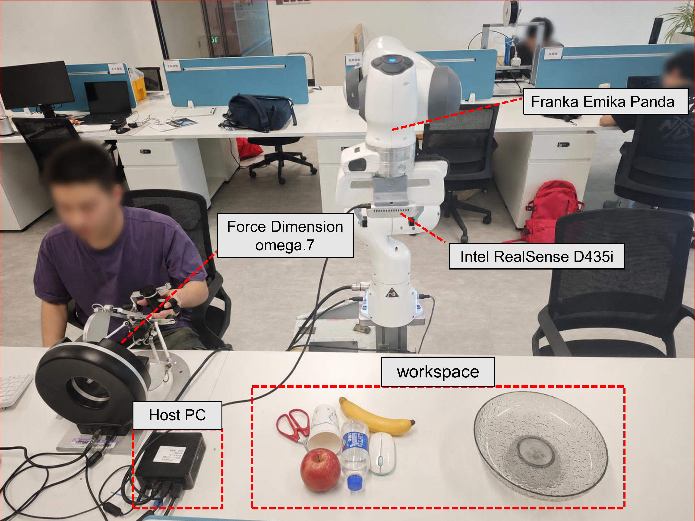
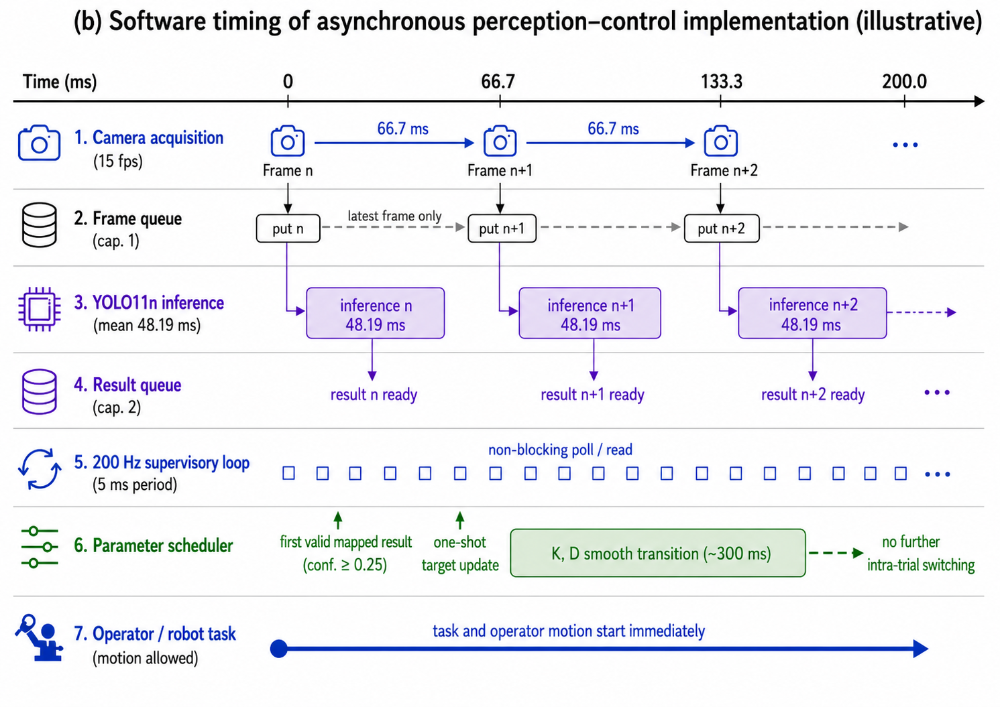
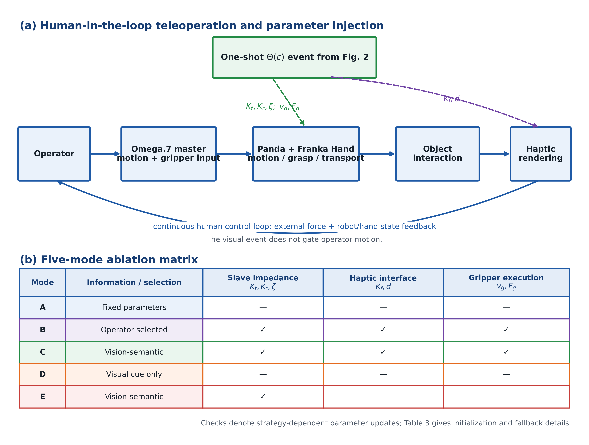
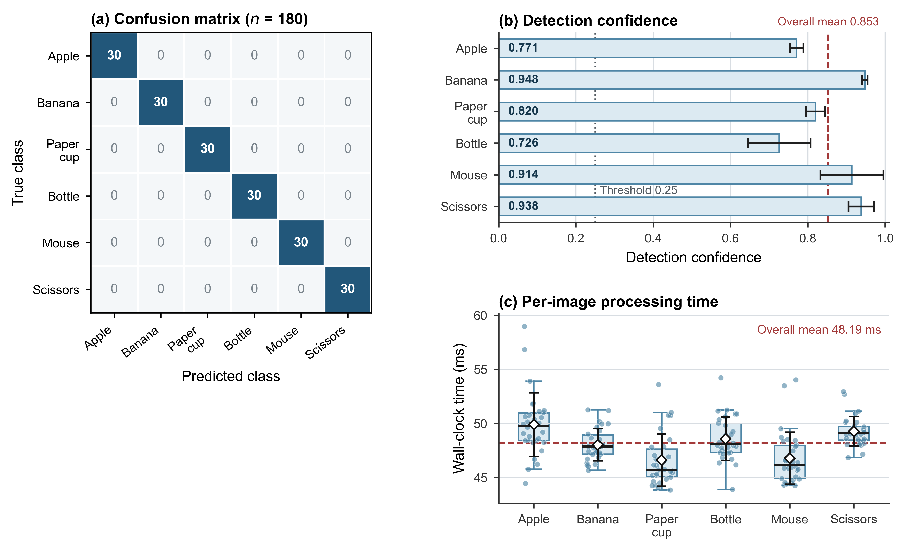
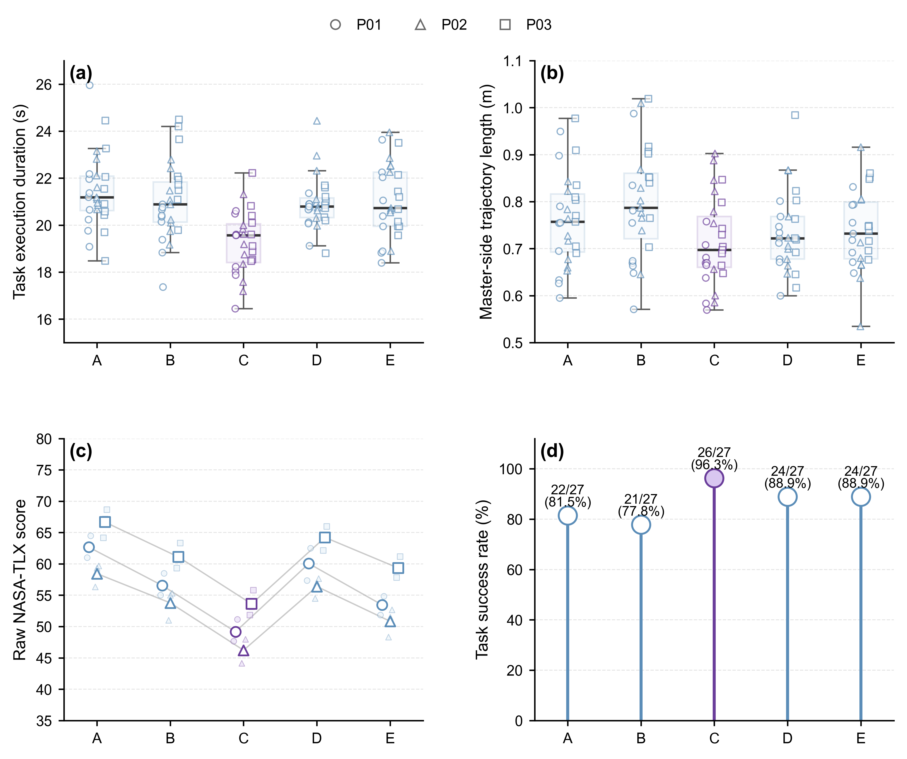
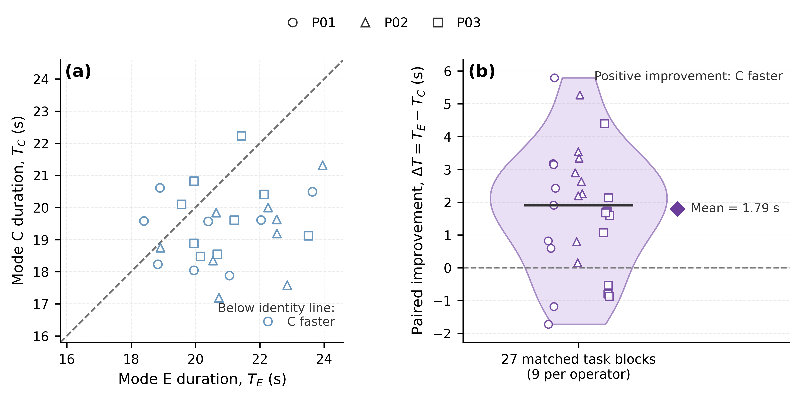
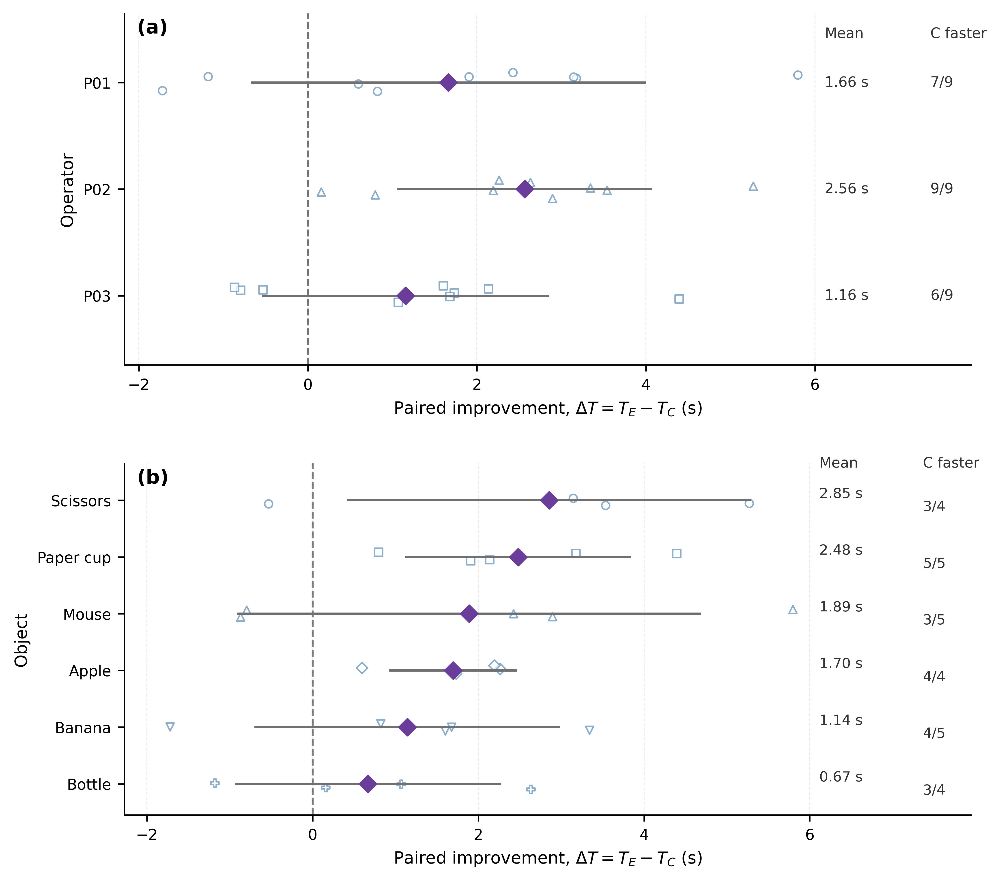

# 面向异质对象触觉遥操作的对象条件化跨通道机电参数重配置

## 摘要

固定遥操作参数难以适应脆弱性、几何形状和抓取需求各异的对象。本文提出一种对象条件化框架，在统一操作策略下协同配置从端笛卡尔阻抗、面向操作者的触觉设置以及夹爪执行参数。系统采用单槽图像队列、双槽结果队列和非阻塞轮询，将15 fps视觉感知与名义200 Hz监督环解耦。任务启动后，第一个置信度超过阈值且具有有效策略映射的检测结果触发一次性参数更新，随后在该次试验内锁定所选策略。3名操作者围绕6种对象和5种控制模式完成了135次抓取—转运试验。完整协同模式取得最短的完成时间中位数（19.57 s，IQR [18.41, 20.05]）、最高的观测成功率（26/27，96.3%）以及最低的Raw NASA-TLX评分（48.67，IQR [47.67, 51.83]）。与仅阻抗调度相比，该模式使平均完成时间缩短1.79 s（匹配区组bootstrap 95% CI [1.10, 2.51] s），即降低8.5%。对于3名操作者和6种对象，模式C均表现出更短的完成时间。在本次仅包含3名操作者的实验范围内，将主端触觉接口和夹爪执行与从端阻抗协同配置，相较仅阻抗调度改善了任务级表现。

**关键词：** 机电系统；触觉遥操作；对象条件化重配置；跨通道协同；阻抗控制；人在环实验

---

## 1 引言

遥操作利用人的判断能力完成自主机器人仍难以胜任的远程操作任务，尤其适用于危险环境、柔性制造和非结构化场景。触觉反馈将远端接触信息传递给操作者，可辅助判断接触状态、抓取稳定性和滑移。已有研究考察了双边遥操作的稳定性与透明度，以及控制器对环境、操作者和任务的适应问题[1,2]。然而，在实际系统中，这些控制功能还必须与视觉感知、机械执行和人机界面协同运行。

对于异质对象，单一参数组合需要在柔和接触、定位稳定性和转运稳定性之间进行权衡。较低的刚度和抓取力能够减轻接触冲击，但可能削弱定位和转运稳定性；较高的参数值可能提高操作速度，却会增加冲击或变形风险。本文选取苹果、香蕉、纸杯、瓶子、鼠标和剪刀作为6种测试对象，用于表征柔顺性、触觉交互和夹爪执行方面的不同任务需求。该受控对象集使我们能够评估异质抓取任务中的对象条件化协同参数重配置。

阻抗控制调节位移、速度和交互力之间的关系，使机器人在接触过程中保持柔顺[3]。固定阻抗易于实现，但不可避免地是不同对象需求之间的折中。变阻抗方法则根据任务状态、接触信息或学习策略调整刚度和阻尼，同时需要考虑时变参数对稳定性的影响[4,5]。在遥操作中，操作者可直接调节从端阻抗[6]；遥阻抗方法则将人的运动和阻抗信息映射到远端机器人[7–9]。这类连续自适应通常依赖人体测量、示教数据或接触后的反馈信息。

视觉信息也已被用于选择或调整机器人阻抗。视觉—语音遥阻抗方法依据对象属性选择从端阻抗，同时保留操作者确认或修正步骤[10]；视觉阻抗控制则在视觉特征空间中融合视觉与力信息[11]。在工作流程层面，意图推断和面向任务的共享控制被用于减少人工决策[12]。近期研究还依据对象几何、材料及其与环境的关系生成刚度[13]，或利用视觉、注视和语言输入生成任务相关的刚度矩阵[14]。这些方法主要将任务信息转换为从端刚度、阻抗或控制权分配决策。

自动切换和被动仲裁进一步决定控制权如何分配以及何时发生变化[15,16]。触觉接口已被用于评估远程操作性能[17]；相关研究还涉及柔顺装配[18]、人体与环境刚度估计[19]、转动阻抗[20]、比例缩放过渡[21]、基于视觉的触觉反馈[22]、多刚度接口[23]、面向网络时延的共享自主[24]以及受限视觉条件下的触觉支持[25]。上述研究通常调整单个控制或交互环节。相比之下，较少研究将对象语义作为统一任务条件，同时配置从端机械响应、面向操作者的触觉接口和夹爪执行。因此，本文关注的核心问题并非视觉能否调节阻抗，而是策略层语义决策能否将这三个机电子系统作为统一参数包进行配置，并在视觉语义显示、人工选择和仅阻抗调度之外带来任务级收益。

为解决上述问题，本文提出一种面向异质对象触觉遥操作的对象条件化跨通道机电参数重配置框架，用于试验早期的参数准备。系统采用“对象语义—操作策略—联合参数向量”的三级映射，将任务信息转换为从端阻抗、主端触觉接口和夹爪执行的协同设置。任务开始后，第一个置信度超过阈值且具有有效策略映射的检测结果触发一次目标参数更新；随后在该次试验中锁定策略，以避免后续识别波动引起反复切换。当有效视觉事件足够早到达时，该设计旨在使参数包在接触前准备就绪；但现有正式试验记录无法逐试验验证这一时序条件。实验设置固定参数、操作者选择、完整跨通道重配置、固定参数下的视觉语义提示以及仅阻抗调度5种模式，用于区分主要工作流程组成部分的作用。具体而言，C–D比较检验自动配置相对于已显示语义提示的附加作用，C–E比较则检验完整参数包相对于仅阻抗调度的作用。

从机电系统角度看，本文将感知、控制、触觉和抓取执行视为一个集成重配置问题。在线阶段采用离散的事件触发参数更新，而非接触后的连续优化或持续视觉伺服。本文的贡献不止于参数查表，而在于建立对象语义与从端阻抗、主端触觉接口和夹爪执行协同配置之间的策略层联系，并结合适用于人在环遥操作的异步实现和策略锁定机制。实验进一步检验该完整配置能否在仅阻抗调度之外带来任务级收益。

基于上述设计，本文围绕以下研究问题展开：

- **RQ1：** 完整跨通道模式C是否优于固定参数模式A、操作者选择模式B以及仅视觉语义提示模式D？
- **RQ2：** 完整跨通道模式C是否优于仅阻抗模式E？
- **RQ3：** 是否可以在不阻塞名义200 Hz监督更新的情况下集成视觉推理？
- **RQ4：** C–E差异的方向是否在3名操作者和6种对象上保持一致？

本文的主要贡献如下：

1. **策略层机电参数协同。** 将对象相关配置从单一从端阻抗扩展到三个协同子系统：从端机械响应、面向操作者的触觉接口和夹爪执行。统一操作策略为三个子系统分配一致的参数包；这种协同并非由通道间动力学耦合模型推导得到。
2. **受约束参数空间中的三级语义映射。** 将对象类别归入易损优先、折中和稳定优先三类操作策略，并映射至受硬件能力、任务风险和预实验运行范围约束的七维联合参数向量。
3. **异步、事件触发的一次性早期重配置。** 15 fps图像采集和独立YOLO11n推理通过有界队列与名义200 Hz监督更新通信。非阻塞轮询避免监督线程等待感知结果，策略锁定避免识别波动造成试验内反复切换，约300 ms的过渡用于平滑刚度和控制器阻尼缩放参数的变化。
4. **五模式人在环系统级评估。** 在Omega.7–Panda平台上实现5种模式，用于区分视觉语义显示、人工策略选择、仅阻抗自适应和完整跨通道重配置的作用。实验包含3名操作者、6种对象和135次试验。

---

## 2 方法与系统实现

### 2.1 机电系统架构与异步执行

实验平台包括Omega.7力反馈主端、Franka Panda七自由度机器人、Franka Hand夹爪[26]、Intel RealSense D435i相机和控制计算机（图1）。D435i以424 × 240像素、15 fps输出彩色图像，未使用深度流。控制计算机执行视觉检测、名义200 Hz监督式遥操作更新、参数设置、触觉渲染、夹爪控制和数据记录。

**图1.** 实验平台，包括Omega.7主端、Franka Panda机器人与Franka Hand夹爪、D435i相机和控制计算机。相机以15 fps提供424 × 240彩色图像。

图2以示意时序图展开了异步软件路径。

**图2.** 异步感知—控制实现的示意时序。彩色图像以15 fps采集，经单槽图像队列传递至独立YOLO11n进程；在受控视觉测试中，单幅图像平均墙钟处理时间为48.19 ms。类别与置信度结果通过双槽结果队列返回。名义5 ms监督更新以非阻塞方式轮询该队列。第一个达到置信度阈值的结果经类别—策略映射转换后形成一次性策略事件。模式C和E更新其允许的参数，模式D保持固定参数并显示语义结果。平移刚度、转动刚度和控制器阻尼缩放参数按照约300 ms的smoothstep曲线过渡，已启用的触觉接口和夹爪参数在事件发生时立即变化。后续检测不再改变同一试验中的策略。低置信度或无检测结果时维持初始化状态；检测到未显式映射的类别时采用折中默认策略。

RGB图像每66.7 ms采集一次，并写入容量为1的图像队列，以避免陈旧图像累积。YOLO11n在独立进程中运行，并通过容量为2的队列返回类别与置信度结果。名义200 Hz监督环每5 ms轮询一次队列，不等待推理完成。因此，相机采集、视觉感知和操作者运动并行进行。48.19 ms表示单幅图像的平均墙钟处理时间，并非相机采样周期。正式试验记录保留了任务结果和激活参数状态；详细视觉事件历史以及同步的策略事件—接触时间戳不在正式记录范围内。

**表1.** 多速率机电系统的执行与通信特性。

| 模块 | 频率/时延 | 输入 | 输出 | 是否阻塞监督环？ |
|:---|---:|:---|:---|:---:|
| 主端输入 | 200 Hz | Omega.7平移位置与按钮 | $\Delta\mathbf{p}_m$ | 否 |
| 从端控制 | 200 Hz | $\mathbf{p}_d,\mathbf{R}_d,\mathbf{K},\mathbf{D}$ | Panda期望位姿/阻抗命令 | 否 |
| 图像采集 | 15 fps（66.7 ms/帧） | D435i彩色流 | 424 × 240图像 | 否 |
| YOLO11n推理 | 平均48.19 ms/图像 | 最新可用图像 | 类别与置信度 | 否（独立进程） |
| 策略调度 | 监督环读取的首个达阈值结果 | 类别与置信度 | 目标$\Theta(c)$ | 否 |
| 触觉渲染 | 200 Hz | $\mathbf{F}_{\mathrm{ext}},K_f,d,\theta_{\Omega}$ | Omega.7力向量 | 否 |
| 夹爪命令 | 按钮事件 | 夹爪输入、$v_g,F_g$ | Franka Hand命令 | 否 |

### 2.2 主从映射与机电通道实现

系统仅将Omega.7的平移运动映射到Panda。从主端位置增量到从端期望位置的更新为

\[
\Delta\mathbf{p}_m(k)=\mathbf{p}_m(k)-\mathbf{p}_m(k-1),
\]

\[
\mathbf{p}_d(k)=\mathbf{p}_d(k-1)+S\mathbf{C}\Delta\mathbf{p}_m(k),
\]

其中位置缩放系数$S=3.0$，$\mathbf{C}=\mathrm{diag}(-1,-1,1)$。每次试验中，末端期望姿态$\mathbf{R}_d$保持为预设值，不映射操作者主动转动输入。笛卡尔阻抗控制作用于六维位姿误差：

\[
\mathbf{w}_c=\mathbf{K}(c)\mathbf{e}+\mathbf{D}(c)\dot{\mathbf{e}},
\]

\[
\mathbf{K}(c)=\mathrm{diag}(K_t,K_t,K_t,K_r,K_r,K_r),
\]

其中$\mathbf{e}$包含相对于$\mathbf{p}_d$的平移误差以及相对于固定$\mathbf{R}_d$的转动误差。因此，$K_r$调节系统对转动扰动的抵抗能力和保持预设姿态的能力，不用于缩放操作者输入的转动命令。

控制器根据当前对角刚度矩阵和标量API参数$\zeta$在内部生成阻尼矩阵。在本文实现中，

\[
\mathbf{D}(c)=2\zeta(c)\sqrt{\mathbf{K}(c)},
\]

其中平方根对对角元素逐元素计算。本文将$\zeta$定义为控制器实现所采用的无量纲阻尼缩放参数；由于未辨识或设置笛卡尔等效质量/惯量矩阵，因此不赋予其笛卡尔临界阻尼比的物理解释。

Franka内部状态估计器提供单位为N的从端外力估计$\mathbf{F}_{\mathrm{ext}}$。第$i$个方向的主端基础力反馈命令为

\[
u_{h,i}^{\mathrm{base}}=
\operatorname{sgn}\!\left(K_fF_{\mathrm{ext},i}\right)
\max\!\left(\left|K_fF_{\mathrm{ext},i}\right|-d,0\right),
\quad i\in\{x,y,z\},
\]

其中$K_f$为无量纲力缩放系数，$d$为单位为N的逐轴死区阈值。

系统仅根据Omega.7夹钳角度$\theta_{\Omega}$生成一个正$z$向附加提示：

\[
\alpha_g=\operatorname{clip}\!\left(
\frac{\theta_{\max}-\theta_{\Omega}}
{\theta_{\max}-\theta_{\min}},0,1\right),
\]

\[
u_g=\min\!\left(\alpha_gG_{\mathrm{cue}}F_{\mathrm{cue,max}},F_{\mathrm{cue,max}}\right),
\qquad
u_{h,z}=u_{h,z}^{\mathrm{base}}+u_g.
\]

当$G_{\mathrm{cue}}=0.3$、$F_{\mathrm{cue,max}}=1.0$ N时，实际提示力为$u_g=0.3\alpha_g$ N，范围为$[0,0.3]$ N。该提示在名义200 Hz监督周期中持续更新；Omega.7夹钳越接近张开端，提示力越大。该信号编码的是Omega.7主端夹钳开度，不包含Franka Hand实际开度、主从开度误差、抓取力或按钮状态的测量信息。

对于Franka Hand执行，$v_g$作为`grasp(width, speed, force, epsilon_inner, epsilon_outer)`中的`speed`参数，同时也用于张开和非抓取位置调整时的`move(width, speed)`。策略参数$F_g$对应`grasp()`中单位为N的请求`force`设定，不是独立测得的指尖接触力。抓取目标宽度设为0 m。接触并成功进入`HOLDING`状态后，程序不再周期性重复发送该命令；夹爪在内部维持抓取，直至调用`stop()`并执行后续释放或张开命令。

三个参数通道作用于遥操作系统的不同环节。Panda阻抗决定从端对位姿误差和扰动的响应；Omega.7参数决定如何向操作者呈现估计外力；Franka Hand参数决定抓取执行。本文方法根据同一操作策略并行分配这些设置。因此，协同性由策略层的一致参数包实现，通道之间未推导动力学耦合约束或主从阻抗匹配定律。本文未评估触觉透明度和闭环指尖力精度。

### 2.3 对象条件化跨通道机电参数重配置

框架采用“检测对象类别—操作策略—联合参数向量”的三级映射：

\[
\Theta(c)=\{K_t,K_r,\zeta,K_f,d,v_g,F_g\}.
\]

三类策略表征综合抓取风险，并非仅按材料软硬划分。苹果和香蕉被划入易损优先策略，是因为需要较低的接触冲击、闭合速度和请求抓取力，以降低挤压和变形风险，同时仍需考虑其光滑表面的滑移风险。纸杯和瓶子采用折中策略。纸杯在过大作用力下容易变形，但设置过低又可能造成夹持不牢；瓶子同样需要在柔和操作和抗滑稳定性之间折中。鼠标和剪刀采用稳定优先策略，因为其光滑或不规则表面、转运要求，以及剪刀的细长几何形状，使位姿保持和抓取稳定性更为重要。这些分配仅针对本文对象、平台和任务。

**表2.** 三类面向操作策略的参数设置。

| 策略 | 对象 | $K_t$ (N/m) | $K_r$ (N·m/rad) | $\zeta$ | $K_f$ | $d$ (N) | $v_g$ (m/s) | $F_g$ (N) |
|---|---|---:|---:|---:|---:|---:|---:|---:|
| 易损优先 | 苹果、香蕉 | 50 | 5 | 0.8 | 0.2 | 0.3 | 0.02 | 8 |
| 折中 | 纸杯、瓶子 | 150 | 10 | 1.0 | 0.5 | 0.4 | 0.05 | 15 |
| 稳定优先 | 鼠标、剪刀 | 200 | 13 | 1.2 | 0.7 | 0.5 | 0.10 | 20 |

当监督环读取到第一个达到阈值的结果后，当前模式允许更新的参数只更新一次，并在该次试验剩余阶段保持锁定。平移刚度、转动刚度和阻尼缩放参数在约$T_s=0.30$ s内按照smoothstep曲线插值。令$\tau=\operatorname{clip}((t-t_0)/T_s,0,1)$、$s(\tau)=3\tau^2-2\tau^3$，则$q\in\{K_t,K_r,\zeta\}$按下式更新：

\[
q(t)=q_0+s(\tau)(q_\mathrm{target}-q_0).
\]

在过渡期间，控制器根据当前$\mathbf{K}$和$\zeta$重新计算$\mathbf{D}$。已启用的$K_f$、$d$、$v_g$和$F_g$在策略事件发生时立即改变。由于操作者运动不受感知结果门控，本文将该机制描述为任务开始后的一次性更新。现有日志无法重建每次试验中策略事件相对于首次接触的具体时序。

类别到策略的关系由人工设计。当已有检测器能够稳定输出新对象标签时，可直接将该标签加入映射，而无需重新训练控制器；当检测器无法可靠识别或区分对象时，需要先重新训练或替换检测器，再为其分配策略。当前系统不会针对未见类别自动推断脆弱性、摩擦或其他物理属性。

### 2.4 实验模式与参数依据

固定基线向量为

\[
\Theta_0=(150,\ 10,\ 1.0,\ 0.5,\ 0.3,\ 0.10,\ 20),
\]

其元素顺序与$\Theta(c)$一致。表3汇总五种模式的默认界面、调度范围和回退行为。

**表3.** 五种实验模式的界面、参数作用范围与回退行为。

| 模式 | 默认显示的视觉界面 | 参数动作 | 无检测或置信度$<0.25$ | 检测到未显式映射类别 |
|:---:|:---|:---|:---|:---|
| A：固定参数 | 无 | 全程保持$\Theta_0$ | 不适用 | 不适用 |
| B：操作者选择 | 无 | 任务计时开始后，操作者识别对象并选择一套完整策略，随后设置全部七个参数 | 不使用视觉 | 不使用视觉 |
| C：完整跨通道 | 类别、策略标签、置信度和彩色框 | 更新全部七个参数 | 保持初始化$\Theta_0$ | 采用折中默认策略 |
| D：仅视觉语义提示 | 类别、策略标签、置信度和彩色框 | 不更新参数，保持$\Theta_0$ | 保持$\Theta_0$ | 显示折中默认策略标签，参数仍保持$\Theta_0$ |
| E：仅阻抗 | 类别、策略标签、置信度和彩色框 | 仅更新$K_t$、$K_r$和$\zeta$；$K_f,d,v_g,F_g$保持$0.5,0.3,0.10,20$ | 保持初始化$\Theta_0$ | 仅对阻抗通道采用折中默认策略 |

相机窗口可通过按`q`关闭。表3描述的是默认软件行为；正式试验日志未记录窗口状态。

参数值被设定为离散运行点。正式实验前，两名研究人员在代表性对象上筛选候选组合，排除出现持续振荡、明显触觉不适、抓取失败或可见物体损伤的设置。最终参数在135次正式试验前固定。易损优先工作点采用50 N/m平移刚度、8 N请求抓取力和0.02 m/s夹爪速度，以降低接触和闭合强度；折中工作点采用150 N/m、15 N和0.05 m/s，在过度变形与夹持不可靠之间取得平衡；稳定优先工作点采用200 N/m、20 N和0.10 m/s，以加强位姿保持和转运稳定性。这些运行点是针对当前装置经定性筛选得到的参数组合，不应解释为特定材料的无损伤极限。

**表4.** 参数设计空间：高低取值的物理含义、工程约束及本文使用值。

| 参数 | 低值含义 | 高值含义 | 工程约束 | 使用值 |
|:---|:---|:---|:---|:---|
| $K_t$ | 更高平移柔顺性、更低冲击 | 更高位置稳定性 | Panda稳定阻抗控制范围 | 50 / 150 / 200 |
| $K_r$ | 围绕固定期望姿态具有更高转动柔顺性 | 更强转动扰动抵抗能力 | 稳定转动响应 | 5 / 10 / 13 |
| $\zeta$ | 较低控制器阻尼缩放 | 较高控制器阻尼缩放 | 避免持续振荡和过度迟缓 | 0.8 / 1.0 / 1.2 |
| $K_f$ | 较弱的外力触觉呈现 | 较强的外力触觉呈现 | Omega.7可接受响应 | 0.2 / 0.5 / 0.7 |
| $d$ | 对小力更敏感 | 更强的小信号抑制 | 触觉接口抖动与噪声 | 0.3 / 0.4 / 0.5 |
| $v_g$ | 更低冲击的夹爪运动 | 更快建立抓取 | Franka Hand执行范围 | 0.02 / 0.05 / 0.10 |
| $F_g$ | 较低请求抓取力 | 较高请求抓取力 | Franka Hand力设定 | 8 / 15 / 20 |

### 2.5 执行流程

**算法1：对象条件化跨通道参数调度**

1. 加载表3所示的模式初始化设置，启动名义200 Hz监督更新；仅在模式C–E中启动视觉进程。
2. 异步运行对象检测。监督线程以非阻塞方式读取结果并检查置信度阈值。
3. 若没有检测结果达到阈值，则保持初始化状态；若检测标签没有显式类别—策略映射，则分配折中默认策略。
4. 使用第一个达到阈值的策略，更新当前模式允许作用的参数通道。$K_t$、$K_r$和控制器参数$\zeta$在约300 ms内插值，已启用的触觉接口和夹爪设置立即更新。
5. 在该次试验剩余阶段锁定策略，继续遥操作、触觉渲染和夹爪执行，不再进行视觉切换。
6. 记录激活参数状态、任务轨迹、持续时间和结果，并在规定的终止流程后复位系统。

### 2.6 有界回退与安全措施

若对象被误分类为另一个已知类别，系统会调用该类别对应的策略。检测到未显式映射标签时采用折中默认策略；无检测或低置信度时不更新参数。所有回退结果均被限制在三组预定义参数集之一，但有界参数集对于被误分类的对象仍可能不适用。逐试验视觉事件不在正式记录范围内，因此主实验中的误分类和默认分支触发未被逐次记录。

机器人碰撞检测、Franka Hand力设定、退出时的零力命令、标准化初始位姿和手动急停用于支持实验运行。Omega.7通过其标准驱动与硬件配置运行。主端夹钳开度附加提示按实现映射限制在0.3 N以内。基础力反馈命令发送前没有额外的软件饱和层，且未记录饱和状态。

## 3 实验设计

### 3.1 假设与评价逻辑

主要假设为模式C能够缩短任务完成时间。成功率和Raw NASA-TLX用于考察这一趋势是否同时反映在任务成功和主观工作负荷上；主端轨迹长度和暂停次数作为探索性过程指标。C–E比较用于评价加入触觉接口和夹爪参数后，是否能够在仅阻抗调度所实现的效果之外进一步获得时间优势。

### 3.2 操作者与测试对象

3名操作者完成主实验（P01–P03，年龄23–24岁，2男1女，均为右利手）。Omega.7位于操作者左侧，所有试验均使用左手操作。操作者均接受过基础遥操作训练，并在每次正式实验前完成额外10–15 min熟悉练习，包括主端运动、夹爪输入和任务流程。所有参与者均在实验前提供书面知情同意。

6种对象用于表征不同的接触、抓取和转运需求，并被分配至易损优先、折中或稳定优先策略。该分配仅服务于本实验参数设置，不应解释为对材料属性的一般分类。

| 对象 | 策略 | 质量(g) | 表面 | 尺寸(mm) | 主要任务风险 |
|:---:|:---:|---:|:---|:---|:---|
| 苹果 | 易损优先 | ~200 | 光滑 | Ø70–80 | 冲击或滑移，需要柔和接触 |
| 香蕉 | 易损优先 | ~120 | 光滑 | 20 × 180 | 压缩变形与滑移 |
| 纸杯 | 折中 | ~5 | 纸质 | Ø75 × 90 | 易变形，同时需要稳定夹持 |
| 瓶子 | 折中 | ~30 | 光滑塑料 | Ø65 × 200 | 滑移，需要兼顾效率与稳定性 |
| 鼠标 | 稳定优先 | ~100 | 光滑塑料 | 65 × 120 × 35 | 刚性不规则表面，转运滑移 |
| 剪刀 | 稳定优先 | ~150 | 金属与塑料 | 50 × 170 × 15 | 刚性细长几何，姿态要求高 |

### 3.3 实验模式与试验结构

实验包括五种模式：

| 模式 | 配置 | 默认视觉界面 | 目的 |
|:---:|:---|:---|:---|
| A | 固定参数 | 无 | 固定控制基线 |
| B | 操作者选择完整策略 | 无 | 人工选择工作流程基线 |
| C | 完整跨通道调度 | 类别、策略、置信度和检测框 | 本文方法 |
| D | 固定参数下的视觉语义提示 | 与C相同 | 区分自动参数重配置与显示语义提示 |
| E | 仅调度$K_t$、$K_r$和$\zeta$ | 与C相同 | 比较完整跨通道与仅阻抗重配置 |

模式C、D和E采用相同的默认视觉语义界面。因此，C–D比较完整自动参数重配置与仅显示语义信息，C–E比较完整跨通道重配置与仅阻抗重配置，且设计上不存在界面差异。D–A比较的是由类别、映射策略、置信度和检测框共同组成的完整视觉语义提示，不能单独隔离类别名称的作用。模式B在计时开始后进行人工对象判断和按钮选择，完成选择后才允许机器人运动。因此，B–C差异同时包含选择流程自动化和视觉界面呈现差异；实验未单独记录人工决策时间。

实验包含27个匹配任务区组。每个区组由固定的操作者、对象和重复编号定义，并在A–E五种模式下各进行1次试验，共$27\times5=135$次。对于每名操作者的每个策略类别，两个对象以固定2:1比例分配至3次重复；同一操作者和策略下，该分配在五种模式中保持一致，以保证匹配比较，并在不同操作者间交换2:1方向。由此在每类策略内部形成近似5:4平衡：

| 策略 | 对象 | 区组数 | 试验数（×5模式） |
|---|---|---:|---:|
| 易损优先 | 苹果 | 4 | 20 |
| 易损优先 | 香蕉 | 5 | 25 |
| 折中 | 纸杯 | 5 | 25 |
| 折中 | 瓶子 | 4 | 20 |
| 稳定优先 | 鼠标 | 5 | 25 |
| 稳定优先 | 剪刀 | 4 | 20 |
| 合计 | 6种对象 | 27 | 135 |

五种模式的顺序在“操作者×策略”组次层面预先设计，共采用9种不同排列，不使用单一固定顺序。该排程将各模式分散到较早和较晚位置，但并非完整拉丁方设计。具体顺序见补充表S2。由于操作者仅有3名，顺序、对象和操作者效应不能被完全分离。

### 3.4 任务与流程

每次试验前，实验人员将对象手动放置在预定义工作区域内，并保持近似规定朝向。因此，不同试验之间存在小幅位置和姿态复位误差，但所有模式采用相同放置流程。系统仅映射主端平移运动，Panda末端期望姿态在试验中保持固定。

每次试验包括复位、接近、抓取、转运、释放和终止（图3）。模式C–E中，相机采集、视觉推理和遥操作在任务开始时并发启动，视觉输出不门控操作者运动。模式B中，计时在对象判断和策略选择前开始，操作者完成按钮选择后才能移动机器人；系统未单独记录选择完成时刻。

一次试验在抓取、转运和放置过程中未发生掉落、可见滑移或可见损伤时判为成功。物体完全脱离夹爪判为掉落；抓取或转运过程中物体相对夹爪发生肉眼可见位移判为滑移；出现明显压痕、挤压变形或其他可见损伤判为损伤。一名指定研究人员依据预定义标准进行现场实时判定。试验未进行系统录像，结果标签也未进行独立或盲法复核。

失败不会立即停止计时。发生掉落后不允许重新抓取；记录失败后，操作者继续执行规定的返回与终止流程，直至机器人和夹爪达到预定义终态。因此，成功和失败试验使用相同计时终点。系统记录主端轨迹、夹爪输入、激活控制参数、任务持续时间和结果。

**图3.** 人在环任务与五种实验模式。(a) 一次性策略事件$\Theta(c)$在不门控操作者运动的情况下更新允许作用的从端阻抗、主端触觉接口和夹爪参数。(b) 模式A–E分别采用固定参数、操作者选择、完整调度、固定参数下视觉语义提示和仅阻抗调度。勾号表示各模式更新的通道；初始化和回退设置见表3。

### 3.5 评价指标

任务完成时间为主要终点。成功率作描述性报告，主端轨迹长度和暂停次数作为探索性过程指标。主观负荷采用Raw NASA-TLX[27]评估。六个维度均使用0–100评分，并以未加权算术平均计算Raw NASA-TLX总分。

每名操作者在完成某一“策略×模式”条件下的3次试验后立即填写1份问卷。3次试验按操作者特定的2:1比例混合该策略下的两个对象。因此，工作负荷数据包含$3$名操作者$\times3$类策略$\times5$种模式$=45$份问卷。该评分表示各模式下策略层面的工作负荷，不能支持对象级工作负荷比较。

视觉性能通过独立受控图像测试中的类别准确率、类别—策略映射准确率、置信度和单图处理时间表征。暂停定义为主端速度持续至少0.30 s低于0.005 m/s。暂停通过对约200 Hz采样的原始主端轨迹进行速度差分检测。

### 3.6 统计分析

首先采用Friedman检验比较五种模式的完成时间。总体检验显著后，使用配对Wilcoxon符号秩检验，并采用Holm–Bonferroni方法校正多重比较。配对单位为具有相同操作者、对象和重复编号的任务区组。对于主要C–E比较，报告配对均值差、相对变化以及对匹配任务区组进行10,000次重采样得到的95% bootstrap置信区间，同时检查每名操作者的效应方向。留一操作者分析用于判断总体差异是否由单一操作者主导。Raw NASA-TLX在每种模式的9个“操作者×策略”单元间作描述性配对，每个分数概括3次混合对象试验，不计算bootstrap区间。由于27个任务区组嵌套于仅3名操作者，推断检验描述的是当前样本中的重复测量差异，不支持操作者总体层面的推断。结果同时报告中位数[IQR]和均值±SD。轨迹长度和暂停次数作为探索性指标，成功率作描述性处理。图4–7由冻结数据通过经核验的Python/Matplotlib脚本生成。

---

## 4 结果

### 4.1 视觉识别、语义映射与异步集成

独立视觉测试集每类包含30张照片，共180张。这些图像未用于模型训练或参数选择，并在固定视角、背景和光照条件下采集。模型正确分类全部180张图像，并将所有预测映射到预期策略。平均置信度为0.853，单幅图像平均墙钟处理时间为48.19 ms（图4）。这些结果表征6个对象实例在受控成像条件下的识别表现，但不构成对正式遥操作中在线触发行为的逐试验验证。

| 对象 | 图像数 | 类别准确率 | 策略映射准确率 | 平均置信度 | 时间(ms) |
|---|---:|---:|---:|---:|---:|
| 苹果 | 30 | 100% | 100% | 0.771 | 49.89 |
| 香蕉 | 30 | 100% | 100% | 0.948 | 48.02 |
| 瓶子 | 30 | 100% | 100% | 0.726 | 48.57 |
| 纸杯 | 30 | 100% | 100% | 0.820 | 46.62 |
| 鼠标 | 30 | 100% | 100% | 0.914 | 46.79 |
| 剪刀 | 30 | 100% | 100% | 0.938 | 49.27 |

**图4.** 独立180张图像视觉测试结果（每类30张）。(a) 混淆矩阵；(b) 各类别检测置信度，点线和虚线分别表示决策阈值和总体均值；(c) 单幅图像墙钟处理时间。箱体表示IQR和中位数，菱形表示均值±SD。

独立YOLO进程、有界队列和非阻塞轮询使视觉推理不进入名义200 Hz监督更新的同步调用路径。记录到的周期时间中位数约为5.07 ms，但分布上侧存在少量较大周期值。因此，该实现证明了异步集成，但不代表硬实时性能。

### 4.2 五种模式的总体结果

**表5.** 五种模式的实验结果：完成时间、主端轨迹长度、成功率和Raw NASA-TLX。数值以中位数[IQR]表示，括号内为均值±SD。

| 模式 | 完成时间(s) | 轨迹长度(m) | 成功率 | Raw NASA-TLX |
|:---:|:---:|:---:|:---:|:---:|
| A：固定参数 | 21.18 [20.62, 22.08] (21.42 ± 1.58) | 0.757 [0.693, 0.816] (0.763 ± 0.098) | 22/27 (81.5%) | 62.50 [59.67, 64.50] (62.59 ± 3.95) |
| B：操作者选择 | 20.89 [20.12, 21.83] (21.01 ± 1.61) | 0.787 [0.721, 0.861] (0.799 ± 0.115) | 21/27 (77.8%) | 56.17 [55.00, 59.33] (57.15 ± 3.68) |
| **C：完整跨通道** | **19.57 [18.41, 20.05] (19.28 ± 1.30)** | **0.697 [0.660, 0.769] (0.715 ± 0.092)** | **26/27 (96.3%)** | **48.67 [47.67, 51.83] (49.67 ± 3.63)** |
| D：仅视觉语义提示 | 20.79 [20.32, 21.16] (20.91 ± 1.10) | 0.722 [0.678, 0.768] (0.734 ± 0.085) | 24/27 (88.9%) | 60.33 [57.33, 62.50] (60.22 ± 3.85) |
| E：仅阻抗 | 20.73 [19.95, 22.25] (21.07 ± 1.56) | 0.732 [0.678, 0.799] (0.739 ± 0.084) | 24/27 (88.9%) | 53.67 [51.83, 57.83] (54.54 ± 4.09) |

模式C具有最低的完成时间中位数和主端轨迹长度、最高的观测成功率以及最低的Raw NASA-TLX评分（图5）。按均值计算，模式C的完成时间相较A、B、D和E分别降低10.0%、8.2%、7.8%和8.5%。后续推断分析以完成时间作为主要终点。

对27个匹配任务区组进行Friedman检验，五种模式完成时间存在差异（$\chi^2(4)=30.904$，$p<0.001$）。经Holm校正的配对Wilcoxon检验显示，模式C完成时间低于A、B、D和E（均$p<0.01$，$r>0.7$）。由于任务区组嵌套于仅3名操作者，这些统计量描述当前样本中的重复测量差异，不支持操作者总体层面的推断。模式C在9个“操作者×策略”单元中也均取得最低Raw NASA-TLX，但3名操作者不足以支持总体主观工作负荷结论。

**图5.** 五种模式结果：固定参数(A)、操作者选择(B)、完整跨通道调度(C)、仅视觉语义提示(D)和仅阻抗调度(E)。子图分别为(a)任务持续时间、(b)主端轨迹长度、(c)Raw NASA-TLX和(d)成功率。在(a)和(b)中，每个标记表示一个匹配任务区组，标记形状区分操作者；箱线表示IQR、中位数和1.5 × IQR须。在(c)中，小标记表示问卷单元，连接的大标记表示操作者均值；(d)报告27次试验中的成功次数。对于完成时间，经Holm校正的配对Wilcoxon检验显示模式C低于A、B、D和E（均$p<0.01$）。

### 4.3 主要比较：完整跨通道与仅阻抗调度

**表6.** 主要C–E比较：中位数[IQR]、配对改善量$\Delta T=T_E-T_C$、客观指标的匹配任务区组bootstrap 95% CI（10,000次重采样）以及操作者层面的方向。正值表示模式C表现更好。NASA-TLX不报告bootstrap区间。

| 指标 | C（中位数[IQR]） | E（中位数[IQR]） | 描述性平均改善量$\Delta$（E−C） | 匹配区组bootstrap 95% CI | 方向 |
|:---|---:|---:|---:|---:|:---|
| 完成时间(s) | 19.57 [18.41, 20.05] | 20.73 [19.95, 22.25] | 1.79 | [1.10, 2.51] | 3/3名操作者均有利于C |
| 轨迹长度(m) | 0.697 [0.660, 0.769] | 0.732 [0.678, 0.799] | 0.024 | [−0.014, 0.059] | 混合 |
| Raw NASA-TLX | 48.67 [47.67, 51.83] | 53.67 [51.83, 57.83] | 4.87 | — | 3/3名操作者均有利于C |

C–E是本文主要的系统级比较。两种模式采用相同类别—策略映射、相同阻抗设置和相同默认视觉语义界面。模式C额外更新主端触觉增益、力死区、夹爪速度和请求抓取力设定。该设计同时移除两个附加通道组，并未对单个参数进行消融。因此，它可以评价完整参数集相对于仅阻抗调度的总体差异，但不能识别各新增通道的独立贡献。

模式C和E的完成时间中位数分别为19.57 s和20.73 s（图6）。令$\Delta T=T_E-T_C$，配对均值差为1.79 s，bootstrap 95% CI为[1.10, 2.51] s，对应平均降低8.5%。P01、P02和P03的均值差分别为1.66、2.56和1.16 s。6种对象的相对差异范围为3.3%–13.2%（图7）。

模式C和E的主端轨迹长度中位数分别为0.697 m和0.732 m。配对均值差为0.024 m，bootstrap 95% CI为[−0.014, 0.059] m。由于该区间跨越零，模式C的时间优势不能简单归因于更短的几何路径。模式C的平均暂停次数较低，但两种模式的中位数相同。该探索性趋势不能证明运动连续性或其他行为机制，尤其是实验没有单独的修正动作或重新抓取指标。

**图6.** 模式C与E的配对任务持续时间。(a) 27个匹配任务区组，位于恒等线下方的点表示模式C用时更短；(b) 配对差$\Delta T=T_E-T_C$，正值表示模式C用时更短。标记形状区分操作者；小提琴图、水平线段和菱形分别表示分布、中位数和均值。

### 4.4 探索性过程指标：C–E暂停分析

暂停次数根据约200 Hz采样的主端轨迹计算。暂停被定义为主端速度持续至少0.30 s低于0.005 m/s，以排除瞬时减速并识别较持续的运动中断。模式C的暂停次数中位数为3 [2, 3.5]，均值为2.74 ± 1.23；模式E的中位数为3 [2, 5]，均值为3.41 ± 1.67。虽然模式C在每类策略中的均值均较低，但两种模式总体中位数相同。暂停次数未预设或实施正式假设检验，也未开展阈值灵敏度分析。因此，该指标仅作为探索性背景，不用于建立行为机制。

### 4.5 失败分析

135次试验共发生18次失败，模式A–E分别为5、6、1、3和3次。失败包括对象掉落、可见滑移和可见损伤，汇总如下。结果由一名指定研究人员依据第3.4节的预定义标准现场实时记录；没有系统录像或独立复评。

| 模式 | 失败/总数 | 代表性观察 |
|:---:|:---:|:---|
| A：固定参数 | 5/27 | 纸杯变形以及剪刀定位不稳定 |
| B：操作者选择 | 6/27 | 人工选择流程包含额外判断和切换步骤；现有记录不足以归因具体失败原因 |
| **C：完整跨通道** | **1/27** | 鼠标因表面光滑在转运过程中发生滑移 |
| D：仅视觉语义提示 | 3/27 | 对象掉落或保持阶段失去夹持 |
| E：仅阻抗 | 3/27 | 某些对象在建立抓取或转运过程中不稳定 |

模式C在27次试验中发生1次失败，为五种模式中最低的观测失败数。该结果仅适用于当前实验条件。由于实验评价的是组合配置，未分离从端阻抗、主端触觉接口和夹爪执行的因果作用，因此失败结果不能归因于单一参数通道。

### 4.6 操作者与对象间的一致性

图7按操作者和对象报告C–E配对差。3名操作者的配对均值差均为正。对于6种对象，模式C在五种模式中也均取得最短平均完成时间：

| 对象 | A：固定(s) | B：操作者选择(s) | **C：完整跨通道(s)** | D：仅视觉语义提示(s) | E：仅阻抗(s) |
|:---:|---:|---:|---:|---:|---:|
| 苹果 | 20.46 | 21.40 | **19.25** | 20.81 | 20.94 |
| 香蕉 | 20.07 | 20.85 | **19.49** | 21.06 | 20.64 |
| 纸杯 | 22.36 | 20.27 | **18.69** | 20.38 | 21.17 |
| 瓶子 | 22.11 | 22.14 | **19.63** | 20.78 | 20.30 |
| 鼠标 | 21.74 | 20.93 | **19.75** | 20.74 | 21.64 |
| 剪刀 | 21.79 | 20.70 | **18.84** | 21.83 | 21.70 |

相较模式E，模式C的平均完成时间降幅分别为：瓶子3.3%、香蕉5.5%、苹果8.1%、鼠标8.7%、纸杯11.7%、剪刀13.2%。所有对象的方向一致，但幅度不同。

P01、P02和P03的配对均值差$\Delta T=T_E-T_C$分别为1.66、2.56和1.16 s；对应的中位数[IQR]分别为1.91 [0.60, 3.14]、2.63 [2.19, 3.34]和1.60 [−0.53, 1.73] s。模式C分别在7/9、9/9和6/9个任务区组中更快。依次排除P01、P02或P03后，其余区组的均值差分别为1.86、1.41和2.11 s，方向仍均有利于模式C。每次排除一名操作者后，C–E平均差仍为正，但参与者样本仍仅有3人。

**图7.** 按操作者和对象分组的C–E任务持续时间差。正的$\Delta T=T_E-T_C$表示模式C用时更短。(a) 每名操作者9个匹配区组；(b) 每种对象4或5个匹配区组，并按均值差排序。标记表示区组级差异，菱形表示均值，水平线表示$\pm1$ SD。标签给出均值差和模式C更快的区组数。

---

## 5 讨论

### 5.1 对RQ1的回答：完整跨通道模式与固定、人工和视觉提示基线的比较

**1. 语义显示与自动配置在实验中承担不同作用。** 5种模式在对象信息的使用方式以及被重配置的通道方面均存在差异。模式A使用固定参数向量且不提供视觉界面。模式B同样不提供视觉界面；计时开始后，操作者先识别对象并选择策略，之后才开始机器人运动。因此，B–C差异包含人工决策与选择步骤被自动化后的影响，不能单独反映控制器性能。模式D显示与模式C相同的类别、映射策略、置信度和检测框，但保持固定参数。因此，C–D是检验自动完整参数重配置相对于视觉语义提示本身附加作用的最直接比较。

模式C在重配置完整参数向量的同时，相较模式D获得了更短的完成时间和更低的Raw NASA-TLX。该结果表明，自动参数配置在默认视觉语义显示之外带来了附加的任务级收益。相比之下，D–A比较反映的是完整显示提示的作用，而非单独类别标签的作用。

总体而言，在当前样本中，模式C具有最短完成时间和最低Raw NASA-TLX。C–D和C–E比较表明，自动参数重配置所带来的任务级收益未被默认视觉语义显示或仅阻抗重配置复现。这些结论适用于实验设计中的默认界面条件。新增触觉接口和夹爪设置的具体整体作用，将通过RQ2中的C–E比较进一步分析。

### 5.2 对RQ2的回答：完整跨通道调度与仅阻抗调度的比较

**2. 仅阻抗重配置未能复现完整参数包的表现。** C–E比较是本文主要的系统级对照。两种模式使用相同的类别—策略映射、阻抗设置和默认视觉语义界面；模式C额外更新主端触觉增益、力死区、夹爪速度和请求抓取力设定。由于该比较同时移除了触觉接口和夹爪两组参数，因此它能够评价完整参数包与仅阻抗调度之间的总体差异，但不能识别各新增通道的独立贡献。

从实验结果看，E–C完成时间的配对均值差为1.79 s，匹配区组bootstrap 95% CI为[1.10, 2.51] s。主端轨迹长度的置信区间跨越零，未显示明确的几何路径缩短。模式C的平均暂停次数也较低，但现有记录无法将该差异定位至抓取、转运或释放阶段，也不包含独立的修正动作指标。

因此，模式C更短的完成时间与新增触觉接口和夹爪设置作为整体参数包相关。阻抗设置决定机器人对位姿误差和扰动的响应，主端设置改变估计外力向操作者的呈现方式，夹爪设置则决定建立抓取时的速度和请求力。实验将后两组参数作为整体进行评价，既不能识别二者各自的独立贡献，也不能证明Franka Hand命令力等于实际指尖接触力。在将观测差异归因于任一参数组之前，仍需开展通道特定消融实验。

由于轨迹长度区间跨越零，模式C的完成时间优势不能简单归因于几何路径更短。暂停次数结果仍为探索性，不能证明操作中断更少、运动连续性更高或存在任何特定因果机制，尤其是现有记录没有独立的修正动作或重新抓取指标。

同样，由于完整配置是作为一个参数包进行评价的，失败结果也不能归因于任何单一参数通道。

### 5.3 对RQ3的回答：异步非阻塞集成

**3. 一次性更新不要求感知以监督环频率运行。** 15 fps图像采集和独立推理通过有界队列与名义200 Hz更新交换数据。单槽图像队列限制陈旧图像累积，非阻塞轮询则避免监督环等待视觉输出。该架构适用于任务开始后由感知支持一次配置事件的场景，而非持续视觉伺服。

因此，当前实现证明了视觉推理可以异步、非阻塞地接入系统，但尚未建立硬实时性能证据。

### 5.4 对RQ4的回答：操作者与对象间的一致性

在操作者层面，3名操作者的配对均值差均为正；依次排除任一操作者后，剩余数据的均值差仍保持为正。不过，参与者样本仍仅包含3人。

在对象层面，对于6种对象，模式C均快于模式E，平均降幅为3.3%–13.2%。瓶子和香蕉的差异较小，纸杯和剪刀的差异较大。这种变化可能与抓取位姿、变形风险和姿态稳定性要求有关。然而，由于每种对象仅包含4或5个匹配任务区组，本文仅对差异方向和幅度作描述性报告，不为对象级差异指定具体机制。

### 5.5 与既有工作的关系及其对机电系统设计的启示

既有遥阻抗和变阻抗遥操作方法通常根据人体状态、接触力、示教或任务阶段调整远端阻抗[6–9,18–21]。视觉方法已将对象属性、几何以及视觉—语言输入转换为刚度或阻抗矩阵[10,11,13,14]；自动切换、共享控制和多刚度接口则主要关注模式选择和控制权分配[12,15,16,23,24]。本文不主张首次使用视觉调节阻抗，其区别在于系统级表述和实验问题：统一操作策略同时为从端机械响应、面向操作者的触觉接口和夹爪执行分配一套协同参数包。这种协同属于语义层和任务层，而非由动力学推导得到的耦合定律。有界队列将低速率感知与名义高速监督更新解耦，策略锁定则使每次试验维持单一配置。5模式实验进一步将完整配置与固定参数、人工选择、固定参数下的视觉语义提示及仅阻抗调度区分开来。

从设计角度看，该原则可能适用于柔性分拣、远程维护和非结构化拆解等场景，在这些场景中，有限数量的重复对象或任务类别可以与经过验证的操作策略建立关联。扩展至更大类别集合时，需要系统维护类别—策略映射，并可能需要超过3类的策略层级。触觉或接触状态等附加传感信息可用于接触后的验证或修正，而无需使视觉过程进入高速监督路径。

### 5.6 局限性与未来工作

最重要的证据限制是主日志中缺少完整的逐试验视觉事件历史以及同步的策略事件—接触时间戳。180张图像测试表征的是受控成像条件下的识别性能，不能提供135次遥操作试验中触发正确性、回退使用、界面可见状态或接触前完成情况的逐试验证据。因此，现有日志无法重建每次试验中触发事件相对于首次接触的时序，也不能排除误分类或调用折中默认策略的可能性。

本研究仅包含3名操作者，并对同一参与者进行了重复测量。因此，推断检验描述的是当前样本内的重复测量差异；需要更大规模的参与者研究，才能评估总体层面的可推广性。所有操作者均为右利手，但使用位于左侧的Omega.7并以左手操作。系统仅映射主端平移运动，末端姿态保持固定。对象在规定区域和近似朝向下手动复位，9种预设模式顺序也未实现完全位置平衡。因此，结果仅适用于当前设备布局、训练条件、运动映射、对象放置流程和参与者样本。

类别—策略映射同样由人工设定。只有当检测器已经能够可靠识别新标签时，才能在不重新训练控制器的情况下直接增加该标签；否则，需要更换或重新训练检测器。系统不会自动推断未见对象的物理属性或适用策略。3类策略是针对当前任务建立的实用抽象，随着对象数量和多样性增加，可能不再充分。

参数集是通过定性筛选选取的运行点，并非优化结果，也不是由材料强度试验推导得到。由于C–E比较同时移除触觉接口和夹爪两组参数，现有实验不能分离二者贡献。未来消融应分别移除触觉增益调度、死区调度和夹爪调度。Omega.7基础力反馈命令没有额外的软件饱和，且未记录饱和状态。后续实现应增加显式软件力限制，并同时记录命令输出和限幅后输出。Franka Hand的`force`值表示请求抓取力设定，而非测得的指尖力；需要直接测量指尖力以验证其物理作用。

成功和失败由一名指定研究人员依据预定义标准现场判定。试验未进行系统录像或独立复评，因此滑移和可见损伤标签仍包含观察性成分。失败不会立即结束计时，掉落后也不允许重新抓取；操作者仍需完成统一终止流程。该流程避免失败试验因提前停止而产生人为偏短的时间，但无法提供分阶段失败持续时间。现有记录还缺少模式B的独立选择时间、定量接触质量指标和直接修正动作指标。

暂停次数采用速度低于0.005 m/s且持续至少0.30 s的工程阈值。由于未进行阈值灵敏度分析或预设推断检验，该结果仍为探索性。视觉推理保持在名义200 Hz更新的同步调用路径之外，但周期时间日志中仍存在少量较大值，因此尚未建立硬实时性能证据。未来工作应增加同步的感知、接触、界面和模式选择日志；开展暂停阈值灵敏度分析；通过录像进行独立结果判定；加入主动姿态控制和约束更少的对象放置；并招募规模更大、构成更多样的参与者样本。

## 6 结论

本文提出一种面向异质对象触觉遥操作的对象条件化协同机电参数重配置方法，用于试验早期的参数准备。系统通过“对象语义—操作策略—联合参数集”的三级映射，将从端阻抗、主端触觉接口和夹爪执行配置为一个统一的策略层参数包。任务开始后，异步的一次性更新将该配置接入遥操作系统，同时使低速率感知保持在同步监督路径之外。当有效视觉事件足够早到达时，该设计旨在使参数包在接触前准备就绪；现有试验日志并未逐试验验证这一条件。

在包含3名操作者、6种对象和5种模式的135次物理试验中，完整跨通道模式C取得了最短完成时间、最高观测成功率和最低Raw NASA-TLX。相较采用相同语义映射和阻抗设置的模式E，模式C使平均完成时间缩短1.79 s，匹配任务区组bootstrap 95% CI为[1.10, 2.51] s。对于每名操作者和每种对象，C–E差异的方向均有利于模式C。主端轨迹长度未观察到明确差异，说明该时间优势不能仅由路径缩短解释。

在当前异质对象遥操作条件下，完整配置的任务级表现优于仅阻抗调度以及固定参数下的默认视觉语义提示。实验为完整参数包在当前平台上的总体作用提供了系统级证据，但各通道的因果贡献仍未解决。后续需要更大规模的参与者研究评估总体推广性，需要同步视觉—接触日志验证触发时序，并需要通道特定消融区分触觉接口和夹爪调度的贡献。

---

## 补充材料

**补充表S1.** 27个匹配任务区组（135次试验）的逐试验结果。每行列出模式A–E的任务持续时间、主端轨迹长度和结果。S和F分别表示成功和失败。配对差为$\Delta T=T_E-T_C$，正值表示模式C用时更短。模式按分析顺序展示，实际时间顺序另见补充表S2。

**补充表S2.** 9个“操作者×策略”组次的预设模式顺序。

| 操作者/组次 | 实际模式顺序 |
|:---|:---|
| P01–组1 | A → D → C → B → E |
| P01–组2 | B → E → D → C → A |
| P01–组3 | C → A → E → D → B |
| P02–组4 | D → B → C → E → A |
| P02–组5 | E → C → A → B → D |
| P02–组6 | A → D → B → C → E |
| P03–组7 | B → E → A → D → C |
| P03–组8 | C → B → D → A → E |
| P03–组9 | D → A → E → C → B |

---

## 声明

- **伦理审批：** **[投稿阻断项]** 作者正在向相关学院或机构申请正式伦理批准、豁免，或“不需要审批”的书面认定。获得书面决定后，本声明必须写明机构、决定类型、日期和编号。没有正式文件不得声称获得豁免。
- **知情同意：** 所有参与者均在实验前提供书面知情同意。作者保留相关文件，并可在期刊要求时提供。
- **图像与生成式AI：** 图1为真实实验平台照片。未使用生成式AI增加、删除、替换或移动实验元素。投稿版图2–3由作者使用Python/Matplotlib重新绘制，图4–7由实验数据生成。生成式AI仅用于早期版式讨论；作者核验了最终图中的逻辑、文字和数据映射。
- **生成式AI辅助稿件准备：** 稿件准备期间，作者使用OpenAI Codex辅助语言编辑、一致性检查、早期版式讨论以及Python/Matplotlib代码草拟。作者随后审阅并修订全文，重新绘制投稿解释性图件，核验全部技术陈述和绘图数据，并对稿件承担全部责任。
- **基金：** 本研究未获得外部基金资助。
- **利益冲突：** 作者声明不存在利益冲突。
- **数据可得性：** 去标识化试验数据可在合理请求下向通讯作者获取。

---

## 参考文献

1. Lawrence, D.A. (1993), "Stability and transparency in bilateral teleoperation", *IEEE Transactions on Robotics and Automation*, Vol. 9 No. 5, pp. 624–637. https://doi.org/10.1109/70.258054.
2. Passenberg, C., Peer, A. and Buss, M. (2010), "A survey of environment-, operator-, and task-adapted controllers for teleoperation systems", *Mechatronics*, Vol. 20 No. 7, pp. 787–801. https://doi.org/10.1016/j.mechatronics.2010.04.005.
3. Hogan, N. (1985), "Impedance control: An approach to manipulation: Part I—Theory", *Journal of Dynamic Systems, Measurement, and Control*, Vol. 107 No. 1, pp. 1–7. https://doi.org/10.1115/1.3140702.
4. Kronander, K. and Billard, A. (2016), "Stability considerations for variable impedance control", *IEEE Transactions on Robotics*, Vol. 32 No. 5, pp. 1298–1305. https://doi.org/10.1109/TRO.2016.2593492.
5. Abu-Dakka, F.J. and Saveriano, M. (2020), "Variable impedance control and learning—A review", *Frontiers in Robotics and AI*, Vol. 7, 590681. https://doi.org/10.3389/frobt.2020.590681.
6. Walker, D.S., Wilson, R.P. and Niemeyer, G. (2010), "User-controlled variable impedance teleoperation", in *Proceedings of the IEEE International Conference on Robotics and Automation (ICRA)*, pp. 5352–5357. https://doi.org/10.1109/ROBOT.2010.5509811.
7. Ajoudani, A., Tsagarakis, N.G. and Bicchi, A. (2012), "Tele-impedance: Teleoperation with impedance regulation using a body–machine interface", *The International Journal of Robotics Research*, Vol. 31 No. 13, pp. 1642–1656. https://doi.org/10.1177/0278364912464668.
8. Laghi, M., Ajoudani, A., Catalano, M.G. and Bicchi, A. (2020), "Unifying bilateral teleoperation and tele-impedance for enhanced user experience", *The International Journal of Robotics Research*, Vol. 39 No. 4, pp. 514–539. https://doi.org/10.1177/0278364919891773.
9. Michel, Y., Rahal, R., Pacchierotti, C., Robuffo Giordano, P. and Lee, D. (2021), "Bilateral teleoperation with adaptive impedance control for contact tasks", *IEEE Robotics and Automation Letters*, Vol. 6 No. 3, pp. 5429–5436. https://doi.org/10.1109/LRA.2021.3066974.
10. Huang, Y.-C., Abbink, D.A. and Peternel, L. (2021), "A semi-autonomous tele-impedance method based on vision and voice interfaces", in *Proceedings of the 20th International Conference on Advanced Robotics (ICAR)*, pp. 180–186. https://doi.org/10.1109/ICAR53236.2021.9659427.
11. Oliva, A.A., Giordano, P.R. and Chaumette, F. (2021), "A general visual-impedance framework for effectively combining vision and force sensing in feature space", *IEEE Robotics and Automation Letters*, Vol. 6 No. 3, pp. 4441–4448. https://doi.org/10.1109/LRA.2021.3068911.
12. Bowman, M., Zhang, J. and Zhang, X. (2024), "Intent-based task-oriented shared control for intuitive telemanipulation", *Journal of Intelligent & Robotic Systems*, Vol. 110 No. 4, 167. https://doi.org/10.1007/s10846-024-02185-1.
13. Siegemund, G., Díaz Rosales, A., Glodde, A., Dietrich, F. and Peternel, L. (2024), "Semi-autonomous teleimpedance based on visual detection of object geometry and material and its relation to environment", in *Proceedings of the IEEE-RAS 23rd International Conference on Humanoid Robots (Humanoids)*, pp. 779–786. https://doi.org/10.1109/Humanoids58906.2024.10769858.
14. Jekel, H.H.A., Díaz Rosales, A. and Peternel, L. (2026), "Visio-verbal teleimpedance interface: Enabling semi-autonomous control of physical interaction via eye tracking and speech", *Frontiers in Robotics and AI*, Vol. 13, 1749105. https://doi.org/10.3389/frobt.2026.1749105.
15. Li, W., Huang, F., Chen, Z. and Chen, Z. (2024), "Automatic-switching-based teleoperation framework for mobile manipulator with asymmetrical mapping and force feedback", *Mechatronics*, Vol. 99, 103164. https://doi.org/10.1016/j.mechatronics.2024.103164.
16. Balachandran, R., De Stefano, M., Mishra, H., Ott, C. and Albu-Schäffer, A. (2023), "Passive arbitration in adaptive shared control of robots with variable force and stiffness scaling", *Mechatronics*, Vol. 90, 102930. https://doi.org/10.1016/j.mechatronics.2022.102930.
17. Park, S., Park, Y. and Bae, J. (2022), "Performance evaluation of a tactile and kinesthetic finger feedback system for teleoperation", *Mechatronics*, Vol. 87, 102898. https://doi.org/10.1016/j.mechatronics.2022.102898.
18. Li, R., Cheng, M. and Ding, R. (2023), "Passivity-based bilateral shared variable impedance control for teleoperation compliant assembly", *Mechatronics*, Vol. 95, 103057. https://doi.org/10.1016/j.mechatronics.2023.103057.
19. Wang, Z., Xu, X., Yang, D., Güleçyüz, B., Meng, F. and Steinbach, E. (2024), "Teleoperation with haptic sensor-aided variable impedance control based on environment and human stiffness estimation", *IEEE Sensors Journal*, Vol. 24 No. 14, pp. 22168–22177. https://doi.org/10.1109/JSEN.2024.3369758.
20. Michel, Y., Abdelhalem, Y. and Cheng, G. (2024), "Passivity-based teleoperation with variable rotational impedance control", *IEEE Robotics and Automation Letters*, Vol. 9 No. 12, pp. 11658–11665. https://doi.org/10.1109/LRA.2024.3490260.
21. Lee, H., Han, J. and Yang, G.-H. (2024), "Development of variable scaling teleoperation framework for improving teleoperation performance", *International Journal of Control, Automation and Systems*, Vol. 22 No. 3, pp. 936–945. https://doi.org/10.1007/s12555-022-1099-z.
22. Lippi, M., Welle, M.C., Wozniak, M.K., Gasparri, A. and Kragic, D. (2024), "Low-cost teleoperation with haptic feedback through vision-based tactile sensors for rigid and soft object manipulation", in *Proceedings of the 33rd IEEE International Conference on Robot and Human Interactive Communication (RO-MAN)*, pp. 1963–1969. https://doi.org/10.1109/RO-MAN60168.2024.10731383.
23. Díaz Rosales, A., Rodriguez-Nogueira, J., Matheson, E., Abbink, D.A. and Peternel, L. (2024), "Interactive multi-stiffness mixed reality interface: Controlling and visualizing robot and environment stiffness", in *Proceedings of the IEEE/RSJ International Conference on Intelligent Robots and Systems (IROS)*, pp. 13479–13486. https://doi.org/10.1109/IROS58592.2024.10801866.
24. Güleçyüz, B., Balachandran, R., Panzirsch, M., Singh, H., Hulin, T., Xu, X. and Steinbach, E. (2025), "Enhancing shared autonomy in teleoperation under network delay: Transparency- and confidence-aware arbitration", *IEEE Robotics and Automation Letters*, Vol. 10 No. 10, pp. 9654–9661. https://doi.org/10.1109/LRA.2025.3596436.
25. Riaziat, N.D., Erin, O., Krieger, A. and Brown, J.D. (2024), "Investigating haptic feedback in vision-deficient millirobot telemanipulation", *IEEE Robotics and Automation Letters*, Vol. 9 No. 7, pp. 6178–6185. https://doi.org/10.1109/LRA.2024.3397529.
26. Haddadin, S., Parusel, S., Johannsmeier, L. et al. (2022), "The Franka Emika robot: A reference platform for robotics research and education", *IEEE Robotics & Automation Magazine*, Vol. 29 No. 2, pp. 46–64. https://doi.org/10.1109/MRA.2021.3138382.
27. Hart, S.G. (2006), "NASA-Task Load Index (NASA-TLX); 20 years later", in *Proceedings of the Human Factors and Ergonomics Society Annual Meeting*, Vol. 50 No. 9, pp. 904–908. https://doi.org/10.1177/154193120605000909.
