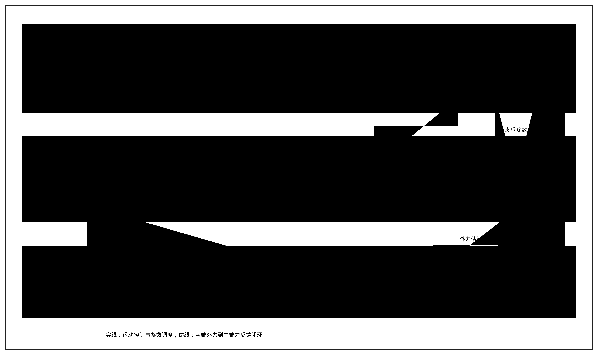
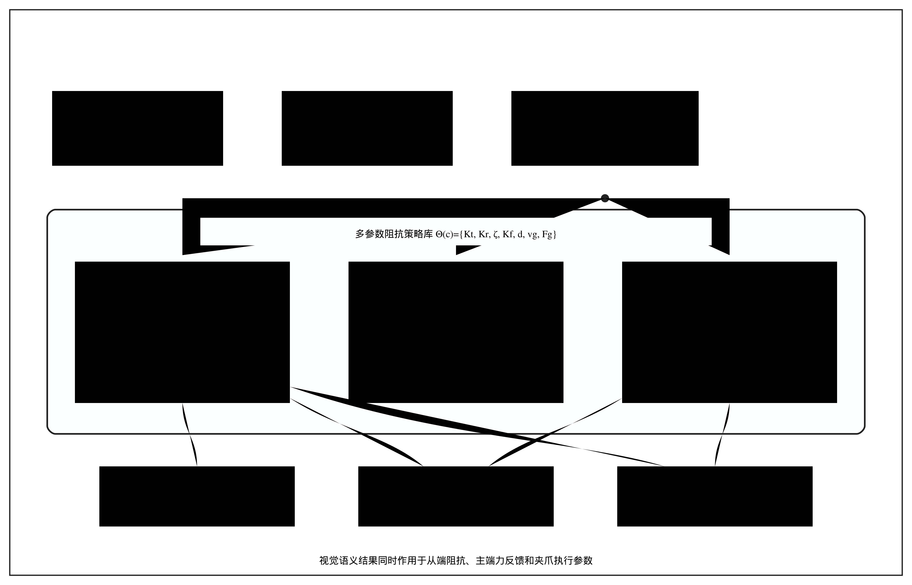
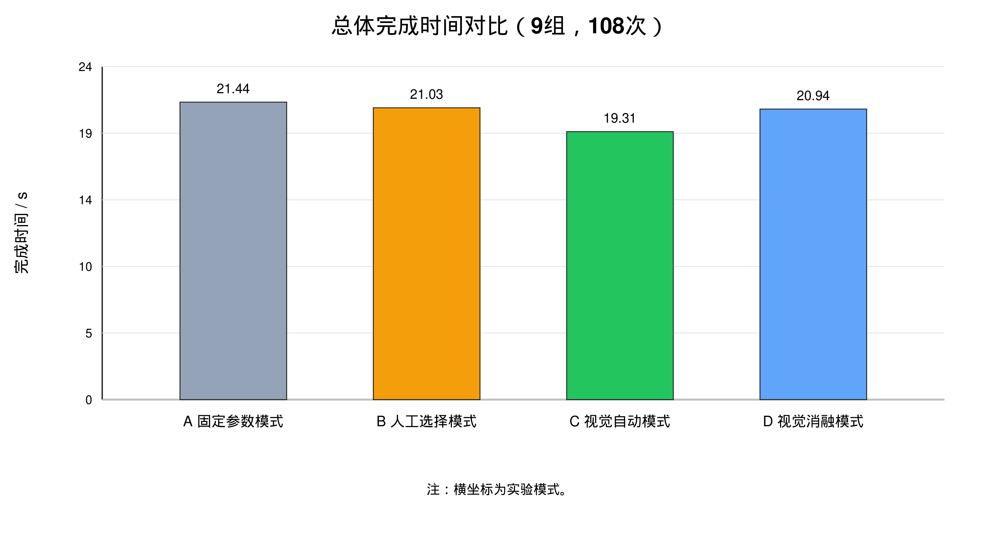
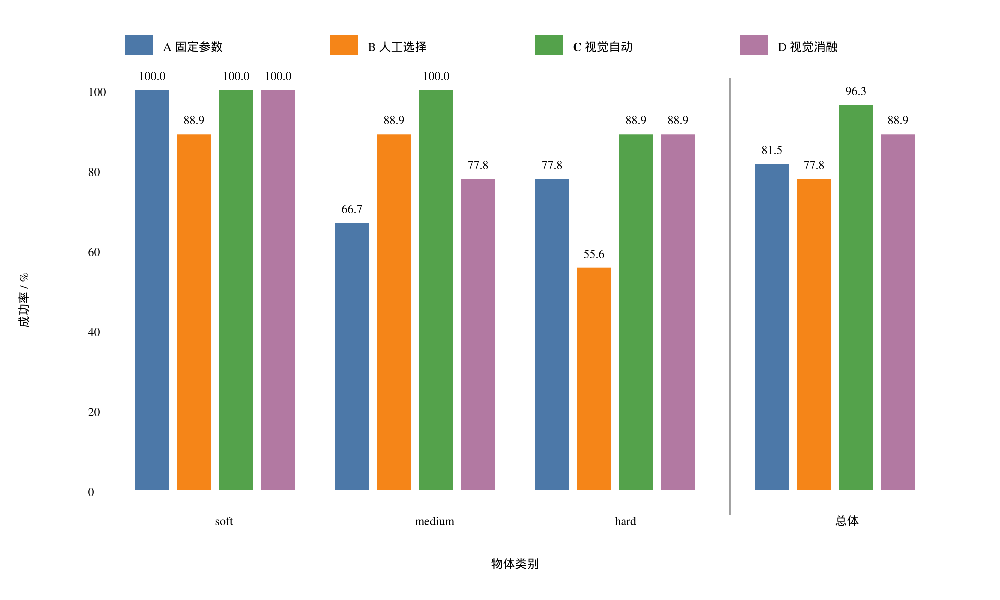
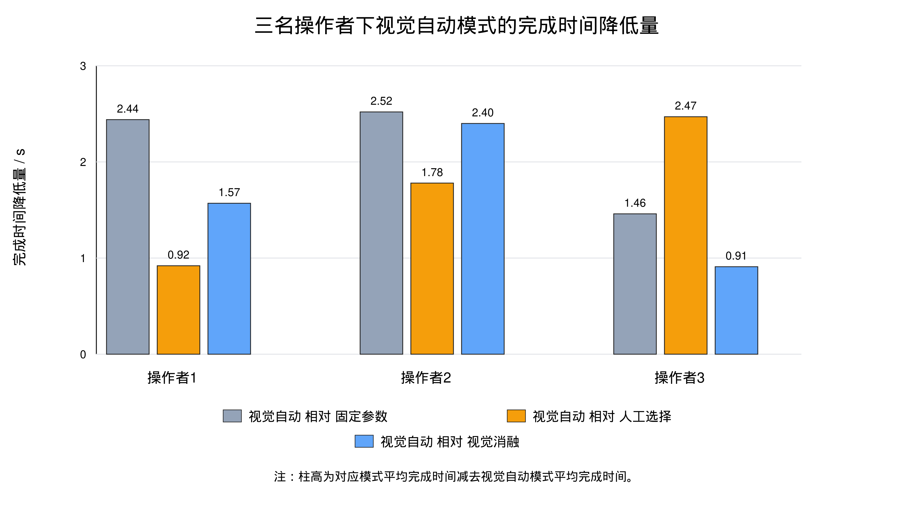
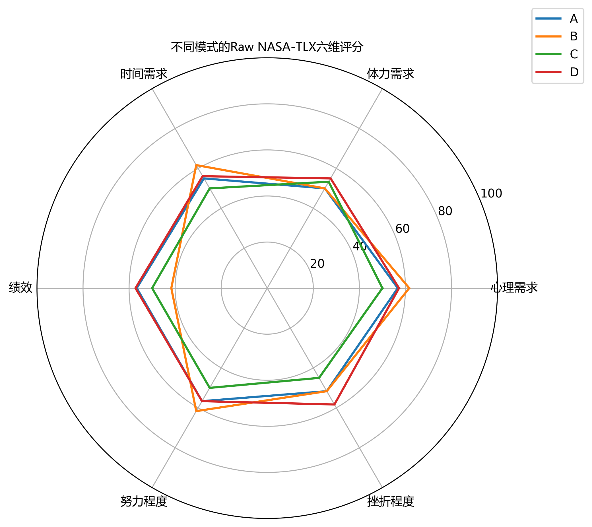
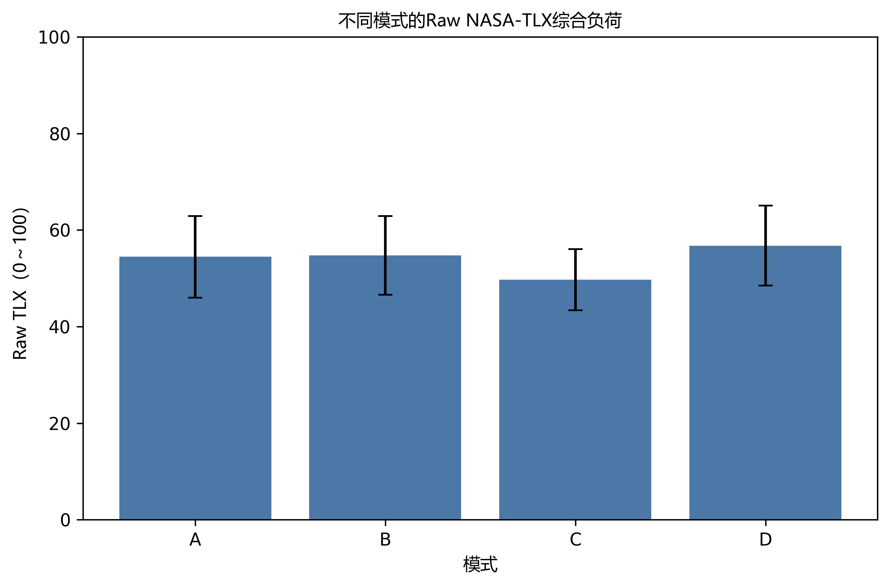

::: {custom-style="Chinese Title"}
视觉语义驱动的阻抗辅助遥操作方法
:::

::: {custom-style="Chinese Authors"}
马凤杰^1^，张华^1*^，周依霖^1^，曹其新^2^，曹创^2^
:::

::: {custom-style="Chinese Affiliations"}
（1. 上海工程技术大学 机械与汽车工程学院，上海 201620；2. 上海交通大学 机械与动力工程学院，上海 200240）
:::

::: {custom-style="English Affiliations"}
(1. School of Mechanical and Automotive Engineering, Shanghai University of Engineering Science, Shanghai 201620, China; 2. School of Mechanical Engineering, Shanghai Jiao Tong University, Shanghai 200240, China)
:::

::: {custom-style="Abstract Body"}
**摘要：**针对主从遥操作抓取中固定参数适应性不足、人工选参增加操作负担的问题，提出一种视觉语义驱动的多参数阻抗辅助方法。将目标检测结果映射为软、中、硬3类操作属性，据此协同调度从端平动与旋转刚度、阻尼比、主端力反馈及夹爪参数。搭建力反馈遥操作平台，由3名操作者在4种模式下完成108次抓取。视觉自动模式平均完成时间为19.31 s，较固定参数、人工选择和视觉消融模式分别缩短2.13、1.72和1.63 s，成功率为96.3%，未加权任务负荷指数为49.72分。结果表明，该方法在所设条件下可提高抓取效率与成功率，并呈现降低主观任务负荷的趋势。
:::

::: {custom-style="Keywords"}
**关键词：**遥操作；视觉语义；阻抗控制；力反馈；人机交互
:::

::: {custom-style="Classification"}
**中图分类号：**TP242
:::

::: {custom-style="English Title"}
Vision-Semantic-Driven Impedance-Assisted Teleoperation Method
:::

::: {custom-style="English Authors"}
MA Fengjie^1^, ZHANG Hua^1*^, ZHOU Yilin^1^, CAO Qixin^2^, CAO Chuang^2^
:::

::: {custom-style="English Abstract"}
**Abstract:** A vision-semantic-driven multi-parameter impedance assistance method was proposed to address the limited adaptability of fixed parameters and the additional workload caused by manual parameter selection in master-slave teleoperation grasping. Object-detection results were mapped to three operational-property classes: soft, medium, and hard. The slave-side translational and rotational stiffness, damping ratio, master-side force feedback, and gripper parameters were then coordinated according to these properties. A force-feedback teleoperation platform was constructed, and three operators completed 108 grasping trials in four modes. The mean completion time in the vision-automatic mode was 19.31 s, which was 2.13, 1.72, and 1.63 s shorter than those in the fixed-parameter, manual-selection, and vision-ablation modes, respectively. Its success rate was 96.3%, and its Raw Task Load Index score was 49.72. The results indicate that the method improves grasping efficiency and success rate under the tested conditions and shows a trend toward reducing subjective workload.
:::

::: {custom-style="English Keywords"}
**Key words:** teleoperation; visual semantics; impedance control; force feedback; human-robot interaction
:::

## 0 引言

主从遥操作融合人的感知决策能力与机器人的远程执行能力，已用于危险环境作业、空间服务、医疗辅助和精密装配等场景。典型系统由主端输入设备、从端机器人以及视觉和力觉反馈通道构成^［1-2］^。双边遥操作长期关注系统稳定性与力觉透明性，面向环境、操作者和任务状态调整控制策略，是改善复杂任务操作性能的重要途径^［3-4］^。

抓取对象的刚度、易变形程度和接触特性各异，单一参数组难以适应全部任务。软物体需要柔顺的末端响应和缓和的夹爪动作，硬物体则通常需要较高的定位刚度与清晰的接触提示。阻抗控制通过规定末端运动与交互力之间的动态关系实现柔顺接触^［5］^，混合阻抗控制进一步表明，环境特性和任务约束会影响力、位控制策略的选择^［6］^。因此，固定阻抗难以同时满足软物体保护、硬物体稳定抓取和操作者接触感知等需求。

现有研究主要沿变阻抗控制与任务自适应遥操作两条路径展开。前者依据接触力、轨迹误差或交互状态在线调整刚度和阻尼^［7-9］^，但参数变化还须满足稳定性约束^［15］^；后者利用操作者意图、运动状态或多模态信息调节控制器^［16-17］^，通常依赖连续力觉信息、准确状态估计或较复杂的学习过程。对于类别可由视觉辨识的抓取对象，视觉语义可提供结构清晰、便于部署的任务先验。

目标检测可在线输出物体类别与位置^［10］^，视觉抓取研究主要解决抓取信息获取和抓取点选择问题^［11-12］^，视觉与阻抗或力觉控制的融合则可依据图像特征调整接触行为^［18-19］^。然而，人在环遥操作中，物体语义不仅关系到从端柔顺程度，还影响主端反馈强度和夹爪闭合过程。仅显示识别结果不能改变系统动力学行为，仅切换单一刚度也难以满足主端、从端和末端执行器的协同需求。

针对上述问题，提出一种视觉语义驱动的多参数阻抗辅助遥操作方法：将视觉类别映射为软、中、硬3类操作属性，并调用可解释的离散策略，协同调度从端平动刚度、旋转刚度和阻尼比，主端力反馈增益与死区，以及夹爪执行参数。搭建力反馈主端—机械臂—视觉传感器实验平台，通过固定参数、人工选择、视觉自动和视觉消融4种模式，由3名操作者完成108次抓取，比较不同模式下的完成时间、轨迹长度、成功率和主观任务负荷，以验证该方法的有效性并分析其适用范围。

## 1 实验平台与系统总体设计

### 1.1 实验平台

实验平台由Omega.7力反馈主端设备、Franka Panda七自由度机械臂、Franka Hand夹爪和Intel RealSense D435i视觉传感器构成。Omega.7用于采集操作者手部位移和夹钳开合量，并向操作者渲染从端接触力；Panda作为从端执行机构，完成末端位姿跟踪与笛卡尔阻抗控制；Franka Hand执行物体抓取；D435i采集工作空间图像，供目标检测模型识别操作对象。主控制程序运行频率为200 Hz，夹爪控制以较低频率独立更新，视觉推理线程异步运行。系统自动记录主端轨迹、控制参数、任务时间和实验结果。

::: {custom-style="Figure Placeholder"}
【图1待补：实验平台实物图，应同时包含Omega.7、Panda、D435i及实验物体。】
:::

::: {custom-style="Image Caption"}
图 1  遥操作实验平台
:::

### 1.2 系统架构与信息流

本文系统由 Omega.7 力反馈主端设备、Franka Panda 七自由度机械臂、Franka Hand 夹爪、Intel RealSense D435i 相机和视觉语义阻抗调度模块组成。Franka Panda 具备力矩控制、碰撞检测和柔顺控制能力，是机器人研究和教育中常用的开放式实验平台^［13］^。同时，面向人机交互和接触任务的机器人系统需要具备碰撞检测与安全响应能力^［14］^。系统包含三条主要信息流：主从运动映射流、视觉语义识别流和力反馈渲染流。

主从运动映射流中，Omega.7 实时采集操作者手部位移，并将主端增量位移映射为 Panda 末端目标位置。视觉语义识别流中，D435i 获取场景图像，YOLO 模型识别目标物体类别，系统将目标类别进一步映射为 soft、medium、hard 三类操作属性。力反馈渲染流中，系统根据从端外力估计和当前反馈参数，在 Omega.7 主端输出力反馈，使操作者获得接触感知。

{width=14cm}

为降低视觉推理对主控制循环实时性的影响，视觉检测线程与主控制线程相互解耦。主控制线程负责读取Omega.7输入、更新Panda目标位姿、计算力反馈并记录实验数据；视觉线程异步更新目标类别。视觉自动模式开始后，系统仅在连续识别结果达到预设稳定条件时确认目标类别，并在单次抓取任务中锁定相应策略。任务结束后解除锁定，等待下一次稳定识别。该处理可避免检测结果短时波动引起参数频繁切换；当未获得稳定类别时，系统保持当前安全默认参数，不在控制周期内直接跟随瞬时识别结果。

## 2 视觉语义驱动的多参数阻抗辅助方法

### 2.1 视觉语义与物体操作属性映射

本文不直接依据物体名称逐一设计控制参数，而是将物体按操作属性划分为三类：

- soft：软物体或易变形物体；
- medium：中等硬度物体；
- hard：硬物体或不易变形物体。

YOLO 输出目标类别后，系统根据预设映射关系将目标归入对应操作属性类别。例如，海绵、泡沫等归为 soft，普通容器、塑料瓶或纸盒等归为 medium，木块、金属块和硬质塑料件等归为 hard。

### 2.2 多参数阻抗策略及参数设计

对于每一类物体，定义一组控制参数：

$$
\Theta(c)=\{K_t(c),K_r(c),\zeta(c),K_f(c),d(c),v_g(c),L_g(c)\}
\tag{1}
$$

式中，\(\Theta(c)\) 为物体操作属性 \(c\) 对应的参数组；\(c\in\{\mathrm{soft},\mathrm{medium},\mathrm{hard}\}\)，分别表示软物体、中等硬度物体和硬物体；\(K_t(c)\) 为末端平动刚度；\(K_r(c)\) 为末端旋转刚度；\(\zeta(c)\) 为阻尼比；\(K_f(c)\) 为主端力反馈增益；\(d(c)\) 为力反馈死区；\(v_g(c)\) 为夹爪闭合速度；\(L_g(c)\) 为夹爪夹持强度等级。

实验采用的视觉语义-阻抗策略库如表 1 所示。

Table: 表 1  视觉语义-阻抗策略库

| 物体类别 | \(K_t\)/(N/m) | \(K_r\)/(N·m/rad) | \(\zeta\) | \(K_f\) | \(d\)/N | \(v_g\)/(m/s) | \(L_g\) | 控制意图 |
|---|---:|---:|---:|---:|---:|---:|---|---|
| soft | 50 | 5 | 0.8 | 0.2 | 0.3 | 0.02 | 低 | 降低刚度、反馈强度和夹爪动作强度，减小软物体形变 |
| medium | 150 | 10 | 1.0 | 0.5 | 0.4 | 0.05 | 中 | 在效率和顺应性之间折中 |
| hard | 200 | 13 | 1.2 | 0.7 | 0.5 | 0.10 | 高 | 提高定位刚度、接触感知和抓取稳定性 |

{width=14cm}

由表 1 可见，soft 类采用较低刚度、较低力反馈增益、较慢夹爪速度和较低夹持强度等级，以降低接触冲击和物体损伤风险；hard 类采用较高刚度、更强反馈、较快夹爪速度和较高夹持强度等级，以增强抓取稳定性和操作者接触感知；medium 类采用中等参数作为折中策略。

#### 2.2.1 参数设计依据

表1参数是在设备安全约束范围内，依据阻抗控制机理、物体操作属性、主端反馈舒适性和预实验操作表现确定的离散工程策略，不代表全局最优参数。阻抗控制理论给出了刚度、阻尼与接触柔顺性的基本关系^［5］^，变阻抗研究说明参数应结合任务状态和交互对象进行调整^［7-8］^，参数变化还需考虑稳定性约束^［15］^。本文据此遵循以下设计原则：

1. **刚度参数与物体易变形程度匹配。** 平动刚度 \(K_t\) 直接影响 Panda 末端对位置误差的响应强度。对于 soft 类物体，过高刚度容易在接触初期产生较大作用力，导致物体压缩、滑移或损伤，因此设置较低的 \(K_t = 50\) N/m；对于 hard 类物体，物体本身不易形变，抓取过程更需要末端定位稳定性，因此设置较高的 \(K_t = 200\) N/m；medium 类物体取中间值 \(K_t = 150\) N/m，用于兼顾顺应性和操作效率。

2. **旋转刚度与抓取姿态稳定性匹配。** 旋转刚度 \(K_r\) 影响末端姿态保持能力。soft 类物体对姿态精度要求相对较低，且过强姿态约束可能增加接触扰动，因此设置 \(K_r = 5\) Nm/rad；hard 类物体在抓取过程中更依赖稳定姿态和较高定位精度，因此设置 \(K_r = 13\) Nm/rad；medium 类物体设置 \(K_r = 10\) Nm/rad。

3. **阻尼比用于抑制振荡并调节操作手感。** 阻尼比 \(\zeta\) 影响末端响应的平稳程度。soft 类物体采用 \(\zeta = 0.8\)，使系统保持一定柔顺性；medium 类采用临界阻尼附近的 \(\zeta = 1.0\)，获得较平衡的响应；hard 类采用 \(\zeta = 1.2\)，用于抑制较高刚度下可能产生的振荡和过冲。

4. **力反馈增益与操作者感知需求匹配。** 主端力反馈增益 \(K_f\) 决定从端外力向 Omega.7 主端反馈的强度。soft 类物体若反馈过强，操作者容易产生过度修正或紧张操作，因此设置较低的 \(K_f = 0.2\)；hard 类物体需要更明确的接触提示，以帮助操作者判断接触和抓取稳定性，因此设置 \(K_f = 0.7\)；medium 类物体设置 \(K_f = 0.5\)。

5. **死区用于过滤小扰动和传感噪声。** 力反馈死区 \(d\) 用于屏蔽末端外力估计中的小幅波动，避免 Omega.7 主端出现持续细微抖动。soft 类设置较小死区 \(d = 0.3\) N，以保留较轻微接触信息；hard 类设置较大死区 \(d = 0.5\) N，以避免高刚度接触过程中的小幅噪声被放大；medium 类取 \(d = 0.4\) N。

6. **夹爪参数与物体损伤风险和任务效率匹配。** 夹爪闭合速度 \(v_g(c)\) 影响夹爪接触物体时的冲击程度，夹持强度等级 \(L_g(c)\) 影响抓取后的保持能力。soft 类物体采用较慢夹爪速度和较低夹持强度等级，以降低夹持冲击和压缩形变；hard 类物体允许更快夹爪速度和较高夹持强度等级，以提高抓取效率和稳定性；medium 类物体采用中等夹爪参数。该设计使视觉语义不仅影响机械臂末端阻抗，也影响抓取执行阶段的安全性和效率。

综上，soft、medium和hard三类参数分别对应“柔顺保护型”“平衡操作型”和“稳定效率型”控制意图。该策略库旨在提供可解释、可复现的多参数协同基线，而非证明某一组参数为理论最优。

### 2.3 遥操作控制与参数调度

#### 2.3.1 主从增量位置映射

设 Omega.7 主端在时刻 \(t\) 的位置为 \(\mathbf{x}_{\Omega}(t)\)，相邻采样时刻的主端位移增量为：

$$
\Delta \mathbf{x}_{\Omega}(t)=\mathbf{x}_{\Omega}(t)-\mathbf{x}_{\Omega}(t-1)
\tag{2}
$$

则 Panda 末端期望位置更新为：

$$
\mathbf{x}_d(t)=\mathbf{x}_d(t-1)+S\Delta \mathbf{x}_{\Omega}(t)
\tag{3}
$$

式中，\(\mathbf{x}_{\Omega}(t)\) 为 Omega.7 主端在时刻 \(t\) 的位置向量；\(\Delta \mathbf{x}_{\Omega}(t)\) 为主端相邻采样时刻的位置增量；\(\mathbf{x}_d(t)\) 为 Panda 末端在时刻 \(t\) 的期望位置向量；\(S\) 为主从位置映射比例系数。该增量式映射能够避免主端回中时从端机械臂被强制拉回初始位置，使操作者可以连续控制末端位置。

#### 2.3.2 从端阻抗控制

Panda 机械臂采用笛卡尔阻抗控制。其等效控制关系可表示为^［5-6］^：

$$
\mathbf{F}=K(c)(\mathbf{x}_d-\mathbf{x})+D(c)(\dot{\mathbf{x}}_d-\dot{\mathbf{x}})
\tag{4}
$$

式中，\(\mathbf{F}\) 为末端等效控制广义力；\(\mathbf{x}_d\) 为期望末端位姿向量；\(\mathbf{x}\) 为实际末端位姿向量；\(\dot{\mathbf{x}}_d\) 和 \(\dot{\mathbf{x}}\) 分别为期望末端速度和实际末端速度；\(K(c)\) 和 \(D(c)\) 分别为由物体操作属性 \(c\) 决定的刚度矩阵和阻尼矩阵。刚度矩阵定义为：

$$
K(c)=\operatorname{diag}(K_t,K_t,K_t,K_r,K_r,K_r)
\tag{5}
$$

式中，\(\operatorname{diag}(\cdot)\) 表示由括号内元素构成对角矩阵；前三个对角元素对应末端平动刚度 \(K_t\)，后三个对角元素对应末端旋转刚度 \(K_r\)。阻尼矩阵按各方向等效二阶系统构造。设笛卡尔空间等效惯性矩阵为 \(M_x\)，则

$$
D(c)=2\zeta(c)M_x^{1/2}\left[M_x^{-1/2}K(c)M_x^{-1/2}\right]^{1/2}M_x^{1/2}
\tag{6}
$$

式中，\(M_x\) 为当前位姿下的笛卡尔空间等效惯性矩阵，矩阵平方根取对称正定平方根。采用逐轴等效质量近似时，第 \(i\) 个方向的阻尼系数可写为 \(D_i=2\zeta\sqrt{M_iK_i}\)。视觉自动模式根据锁定的操作属性更新 \(K_t(c)\)、\(K_r(c)\) 和 \(\zeta(c)\)，形成与物体属性匹配的从端动态行为。

#### 2.3.3 主端力反馈

设从端估计外力向量为 \(\mathbf{F}_{ext}\)，其模值为：

$$
f_{ext}=\|\mathbf{F}_{ext}\|
\tag{7}
$$

系统采用反馈增益和死区函数将外力模值转换为主端反馈强度：

$$
f_h=
\begin{cases}
0, & K_f(c)\,f_{ext}\le d(c),\\
K_f(c)\,f_{ext}-d(c), & K_f(c)\,f_{ext}>d(c).
\end{cases}
\tag{8}
$$

式中，\(\mathbf{F}_{ext}\) 为从端估计外力向量；\(f_{ext}\) 为外力模值；\(f_h\) 为 Omega.7 主端输出反馈强度；\(K_f(c)\) 为力反馈增益；\(d(c)\) 为力反馈死区。soft 类物体采用较小 \(K_f(c)\)，以避免操作者在主端感受到过强冲击；hard 类物体采用较大 \(K_f(c)\)，以增强接触提示。视觉阻抗控制和视觉-力觉融合控制研究表明，将视觉感知与接触控制结合有助于改善机器人与环境交互过程^［18-19］^。

#### 2.3.4 夹爪执行参数调度

Franka Hand 夹爪由 Omega.7 夹钳角度控制。系统根据夹钳开合程度执行张开、力控抓取和保持等状态切换。视觉策略库进一步为不同物体类别设置夹爪闭合速度 \(v_g(c)\) 和夹持强度等级 \(L_g(c)\)。soft 类物体采用较慢夹爪速度和较低夹持强度等级，以减少形变；hard 类物体允许较快夹爪动作和较高夹持强度等级，以提高任务效率。深度学习抓取检测与语义抓取研究说明，视觉类别信息可以进一步服务于抓取动作和任务决策^［20-21］^。

综上，本文方法并非单纯根据视觉结果切换刚度，而是通过视觉语义同时调度从端阻抗、主端力反馈和夹爪执行参数，形成多参数协同的遥操作辅助机制。

## 3 实验与结果分析

### 3.1 实验对象、对照模式与评价指标

为验证所提方法有效性，设计四种实验模式，如表 2 所示。

Table: 表 2  实验模式

| 模式 | 名称 | 说明 |
|---|---|---|
| A | 固定参数模式 | 使用固定阻抗、固定力反馈和固定夹爪参数 |
| B | 人工选择模式 | 操作者根据物体类别手动选择 soft/medium/hard 策略 |
| C | 视觉自动模式 | YOLO 识别物体类别并自动调用多参数策略库 |
| D | 视觉消融模式 | 启用视觉识别和显示，但不改变控制参数 |

其中，C 模式为本文方法；D 模式用于验证“仅有视觉观察而不参与参数调度”的效果。

实验物体分为 soft、medium 和 hard 三类，每类实验对应不同实物样本，以覆盖不同硬度和操作属性的抓取对象。实验由 3 名操作者完成，其中第 1-3 组为操作者 1，第 4-6 组为操作者 2，第 7-9 组为操作者 3。每类物体在 A、B、C、D 四种模式下各重复 9 次，共计：

$$
N=3 \times 4 \times 9=108
\tag{9}
$$

次实验。式中，\(N\) 为实验总次数；3 表示物体操作属性类别数；4 表示实验模式数；9 表示每类物体在每种模式下的重复次数。该设计既用于比较不同控制模式，也用于观察所提方法在不同操作者和多类物体条件下的适应性。

现有记录未完整保存原108次任务的模式随机化、休息时长及知情同意文件，故不对这些程序作追溯性声明。NASA-TLX补采阶段应在取得操作者书面知情同意后开展：向操作者说明实验目的、流程、潜在风险及退出权利；各模式开始前进行不计入结果的熟悉练习；4种模式采用随机或拉丁方平衡顺序，模式之间休息不少于5 min，并记录实际顺序与休息时间。正式投稿前应根据所在单位要求补充伦理审查批准或豁免信息及编号；如无法补齐原实验所需的合规文件，应向期刊如实说明并按伦理审查意见处理。

客观评价指标包括：

1. 完成时间：从任务开始到抓取放置完成的时间；
2. 主端轨迹长度：Omega.7 主端运动轨迹累计长度；
3. 成功率：任务是否成功完成；
完成时间和轨迹长度由系统自动记录，任务性能由上述客观指标评价。操作者主观任务负荷采用美国国家航空航天局任务负荷指数（National Aeronautics and Space Administration Task Load Index，NASA-TLX）评价^［24-25］^。本文采用未加权的 Raw NASA-TLX，包括心理需求、体力需求、时间需求、绩效、努力程度和挫折程度6个维度。各维度按0～100分评价，以5分为步长；其中绩效维度统一编码为分数越高表示自评表现越差，其余维度分数越高表示相应负荷越大。每名操作者完成一个“物体类别×控制模式”条件下的3次重复任务后填写1份量表，共获得36份记录。第 \(i\) 份记录的综合负荷按式（10）计算：

$$
RTLX_i=\frac{MD_i+PD_i+TD_i+OP_i+EF_i+FR_i}{6}
\tag{10}
$$

式中，\(MD\)、\(PD\)、\(TD\)、\(OP\)、\(EF\)和\(FR\)分别表示心理需求、体力需求、时间需求、绩效、努力程度和挫折程度评分。NASA-TLX数据以操作者为重复测量主体进行整理，不将同一操作者在不同条件下的记录视为相互独立样本。鉴于操作者仅3名，结果仅报告描述性统计和变化趋势，不据此作总体推断。

### 3.2 完成时间与主端轨迹长度

#### 3.2.1 完成时间

表 3 给出了三类物体在四种模式下的平均完成时间。表中数据为 9 组重复实验的均值与标准差。

Table: 表 3  完成时间对比

| 物体类别 | A 固定参数/s | B 人工选择/s | C 视觉自动/s | D 视觉消融/s |
|---|---:|---:|---:|---:|
| soft | 20.27±0.90 | 21.12±0.74 | **19.41±0.84** | 20.98±0.90 |
| medium | 22.27±1.78 | 21.13±1.41 | **19.13±1.00** | 20.58±1.06 |
| hard | 21.79±1.04 | 20.85±2.24 | **19.37±1.79** | 21.25±1.17 |
| 总体 | 21.44±1.56 | 21.03±1.59 | **19.31±1.28** | 20.94±1.08 |

由表 3 可见，C 视觉自动模式在 soft、medium 和 hard 三类物体上均取得最短平均完成时间。总体上，C 模式平均完成时间为 19.31 s，相较于 A 固定参数模式、B 人工选择模式和 D 视觉消融模式分别降低 2.13 s、1.72 s 和 1.63 s。该结果说明，视觉语义参与控制参数调度后，不仅能避免固定参数对不同物体适应不足的问题，也能减少人工选择模式下的判断和切换时间。

{width=13cm}

#### 3.2.2 主端轨迹长度

表 4 给出了主端轨迹长度结果。

Table: 表 4  主端轨迹长度对比

| 物体类别 | A 固定参数/m | B 人工选择/m | C 视觉自动/m | D 视觉消融/m |
|---|---:|---:|---:|---:|
| soft | 0.76±0.08 | 0.82±0.12 | 0.77±0.09 | **0.71±0.04** |
| medium | 0.81±0.11 | 0.75±0.09 | **0.66±0.06** | 0.73±0.07 |
| hard | **0.72±0.08** | 0.82±0.12 | **0.72±0.08** | 0.75±0.11 |
| 总体 | 0.76±0.10 | 0.80±0.11 | **0.71±0.09** | 0.73±0.08 |

从总体均值看，C 模式主端轨迹长度最短，为 0.71 m，说明视觉自动模式具有减少无效操作和反复修正的趋势。分物体类别看，C 模式在 medium 类物体上路径优势较明显；在 soft 类物体上，D 模式路径更短，可能与操作者在软物体抓取中采用更保守的直线趋近策略有关；在 hard 类物体上，各模式路径差异较小。因而，主端轨迹长度可作为操作效率改善的辅助证据，但不作为本文核心结论。

### 3.3 成功率与跨操作者结果

#### 3.3.1 成功率

表 5 给出了四种模式下的任务成功率。

Table: 表 5  成功率对比

| 模式 | soft | medium | hard | 总体 |
|---|---:|---:|---:|---:|
| A 固定参数 | 9/9 | 6/9 | 7/9 | 22/27 = 81.5% |
| B 人工选择 | 8/9 | 8/9 | 5/9 | 21/27 = 77.8% |
| C 视觉自动 | 9/9 | 9/9 | 8/9 | **26/27 = 96.3%** |
| D 视觉消融 | 9/9 | 7/9 | 8/9 | 24/27 = 88.9% |

C 模式总体成功率为 96.3%，是四种模式中最高的模式。A 模式在 medium 和 hard 类物体上出现失败，说明固定参数难以兼顾不同物体属性；B 模式在 hard 类物体上失败次数较多，表明人工选择虽然能够提供参数适配入口，但操作者仍可能受到判断、切换时机和操作负荷影响。D 模式成功率较高，但仍低于 C 模式，说明视觉观察本身有助于任务判断，而视觉语义参与控制调度可以进一步提高任务完成的稳健性。

{width=13cm}

#### 3.3.2 跨操作者结果

表 6 给出了三名操作者在四种模式下的平均完成时间。第 1-3 组、第 4-6 组和第 7-9 组分别对应三名操作者。

Table: 表 6  三名操作者下的完成时间对比

| 操作者 | A 固定参数/s | B 人工选择/s | C 视觉自动/s | D 视觉消融/s |
|---|---:|---:|---:|---:|
| 操作者 1 | 21.40 | 19.88 | **18.96** | 20.53 |
| 操作者 2 | 21.64 | 20.90 | **19.12** | 21.52 |
| 操作者 3 | 21.30 | 22.31 | **19.84** | 20.75 |

由表6可见，C视觉自动模式在3名操作者中均取得最短平均完成时间。该一致趋势表明，观察到的时间优势并非仅由某一名操作者的数据所致；鉴于操作者样本量较小，本文将其作为跨操作者一致性的初步证据。

{width=13cm}

表 7 给出了三名操作者在四种模式下的成功率。

Table: 表 7  三名操作者下的成功率对比

| 操作者 | A 固定参数 | B 人工选择 | C 视觉自动 | D 视觉消融 |
|---|---:|---:|---:|---:|
| 操作者 1 | 8/9 | 6/9 | **9/9** | 7/9 |
| 操作者 2 | 6/9 | 7/9 | **9/9** | **9/9** |
| 操作者 3 | **8/9** | **8/9** | **8/9** | **8/9** |

从成功率看，C 模式在操作者 1 和操作者 2 中均为 100%，在操作者 3 中与其他模式并列较高。结合完成时间结果，C 模式在不同操作者下保持较高成功率的同时能够缩短任务时间，体现出较好的跨操作者适应性。

### 3.4 NASA-TLX主观任务负荷评价

原3名操作者按照3.1节所述流程完成了36份NASA-TLX记录。全部记录通过完整性、0～100分取值范围、5分步长及绩效维度方向检查，未对缺失值进行插补。表8给出了按模式汇总的六维评分和Raw TLX综合负荷，数值为均值±标准差。每种模式包含9份条件记录（3名操作者×3类物体）；这些记录属于重复测量，标准差仅用于描述离散程度，不将其解释为9名独立操作者的个体差异。

Table: 表 8  不同模式的Raw NASA-TLX结果

| 模式 | 心理需求 | 体力需求 | 时间需求 | 绩效 | 努力程度 | 挫折程度 | Raw TLX |
|---|---:|---:|---:|---:|---:|---:|---:|
| A 固定参数 | 56.67±7.91 | 50.00±9.68 | 55.00±9.68 | 56.67±7.91 | 56.67±7.91 | 51.67±7.91 | 54.44±8.46 |
| B 人工选择 | 61.67±7.91 | **50.00±9.68** | 61.67±7.91 | **41.67±7.91** | 61.67±7.91 | 51.67±7.91 | 54.72±8.18 |
| C 视觉自动 | **50.00±6.12** | 53.33±7.91 | **50.00±6.12** | 50.00±6.12 | **50.00±6.12** | **45.00±6.12** | **49.72±6.32** |
| D 视觉消融 | 57.22±8.33 | 55.00±9.68 | 56.11±6.97 | 57.22±7.95 | 56.67±7.91 | 58.33±10.00 | 56.76±8.30 |

由表8可见，C视觉自动模式的Raw TLX为49.72分，分别低于A、B和D模式4.72、5.00和7.04分。六个维度中，C模式在心理需求、时间需求、努力程度和挫折程度4个维度取得最低均值；其体力需求略高于A、B模式，绩效评分高于B模式。分物体结果显示，C模式在soft、medium和hard条件下的Raw TLX分别为44.17、50.00和55.00分，均为对应物体条件下最低值。该结果表明，视觉自动调度在当前3名操作者中呈现降低总体主观任务负荷的趋势，优势主要来自心理、时间、努力和挫折维度；受小样本限制，不据此宣称总体统计显著性。

{width=11cm}

{width=11cm}

### 3.5 综合讨论与局限性

#### 3.5.1 结果讨论

综合表3至表8可以看出，视觉自动模式的表现主要体现在四个方面。第一，完成时间优势稳定，三类物体均为最短。第二，任务成功率最高，尤其在medium和hard类物体中减少了固定参数和人工选择模式下出现的失败。第三，三名操作者中C模式均取得最短平均完成时间。第四，C模式的Raw TLX综合负荷最低，并在三类物体条件下呈现一致趋势。鉴于仅有3名操作者，主观负荷结果作为描述性证据，不作总体显著性推断。

实验结果表明，视觉语义驱动的多参数阻抗辅助方法能够提升遥操作抓取效率。相较于固定参数模式，视觉自动模式能够根据物体属性自动配置阻抗和力反馈参数，从而减少操作者在不同物体之间反复试探的时间。相较于人工选择模式，视觉自动模式省去了人工判断和按键选择过程；其Raw TLX降低5.00分，且心理需求和时间需求均较低，与减少人工决策环节的设计目的相符。相较于视觉消融模式，视觉自动模式不仅显示视觉结果，还将视觉语义直接作用于控制参数，其Raw TLX降低7.04分，同时在完成时间和成功率方面呈现优势。

从不同操作者看，三名操作者在 C 模式下均取得最短平均完成时间，说明该方法不依赖某一操作者的个体熟练度，而是能够通过自动参数调度降低操作者之间操作习惯差异带来的影响。操作者 3 中各模式成功率接近，但 C 模式仍保持最短完成时间，表明在成功率接近时，视觉语义驱动的参数调度仍能体现效率优势。

从不同物体类别看，C 模式在 soft、medium 和 hard 三类物体上均取得最短平均完成时间，并在成功率上保持最高总体水平。hard 类物体中 C 模式可通过较高刚度和较强力反馈提高稳定抓取效率；medium 类物体中 C 模式在完成时间和轨迹长度上均表现较好，说明自动策略能够提供较合适的折中参数；soft 类物体中 C 模式完成时间最短，但路径长度不是最短，说明软物体操作仍受操作者路径规划、抓取姿态和主端输入稳定性的影响。该现象提示，后续可在软物体任务中进一步引入力限制、接触阶段识别和夹爪闭合过程中的柔顺调节。

本文方法与传统变阻抗控制的差异在于，参数调度依据并非单一力误差或轨迹误差，而是来自视觉语义的任务先验。该设计降低了对高精度力传感或复杂在线优化的依赖，适合工程型遥操作平台快速部署。同时，该方法并不排斥力觉自适应或学习型阻抗控制。已有研究表明，变阻抗调节可改善人机物理交互过程中的舒适性和任务表现^［22］^，示教学习方法也可用于获得随任务变化的阻抗参数^［23］^。后续可将视觉语义作为初始参数先验，再结合接触力、滑移状态和任务阶段进行在线微调。

#### 3.5.2 局限性

本文仍存在一定局限性。首先，实验仅包含3名操作者，属于小样本人因实验；108次任务能够用于比较当前实验条件下的模式差异，但尚不足以据此声称对更广泛操作者群体具有普遍泛化能力。NASA-TLX补采结果也仅适合进行描述性分析，不能将同一操作者的多条件记录当作独立样本扩大样本量。其次，当前策略参数主要依据物体操作属性、工程经验和预实验设定，尚未通过连续参数优化证明其全局最优性。再次，物体属性仅离散为soft、medium和hard三类，尚未覆盖连续材质变化、复合材料和复杂多物体场景。最后，视觉模式下的少量速度尖峰表明，系统在通用串行总线（Universal Serial Bus，USB）通信、主端数据滤波和实时性方面仍有优化空间。

## 4 结论

（1）视觉语义可作为遥操作参数调度的任务先验。将目标类别映射为软、中、硬3类操作属性，并协同调度从端阻抗、主端力反馈和夹爪参数，可使控制行为与物体操作需求相匹配。

（2）在3名操作者完成的108次抓取中，视觉自动模式平均完成时间为19.31 s，较固定参数、人工选择和视觉消融模式分别缩短2.13、1.72和1.63 s；总体成功率为96.3%，未加权任务负荷指数为49.72分。该方法在所设平台和任务条件下提高了抓取效率与成功率，并呈现降低主观任务负荷的趋势。与依据力误差连续调节的变阻抗方法相比，该方法以可解释的离散语义策略实现多参数协同，便于工程部署。

（3）受操作者数量、物体种类和离散策略范围限制，上述结果尚不能证明方法对广泛人群和复杂场景具有普遍适用性，也不能说明现有参数为全局最优。后续应扩大样本规模并采用与重复测量设计匹配的统计检验，同时融合接触力、滑移状态和任务阶段信息，实现语义先验基础上的连续在线调节。

::: {custom-style="Reference Heading"}
参考文献
:::

::: {custom-style="References"}

[1] 刘霞. 遥操作系统的控制结构与控制方法综述[J]. 兵工自动化, 2013, 32(8): 57-63.
[2] Lawrence D A. Stability and transparency in bilateral teleoperation[J]. IEEE Transactions on Robotics and Automation, 1993, 9(5): 624-637.
[3] Niemeyer G, Slotine J J E. Stable adaptive teleoperation[J]. IEEE Journal of Oceanic Engineering, 1991, 16(1): 152-162.
[4] Passenberg C, Peer A, Buss M. A survey of environment-, operator-, and task-adapted controllers for teleoperation systems[J]. Mechatronics, 2010, 20(7): 787-801.
[5] Hogan N. Impedance control: An approach to manipulation: Part I-theory[J]. Journal of Dynamic Systems, Measurement, and Control, 1985, 107(1): 1-7.
[6] Anderson R J, Spong M W. Hybrid impedance control of robotic manipulators[J]. IEEE Journal on Robotics and Automation, 1988, 4(5): 549-556.
[7] Duan J J, Gan Y H, Chen M, et al. Adaptive variable impedance control for dynamic contact force tracking in uncertain environment[J]. Robotics and Autonomous Systems, 2018, 102: 54-65.
[8] 邹锦荣. 机械臂变阻抗控制研究[D]. 广州: 广东工业大学, 2024.
[9] Abu-Dakka F J, Rozo L, Caldwell D G. Force-based variable impedance learning for robotic manipulation[J]. Robotics and Autonomous Systems, 2018, 109: 156-167.
[10] Redmon J, Divvala S, Girshick R, et al. You only look once: Unified, real-time object detection[C]//Proceedings of the IEEE Conference on Computer Vision and Pattern Recognition. Las Vegas: Institute of Electrical and Electronics Engineers, 2016: 779-788.
[11] 苏康, 李嘉良, 李俊国, 等. 基于视觉的机器人端到端策略抓取估计综述[J]. 信息与控制, 2025, 54(3): 372-389.
[12] Saxena A, Driemeyer J, Ng A Y. Robotic grasping of novel objects using vision[J]. The International Journal of Robotics Research, 2008, 27(2): 157-173.
[13] Haddadin S, Parusel S, Johannsmeier L, et al. The Franka Emika robot: A reference platform for robotics research and education[J]. IEEE Robotics & Automation Magazine, 2022, 29(2): 46-64.
[14] Haddadin S, De Luca A, Albu-Schaffer A. Robot collisions: A survey on detection, isolation, and identification[J]. IEEE Transactions on Robotics, 2017, 33(6): 1292-1312.
[15] Kronander K, Billard A. Stability considerations for variable impedance control[J]. IEEE Transactions on Robotics, 2016, 32(5): 1298-1305.
[16] Peternel L, Tsagarakis N, Ajoudani A. Towards multi-modal intention interfaces for human-robot co-manipulation[C]//Proceedings of the IEEE/RSJ International Conference on Intelligent Robots and Systems. Daejeon: Institute of Electrical and Electronics Engineers, 2016: 2663-2669.
[17] Dong B, Sun R, An T J, et al. Adaptive fuzzy impedance control of human-robot interaction modular robot manipulators based on human motion intention estimation[C]//Proceedings of the 14th International Conference on Information Science and Technology. Chengdu: Institute of Electrical and Electronics Engineers, 2024.
[18] Lippiello V, Siciliano B, Villani L. A position-based visual impedance control for robot manipulators[C]//Proceedings of the IEEE International Conference on Robotics and Automation. Roma: Institute of Electrical and Electronics Engineers, 2007: 2068-2073.
[19] Oliva A A, Giordano P R, Chaumette F. A general visual-impedance framework for effectively combining vision and force sensing in feature space[J]. IEEE Robotics and Automation Letters, 2021, 6(3): 4441-4448.
[20] Lenz I, Lee H, Saxena A. Deep learning for detecting robotic grasps[J]. The International Journal of Robotics Research, 2015, 34(4-5): 705-724.
[21] Jang E, Vijayanarasimhan S, Ibarz J, et al. End-to-end learning of semantic grasping[C]//Proceedings of the Conference on Robot Learning. Mountain View: PMLR, 2017.
[22] Ficuciello F, Villani L, Siciliano B. Variable impedance control of redundant manipulators for intuitive human-robot physical interaction[J]. IEEE Transactions on Robotics, 2015, 31(4): 850-863.
[23] Buchli J, Stulp F, Theodorou E, et al. Learning variable impedance control[J]. The International Journal of Robotics Research, 2011, 30(7): 820-833.
[24] Hart S G, Staveland L E. Development of NASA-TLX (Task Load Index): Results of empirical and theoretical research[M]//Hancock P A, Meshkati N. Human Mental Workload. Amsterdam: North-Holland, 1988: 139-183.
[25] Hart S G. NASA-task load index (NASA-TLX); 20 years later[C]//Proceedings of the Human Factors and Ergonomics Society Annual Meeting. Los Angeles: SAGE Publications, 2006, 50(9): 904-908.
:::
