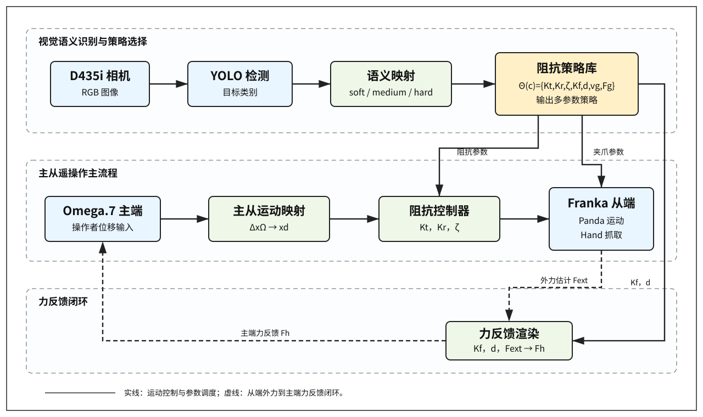
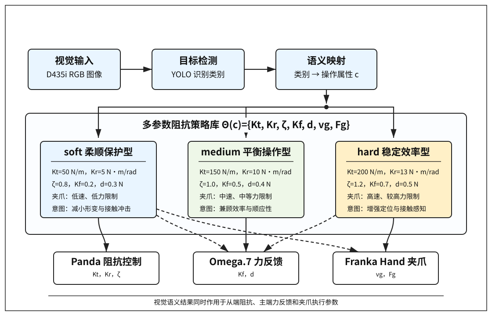
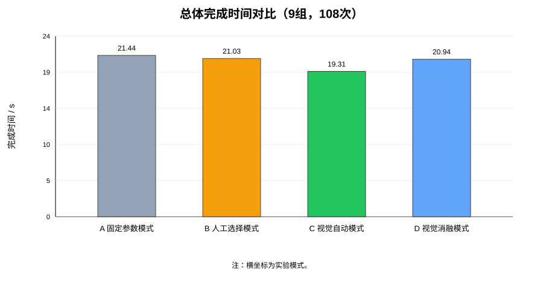
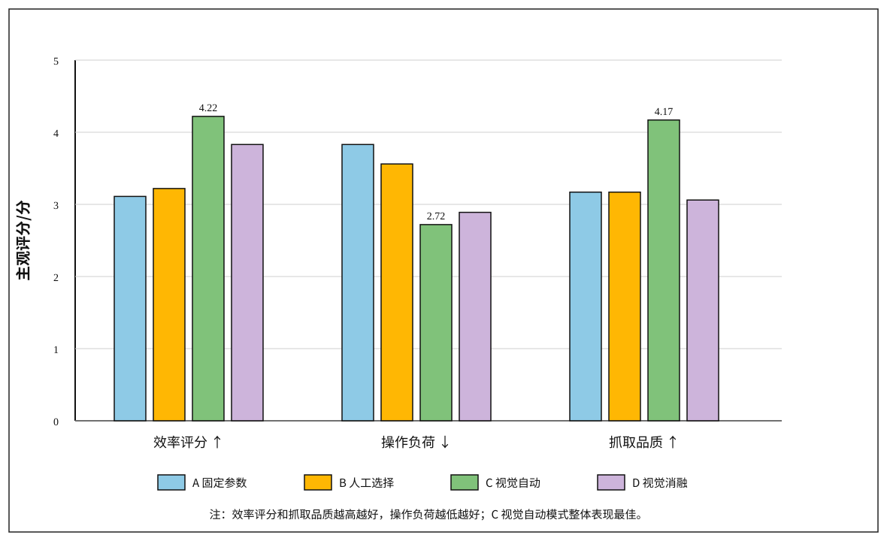

# 视觉语义驱动的多参数阻抗辅助遥操作方法研究

## 摘要

针对主从遥操作抓取任务中固定阻抗参数难以适应不同物体属性、人工选择参数增加操作者认知负担等问题，提出一种视觉语义驱动的多参数阻抗辅助遥操作方法。该方法利用 Intel RealSense D435i 相机和 YOLO 目标检测模型识别操作对象，将物体按操作属性划分为软物体、中等硬度物体和硬物体三类，并构建视觉语义-阻抗策略库。系统根据识别结果协同调度 Franka Panda 机械臂末端平动刚度、旋转刚度、阻尼比、Omega.7 主端力反馈增益、力反馈死区以及 Franka Hand 夹爪参数，从而实现面向不同物体属性的自动辅助遥操作。基于 Omega.7-Panda-D435i 遥操作平台，设计固定参数、人工选择、视觉自动和视觉消融四种模式，完成 3 类物体、4 种模式、6 组重复的 72 次抓取实验。实验结果表明，视觉自动模式在三类物体上的平均完成时间均为最短，总体平均完成时间为 19.04 s，较固定参数、人工选择和视觉消融模式分别降低 2.48 s、1.35 s 和 1.99 s，配对统计检验均达到显著水平（p≤0.0004）。视觉自动模式总体成功率为 100.0%，高于固定参数模式、人工选择模式和视觉消融模式；主观评价结果显示，视觉自动模式具有最高效率评分、最低操作负荷和最高抓取品质评分。结果表明，所提方法能够提高遥操作抓取效率，降低操作者负担，并改善不同物体条件下的抓取体验。

**关键词**：遥操作；视觉语义；阻抗控制；力反馈；人机交互；Franka Panda

## 1 引言

主从遥操作系统能够将人的感知、判断和灵活操作能力引入机器人任务执行过程，在危险环境作业、空间机器人、医疗辅助、柔性抓取和精密装配等领域具有重要应用价值。典型遥操作系统通常由主端输入设备、从端机器人、视觉反馈和力觉反馈通道组成。操作者通过主端设备发出运动指令，从端机器人根据映射关系执行相应动作，并通过视觉或力觉反馈帮助操作者判断任务状态[11-14]。

在实际抓取任务中，操作对象的物理属性差异较大。软物体容易发生形变或损伤，需要较低的末端刚度、较缓和的夹爪动作和较弱的力反馈；硬物体不易变形，但需要较高定位刚度和较明确的接触反馈，以保证抓取稳定性。阻抗控制及变阻抗控制为接触任务中的柔顺调节提供了重要基础[1-10]。若在整个任务中采用固定阻抗参数，则难以同时兼顾软物体保护和硬物体稳定抓取需求。人工切换阻抗模式虽然能够提升一定适应性，但需要操作者提前判断物体属性并手动选择参数，容易增加认知负担，也降低了操作连续性。

近年来，视觉感知技术为遥操作系统提供了场景理解能力。通过相机和目标检测模型识别物体类别，再将识别结果用于控制参数调节，是提高遥操作适应性的一种可行方式[15-22]。然而，仅向操作者显示视觉识别结果并不能直接改善从端机器人的动力学行为；仅调节单一刚度参数，也难以充分体现物体属性对主端力反馈、从端阻抗和夹爪动作的综合影响。

为此，本文提出一种视觉语义驱动的多参数阻抗辅助遥操作方法。该方法将视觉识别结果映射为软、中、硬三类物体操作属性，并进一步调用对应的多参数策略，使视觉语义信息同时作用于机械臂阻抗控制、主端力反馈和夹爪执行参数。本文基于 Omega.7 力反馈主端设备、Franka Panda 机械臂、Franka Hand 夹爪和 D435i 相机搭建实验平台，并通过四种模式对比实验验证方法有效性。

本文主要贡献如下：

1. 构建视觉语义-阻抗策略库，实现从物体语义类别到多维控制参数的映射；
2. 设计多参数协同调度机制，使视觉语义信息同时影响从端阻抗、主端力反馈和夹爪控制；
3. 搭建 Omega.7-Panda-D435i 遥操作实验平台，设计固定参数、人工选择、视觉自动和视觉消融四种实验模式；
4. 基于 72 次真实抓取实验，从完成时间、主端轨迹长度、成功率和主观评价等方面验证所提方法，并通过视觉消融模式分析“视觉观察”和“视觉参与控制”之间的差异。

## 2 系统组成与总体框架

本文系统由 Omega.7 力反馈主端设备、Franka Panda 七自由度机械臂、Franka Hand 夹爪、Intel RealSense D435i 相机和视觉语义阻抗调度模块组成。Franka Panda 具备力矩控制、碰撞检测和柔顺控制能力，适合用于人机交互和遥操作接触任务研究[23]。系统包含三条主要信息流：主从运动映射流、视觉语义识别流和力反馈渲染流。

主从运动映射流中，Omega.7 实时采集操作者手部位移，并将主端增量位移映射为 Panda 末端目标位置。视觉语义识别流中，D435i 获取场景图像，YOLO 模型识别目标物体类别，系统将目标类别进一步映射为 soft、medium、hard 三类操作属性。力反馈渲染流中，系统根据从端外力估计和当前反馈参数，在 Omega.7 主端输出力反馈，使操作者获得接触感知。

图 1 系统总体框架

为降低视觉推理对主控制循环的影响，本文将视觉检测模块与主控制循环解耦。主控制循环负责读取 Omega.7 输入、更新 Panda 目标位姿、计算力反馈和记录实验数据；视觉检测模块异步更新当前目标类别。视觉自动模式下，系统在首次稳定识别到目标类别后锁定对应策略，避免识别结果短时波动导致控制参数频繁切换。

## 3 视觉语义-阻抗策略库

### 3.1 物体操作属性划分

本文不直接依据物体名称逐一设计控制参数，而是将物体按操作属性划分为三类：

- soft：软物体或易变形物体；
- medium：中等硬度物体；
- hard：硬物体或不易变形物体。

YOLO 输出目标类别后，系统根据预设映射关系将目标归入对应操作属性类别。例如，海绵、泡沫等归为 soft，普通容器、塑料瓶或纸盒等归为 medium，木块、金属块和硬质塑料件等归为 hard。

### 3.2 多参数策略定义

对于每一类物体，定义一组控制参数：

\[
\Theta(c)=\{K_t,K_r,\zeta,K_f,d,v_g,F_g\}
\]

其中，\(c\in\{\text{soft},\text{medium},\text{hard}\}\) 表示物体操作属性；\(K_t\) 为末端平动刚度；\(K_r\) 为末端旋转刚度；\(\zeta\) 为阻尼比；\(K_f\) 为主端力反馈增益；\(d\) 为力反馈死区；\(v_g\) 为夹爪速度；\(F_g\) 为夹爪力限制。

实验采用的视觉语义-阻抗策略库如表 1 所示。

**表 1 视觉语义-阻抗策略库**

| 物体类别 | \(K_t\)/(N/m) | \(K_r\)/(Nm/rad) | \(\zeta\) | \(K_f\) | \(d\)/N | 控制意图 |
|---|---:|---:|---:|---:|---:|---|
| soft | 50 | 5 | 0.8 | 0.2 | 0.3 | 降低刚度和反馈强度，减小软物体形变 |
| medium | 150 | 10 | 1.0 | 0.5 | 0.4 | 在效率和顺应性之间折中 |
| hard | 200 | 13 | 1.2 | 0.7 | 0.5 | 提高定位刚度和接触感知 |

图 2 视觉语义-阻抗策略库示意

由表 1 可见，soft 类采用较低刚度、较低力反馈增益和较小夹爪动作强度，以降低接触冲击和物体损伤风险；hard 类采用较高刚度和更强反馈，以增强抓取稳定性和操作者接触感知；medium 类采用中等参数作为折中策略。

### 3.3 参数设计依据

视觉语义-阻抗策略库中的参数并非单一经验值堆叠，而是依据物体操作属性、阻抗控制机理、主端力反馈舒适性以及夹爪执行安全性共同确定[1-8]。参数设计遵循以下原则：

1. **刚度参数与物体易变形程度匹配。** 平动刚度 \(K_t\) 直接影响 Panda 末端对位置误差的响应强度。对于 soft 类物体，过高刚度容易在接触初期产生较大作用力，导致物体压缩、滑移或损伤，因此设置较低的 \(K_t=50\) N/m；对于 hard 类物体，物体本身不易形变，抓取过程更需要末端定位稳定性，因此设置较高的 \(K_t=200\) N/m；medium 类物体取中间值 \(K_t=150\) N/m，用于兼顾顺应性和操作效率。

2. **旋转刚度与抓取姿态稳定性匹配。** 旋转刚度 \(K_r\) 影响末端姿态保持能力。soft 类物体对姿态精度要求相对较低，且过强姿态约束可能增加接触扰动，因此设置 \(K_r=5\) Nm/rad；hard 类物体在抓取过程中更依赖稳定姿态和较高定位精度，因此设置 \(K_r=13\) Nm/rad；medium 类物体设置 \(K_r=10\) Nm/rad。

3. **阻尼比用于抑制振荡并调节操作手感。** 阻尼比 \(\zeta\) 影响末端响应的平稳程度。soft 类物体采用 \(\zeta=0.8\)，使系统保持一定柔顺性；medium 类采用临界阻尼附近的 \(\zeta=1.0\)，获得较平衡的响应；hard 类采用 \(\zeta=1.2\)，用于抑制较高刚度下可能产生的振荡和过冲。

4. **力反馈增益与操作者感知需求匹配。** 主端力反馈增益 \(K_f\) 决定从端外力向 Omega.7 主端反馈的强度。soft 类物体若反馈过强，操作者容易产生过度修正或紧张操作，因此设置较低的 \(K_f=0.2\)；hard 类物体需要更明确的接触提示，以帮助操作者判断接触和抓取稳定性，因此设置 \(K_f=0.7\)；medium 类物体设置 \(K_f=0.5\)。

5. **死区用于过滤小扰动和传感噪声。** 力反馈死区 \(d\) 用于屏蔽末端外力估计中的小幅波动，避免 Omega.7 主端出现持续细微抖动。soft 类设置较小死区 \(d=0.3\) N，以保留较轻微接触信息；hard 类设置较大死区 \(d=0.5\) N，以避免高刚度接触过程中的小幅噪声被放大；medium 类取 \(d=0.4\) N。

6. **夹爪参数与物体损伤风险和任务效率匹配。** soft 类物体采用较慢夹爪速度和较低夹持力限制，以降低夹持冲击和压缩形变；hard 类物体允许更快夹爪速度和更高夹持力，以提高抓取效率和稳定性；medium 类物体采用中等夹爪参数。该设计使视觉语义不仅影响机械臂末端阻抗，也影响抓取执行阶段的安全性和效率。

综上，soft、medium 和 hard 三类参数分别对应“柔顺保护型”“平衡操作型”和“稳定效率型”三种控制意图。该策略库的作用不是追求单一参数最优，而是在实际遥操作中为不同物体提供可解释、可复现且易于实验验证的多参数协同控制基线。

## 4 遥操作控制方法

### 4.1 主从增量位置映射

设 Omega.7 主端在时刻 \(t\) 的位置为 \(x_{\Omega}(t)\)，相邻采样时刻的主端位移增量为：

\[
\Delta x_{\Omega}(t)=x_{\Omega}(t)-x_{\Omega}(t-1)
\]

则 Panda 末端期望位置更新为：

\[
x_d(t)=x_d(t-1)+S\Delta x_{\Omega}(t)
\]

其中，\(S\) 为主从位置映射比例系数。该增量式映射能够避免主端回中时从端机械臂被强制拉回初始位置，使操作者可以连续控制末端位置。

### 4.2 从端阻抗控制

Panda 机械臂采用笛卡尔阻抗控制。其等效控制关系可表示为[1-3]：

\[
F=K(c)(x_d-x)+D(c)(\dot{x}_d-\dot{x})
\]

其中，\(x_d\) 为期望末端位置，\(x\) 为实际末端位置，\(K(c)\) 和 \(D(c)\) 分别为由物体类别 \(c\) 决定的刚度矩阵和阻尼矩阵。刚度矩阵定义为：

\[
K(c)=diag(K_t,K_t,K_t,K_r,K_r,K_r)
\]

阻尼由阻尼比 \(\zeta\) 调节。视觉自动模式下，系统根据识别到的物体操作属性自动更新 \(K_t\)、\(K_r\) 和 \(\zeta\)，从而形成与物体属性匹配的从端动态行为。

### 4.3 主端力反馈

设从端估计外力为 \(F_{ext}\)，主端力反馈为 \(F_h\)。系统采用反馈增益和死区函数处理外力：

\[
F_h=
\begin{cases}
0, & |K_fF_{ext}|\le d \\
sgn(K_fF_{ext})(|K_fF_{ext}|-d), & |K_fF_{ext}|>d
\end{cases}
\]

其中，\(K_f\) 为力反馈增益，\(d\) 为死区。soft 类物体采用较小 \(K_f\)，以避免操作者在主端感受到过强冲击；hard 类物体采用较大 \(K_f\)，以增强接触提示。

### 4.4 夹爪执行参数调度

Franka Hand 夹爪由 Omega.7 夹钳角度控制。系统根据夹钳开合程度执行张开、力控抓取和保持等状态切换。视觉策略库进一步为不同物体类别设置不同夹爪速度和力限制。soft 类物体采用较慢夹爪速度和较低夹持力，以减少形变；hard 类物体允许较快夹爪动作，以提高任务效率。

综上，本文方法并非单纯根据视觉结果切换刚度，而是通过视觉语义同时调度从端阻抗、主端力反馈和夹爪执行参数，形成多参数协同的遥操作辅助机制。

## 5 实验设计

### 5.1 实验平台

实验平台由 Omega.7 力反馈设备、Franka Panda 机械臂、Franka Hand 夹爪和 Intel RealSense D435i 相机构成。主控制程序运行频率为 200 Hz，夹爪控制以较低频率独立更新，视觉识别模块异步运行。实验过程中自动记录 Omega.7 主端轨迹、控制参数、运行时间和汇总统计信息，并在每次 trial 后记录主观评分。

【图 3 实验平台实物图。建议拍摄主端 Omega.7、从端 Panda、D435i 和实验物体。】

### 5.2 实验模式

为验证所提方法有效性，设计四种实验模式，如表 2 所示。

**表 2 实验模式**

| 模式 | 名称 | 说明 |
|---|---|---|
| A | 固定参数模式 | 使用固定阻抗、固定力反馈和固定夹爪参数 |
| B | 人工选择模式 | 操作者根据物体类别手动选择 soft/medium/hard 策略 |
| C | 视觉自动模式 | YOLO 识别物体类别并自动调用多参数策略库 |
| D | 视觉消融模式 | 启用视觉识别和显示，但不改变控制参数 |

其中，C 模式为本文方法；D 模式用于验证“仅有视觉观察而不参与参数调度”的效果。

### 5.3 实验任务与评价指标

实验物体分为 soft、medium 和 hard 三类。每类物体在 A、B、C、D 四种模式下各重复 6 次，共计：

\[
3 \times 4 \times 6=72
\]

次实验。

评价指标包括：

1. 完成时间：从任务开始到抓取放置完成的时间；
2. 主端轨迹长度：Omega.7 主端运动轨迹累计长度；
3. 成功率：任务是否成功完成；
4. 效率评分：1–5 分，分数越高表示操作者认为越高效；
5. 操作负荷：1–5 分，分数越低表示操作者越轻松；
6. 抓取品质：1–5 分，分数越高表示抓取越稳定。

完成时间和轨迹长度由系统自动记录，主观评分由操作者在每次实验后填写。主观评价参考任务负荷评价思想设置效率、负荷和抓取品质三个维度，用于补充客观指标难以完全反映的人机交互体验[24-25]。

## 6 实验结果与分析

### 6.1 完成时间

表 3 给出了三类物体在四种模式下的平均完成时间。表中数据为 6 组重复实验的均值与标准差。

**表 3 完成时间对比**

| 物体类别 | A 固定参数/s | B 人工选择/s | C 视觉自动/s | D 视觉消融/s |
|---|---:|---:|---:|---:|
| soft | 20.48±0.86 | 20.87±0.81 | **19.35±0.93** | 21.01±1.11 |
| medium | 22.25±2.07 | 20.85±1.33 | **19.26±1.30** | 20.65±1.07 |
| hard | 21.83±0.77 | 19.46±1.18 | **18.52±1.63** | 21.44±1.50 |
| 总体 | 21.52±1.50 | 20.39±1.26 | **19.04±1.29** | 21.03±1.21 |

由表 3 可见，C 视觉自动模式在 soft、medium 和 hard 三类物体上均取得最短平均完成时间。总体上，C 模式平均完成时间为 19.04 s，相较于 A 固定参数模式、B 人工选择模式和 D 视觉消融模式分别降低 2.48 s、1.35 s 和 1.99 s。该结果说明，视觉语义参与控制参数调度后，不仅能避免固定参数对不同物体适应不足的问题，也能减少人工选择模式下的判断和切换时间。

对 18 组配对数据进行统计检验，结果如表 4 所示。其中，配对 t 检验用于评价均值差异，Wilcoxon 符号秩检验用于在小样本条件下提供非参数验证。

**表 4 完成时间配对统计检验**

| 对比 | 平均降低时间/s | t 检验 p 值 | Wilcoxon p 值 |
|---|---:|---:|---:|
| C vs A | 2.48 | 0.0001 | 0.0001 |
| C vs B | 1.35 | 0.0002 | 0.0002 |
| C vs D | 1.99 | 0.0004 | 0.0003 |

结果表明，C 模式相对于其他三种模式在完成时间上均具有显著优势（p≤0.0004）。尤其是 C 与 D 的对比表明，仅提供视觉识别或观察并不足以获得同等效率提升；视觉语义需要进一步作用于阻抗、力反馈和夹爪参数，才能形成稳定的辅助效果。

图 4 完成时间对比

### 6.2 主端轨迹长度

表 5 给出了主端轨迹长度结果。

**表 5 主端轨迹长度对比**

| 物体类别 | A 固定参数/m | B 人工选择/m | C 视觉自动/m | D 视觉消融/m |
|---|---:|---:|---:|---:|
| soft | 0.76±0.10 | 0.79±0.14 | 0.78±0.11 | **0.71±0.04** |
| medium | 0.77±0.10 | 0.73±0.09 | **0.64±0.07** | 0.74±0.08 |
| hard | **0.70±0.09** | 0.77±0.12 | 0.71±0.09 | 0.72±0.09 |
| 总体 | 0.74±0.10 | 0.77±0.12 | **0.71±0.10** | 0.73±0.07 |

从总体均值看，C 模式主端轨迹长度最短，为 0.71 m，说明视觉自动模式具有减少无效操作和反复修正的趋势。分物体类别看，C 模式在 medium 类物体上路径优势较明显；在 soft 类物体上，D 模式路径更短，可能与操作者在软物体抓取中采用更保守的直线趋近策略有关；在 hard 类物体上，各模式路径差异较小。

**表 6 主端轨迹长度配对统计检验**

| 对比 | 平均路径降低/m | t 检验 p 值 | Wilcoxon p 值 |
|---|---:|---:|---:|
| C vs A | 0.032 | 0.368 | 0.417 |
| C vs B | 0.057 | 0.061 | 0.090 |
| C vs D | 0.015 | 0.634 | 0.671 |

由表 6 可知，C 模式相对于 A、B、D 的路径长度差异未达到显著水平，其中 C vs B 接近显著。因而，主端轨迹长度可作为操作效率改善的辅助证据，但不作为本文核心结论。本文核心证据主要来自完成时间、成功率和主观评价。

### 6.3 成功率

表 7 给出了四种模式下的任务成功率。

**表 7 成功率对比**

| 模式 | soft | medium | hard | 总体 |
|---|---:|---:|---:|---:|
| A 固定参数 | 6/6 | 4/6 | 4/6 | 14/18 = 77.8% |
| B 人工选择 | 5/6 | 6/6 | 2/6 | 13/18 = 72.2% |
| C 视觉自动 | 6/6 | 6/6 | 6/6 | **18/18 = 100.0%** |
| D 视觉消融 | 6/6 | 5/6 | 6/6 | 17/18 = 94.4% |

C 模式在 18 次任务中全部成功，是四种模式中唯一达到 100.0% 总体成功率的模式。A 模式在 medium 和 hard 类物体上出现失败，说明固定参数难以兼顾不同物体属性；B 模式在 hard 类物体上失败次数较多，表明人工选择虽然能够提供参数适配入口，但操作者仍可能受到判断、切换时机和操作负荷影响。D 模式成功率较高，但仍低于 C 模式，说明视觉观察本身有助于任务判断，而视觉语义参与控制调度可以进一步提高任务完成的稳健性。

### 6.4 主观评价

表 8 给出了效率评分、操作负荷和抓取品质评分结果。评分采用 1-5 分制，其中效率评分和抓取品质分数越高越好，操作负荷分数越低越好。

**表 8 主观评分对比**

| 模式 | 效率评分 ↑ | 操作负荷 ↓ | 抓取品质 ↑ |
|---|---:|---:|---:|
| A 固定参数 | 3.11 | 3.83 | 3.17 |
| B 人工选择 | 3.22 | 3.56 | 3.17 |
| C 视觉自动 | **4.22** | **2.72** | **4.17** |
| D 视觉消融 | 3.83 | 2.89 | 3.06 |

由表 8 可见，C 视觉自动模式获得最高效率评分、最低操作负荷和最高抓取品质评分。与 A 模式相比，C 模式效率评分由 3.11 提升至 4.22，操作负荷由 3.83 降低至 2.72，抓取品质由 3.17 提升至 4.17。与 D 模式相比，C 模式在抓取品质上提升明显，说明视觉识别结果只有参与控制参数调度，才能更充分地改善抓取稳定性。

主观评分统计检验结果如表 9 所示。

**表 9 主观评分统计检验**

| 指标 | C vs A | C vs B | C vs D |
|---|---:|---:|---:|
| 效率评分 | p=0.0008 | p=0.0001 | p=0.052 |
| 操作负荷 | p=0.0001 | p=0.001 | p=0.083 |
| 抓取品质 | p=0.0005 | p=0.0003 | p=0.0007 |

结果显示，C 模式相对于 A 和 B 在三项主观指标上均具有显著优势；相对于 D 模式，C 模式在抓取品质方面差异显著，在效率评分和操作负荷方面表现更优且接近显著。这表明多参数控制策略不仅提高客观完成效率，也能改善操作者对稳定性、轻松程度和任务可控性的主观感受。

图 5 主观评分对比

### 6.5 综合分析与数据质量说明

综合表 3 至表 9 可以看出，视觉自动模式的优势主要体现在三个方面。第一，完成时间优势稳定，三类物体均为最短，且相对于 A、B、D 的统计检验均达到显著水平。第二，任务成功率最高，尤其在 medium 和 hard 类物体中避免了固定参数和人工选择模式下出现的失败。第三，主观抓取品质显著优于视觉消融模式，说明本文方法的关键并非“看见物体”，而是将视觉语义转化为可执行的多参数控制策略。

实验数据中，视觉自动模式和视觉消融模式存在少量主端最大速度尖峰。分析认为，该现象可能与视觉模式下 D435i 相机和 Omega.7 设备的 USB 带宽竞争、主端位置读取瞬时跳变或数据采样异常有关。由于最大速度对单点异常非常敏感，本文不将最大速度作为核心评价指标，而主要采用完成时间、轨迹长度、成功率和主观评分进行综合评价。后续系统实现中可通过设备分总线连接、主端输入滤波和异常采样剔除进一步提高数据质量。

## 7 讨论

实验结果表明，视觉语义驱动的多参数阻抗辅助方法能够提升遥操作抓取效率。相较于固定参数模式，视觉自动模式能够根据物体属性自动配置阻抗和力反馈参数，从而减少操作者在不同物体之间反复试探的时间。相较于人工选择模式，视觉自动模式避免了人工判断和按键选择过程，降低了认知负担，并提高了操作连续性。相较于视觉消融模式，视觉自动模式不仅显示视觉结果，还将视觉语义直接作用于控制参数，因此在完成时间、成功率和抓取品质方面具有更充分的综合优势。

从不同物体类别看，hard 类物体中 C 模式完成时间优势较明显，说明较高刚度和较强力反馈有助于硬物体快速稳定抓取。medium 类物体中，C 模式在完成时间和轨迹长度上均表现较好，说明自动策略能够提供较合适的折中参数。soft 类物体中，C 模式完成时间最短，但路径长度不是最短，说明软物体操作仍受操作者路径规划、抓取姿态和主端输入稳定性的影响。该现象提示，后续可在软物体任务中进一步引入力限制、接触阶段识别和夹爪闭合过程中的柔顺调节。

本文方法与传统变阻抗控制的差异在于，参数调度依据并非单一力误差或轨迹误差，而是来自视觉语义的任务先验。该设计降低了对高精度力传感或复杂在线优化的依赖，适合工程型遥操作平台快速部署。同时，该方法并不排斥力觉自适应或学习型阻抗控制，后续可将视觉语义作为初始参数先验，再结合接触力、滑移状态和任务阶段进行在线微调。

本文仍存在一定局限性。首先，实验重复次数为每类每模式 6 次，样本规模能够支撑小样本工程验证，但仍可进一步扩大操作者数量、物体种类和任务场景。其次，当前策略库参数主要依据物体操作属性和工程经验设定，后续可结合外力数据、任务完成质量和在线学习方法优化参数。再次，本文将物体属性离散为 soft、medium 和 hard 三类，尚未覆盖连续材质变化、复合材料和复杂多物体场景。最后，视觉模式下出现的速度尖峰提示系统在 USB 通信、主端数据滤波和实时性方面仍有优化空间。

## 8 结论

本文提出了一种视觉语义驱动的多参数阻抗辅助遥操作方法。该方法利用 D435i 相机和 YOLO 模型识别目标物体类别，将物体映射为 soft、medium 和 hard 三类操作属性，并通过视觉语义-阻抗策略库协同调度 Panda 机械臂末端阻抗、Omega.7 主端力反馈和 Franka Hand 夹爪参数。

基于 Omega.7-Panda-D435i 实验平台完成了 72 次抓取实验。结果表明，视觉自动模式在三类物体上的平均完成时间均为最短，总体平均完成时间为 19.04 s，较固定参数模式、人工选择模式和视觉消融模式分别降低 2.48 s、1.35 s 和 1.99 s，统计检验结果均达到显著水平（p≤0.0004）。视觉自动模式总体成功率达到 100.0%，高于固定参数模式的 77.8%、人工选择模式的 72.2% 和视觉消融模式的 94.4%。主观评价结果表明，视觉自动模式具有最高效率评分、最低操作负荷和最高抓取品质评分，其中抓取品质相对于视觉消融模式差异显著。以上结果验证了所提方法在提高遥操作效率、降低操作者负担和改善抓取体验方面的有效性。

## 参考文献

[1] Hogan N. Impedance control: An approach to manipulation[J]. ASME Journal of Dynamic Systems, Measurement, and Control, 1985, 107(1): 1-24.  
[2] Hogan N. Stable execution of contact tasks using impedance control[C]//Proceedings of IEEE International Conference on Robotics and Automation. 1987.  
[3] Anderson R J, Spong M W. Hybrid impedance control of robotic manipulators[J]. IEEE Journal on Robotics and Automation, 1988, 4(5): 549-556.  
[4] Duan J, Gan Y, Chen M, et al. Adaptive variable impedance control for dynamic contact force tracking in uncertain environment[J]. Robotics and Autonomous Systems, 2018, 102: 54-65.  
[5] Roveda L, Vicentini F, Pedrocchi N, et al. Fuzzy impedance control for enhancing physical human-robot interaction[C]//Proceedings of IEEE International Conference on Robotics and Automation. 2016.  
[6] Abu-Dakka F J, Rozo L, Caldwell D G. Force-based variable impedance learning for robotic manipulation[J]. Robotics and Autonomous Systems, 2018, 109: 156-167.  
[7] Kronander K, Billard A. Stability considerations for variable impedance control[J]. IEEE Transactions on Robotics, 2016, 32(5): 1298-1305.  
[8] Ficuciello F, Villani L, Siciliano B. Variable impedance control of redundant manipulators for intuitive human-robot physical interaction[J]. IEEE Transactions on Robotics, 2015, 31(4): 850-863.  
[9] Buchli J, Stulp F, Theodorou E, et al. Learning variable impedance control[J]. The International Journal of Robotics Research, 2011, 30(7): 820-833.  
[10] Peternel L, Tsagarakis N, Ajoudani A. Towards multi-modal intention interfaces for human-robot co-manipulation[C]//Proceedings of IEEE/RSJ International Conference on Intelligent Robots and Systems. 2016.  
[11] Hokayem P F, Spong M W. Bilateral teleoperation: An historical survey[J]. Automatica, 2006, 42(12): 2035-2057.  
[12] Lawrence D A. Stability and transparency in bilateral teleoperation[J]. IEEE Transactions on Robotics and Automation, 1993, 9(5): 624-637.  
[13] Niemeyer G, Slotine J J E. Stable adaptive teleoperation[J]. IEEE Journal of Oceanic Engineering, 1991, 16(1): 152-162.  
[14] Passenberg C, Peer A, Buss M. A survey of environment-, operator-, and task-adapted controllers for teleoperation systems[J]. Mechatronics, 2010, 20(7): 787-801.  
[15] Redmon J, Divvala S, Girshick R, et al. You only look once: Unified, real-time object detection[C]//Proceedings of IEEE Conference on Computer Vision and Pattern Recognition. 2016: 779-788.  
[16] Redmon J, Farhadi A. YOLO9000: Better, faster, stronger[C]//Proceedings of IEEE Conference on Computer Vision and Pattern Recognition. 2017: 7263-7271.  
[17] Saxena A, Driemeyer J, Ng A Y. Robotic grasping of novel objects using vision[J]. The International Journal of Robotics Research, 2008, 27(2): 157-173.  
[18] Lenz I, Lee H, Saxena A. Deep learning for detecting robotic grasps[J]. The International Journal of Robotics Research, 2015, 34(4-5): 705-724.  
[19] Jang E, Vijayanarasimhan S, Pastor P, et al. End-to-end learning of semantic grasping[C]//Proceedings of Conference on Robot Learning. 2017.  
[20] Morrison D, Corke P, Leitner J. Learning robust, real-time, reactive robotic grasping[J]. The International Journal of Robotics Research, 2020, 39(2-3): 183-201.  
[21] Oliva A A, Giordano P R, Chaumette F. A general framework for visual impedance control of robotic manipulators[C]//Proceedings of IEEE/RSJ International Conference on Intelligent Robots and Systems. 2018.  
[22] Lippiello V, Siciliano B, Villani L. A position-based visual impedance control for robot manipulators[C]//Proceedings of IEEE International Conference on Robotics and Automation. 2007.  
[23] Haddadin S, De Luca A, Albu-Schaffer A. Robot collisions: A survey on detection, isolation, and identification[J]. IEEE Transactions on Robotics, 2017, 33(6): 1292-1312.  
[24] Hart S G, Staveland L E. Development of NASA-TLX (Task Load Index): Results of empirical and theoretical research[M]//Advances in Psychology. Amsterdam: North-Holland, 1988, 52: 139-183.  
[25] Hart S G. NASA-Task Load Index (NASA-TLX): 20 years later[C]//Proceedings of the Human Factors and Ergonomics Society Annual Meeting. 2006, 50(9): 904-908.
