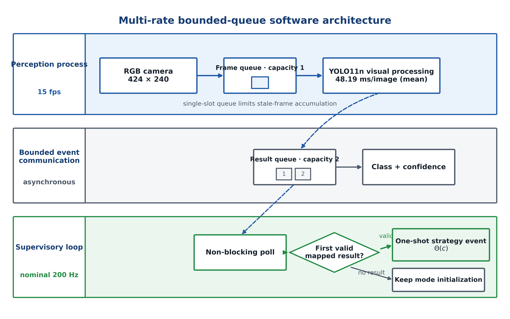

# 面向异质对象触觉遥操作的视觉语义多通道参数调度

*Vision-Semantic Multi-Channel Parameter Scheduling for Haptic Teleoperation of Heterogeneous Objects*

## Abstract

Haptic teleoperation of heterogeneous objects requires coordinated configuration of slave compliance, master haptic rendering, and gripper execution. This paper presents a vision-semantic multi-channel parameter scheduling framework that maps object classes to three operation-oriented strategies and a discrete seven-dimensional parameter vector covering translational/rotational stiffness, damping ratio, haptic gain, force dead zone, gripper speed, and grasping force. A bounded-queue multi-rate architecture links 15 fps color acquisition and asynchronous YOLO11n inference to a nominal 200 Hz supervisory teleoperation loop without making perception a synchronous prerequisite. After task onset, the first valid visual result triggers one-shot parameter selection; later detections do not cause intra-trial switching. Three operators completed 135 grasp-and-transfer trials with six objects under five modes: fixed parameters, operator selection, visual cue only, vision-semantic impedance-only scheduling, and full multi-channel scheduling. Full scheduling achieved the shortest median completion time (19.57 s, IQR [18.41, 20.05]), the highest descriptive success rate (26/27, 96.3%), and the lowest Raw NASA-TLX (48.67, IQR [47.67, 51.83]). Relative to impedance-only scheduling, it reduced mean completion time by 1.79 s (matched-task-block bootstrap 95% CI [1.10, 2.51] s; 8.5%). Operator- and object-stratified mean differences were directionally consistent within the tested sample. These results support the system-level benefit of coordinating haptic-interface and gripper parameters with impedance under the tested conditions, while not isolating the contribution of individual channels.

**Keywords:** mechatronic systems; haptic teleoperation; object semantics; impedance control; perception–control integration; human-in-the-loop experiment

---

## 1 引言

遥操作机器人将人的判断能力与远端机器人执行能力结合起来，适用于柔性制造、危险环境作业、服务机器人和非结构化对象操作等任务。触觉遥操作进一步通过主端力反馈向操作者传递远端接触信息，从而改善操作者对抓取、接触和滑移风险的感知。双边遥操作的经典研究系统讨论了稳定性与透明性之间的关系，而环境、操作者和任务信息驱动的控制器综述则表明，任务相关先验能够进入遥操作控制结构 [1,2]。从机电系统设计角度看，一个实用平台还需要协调机械执行、人机接口、视觉感知、实时控制和参数调度等多个子系统。

在真实抓取任务中，操作者会面对形状、表面、易损性和抓取需求各不相同的对象。如果系统始终采用一组固定的阻抗、触觉接口和夹爪参数，就必须在柔顺接触、响应速度、定位稳定性和抓取可靠性之间折中。类似问题不仅存在于实验室桌面抓取，也会出现在远程维护、危险物料处理、柔性分拣、非结构化拆解和人在环监督作业等场景中。本文并不试图建立覆盖所有工业对象的分类体系，而是选取苹果、香蕉、纸杯、瓶子、鼠标和剪刀作为一组受控的机电基准任务对象。该对象集覆盖易损或光滑物体、轻质容器、刚性工具和几何形状不规则对象等典型操作需求，用于激发柔顺性、触觉接口敏感性和夹爪执行参数方面的差异。

阻抗控制通过规定机器人位移偏差、速度偏差与交互力之间的动态关系，为接触过程提供柔顺性 [3]。固定阻抗控制实现简单、部署方便，但难以同时适配易损、轻质和刚性对象。变阻抗研究进一步讨论了时变刚度的稳定性约束以及基于控制和学习的调节方法 [4,5]。在遥操作场景中，早期用户控制变阻抗方法允许操作者显式改变从端阻抗 [6]；tele-impedance 随后将操作者运动和阻抗信息映射到远端机器人 [7]，并进一步与双边力反馈及接触任务自适应控制结合 [8,9]。这些方法能够依据人体状态、接触力或任务过程持续调节阻抗，但通常需要额外的人体测量、示教数据、接触后反馈或稳定性机制。

视觉信息也已被用于阻抗与遥操作辅助。视觉—语音半自主 tele-impedance 可根据检测到的对象属性在接触前选择从端阻抗，并允许操作者确认或纠正选择 [10]；视觉阻抗框架则在视觉特征空间中连续融合视觉与力信息 [11]。在与本文最接近的后续工作中，Siegemund 等根据视觉检测到的对象几何、材料及其与环境的关系计算机器人刚度 [13]，Jekel 等进一步利用视觉、注视和语言生成任务相关刚度矩阵 [14]。这些研究证明了视觉任务信息可以前馈或交互式地设置从端阻抗，但其主要调节对象仍是机器人刚度或阻抗矩阵。

另一方面，意图推断、自动模式切换和共享控制可降低操作者的决策负担 [12,15,16,24]；触觉反馈在脆弱对象、软硬对象和受限视觉条件下的实验中改善了力感知或任务表现 [17,22,25]；近期变阻抗遥操作还分别研究了接触装配、人体与环境刚度估计、转动阻抗和子任务识别驱动的缩放切换 [18–21]。混合现实多刚度界面则使操作者能够同时观察和控制机器人与环境刚度 [23]。近年的 Mechatronics 研究也通过自动切换、无源仲裁、手指触觉反馈和双边变阻抗装配实验评价了系统级性能 [15–18]。然而，在异质对象触觉遥操作中，对象语义不仅影响从端机械臂柔顺性，也影响操作者所感知的触觉反馈强度、力接口死区、夹爪闭合速度和抓取力。若系统只显示视觉信息而不改变动力学和执行参数，操作者仍需要手动补偿不合适的系统手感；若系统只调节阻抗而保持默认触觉接口和夹爪参数，抓取和转运阶段仍可能受到执行通道和接口通道的限制。因此，本文关注的研究缺口不是“视觉能否调节阻抗”，而是对象语义能否一次性协调从端阻抗、主端触觉接口和夹爪执行参数，并通过包含视觉提示、操作者选择和仅阻抗调度的多基线实验检验完整参数包的系统级价值。
基于这一问题，本文从机电系统集成角度提出一种视觉语义驱动的跨通道机电参数协同调度框架。系统面向接近阶段，将任务开始后的首次有效识别结果映射为三类操作策略，并通过离散、可解释的参数表一次性协调从端阻抗、主端触觉接口和夹爪执行参数。本文进一步通过模式 A（固定参数）、模式 B（操作者选择完整参数策略）、模式 C（视觉语义完整多通道调度）、模式 D（仅视觉提示）和模式 E（视觉语义仅阻抗调度）五种实验模式，检验完整跨通道协调是否优于各类基线。本文贡献如下：

1. **基于有界队列的多速率机电架构。** 15 fps 彩色采集、独立语义推理、限制积压的单槽帧通信和名义 200 Hz 监督式遥操作更新被统一到异步感知—控制架构中，使视觉计算与高频遥操作更新在软件执行路径上分离。
2. **视觉语义—操作策略—控制参数三级映射。** 对象类别被转换为易损优先、折中和稳定优先三类策略，使视觉信息能够作为接近阶段的任务先验进入机电遥操作系统。
3. **跨通道机电参数协同调度。** 除调节从端平移/转动刚度和阻尼比之外，该方法还同时设置主端触觉接口增益、力接口死区、夹爪闭合速度和抓取力，将感知、操作者接口与机械执行组织为一个有界、可解释的七维参数空间。
4. **五模式人在环消融验证。** 在真实 Omega.7–Panda 平台上设置模式 A（固定参数）、模式 B（操作者选择完整参数策略）、模式 C（视觉语义完整多通道调度）、模式 D（仅视觉提示）和模式 E（视觉语义仅阻抗调度），用于区分视觉提示、操作者参数选择、仅阻抗调节和完整多通道机电协同的作用。

不同于依赖接触后连续自适应或持续视觉伺服的研究，本文关注对象语义驱动的跨通道前馈协调：首次有效视觉结果调用一组有界机电参数，并通过单槽无积压帧通信与名义高频遥操作更新形成多速率异步执行。该设计把视觉感知的作用从界面提示扩展为对从端动力学、主端交互和夹爪执行的系统级协调。本文的核心定位是：面向异质对象遥操作的一种低计算量、可解释、可部署的跨通道机电参数协同调度方法。

---

## 2 方法与系统实现

### 2.1 机电系统架构与异步执行

实验平台由 Omega.7 力反馈主端、Franka Panda 7 自由度机械臂及 Franka Hand 夹爪 [26]、Intel RealSense D435i 和控制计算机构成（Fig. 1）。正式实验仅使用 D435i 的 424×240 彩色流，采集率为 15 fps；深度流不参与语义识别或参数调度。控制计算机执行视觉感知、名义 200 Hz 监督式遥操作更新、参数调度、触觉渲染、夹爪命令和数据记录。

**Fig. 1.** Experimental teleoperation platform comprising an Omega.7 haptic device, a Franka Panda robot with a Franka Hand gripper, a D435i RGB-D camera, and the host PC; color images were acquired at 424 × 240 pixels and 15 fps.

Figure 2 summarizes the bounded-queue software path connecting 15 fps image acquisition and independent visual processing to the nominal 200 Hz supervisory loop.

**Fig. 2.** Multi-rate bounded-queue software architecture for asynchronous strategy-event generation. RGB frames acquired at 15 fps are delivered through a single-slot frame queue to an independent YOLO11n process, and class-confidence results are returned through a two-slot result queue. The nominal 200 Hz supervisory loop polls the result queue non-blockingly and emits at most one strategy event $\Theta(c)$ from the first valid mapped result; otherwise, the mode-specific initialization is retained.

RGB frames are written to a single-slot frame queue, which limits stale-frame accumulation, and YOLO11n executes in an independent process. Class and confidence results are returned through a result queue of capacity 2. The supervisory thread polls this queue non-blockingly during the nominal 200 Hz update and generates at most one strategy event from the first valid mapped result. If no valid mapped result is available, the mode-specific initialization is retained; later detections do not cause intra-trial strategy switching. The controlled visual test yielded a mean wall-clock processing time of 48.19 ms per image, which characterizes processing throughput rather than the 15 fps acquisition rate. Camera acquisition and teleoperation start concurrently, without requiring the operator to wait for recognition. Table 1 summarizes the execution interfaces and time scales.

**表 1.** 多速率机电系统的执行与通信特征。

| 模块 | 频率/延迟 | 输入 | 输出 | 是否阻塞主环？ |
|:---|---:|---:|---|:---:|
| 主端输入 | 200 Hz | Omega.7 位姿与按钮 | \\(\Delta\mathbf{x}_m\\) | 否 |
| 从端控制 | 200 Hz | \\(\mathbf{x}_d, \mathbf{K}, \mathbf{D}\\) | Panda 期望位姿/阻抗命令 | 否 |
| 视觉检测 | 15 fps；48.19 ms/图 | 424×240 彩色图像 | 类别、置信度 | 否（子进程） |
| 策略调度 | 首次有效检测 | 类别、置信度 | \\(\Theta(c)\\) | 否 |
| 触觉渲染 | 200 Hz | \\(\mathbf{F}_{ext},K_f,d\\) | Omega.7 力向量 | 否 |
| 夹爪命令 | 按钮事件 | 夹爪输入、\\(v_g,F_g\\) | Franka Hand 命令 | 否 |

### 2.2 主从映射与机电通道实现

主端相邻采样时刻的位置增量及从端期望位置更新为

\[
\Delta\mathbf{x}_m(k)=\mathbf{x}_m(k)-\mathbf{x}_m(k-1),
\]

\[
\mathbf{x}_d(k)=\mathbf{x}_d(k-1)+S\mathbf{C}\Delta\mathbf{x}_m(k),
\]

其中，位置缩放因子 \\(S=3.0\\)，坐标映射矩阵 \\(\mathbf{C}=\mathrm{diag}(-1,-1,1)\\)。从端采用笛卡尔阻抗控制：

\[
\mathbf{F}_c=\mathbf{K}(c)(\mathbf{x}_d-\mathbf{x})+\mathbf{D}(c)(\dot{\mathbf{x}}_d-\dot{\mathbf{x}}),
\]

\[
\mathbf{K}(c)=\mathrm{diag}(K_t,K_t,K_t,K_r,K_r,K_r),
\]

其中，\\(c\\) 为策略类别，阻尼矩阵 \\(\mathbf{D}(c)\\) 根据阻尼比 \\(\zeta(c)\\) 配置。

Franka 内部状态估计提供从端外力 \\(\mathbf{F}_{\mathrm{ext}}\\)。Omega.7 的触觉增益 \\(K_f\\) 和逐轴死区 \\(d\\) 按策略设置，第 \\(i\\) 个方向的基础触觉命令为

\[
u_{h,i}=\operatorname{sgn}\!\left(K_fF_{\mathrm{ext},i}\right)
\max\!\left(\left|K_fF_{\mathrm{ext},i}\right|-d,0\right),
\quad i\in\{x,y,z\}.
\]

软件在 \\(z\\) 方向叠加由主端夹爪输入生成并限幅的夹爪状态提示 \\(u_g\\)，即 \\(u_{h,z}\leftarrow u_{h,z}+u_g\\)。Franka Hand 按策略给定的闭合速度 \\(v_g\\) 和抓取力 \\(F_g\\) 执行夹爪命令。因此，调度作用于从端阻抗、主端触觉接口和夹爪执行三个通道；本文不把该触觉实现解释为已完成透明性或闭环力控制验证。

### 2.3 视觉语义多通道参数调度

系统采用“对象语义—操作策略—控制参数”三级映射。苹果和香蕉映射为易损优先策略，纸杯和瓶子映射为折中策略，鼠标和剪刀映射为稳定优先策略。该划分描述当前任务中的操作风险和抓取需求，而非通用材料刚度分类。完整策略向量为

\[
\Theta(c)=\{K_t,K_r,\zeta,K_f,d,v_g,F_g\}.
\]

当置信度 ≥ 0.25 的首个可映射结果可用时，系统进行一次性策略选择；后续检测不再触发试验内切换。从端刚度和阻尼在约 300 ms 内 smoothstep 过渡，其他通道按所选策略设置。该机制面向任务早期调度，但不作为运动启动门限，也不构成每次试验均在接触前完成的保证。

**表 2.** 三类面向操作策略的参数表。

| 策略 | 对象 | \\(K_t\\) (N/m) | \\(K_r\\) (N·m/rad) | \\(\zeta\\) | \\(K_f\\) | \\(d\\) (N) | \\(v_g\\) (m/s) | \\(F_g\\) (N) |
|---|---|---:|---:|---:|---:|---:|---:|---:|
| 易损优先 | 苹果、香蕉 | 50 | 5 | 0.8 | 0.2 | 0.3 | 0.02 | 8 |
| 折中 | 纸杯、瓶子 | 150 | 10 | 1.0 | 0.5 | 0.4 | 0.05 | 15 |
| 稳定优先 | 鼠标、剪刀 | 200 | 13 | 1.2 | 0.7 | 0.5 | 0.10 | 20 |

### 2.4 实验模式配置与参数依据

固定基线向量定义为

\[
\Theta_0=(150,\ 10,\ 1.0,\ 0.5,\ 0.3,\ 0.10,\ 20),
\]

其元素顺序与 \\(\Theta(c)\\) 一致。表 3 列出五种模式的初始化、调度范围和无有效视觉结果时的状态。

**表 3.** 五种实验模式的参数作用范围、初始化条件与回退行为。

| 模式 | 任务开始/触发前参数 | 选择或触发后的参数 | 无效或不可映射视觉结果 |
|:---:|:---|:---|:---|
| A 固定参数 | 全程使用 \\(\Theta_0\\) | 无参数选择事件 | 视觉未启用；保持 \\(\Theta_0\\) |
| B 操作者选择 | 从表 2 选择完整策略 | 所选策略设置七个参数；选择时间计入任务时间 | 视觉不参与，无视觉回退 |
| C 完整多通道 | 使用 \\(\Theta_0\\) | 首次有效结果设置全部七个参数 | 保持 \\(\Theta_0\\) |
| D 仅视觉提示 | 全程使用 \\(\Theta_0\\) | 仅显示提示，不更新参数 | 保持 \\(\Theta_0\\) |
| E 仅阻抗调度 | 使用 \\(\Theta_0\\) | 仅设置 \\(K_t,K_r,\zeta\\)；其余保持 \\(0.5,0.3,0.10,20\\) | 保持 \\(\Theta_0\\) |

参数表是在 Panda 阻抗稳定性、Omega.7 触觉舒适性、Franka Hand 执行限制和对象操作风险的共同约束下确定的有界设计点（表 4）。正式实验前，两名研究人员通过覆盖三类策略的预实验排除明显振荡、触觉不适、夹持不稳或对象损伤风险的组合，并冻结低、中、高三个代表性配置。它们用于定义可复现的工作包络，而非声称全局最优。程序启动时，从端刚度和阻尼从软件默认值向模式目标执行相同的约 300 ms smoothstep 过渡。

**表 4.** 参数设计空间：低值和高值的物理含义、硬件约束及本文取值。

| 参数 | 低值含义 | 高值含义 | 硬件/安全约束 | 本文取值 |
|:---|:---|:---|:---|:---|
| \\(K_t\\) | 柔顺性强、冲击小 | 定位稳定性高 | Panda 阻抗环稳定范围 | 50 / 150 / 200 |
| \\(K_r\\) | 姿态更柔顺 | 姿态更稳定 | 转动响应稳定性 | 5 / 10 / 13 |
| \\(\zeta\\) | 响应快、可能振荡 | 阻尼更强 | 避免超调 | 0.8 / 1.0 / 1.2 |
| \\(K_f\\) | 触觉线索较弱 | 接触感知更强 | Omega.7 舒适范围 | 0.2 / 0.5 / 0.7 |
| \\(d\\) | 对小力敏感 | 抑制噪声 | 触觉接口抖动 | 0.3 / 0.4 / 0.5 |
| \\(v_g\\) | 低冲击闭合 | 快速抓取 | Franka Hand 执行限制 | 0.02 / 0.05 / 0.10 |
| \\(F_g\\) | 温和抓取 | 抓取稳定性高 | 夹爪力限制 | 8 / 15 / 20 |

### 2.5 执行流程

**算法 1：视觉语义多通道参数调度**

1. 加载表 3 所列模式参数，并同时启动视觉进程和名义 200 Hz 监督式遥操作更新。
2. 视觉进程异步检测对象；监督式线程非阻塞读取结果并完成对象—策略映射。
3. 首个有效结果按模式设置相应通道，其中刚度和阻尼平滑过渡；无有效结果时保持表 3 的初始化状态。
4. 遥操作、触觉渲染和夹爪执行持续运行；已选择策略不因后续检测而切换。
5. 到达统一任务终点后记录结果并重置系统。

### 2.6 有界回退与安全措施

误分类会调用另一个预定义且有界的参数集，从而避免无界在线变化，但不能保证该参数集仍适合被误分类对象或确保对象无损。低置信度和不可映射结果按表 3 保持模式初始化参数。机械臂碰撞检测、夹爪力限制、程序退出零力命令、统一初始位姿和人工急停提供平台级基础保护；本文不将这些措施解释为经过认证的误分类安全保证。

---

## 3 实验设计

### 3.1 研究问题与假设

本文回答以下研究问题：

- **RQ1：** 模式 C（视觉语义完整多通道调度）是否优于模式 A（固定参数）、模式 B（操作者选择完整参数策略）和模式 D（仅视觉提示）？
- **RQ2：** 模式 C（视觉语义完整多通道调度）是否优于模式 E（视觉语义仅阻抗调度）？
- **RQ3：** 异步视觉推理能否通过有界队列和非阻塞通信集成到遥操作系统，而不成为每次监督式遥操作更新的同步执行步骤？
- **RQ4：** 该方法的收益是否在不同操作者和不同测试对象上表现出一致方向？

相应预期为：与基线模式相比，模式 C（视觉语义完整多通道调度）将缩短完成时间，并在主观工作负荷和描述性成功率方面呈现有利结果；与模式 E（视觉语义仅阻抗调度）相比，模式 C 将表现出系统级完成时间优势。主端轨迹长度和停顿次数用于探索可能的过程差异，不预设其必然显著改变，也不用于单独证明机制。

### 3.2 操作者与实验对象

三名操作者（P01–P03，23–24 岁，2 名男性、1 名女性，均为右利手）参与主实验。实验中 Omega.7 主端统一布置在操作者左侧，并由左手操作；该手别和设备布置在所有操作者、对象和实验模式中保持一致。三名操作者均具有基础遥操作训练经验，并在每次正式实验前完成 10–15 分钟热身试验，以熟悉左手主端操作、夹爪输入和任务流程。所有操作者均在实验前提供书面知情同意。该研究不涉及医学干预，也不收集可识别个人身份的信息。

实验覆盖六种对象，形成一个 **机电基准任务集**，用于激发柔顺性、触觉接口敏感性和夹爪执行条件方面的不同需求。六种对象被分配到易损优先、折中和稳定优先策略。该分类用于当前实验任务中的参数调度，并不声称代表对象材料属性的通用物理分类。

| 对象 | 策略 | 质量 (g) | 表面 | 尺寸 (mm) | 主要任务风险 |
|:---:|:---:|---:|:---|:---|:---|
| 苹果 | 易损优先 | ~200 | 光滑 | Ø70–80 | 冲击/滑移风险，需要温和接触 |
| 香蕉 | 易损优先 | ~120 | 光滑 | 20×180 | 挤压变形和滑移风险 |
| 纸杯 | 折中 | ~5 | 纸质 | Ø75×90 | 易变形，需要稳定抓取 |
| 瓶子 | 折中 | ~30 | 光滑塑料 | Ø65×200 | 易滑，需要效率—稳定性折中 |
| 鼠标 | 稳定优先 | ~100 | 光滑塑料 | 65×120×35 | 刚性、不规则表面，转运滑移风险 |
| 剪刀 | 稳定优先 | ~150 | 金属+塑料 | 50×170×15 | 刚性、细长，对姿态精度要求高 |

### 3.3 实验模式与试验结构

实验包含五种模式：

| 模式 | 设置 | 目的 |
|:---:|:---|:---|
| A | 固定参数，无视觉调度 | 固定控制基线 |
| B | 操作者选择完整参数策略 | 操作者选择工作流基线 |
| C | 视觉语义完整多通道调度 | 本文方法（完整机电调度） |
| D | 仅视觉提示，保持固定参数 | 隔离视觉提示本身的作用 |
| E | 视觉语义仅调度 \\(K_t,K_r,\zeta\\) | 仅阻抗消融 |

模式 A 测试固定参数在异质对象上的折中局限。模式 B 测试操作者选择工作流是否引入额外判断和切换负担。模式 D 区分视觉提示和控制参数改变的作用。模式 E 测试仅阻抗调节是否足以复现完整多通道机电参数策略。C–E 比较是本文核心 **系统级** 消融，因为两者均使用视觉语义和阻抗调节，区别在于模式 C 进一步将主端触觉接口参数和夹爪执行参数纳入同一接近阶段参数组。该比较用于检验对象语义从单一阻抗调度扩展到多通道机电参数协同时，是否能够带来额外的系统级收益。

试验结构以 27 个匹配 block 为基本单位。每个匹配 block 包含同一操作者、同一对象/策略、同一重复序号下的五种模式 A–E，因此总计 \\(27\times5=135\\) 次试验。六种对象在 27 个匹配 block 中的分布如下：

| 策略 | 具体对象 | Block 数 | 试验数（×5 模式） |
|---|---|---:|---:|
| 易损优先 | 苹果 | 4 | 20 |
| 易损优先 | 香蕉 | 5 | 25 |
| 折中 | 纸杯 | 5 | 25 |
| 折中 | 瓶子 | 4 | 20 |
| 稳定优先 | 鼠标 | 5 | 25 |
| 稳定优先 | 剪刀 | 4 | 20 |
| 合计 | 六种对象 | 27 | 135 |

实验过程中对模式顺序进行了部分平衡，以减少单一固定顺序带来的学习或疲劳偏倚。各操作者在不同对象和模式组合下交替完成试验，避免所有试验按照同一模式顺序执行。由于对象、操作者和顺序因素在小样本人在环实验中难以完全解耦，Supplementary Table S1 提供 27 个匹配 block 的组成以及 A–E 各模式下的任务执行时长、主端轨迹长度和成功/失败结果。该补充表按分析顺序列出 A–E，不表示实际时间执行顺序。

### 3.4 任务与流程

每次试验包含六个阶段：复位、接近、抓取、转运、释放和任务结束。Fig. 3 概括了 Fig. 2 所生成的一次性策略事件如何进入人在环遥操作闭环，以及该事件在五种实验模式下的不同作用范围。如 Fig. 2 所示，任务开始后相机和遥操作同时启动，操作者无需等待视觉识别即可进入接近阶段；模式 C 和 E 在首次有效视觉结果可用时触发一次性策略选择。该协议旨在任务早期完成调度，但正式试验记录未保存策略事件与物理接触的同步时间戳，因此不把每次事件均发生在接触前写成结果。成功定义为在统一任务终点前完成抓取—转运—放置，且没有掉落、可观察滑移或可见对象损伤；成功与失败试验均计时至同一任务终点。每次试验记录主端轨迹、夹爪输入、控制参数和任务时长。在模式 B 中，操作者通过按键选择策略，操作者识别与策略选择所需时间计入总完成时间；因此，模式 B 代表包含操作者判断和切换开销的工作流基线。

**Fig. 3.** Human-in-the-loop teleoperation structure and five-mode ablation. (a) The one-shot strategy event $\Theta(c)$ generated by the asynchronous software path in Fig. 2 configures the applicable slave-impedance, master haptic-interface, and gripper-execution parameters without gating operator motion; the continuous loop connects operator commands, robot–object interaction, and haptic feedback. (b) Modes A–E represent fixed parameters, operator-selected strategy, full vision-semantic multi-channel scheduling, visual cue only, and vision-semantic impedance-only scheduling, respectively. Check marks denote strategy-dependent parameter updates; Table 3 gives initialization and fallback details.

### 3.5 评价指标

主要终点为完成时间。成功率作为描述性结果报告；主端轨迹长度和停顿次数作为探索性客观指标。主观工作负荷采用未加权 Raw NASA-TLX 评估，即六个维度的算术平均 [27]。NASA-TLX 分数在“操作者 × 对象策略 × 模式”层级收集。视觉模块报告类别识别准确率、策略触发准确率、置信度和单帧处理时间。

过程行为指标在正式统计分析前定义并固定。停顿定义为主端速度低于 0.005 m/s 且持续至少 0.30 s，由约 200 Hz 采样的原始主端轨迹 CSV 通过速度差分检测得到。

### 3.6 统计分析

统计分析以重复测量和配对比较为主。五模式完成时间采用 Friedman 检验进行全局比较；在全局差异后，采用配对 Wilcoxon 符号秩检验进行模式间比较，并使用 Holm–Bonferroni 方法校正多重比较。匹配任务块指同一操作者、同一对象和同一重复条件下不同模式之间的配对单元。C–E 比较作为核心系统消融，进一步报告配对均值差、相对变化和客观指标的 Bootstrap 95% 置信区间（10,000 次匹配任务块级重采样），并检查三名操作者内的方向一致性。为评估结果对单名操作者的依赖，另进行 leave-one-operator-out 描述性敏感性分析。Raw NASA-TLX 在“操作者 × 策略”九个配对单元上进行非参数配对描述，不报告 Bootstrap 置信区间，并结合仅三名操作者的限制解释。由于 27 个匹配任务块嵌套于三名操作者，任务块级检验和区间仅作为当前样本内的配对证据，不等同于 27 名独立参与者的总体推断。轨迹长度和停顿次数为探索性指标，成功率为描述性指标。结果同时报告 median [IQR] 与 mean ± SD。Fig. 4–7 的数值均由冻结数据源通过作者核验的 Python/Matplotlib 脚本生成，并与正文和表格交叉复核。

---

## 4 实验结果

### 4.1 视觉识别、语义映射与异步集成验证

如 Fig. 4 所示，视觉测试集由每类 30 张独立拍摄的照片组成，共 180 张；这些照片未参与模型训练或参数调节，并在受控视角、背景和光照条件下采集。类别识别和策略触发达到 180/180（100%），平均置信度为 0.853，单帧 wall-clock 平均处理时间为 48.19 ms。该结果刻画独立受控测试集上的视觉性能，但不代表不同对象实例、遮挡、强光照变化、杂乱背景、未知对象或未测试类别下的开放场景泛化能力。

| 对象 | 图像数 | 类别准确率 | 策略触发准确率 | 平均置信度 | 时间 (ms) |
|---|---:|---:|---:|---:|---:|
| 苹果 | 30 | 100% | 100% | 0.771 | 49.89 |
| 香蕉 | 30 | 100% | 100% | 0.948 | 48.02 |
| 瓶子 | 30 | 100% | 100% | 0.726 | 48.57 |
| 纸杯 | 30 | 100% | 100% | 0.820 | 46.62 |
| 鼠标 | 30 | 100% | 100% | 0.914 | 46.79 |
| 剪刀 | 30 | 100% | 100% | 0.938 | 49.27 |

**Fig. 4.** Recognition and strategy-selection results on the independent controlled test set (180 images; 30 per class). (a) Confusion matrix. (b) Class-wise detection confidence (mean $\pm$ SD; dotted line, threshold; dashed line, overall mean). (c) Per-image wall-clock processing time (points, images; boxes, IQR with median; diamonds, mean $\pm$ SD).

针对 RQ3，正式实现采用独立 YOLO 子进程、容量为 1 的帧队列、容量为 2 的结果队列和监督式更新线程中的非阻塞读取。视觉推理由此不构成每次名义 200 Hz 遥操作更新的同步前置步骤。现有周期日志的中位周期约为 5.07 ms，但存在长尾，因此该证据支持的是软件执行路径层面的异步集成，而不是硬实时性能或每次试验中策略事件相对于物理接触的时间保证。

### 4.2 五模式实验结果

**表 5.** 五模式实验结果：完成时间、主端轨迹长度、成功率和 Raw NASA-TLX。数值以 median [IQR] 报告，括号内为 mean±SD。

| 模式 | 完成时间 (s) | 轨迹长度 (m) | 成功率 | Raw NASA-TLX |
|:---:|:---:|:---:|:---:|:---:|
| A 固定参数 | 21.18 [20.62, 22.08] (21.42±1.58) | 0.757 [0.693, 0.816] (0.763±0.098) | 22/27 (81.5%) | 62.50 [59.67, 64.50] (62.59±3.95) |
| B 操作者选择 | 20.89 [20.12, 21.83] (21.01±1.61) | 0.787 [0.721, 0.861] (0.799±0.115) | 21/27 (77.8%) | 56.17 [55.00, 59.33] (57.15±3.68) |
| **C 完整多通道** | **19.57 [18.41, 20.05] (19.28±1.30)** | **0.697 [0.660, 0.769] (0.715±0.092)** | **26/27 (96.3%)** | **48.67 [47.67, 51.83] (49.67±3.63)** |
| D 仅视觉提示 | 20.79 [20.32, 21.16] (20.91±1.10) | 0.722 [0.678, 0.768] (0.734±0.085) | 24/27 (88.9%) | 60.33 [57.33, 62.50] (60.22±3.85) |
| E 仅阻抗调度 | 20.73 [19.95, 22.25] (21.07±1.56) | 0.732 [0.678, 0.799] (0.739±0.084) | 24/27 (88.9%) | 53.67 [51.83, 57.83] (54.54±4.09) |

如 Fig. 5 所示，描述性结果显示，模式 C 在五种模式中取得最短完成时间中位数、最短主端轨迹中位数、最高描述性成功率和最低 Raw NASA-TLX。与模式 A、B、D 和 E 相比，模式 C 的平均完成时间分别降低约 10.0%、8.2%、7.8% 和 8.5%。完成时间是主要终点；其余指标按预先说明的次要、探索性或描述性层级解释。

五模式完成时间 Friedman 检验提示五种模式之间存在任务块级全局差异（$\chi^2(4)=30.904$, $p<0.001$）。经 Holm 校正的配对 Wilcoxon 检验显示，在当前 27 个匹配任务块中，模式 C 的完成时间低于模式 A、B、D 和 E（校正后 $p<0.01$，效应量 $r>0.7$）。这些任务块嵌套于三名操作者，故统计量表征当前样本内的重复测量证据，不应解释为来自 27 名独立参与者的人群推断。Raw NASA-TLX 在每模式九个“操作者 × 策略”单元上呈现模式 C 最低的结果，并与完成时间和描述性成功率方向一致；鉴于仅有三名操作者，该结果作为有限样本内的主观工作负荷证据解释。

**Fig. 5.** Descriptive comparison of five experimental modes: fixed (A), operator-selected (B), full vision-semantic multi-channel scheduling (C), visual cue only (D), and impedance-only scheduling (E). (a) Task duration, (b) master-side trajectory length, (c) Raw NASA-TLX, and (d) success rate. In (a) and (b), markers denote 27 matched task blocks per mode and shapes denote operators; boxes show IQR, medians, and 1.5×IQR whiskers. In (c), small markers are questionnaire units and connected large markers are operator means; (d) reports successes out of 27 attempts.

### 4.3 核心消融：视觉语义完整多通道调度 vs. 视觉语义仅阻抗调度

**表 6.** 核心 C–E 消融：median [IQR]、配对改善量 $\Delta T=T_E-T_C$、客观指标的匹配任务块级 Bootstrap 95% CI（10,000 次重采样）和操作者层面方向。正值表示模式 C 的指标更优；NASA-TLX 不报告 Bootstrap 区间。

| 指标 | C (median [IQR]) | E (median [IQR]) | 描述性平均改善 Δ (E−C) | 匹配任务块级 Bootstrap 95% CI | 方向 |
|:---|---:|---:|---:|---:|:---|
| 完成时间 (s) | 19.57 [18.41, 20.05] | 20.73 [19.95, 22.25] | 1.79 | [1.10, 2.51] | 3/3 操作者支持 C 更快 |
| 轨迹长度 (m) | 0.697 [0.660, 0.769] | 0.732 [0.678, 0.799] | 0.024 | [−0.014, 0.059] | mixed |
| Raw NASA-TLX | 48.67 [47.67, 51.83] | 53.67 [51.83, 57.83] | 4.87 | — | 3/3 操作者支持 C 更低 |

C–E 比较是本文最关键的 **系统级** 消融。两种模式都使用视觉语义和阻抗调节；区别在于模式 C 进一步将主端触觉接口增益、力接口死区、夹爪闭合速度和抓取力纳入同一接近阶段参数组。该设计测试的是一个工程问题：在异质对象触觉遥操作中，仅调节从端柔顺性是否足以覆盖抓取需求，还是需要将操作者端接口和夹爪执行通道与阻抗一起调度。因此，C–E 比较用于评估完整多通道参数组相对于仅阻抗调节的系统级收益。

如 Fig. 6 所示，在 27 个匹配任务块中，模式 C 完成时间中位数为 19.57 s，模式 E 为 20.73 s。按 $\Delta T=T_E-T_C$ 定义，平均配对改善为 1.79 s（匹配任务块级 Bootstrap 95% CI [1.10, 2.51] s），相对降低约 8.5%。置信区间未跨越零，支持模式 C 在当前任务块和操作者范围内呈现一致的配对完成时间优势。进一步的分层结果见 Fig. 7：P01、P02 和 P03 的平均改善分别为 1.66、2.56 和 1.16 s；六种对象的相对降低范围为 3.3%–13.2%。

主端轨迹长度差异较小（0.697 m vs. 0.732 m）；按 $E-C$ 定义的缩短量为 0.024 m，Bootstrap 95% CI [−0.014, 0.059] m 跨越零。结合 Fig. 5(b) 与停顿分析，这说明当前数据不支持“几何路径显著缩短”的解释；停顿次数的描述性方向与完成时间结果一致，但尚不足以把时间优势归因于抓取、转运或释放阶段的某一机制。阶段级时间标注、重新抓取记录和组件级消融可用于进一步检验机制。

**Fig. 6.** Core C–E ablation of task execution duration. (a) Paired durations for 27 matched task blocks; points below the identity line favor mode C. (b) Paired improvement, $\Delta T = T_E - T_C$; positive values favor mode C. Marker shapes indicate operators; the violin, horizontal bar, and diamond show the distribution, median, and mean, respectively.

### 4.4 过程行为指标：C–E 停顿分析

停顿次数由原始主端轨迹 CSV 按固定脚本计算，轨迹名义采样频率约 200 Hz。停顿定义为主端速度低于 0.005 m/s 且持续至少 0.30 s。模式 C 单次试验停顿次数中位数为 3 [2, 3.5] IQR，均值为 2.74±1.23；模式 E 为 3 [2, 5] IQR，均值为 3.41±1.67。三类策略均表现出模式 C 停顿次数更少的方向。该描述性结果与 C–E 完成时间差异方向一致，但两组停顿次数中位数均为 3，且当前实验未进行阶段级或组件级消融，因此不能据此确定时间改善的具体机制。

### 4.5 失败案例分析

按实验评分表汇总，135 次试验共记录 18 次失败（A–E 分别为 5、6、1、3 和 3 次），包括掉落、可观察滑移或可见损伤。各模式失败分布如下：

| 模式 | 失败/总数 | 典型观察 |
|:---:|:---:|:---|
| A 固定参数 | 5/27 | 纸杯挤压变形，剪刀定位不稳定 |
| B 操作者选择 | 6/27 | 人工选择流程包含额外判断与切换步骤；现有记录不足以归因具体失败原因 |
| **C 完整多通道** | **1/27** | 鼠标表面较滑，转运中滑移 |
| D 仅视觉提示 | 3/27 | 出现掉落或夹持保持失败 |
| E 仅阻抗调度 | 3/27 | 部分对象在抓取或转运过程中失稳 |

模式 C 在当前实验中失败数最低（1/27），其余模式的失败表现包括掉落、可观察滑移、纸杯挤压变形或定位不稳定。由于失败记录主要位于任务层级，且未包含独立标定的接触力、滑移量和损伤量，本文仅将该分布作为描述性系统结果，不把具体失败归因于某一参数通道。

### 4.6 跨操作者与六对象一致性

Fig. 7 汇总了操作者和对象分层的一致性结果。三名操作者在平均完成时间上均表现出 C 快于 E 的方向；在对象层面，模式 C 对所有六种测试对象也均取得五种模式中最短的平均完成时间。各对象结果如下：

| 对象 | A 固定参数 (s) | B 操作者选择 (s) | **C 完整多通道 (s)** | D 仅视觉提示 (s) | E 仅阻抗调度 (s) |
|:---:|---:|---:|---:|---:|---:|
| 苹果 | 20.46 | 21.40 | **19.25** | 20.81 | 20.94 |
| 香蕉 | 20.07 | 20.85 | **19.49** | 21.06 | 20.64 |
| 纸杯 | 22.36 | 20.27 | **18.69** | 20.38 | 21.17 |
| 瓶子 | 22.11 | 22.14 | **19.63** | 20.78 | 20.30 |
| 鼠标 | 21.74 | 20.93 | **19.75** | 20.74 | 21.64 |
| 剪刀 | 21.79 | 20.70 | **18.84** | 21.83 | 21.70 |

C 相对于 E 的时间降低幅度从瓶子的 3.3%，到香蕉的 5.5%、苹果的 8.1%、鼠标的 8.7%、纸杯的 11.7% 和剪刀的 13.2%。这表明完整多通道调度在本文测试对象集内均呈现相同方向的时间收益，且收益幅度随对象操作需求不同而变化。

在操作者层面，按 $\Delta T=T_E-T_C$ 定义，P01、P02 和 P03 的平均改善分别为 1.66、2.56 和 1.16 s；各自的配对差中位数 [IQR] 分别为 1.91 [0.60, 3.14]、2.63 [2.19, 3.34] 和 1.60 [−0.53, 1.73] s，模式 C 更快的任务块分别为 7/9、9/9 和 6/9。Leave-one-operator-out 敏感性分析中，依次删除 P01、P02 或 P03 后，剩余任务块的平均改善分别为 1.86、1.41 和 2.11 s，方向均保持为模式 C 更快。该分析说明总体方向不由任一单名操作者独立驱动，但仍属于三名操作者范围内的描述性稳健性检查，不能替代更大参与者样本的总体推断。

**Fig. 7.** Operator- and object-stratified C–E task-duration improvements. $\Delta T = T_E - T_C > 0$ favors mode C. (a) Results for three operators, with nine matched blocks each. (b) Results for six objects, ordered by mean improvement, with four or five blocks each. Markers show block-level differences, diamonds show means, and horizontal bars show $\pm1$ SD; labels report the mean and number of blocks favoring mode C.

---

## 5 讨论

### 5.1 为什么接近阶段视觉语义调度可以改善机电系统性能

固定参数模式必须用一组折中参数覆盖全部三类策略，难以同时满足易损对象的柔顺需求和刚性对象的稳定定位需求。操作者选择模式虽然可以调用不同策略，但对象判断和策略切换由操作者完成，包含额外工作流步骤。仅视觉提示模式改善了场景信息，却没有改变系统动力学、触觉接口或夹爪执行条件。相比之下，模式 C（视觉语义完整多通道调度）将任务开始后的首次有效对象语义转化为一组面向接近阶段的机电参数，使从端柔顺性、触觉接口设置和夹爪执行条件与当前策略相匹配。该设计解释与 Fig. 5 中更短完成时间和更低主观工作负荷的结果一致；停顿次数仅提供方向一致的探索性过程证据，不能单独建立因果机制。

### 5.2 完整接近阶段机电参数策略相对于仅阻抗调节的意义

模式 C 和模式 E 都根据视觉语义调节平移刚度、转动刚度和阻尼比，因此二者共享从端柔顺性适配机制。模式 C 进一步预设主端触觉接口增益、力接口死区、夹爪闭合速度和抓取力。如 Fig. 6 所示，模式 C 相对于模式 E 的平均完成时间改善为 1.79 s（定义为 $\Delta T=T_E-T_C$；Bootstrap 95% CI [1.10, 2.51] s），相对降低约 8.5%，而主端轨迹长度缩短量较小（0.024 m；95% CI [−0.014, 0.059] m，跨越零）。结合 Fig. 5(b) 和停顿结果，当前数据不支持以几何路径显著缩短解释时间优势，并与“操作停顿或修正减少”的可能解释相容；由于缺少阶段级标注和组件级消融，尚不能确认具体来源。

该结果对应用型机电遥操作系统的工程意义在于，异质对象抓取不只依赖从端末端柔顺性，还依赖操作者接口、从端阻抗和夹爪执行之间的协同配置。仅调节阻抗可以改变接触柔顺性，但难以同时覆盖夹爪闭合速度、抓取力和操作者感知到的接触线索。对于易损或光滑对象，较低刚度、较慢夹爪闭合和较低抓取力有助于降低挤压和滑移风险；对于刚性或几何不规则对象，更稳定的定位、更清晰的接口线索和更可靠的夹持执行有助于减少抓取建立和转运阶段的操作者修正。力接口死区在这里主要用于削弱小幅外力估计波动和触觉接口噪声，使接触线索更稳定。

因此，C–E 消融应从耦合系统角度理解：视觉语义仅阻抗调度提供了柔顺性适配，而完整多通道策略进一步把对象语义转化为操作者接口和夹爪执行条件。本文结果支持该耦合参数组在当前任务集内相对于单一阻抗调度的系统级价值，但不能区分各附加通道的独立因果贡献。

### 5.3 与相关工作的差异

已有 tele-impedance 和变阻抗遥操作研究通常由操作者人体状态、接触力、示教策略或任务阶段连续调节远端阻抗 [6–9,18–21]。视觉方法进一步把对象属性、几何材料信息或视觉—语言交互转化为从端刚度或阻抗矩阵 [10,11,13,14]，而自动切换、共享控制和多刚度界面则分别处理模式选择、控制权分配和操作者交互 [12,15,16,23,24]。因此，本文不把“视觉信息用于阻抗调节”作为首创点。本文的差异在于：使用任务开始后的首次有效对象语义进行一次性、离散且有界的七维参数调度，并把从端平移/转动阻抗、主端触觉增益与死区、夹爪闭合速度和抓取力作为同一参数包协调；五模式实验进一步将完整参数包与固定参数、操作者选择、仅视觉提示和仅阻抗调度进行比较。该定位适合对象类别可识别、环境相对结构化，但仍需操作者完成精细抓取和放置的工程遥操作场景。

### 5.4 对机电遥操作系统设计的启示

本节从机电系统角度提炼三点设计启示：

**1. 感知不应只通知操作者，也应初始化底层接口参数。** 当前结果提示，将视觉语义信息从“操作者提示”升级为“机电参数前馈”，可以在当前测试平台内改善系统级性能，而不增加操作者显式参数选择负担。视觉感知模块不应只是显示器上的信息，而应成为机电参数初始化链条中的一环。

**2. 完整参数包在当前任务集中提供额外系统收益。** 只调节从端阻抗（C–E 消融中的模式 E）能够改变柔顺性，但未能复现完整参数包在当前六对象任务集中的完成时间表现。联合设置操作者触觉接口和夹爪执行参数可能提供额外系统收益；这一结果支持当前参数包的系统级价值，但不意味着所有触觉遥操作任务都必须采用相同的多通道策略。

**3. 基于有界队列的多速率架构提升可部署性。** 系统将 15 fps 彩色采集、平均 48.19 ms 的异步语义推理与名义 200 Hz 遥操作更新组织为三个时间尺度。单槽有界帧通信限制了视觉积压，非阻塞事件注入则避免将推理置于每次遥操作更新的同步路径。该实现允许感知和交互模块按照各自的带宽与计算需求运行，为把语义调度集成到既有触觉遥操作平台提供了可复用的软件模式。

### 5.5 不同对象收益幅度不同的原因

如 Fig. 7(b) 所示，六种对象的平均值均表现出 C 快于 E 的方向，但降低幅度并不一致。瓶子和香蕉的降低幅度较小，可能是因为其抓取姿态相对直接，操作者在仅阻抗模式下仍能通过经验补偿默认夹爪和触觉接口设置。纸杯和剪刀的降低幅度较大，可能与更高的抓取风险和姿态稳定性需求有关：纸杯需要避免挤压变形和不稳定夹持，剪刀则需要更明确的定位和稳定转运。这种对象间差异说明，多通道调度的收益与具体操作需求相关，并非对所有对象产生相同幅度的完成时间降低。

### 5.6 局限性与进一步工作

本文结果需要结合实验规模和任务边界理解。主实验包含三名操作者和六种受控对象，135 次试验提供的是同一平台、同一任务集内的重复测量证据，而不是大样本人因泛化结论。因此，本文重点报告配对趋势、操作者内方向一致性和对象层面一致性。所有操作者均为右利手，主端布置和操作方式在所有模式中保持一致，该设置主要影响绝对完成时间，而不改变模式间配对比较的基本设计。后续研究仍需纳入更多操作者、更多对象实例和不同操作经验水平，以扩展该结果的外部有效性。

实验顺序经过部分平衡，并提供逐次试验顺序以便复核重复结构；但在小样本人在环实验中，对象、操作者和顺序因素仍难以完全解耦。本文将模式比较建立在匹配 block 和操作者内趋势上，未来可采用更严格的随机化或拉丁方设计，以进一步降低学习效应和疲劳效应对绝对任务时间的影响。

视觉验证采用独立于训练和参数调节的180张独立拍摄照片，并在受控视角、背景和光照条件下完成。当前 180/180 的类别识别和策略触发结果说明，在本文受控测试条件下视觉触发不是主要误差来源。开放场景中的新对象实例、遮挡、强光照变化、杂乱背景、未知对象和未测试类别仍需要进一步评估。若对象被误识别为另一个有效类别，系统会选择另一个预定义且有界的参数集；该行为避免无界在线参数变化，但不能保证所选参数对被误分类对象仍然适配或无损。面向开放世界误分类和工业级安全认证的故障恢复机制仍属于后续部署研究内容。

本文参数表由硬件约束、任务安全需求和预实验工作包络确定，目的是构造可复现的接近阶段机电设计空间，而不是求解全局最优参数。当前 C–E 比较评价的是完整耦合参数组相对于仅阻抗调度的系统级效果；触觉接口参数、夹爪执行参数和阻抗参数之间的组件级贡献分解，以及围绕参数扰动的灵敏度分析，可作为后续消融实验展开。

当前数据主要包含任务完成时间、成功率、主端轨迹长度、停顿次数和 Raw NASA-TLX。失败案例以任务级观察记录为主，尚未包含独立标定的接触力、滑移量、对象损伤量或阶段级失败时刻。因此，本文将失败分布和停顿分析作为系统级行为证据，而不对抓取建立、转运和释放阶段的具体因果贡献作过度拆分。后续研究可结合阶段级标注、夹爪状态日志和接触质量测量，进一步解释多通道参数协同的作用机制。

本文实现采用名义 200 Hz 监督式遥操作更新和异步视觉进程，视觉推理不作为同步步骤进入每次遥操作更新。现有周期日志的中位周期约为 5.07 ms，但分布存在明显长尾；正式试验记录也未保存首次策略事件及物理接触的逐试验时间戳，因此不能据此验证策略事件相对于接触的时序分布。本文将 RQ3 的结论限定为多速率软件执行路径的异步集成证据，而不延伸为硬实时认证或“接触前完成”的时序保证。更严格的 vision-on/off 周期比较、事件—接触同步日志、实时操作系统 profiling、触觉透明性分析和在线参数自适应属于后续工作。
---

## 6 结论

本文从机电系统集成角度提出一种面向异质对象触觉遥操作的视觉语义多通道参数调度方法。系统以基于有界队列的多速率异步架构连接 15 fps 彩色采集、独立语义推理和名义 200 Hz 监督式遥操作更新；任务开始后的首次有效视觉结果触发面向接近阶段的一次性策略选择，并协调从端阻抗、主端触觉接口和夹爪执行三个通道。该事件不作为运动启动门限，本文也不将其解释为每次试验均在接触前完成。五模式实验表明，在当前三名操作者、六种对象和 135 次试验构成的任务集内，模式 C 取得最短完成时间中位数 19.57 s [18.41, 20.05]、最高描述性成功率 26/27（96.3%）和最低 Raw NASA-TLX 中位数 48.67 [47.67, 51.83]。相较模式 E，模式 C 的平均配对完成时间改善为 1.79 s（task-block-level Bootstrap 95% CI [1.10, 2.51] s），三名操作者和六种对象的分层均值均呈相同方向；轨迹长度差异的置信区间跨越零。

总体而言，结果支持完整接近阶段多通道参数包在当前平台和任务集内相对于仅阻抗调度的系统级价值。由于研究仅包含三名操作者，且没有独立关闭触觉接口或夹爪通道，本文不作人群层面泛化，也不把性能差异归因于某一单独通道。该框架的外部有效性、组件级贡献、开放场景视觉鲁棒性和周期级实时性能仍需进一步验证。

---

## Supplementary material

**Supplementary Table S1.** Matched-block composition and trial-level objective outcomes for the 135 experimental trials. Each row represents one matched task block. For each experimental mode, task execution duration, master-side trajectory length, and task outcome are reported. S and F denote successful and failed trials, respectively. Paired improvement is defined as $\Delta T=T_E-T_C$, with positive values indicating shorter task execution duration under mode C. Modes A–E are presented in analytical order and do not represent the chronological execution sequence.

---

## 声明

- **伦理审批：** [投稿阻断项] 作者正在向所在学校或学院申请本研究的正式伦理批准、豁免或不适用判断；取得书面决定后，须在此填写机构名称、决定类型、日期和编号，不得自行宣称豁免。
- **知情同意：** 所有参与者在实验前均签署书面知情同意；相关文件由作者保存并可在期刊要求时提供。
- **图像与生成式 AI：** Fig. 1 为真实实验平台照片，未使用生成式 AI 创建、增加、删除、替换或移动实验元素。Fig. 2–3 为作者使用 Python/Matplotlib 重绘的解释性矢量图，Fig. 4–7 为数据图；生成式 AI 概念图仅用于 Fig. 2–3 的早期版式参考，投稿图不包含 AI 生成像素。OpenAI Codex 辅助了绘图脚本和版式文字的起草，所有图示逻辑和数据映射均由作者逐项复核。
- **生成式 AI 辅助声明：** During the preparation of this work, the authors used OpenAI Codex to assist with language editing, consistency checking, preliminary layout concepts, and drafting Python/Matplotlib scripts for reproducible explanatory diagrams and data visualizations. No AI-generated image pixels were included in the submitted figures. The authors verified all technical statements, figure logic, and plotted data, edited the outputs as needed, and take full responsibility for the content of the publication.
- **资助：** 无。
- **利益冲突：** 作者声明无利益冲突。
- **数据可用性：** 去标识化试验数据可根据合理请求向通讯作者获取。

---

## 参考文献

1. Lawrence, D.A. (1993), "Stability and transparency in bilateral teleoperation", *IEEE Transactions on Robotics and Automation*, Vol. 9 No. 5, pp. 624–637. https://doi.org/10.1109/70.258054.
2. Passenberg, C., Peer, A. and Buss, M. (2010), "A survey of environment-, operator-, and task-adapted controllers for teleoperation systems", *Mechatronics*, Vol. 20 No. 7, pp. 787–801. https://doi.org/10.1016/j.mechatronics.2010.04.005.
3. Hogan, N. (1985), "Impedance control: An approach to manipulation: Part I—Theory", *Journal of Dynamic Systems, Measurement, and Control*, Vol. 107 No. 1, pp. 1–7. https://doi.org/10.1115/1.3140702.
4. Kronander, K. and Billard, A. (2016), "Stability considerations for variable impedance control", *IEEE Transactions on Robotics*, Vol. 32 No. 5, pp. 1298–1305. https://doi.org/10.1109/TRO.2016.2593492.
5. Abu-Dakka, F.J. and Saveriano, M. (2020), "Variable impedance control and learning—A review", *Frontiers in Robotics and AI*, Vol. 7, 590681. https://doi.org/10.3389/frobt.2020.590681.
6. Walker, D.S., Wilson, R.P. and Niemeyer, G. (2010), "User-controlled variable impedance teleoperation", in *Proceedings of the IEEE International Conference on Robotics and Automation (ICRA)*, pp. 5352–5357. https://doi.org/10.1109/ROBOT.2010.5509811.
7. Ajoudani, A., Tsagarakis, N.G. and Bicchi, A. (2012), "Tele-impedance: Teleoperation with impedance regulation using a body–machine interface", *The International Journal of Robotics Research*, Vol. 31 No. 13, pp. 1642–1656. https://doi.org/10.1177/0278364912464668.
8. Laghi, M., Ajoudani, A., Catalano, M.G. and Bicchi, A. (2020), "Unifying bilateral teleoperation and tele-impedance for enhanced user experience", *The International Journal of Robotics Research*, Vol. 39 No. 4, pp. 514–539. https://doi.org/10.1177/0278364919891773.
9. Michel, Y., Rahal, R., Pacchierotti, C., Robuffo Giordano, P. and Lee, D. (2021), "Bilateral teleoperation with adaptive impedance control for contact tasks", *IEEE Robotics and Automation Letters*, Vol. 6 No. 3, pp. 5429–5436. https://doi.org/10.1109/LRA.2021.3066974.
10. Huang, Y.-C., Abbink, D.A. and Peternel, L. (2021), "A semi-autonomous tele-impedance method based on vision and voice interfaces", in *Proceedings of the 20th International Conference on Advanced Robotics (ICAR)*, pp. 180–186. https://doi.org/10.1109/ICAR53236.2021.9659427.
11. Oliva, A.A., Giordano, P.R. and Chaumette, F. (2021), "A general visual-impedance framework for effectively combining vision and force sensing in feature space", *IEEE Robotics and Automation Letters*, Vol. 6 No. 3, pp. 4441–4448. https://doi.org/10.1109/LRA.2021.3068911.
12. Bowman, M., Zhang, J. and Zhang, X. (2024), "Intent-based task-oriented shared control for intuitive telemanipulation", *Journal of Intelligent & Robotic Systems*, Vol. 110 No. 4, 167. https://doi.org/10.1007/s10846-024-02185-1.
13. Siegemund, G., Díaz Rosales, A., Glodde, A., Dietrich, F. and Peternel, L. (2024), "Semi-autonomous teleimpedance based on visual detection of object geometry and material and its relation to environment", in *Proceedings of the IEEE-RAS 23rd International Conference on Humanoid Robots (Humanoids)*, pp. 779–786. https://doi.org/10.1109/Humanoids58906.2024.10769858.
14. Jekel, H.H.A., Díaz Rosales, A. and Peternel, L. (2026), "Visio-verbal teleimpedance interface: Enabling semi-autonomous control of physical interaction via eye tracking and speech", *Frontiers in Robotics and AI*, Vol. 13, 1749105. https://doi.org/10.3389/frobt.2026.1749105.
15. Li, W., Huang, F., Chen, Z. and Chen, Z. (2024), "Automatic-switching-based teleoperation framework for mobile manipulator with asymmetrical mapping and force feedback", *Mechatronics*, Vol. 99, 103164. https://doi.org/10.1016/j.mechatronics.2024.103164.
16. Balachandran, R., De Stefano, M., Mishra, H., Ott, C. and Albu-Schäffer, A. (2023), "Passive arbitration in adaptive shared control of robots with variable force and stiffness scaling", *Mechatronics*, Vol. 90, 102930. https://doi.org/10.1016/j.mechatronics.2022.102930.
17. Park, S., Park, Y. and Bae, J. (2022), "Performance evaluation of a tactile and kinesthetic finger feedback system for teleoperation", *Mechatronics*, Vol. 87, 102898. https://doi.org/10.1016/j.mechatronics.2022.102898.
18. Li, R., Cheng, M. and Ding, R. (2023), "Passivity-based bilateral shared variable impedance control for teleoperation compliant assembly", *Mechatronics*, Vol. 95, 103057. https://doi.org/10.1016/j.mechatronics.2023.103057.
19. Wang, Z., Xu, X., Yang, D., Güleçyüz, B., Meng, F. and Steinbach, E. (2024), "Teleoperation with haptic sensor-aided variable impedance control based on environment and human stiffness estimation", *IEEE Sensors Journal*, Vol. 24 No. 14, pp. 22168–22177. https://doi.org/10.1109/JSEN.2024.3369758.
20. Michel, Y., Abdelhalem, Y. and Cheng, G. (2024), "Passivity-based teleoperation with variable rotational impedance control", *IEEE Robotics and Automation Letters*, Vol. 9 No. 12, pp. 11658–11665. https://doi.org/10.1109/LRA.2024.3490260.
21. Lee, H., Han, J. and Yang, G.-H. (2024), "Development of variable scaling teleoperation framework for improving teleoperation performance", *International Journal of Control, Automation and Systems*, Vol. 22 No. 3, pp. 936–945. https://doi.org/10.1007/s12555-022-1099-z.
22. Lippi, M., Welle, M.C., Wozniak, M.K., Gasparri, A. and Kragic, D. (2024), "Low-cost teleoperation with haptic feedback through vision-based tactile sensors for rigid and soft object manipulation", in *Proceedings of the 33rd IEEE International Conference on Robot and Human Interactive Communication (RO-MAN)*, pp. 1963–1969. https://doi.org/10.1109/RO-MAN60168.2024.10731383.
23. Díaz Rosales, A., Rodriguez-Nogueira, J., Matheson, E., Abbink, D.A. and Peternel, L. (2024), "Interactive multi-stiffness mixed reality interface: Controlling and visualizing robot and environment stiffness", in *Proceedings of the IEEE/RSJ International Conference on Intelligent Robots and Systems (IROS)*, pp. 13479–13486. https://doi.org/10.1109/IROS58592.2024.10801866.
24. Güleçyüz, B., Balachandran, R., Panzirsch, M., Singh, H., Hulin, T., Xu, X. and Steinbach, E. (2025), "Enhancing shared autonomy in teleoperation under network delay: Transparency- and confidence-aware arbitration", *IEEE Robotics and Automation Letters*, Vol. 10 No. 10, pp. 9654–9661. https://doi.org/10.1109/LRA.2025.3596436.
25. Riaziat, N.D., Erin, O., Krieger, A. and Brown, J.D. (2024), "Investigating haptic feedback in vision-deficient millirobot telemanipulation", *IEEE Robotics and Automation Letters*, Vol. 9 No. 7, pp. 6178–6185. https://doi.org/10.1109/LRA.2024.3397529.
26. Haddadin, S., Parusel, S., Johannsmeier, L. et al. (2022), "The Franka Emika robot: A reference platform for robotics research and education", *IEEE Robotics & Automation Magazine*, Vol. 29 No. 2, pp. 46–64. https://doi.org/10.1109/MRA.2021.3138382.
27. Hart, S.G. (2006), "NASA-Task Load Index (NASA-TLX); 20 years later", in *Proceedings of the Human Factors and Ergonomics Society Annual Meeting*, Vol. 50 No. 9, pp. 904–908. https://doi.org/10.1177/154193120605000909.
