# 面向异质对象触觉遥操作的接触前视觉语义多通道参数调度方法

## 结构化摘要

**目的**  
针对异质对象在易损性、几何特征和抓取需求方面差异较大、固定遥操作参数难以兼顾的问题，本文提出一种接触前视觉语义多通道参数调度方法。该方法建立“对象语义—操作策略—机电参数”的三级映射，将类别信息转化为从端阻抗、主端触觉接口和夹爪执行参数的任务相关初值。

**设计/方法**  
本文在 Omega.7–Franka Panda 触觉遥操作平台上集成异步 RGB-D 感知进程、名义 200 Hz 上层遥操作循环、笛卡尔阻抗控制、主端触觉接口参数预设和 Franka Hand 夹爪执行。目标对象在接触前被映射为易损优先、折中和稳定优先三类策略，调度器随后从受硬件与安全约束的参数表中调用平移/转动刚度、阻尼比、触觉接口命令增益、力接口死区、夹爪闭合速度和抓取力。三名操作者围绕六种对象完成 135 次抓取试验，设置固定参数、人工选择、完整视觉多通道调度、仅视觉提示和视觉阻抗-only 五种模式。客观指标按操作者内匹配 block 分析；Raw NASA-TLX 按实际“操作者 × 策略 × 模式”层级形成 45 份问卷。

**结果**  
在当前平台、对象集和参与者范围内，完整视觉多通道模式取得最短任务执行时长中位数 19.57 s [18.41, 20.05] IQR、最高描述性成功率 26/27（96.3%）和最低 Raw NASA-TLX 中位数 48.67 [47.67, 51.83] IQR。相较视觉阻抗-only 模式，完整模式的操作者等权平均任务执行时长缩短 1.79 s（约 8.5%），三名操作者和六种对象均保持相同方向。主端轨迹长度差异较小（C−E = −0.024 m），而停顿次数和工作负荷的方向更一致；9 个“操作者 × 策略”NASA-TLX 配对单元均为完整模式更低。上述结果作为当前三名操作者的重复任务证据解释，不外推为一般操作者总体结论。

**主要贡献**  
本文将视觉信息由“操作者提示”扩展为接触前机电参数前馈，在时间上通过异步感知与任务内策略锁定降低视觉和遥操作循环的同步耦合，在功能上联合配置从端阻抗、主端接口与夹爪执行参数。五模式实验进一步区分视觉提示、人工选择、阻抗-only 调度和完整多通道调度的系统级表现。

**关键词：** 机电系统集成；触觉遥操作；对象语义；接触前参数调度；笛卡尔阻抗控制；人在环实验

## 1 引言

遥操作机器人将人的判断能力与远端机器人执行能力结合起来，适用于柔性制造、危险环境作业、服务机器人和非结构化对象操作等任务。触觉遥操作进一步通过主端力输出向操作者传递远端交互信息。一个可实际运行的触觉遥操作平台通常需要同时处理主从映射、双边接口、机械臂控制、视觉感知、夹爪执行和安全约束，因此其性能不仅取决于单一控制律，也取决于各机电子系统能否以一致的工作流程协同运行 [1–4,14]。

在异质对象抓取中，操作者会面对形状、表面、易损性和夹持需求不同的对象。若系统始终采用一组固定的阻抗、主端接口和夹爪参数，就必须在柔顺接触、定位稳定性、操作速度和抓取可靠性之间折中。本文选取苹果、香蕉、纸杯、瓶子、鼠标和剪刀作为受控任务对象，用于覆盖易损或光滑物体、轻质容器、刚性工具和不规则对象等不同操作需求。本文不试图建立通用对象分类理论，而是研究一个更具体的工程问题：在对象类别已知的情况下，能否在接触前为操作者、机器人和夹爪共同初始化一组更适合当前对象的机电参数。

### 1.1 相关工作与本文定位

双边遥操作研究长期关注系统稳定性、透明性和操作者对远端交互的感知 [1–4]。在此基础上，虚拟夹具和触觉共享控制通过运动约束或力引导辅助操作者完成远程操作 [22,23]；共享自主研究则通过意图推断、策略融合和控制权分配减少操作者输入负担 [10,11,25,26]。近期集成式遥操作框架进一步将自动模式切换、非对称映射和力反馈统一到同一移动操作臂系统，并通过真实平台和用户研究验证其系统表现 [30]。这些方法主要改变运动指令、辅助方向、映射模式或人机控制权，而本文关注的是在操作者保持主导运动控制的情况下，如何根据对象类别预先设置多个机电接口参数。

阻抗控制为机器人接触任务提供柔顺性基础 [5]。后续变阻抗方法根据接触力、轨迹误差、任务阶段或示教信息在线调整刚度和阻尼 [6–9]。Tele-impedance 将操作者的运动和阻抗信息映射到远端机器人 [24]，视觉阻抗方法则利用视觉特征与力/阻抗控制之间的反馈关系改善交互任务 [12]。例如，已有工作根据主端速度和从端接触力自主调整从端刚度，并通过能量罐保证变刚度双边系统的无源性 [29]。这些研究说明阻抗调节对接触操作的重要性，但多数方法侧重任务内连续适应、接触后反馈、稳定性设计或操作者阻抗传递。对于对象类别可在接触前识别、任务流程相对固定的遥操作抓取，预先选择参数能够以较低计算开销提供任务先验。

视觉伺服研究利用图像特征直接生成运动控制量 [15–17]；机器人 affordance 研究从视觉信息推断对象可抓取部位或可执行动作，为“感知到操作”的连接提供了重要基础 [27,28]；多模态意图接口也尝试将人的状态和任务信息用于机器人协作控制 [13]。然而，这些研究通常关注运动目标、抓取位置、动作可供性或操作者意图，并不直接解决触觉遥操作系统中“从端阻抗、主端接口命令和夹爪执行参数如何在接触前共同设置”的问题。

若视觉信息仅作为显示提示，操作者仍需通过额外修正补偿不合适的系统动力学和执行参数；若系统只调节从端阻抗，则夹爪闭合速度、抓取力以及主端触觉接口设置仍保持默认值，未必能够覆盖抓取建立、转运和释放阶段的差异需求。因此，现有触觉引导、共享自主、变阻抗、视觉阻抗和视觉 affordance 研究之间仍存在一个系统级连接缺口：如何在同一真实触觉遥操作平台中，将对象类别依次映射为面向操作的策略和有界多通道参数，并通过固定参数、人工选择、仅视觉提示和阻抗-only 基线验证其附加价值。

基于上述问题，本文提出一种面向异质对象触觉遥操作的接触前视觉语义多通道参数调度方法。系统将目标对象归入易损优先、折中和稳定优先三类操作策略，并在接触前从参数表中调用从端阻抗、主端触觉接口命令和夹爪执行设置。本文贡献概括为：

1. **接触前三级映射与多通道参数调度。** 建立“对象语义—操作策略—机电参数”三级映射，在不替代操作者运动决策的情况下，联合设置从端平移/转动刚度与阻尼比、主端触觉接口命令增益与力接口死区，以及夹爪闭合速度与抓取力。
2. **异步感知集成与有界任务级初始化。** 在 Omega.7–Franka Panda 平台上将低频 RGB-D 识别与名义 200 Hz 上层遥操作循环通过有界队列解耦，并采用默认折中策略、首次有效检测锁定和受约束参数表，形成可复现的接触前初始化流程。
3. **五模式真实平台系统级验证。** 通过固定参数、人工选择、完整视觉多通道、仅视觉提示和视觉阻抗-only 五种模式，结合任务执行时长、成功率、Raw NASA-TLX、轨迹和停顿指标，评价完整参数组相对于单一阻抗调度的系统级附加收益。

与依赖连续视觉伺服或接触后在线调参的方法不同，本文在对象接触前完成一次参数选择，并在单次任务内保持参数不变。该设计适合对象类别有限、任务流程明确且仍由操作者完成精细操作的遥操作场景。本文评价的是完整多通道参数组的整体系统表现，不将 C–E 组合消融解释为触觉接口或夹爪通道的独立因果效应。

## 2 方法与系统实现

### 2.1 机电系统架构

触觉遥操作机电平台由七个协同工作的子系统层组成。系统信息流和总体架构如图 1 和图 2 所示。

**图 1.** 机电触觉遥操作实验平台，标注 Omega.7 力反馈主端、Franka Panda 7 自由度机械臂、Franka Hand 夹爪、Intel RealSense D435i RGB-D 相机、目标对象区域和控制计算机。

**图 2.** 系统信息流图，包括主端输入、增量位置映射、视觉识别、异步缓冲、策略锁定、参数调度、阻抗控制、夹爪控制和基础触觉接口。该图区分低频视觉线程（约 20 Hz）与 200 Hz 主控制线程，并展示参数调度层与安全层之间的协同关系。

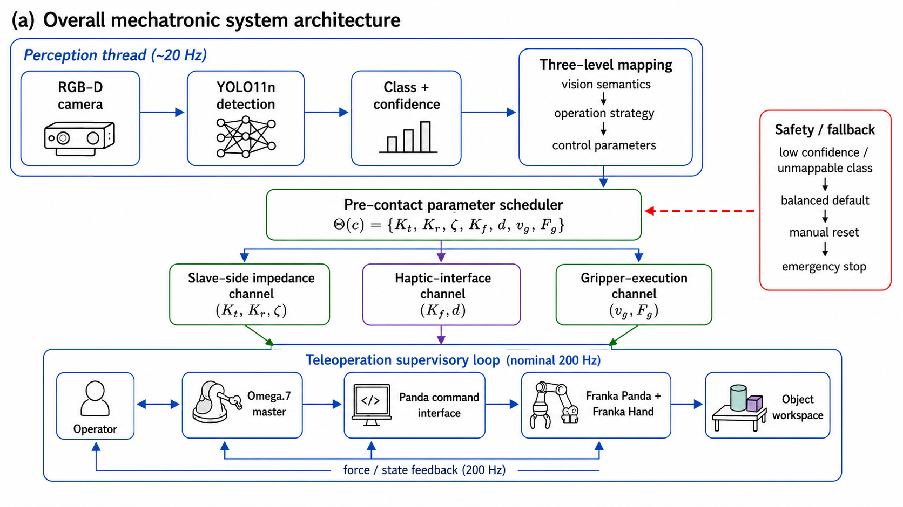

**机械执行层：** Franka Panda 7 自由度机械臂与 Franka Hand 夹爪构成执行侧。Panda 通过笛卡尔阻抗控制响应期望位姿和阻抗参数；Franka Hand 按照指定速度和抓取力执行开合动作。

**人机接口层：** Omega.7 7 自由度力反馈主端设备采集操作者位移和夹爪输入，并通过基础触觉接口渲染从端交互力。操作者通过夹爪开合输入控制夹爪闭合，系统根据当前策略参数表设置夹爪速度和力上限。

**感知层：** Intel RealSense D435i RGB-D 相机以约 20 Hz 采集 RGB-D 图像。YOLO11n 目标检测模型运行在独立子进程中，与 Python GIL 解耦，单帧处理时间约 50 ms。检测结果通过 `multiprocessing.Queue(maxsize=2)` 传回主控制线程，共享状态由 `threading.Lock` 保护。

**控制层：** 上层监督式遥操作循环按名义 200 Hz 配置运行，流程为：读取 Omega.7 位姿增量 → 进行位置缩放和坐标映射 → 更新从端期望位姿 → 更新 Franka 笛卡尔阻抗命令 → 读取从端外力估计 → 渲染主端基础触觉反馈。对应的名义周期为 5 ms。视觉推理不在该循环内同步执行，而是通过异步队列向主循环提供最新可用结果。底层关节控制、内部安全功能和执行器级伺服由 Franka 控制器完成；上层循环负责遥操作指令、阻抗参数、夹爪命令和触觉接口信息的更新。本文中的 200 Hz 表示软件配置的名义更新率，而不是经过周期抖动和截止期违约测试所证明的硬实时频率。

**视觉线程：** 视觉子进程异步接收 RGB 帧，`mp.Queue(maxsize=1)` 仅保留最新帧以避免延迟积累；随后执行目标检测并返回类别标签和置信度。视觉模块在进程和通信路径上与主控制循环分离，约 50 ms 的视觉推理不在名义 200 Hz 主循环内同步执行。该架构避免主循环等待单帧视觉推理完成，但并不等同于已经证明视觉进程对控制周期抖动没有任何影响。

**参数调度层：** 当视觉结果进入调度层后，系统根据对象类别到策略的映射关系，从预设参数表中查找七维参数集 \\((K_t,K_r,\zeta,K_f,d,v_g,F_g)\\)，并通过原子更新写入控制环共享变量。参数更新只在首次有效检测触发的策略锁定事件发生时执行；此后，整个任务 episode 内参数保持不变。

**安全层：** 当视觉未锁定或检测结果不可映射时，系统采用默认折中策略参数作为安全回退。任务内策略锁定可避免视觉抖动导致频繁参数跳变。机械臂内置碰撞检测、程序退出零力命令、统一初始位姿和人工急停共同构成基础安全措施。

### 2.2 异步实现与时序解耦

表 1 总结了各系统模块的名义更新率或观测处理时间、输入输出，以及其是否位于主控制循环的同步关键路径。

**表 1.** 机电系统模块的更新与通信特征。

| 模块 | 名义频率/观测处理时间 | 输入 | 输出 | 是否位于主环同步关键路径？ |
|:---|---:|---:|---|:---:|
| 主端输入 | 200 Hz | Omega.7 位姿与按钮 | \\(\Delta\mathbf{x}_m\\) | 是 |
| 从端命令更新 | 200 Hz | \\(\mathbf{x}_d, \mathbf{K}, \mathbf{D}\\) | 发送给 Panda 控制器的期望位姿/阻抗命令 | 是 |
| 视觉检测（YOLO11n） | 约 20 Hz（约 50 ms/帧） | RGB-D 图像 | 对象类别、置信度 | 否（独立子进程） |
| 策略调度 | 事件触发（首次有效检测） | 类别、置信度 | \\(\Theta(c)\\) 参数集 | 否（非阻塞读取） |
| 触觉接口更新 | 200 Hz | \\(\mathbf{F}_{ext}, K_f, d\\) | Omega.7 力向量 | 是 |
| 夹爪命令 | 事件触发（夹爪按钮） | 夹爪输入、\\(v_g,F_g\\) | Franka Hand 抓取/目标命令 | 否（事件触发） |

视觉检测和策略调度采用事件触发和非阻塞通信。视觉子进程作为独立 Python 进程运行，通过 `multiprocessing.Queue` 生产者—消费者模式传递检测结果。帧队列长度限制为 1，仅保留最新帧；结果队列长度限制为 2。在名义 5 ms 主循环周期开始时，控制线程尝试以非阻塞方式读取结果队列；如果队列为空，则保留先前锁定的策略；如果视觉从未锁定，则保持默认折中参数。首次获得置信度 ≥ 0.25 的有效类别后，系统锁定当前策略并原子设置全部七个参数；随后，整个任务 episode 内参数不再改变。

该实现采用名义 200 Hz 上层遥操作循环和异步 RGB-D 感知进程。视觉推理在独立进程中执行，并通过有界队列向主循环提供最新结果；主循环不等待单帧视觉推理完成。从软件执行路径看，视觉处理时间主要影响检测结果何时可用于策略锁定，而不是作为每个名义 5 ms 周期中的同步等待项。因此，本文能够证明的是异步非阻塞集成和接触前参数触发的时序可行性，而不是硬实时确定性。本文未记录主循环实际周期分布、最大周期、截止期违约率、CPU 负载或端到端策略锁定延迟，因而不声称视觉进程对控制抖动为零，也不声称系统满足经过验证的硬实时约束。

**图 2b.** 异步感知—控制架构时序示意图。该图展示名义 5 ms 上层遥操作更新间隔、约 50 ms 的单帧视觉处理时间、首次有效检测事件、策略锁定以及接近、抓取、转运和释放阶段。图中的 5 ms 表示配置的名义周期，不表示已经测得的确定性周期分布。调度参数用于接触前初始化，而不是接触瞬间的反应式切换；如果检测结果延迟、缺失或低于置信度阈值，系统保持折中默认策略，直到有效锁定事件发生。

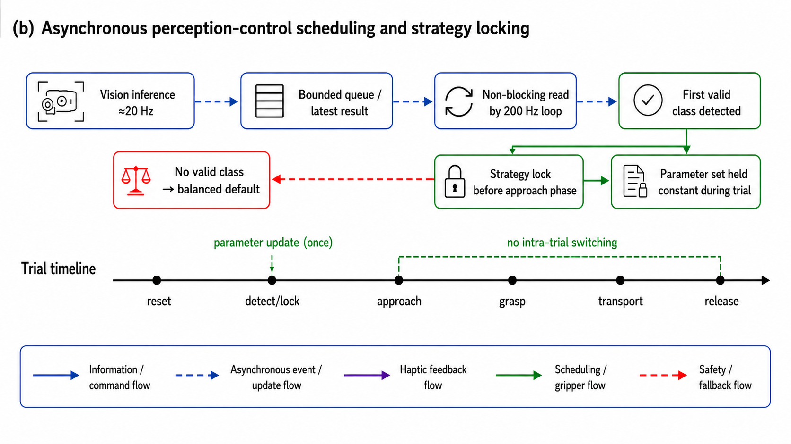

### 2.3 主从增量位置映射

相邻采样时刻之间的主端位置增量为：

\[
\Delta\mathbf{x}_m(k)=\mathbf{x}_m(k)-\mathbf{x}_m(k-1).
\]

从端期望位置更新为：

\[
\mathbf{x}_d(k)=\mathbf{x}_d(k-1)+S\mathbf{C}\Delta\mathbf{x}_m(k),
\]

其中，位置缩放因子固定为 \\(S=3.0\\)，坐标映射矩阵为 \\(\mathbf{C}=\mathrm{diag}(-1,-1,1)\\)。位置缩放因子不作为视觉调度变量，以便实验差异集中体现在阻抗、触觉接口和夹爪参数上。

### 2.4 从端笛卡尔阻抗控制

从端采用笛卡尔阻抗控制，其等效关系为：

\[
\mathbf{F}_c=\mathbf{K}(c)(\mathbf{x}_d-\mathbf{x})+\mathbf{D}(c)(\dot{\mathbf{x}}_d-\dot{\mathbf{x}}),
\]

其中，\\(c\\) 为策略类别，\\(\mathbf{K}(c)\\) 和 \\(\mathbf{D}(c)\\) 分别为相应刚度矩阵和阻尼矩阵。平移和转动刚度写作：

\[
\mathbf{K}(c)=\mathrm{diag}(K_t,K_t,K_t,K_r,K_r,K_r).
\]

阻尼根据阻尼比 \\(\zeta(c)\\) 配置。经典阻抗控制提供柔顺交互的基本机制。本文的改进不在于提出新的阻抗方程，而在于利用接触前对象语义，对多通道机电控制参数进行任务相关初始化。

### 2.5 主端触觉接口命令参数

Omega.7 主端设备具备力输出能力。从端量 \\(\mathbf{F}_{\mathrm{ext}}\\) 取自 Franka 机器人内部基于关节力矩的外力估计接口，并用于生成主端接口命令。系统根据当前策略预设接口命令增益 \\(K_f\\) 和估计力死区 \\(d\\)，软件侧命令写为：

\[
\mathbf{u}_h =
\begin{cases}
\mathbf{0}, & \|\mathbf{F}_{\mathrm{ext}}\| \le d,\\[4pt]
K_f\bigl(\|\mathbf{F}_{\mathrm{ext}}\|-d\bigr)\,
\dfrac{\mathbf{F}_{\mathrm{ext}}}{\|\mathbf{F}_{\mathrm{ext}}\|}, & \|\mathbf{F}_{\mathrm{ext}}\| > d.
\end{cases}
\]

其中，\\(\mathbf{u}_h\\) 表示发送给 Omega.7 接口的软件命令向量；\\(d\\) 决定进入输出命令的外力估计范围，\\(K_f\\) 决定超过死区部分的命令缩放比例。两个参数在每个任务 episode 内随策略锁定后保持不变，并与从端阻抗和夹爪参数共同构成完整接触前参数组。

本文的研究重点是对象语义驱动的系统级参数调度，因此本阶段以接口命令参数的集成和完整参数组的任务表现为主要验证对象。主端实际输出力、外力估计精度、触觉辨识和双边透明性将通过后续专门的组件级实验进一步表征。

### 2.6 视觉语义三级映射与多通道参数调度

视觉模块输出目标类别后，系统依次执行“对象语义 → 操作策略 → 多通道参数”的三级映射。第一层保留可复核的对象类别；第二层将类别转换为面向当前抓取任务的策略，而不是严格的材料类别；第三层从受约束参数表中调用主端、从端和夹爪参数。苹果和香蕉映射为易损优先策略，纸杯和瓶子映射为折中策略，鼠标和剪刀映射为稳定优先策略。该映射基于当前实验任务中的操作风险和抓取需求，不声称构成通用材料刚度分类。

首次出现置信度 ≥ 0.25 的有效检测后，系统锁定当前任务 episode 的策略。如果没有有效类别或类别不可映射，则保留折中策略默认参数作为安全回退。任务内策略锁定用于防止检测抖动导致频繁切换，并使调度行为可按任务复现。

完整策略定义为：

\[
\Theta(c)=\{K_t,K_r,\zeta,K_f,d,v_g,F_g\},
\]

其中，\(K_t,K_r,\zeta\) 对应从端阻抗通道，\(K_f,d\) 对应主端触觉接口通道，\(v_g,F_g\) 对应夹爪执行通道。

**表 2.** 三类面向操作策略的参数表。

| 策略 | 对象 | \\(K_t\\) (N/m) | \\(K_r\\) (N·m/rad) | \\(\zeta\\) | \\(K_f\\) | \\(d\\) (N) | \\(v_g\\) (m/s) | \\(F_g\\) (N) |
|---|---|---:|---:|---:|---:|---:|---:|---:|
| 易损优先 | 苹果、香蕉 | 50 | 5 | 0.8 | 0.2 | 0.3 | 0.02 | 8 |
| 折中 | 纸杯、瓶子 | 150 | 10 | 1.0 | 0.5 | 0.4 | 0.05 | 15 |
| 稳定优先 | 鼠标、剪刀 | 200 | 13 | 1.2 | 0.7 | 0.5 | 0.10 | 20 |

### 2.7 参数设计空间与依据

参数选择遵循“对象操作风险 → 控制响应 → 硬件约束”的工程逻辑。表 3 给出了每个参数的设计空间，包括低值和高值的物理含义，以及约束本文取值的硬件/安全边界。本文将参数表视为一种 **受物理约束的启发式设计**，而不是无约束经验查表。该设计受到四类物理约束限制：机器人侧阻抗稳定性和命令限制、主端触觉舒适性和力饱和、夹爪速度/力执行限制，以及针对易损或光滑对象的任务级安全需求。

**表 3.** 参数设计空间：低值和高值的物理含义、硬件约束及本文取值。

| 参数 | 低值含义 | 高值含义 | 硬件/安全约束 | 本文取值 |
|:---|:---|:---|:---|:---|
| \\(K_t\\) | 柔顺性强、冲击小 | 定位稳定性高 | Panda 阻抗环稳定范围 | 50 / 150 / 200 |
| \\(K_r\\) | 姿态更柔顺 | 姿态更稳定 | 转动响应稳定性 | 5 / 10 / 13 |
| \\(\zeta\\) | 响应快、可能振荡 | 阻尼更强 | 避免超调 | 0.8 / 1.0 / 1.2 |
| \\(K_f\\) | 软件命令缩放较小 | 软件命令缩放较大 | 预实验可接受的接口命令范围 | 0.2 / 0.5 / 0.7 |
| \\(d\\) | 更多小幅外力估计进入命令 | 更多小幅外力估计被屏蔽 | 小幅估计波动与接口可接受性 | 0.3 / 0.4 / 0.5 |
| \\(v_g\\) | 低冲击闭合 | 快速抓取 | Franka Hand 执行限制 | 0.02 / 0.05 / 0.10 |
| \\(F_g\\) | 温和抓取 | 抓取稳定性高 | 夹爪力限制 | 8 / 15 / 20 |

易损优先策略采用较低的平移/转动刚度、较小接口命令增益、较低夹爪速度和较低抓取力，使系统设置偏向柔顺和温和执行。稳定优先策略采用较高刚度、较大接口命令增益和更快夹爪运动，使系统设置偏向定位保持和执行效率。折中策略用于抓取需求介于两者之间的对象。本文评价的是这些参数作为整体配置时的任务表现，单一通道的作用将在后续组件级研究中进一步区分。

表 2 中的数值并非由对象级模态识别、标定接触力上限或全局优化直接推导，而是在机械臂阻抗稳定性、Omega.7 触觉舒适性、Franka Hand 执行限制和对象操作风险共同约束下确定的有界设计点。参数确定过程首先根据硬件接口限制和任务安全需求设定候选范围，随后通过预实验剔除会引起明显振荡、触觉不适、夹持不稳或对象损伤风险的组合，并在剩余稳定工作包络内选取低、中、高三个代表性配置。该参数表的目的不是给出全局最优参数，而是定义一个可复现的接触前机电设计空间：较低参数水平使系统偏向柔顺接触和温和抓取建立，较高参数水平使系统偏向定位稳定、更强接口线索和更快抓取执行。因此，三个策略水平应理解为经过预实验确认的稳定工作包络内代表性配置；本文测试的是该有界参数组能否作为系统级接触前初始化策略发挥作用。围绕每个通道的完整灵敏度分析和参数优化将在后续研究中展开。

正式实验前，两名研究人员进行了覆盖三类对象的预实验，用于检查系统安全性、操作者舒适性和任务可完成性，并据此确定正式实验使用的固定参数表。该参数表随后在所有正式试验和所有实验模式中保持不变。模式 B 使用同一参数表，但策略选择由操作者根据目标对象人工完成；因此，模式 B 表征人工判断和策略切换参与下的工作流基线。其任务执行时长从任务开始计时至释放结束，包含操作者识别对象、选择策略和执行遥操作过程所需的时间。

### 2.8 算法流程

**算法 1：面向集成机电系统的视觉语义多参数调度**

1. 初始化系统，加载折中策略默认参数 \\(\Theta(\text{balanced})\\)，启动 200 Hz 主控制循环和视觉子进程。
2. 视觉子进程异步读取 RGB-D 图像并执行 YOLO11n 目标检测，不阻塞主循环。
3. 主控制线程非阻塞读取检测结果队列；如果检测类别属于预定义对象集合且置信度 ≥ 0.25，则将对象类别映射为面向操作的策略 \\(c\\)。
4. 首次有效检测触发策略锁定事件：调用参数集 \\(\Theta(c)=\{K_t,K_r,\zeta,K_f,d,v_g,F_g\}\\)，并原子更新控制环共享变量。
5. 锁定后，整个任务 episode 内参数保持不变，避免视觉抖动导致频繁切换。
6. 将 \\(K_t,K_r,\zeta\\) 发送给从端阻抗控制器，将 \\(K_f,d\\) 作为主端基础触觉接口参数，将 \\(v_g,F_g\\) 用于夹爪控制。
7. 如果检测失败或类别不可映射，则保留折中策略默认参数。
8. 任务完成后，重置系统、解除策略锁定，并准备下一次试验。

### 2.9 安全回退与工程约束

当视觉未锁定或检测结果不可映射时，系统使用默认折中策略参数。任务内策略锁定防止视觉抖动导致频繁参数跳变。机械臂内置碰撞检测、夹爪力限制、程序退出零力命令、统一初始位姿和人工急停共同构成基础安全措施。

**语义误分类与故障安全行为。** 语义识别错误主要影响策略选择，而不是改变参数空间本身。如果对象被误识别为另一个有效类别，系统会从同一预定义参数表中选择一个次优但仍有界的参数集；这可能降低操作效率或对象适配性，例如易损对象被分配为稳定优先策略时，会获得较高刚度、较强接口线索和较快夹爪设置。由于所有候选参数均来自经过硬件约束和预实验筛选的设计空间，且策略在任务 episode 内保持锁定，误分类不会导致任务过程中无界的在线参数变化。对于低置信度或不可映射的检测结果，系统回退到折中策略；同时，机器人碰撞检测、夹爪力限制和操作者急停作为基础安全保护保留。因而，本文方法应理解为一种有界的接触前参数初始化机制，其安全性依赖受限参数表、策略锁定和平台级保护共同实现。

---

## 3 实验设计

### 3.1 研究问题与假设

本文回答以下研究问题：

- **RQ1：** 视觉语义多参数前馈是否优于固定参数、人工选择和仅视觉观察？
- **RQ2：** 完整多通道机电参数调度是否优于视觉语义阻抗-only 调度？
- **RQ3：** 异步视觉模块能否在不进入上层主控制循环同步关键路径的情况下完成接触前策略触发，并在当前任务流程中表现出可用的时序可行性？
- **RQ4：** 该方法的收益是否在不同操作者和不同测试对象上表现出一致方向？

相应假设为：与基线模式相比，视觉多参数模式可以降低任务执行时长和主端轨迹长度，提高成功率（作为描述性指标），并降低主观工作负荷；与视觉阻抗-only 模式相比，完整多通道模式可以减少停顿或操作修正，从而体现完整接触前机电参数策略相对于阻抗-only 调节的系统级附加收益。

### 3.2 操作者与实验对象

三名操作者（P01–P03，23–24 岁，2 名男性、1 名女性，均为右利手）参与主实验。实验中 Omega.7 主端统一布置在操作者左侧，并由左手操作；该手别和设备布置在所有操作者、对象和实验模式中保持一致。三名操作者均具有基础遥操作训练经验，并在每次正式实验前完成 10–15 分钟热身试验，以熟悉左手主端操作、夹爪输入和任务流程。所有操作者均在实验前提供书面知情同意。该研究不涉及医学干预，也不收集可识别个人身份的信息。

实验覆盖六种对象，形成一个 **机电基准任务集**，用于激发柔顺性、触觉接口敏感性和夹爪执行条件方面的不同需求。六种对象被分配到易损优先、折中和稳定优先策略。该分类用于当前实验任务中的参数调度，并不声称代表对象材料属性的通用物理分类。

| 对象 | 策略 | 质量 (g) | 表面 | 尺寸 (mm) | 主要任务风险 |
|:---:|:---:|---:|:---|:---|:---|
| 苹果 | 易损优先 | ~200 | 光滑 | Ø70–80 | 冲击/滑移风险，需要温和接触 |
| 香蕉 | 易损优先 | ~120 | 光滑 | 20×180 | 挤压变形和滑移风险 |
| 纸杯 | 折中 | ~5 | 纸质 | Ø75×90 | 易变形，需要稳定抓取 |
| 瓶子 | 折中 | ~30 | 光滑塑料 | Ø65×200 | 易滑，需要效率—稳定性折中 |
| 鼠标 | 稳定优先 | ~100 | 光滑塑料 | 65×120×35 | 刚性、不规则表面，转运滑移风险 |
| 剪刀 | 稳定优先 | ~150 | 金属+塑料 | 50×170×15 | 刚性、细长，对姿态精度要求高 |

### 3.3 实验模式与试验结构

实验包含五种模式：

| 模式 | 设置 | 目的 |
|:---:|:---|:---|
| A | 固定参数，无视觉调度 | 固定控制基线 |
| B | 操作者人工选择完整参数策略 | 人工选择工作流基线 |
| C | 视觉语义自动调度完整参数集 | 本文方法（完整机电调度） |
| D | 显示视觉信息，但保持固定参数 | 隔离视觉提示本身的作用 |
| E | 仅视觉语义调度 \\(K_t,K_r,\zeta\\) | 阻抗-only 消融 |

模式 A 测试固定参数在异质对象上的折中局限。模式 B 测试人工选择工作流是否引入额外判断和切换负担。模式 D 区分视觉提示和控制参数改变的作用。模式 E 测试阻抗-only 调节能否复现完整多通道参数组的整体表现。C–E 比较构成本文核心 **系统级组合消融**：两者均使用视觉语义和阻抗调节，而模式 C 进一步加入主端触觉接口命令参数 \\((K_f,d)\\) 与夹爪执行参数 \\((v_g,F_g)\\) 的对象相关预设。该比较用于评价附加参数组合相对于阻抗-only 的整体系统效果；触觉接口与夹爪执行的组件级贡献留待后续正交消融进一步解析。

试验结构以 27 个匹配 block 为基本单位。每个匹配 block 包含同一操作者、同一对象/策略、同一重复序号下的五种模式 A–E，因此总计 \\(27\times5=135\\) 次试验。需要强调的是，27 个 block 并不等同于 27 名独立操作者，135 次试验也不等同于 135 个独立人因样本：五种模式在同一 block 内构成重复测量，多个 block 又嵌套于同一操作者。因此，block 用于建立操作者内部的匹配比较，操作者才是人因层面的上层聚类单位。六种对象在 27 个匹配 block 中的分布如下：

| 策略 | 具体对象 | Block 数 | 试验数（×5 模式） |
|---|---|---:|---:|
| 易损优先 | 苹果 | 4 | 20 |
| 易损优先 | 香蕉 | 5 | 25 |
| 折中 | 纸杯 | 5 | 25 |
| 折中 | 瓶子 | 4 | 20 |
| 稳定优先 | 鼠标 | 5 | 25 |
| 稳定优先 | 剪刀 | 4 | 20 |
| 合计 | 六种对象 | 27 | 135 |

实验过程中对模式顺序进行了部分平衡，以减少单一固定顺序带来的学习或疲劳偏倚。各操作者在不同对象和模式组合下交替完成试验，避免所有试验按照同一模式顺序执行。由于对象、操作者和顺序因素在小样本人在环实验中难以完全解耦，完整逐次试验执行顺序作为补充材料提供，以便复核顺序安排和重复结构。

### 3.4 任务与流程

每次试验开始前，机械臂、夹爪、主端设备和目标对象均恢复至统一初始状态。操作者收到开始提示且遥操作控制使能后，系统开始计时，并依次执行接近、抓取、转运和释放阶段。正常计时终点定义为机械臂到达预定放置区域并完成预定释放动作的时刻。模式 B 中的对象判断和人工策略选择属于该模式的完整工作流程，因此从统一开始提示到策略选择、遥操作执行和释放结束的全部时间均计入该模式的任务执行时长。

任务成功定义为：操作者按照预定流程将目标对象抓取、转运并放置于指定区域，且过程中未发生对象掉落、可观察滑移或可见损伤。只要出现上述任一事件，该试验即被标记为失败；失败标签一旦触发，不因后续操作流程继续完成而撤销。

为使成功和失败试验具有一致的观察窗口，失败事件发生后试验不提前终止。对于发生滑移或掉落的试验，操作者不重新抓取对象，而是继续执行预定的末端运动和夹爪操作序列，直至机械臂到达放置区域并完成释放动作。由此，全部 135 次试验均从统一开始时刻记录至统一流程终点，失败试验不会因提前终止而获得人为较短的时间记录。

本文将上述时间指标定义为 **任务执行时长**（task execution duration），而不是仅针对成功试验的任务执行时长。任务执行时长反映从开始提示至预定操作流程结束的总耗时；成功率则独立反映目标对象是否在无掉落、无明显滑移和无可见损伤的条件下完成转运。两项指标联合用于评价系统表现。

**图 3.** 实验任务流程和视觉语义参数调度框架，包括统一计时起点、接近、抓取、转运、释放、失败事件标记和统一流程终点，以及机电参数配置点。

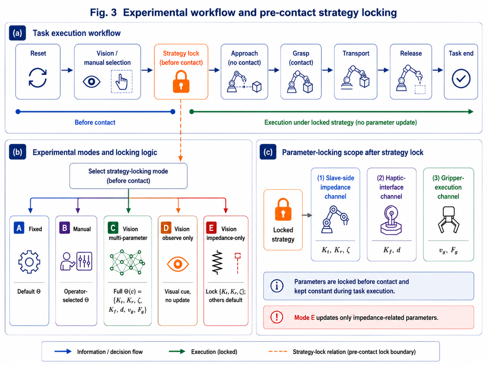

### 3.5 评价指标

主要客观终点为任务执行时长和成功率。任务执行时长定义为从统一开始提示至预定释放动作结束的持续时间，包括接近、抓取、转运和释放阶段，以及模式 B 中的人工策略选择时间。无论试验是否发生失败事件，均记录至统一流程终点；因此，该指标不会因失败后的提前终止而被人为缩短。成功率根据任务过程中是否发生对象掉落、可观察滑移或可见损伤独立判定。次要客观终点包括主端轨迹长度、停顿次数、方向反转次数和运动平滑性。

主观工作负荷采用未加权 Raw NASA-TLX 评估，即心理需求、身体需求、时间需求、绩效、努力和挫败六个维度的算术平均，分数越高表示主观工作负荷越高。每名操作者在完成每一类操作策略下的某一实验模式后填写一份问卷，因此 NASA-TLX 的实际收集层级为“操作者 × 操作策略 × 模式”，共形成 \(3\times3\times5=45\) 个问卷单元，即每种模式 9 个评分单元。问卷评分不复制到同一策略下的多个试验 block 中，以避免将同一主观评价重复计为多个独立观测。视觉模块报告类别识别准确率、策略触发准确率、置信度和单帧处理时间。

过程行为指标在正式统计分析前定义并固定。停顿定义为主端速度低于 0.005 m/s 且持续至少 0.30 s，由约 200 Hz 采样的原始主端轨迹 CSV 通过速度差分检测得到。

### 3.6 统计分析

本研究数据具有两层重复结构：五种模式在同一匹配 block 内重复测量，多个 block 进一步嵌套于三名操作者。因而，135 次试验被视为当前三名操作者完成的重复任务观测，而不是 135 个相互独立的人因样本。鉴于操作者数量仅为 3，本文不使用基于“27 个 block 相互独立”假设的总体人群显著性检验，也不将 block 级 \(p\) 值或置信区间解释为对一般操作者总体的推断。

全部 135 次试验均纳入任务执行时长和成功率分析，每种模式均包含 27 次任务尝试。失败试验不因失败事件而提前截断，也不从时长分析中删除；因此，各模式的任务执行时长具有一致的计时起点和流程终点。任务执行时长、主端轨迹长度和停顿次数首先在 27 个匹配 block 上报告 median [IQR] 与 mean ± SD，作为当前任务集的描述性汇总。成功率和失败类型单独报告，任务执行时长不替代对任务结果质量的评价。

核心 C–E 消融在每个 block 内计算配对差 \(d_{ij}=Y_{C,ij}-Y_{E,ij}\)，其中 \(i\) 表示操作者，\(j\) 表示该操作者的匹配 block；随后先在每名操作者内部求平均，再对三名操作者等权汇总。结果同时给出 P01–P03 各自的差值、3/3 操作者方向一致性以及六种对象的分层方向，用于判断总体观察差异是否由单一操作者或单一对象驱动。五模式之间的其他比较以描述性差值和匹配散点呈现，不作一般人群显著性声明。由于失败试验同样执行至统一流程终点，较短的任务执行时长不能由失败后的提前终止解释。

Raw NASA-TLX 按其实际收集层级分析。首先对每份问卷的六个维度取算术平均，得到 45 个 Raw NASA-TLX 评分；每种模式包含 9 个“操作者 × 策略”评分单元。C–E 比较在相同操作者和相同策略内构成 9 组配对。为避免将同一操作者在三类策略下的评分视为三名独立参与者，分析同时报告：① 9 个策略级配对差值及方向；② 每名操作者在三类策略上的等权平均差值；③ 三名操作者的方向一致性。由于最高层级只有 3 名独立操作者，NASA-TLX 不报告一般人群意义上的显著性检验或 Bootstrap 置信区间。成功率作为描述性系统指标报告。上述分析目标是评估当前机电平台、当前对象集和当前三名操作者条件下的系统表现；扩大到一般操作者总体的统计推断需要更多独立参与者。

---

## 4 实验结果

### 4.1 视觉识别与策略触发验证

在受控视角、背景和光照条件下，每类对象采集 30 张图像，共 180 张。类别识别和策略触发达到 180/180（100%），平均置信度为 0.853，单帧 wall-clock 处理时间为 48.19 ms。该处理时间约对应 20 Hz 的低频感知更新，与本文“接触前识别一次并锁定策略”的工作方式相匹配，但并不意味着视觉模块满足名义 5 ms 主循环周期。结合独立子进程、有界队列和非阻塞读取机制，这些结果支持当前实验条件下接触前触发的功能与时序可行性。由于未测量主循环实际周期抖动、截止期违约和端到端锁定延迟，本文不将该结果解释为硬实时性能验证。视觉适用性仍受场景条件和对象集合限制，遮挡、强光照变化、杂乱背景、未知对象和未测试类别下的鲁棒性需要进一步验证。

| 对象 | 图像数 | 类别准确率 | 策略触发准确率 | 平均置信度 | 时间 (ms) |
|---|---:|---:|---:|---:|---:|
| 苹果 | 30 | 100% | 100% | 0.771 | 49.89 |
| 香蕉 | 30 | 100% | 100% | 0.948 | 48.02 |
| 瓶子 | 30 | 100% | 100% | 0.726 | 48.57 |
| 纸杯 | 30 | 100% | 100% | 0.820 | 46.62 |
| 鼠标 | 30 | 100% | 100% | 0.914 | 46.79 |
| 剪刀 | 30 | 100% | 100% | 0.938 | 49.27 |

**图 4.** 视觉识别验证结果，包括混淆矩阵、置信度分布和单帧处理时间分布。

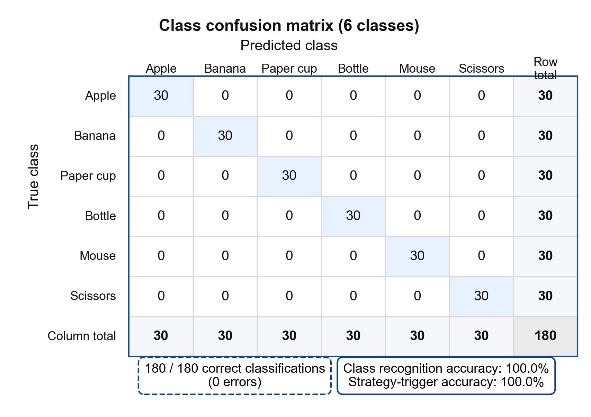

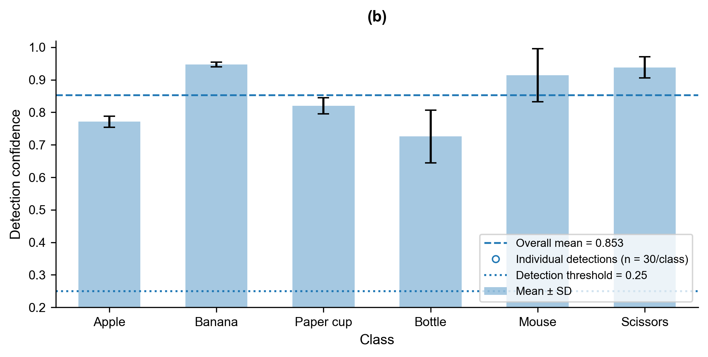

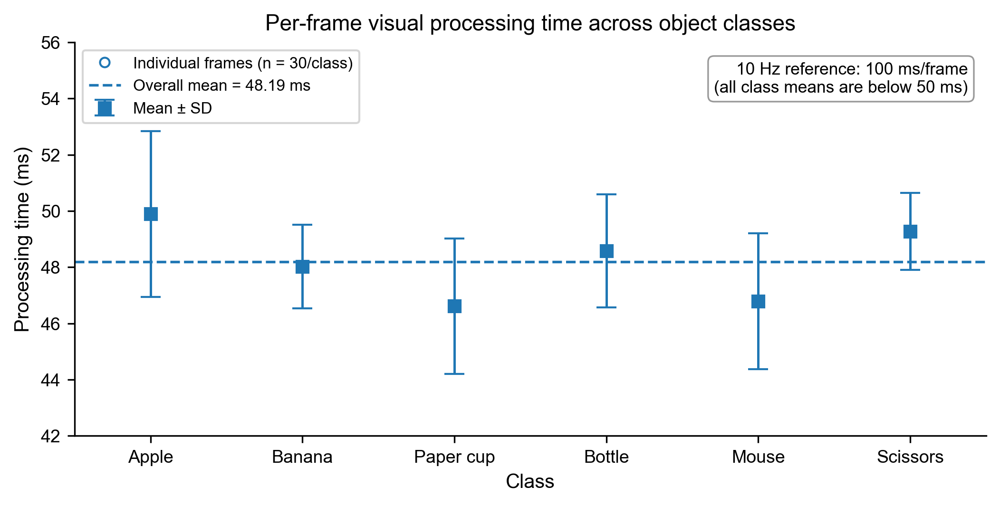

### 4.2 五模式实验结果

**表 4.** 五模式实验结果：任务执行时长、主端轨迹长度、成功率和 Raw NASA-TLX。数值以 median [IQR] 报告，括号内为 mean±SD。

| 模式 | 任务执行时长 (s) | 轨迹长度 (m) | 成功率 | Raw NASA-TLX |
|:---:|:---:|:---:|:---:|:---:|
| A 固定 | 21.18 [20.62, 22.08] (21.42±1.58) | 0.741 [0.692, 0.811] (0.763±0.098) | 22/27 (81.5%) | 62.50 [59.67, 64.50] (62.59±3.95) |
| B 人工 | 20.89 [20.12, 21.83] (21.01±1.61) | 0.793 [0.735, 0.875] (0.799±0.115) | 21/27 (77.8%) | 56.17 [55.00, 59.33] (57.15±3.68) |
| **C 视觉多参数** | **19.57 [18.41, 20.05] (19.28±1.30)** | **0.697 [0.660, 0.769] (0.715±0.092)** | **26/27 (96.3%)** | **48.67 [47.67, 51.83] (49.67±3.63)** |
| D 视觉观察 | 20.79 [20.32, 21.16] (20.91±1.10) | 0.716 [0.684, 0.779] (0.734±0.085) | 24/27 (88.9%) | 60.33 [57.33, 62.50] (60.22±3.85) |
| E 视觉阻抗-only | 20.73 [19.95, 22.25] (21.07±1.56) | 0.732 [0.678, 0.799] (0.739±0.084) | 24/27 (88.9%) | 53.67 [51.83, 57.83] (54.54±4.09) |

描述性结果显示，模式 C 在五种模式中取得最短任务执行时长中位数、最短主端轨迹、最高成功率和最低 Raw NASA-TLX。Raw NASA-TLX 的 45 份实际问卷按收集层级汇总后，A–E 五种模式的中位数分别为 62.50、56.17、48.67、60.33 和 53.67 分，每种模式均基于 9 个“操作者 × 策略”评分单元。与模式 A、B、D 和 E 相比，模式 C 的平均任务执行时长分别降低约 10.0%、8.2%、7.8% 和 8.5%。由于所有成功和失败试验均执行至统一流程终点，模式 C 的时长优势不能由失败试验提前终止造成；同时，模式 C 具有最高的描述性成功率，说明较短时长并非以降低任务成功质量为代价。

表 4 的任务执行时长和轨迹长度来自 27 个匹配 block 的合并描述性汇总，但这些 block 并不代表 27 名独立参与者。鉴于仅有三名操作者，本文不依据 block 级 Friedman 或 Wilcoxon 检验作一般人群显著性声明。五模式结果主要用于展示当前任务集内的模式排序和差值；核心结论进一步依赖 C–E 在 P01–P03 三名操作者中均为同一方向，以及六种对象均呈现 C 更快的分层一致性。Raw NASA-TLX 同样在其实际问卷收集层级上解释为当前操作者内部的主观工作负荷证据。

**图 5.** 五模式任务执行时长比较：箱线图叠加匹配 block 个体散点，每个点代表一个 block，避免使用柱状图。左图为任务执行时长，右侧子图为主端轨迹长度和 Raw NASA-TLX。

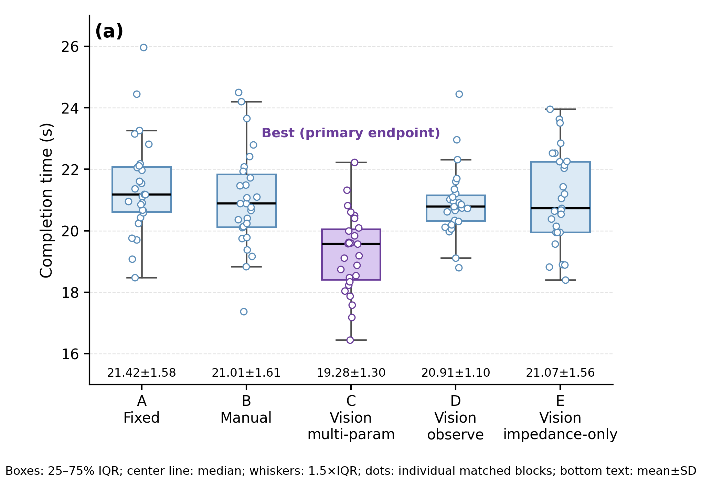

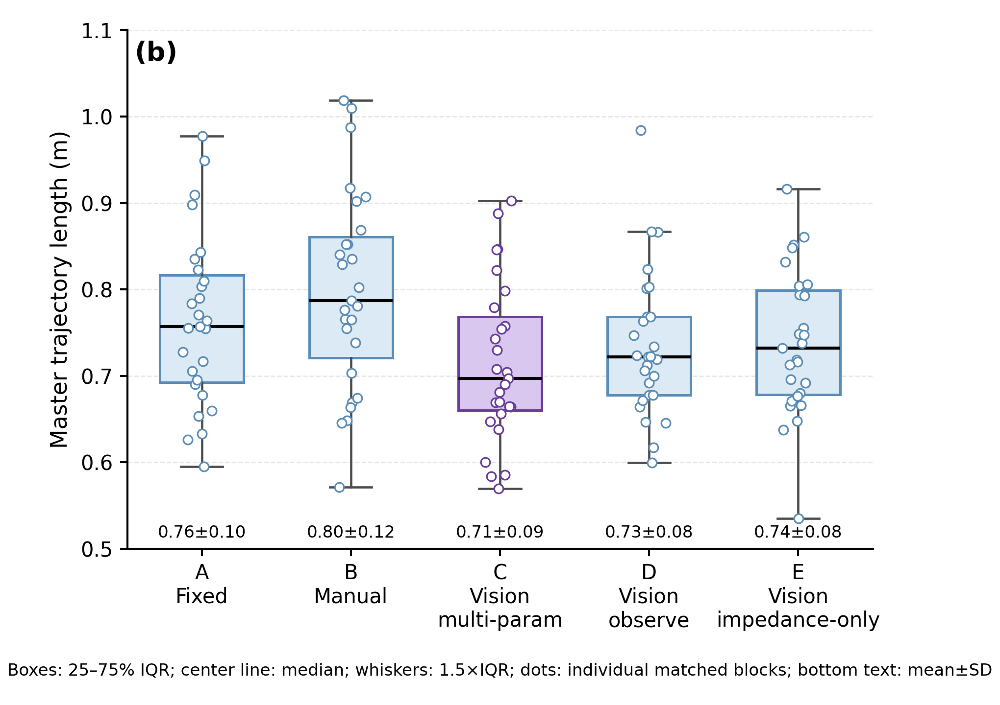

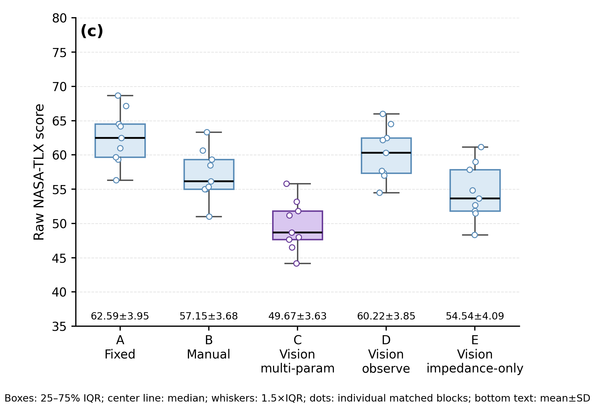

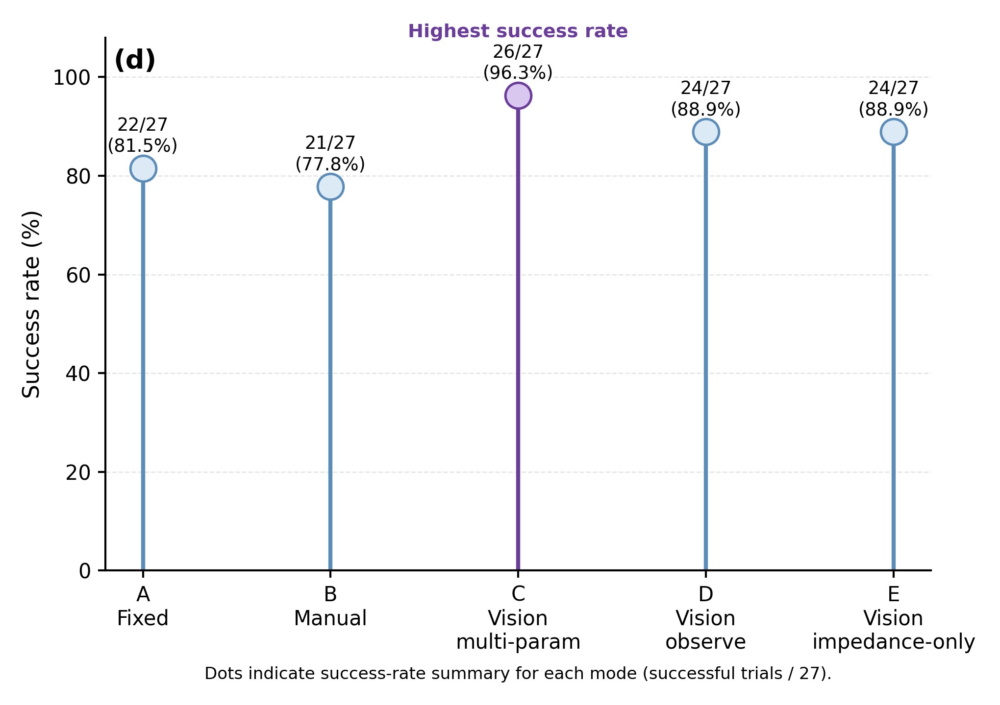

### 4.3 核心消融：完整多参数策略 vs. 阻抗-only

**表 5.** 核心 C–E 消融：描述性汇总、观察差值和操作者层面一致性。

| 指标 | C (median [IQR]) | E (median [IQR]) | 观察 Δ (C−E) | 操作者层面证据 |
|:---|---:|---:|---:|:---|
| 任务执行时长 (s) | 19.57 [18.41, 20.05] | 20.73 [19.95, 22.25] | −1.79 | P01 −1.66；P02 −2.57；P03 −1.15 s（3/3 ↓） |
| 轨迹长度 (m) | 0.697 [0.660, 0.769] | 0.732 [0.678, 0.799] | −0.024 | 操作者方向不完全一致（mixed） |
| Raw NASA-TLX | 48.67 [47.67, 51.83] | 53.67 [51.83, 57.83] | −4.87 | 9/9 操作者—策略配对单元 ↓；P01 −4.28、P02 −4.61、P03 −5.72 分（3/3 ↓） |

C–E 比较是本文最关键的 **系统级组合消融**。两种模式都使用视觉语义和阻抗调节；区别在于模式 C 同时加入主端触觉接口命令增益、外力估计死区、夹爪闭合速度和抓取力的对象相关预设。因此，该设计直接检验完整参数包相对于阻抗-only 调度的整体系统效果。组件级归因不属于本阶段实验目标，将在后续正交消融中单独展开。

Raw NASA-TLX 的 C–E 比较由 9 个真实配对问卷单元组成。表中负值表示模式 C 的主观工作负荷低于模式 E。

| 操作者 | 易损优先 C−E | 折中 C−E | 稳定优先 C−E | 操作者内三策略等权平均 |
|:---:|---:|---:|---:|---:|
| P01 | −4.17 | −5.00 | −3.67 | −4.28 |
| P02 | −4.17 | −5.00 | −4.67 | −4.61 |
| P03 | −6.00 | −5.83 | −5.33 | −5.72 |
| 三名操作者等权汇总 | −4.78 | −5.28 | −4.56 | **−4.87** |

9 个“操作者 × 策略”配对单元均表现为模式 C 低于模式 E（9/9），三名操作者在对三类策略等权聚合后也均保持相同方向（3/3）。因此，−4.87 分应解释为当前三名操作者和三类策略条件下的观察平均差，而不是来自 27 个 block 或 135 次试验的独立人因估计。由于独立操作者数量只有 3，本文不为该差值报告一般人群意义上的 \(p\) 值或 Bootstrap 置信区间。

在 27 个匹配 block 的描述性汇总中，模式 C 任务执行时长中位数为 19.57 s，模式 E 为 20.73 s。三名操作者各自的 C–E 平均差分别为 −1.66、−2.57 和 −1.15 s；对三名操作者等权汇总后，观察平均差为 −1.79 s，相对降低约 8.5%。三名操作者均表现出 C 快于 E 的方向，说明该差异并非由单一操作者驱动。六种对象也均表现出 C 快于 E 的方向，降低范围为 3.3%–13.2%，说明该观察结果也不是由单一对象驱动。由于独立操作者数量为 3，上述数值作为当前参与者和任务集条件下的重复测量证据解释，而不作为一般操作者总体的置信区间或显著性结论。

主端轨迹长度的观察差异较小（0.697 m vs. 0.732 m，观察差 −0.024 m），且操作者层面的方向不完全一致。因此，本文不声称模式 C 显著缩短了几何路径。结合停顿次数的描述性变化，更谨慎的解释是：完整多通道机电参数协同可能主要通过减少抓取、转运或释放阶段的停顿和修正来提升操作效率。阶段级时间标注和重新抓取行为记录可在后续实验中进一步细化这一机制解释。

**图 6.** 核心 C–E 消融结果。该图展示 27 个匹配 block 的 C–E 任务执行时长配对散点，低于对角线表示 C 更快；同时展示三名操作者分面图和六种对象分层箱线图。图注应明确：block 为操作者内部的重复任务单元，三名操作者的结果需分别展示，不将 27 个 block 表述为 27 个独立参与者。

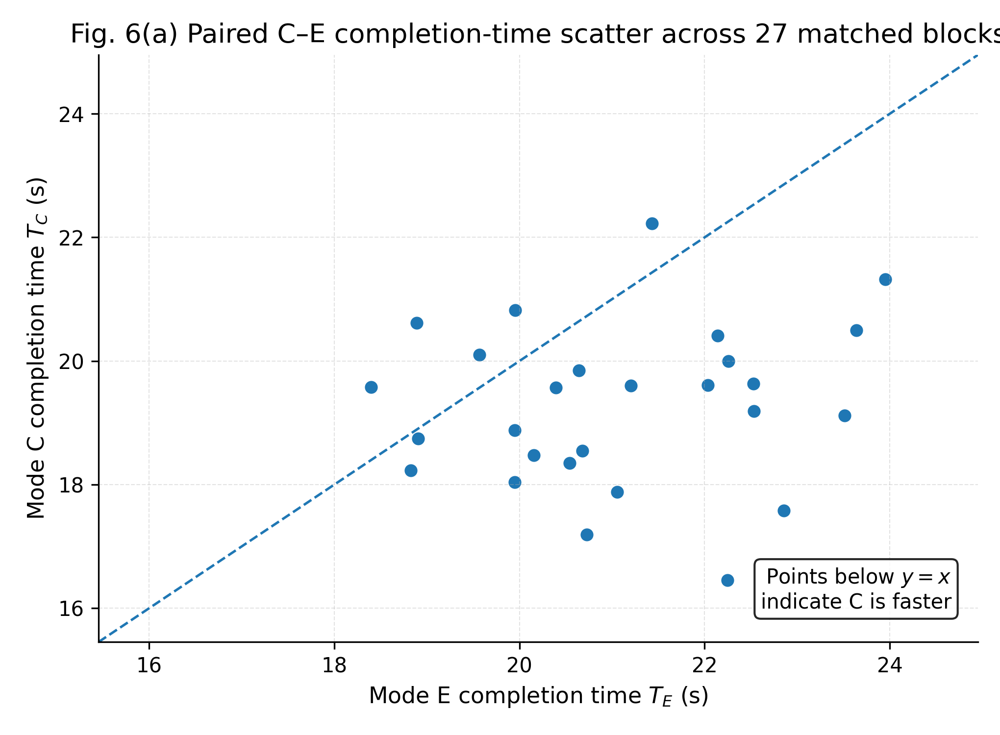

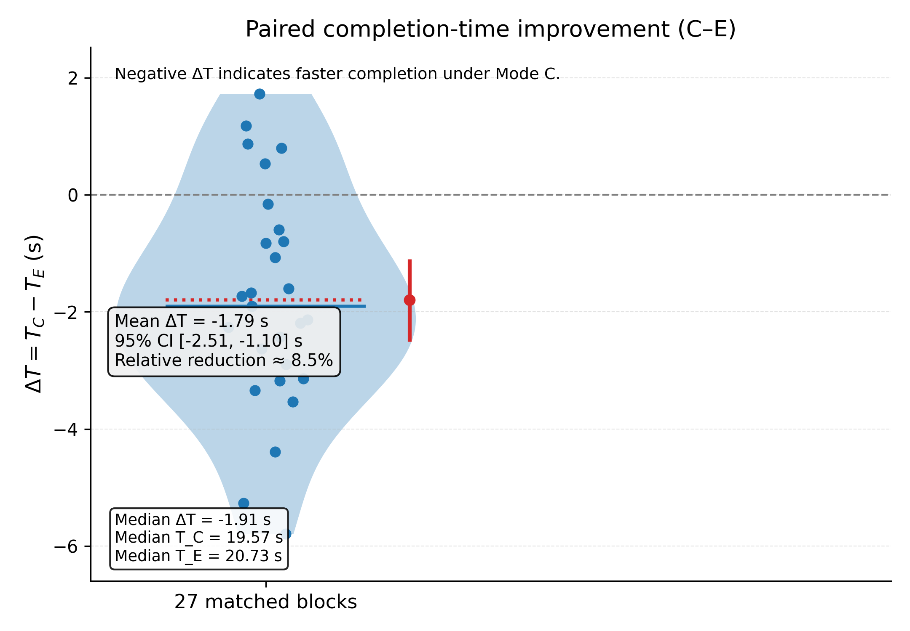

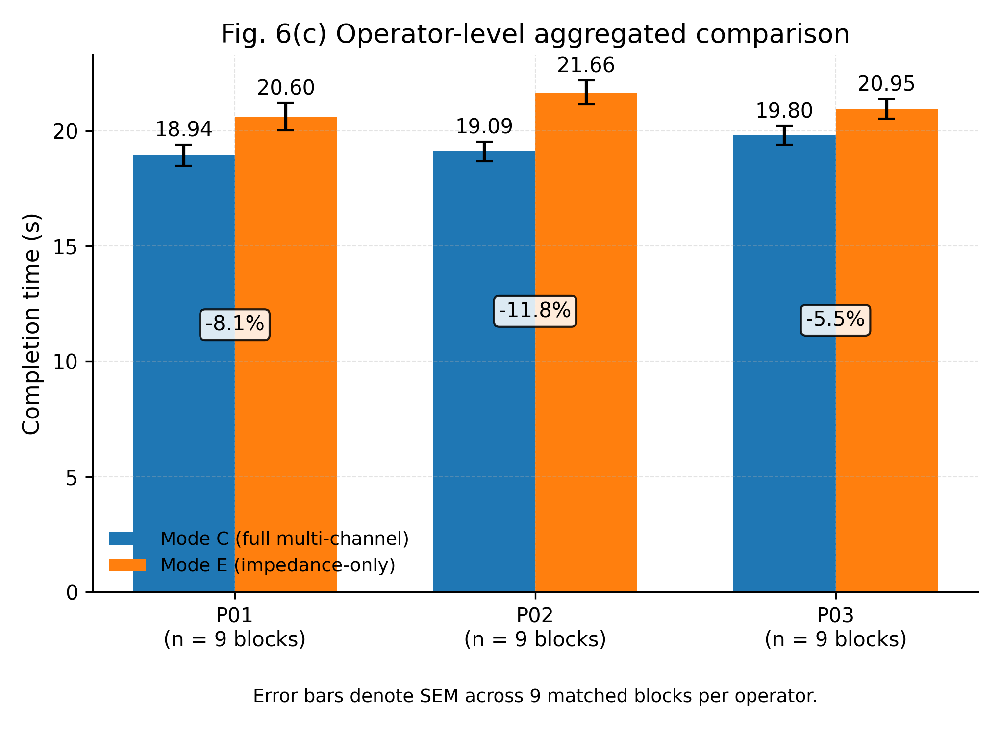

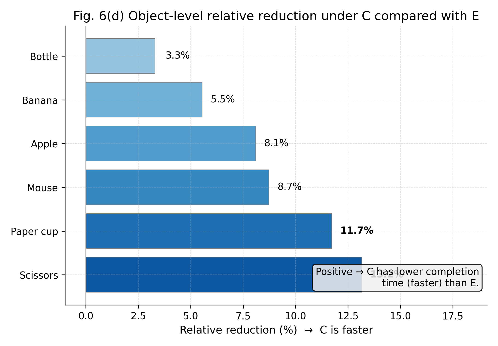

### 4.4 过程行为指标：C–E 停顿分析

停顿次数由原始主端轨迹 CSV 计算得到，轨迹采样频率约 200 Hz。停顿定义为主端速度低于 0.005 m/s 且持续至少 0.30 s。模式 C 单次试验停顿次数中位数为 3 [2, 3.5] IQR，均值为 2.74±1.23；模式 E 为 3 [2, 5] IQR，均值为 3.41±1.67。按策略分类，易损优先、折中和稳定优先类别均表现出模式 C 停顿次数更少的方向。该结果与 C–E 任务执行时长差异和轨迹长度结果相一致，提示多通道参数协同可能减少了操作过程中的短暂停顿和修正。阶段级时间标注将在后续实验中用于进一步区分接近、抓取、转运和释放阶段的行为差异。

### 4.5 失败案例分析

135 次试验共发生 18 次失败，包括掉落、可观察滑移或可见损伤。各模式失败分布如下：

| 模式 | 失败/总数 | 典型观察 |
|:---:|:---:|:---|
| A 固定 | 5/27 | 纸杯挤压变形，剪刀定位不稳定 |
| B 人工 | 6/27 | 人工策略误选或切换成本高 |
| **C 视觉多参数** | **1/27** | 鼠标表面较滑，转运中滑移 |
| D 视觉观察 | 3/27 | 中等对象抓取力不足 |
| E 视觉阻抗-only | 3/27 | 中等对象抓取不稳定 |

模式 C 在当前实验中失败数最低（1/27），其余模式的失败主要表现为掉落、可观察滑移、纸杯挤压变形或定位不稳定。失败标签在事件发生时即被固定；此后操作者继续完成预定末端运动和释放序列，但不重新抓取对象。因而，失败试验与成功试验具有相同的流程终点，其任务执行时长不会因提前终止而缩短。该观察为完整参数组的系统级表现提供了定性补充；更细致的触觉接口与夹爪组件归因将在后续分解实验中完成。

### 4.6 跨操作者与六对象一致性

三名操作者在任务执行时长上均表现出 C 快于 E 的方向。在对象层面，模式 C 对所有六种测试对象也均取得五种模式中最短的平均任务执行时长。各对象结果如下：

| 对象 | A 固定 (s) | B 人工 (s) | **C 视觉多参数 (s)** | D 观察 (s) | E 阻抗-only (s) |
|:---:|---:|---:|---:|---:|---:|
| 苹果 | 20.46 | 21.40 | **19.25** | 20.81 | 20.94 |
| 香蕉 | 20.07 | 20.85 | **19.49** | 21.06 | 20.64 |
| 纸杯 | 22.36 | 20.27 | **18.69** | 20.38 | 21.17 |
| 瓶子 | 22.11 | 22.14 | **19.63** | 20.78 | 20.30 |
| 鼠标 | 21.74 | 20.93 | **19.75** | 20.74 | 21.64 |
| 剪刀 | 21.79 | 20.70 | **18.84** | 21.83 | 21.70 |

C 相对于 E 的时间降低幅度从瓶子的 3.3%，到香蕉的 5.5%、苹果的 8.1%、鼠标的 8.7%、纸杯的 11.7% 和剪刀的 13.2%。这表明完整多通道调度在本文测试对象集内均呈现相同方向的时间收益，且收益幅度随对象操作需求不同而变化。

在操作者层面，C–E 任务执行时长差分别为 P01 −1.66 s、P02 −2.57 s 和 P03 −1.15 s。尽管三名操作者在绝对任务速度和操作风格上存在差异，模式 C 相对于模式 E 的时间降低方向保持一致，提示该系统级收益在当前测试操作者范围内具有操作者内一致性。

**图 7.** 操作者层面 C–E 变异性。该图应展示 P01–P03 的 C–E 任务执行时长配对差异，建议采用操作者分面配对散点图或 \\(\Delta T=T_C-T_E\\) 分布，以展示尽管存在操作者间差异，改善方向是否一致。

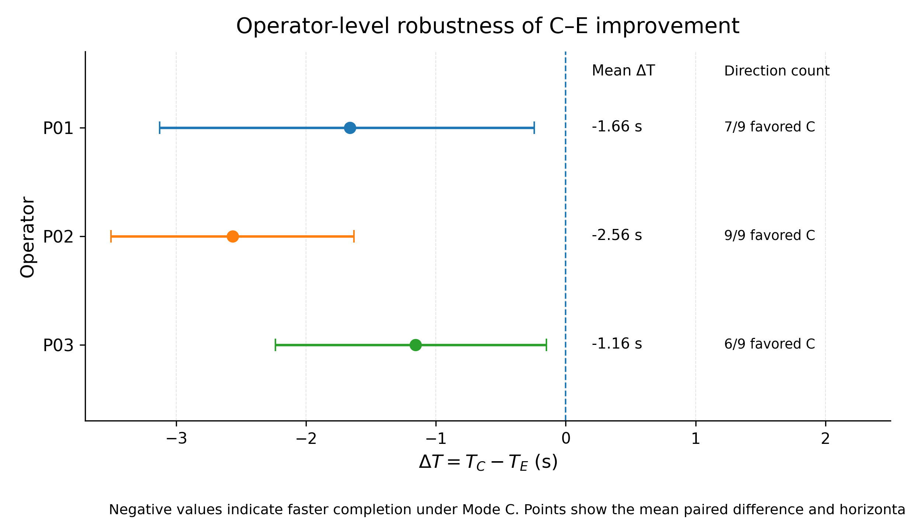

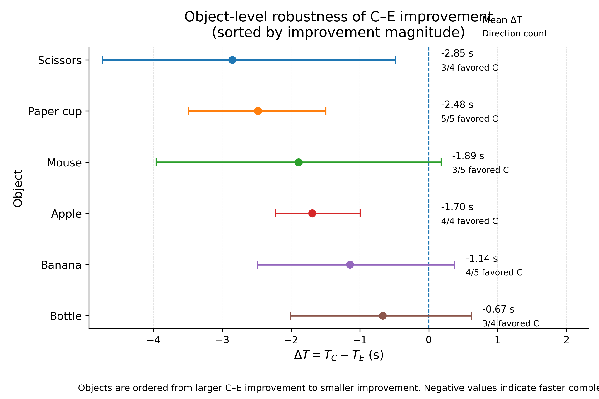

---

## 5 讨论

### 5.1 接触前视觉语义前馈为何可能改善任务表现

固定参数模式必须用一组折中设置覆盖全部对象，难以同时满足易损对象的柔顺需求、刚性对象的定位需求和不同夹持条件。人工选择模式虽然能够调用不同策略，但对象判断和参数切换由操作者完成，增加了工作流步骤。仅视觉提示模式改善了场景信息，却没有改变系统动力学、主端接口或夹爪执行条件。相比之下，完整视觉多通道模式在接触前将对象语义转换为一组任务相关机电参数，使操作者在开始接近对象前就获得更匹配的从端柔顺性、触觉接口设置和夹爪执行行为。

模式 C 更短的任务执行时长、更低的停顿次数和更低的 Raw NASA-TLX，与“完整参数组减少操作者对固定设置的补偿需求”这一系统级解释一致。由于当前实验未分别关闭触觉接口或夹爪参数，本文不把该结果归因于某一个单独通道，而将其解释为接触前多通道参数包的整体效果。

### 5.2 完整多通道参数组与阻抗-only 模式的比较

模式 C 和模式 E 都根据视觉语义调节平移刚度、转动刚度和阻尼比，因此二者共享从端柔顺性适配机制。模式 C 进一步预设主端触觉接口命令增益、外力估计死区、夹爪闭合速度和抓取力。在当前数据中，三名操作者的 C–E 平均任务执行时长差分别为 −1.66、−2.57 和 −1.15 s，三人等权汇总后的观察平均差为 −1.79 s（约 8.5%）；六种对象也均为 C 更快。主端轨迹长度差异较小（C−E = −0.024 m），且操作者层面的方向不完全一致。

这些结果提示，完整参数包的附加收益更可能表现为抓取、转运或释放阶段的停顿和修正减少，而不是几何路径明显缩短。从机电系统角度看，阻抗调度主要改变从端柔顺性，而夹爪速度与抓取力影响抓取建立和保持，主端接口增益与死区则影响操作者获得的接触线索。将三类参数共同初始化，能够覆盖单一阻抗通道无法直接配置的接口和执行条件。

C–E 仍属于组合消融：它直接支持“完整参数组优于阻抗-only 参数组”的系统级结论，但不能分离 \(K_f,d\) 与 \(v_g,F_g\) 的独立贡献。后续可设置“阻抗＋触觉接口”“阻抗＋夹爪”“完整参数组”和“关闭力输出”等正交条件，并结合主端输出力测量、外力估计标定和夹爪状态日志，进一步量化各通道的独立效应与交互作用。

### 5.3 与相关方法的具体区别

触觉共享控制和虚拟夹具通常通过力引导、运动约束或参考轨迹帮助操作者完成任务 [22,23]；策略融合和共享自主方法则根据操作者意图分配辅助控制量 [10,11,25,26]。集成式遥操作框架还可通过自动切换映射模式和匹配力反馈降低操作者决策负担 [30]。这些方法的主要调节对象是运动命令、映射模式或控制权。本文不替代操作者的运动决策，而是在接触前改变机器人、操作者接口和夹爪的参数初值。

变阻抗和 tele-impedance 方法关注机器人柔顺性随接触状态、操作者动作或任务阶段变化 [6–9,24,29]，视觉阻抗方法进一步将视觉特征引入力/阻抗反馈 [12]。本文与其区别在于：不进行任务内连续刚度更新，而是利用对象类别在接触前选择一组固定且有界的参数，并把夹爪速度、抓取力和主端接口命令与从端阻抗一起设置。

视觉伺服和 affordance 方法主要从图像中计算运动误差、抓取区域或动作可供性 [15–17,27,28]。本文不直接由视觉生成机械臂轨迹或抓取姿态，而是把类别信息作为参数选择依据。由此，本文工作位于视觉识别与底层遥操作执行之间，补充的是一个轻量级、可解释的接触前参数调度层。

综合来看，本文相对于已有工作的主要区别不是新的视觉网络或新的阻抗控制律，而是将对象识别、操作策略、从端阻抗、主端接口和夹爪执行组织成一个可复现的三级映射与任务级初始化流程，并通过五种模式验证完整参数组的系统级价值。

### 5.4 对机电遥操作系统设计的启示

本文结果提供三点系统设计启示：

**1. 感知不应只通知操作者，也可用于初始化底层接口参数。** 在当前测试平台内，将视觉语义从显示提示扩展为接触前参数前馈，与更短的任务执行时长和更低的工作负荷方向一致，而不要求操作者显式选择参数。

**2. 异质对象抓取的参数配置不应局限于从端柔顺性。** 模式 E 只改变从端阻抗，而模式 C 还预设主端接口命令和夹爪执行参数。当前 C–E 结果支持将阻抗、操作者接口和夹爪执行作为一个耦合参数包进行系统级配置；各通道的独立贡献仍需正交消融确认。

**3. 异步感知—控制分离降低同频运行要求。** 约 20 Hz 的视觉进程不位于名义 200 Hz 上层遥操作循环的同步等待路径，并且只在接触前锁定事件更新参数。因此，视觉模块无需以遥操作循环频率推理。现有证据支持非阻塞软件集成和接触前触发的时序可行性，但不构成硬实时确定性或零抖动证明。

### 5.5 不同对象收益幅度不同的原因

六种对象均表现出 C 快于 E 的方向，但降低幅度并不一致。瓶子和香蕉的降低幅度较小，纸杯和剪刀的降低幅度较大，这可能与抓取姿态、对象变形风险、夹持要求和操作者经验等多种因素有关。该对象分层结果说明完整参数组的收益具有一定任务依赖性。后续通过触觉接口与夹爪参数的分解实验，可进一步解释不同对象为何对各参数通道表现出不同敏感性。

### 5.6 局限性与进一步工作

本文结果应结合实验规模和统计层级理解。135 次试验由三名操作者重复完成，27 个匹配 block 是操作者内部的任务单元，而不是 27 名独立参与者；Raw NASA-TLX 共 45 份，每种模式 9 个“操作者 × 策略”评分单元。因而，本文报告操作者内匹配差值、方向一致性和对象分层结果，不将其外推为一般操作者总体的显著性结论。后续需要扩大独立操作者数量、对象实例和经验水平，并采用以操作者为随机效应的混合模型或操作者聚类重采样。

实验顺序经过部分平衡，但对象、操作者、学习和疲劳因素在小样本人在环实验中仍难以完全解耦。完整逐次顺序作为补充材料提供；未来可使用拉丁方或更严格的随机化设计。

视觉验证在受控视角、背景和光照下完成。当前 180/180 的类别和策略触发结果说明视觉模块在本文实验条件下不是主要误差来源，但遮挡、杂乱背景、未知对象和未测试类别仍需评估。当前故障安全依赖有界参数表、默认折中策略、任务内锁定和平台级保护，不等同于开放世界识别或工业安全认证。

参数表由硬件约束、任务风险和预实验稳定工作包络确定，而不是通过全局优化得到。本文首先验证完整参数组相对于阻抗-only 调度的系统级效果，尚未分离触觉接口与夹爪通道的独立作用。失败案例和停顿分析也主要基于任务级记录，缺少独立标定的接触力、滑移量、损伤量和阶段级失败时刻；后续应结合组件级正交消融、夹爪日志和接触质量测量完善机制分析。

名义 200 Hz 表示软件配置的上层更新率。本文未记录实际周期分布、最大周期、截止期违约率、CPU 负载或图像采集到策略锁定的端到端延迟，因此只主张视觉不在主循环同步等待路径中以及接触前触发可行，不主张经过验证的硬实时性能。

## 6 结论

本文提出了一种面向异质对象触觉遥操作的接触前视觉语义多通道参数调度方法。系统通过“对象语义—操作策略—机电参数”三级映射，在接触前联合设置从端阻抗、主端触觉接口命令和夹爪执行参数；异步视觉进程、默认折中策略与任务内锁定使低频语义感知能够以有界方式接入名义高频遥操作循环。

在当前三名操作者、六种对象和 135 次重复任务观测中，完整视觉多通道模式取得最短任务执行时长中位数 19.57 s [18.41, 20.05] IQR、最高描述性成功率 26/27（96.3%）和最低 Raw NASA-TLX 中位数 48.67 [47.67, 51.83] IQR。相较视觉阻抗-only 模式，三名操作者的平均任务执行时长分别缩短 1.66、2.57 和 1.15 s，三人等权平均缩短 1.79 s（约 8.5%）；六种对象均保持完整模式更快的方向，9 个操作者—策略 NASA-TLX 配对单元也均为完整模式更低。

主端轨迹长度差异较小，而停顿次数和工作负荷的方向更一致，提示完整参数组的附加收益更可能与操作停顿和修正减少有关，而不是几何路径明显缩短。本文结论限定于当前平台、受控对象集和三名操作者，支持的是完整接触前参数组相对于阻抗-only 调度的系统级价值；各通道的独立作用、开放场景鲁棒性和周期级实时性能仍需后续实验验证。

## 声明

- **伦理审批：** 本研究涉及非医学遥操作任务，不收集可识别个人身份的信息，因此免于正式伦理审查。
- **知情同意：** 所有参与者在实验前均提供书面知情同意。
- **资助：** 无。
- **利益冲突：** 作者声明无利益冲突。
- **数据可用性：** 去标识化试验数据可根据合理请求向通讯作者获取。

---

## 参考文献

1. Lawrence, D.A. (1993), "Stability and transparency in bilateral teleoperation", *IEEE Transactions on Robotics and Automation*, Vol. 9 No. 5, pp. 624–637.
2. Niemeyer, G. and Slotine, J.J.E. (1991), "Stable adaptive teleoperation", *IEEE Journal of Oceanic Engineering*, Vol. 16 No. 1, pp. 152–162.
3. Sheridan, T.B. (1992), *Telerobotics, Automation, and Human Supervisory Control*, MIT Press, Cambridge, MA.
4. Passenberg, C., Peer, A. and Buss, M. (2010), "A survey of environment-, operator-, and task-adapted controllers for teleoperation systems", *Mechatronics*, Vol. 20 No. 7, pp. 787–801.
5. Hogan, N. (1985), "Impedance control: An approach to manipulation", *Journal of Dynamic Systems, Measurement, and Control*, Vol. 107 No. 1, pp. 1–24.
6. Kronander, K. and Billard, A. (2016), "Stability considerations for variable impedance control", *IEEE Transactions on Robotics*, Vol. 32 No. 5, pp. 1298–1305.
7. Abu-Dakka, F.J., Rozo, L. and Caldwell, D.G. (2018), "Force-based variable impedance learning for robotic manipulation", *Robotics and Autonomous Systems*, Vol. 109, pp. 156–167.
8. Duan, J., Gan, Y., Chen, M. and Dai, X. (2018), "Adaptive variable impedance control for dynamic contact force tracking in uncertain environment", *Robotics and Autonomous Systems*, Vol. 102, pp. 54–65.
9. Abu-Dakka, F.J. and Saveriano, M. (2020), "Variable impedance control and learning — A review", *Frontiers in Robotics and AI*, Vol. 7, 590681.
10. Losey, D.P., McDonald, C.G., Battaglia, E. and O'Malley, M.K. (2018), "A review of intent detection, arbitration, and communication aspects of shared control for physical human–robot interaction", *Applied Mechanics Reviews*, Vol. 70 No. 1, 010804.
11. Bowman, M., Zhang, J. and Zhang, X. (2024), "Intent-based task-oriented shared control for intuitive telemanipulation", *Journal of Intelligent & Robotic Systems*, Vol. 110, 167.
12. Oliva, A.A., Giordano, P.R. and Chaumette, F. (2021), "A general visual-impedance framework for effectively combining vision and force sensing in feature space", *IEEE Robotics and Automation Letters*, Vol. 6 No. 3, pp. 4441–4448.
13. Peternel, L., Tsagarakis, N. and Ajoudani, A. (2016), "Towards multi-modal intention interfaces for human–robot co-manipulation", in *Proceedings of the IEEE/RSJ International Conference on Intelligent Robots and Systems (IROS)*, pp. 2663–2669.
14. Isermann, R. (2008), "Mechatronic systems—Innovative products with embedded control", *Control Engineering Practice*, Vol. 16 No. 1, pp. 14–29.
15. Hutchinson, S., Hager, G.D. and Corke, P.I. (1996), "A tutorial on visual servo control", *IEEE Transactions on Robotics and Automation*, Vol. 12 No. 5, pp. 651–670.
16. Chaumette, F. and Hutchinson, S. (2006), "Visual servo control. I. Basic approaches", *IEEE Robotics & Automation Magazine*, Vol. 13 No. 4, pp. 82–90.
17. Marchand, E., Spindler, F. and Chaumette, F. (2005), "ViSP for visual servoing: a generic software platform with a wide class of robot control skills", *IEEE Robotics & Automation Magazine*, Vol. 12 No. 4, pp. 40–52.
18. Bicchi, A. and Kumar, V. (2000), "Robotic grasping and contact: a review", in *Proceedings of the IEEE International Conference on Robotics and Automation (ICRA)*, pp. 348–353.
19. Albu-Schaffer, A., Haddadin, S., Ott, C., Stemmer, A., Wimbock, T. and Hirzinger, G. (2007), "The DLR lightweight robot: design and control concepts for robots in human environments", *Industrial Robot*, Vol. 34 No. 5, pp. 376–385.
20. Haddadin, S., Parusel, S., Johannsmeier, L. et al. (2022), "The Franka Emika robot: A reference platform for robotics research and education", *IEEE Robotics & Automation Magazine*, Vol. 29 No. 2, pp. 46–64.
21. Hart, S.G. and Staveland, L.E. (1988), "Development of NASA-TLX (Task Load Index): Results of empirical and theoretical research", in Hancock, P.A. and Meshkati, N. (Eds.), *Human Mental Workload*, North-Holland, Amsterdam, pp. 139–183.
22. Boessenkool, H., Abbink, D.A., Heemskerk, C.J.M., van der Helm, F.C.T. and Wildenbeest, J.G.W. (2011), "Haptic shared control improves teleoperated task performance toward performance in direct control", in *Proceedings of the IEEE World Haptics Conference*, pp. 433–438.
23. Abbott, J.J., Marayong, P. and Okamura, A.M. (2007), "Haptic virtual fixtures for robot-assisted manipulation", in Thrun, S., Brooks, R. and Durrant-Whyte, H. (Eds.), *Robotics Research*, Springer Tracts in Advanced Robotics, Vol. 28, Springer, Berlin, pp. 49–64.

24. Ajoudani, A., Tsagarakis, N.G. and Bicchi, A. (2012), "Tele-impedance: Teleoperation with impedance regulation using a body–machine interface", *The International Journal of Robotics Research*, Vol. 31 No. 13, pp. 1642–1656.
25. Dragan, A.D. and Srinivasa, S.S. (2013), "A policy-blending formalism for shared control", *The International Journal of Robotics Research*, Vol. 32 No. 7, pp. 790–805.
26. Javdani, S., Admoni, H., Pellegrinelli, S., Srinivasa, S.S. and Bagnell, J.A. (2018), "Shared autonomy via hindsight optimization for teleoperation and teaming", *The International Journal of Robotics Research*, Vol. 37 No. 7, pp. 717–742.
27. Do, T.-T., Nguyen, A. and Reid, I. (2018), "AffordanceNet: An end-to-end deep learning approach for object affordance detection", in *Proceedings of the IEEE International Conference on Robotics and Automation (ICRA)*, Brisbane, Australia.
28. Yamanobe, N., Wan, W., Ramirez-Alpizar, I.G., Petit, D., Tsuji, T., Akizuki, S., Hashimoto, M., Nagata, K. and Harada, K. (2017), "A brief review of affordance in robotic manipulation research", *Advanced Robotics*, Vol. 31 Nos. 19–20, pp. 1086–1101.

29. Li, R., Cheng, M. and Ding, R. (2023), "Passivity-based bilateral shared variable impedance control for teleoperation compliant assembly", *Mechatronics*, Vol. 95, 103057. https://doi.org/10.1016/j.mechatronics.2023.103057.
30. Li, W., Huang, F., Chen, Z. and Chen, Z. (2024), "Automatic-switching-based teleoperation framework for mobile manipulator with asymmetrical mapping and force feedback", *Mechatronics*, Vol. 99, 103164. https://doi.org/10.1016/j.mechatronics.2024.103164.
