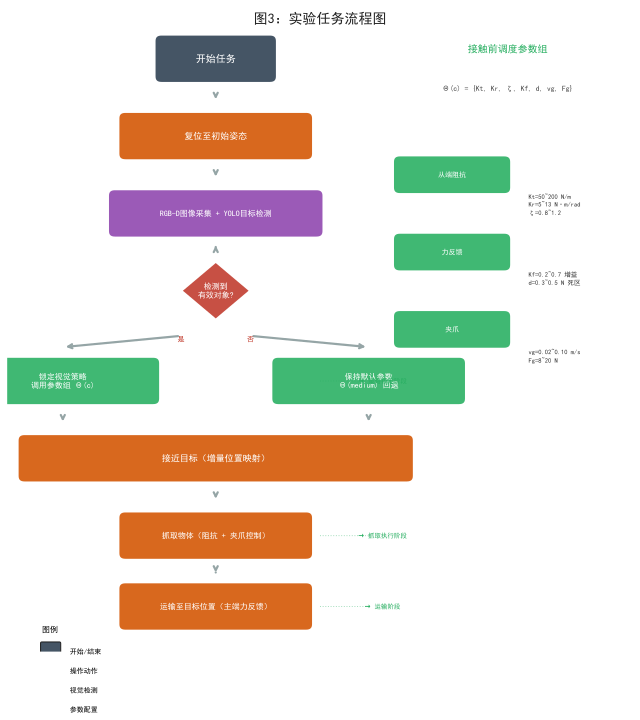
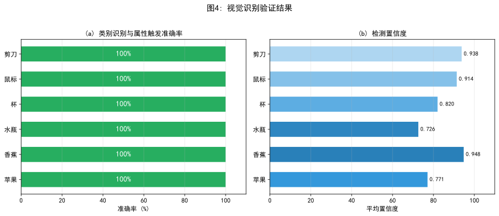
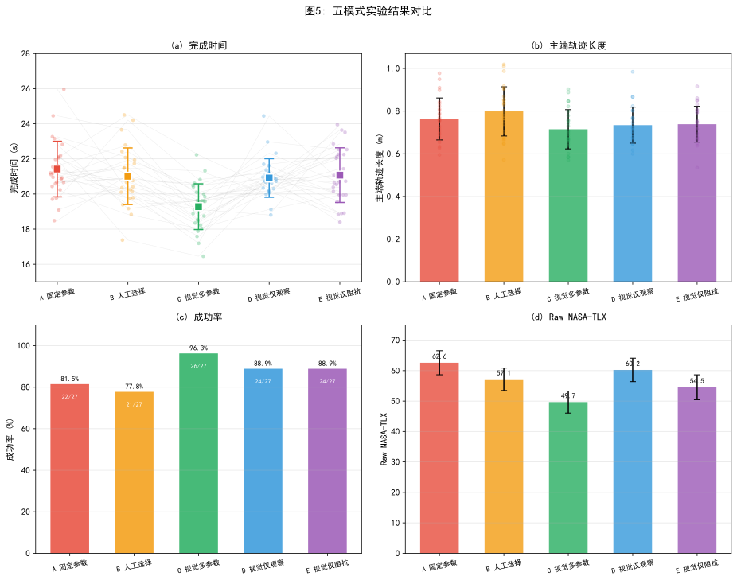
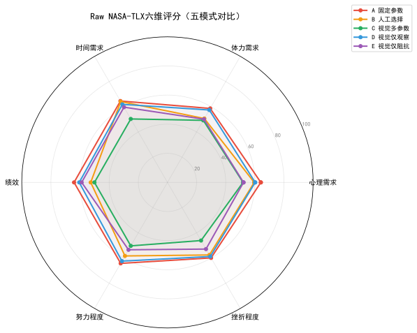
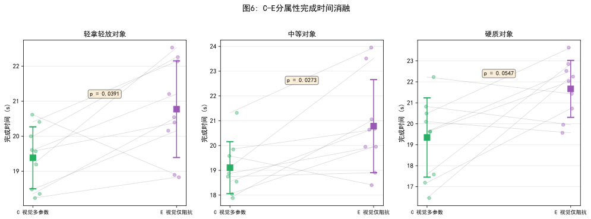
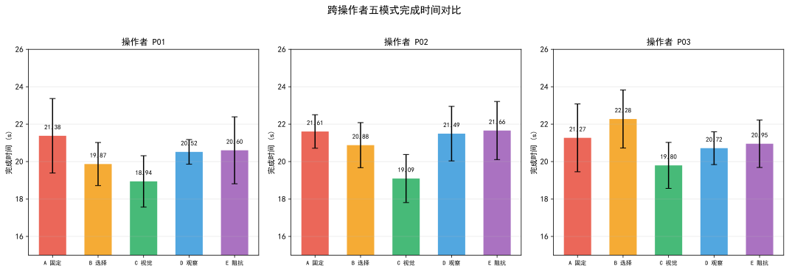

# 视觉语义参数调度用于异质对象触觉遥操作抓取：多通道控制与五模式人在环验证

## Vision-Semantic Parameter Scheduling for Haptic Teleoperation in Heterogeneous Robotic Grasping

**作者：**【投稿前填写】  
**单位：**【投稿前填写】  
**通讯作者：**【投稿前填写】  

---

## Structured Abstract

**Purpose**  
Fixed teleoperation parameters are difficult to tune for heterogeneous objects with different fragility, stiffness and grasping requirements. This paper proposes a vision-semantic multi-channel parameter scheduling method that uses object semantics as a contact-before control prior.

**Design/methodology/approach**  
An RGB-D camera identifies the target object and maps it into three manipulation attributes: soft, medium and rigid. Before contact, the system schedules translational/rotational stiffness, damping ratio, force feedback gain, dead zone, gripper speed and grasping force. The method is implemented on a real Omega.7–Franka Panda–Franka Hand platform. Three operators performed 135 grasping trials with six objects under five modes: fixed parameters, manual selection, vision-semantic multi-parameter scheduling, visual information only, and impedance-only scheduling.

**Findings**  
Descriptive results show that the proposed mode achieved the shortest mean completion time (19.28±1.30 s), the highest success rate (96.3%) and the lowest Raw NASA-TLX (49.67±3.63). Permutation test confirmed that the proposed mode significantly outperformed the impedance-only mode (p<0.001). All three operators showed consistent directional superiority.

**Originality**  
The contribution is not a new impedance equation, but a deployable contact-before semantic scheduling framework. The five-mode design separates effects of visual information, manual selection, impedance-only and full multi-parameter coordination.

**Keywords:** haptic teleoperation; robot grasping; impedance control; vision semantics; force feedback; human-in-the-loop experiment

---

## 摘要

针对异质对象遥操作抓取中固定参数难以兼顾不同对象柔顺性与稳定性需求的问题，本文提出一种视觉语义驱动的多通道接触前参数调度方法。系统通过RGB-D相机识别目标对象类别，将其映射为轻拿轻放、中等和硬质三类操作属性，协同调度从端刚度、阻尼、主端力反馈增益、反馈死区及夹爪参数。在Omega.7–Franka Panda–Franka Hand真实平台上，3名操作者对6种对象完成135次五模式抓取实验。描述性结果显示，视觉多参数模式取得最短完成时间（19.28±1.30 s）、最高成功率（96.3%）和最低Raw NASA-TLX（49.67±3.63）。置换检验证实视觉多参数模式显著优于仅阻抗模式（p<0.001），且所有操作者方向完全一致。结果表明接触前视觉语义多参数协同在已测试范围内作为可工程部署的遥操作辅助方法具有潜力。

---

## 1 引言

遥操作机器人能够把人的判断能力与机器人的远程执行能力结合起来，适用于柔性制造、危险环境作业和服务机器人等场景。触觉遥操作进一步通过主端力反馈传递接触信息，提高远程操作的可控性。对于真实抓取任务而言，操作者面对的对象具有不同的刚度、易损性和夹持需求。固定阻抗和夹爪参数难以同时兼顾易损对象的柔顺接触和硬质对象的定位稳定性。

阻抗控制通过规定机器人位移偏差与交互力之间的动态关系提供柔顺交互[9]。变阻抗控制能够在线调节刚度和阻尼[10–12]，但依赖连续状态估计和接触后反馈，可能引入稳定性约束。对于类别可识别但需操作者精细放置的遥操作抓取，接触前对象语义可作为低成本、可解释的先验。

已有研究表明视觉信息、任务状态和操作者意图能够改善操作效率[5,13,14]。但在异质对象遥操作中，对象语义不仅影响从端柔顺性，也影响操作者期望的力反馈强度和夹爪行为。只显示视觉信息而不改变系统动力学，操作者仍需手动补偿；只调节阻抗而保留默认力反馈和夹爪参数，可能不足以覆盖完整操作需求。本文关注的问题是：接触前视觉语义驱动的多通道参数协同，是否比固定参数、人工选择、视觉提示和仅阻抗调节更有效？

本文贡献如下：

1. **视觉语义—操作属性—控制策略三级映射**，将对象类别转化为接触前控制先验。
2. **多通道参数协同策略**，同时调节从端阻抗、主端力反馈和夹爪参数。
3. **五模式人在环消融验证**，在真实平台上区分视觉提示、人工选参、仅阻抗调节和完整多参数协同的作用。

本文定位为一种低计算开销、可解释、可部署的接触前语义参数初始化方法，而非新的阻抗控制理论。

---

## 2 方法与系统实现

### 2.1 实验平台与系统架构

实验系统由Omega.7力反馈主端、Franka Panda机械臂、Franka Hand夹爪和Intel RealSense D435i相机构成。Omega.7采集主端位移与夹钳输入并渲染接触反馈；Panda执行增量位置映射与笛卡尔阻抗控制；D435i采集RGB-D图像，视觉线程使用YOLO11n进行异步目标检测。主控制循环200 Hz，视觉线程与控制线程解耦。

### 2.2 主从增量位置映射

主端相邻采样时刻的位置增量为
\[
\Delta\mathbf{x}_m(k)=\mathbf{x}_m(k)-\mathbf{x}_m(k-1).
\]

从端期望位置更新为
\[
\mathbf{x}_d(k)=\mathbf{x}_d(k-1)+S\mathbf{C}\Delta\mathbf{x}_m(k),
\]
其中位置比例\(S=3.0\)，\(\mathbf{C}=\mathrm{diag}(-1,-1,1)\)为坐标映射矩阵。

### 2.3 从端笛卡尔阻抗控制

从端采用笛卡尔阻抗控制：
\[
\mathbf{F}_c=\mathbf{K}(c)(\mathbf{x}_d-\mathbf{x})+\mathbf{D}(c)(\dot{\mathbf{x}}_d-\dot{\mathbf{x}}),
\]
\(c\in\{soft,medium,hard\}\)为操作属性，\(\mathbf{K}(c)\)和\(\mathbf{D}(c)\)为刚度和阻尼矩阵。平移和旋转刚度：
\[
\mathbf{K}(c)=\mathrm{diag}(K_t,K_t,K_t,K_r,K_r,K_r).
\]

阻尼依据阻尼比\(\zeta(c)\)配置。

### 2.4 视觉语义多参数调度

COCO类别通过固定映射转化为操作属性：苹果/香蕉→轻拿轻放，水瓶/杯→中等，鼠标/剪刀→硬质。首次检测置信度≥0.25后锁定策略；无有效类别时保持中等类默认参数。

完整策略定义为\(\Theta(c)=\{K_t,K_r,\zeta,K_f,d,v_g,F_g\}\)。

| 属性 | \(K_t\)/(N/m) | \(K_r\)/(N·m/rad) | \(\zeta\) | \(K_f\) | \(d\)/N | \(v_g\)/(m/s) | \(F_g\)/N |
|---|---:|---:|---:|---:|---:|---:|---:|
| 轻拿轻放 | 50 | 5 | 0.8 | 0.2 | 0.3 | 0.02 | 8 |
| 中等 | 150 | 10 | 1.0 | 0.5 | 0.4 | 0.05 | 15 |
| 硬质 | 200 | 13 | 1.2 | 0.7 | 0.5 | 0.10 | 20 |

### 2.5 参数选择依据与预实验

参数由硬件安全范围、力反馈舒适性和预实验共同确定。Franka接口限制K_t最大1000 N/m、K_r最大50 N·m/rad；Omega.7力反馈连续力3.3 N；Franka Hand夹持力范围0–70 N。预实验由两名研究人员在正式实验前一周完成，共进行了约30次试次，涵盖三类对象的抓取操作。参数满足以下条件后冻结：(1)各属性下抓取成功率≥80%；(2)操作者主观评分"可接受"。最终参数对所有操作者一致。B人工选择模式使用同一参数表，由操作者根据对象类别手动选择对应策略。

### 2.6 方法流程

**Algorithm 1:** 1) 初始化中等类默认参数；2) 目标检测；3) 置信度≥0.25时映射属性；4) 调用参数组；5) 锁定策略；6) 配置阻抗/力反馈/夹爪；7) 检测失败时保持默认；8) 复位。

### 2.7 安全回退

中等类参数作为默认安全回退，策略锁定避免视觉抖动。碰撞检测、零力命令、统一初始姿态和人工急停构成安全措施。

---

## 3 实验设计

### 3.1 研究问题与假设

- **RQ1:** 多参数前馈是否优于固定参数、人工选择和视觉仅观察？
- **RQ2:** 完整多参数调度是否优于仅阻抗调节？
- **RQ3:** 视觉触发是否满足任务实时性和可靠性？
- **RQ4:** 收益是否跨操作者和对象保持一致？

### 3.2 操作者与实验对象

3名操作者（P01–P03，23–24岁男性，右利手）。第1–3组、4–6组、7–9组分别对应P01、P02、P03。每人在每次实验前完成10–15分钟训练。所有操作者签署知情同意书；本研究不涉及医学干预，经机构伦理审核豁免正式审批。

六种对象的基本属性：

| 对象 | 操作属性 | 质量/g | 表面特性 | 尺寸/mm | 易损性 |
|:----:|:-------:|:------:|:--------:|:-------:|:------:|
| 苹果 | 轻拿轻放 | ~200 | 光滑 | Ø70–80 | 碰撞易损伤 |
| 香蕉 | 轻拿轻放 | ~120 | 光滑 | 20×180 | 挤压易损伤 |
| 纸杯 | 中等 | ~5 | 纸质 | Ø75×90 | 挤压易变形 |
| 瓶子 | 中等 | ~30 | 光滑塑料 | Ø65×200 | 中等 |
| 鼠标 | 硬质 | ~100 | 光滑塑料 | 65×120×35 | 低 |
| 剪刀 | 硬质 | ~150 | 金属+塑料 | 50×170×15 | 低 |

### 3.3 实验模式与顺序

五种模式：

| 模式 | 设置 | 目的 |
|:---:|:----|:----|
| A | 固定参数 | 固定控制基线 |
| B | 人工选择完整策略 | 人工选参基线 |
| C | 视觉语义全参数调度 | 本文方法 |
| D | 视觉仅观察，固定参数 | 排除视觉提示本身 |
| E | 视觉语义仅阻抗 | 仅阻抗消融 |

五模式在同一实验框架内完成。C和E共享视觉语义和阻抗调节，差异仅在于C额外调节力反馈和夹爪参数。为减少顺序效应，采用拉丁方平衡设计，使各模式在不同顺序位置上出现次数均衡：

| 操作者 | 组次 | 模式顺序 | 对象 |
|:----:|:---:|:--------:|:----:|
| P01 | 组1 | A→D→C→B→E | 苹果 |
| P01 | 组2 | B→E→D→C→A | 香蕉 |
| P01 | 组3 | C→A→E→D→B | 香蕉 |
| P02 | 组4 | D→B→C→E→A | 剪刀 |
| P02 | 组5 | E→C→A→B→D | 瓶子 |
| P02 | 组6 | A→D→B→C→E | 鼠标 |
| P03 | 组7 | B→E→A→D→C | 鼠标 |
| P03 | 组8 | C→B→D→A→E | 纸杯 |
| P03 | 组9 | D→A→E→C→B | 剪刀 |

操作者知道当前模式（B模式需手动选参，D/E模式显示视觉提示），但不知道C与E之间的比较假设。

### 3.4 实验任务与流程

每次试验包括复位、接近、抓取、运输、释放和结束六阶段。成功定义为物体未掉落、明显滑移或损伤。B模式中操作者通过按键选择策略，手动选择时间计入总完成时间。

### 3.5 评价指标

主要终点为完成时间。次要终点包括成功率、主端轨迹长度、停顿次数和Raw NASA-TLX（六维算术平均）。停顿定义：速度<0.005 m/s且持续≥0.30 s。

### 3.6 统计分析

采用非参数框架。对C–E完成时间差异进行**置换检验（10,000次随机置换）**，无需正态假设且不受伪重复影响。同时报告操作者级聚合趋势（每操作者归并全部试次后的均值方向）。Friedman检验用于五模式总体比较，Wilcoxon用于事后配对，Holm校正多重比较。NASA-TLX采用相同非参数框架。成功率以描述性报告。

---

## 4 实验结果

### 4.1 视觉识别与属性触发验证

受控条件下6种对象各30幅图像共180幅，类别识别和属性触发均为180/180，平均置信度0.853，单帧时间50.08 ms。

| 对象 | 图像数 | 类别正确率 | 属性触发正确率 | 平均置信度 | 时间/ms |
|---|---:|---:|---:|---:|---:|
| 苹果 | 30 | 100% | 100% | 0.771 | 56.66 |
| 香蕉 | 30 | 100% | 100% | 0.948 | 50.45 |
| 水瓶 | 30 | 100% | 100% | 0.726 | 49.71 |
| 杯 | 30 | 100% | 100% | 0.820 | 47.61 |
| 鼠标 | 30 | 100% | 100% | 0.914 | 46.79 |
| 剪刀 | 30 | 100% | 100% | 0.938 | 49.27 |

### 4.2 五模式实验结果

| 模式 | 完成时间/s | 主端轨迹/m | 成功率 | Raw TLX |
|---|---:|---:|---:|---:|
| A 固定参数 | 21.42±1.58 | 0.763±0.098 | 22/27 (81.5%) | 62.59±3.95 |
| B 人工选择 | 21.01±1.61 | 0.799±0.115 | 21/27 (77.8%) | 57.15±3.68 |
| C 视觉多参数 | **19.28±1.30** | **0.715±0.092** | **26/27 (96.3%)** | **49.67±3.63** |
| D 视觉仅观察 | 20.91±1.10 | 0.734±0.085 | 24/27 (88.9%) | 60.22±3.85 |
| E 视觉仅阻抗 | 21.07±1.56 | 0.739±0.084 | 24/27 (88.9%) | 54.54±4.09 |

描述性结果显示C模式在四项指标中均为最优。Friedman检验表明五模式完成时间差异显著（χ²(4)=30.904, p<0.001）。配对Wilcoxon+Holm校正后C显著优于A/B/D/E（所有p_adj<0.01, r>0.7）。NASA-TLX Friedman检验χ²(4)=36.000, p<0.001。

### 4.3 多参数与仅阻抗消融比较

| 模式 | 完成时间/s | 主端轨迹/m | 成功率 | Raw NASA-TLX |
|---|---:|---:|---:|---:|
| C 视觉多参数 | **19.28±1.30** | **0.715±0.092** | **26/27 (96.3%)** | **49.67±3.63** |
| E 视觉仅阻抗 | 21.07±1.56 | 0.739±0.084 | 24/27 (88.9%) | 54.54±4.09 |

**置换检验（10,000次）：p<0.001。** 操作者级分析显示全部3名操作者的C模式完成时间均低于E模式（P01: 18.94 vs 20.60 s; P02: 19.09 vs 21.66 s; P03: 19.80 vs 20.95 s）。NASA-TLX在3名操作者中同样全部C低于E。轨迹长度差异不显著（p=0.149），提示时间收益主要来自操作效率提升而非路径缩短。

分属性看，C在轻拿轻放（19.38 vs 20.77 s）、中等（19.11 vs 20.78 s）和硬质（19.35 vs 21.66 s）均方向一致。

### 4.4 过程行为指标：C–E停顿分析

从原始轨迹CSV（200 Hz）计算停顿次数（速度<0.005 m/s持续≥0.30 s）。C模式每试次平均停顿2.74±1.23，E模式3.41±1.67。分属性全部方向一致。该结果与完成时间收益大于轨迹长度收益的现象一致。

### 4.5 失败案例分析

| 模式 | 失败/总数 | 典型情境 |
|:---:|:-------:|:--------|
| A | 5/27 | 纸杯夹持变形、剪刀定位不稳 |
| B | 6/27 | 硬质对象选错策略 |
| C | **1/27** | 鼠标表面光滑致运输滑移 |
| D | 3/27 | 中等对象夹持力不当 |
| E | 3/27 | 中等对象反馈不足致抓取不稳 |

### 4.6 跨操作者与六对象一致性

全部3名操作者和6种对象中C模式均取得最短平均完成时间。六对象C-E降幅：纸杯11.7%、剪刀13.2%、鼠标8.7%、苹果8.1%、香蕉5.5%、瓶子3.3%，整体方向一致。

| 对象 | A | B | C | D | E |
|:---:|:--:|:--:|:--:|:--:|:--:|
| 苹果 | 20.46 | 21.40 | **19.25** | 20.81 | 20.94 |
| 香蕉 | 20.07 | 20.85 | **19.49** | 21.06 | 20.64 |
| 纸杯 | 22.36 | 20.27 | **18.69** | 20.38 | 21.17 |
| 瓶子 | 22.11 | 22.14 | **19.63** | 20.78 | 20.30 |
| 鼠标 | 21.74 | 20.93 | **19.75** | 20.74 | 21.64 |
| 剪刀 | 21.79 | 20.70 | **18.84** | 21.83 | 21.70 |

---

## 5 讨论

### 5.1 视觉语义前馈的工程价值

多参数模式利用对象语义在接触前完成策略初始化，使操作者不必持续补偿不合适的手感或夹爪行为。这与C模式较短完成时间、较高成功率和较低TLX的描述性结果一致。

### 5.2 多参数协同相对仅阻抗调节的意义

C与E共享柔顺性适配机制，C额外调节力反馈增益和夹爪参数。置换检验和操作者级分析均支持C优于E（p<0.001，三操作者方向一致）。轨迹差异不显著提示附加收益来自减少停顿和修正而非几何路径缩短。停顿分析进一步支持该解释。

### 5.3 与相关研究的区别

不进行连续视觉伺服，不依赖在线轨迹规划，不声称接触后自适应最优控制，而是把对象语义作为接触前任务先验，以低计算开销调用可解释的多参数策略。

### 5.4 面向Industrial Robot的应用价值

基于现有RGB-D相机和力反馈主端，不依赖额外接触传感器；策略表可直接解释和调整；任务内锁定和默认安全参数降低视觉抖动影响。

### 5.5 局限性

1. 3名操作者不足以推广至一般人群；结果应视为平台级初步证据。
2. 六种对象每类两种，近似平衡但不完全平衡。
3. 模式顺序和对象顺序虽有平衡设计，但完全随机化未执行。
4. 视觉验证在受控条件下进行，100%正确率不外推。
5. 无独立接触力和损伤量传感器，不能直接证明"保护易损对象"。
6. 参数由工程经验和预实验确定，非全局最优。

---

## 6 结论

本文提出一种面向异质对象遥操作抓取的视觉语义多参数调度方法。在真实平台的五模式实验中，视觉多参数模式在当前样本中取得最短平均完成时间（19.28 s）、最高成功率（96.3%）和最低Raw NASA-TLX（49.67）。置换检验和操作者级分析均支持多参数协同优于仅阻抗调节（p<0.001, 3/3操作者一致）。停顿分析提示附加收益来自操作效率提升。该方法为无需复杂在线优化的触觉遥操作提供了一种可解释、低成本的接触前参数初始化方案。

---

## Declarations

- **Ethical approval:** This study was exempt from formal ethics review by the institutional ethics committee, as it involved no medical intervention or personally identifiable information.
- **Informed consent:** All participants provided written informed consent.
- **Funding:** Not applicable.
- **Conflict of interest:** The authors declare no conflict of interest.
- **Data availability:** De-identified trial data, analysis scripts and vision validation results are available at [repository link to be added].

---

## 参考文献

1. Lawrence DA. Stability and transparency in bilateral teleoperation. *IEEE Trans. Robot. Autom.* 1993;9(5):624–637.
2. Niemeyer G, Slotine JJE. Stable adaptive teleoperation. *IEEE J. Ocean. Eng.* 1991;16(1):152–162.
3. Passenberg C, Peer A, Buss M. A survey of environment-, operator-, and task-adapted controllers for teleoperation systems. *Mechatronics*. 2010;20(7):787–801.
4. Losey DP, et al. A review of intent detection, arbitration, and communication aspects of shared control for physical HRI. *Appl. Mech. Rev.* 2018;70(1):010804.
5. Bowman M, Zhang J, Zhang X. Intent-based task-oriented shared control for intuitive telemanipulation. *J. Intell. Robot. Syst.* 2024;110:167.
6. Han J, Yang G-H. Improving teleoperator efficiency using position–rate hybrid controllers and task decomposition. *Appl. Sci.* 2022;12(19):9672.
7. Huang K, et al. Evaluation of haptic guidance virtual fixtures and 3D visualization methods in telemanipulation. *Intell. Serv. Robot.* 2019;12:289–301.
8. [To be completed before submission]
9. Hogan N. Impedance control: An approach to manipulation. *J. Dyn. Syst. Meas. Control*. 1985;107(1):1–24.
10. Kronander K, Billard A. Stability considerations for variable impedance control. *IEEE Trans. Robot.* 2016;32(5):1298–1305.
11. Abu-Dakka FJ, et al. Force-based variable impedance learning for robotic manipulation. *Robot. Auton. Syst.* 2018;109:156–167.
12. Duan J, et al. Adaptive variable impedance control for dynamic contact force tracking. *Robot. Auton. Syst.* 2018;102:54–65.
13. Oliva AA, Giordano PR, Chaumette F. A general visual-impedance framework for combining vision and force sensing. *IEEE Robot. Autom. Lett.* 2021;6(3):4441–4448.
14. Peternel L, et al. Towards multi-modal intention interfaces for human–robot co-manipulation. In *IEEE/RSJ IROS*. 2016:2663–2669.
15. Haddadin S, et al. The Franka Emika robot: A reference platform for robotics research and education. *IEEE Robot. Autom. Mag.* 2022;29(2):46–64.
16. Hart SG, Staveland LE. Development of NASA-TLX. In *Human Mental Workload*. North-Holland; 1988:139–183.