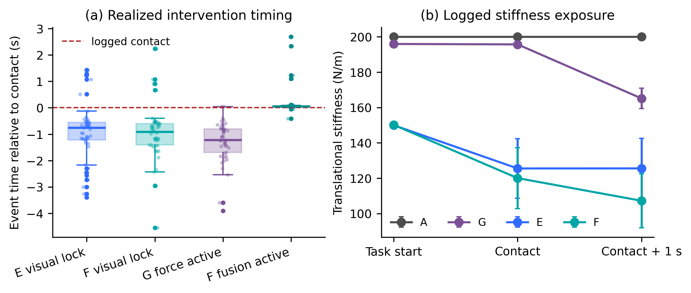
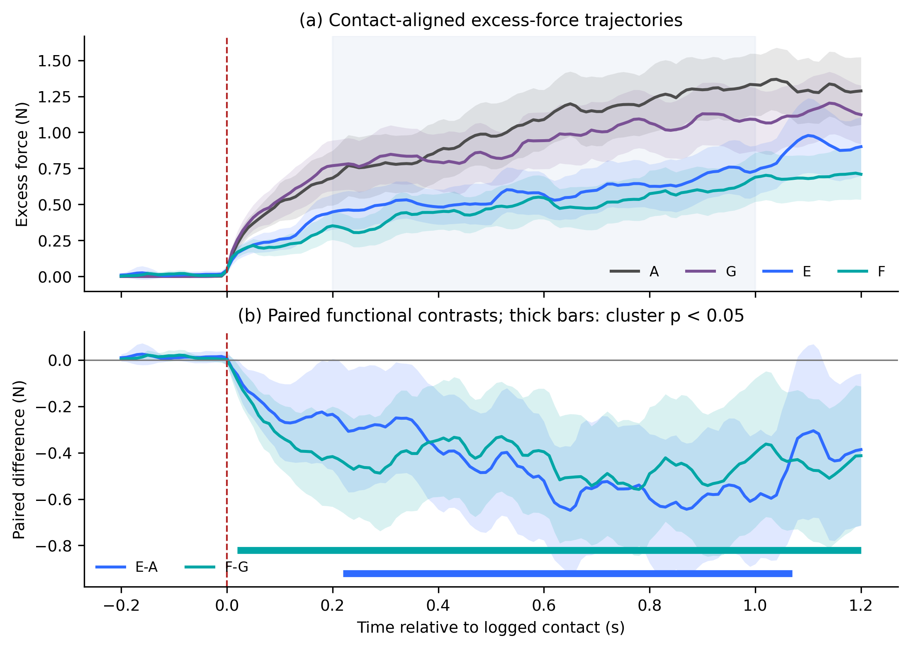
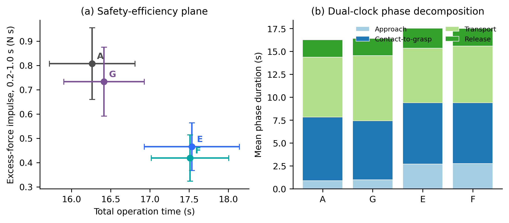
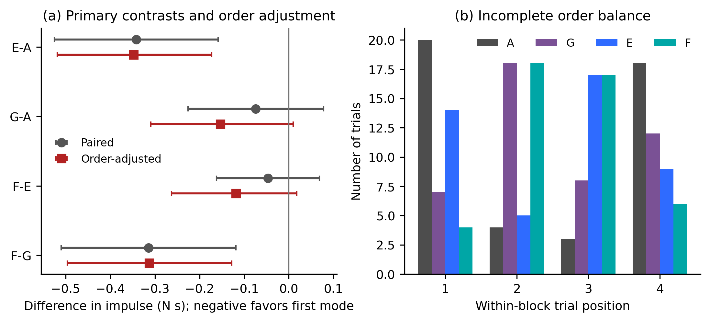

# From Nominal Modes to Realized Interventions: A Latency-Aware and Event-Aligned Evaluation of Impedance Strategies in Human-in-the-Loop Teleoperation

**Fengjie Maa, Chuang Caob, Qixin Caob, Yilin Zhoua, Hua Zhanga,***

a School of Mechanical and Automotive Engineering, Shanghai University of Engineering Science, Shanghai 201620, China  
b School of Mechanical Engineering, Shanghai Jiao Tong University, Shanghai 200240, China  
* Corresponding author: huazhang@yeah.net

> **AUTHOR-VERIFICATION DRAFT.** This manuscript is a complete scientific draft generated from the current 180-trial dataset and code audit. Before submission, the authors must verify participant demographics, ethics determination, object identities, author contributions, affiliations, and the journal-specific generative-AI disclosure. The related manuscript currently under review must be disclosed to the editor. This draft must not be submitted without scientific and authorship review.

## Abstract

Nominal controller labels do not necessarily describe when an impedance intervention actually becomes available to a human operator or when it changes the robot. This distinction is important in asynchronous, contact-rich teleoperation, where perception latency, pre-contact motion, contact detection, force-dependent updates, and the operator are coupled. This study presents a latency-aware, event-aligned evaluation framework that reconstructs realized intervention timing from synchronized controller logs and combines scalar, functional, distributional, and order-adjusted analyses. Five operators completed 45 matched task blocks across three object-material categories and four nominal modes: fixed impedance (A), force-magnitude-driven adaptation (G), visual configuration (E), and visual configuration with force refinement (F), yielding 180 first-attempt trials. The primary outcome was baseline-corrected excess-force impulse from 0.2 to 1.0 s after logged contact. E reduced the outcome relative to A by 0.342 N·s (95% CI 0.158-0.525 N·s; Holm-adjusted p=0.0026), whereas G-A was uncertain. Paired cluster permutation testing localized the E-A difference to 0.22-1.07 s after contact (p=0.0013). However, visual lock occurred 1.75 s after task start on average and E increased total operation time by 1.27 s (95% CI 0.72-1.82 s), with the difference concentrated in approach. After subtracting visual-lock delay, the E-A time difference was -0.48 s (95% CI -1.02 to 0.07 s). Log audit further showed that G became force-active before task start in 42/45 trials and that F force refinement activated a median 0.053 s after logged contact rather than after the nominal 0.20-s delay. Order-adjusted estimates preserved the E-A effect (-0.348 N·s, bootstrap 95% CI -0.519 to -0.173 N·s) but did not establish F-E synergy. These findings support visual-condition treatment packages for reducing early contact-force exposure, while demonstrating that realized timing, latency cost, and implementation fidelity are necessary for valid interpretation of human-in-the-loop impedance experiments.

**Keywords:** haptic teleoperation; variable impedance; contact-rich manipulation; latency-aware evaluation; event alignment; functional data analysis; treatment fidelity; human-in-the-loop experiment

## Highlights

- Realized controller exposure was reconstructed from task, perception, contact, force-activation, and stiffness logs rather than inferred from nominal mode labels.
- Visual configuration reduced contact-aligned excess-force impulse, with a significant paired functional cluster at 0.22-1.07 s after contact.
- The force-only controller was active before task start in 42/45 trials, limiting its interpretation as a purely post-contact reactive condition.
- Visual modes traded approximately 1.27 s of total task time for lower contact-force exposure; the time cost was concentrated in the approach and perception-readiness phase.

## 1. Introduction

Teleoperation combines human perception and decision making with robotic execution in environments where fully autonomous manipulation remains difficult. In contact-rich tasks, the slave robot must be sufficiently responsive to track operator commands while remaining compliant enough to avoid excessive impact, unstable contact, or damage to the manipulated object. This creates a familiar impedance trade-off: higher stiffness can improve tracking and task progression, whereas lower stiffness can reduce contact aggressiveness but increase lag and correction effort [1-7].

Variable-impedance and shared-control methods address this trade-off by adapting stiffness to the operator, environment, task phase, or estimated interaction state [2-10]. Visual information can be used before contact to select or predict an impedance policy [11-14], while measured force can update the policy during physical interaction [7-10]. Recent vision-based shared-impedance work has explicitly targeted the safety-efficiency balance in contact-rich teleoperation [15]. Latency-aware robot-learning frameworks have likewise shown that asynchronous perception and execution timing can materially affect smoothness and contact behavior [16]. Consequently, neither visual impedance selection nor force-dependent impedance adaptation is, by itself, a sufficient novelty claim.

A less examined problem is whether experimental condition labels accurately represent the intervention delivered during a human-in-the-loop trial. A mode described as “visual pre-configuration” may not be ready until the operator has already moved. A nominally “reactive” force controller may respond to sensor offset or preload before the logged contact event. A configured delay may not equal the delay realized in the recorded control loop. These differences matter because the human operator can move while perception runs, wait for system readiness, change approach behavior, or compensate for robot response. The experimental treatment is therefore not only a controller formula; it is a time-varying exposure jointly determined by implementation, events, and human action.

Conventional endpoint analysis further compresses contact dynamics into a peak force, mean force, or task time. Such outcomes are useful but do not identify when a difference begins or how long it persists. Testing every time sample independently creates a severe multiple-comparison problem. Cluster-based permutation inference offers a nonparametric way to test contiguous temporal effects while preserving within-trajectory dependence [17]. Combining this method with event alignment and log-derived treatment timing can provide a more faithful account of contact-rich teleoperation.

This study therefore asks four questions:

1. When did the four nominal impedance strategies actually become active relative to task start and contact?
2. Did visual-condition modes reduce contact-force exposure, and during which post-contact interval did the difference occur?
3. What operation-time cost accompanied the force reduction, and was that cost attributable to perception readiness, approach, or later manipulation phases?
4. Were the conclusions robust to incomplete balancing of within-block mode order?

The contribution is an evaluation framework rather than a new visual classifier or a claim of a novel visual-force controller. Specifically, the study:

1. reconstructs realized intervention timing and stiffness exposure from synchronized task, visual, force-activation, and controller logs;
2. combines a pre-specified scalar contact outcome with paired functional cluster-permutation inference over the full contact trajectory;
3. introduces a dual-clock safety-efficiency analysis that separates total system time from time after visual-policy readiness; and
4. performs a block-fixed, order-adjusted robustness analysis and explicitly audits force-stiffness endogeneity.

## 2. Related Work and Novelty Boundary

### 2.1. Variable impedance in teleoperation

The stability-transparency trade-off is foundational in bilateral teleoperation [1]. Environment-, operator-, and task-adapted controllers have been reviewed extensively [2], and variable-impedance control has developed into a broad field spanning model-based adaptation, learning, and physical human-robot interaction [3]. Tele-impedance allows the operator or an inferred human state to regulate slave impedance [4,5]. Other methods adapt impedance from contact force, operator motion, or estimated environment properties [6-10]. Formal treatments have addressed stability, passivity, and energy management for time-varying stiffness [18-20].

The present study does not provide a new full-system passivity proof. The logged upper-level stiffness updates are bounded and smoothed, but the complete human-master-communication-slave-environment loop is not modeled. Results are therefore empirical treatment-package comparisons within the tested platform and task.

### 2.2. Visual and force information for impedance selection

Visual or semantic information can establish a task-dependent policy before contact. Huang et al. combined vision and voice for semi-autonomous tele-impedance [11]. Oliva et al. proposed a visual-impedance framework combining visual and force sensing [12]. Siegemund et al. used object geometry, material, and environmental relations in semi-autonomous tele-impedance [13]. More recently, Stiffness Copilot predicted direction-dependent stiffness from wrist-camera images for contact-rich teleoperation and evaluated safety and efficiency in a human-subject study [15].

Force-dependent adaptation provides interaction evidence unavailable from vision alone, but force is also an outcome of the controller, robot, object, and operator. When measured force directly drives the next stiffness command, a regression of observed stiffness on force is endogenous by construction. The resulting association can describe controller operation but cannot identify a causal stiffness effect without an external intervention or fixed-input replay.

### 2.3. Latency, event timing, and functional inference

Perception and control often run at different rates. Asynchronous queues can prevent visual inference from blocking a higher-rate teleoperation loop, yet non-blocking execution does not remove perception latency: it changes how latency enters the human-robot interaction. Latency-aware policy deployment has recently been studied in industrial contact-rich tasks [16], while teleoperation research has long considered communication delay, stability, and transparency [1,21]. The present work focuses on a different latency: the time from task start to visual-policy availability and its relationship to contact and task phase.

Contact trajectories are strongly autocorrelated. Cluster permutation tests use the largest contiguous test-statistic mass under within-unit label permutation to control family-wise error without treating each time sample as independent [17]. Although developed for high-dimensional physiological signals, the method is directly applicable to event-aligned force trajectories when permutation respects the matched experimental unit.

### 2.4. Relationship to the related manuscript under review

The same teleoperation platform is described in a related manuscript currently under review. That manuscript uses an independent dataset of 135 trials from three operators, six objects, and five modes to study object-conditioned one-shot, multi-channel configuration of slave impedance, master haptic feedback, and gripper parameters, with task completion time as the primary outcome. The present study uses 180 different trial files from five operators and four modes, focuses on contact-force exposure, realized intervention timing, latency cost, functional trajectory inference, and implementation fidelity, and does not reuse trial-level data, figures, tables, or results.

> **EDITORIAL ACTION:** Retain this distinction in the Robotica cover letter. If the related manuscript becomes a preprint or is accepted before submission, cite it normally and shorten this subsection. If it remains confidentially under review, provide the editor with the manuscript and a difference table rather than presenting it as a published source.

## 3. Materials and Methods

### 3.1. Teleoperation platform and logging

The platform comprised an Omega.7 force-feedback master device, a seven-degree-of-freedom Franka Panda robot with a Franka Hand gripper, an Intel RealSense D435i camera, and a host computer. Translational master motion generated slave target-position increments. The Panda executed Cartesian impedance control with a fixed end-effector orientation. The robot-provided external wrench estimate supplied the three-dimensional external force used in the present analysis.

For descriptive purposes, the slave translational impedance action can be represented as

$$
\mathbf{F}_{c}(t)=\mathbf{K}_{t}(t)\bigl(\mathbf{x}_{d}(t)-\mathbf{x}(t)\bigr)
+\mathbf{D}_{t}(t)\bigl(\dot{\mathbf{x}}_{d}(t)-\dot{\mathbf{x}}(t)\bigr),
$$

where $\mathbf{x}_{d}$ is the operator-derived target, $\mathbf{x}$ is the robot end-effector position, and $\mathbf{K}_{t}$ and $\mathbf{D}_{t}$ are translational stiffness and damping matrices. This expression identifies the commanded impedance channel; it is not a complete dynamic model of the bilateral human-robot system.

The nominal supervisory loop ran at approximately 200 Hz. Force-dependent impedance targets were updated at a nominal 20 Hz and smoothed before command transmission. Each CSV sample contained system and operation time, task phase, event labels, master position, target position, robot position, external wrench, force magnitude, translational stiffness, gripper state, visual state, force-adaptation state, and control-loop timing. A companion event JSON stored task start, visual detection and lock, contact onset, grasp, release, and task-end events.

### 3.2. Nominal modes and realized treatment packages

Four modes formed a nominal visual-information by force-adaptation arrangement (Table 1). They can be used for matched treatment-package contrasts, but the implementation audit showed that they were not physically identical except for two binary switches. Causal interpretation of a pure factorial interaction is therefore limited.

**Table 1. Nominal mode definitions and realized exposure identified from the logs.**

| Code | Nominal description | Visual channel | Force-dependent update | Realized exposure relevant to interpretation |
|---|---|---:|---:|---|
| A | Fixed impedance | 0 | 0 | $K_t=200$ N/m at task start, contact, and contact+1 s |
| G | Force-only adaptation | 0 | 1 | Raw force magnitude drove adaptation continuously; force-active before task start in 42/45 trials; mean $K_t$=196.0 N/m at task start and 165.2 N/m at contact+1 s |
| E | Visual configuration | 1 | 0 | Visual lock occurred after task start; mean $K_t$=150.0 N/m at task start and 125.5 N/m at contact |
| F | Visual configuration plus force refinement | 1 | 1 | Mean $K_t$=150.2 N/m at task start and 120.1 N/m at contact; force refinement activated a median 0.053 s after logged contact |

In G, the target translational stiffness was

$$
K^{*}_{G}(t)=K_{b}\left[1-\alpha\operatorname{clip}\left(
\frac{\lVert\mathbf{F}_{ext}(t)\rVert-F_{db}}
{F_{sat}-F_{db}},0,1\right)\right],
$$

with $K_b=200$ N/m, $\alpha=0.5$, $F_{db}=1.0$ N, and $F_{sat}=5.0$ N. The implementation used raw force magnitude rather than force after subtraction of the trial-specific free-space baseline. Because the measured free-space magnitude was often above 1 N, the condition cannot be described as purely post-contact reactive.

In E and F, the first threshold-qualified visual classification locked a material-associated configuration. In F, force refinement was additionally gated on the presence of a logged contact event and then applied a material-dependent bounded update around the visual stiffness baseline. The nominal configuration specified a 0.20-s post-contact delay, but realized activation was determined from logs rather than assumed from this constant.

### 3.3. Participants, task, and matched design

Five operators (P01-P05) completed grasp-transfer-place tasks involving soft, medium, and hard operational object categories. Each participant completed three matched blocks per category, and every block contained one trial under each of the four modes. The primary balanced dataset therefore contained

$$
5\ \text{operators}\times3\ \text{categories}\times3\ \text{blocks}\times4\ \text{modes}=180\ \text{trials}.
$$

The raw archive contained 186 trials. Six duplicate or retest files were excluded by retaining the first attempt for the primary analysis. The resulting 45 blocks were complete across all four modes. Mode order varied across 13 sequences but was not fully counterbalanced. A occurred 20, 4, 3, and 18 times in positions 1-4, respectively; the corresponding counts were 7/18/8/12 for G, 14/5/17/9 for E, and 4/18/17/6 for F.

> **AUTHOR CHECK:** Insert age, sex/gender reporting, handedness, teleoperation experience, recruitment procedure, familiarization duration, compensation, and exact object identities. Confirm whether any of P01-P05 also participated in the related 135-trial study and disclose overlap while emphasizing trial independence.

### 3.4. Event detection and realized timing reconstruction

During preparation, a one-second free-space force baseline was collected. The trial-specific contact threshold was

$$
F_{th}=\max\left(1.0,\overline{F}_{base}+3\sigma_{base}\right).
$$

A contact candidate required force above $F_{th}$ for 50 ms. The event time was assigned to the beginning of the sustained candidate interval. All trajectories were expressed relative to logged contact $t_c$.

For each trial, the analysis reconstructed:

- task-start time $t_s$;
- visual-lock time $t_v$;
- logged contact time $t_c$;
- first force-adaptation-active sample $t_f$;
- first stiffness deviation greater than 2 N/m after task start;
- stiffness at task start, contact, and contact+1 s; and
- grasp-success, release, and task-end times.

The visual readiness delay and pre-contact visual margin were

$$
L_v=t_v-t_s,\qquad M_v=t_c-t_v.
$$

Force activation latency was defined as $L_f=t_f-t_c$. Negative $L_f$ denotes activation before logged contact. The analysis treated logged states as implementation-fidelity evidence, not as independent randomized exposures.

### 3.5. Outcomes

The primary scalar outcome was baseline-corrected excess-force impulse from 0.2 to 1.0 s after contact:

$$
I_{exc}^{0.2-1.0}=\int_{t_c+0.2}^{t_c+1.0}
\max\left(0,F(t)-F_{th}\right)dt.
$$

The 0-0.2-s initial peak force was a key secondary contact outcome. The selected primary window separates the earliest contact transient from the subsequent interval in which online stiffness changes were expected. The window was fixed before the latency-aware and order-adjusted extension reported here, but it was not preregistered before data collection.

Efficiency outcomes included total operation time and four event-defined phases: approach ($t_s$ to $t_c$), contact-to-grasp success, grasp-to-release, and release duration. For visual modes, post-policy-ready time was calculated as total operation time minus $L_v$. This second clock does not replace total task time; it separates perception-readiness cost from later execution.

An exploratory upper-tail outcome was the mean impulse among the worst 20% of trials within each mode. Success required both logged grasp success and successful task end. Because all trials were successful, success was reported descriptively and not used for inferential mode comparison.

### 3.6. Statistical analysis

Each scalar mode contrast was computed within the 45 matched blocks. Five planned primary comparisons were E-A, G-A, E-G, F-E, and F-G. Results include mean paired difference, 95% t confidence interval, paired standardized effect $d_z$, and a two-sided paired test. Primary-outcome p values were adjusted within the five-contrast family using Holm's sequential procedure [22]. Repetition blocks were not treated as independent participants; inference is conditional on the five-operator sample.

For functional inference, each trial's excess-force trajectory was linearly interpolated to a 10-ms grid from -0.20 to 1.20 s around contact. At each time point, a paired t statistic was calculated across 45 block differences. Samples exceeding the two-sided 0.05 threshold were grouped into contiguous clusters, with cluster mass defined as the sum of absolute t statistics. Ten thousand blockwise sign-flip permutations formed the null distribution of the maximum cluster mass. Cluster p values therefore control family-wise error over the analyzed time grid [17]. Functional analyses were conducted for E-A, G-A, F-E, and F-G.

To address incomplete mode-order balance, a block-fixed linear model was fit after within-block demeaning. Predictors comprised indicators for G, E, and F relative to A and categorical trial positions 2-4 relative to position 1. Confidence intervals were obtained from 10,000 bootstrap resamples of complete blocks. This analysis was a robustness check rather than a replacement for matched contrasts.

Material-category and participant-specific results were exploratory. Concurrent stiffness-force correlations were reported only as an endogeneity audit because force directly drove stiffness in G and F.

## 4. Results

### 4.1. Dataset integrity and realized intervention timing

The balanced dataset contained 180 first-attempt trials, 45 complete matched blocks, five operators, and no missing condition cells. All 180 trials contained grasp success and task-end success.

Visual lock occurred 1.749 s after task start in E and 1.790 s after task start in F, on average. Despite this delay, lock preceded contact by 0.947 s in E and 0.979 s in F on average. The distributions included trials in which contact occurred before visual lock, showing that asynchronous visual availability was not equivalent to guaranteed pre-contact configuration.

The G force-active flag occurred before task start in 42/45 trials and before logged contact in 43/45 trials. Mean G stiffness was already 195.97 N/m at task start, remained 195.73 N/m at contact, and decreased to 165.17 N/m by contact+1 s. Thus, G contained a small pre-task/pre-contact adaptation followed by a larger post-contact decrease.

In F, force refinement became active a median 0.053 s after logged contact. This was substantially shorter than the nominal 0.20-s delay. The result is reported as a code-log fidelity finding; no claim is made that a precisely controlled 0.053-s delay was experimentally assigned.

**Figure 1. Realized intervention timing and logged stiffness exposure.** (a) Event times relative to logged contact. Negative values indicate events before contact. Boxes show median and interquartile range; points are individual trials. (b) Mean translational stiffness at task start, contact, and contact+1 s; error bars show approximate 95% confidence intervals across trials. The figure demonstrates why nominal labels alone are insufficient to describe the delivered treatment.

### 4.2. Scalar contact outcomes

Mean primary excess-force impulse was 0.807 N·s in A, 0.733 N·s in G, 0.466 N·s in E, and 0.419 N·s in F (Table 2). E-A was -0.342 N·s (95% CI -0.525 to -0.158 N·s, $d_z=-0.559$, Holm-adjusted p=0.0026). G-A was -0.074 N·s (95% CI -0.226 to 0.078 N·s, $d_z=-0.147$, adjusted p=0.661). E-G was -0.267 N·s (95% CI -0.454 to -0.081 N·s, adjusted p=0.0180).

Adding force refinement to the visual condition did not establish an incremental effect: F-E was -0.047 N·s (95% CI -0.162 to 0.068 N·s, adjusted p=0.661). F-G was -0.314 N·s (95% CI -0.510 to -0.119 N·s, adjusted p=0.0092). Because F and E shared the visual treatment package, whereas F and G differed in visual state, initialization, and refinement logic, F-G cannot be interpreted as an isolated effect of event gating.

Initial peak force over 0-0.2 s was 2.231 N in A, 2.264 N in G, 1.845 N in E, and 1.850 N in F. E-A was -0.386 N (95% CI -0.601 to -0.172 N), while F-E was 0.005 N (95% CI -0.164 to 0.174 N). The similarity of E and F during the first 0.2 s is consistent with their shared visual-stage treatment, but the present data do not identify the mechanical contribution of each underlying parameter.

**Table 2. Mode-level contact, efficiency, and upper-tail outcomes (mean ± SD unless stated otherwise).**

| Mode | Primary impulse (N·s) | Initial peak force (N) | Total operation time (s) | Approach time (s) | Post-policy-ready time (s) | Worst-20% mean impulse (N·s) |
|---|---:|---:|---:|---:|---:|---:|
| A | 0.807 ± 0.492 | 2.231 ± 0.665 | 16.263 ± 1.818 | 0.897 ± 0.702 | 16.263 ± 1.818 | 1.533 |
| G | 0.733 ± 0.473 | 2.264 ± 0.638 | 16.415 ± 1.707 | 0.978 ± 0.785 | 16.415 ± 1.707 | 1.447 |
| E | 0.466 ± 0.326 | 1.845 ± 0.397 | 17.535 ± 2.017 | 2.696 ± 1.119 | 15.786 ± 2.025 | 0.928 |
| F | 0.419 ± 0.317 | 1.850 ± 0.442 | 17.511 ± 1.646 | 2.769 ± 1.018 | 15.721 ± 1.681 | 0.905 |

### 4.3. Functional contact-force inference

The E-A functional contrast formed a significant negative cluster from 0.22 to 1.07 s after contact (cluster p=0.0013; mean difference within cluster -0.486 N). A smaller 0.03-0.19-s cluster did not cross the corrected threshold (p=0.0516) and was not interpreted as significant. G-A had no significant cluster.

F-G formed a significant negative cluster from 0.02 to 1.20 s (p=0.0005; mean difference within cluster -0.424 N). F-E had no significant cluster. These results agree with the scalar contrasts: visual-condition treatment packages were associated with lower early contact-force exposure, while the additional force-refinement component was not distinguishable from visual configuration alone.

**Figure 2. Contact-aligned functional force inference.** (a) Mean baseline-corrected excess-force trajectories with 95% pointwise confidence bands. The shaded vertical region denotes the 0.2-1.0-s scalar primary window. (b) Paired E-A and F-G functional contrasts. Thick horizontal segments indicate clusters significant under the maximum-cluster sign-flip procedure.

**Table 3. Primary scalar and functional results. Negative scalar differences favor the first named mode.**

| Contrast | Scalar difference (N·s) | 95% CI (N·s) | Holm-adjusted p | Significant functional interval | Cluster p |
|---|---:|---:|---:|---|---:|
| E-A | -0.342 | [-0.525, -0.158] | 0.0026 | 0.22-1.07 s | 0.0013 |
| G-A | -0.074 | [-0.226, 0.078] | 0.661 | None | - |
| E-G | -0.267 | [-0.454, -0.081] | 0.0180 | Not included in functional family | - |
| F-E | -0.047 | [-0.162, 0.068] | 0.661 | None | - |
| F-G | -0.314 | [-0.510, -0.119] | 0.0092 | 0.02-1.20 s | 0.0005 |

### 4.4. Dual-clock safety-efficiency results

E reduced primary impulse relative to A but increased total operation time by 1.272 s (95% CI 0.723-1.821 s). The corresponding approach-time difference was 1.799 s (95% CI 1.441-2.157 s), larger than the total-time difference because later phases partially recovered time. Contact-to-grasp-success times were 6.939 s in A and 6.704 s in E; grasp-to-release times were 6.537 and 5.965 s, respectively.

When visual-lock delay was subtracted, the E-A post-policy-ready time difference was -0.477 s (95% CI -1.024 to 0.069 s). Thus, the observed total-time cost was concentrated in the period before the visual policy became available and in approach, rather than in a clear slowing of later manipulation. The post-policy-ready comparison is descriptive because visual readiness is a post-assignment event and is not randomized independently.

The upper-tail analysis showed that the mean of the worst 20% primary-impulse trials was 1.533 N·s for A, 1.447 N·s for G, 0.928 N·s for E, and 0.905 N·s for F. The corresponding 80th percentiles were 1.100, 1.171, 0.716, and 0.719 N·s. This exploratory result suggests that the visual-condition modes compressed the upper risk tail in addition to lowering the mean.

**Figure 3. Safety-efficiency and dual-clock phase decomposition.** (a) Mode means on the total-time versus contact-force plane, with approximate 95% confidence intervals. Lower and left indicate lower force exposure and shorter time. (b) Mean total time decomposed into approach, contact-to-grasp, transport, and release phases. Visual modes were slower primarily during approach.

### 4.5. Order-adjusted robustness and heterogeneity

Within-block mode order was incompletely balanced and was associated with outcome variation. Relative to position 1, the order-adjusted impulse estimates were +0.301 N·s for position 2 (bootstrap 95% CI 0.084-0.517 N·s), +0.150 N·s for position 3 (95% CI -0.013 to 0.306 N·s), and +0.234 N·s for position 4 (95% CI 0.072-0.402 N·s).

After categorical order adjustment, E-A was -0.348 N·s (bootstrap 95% CI -0.519 to -0.173 N·s), closely matching the unadjusted paired estimate. F-G was -0.313 N·s (95% CI -0.496 to -0.128 N·s). G-A shifted to -0.153 N·s but remained uncertain (95% CI -0.309 to 0.010 N·s). F-E shifted to -0.118 N·s but also remained uncertain (95% CI -0.263 to 0.018 N·s). The principal interpretation was therefore robust to observed mode-order imbalance.

E-A was negative for all five participants, with participant-specific means ranging from -0.133 to -0.583 N·s. Material-category estimates were -0.058 N·s for hard, -0.715 N·s for medium, and -0.252 N·s for soft categories. These subgroup results are exploratory: only 15 blocks contributed to each category, and the material mapping was part of the treatment package.

**Figure 4. Order-adjusted robustness analysis.** (a) Unadjusted matched contrasts and block-fixed, order-adjusted estimates with 95% intervals. (b) Mode counts by within-block trial position, demonstrating incomplete balance.

**Table 4. Block-fixed, order-adjusted primary-outcome estimates.**

| Contrast | Adjusted estimate (N·s) | Bootstrap 95% CI (N·s) | Bootstrap p |
|---|---:|---:|---:|
| E-A | -0.348 | [-0.519, -0.173] | 0.0002 |
| G-A | -0.153 | [-0.309, 0.010] | 0.0650 |
| F-E | -0.118 | [-0.263, 0.018] | 0.0916 |
| F-G | -0.313 | [-0.496, -0.128] | 0.0012 |

### 4.6. Success ceiling and endogeneity audit

All 180 trials were successful under the logged grasp and task-end criteria. This ceiling indicates that the task was insufficiently difficult for binary success to discriminate the modes. Zero observed failures cannot be interpreted as a general safety guarantee.

In G, mean stiffness during 0.2-1.0 s correlated strongly with primary impulse (Spearman $\rho=-0.899$). This association is not evidence that lower stiffness caused higher force or that higher force was beneficial. Force directly reduced the next commanded stiffness, making observed stiffness an endogenous controller state. Causal conclusions in this study are therefore restricted to assigned treatment-package contrasts; observed stiffness-force correlations are implementation diagnostics.

## 5. Discussion

### 5.1. Principal findings

The most robust result was not that F had the lowest numerical mean, but that treatment packages containing visual configuration had lower early contact-force exposure than A and G. E-A remained negative under scalar matched analysis, full-trajectory cluster permutation, order adjustment, all five participant summaries, and upper-tail analysis. In contrast, G-A and F-E remained uncertain. The data therefore do not establish a generic benefit of force-only adaptation or a synergistic visual-force interaction.

At the same time, the log audit changes the interpretation of the nominal experiment. G was not a clean “wait for contact, then react” controller: raw force magnitude exceeded its fixed deadband during free-space preparation in most trials. E and F entered the task with a lower intermediate stiffness than A, and visual lock occurred after task start. F refinement activated close to the logged contact event rather than after the nominal 0.20-s delay. The four modes are consequently valid as implemented treatment packages, but not as a physically pure two-switch factorial experiment.

### 5.2. Why realized timing should accompany nominal controller descriptions

Controller equations state how a target is computed under assumed inputs and events. They do not prove when that target was active in a human trial. In asynchronous teleoperation, treatment fidelity should include at least: policy-readiness time, contact-event time, first effective update, realized parameter trajectory, and relation to human task phase. Reporting these quantities can reveal pre-contact activation, missed delays, clipping, transition overlap, or late perception that would otherwise remain hidden behind mode labels.

This approach is analogous to distinguishing intended treatment from treatment received. The assigned mode remains the primary comparison because it is defined independently of outcome. Realized stiffness and force-activation states are used to audit fidelity and interpret mechanisms, not substituted into naive causal regressions.

### 5.3. Safety-efficiency interpretation

The visual modes reduced force exposure but increased total task time. A simple claim that visual configuration “improved performance” would therefore be incomplete. The dual-clock analysis localized the time cost: visual modes spent approximately 1.75-1.79 s waiting for visual lock after task start, and their approach phase was approximately 1.8 s longer than A. Once the visual policy was available, later task execution was not detectably slower than A.

This result has a direct design implication. If perception can be completed before the operator is released to move, or if policy readiness can be made faster and more predictable, the measured contact-force benefit may be retained without the same total-time penalty. Conversely, allowing motion during inference preserves non-blocking responsiveness but shifts latency management to the operator and makes task timing part of the treatment.

The upper-tail result is also relevant. Contact safety is often determined by occasional high-force trials rather than only by the mean. The worst-20% average fell by approximately 40% from A to E. Because the 20% definition was exploratory, future confirmatory work should predefine an engineering threshold, quantile, or damage-relevant outcome rather than selecting a tail fraction after data collection.

### 5.4. Implications for force-dependent impedance design

The G audit demonstrates why free-space force baseline and contact gating should be separated from a fixed force deadband. The experiment's contact detector used a trial-specific threshold based on mean plus three standard deviations, whereas G used raw force magnitude and a fixed 1-N deadband. Aligning adaptation with a baseline-corrected force signal or an explicit contact state would reduce pre-task activation and make the intended timing experimentally identifiable.

The F audit demonstrates a complementary issue: a configured delay must be verified against the controller's actual time base and logged update. The present data support contact-event-associated refinement, but not a precisely realized 0.20-s delay. Future work should log a dedicated “adaptation enabled” event using the same monotonic clock as contact and should distinguish enabling, nonzero force ratio, first target change, and first transmitted impedance command.

### 5.5. Comparison with prior work

Previous studies have proposed visual, force-dependent, and passivity-based variable-impedance controllers [6-15,18-20]. The present contribution is narrower. It does not compete with learned vision policies, multimodal object reasoning, or formal passivity control. Instead, it provides a log-audited experimental methodology for determining whether the intended timing and treatment decomposition were realized in a human-in-the-loop contact task.

The functional result also adds information beyond a peak or window integral. E-A did not form a corrected cluster in the earliest 0.03-0.19-s interval, but it showed a sustained difference from 0.22 to 1.07 s. This temporal localization is compatible with a treatment package that changes pre-contact stiffness and subsequent contact evolution, while avoiding an unsupported claim that the intervention eliminated the instantaneous initial impact.

### 5.6. Limitations

This study has several limitations.

First, only five operators participated. Forty-five matched blocks improve within-sample precision but do not create 45 independent human participants. Population-level generalization must therefore remain cautious.

Second, mode order was not completely counterbalanced. The order-adjusted analysis preserved the principal conclusions, but model adjustment cannot fully replace prospective randomization or a balanced Latin-square schedule.

Third, the external force was the Franka internal estimate rather than an independently calibrated six-axis force sensor at the contact interface. The trial-specific baseline correction addresses offset for outcome definition but does not establish metrological traceability.

Fourth, the three material labels were operational categories, not measured continuous mechanical properties. Object identity and placement variation should be documented more completely before submission.

Fifth, all trials were successful, so the experiment cannot support mode differences in failure probability, damage, slip, or drop. No concurrent NASA-TLX records were found for the present 180-trial, five-operator A/G/E/F experiment. NASA-TLX data from the related 135-trial experiment must not be reused.

Sixth, the latency-aware, functional, upper-tail, and order-adjusted analyses were not preregistered before data collection. The scalar primary window was fixed before this extension, but the study remains a retrospective log-audited analysis. Independent confirmation should freeze outcomes and analysis code before new data are observed.

Seventh, the study does not isolate the direct mechanical effect of stiffness from operator-mediated changes in target motion. Pre-contact master and target speeds did not show a clear E-A difference in the existing sensitivity analysis, but absence of a detected gross speed difference is not proof of no human mediation. Fixed-trajectory robot replay would be required for a stronger decomposition.

Finally, bounded smoothing of the stiffness command is not equivalent to a passivity or stability guarantee for the complete bilateral system. No universal safety claim is made.

## 6. Conclusion

This study reconstructed the realized timing of four impedance treatment packages in 180 human-in-the-loop teleoperation trials. Visual-condition modes reduced baseline-corrected contact-force exposure, with E-A forming a significant 0.22-1.07-s functional cluster and remaining robust after mode-order adjustment. However, the visual benefit was accompanied by approximately 1.27 s of additional total task time, concentrated in perception readiness and approach. Force-only adaptation was active before task start in most trials, and the combined-mode refinement did not realize its nominal 0.20-s post-contact delay or establish a clear incremental benefit over visual configuration alone.

The central methodological conclusion is that impedance experiments should report the intervention actually delivered, not only the controller intended. Event-synchronized policy readiness, activation, parameter trajectories, contact timing, upper-tail risk, and task-phase costs are necessary to distinguish a credible human-in-the-loop treatment effect from a nominal mode comparison. Within the tested platform and sample, the evidence supports visual-condition treatment packages for reducing early contact-force exposure, but it does not support a general visual-force synergy claim.

## Declarations

### Ethics statement

> **AUTHOR CHECK:** Confirm and insert the institutional ethics determination covering this exact five-operator experiment. State the consent procedure and whether participants agreed to anonymized data use. Do not automatically copy the determination from the related manuscript unless it covers the present protocol.

### Funding

This research did not receive any specific grant from funding agencies in the public, commercial, or not-for-profit sectors. **[AUTHOR CHECK]**

### Declaration of competing interests

The authors declare that they have no known competing financial interests or personal relationships that could have appeared to influence the work reported in this paper. **[AUTHOR CHECK]**

### Data and code availability

The primary analysis uses 180 first-attempt trial files with a manifest, checksums, event logs, processed trial metrics, and reproducible analysis scripts. An anonymized data and code package will be made available in a public repository upon acceptance, subject to institutional approval. **[AUTHOR ACTION: replace with repository DOI or state the journal-approved access condition.]**

### CRediT authorship contribution statement

> **AUTHOR CHECK:** Confirm each contribution. A provisional allocation is: Fengjie Ma - Conceptualization, Methodology, Software, Investigation, Data curation, Formal analysis, Visualization, Writing - original draft, Writing - review and editing. Chuang Cao - Conceptualization, Methodology, Validation. Qixin Cao - Resources, Investigation, Validation. Yilin Zhou - Investigation, Validation. Hua Zhang - Supervision, Project administration, Writing - review and editing.

### Declaration of generative AI and AI-assisted technologies

During preparation of this draft, the authors used OpenAI Codex/ChatGPT to assist with statistical scripting, figure generation, manuscript structuring, and language drafting. The authors are responsible for independently verifying all analyses, citations, claims, and wording; critically revising the manuscript; and taking full responsibility for the final submitted content. **[AUTHOR ACTION: adapt this statement to the target journal's current policy without understating the actual use.]**

## References

1. Lawrence DA. Stability and transparency in bilateral teleoperation. *IEEE Transactions on Robotics and Automation*. 1993;9(5):624-637. https://doi.org/10.1109/70.258054.
2. Passenberg C, Peer A, Buss M. A survey of environment-, operator-, and task-adapted controllers for teleoperation systems. *Mechatronics*. 2010;20(7):787-801. https://doi.org/10.1016/j.mechatronics.2010.04.005.
3. Abu-Dakka FJ, Saveriano M. Variable impedance control and learning - a review. *Frontiers in Robotics and AI*. 2020;7:590681. https://doi.org/10.3389/frobt.2020.590681.
4. Walker D, Wilson R, Niemeyer G. User-controlled variable impedance teleoperation. In: *Proceedings of the IEEE International Conference on Robotics and Automation*. 2010:5352-5357. https://doi.org/10.1109/ROBOT.2010.5509811.
5. Ajoudani A, Tsagarakis NG, Bicchi A. Tele-impedance: teleoperation with impedance regulation using a body-machine interface. *The International Journal of Robotics Research*. 2012;31(13):1642-1656. https://doi.org/10.1177/0278364912464668.
6. Laghi M, Ajoudani A, Catalano MG, Bicchi A. Unifying bilateral teleoperation and tele-impedance for enhanced user experience. *The International Journal of Robotics Research*. 2020;39(4):514-539. https://doi.org/10.1177/0278364919891773.
7. Michel Y, Rahal R, Pacchierotti C, Giordano PR, Lee D. Bilateral teleoperation with adaptive impedance control for contact tasks. *IEEE Robotics and Automation Letters*. 2021;6(3):5429-5436. https://doi.org/10.1109/LRA.2021.3066974.
8. Li R, Cheng M, Ding R. Passivity-based bilateral shared variable impedance control for teleoperation compliant assembly. *Mechatronics*. 2023;95:103057. https://doi.org/10.1016/j.mechatronics.2023.103057.
9. Wang Z, Xu X, Yang D, Güleçyüz B, Meng F, Steinbach E. Teleoperation with haptic sensor-aided variable impedance control based on environment and human stiffness estimation. *IEEE Sensors Journal*. 2024;24(14):22168-22177. https://doi.org/10.1109/JSEN.2024.3369758.
10. Michel Y, Abdelhalem Y, Cheng G. Passivity-based teleoperation with variable rotational impedance control. *IEEE Robotics and Automation Letters*. 2024;9(12):11658-11665. https://doi.org/10.1109/LRA.2024.3490260.
11. Huang YC, Abbink DA, Peternel L. A semi-autonomous tele-impedance method based on vision and voice interfaces. In: *Proceedings of the 20th International Conference on Advanced Robotics*. 2021:180-186. https://doi.org/10.1109/ICAR53236.2021.9659427.
12. Oliva AA, Giordano PR, Chaumette F. A general visual-impedance framework for effectively combining vision and force sensing in feature space. *IEEE Robotics and Automation Letters*. 2021;6(3):4441-4448. https://doi.org/10.1109/LRA.2021.3068911.
13. Siegemund G, Díaz Rosales A, Glodde A, Dietrich F, Peternel L. Semi-autonomous teleimpedance based on visual detection of object geometry and material and its relation to environment. In: *Proceedings of the IEEE-RAS 23rd International Conference on Humanoid Robots*. 2024:779-786. https://doi.org/10.1109/Humanoids58906.2024.10769858.
14. Hara K, et al. Uncertainty-aware adjustment of haptic guidance in teleoperation. *IEEE Robotics and Automation Letters*. 2023. https://doi.org/10.1109/LRA.2023.3306668. **[VERIFY COMPLETE BIBLIOGRAPHIC DETAILS.]**
15. Wang Y, Xu Z, Preechayasomboon P, Abbatematteo B, Memar AH, Colonnese N, Chan S. Stiffness Copilot: an impedance policy for contact-rich teleoperation. *arXiv preprint*. 2026. arXiv:2603.14068. **[VERIFY VERSION AND PUBLICATION STATUS AT SUBMISSION.]**
16. Ruan D, Mozaffari S, Adriaenssens S, Adel A. A latency-aware framework for visuomotor policy learning on industrial robots. *arXiv preprint*. 2026. arXiv:2602.14255. **[VERIFY VERSION AND PUBLICATION STATUS AT SUBMISSION.]**
17. Maris E, Oostenveld R. Nonparametric statistical testing of EEG- and MEG-data. *Journal of Neuroscience Methods*. 2007;164(1):177-190. https://doi.org/10.1016/j.jneumeth.2007.03.024.
18. Hogan N. Impedance control: an approach to manipulation: Part I - theory. *Journal of Dynamic Systems, Measurement, and Control*. 1985;107(1):1-7. https://doi.org/10.1115/1.3140702.
19. Kronander K, Billard A. Stability considerations for variable impedance control. *IEEE Transactions on Robotics*. 2016;32(5):1298-1305. https://doi.org/10.1109/TRO.2016.2593492.
20. Ferraguti F, Secchi C, Fantuzzi C. A tank-based approach to impedance control with variable stiffness. In: *Proceedings of the IEEE International Conference on Robotics and Automation*. 2013:4948-4953. https://doi.org/10.1109/ICRA.2013.6631284.
21. Güleçyüz B, Balachandran R, Panzirsch M, Singh H, Hulin T, Xu X, et al. Enhancing shared autonomy in teleoperation under network delay: transparency- and confidence-aware arbitration. *IEEE Robotics and Automation Letters*. 2025;10(10):9654-9661. https://doi.org/10.1109/LRA.2025.3596436.
22. Holm S. A simple sequentially rejective multiple test procedure. *Scandinavian Journal of Statistics*. 1979;6(2):65-70.

## Internal Reproducibility Note (remove before submission)

- Analysis script: `analyze_latency_aware.py`
- Source manifest: `../02_audit/trial_manifest_180.csv`
- Trial-level metrics: `../03_processed_data/trial_metrics_main_180.csv`
- Realized timing table: `tables/realized_intervention_timing_180.csv`
- Scalar contrasts: `tables/paired_contrasts_latency_safety.csv`
- Functional cluster results: `tables/functional_cluster_results.csv`
- Order-adjusted model: `tables/order_adjusted_primary.csv`
- Upper-tail analysis: `tables/upper_tail_risk.csv`
- Fixed random seed: 20260808
- Functional grid: -0.20 to 1.20 s at 0.01-s intervals
- Functional sign-flip permutations: 10,000
- Block bootstrap repetitions: 10,000

