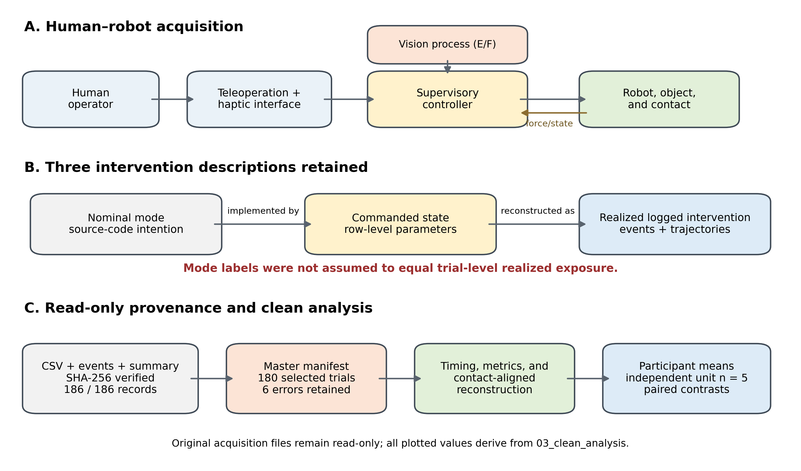
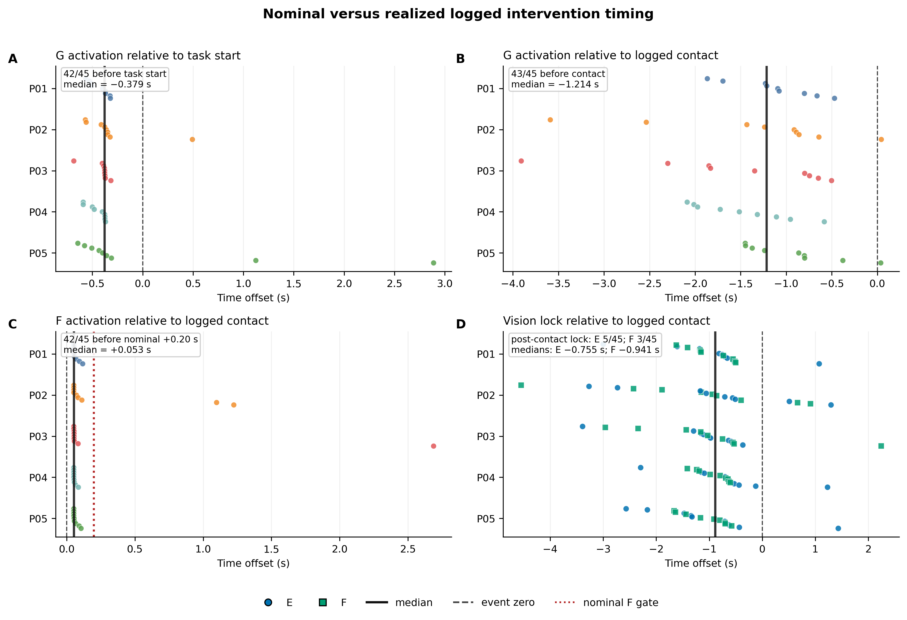
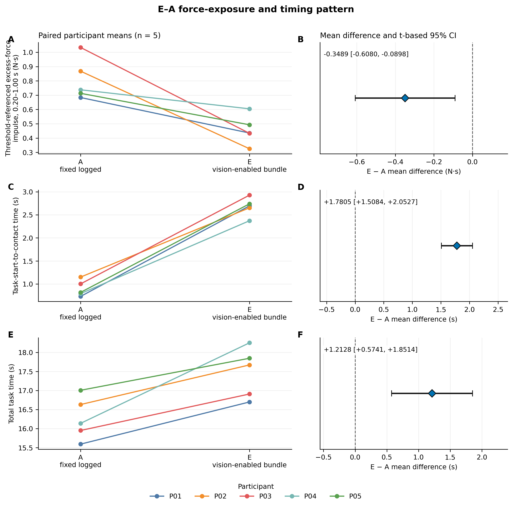
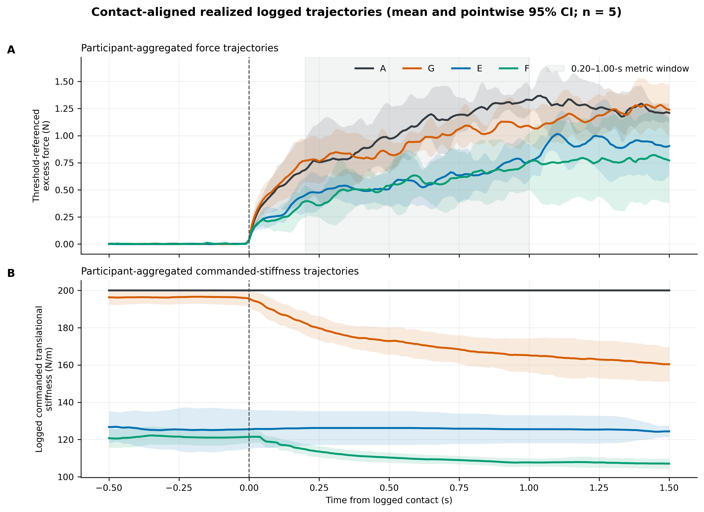
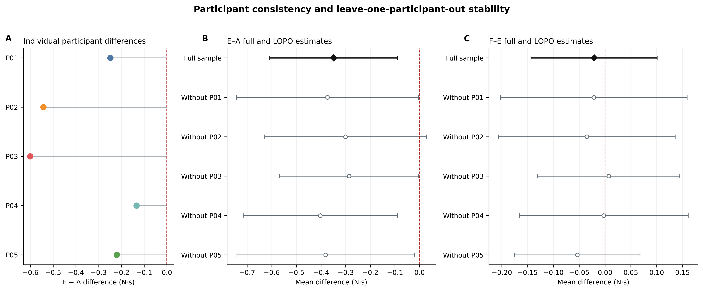
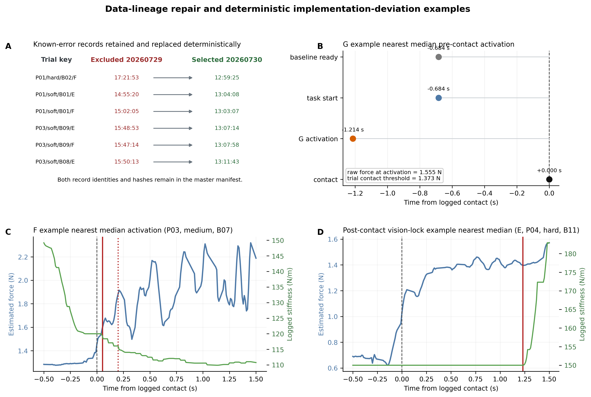

# Nominal Controller Modes Versus Realized Logged Interventions in Human-in-the-Loop Contact Teleoperation: A Retrospective Log-Audited Analysis

*Working title — manuscript version 1*

**Authors and affiliations:** [TO BE INSERTED]

> **Internal submission-status note.** This first integrated manuscript uses only the frozen clean-analysis materials. Items marked `[NEEDS VERIFICATION]`, especially ethics approval and informed consent, must be verified from contemporaneous records or removed before submission. The three embedded figures are the currently available clean-analysis figures; the complete final journal figure/table package remains to be finalized without changing the reported results.

## Abstract

Human-in-the-loop contact teleoperation combines haptic feedback, variable-impedance, and vision-informed control, but nominal labels may not characterize the intervention realized when perception, contact detection, and adaptation are asynchronous. We retrospectively audited 180 clean trials from five participants across archived configurations A/G/E/F. Nominal, commanded, and realized logged interventions were reconstructed from code, event timestamps, parameter trajectories, activation states, and provenance; participant was the independent human experimental unit. G first activated before task start in 42/45 trials and before contact in 43/45. F first activated a median 0.053 s after contact rather than reliably enforcing its nominal 0.20-s gate, precluding a clean realized vision × force factorial interpretation. Under the realized bundled configurations, E was associated with lower early threshold-referenced excess-force impulse than A (difference, −0.3489 N·s; 95% CI, −0.6080 to −0.0898), with all five participant differences negative. Exact small-sample and multiplicity-adjusted analyses did not support strong confirmatory inference. This estimate was accompanied by longer task-start-to-contact (+1.7805 s) and total task times (+1.2128 s), forming an observed safety–efficiency trade-off pattern. No stable incremental F-over-E difference was evident, while G-A was small and uncertain. These findings highlight the value of reconstructing realized logged interventions before attributing performance differences to nominal controller mechanisms.

# 1. Introduction

Human-in-the-loop teleoperation extends human perception and decision-making to robotic tasks that are remote, hazardous, inaccessible, or insufficiently structured for full autonomy. When the remote robot must establish and maintain physical contact, performance is determined by a coupled system comprising the operator, the master interface, the robot, the controller, and the environment, rather than by the robot controller in isolation (Hannaford, 1989; Hokayem and Spong, 2006). This coupling makes contact teleoperation a multi-objective problem. The system must limit undesirable contact loading while remaining responsive, transparent, and efficient enough for the operator to complete the task. Haptic feedback can improve awareness of remote interaction, but its benefit depends on the task and on the temporal relationship among visual, haptic, and robot responses (Lawrence, 1993; Huang et al., 2019; Louca et al., 2024). Human operators can also adapt their actions to system dynamics and delay, so changes in task time, motion strategy, or contact behavior may accompany changes in controller configuration (Rakita et al., 2020). Evaluation of such systems therefore requires both physical-interaction outcomes and measures that characterize the operator-mediated task sequence.

Impedance control provides a principled means of shaping the dynamic relationship between motion and force during robot–environment interaction (Hogan, 1985). Variable-impedance approaches extend this idea by changing stiffness, damping, or related parameters according to the task state, sensed interaction, learned policy, or human command (Buchli et al., 2011; Abu-Dakka et al., 2018; Abu-Dakka and Saveriano, 2020). In teleoperation, user-controlled variable impedance and teleimpedance have allowed operators to transmit not only motion but also anticipatory stiffness information, while adaptive and shared-control schemes have used sensed force or learned task structure to regulate contact behavior (Walker et al., 2010; Ajoudani et al., 2012; Michel et al., 2021; Peternel and Ajoudani, 2023; Michel et al., 2023). Vision offers a complementary route because object or environmental information can be obtained before physical contact. In particular, prior semi-autonomous teleimpedance systems have used visual estimates of material, geometry, and object–environment relations to select or shape robot impedance before interaction, sometimes with voice, gaze, or other human supervisory inputs (Huang et al., 2021; Siegemund et al., 2024; Jekel et al., 2026). Consequently, the general concept of mapping visual object information to an impedance setting is already established. The scientific question for experiments that compare such systems is not only which controller is nominally specified, but also which combination of parameters and transitions was actually presented during each human-operated trial.

That distinction becomes important when a teleoperation architecture combines processes that evolve on different timelines. Human commands, image acquisition and inference, semantic locking, contact detection, force-dependent adaptation, and low-level parameter updates need not occur at the same instant or at fixed offsets. Perception latency is an explicit control consideration in asynchronous robotic systems, and visual–haptic temporal offsets on the order of tens of milliseconds can be perceptible to human users (Vogels, 2004; Aldana-López et al., 2023). Teleoperation studies likewise show that different forms of delay can alter both performance and the strategies by which operators compensate for the system (Rakita et al., 2020; Louca et al., 2024). A controller may therefore be designed to change after perception or contact without realizing that transition at the intended stage in every trial. Source-code definitions and mode labels describe the nominal intervention, whereas time-varying command fields describe what the software requested during execution. These descriptions are also distinct from an independent physical measurement of the resulting closed-loop impedance. Without preserving these levels, a comparison attributed to a nominal mechanism may instead compare bundled configurations whose component parameters and activation times varied across trials.

Robotics and human–robot interaction research has increasingly emphasized replicable experiments, explicit reporting, and the preservation of technical artifacts (Bonsignorio and del Pobil, 2015; Bonsignorio, 2017; Gunes et al., 2022; Bagchi et al., 2023). Work on interactive HRI has also shown the value of measuring realized robot-response timing rather than relying only on protocol descriptions (Marchesi et al., 2024). However, the relevant concerns are usually treated in separate literatures: teleoperation research analyzes delay, stability, transparency, and operator adaptation; variable-impedance research develops parameter-regulation policies; vision-informed teleimpedance research evaluates perception-driven stiffness selection; and reproducibility work addresses reporting and experimental artifacts. In the contact-teleoperation literature reviewed for this study, relatively less explicit attention is given to jointly reconstructing, for every acquired trial, when perception locked, when contact was detected, when adaptation became active, which parameter trajectory was commanded, and which timestamped acquisition generated each derived metric. This is not a claim that prior studies fail to log their systems, nor that no prior work has examined timing. Rather, it identifies a narrower interpretive problem: when nominal modes depend on asynchronous events, mode labels alone may be insufficient evidence of the intervention realized in a particular trial. An acquisition-level timing and provenance audit can therefore be necessary before controller comparisons are assigned to their intended mechanisms.

This study addresses that problem through a retrospective reconstruction of realized logged interventions in an existing four-configuration human-in-the-loop contact-teleoperation dataset. The reconstruction links acquisition code, event timing, time-varying commanded parameters, activation fields, and record provenance while explicitly separating the nominal configuration, the commanded configuration, and the realized logged intervention. It asks three questions: (1) did the nominal controller modes correspond to their realized logged timing; (2) how did the realized bundled configurations differ in early threshold-referenced force exposure; and (3) were differences in force exposure accompanied by differences in task timing? The contribution is methodological and interpretive rather than the proposal of a new vision–force controller. First, the study provides a log-based reconstruction of nominal, commanded, and realized logged interventions for a repeated-measures contact-teleoperation experiment. Second, it provides a participant-level reanalysis of the realized configurations, including a directionally consistent association between the vision-enabled bundled configuration and lower early threshold-referenced force exposure relative to the fixed configuration, together with longer pre-contact and overall task timing. Third, it demonstrates within this dataset how intervention timing, acquisition provenance, and selection of the independent experimental unit constrain the interpretation of bundled controller comparisons. The resulting analysis does not isolate vision, stiffness, or force adaptation as a causal factor; instead, it establishes what can and cannot be inferred after the interventions actually recorded in the experiment have been reconstructed.

# 2. Related Work

## 2.1 Haptic and variable-impedance teleoperation

Classical bilateral teleoperation treats the human operator, master device, remote manipulator, and environment as a coupled dynamic system. Two-port formulations made this coupling explicit, while subsequent work formalized the competing objectives of stability and transparency and studied the effects of delay and information loss (Hannaford, 1989; Lawrence, 1993; Hokayem and Spong, 2006). Later surveys broadened the controller perspective to include information about the environment, operator, and task, recognizing that performance can depend on how online information is incorporated into the teleoperation loop (Passenberg et al., 2010). Human-subject experiments have accordingly evaluated not only robot-side error but also task completion, contact, collisions, workload, trust, and operator strategy. For example, visual and haptic guidance can change collision avoidance and other task metrics, while communication or actuation delay can change both performance and the way operators compensate for the system (Huang et al., 2019; Rakita et al., 2020; Louca et al., 2024). Naturalistic vibrotactile feedback has likewise been evaluated as a means of improving contact awareness during telerobotic assembly (Gong et al., 2024). Together, this literature motivates evaluating contact outcomes and operator-mediated timing as parts of the same experimental system.

Impedance control provides a dynamic relation between motion and interaction force and is a foundational approach for physical robot–environment interaction (Hogan, 1985). Variable impedance control changes this relation over time or task state and has been developed through analytic, demonstration-based, and reinforcement-learning approaches (Buchli et al., 2011; Abu-Dakka et al., 2018; Abu-Dakka and Saveriano, 2020). In teleoperation, Walker et al. (2010) added an intuitive grip-force channel for anticipatory impedance modulation, and Ajoudani et al. (2012) introduced teleimpedance using human motion and muscle-derived stiffness estimates. Human-in-the-loop stiffness modulation has also been applied to teaching assembly behavior (Peternel et al., 2018). More recent contact-task systems have used force-informed variable stiffness with passivity constraints or learned motion, force, and stiffness profiles for shared control (Michel et al., 2021; Michel et al., 2023). The teleimpedance survey by Peternel and Ajoudani (2023) shows that interfaces, feedback pathways, and impedance-command mechanisms are already diverse. These studies establish variable impedance as a substantive controller and interface research area; they do not make the mere use of a variable-stiffness preset a contribution by itself.

Most of these works define experimental conditions through a controller architecture, command interface, or learned policy and evaluate performance under the corresponding conditions. Several also report force and stiffness trajectories. Such reporting can demonstrate how a proposed controller behaved in the experiment, but it is not identical to a retrospective fidelity audit whose purpose is to determine whether legacy mode labels, event gates, and record joins support the originally intended comparison. The present study therefore uses this literature to define the controller context, not to claim a new variable-impedance law.

## 2.2 Vision-informed contact and impedance adaptation

Visual information can support physical interaction before a force signal is available. In telemanipulation, camera-based scene representations and virtual fixtures have been used to improve environmental awareness and guide operator motion (Huang et al., 2019). More directly relevant to the present dataset, Huang et al. (2021) proposed a semi-autonomous teleimpedance method in which vision classified object properties and selected an impedance before contact; a voice interface allowed confirmation, correction, or direct human override. Siegemund et al. (2024) extended this direction by estimating object geometry, material, and the object's relation to its environment from RGB-D observations and using those properties to determine stiffness during teleoperated bolt and polishing tasks. Jekel et al. (2026) further combined gaze, speech, and a vision-language model to generate three-dimensional stiffness commands for physical interaction.

These papers are close prior art for any claim involving vision, object or material interpretation, and impedance selection. They show that the chain “visual observation → object/material property → impedance command” predates the present analysis and has been implemented in semi-autonomous teleoperation. Accordingly, the vision-enabled configurations in the archived experiment are treated here as bundled applications of an established design direction, not as a novel controller principle. The distinguishing question is whether the intended visual lock and associated parameter transition occurred before contact in each acquired trial and which complete parameter bundle was then commanded. The present work also avoids treating a visually selected translational-stiffness value as the only intervention because the archived presets jointly altered translational and rotational stiffness, damping, haptic-feedback parameters, and gripper force.

## 2.3 Timing, logging, and realized-intervention fidelity

Timing is an established concern in teleoperation, but it appears in several distinct forms. Visual–haptic psychophysics has shown that users can detect relatively small intermodal offsets (Vogels, 2004). Teleoperation studies have manipulated communication latency or robot-response delay and demonstrated changes in task performance and human adaptation (Rakita et al., 2020; Louca et al., 2024). Control work has also modeled perception latency as the interval between data acquisition and the availability of a perception output for action, emphasizing a latency–precision trade-off in perception scheduling (Aldana-López et al., 2023). These studies demonstrate that timing can matter; they do not, by themselves, establish when every perception, contact, and adaptation event occurred in a particular legacy dataset.

A complementary literature addresses experimental reproducibility. Robotics commentaries have called for replicable, measurable experiments and reproducible research artifacts (Bonsignorio and del Pobil, 2015; Bonsignorio, 2017). Reviews and reporting proposals in HRI emphasize detailed technical documentation, transparent human-study reporting, and preservation of materials needed to repeat or scrutinize an experiment (Gunes et al., 2022; Bagchi et al., 2023). Marchesi et al. (2024) provide a particularly relevant methodological example by measuring events of interest and realized robot-response times in cross-laboratory interactive HRI experiments. This work supports explicit timing verification, although its application is social cognition rather than force-controlled contact teleoperation.

The literature reviewed here therefore supports a narrow gap rather than a universal absence claim. Delay, asynchronous perception, impedance adaptation, human behavior, and reproducibility have each been studied. Relatively less explicit attention is given to their joint role in interpreting a repeated-measures contact-teleoperation dataset when nominal controller gates and the recorded activation trajectory diverge, or when initial and replacement acquisitions create a risk of cross-record joins. The present study addresses this acquisition-level interpretive problem by separating three descriptions: the *nominal configuration* defined by the intended code path, the *commanded configuration* represented by time-varying logged parameters, and the *realized logged intervention* reconstructed from those parameters together with trial events and exact record identity. This terminology does not claim an independent measurement of physical impedance. It provides the evidential boundary required to interpret the archived configuration contrasts without attributing them to mechanisms that were not cleanly realized.

# 3. Methods

## 3.1 Teleoperation system and data acquisition

**Robotic and haptic system.** The experimental platform comprised a Franka Emika Panda robot controlled through the `panda_py`/`libfranka` interface, a Franka Hand gripper, and a Force Dimension Omega.7 haptic device used as the master interface. Incremental translational motion of the Omega.7 was scaled by a factor of 3 and sign-mapped to the Cartesian position target of the Panda; the robot end-effector orientation was held at its initialized value during each trial. Cartesian impedance commands specified translational stiffness, rotational stiffness, and damping ratio. Gripper commands were updated at a nominal rate of 30 Hz, with a commanded speed of 0.05 m/s in all analyzed configurations. The control computer, operating-system version, processor, graphics hardware, and exact library versions were not preserved in the experimental metadata `[NEEDS VERIFICATION]`.

**Force estimation and haptic feedback.** The force signal used for feedback, event detection, and outcome calculation was obtained from the Panda state variable `O_F_ext_hat_K`, i.e., the robot's internal estimate of the external Cartesian wrench, rather than from a separately logged external force/torque sensor. Each wrench component was exponentially filtered according to \(\hat{w}_k=0.3w_k+0.7\hat{w}_{k-1}\). Analyses used the magnitude of the filtered translational components, \(F_k=\sqrt{F_{x,k}^2+F_{y,k}^2+F_{z,k}^2}\). Component-wise haptic force feedback to the Omega.7 applied the configuration-specific feedback gain after a configuration-specific haptic deadband. The absence of an independently acquired external force/torque channel is established for the archived acquisition path; whether any unlogged external sensor was physically mounted during data collection remains `[NEEDS VERIFICATION]`.

**Vision and control processes.** Vision-enabled configurations used an Intel RealSense D435i. The audited acquisition code enabled a 424 × 240 BGR color stream at a nominal 15 frames/s; depth acquisition was not enabled. A `yolo11n.pt` model was executed in a separate process with a confidence threshold of 0.25. The detected class was mapped through the archived physics-mapping module to one of four semantic profiles: soft, medium, hard, or unknown. The first valid mapped detection locked the profile for the remainder of the trial. The supervisory loop requested a nominal frequency of 200 Hz and logged one time-series row per loop iteration. Because the measured `control_dt` was irregular, all time-domain analyses used recorded timestamps rather than assuming a constant 200-Hz sampling rate.

**Recorded channels.** Each archived acquisition produced a raw CSV time series, an event JSON file, and a summary JSON file. The CSV included monotonic relative time, experimental phase and event state, master-device position and gripper input, commanded and measured robot position, filtered force and torque components, force magnitude, commanded impedance and feedback parameters, gripper commands and measured state, vision outputs and lock state, adaptation flags and targets, baseline statistics, contact threshold, and realized control-cycle duration. The event JSON recorded system, task, baseline, contact, grasp, release, completion, and incomplete-trial events when available.

## 3.2 Participants, task, and repeated-measures structure

**Participants.** Five participants, labeled P01–P05 in the clean data, completed the archived experiment. Participant age, sex or gender, handedness, prior teleoperation experience, recruitment procedure, compensation, and training protocol were not recoverable from the supplied data lineage `[NEEDS VERIFICATION]`. The approving ethics body, approval identifier, and informed-consent procedure also require verification from the original study records `[NEEDS VERIFICATION]`. The participant, rather than the trial or participant-by-material block, was treated as the independent human experimental unit.

**Task and event sequence.** The logged protocol represented a teleoperated manipulation sequence comprising approach, threshold-defined initial contact, grasp, transport, release, and task completion. Baseline acquisition occurred during a preparation phase. `task_start` was issued automatically after the force baseline was ready and no controller transition was active; it therefore denoted system readiness rather than the first detected human movement. Contact, grasp, release, and completion were subsequently reconstructed from the event log. The task ended after release, a return to the IDLE gripper state, a measured or last-commanded gripper width of at least 0.075 m, and a 0.50-s settling period. The precise object geometry, start and destination locations, placement tolerances, participant instructions, practice procedure, and rest schedule were not encoded in the archived lineage `[NEEDS VERIFICATION]`.

**Experimental structure.** The clean dataset contained 180 analyzed trials in a within-participant repeated-measures structure: 5 participants × 3 material categories (soft, medium, and hard) × 3 repeated blocks × 4 recorded configurations (A, G, E, and F). Thus, each participant contributed 36 trials, including nine trials per configuration, and each configuration contained 45 trials in total. A matched block was defined by participant, material category, and repeated-block index and contained one trial from each configuration, yielding 45 matched blocks. The clean manifest preserved material category but not a unique object or physical-instance identifier. Consequently, material-category comparisons cannot be interpreted as controlled comparisons of documented physical specimens. Acquisition timestamps showed that configuration order varied, but no prospective randomization or counterbalancing schedule was recovered `[NEEDS VERIFICATION]`.

## 3.3 Nominal experimental configurations

**Configuration definitions.** The four configurations are denoted by their archived labels but are described as bundled supervisory configurations rather than as isolated experimental factors. Their nominal initialization and update rules are summarized in Table I. Configuration A was a fixed high-impedance baseline. Configuration G used no vision and applied force-dependent impedance adaptation. Configuration E used vision to select a bundled material-specific parameter preset. Configuration F used the same vision-dependent preset mechanism as E and additionally contained a nominal force-dependent stiffness-refinement rule. These labels describe the acquisition code's intended roles; realized activation times and logged parameter trajectories were audited separately as described in Section 3.4.

**Table I. Nominal definitions of the four archived configurations.**

| Configuration | Before vision lock or adaptation | Vision-dependent preset | Nominal force-dependent rule | Other common settings |
|---|---|---|---|---|
| A | \(K_t=200\) N/m; \(K_r=13\) N·m/rad; \(\zeta=1.2\); haptic gain \(K_{fb}=0.5\); haptic deadband = 0.3 N | None | None | Scale = 3; gripper speed = 0.05 m/s; gripper force = 20 N |
| G | Base \(K_t=200\) N/m; \(K_r/K_t=0.065\); \(\zeta=1.2\); \(K_{fb}=0.5\); haptic deadband = 0.3 N | None | Raw-force adaptation with 1-N adaptation deadband, 5-N saturation, reduction coefficient 0.5, smoothing factor 0.3, and nominal 0.05-s update interval; no contact gate | Scale = 3; gripper speed = 0.05 m/s; gripper force = 20 N |
| E | Standard preset before lock: \(K_t=150\) N/m; \(K_r=10\) N·m/rad; \(\zeta=1.0\); \(K_{fb}=0.5\); haptic deadband = 0.3 N; gripper force = 20 N | Soft: 50, 5, 0.8, 0.2, 0.3, 8; medium: 120, 8, 1.0, 0.5, 0.4, 15; hard: 200, 13, 1.2, 0.7, 0.5, 20 | None | Preset tuple order: \(K_t\), \(K_r\), \(\zeta\), \(K_{fb}\), haptic deadband, gripper force; scale = 3; speed = 0.05 m/s |
| F | Same standard preset as E before lock | Same soft, medium, hard, and unknown-fallback mapping as E | Class-specific raw-force stiffness refinement, nominally permitted 0.20 s after contact and updated at nominal 0.05-s intervals | Scale = 3; gripper speed = 0.05 m/s; vision preset also set damping, haptic, and gripper parameters |

**Vision-dependent preset transition.** In E and F, the controller began with the standard preset and, after the first valid semantic lock, transitioned over 30 nominal 0.01-s steps (approximately 0.30 s) to the selected profile. The soft, medium, and hard tuples in Table I jointly changed translational stiffness, rotational stiffness, damping ratio, haptic feedback gain, haptic deadband, and commanded gripper force. The unknown label used the medium preset as the fallback for the vision-selected parameters. E and F therefore cannot be interpreted as interventions on translational stiffness alone.

**G adaptation rule.** For G, the raw filtered force magnitude—not a threshold-referenced signal—was converted to the normalized adaptation ratio

\[
r_G(F)=\operatorname{clip}\left(\frac{F-1}{5-1},0,1\right),
\]

and the target translational stiffness was

\[
K_{t,G}^{*}=200\,[1-0.5r_G(F)].
\]

The commanded translational stiffness moved 0.3 of the remaining distance toward this target at each nominal 0.05-s update, and rotational stiffness was maintained at \(0.065K_{t,G}\). The update function did not require baseline completion or logged contact. Consequently, the archived label “force-only” denotes the code path and must not be read as evidence that adaptation occurred only after contact.

**F refinement rule.** For F, force refinement was evaluated only after a vision profile had locked, its transition had completed, and a contact event existed. Within semantic class \(c\), raw filtered force was converted to

\[
r_F(F,c)=\operatorname{clip}\left(\frac{F-F_{db,c}}{F_{sat,c}-F_{db,c}},0,1\right),
\]

with stiffness target

\[
K_{t,F}^{*}=\operatorname{clip}\{K_{t,vision,c}[1+g_c r_F(F,c)],K_{min,c},K_{max,c}\}.
\]

The parameter sets \((g_c,F_{db,c},F_{sat,c},s_c,K_{min,c},K_{max,c})\) were soft: (−0.25, 0.3 N, 2.5 N, 0.40, 30 N/m, 90 N/m); medium: (−0.35, 0.8 N, 6.0 N, 0.25, 85 N/m, 130 N/m); hard: (−0.15, 1.2 N, 8.0 N, 0.20, 140 N/m, 170 N/m); and unknown: (−0.10, 1.0 N, 8.0 N, 0.25, 60 N/m, 135 N/m). Here, \(s_c\) was the smoothing factor applied to translational and proportionally scaled rotational stiffness. Although the source code specified a 0.20-s post-contact gate, the realized timing did not implement that delay reliably because two clock domains were mixed (Section 3.4). F is therefore analyzed as an audited realized logged configuration, not as a correctly gated 0.20-s post-contact intervention.

## 3.4 Realized-intervention and timing reconstruction

**Nominal, commanded, and realized intervention.** Three levels of intervention description were retained. The *nominal configuration* was the intended mode definition in the acquisition source code. The *commanded configuration* was represented by the parameter and activation fields written on each control-loop row. The *realized logged intervention* was reconstructed from those time-varying fields and event timestamps for each selected raw record. Analyses and wording concerning intervention timing were based on the realized logged intervention, not solely on mode names or source-code comments. This reconstruction does not constitute an independent measurement of the robot's physical closed-loop impedance; it establishes what the archived software commanded and logged.

**Figure 1.** System and data-lineage framework used for realized-intervention reconstruction. The diagram distinguishes source-code intention, row-level commanded states, logged events and trajectories, manifest-based record selection, clean reconstruction, and participant-level aggregation. Counts are read from the clean master manifest and lineage audit (186 archived and verified record triplets; 180 selected trials; five independent participants). The diagram documents the audit workflow and is not presented as a novel controller architecture.

**A configuration implementation.** The archived A trials were stored under the internal mode name `default`, and the run initialization applied the `experiment_fixed_a` parameter set. Unlike the explicitly locked experimental mode names, `default` was not protected by the code's keyboard-parameter lock. However, the recorded A parameter channels at task start, contact, and across the contact-aligned stiffness trajectories showed the nominal A values without observed stiffness changes. A is therefore described as a realized fixed logged configuration while retaining the distinction between logged constancy and software-enforced locking.

**Trial identity and joins.** Every analyzed time series was selected through the master trial manifest. The exact record identifier combined the logical trial key with its acquisition timestamp. CSV, event JSON, and summary JSON paths and SHA-256 hashes were checked as a triplet. Tables were not joined by logical trial key alone when both an initial record and a replacement record existed. This rule ensured that scalar metrics, event timing, thresholds, and raw trajectories for an analyzed trial originated from the same archived acquisition.

**Time bases.** The protocol initialized a monotonic origin using `time.perf_counter()`. Event times and the CSV `system_time` field were stored as seconds relative to this origin and formed the analysis time base. A Unix wall-clock value from `time.time()` was retained as acquisition metadata and was also used by parts of the runtime scheduler. No ROS timestamp was present in the supplied raw schema. Clean durations were calculated only from events reconstructed on the monotonic relative timeline.

**Timing deviations in G and F.** The G updater used raw filtered force and did not inspect baseline readiness or contact status; its activation was therefore reconstructed as the first row with `force_adapt_active>0`. For F, the main loop supplied a `time.time()` value to a delay check that converted its argument by subtracting the `time.perf_counter()` origin. This wall-clock/monotonic-clock mismatch could satisfy the nominal 0.20-s gate immediately after a contact event existed. F activation was therefore reconstructed as the first row with `fusion_active>0`, without assuming correct enforcement of the nominal delay. Counts and distributions of realized activation timing are reported in Results.

**Realized parameters and cycle timing.** Translational and rotational stiffness, damping ratio, haptic feedback gain, haptic deadband, motion scale, gripper speed and force, vision status, adaptation status, and update targets were extracted from the selected raw CSV at task start, contact, and throughout each trial. Per-loop `control_dt` was summarized by its median, upper quantiles, maximum, and long-cycle fractions. Interpolation of contact-aligned trajectories used logged time and did not replace these realized intervals with the nominal controller period.

## 3.5 Event detection and outcome definitions

**Baseline and contact detection.** During PREP, force baseline acquisition continued for at least 1.0 s and at least 50 samples. For trial \(i\), the software computed the mean \(\mu_{0,i}\) and population standard deviation \(\sigma_{0,i}\) of force magnitude and set the contact threshold to

\[
T_i=\max(1.0\ \mathrm{N},\mu_{0,i}+3\sigma_{0,i}).
\]

A contact candidate began when force magnitude exceeded \(T_i\). Contact was confirmed only if the threshold remained exceeded for 0.050 s, and the recorded contact onset was assigned to the first threshold-crossing time of that confirmed interval. All 180 selected trials contained a finite logged threshold; the analysis script's fallback threshold reconstruction was therefore not used for the clean dataset.

**Main safety-related outcome.** The main retrospectively defined safety-related outcome was the threshold-referenced excess-force impulse from 0.20 to 1.00 s after contact. For trial \(i\), threshold-referenced excess force was

\[
F_{excess,i}(t)=\max[F_i(t)-T_i,0],
\]

and the outcome was computed by trapezoidal integration,

\[
I_{excess,i}^{0.2:1.0}=\int_{0.20}^{1.00}F_{excess,i}(t_c+\tau)\,d\tau,
\]

reported in N·s. The 0.20–1.00-s window was applied consistently by the clean-analysis script but was not prospectively preregistered; it is therefore described as a retrospective analysis choice rather than a confirmatory primary endpoint.

**Secondary scalar outcomes.** Initial peak force was the maximum uncorrected force magnitude from contact through 0.20 s after contact. Task-start-to-contact time was `contact − task_start`, and total task time was `task_end − task_start`. Because `task_start` represented system readiness rather than first human movement, task-start-to-contact time was interpreted as a pre-contact interval and not as a direct measurement of robot approach duration or operator movement speed. A trial-level software-log success flag required a completed event, a grasp-success flag, and a successful task-end flag. This variable represents completion according to the archived control and event logic, not an independently adjudicated clinical or physical success criterion.

**Contact-aligned trajectories and activation times.** Force and commanded translational stiffness were aligned to contact. Stiffness was interpolated on a common grid from −0.50 to +1.50 s in 0.01-s increments. Trial-level vision timing was reconstructed from the `vision_lock` event and the first row with `vision_locked>0`. G force-adaptation timing was the first row with `force_adapt_active>0`, and F force-refinement timing was the first row with `fusion_active>0`. Where relevant, event times were expressed relative to both `task_start` and contact.

## 3.6 Data provenance and cleaning

**Archived and selected records.** The archive contained 186 acquisition records representing 180 logical trial keys. Of these, 174 were unique main records. Six logical trials had an initial record dated 20260729 and a corresponding replacement record dated 20260730. The six 20260729 records were retained read-only in the archive and classified as known-error records; the six 20260730 records were selected as the main valid replacements. The replacement decision was supplied as part of the data audit, but the contemporaneous technical failure documentation for the affected acquisitions was not found `[NEEDS VERIFICATION]`.

**Lineage checks.** All 186 archived records had a corresponding CSV/events/summary triplet, and the files selected in the master manifest were hash-checked. The clean analysis selected one record for each of the 180 logical trial keys. It then generated the master manifest, lineage audit, trial-level metrics, participant-level metrics, timing audit, statistical summary, leave-one-participant-out summary, and contact-aligned trajectory tables. Original acquisition files and source code were treated as read-only inputs; clean outputs were written to a separate analysis directory.

**Inclusion and missingness.** The main analysis included the 180 manifest-selected records. The six superseded 20260729 records were excluded from the main analysis and retained for lineage and sensitivity purposes. No threshold fallback was required in the selected set. Apart from the manifest-based record replacement, no additional trial-level exclusion or outlier deletion was applied by the clean-analysis script. Every participant-by-configuration cell contained all nine planned trials, and no values were missing for the main threshold-referenced impulse outcome, initial peak force, task-start-to-contact time, total task time, or software-log success in the trial-level table.

## 3.7 Statistical analysis

**Participant-level aggregation and contrasts.** Statistical inference treated the five participants as the independent units. For each scalar outcome, the nine selected trials within each participant and configuration were averaged to obtain participant-level configuration means. The clean retrospective reanalysis evaluated four contrasts: E-A, G-A, F-E, and F-G. Trial counts and the 45 participant-by-material-by-block matched sets were used to describe the repeated observations and data coverage, not as independent human sample sizes.

**Estimates and paired tests.** For each contrast, the raw paired mean difference across participants and a two-sided 95% confidence interval were calculated. The interval used the Student-\(t\) distribution with four degrees of freedom. A two-sided paired \(t\)-test was implemented as a one-sample test of the five participant-level paired differences against zero. Because the sample was small, two complementary small-sample sensitivity analyses were also reported: an exhaustive two-sided sign-flip test over all \(2^5\) sign assignments using the absolute mean difference as the statistic, and a two-sided exact Wilcoxon signed-rank test. The analysis did not select among these tests according to which produced the smallest p-value.

**Multiplicity and robustness.** Holm adjustment was applied across the four contrasts separately for each outcome and separately within each family of p-values. Unadjusted estimates, confidence intervals, and p-values were retained alongside adjusted inference. Leave-one-participant-out analysis repeated the paired mean and \(t\)-based confidence interval after omitting each participant in turn to assess whether a contrast was driven by a single participant. Given the five-participant sample and retrospective endpoint definition, the analyses were interpreted as exploratory rather than as a definitive confirmatory test.

**Trajectory summaries and software.** For contact-aligned trajectories, trials were first averaged within participant at each time point and configuration. The plotted group trajectory was then the mean of the five participant trajectories, with pointwise \(t\)-based 95% confidence intervals. These bands were descriptive and were not treated as simultaneous confidence bands or as a time-resolved significance test. Data reconstruction and analysis were performed in Python using the archived clean-analysis script; the exact Python and package versions used for the reported run were not captured in the supplied provenance `[NEEDS VERIFICATION]`.

# 4. Results

## 4.1 Data provenance and realized-intervention reconstruction

The reconstructed lineage contained 186 timestamped records. Of these, 174 were retained as unique main records and six 20260730 records were retained as valid replacements for six known-error 20260729 records. The six known-error records remained in the master manifest with an excluded analysis role rather than being deleted. This procedure yielded 180 unique trial keys for the clean main analysis. The CSV time series, event log, and summary file associated with every one of the 186 records were present and matched their recorded SHA-256 hashes.

The clean dataset comprised five participants and four recorded modes (A, G, E, and F), with 45 trials per mode and nine trials per participant per mode. The recorded material categories were balanced at 60 trials each for soft, medium, and hard materials. All 180 clean trials met the archived software-log success definition. Because the independent human experimental unit was the participant, the nine trials within each participant and mode were averaged before inferential comparisons; consequently, all outcome contrasts reported below were based on five paired participant means rather than on 180 trials or 45 blocks.

## 4.2 Nominal and realized logged interventions diverged

The logged activation timing showed that the nominal force-only mode G was not realized as a purely post-contact intervention. The first G activation occurred before task start in 42 of 45 trials and before logged contact in 43 of 45 trials. The median activation offsets were -0.379 s relative to task start and -1.214 s relative to contact. All 45 first activations occurred when the raw estimated external force exceeded the fixed 1-N deadband, and 42 occurred before the force baseline was declared ready.

The nominal 0.20-s post-contact gate in mode F was also not reproduced in the recorded execution. Across the 45 F trials, the median first activation was 0.053 s after logged contact, and 42 activations occurred earlier than 0.20 s. The three later activations coincided with trials in which vision locking occurred after contact. Thus, the recorded F timing did not represent a consistently executed 0.20-s post-contact condition.

Vision locking occurred after task start in all E and F trials, at median offsets of 1.741 and 1.752 s, respectively. Relative to contact, vision lock occurred at a median of 0.755 s before contact in E and 0.941 s before contact in F. However, vision locking followed contact in 5 of 45 E trials and 3 of 45 F trials. The four modes were therefore retained as labels for their realized logged bundled configurations, rather than interpreted as a strict realized 2 × 2 factorial manipulation (Figure 2).

**Figure 2.** Nominal versus realized logged intervention timing. (A) G activation relative to task start. (B) G activation relative to logged contact. (C) F activation relative to logged contact, including the nominal +0.20-s gate. (D) E/F vision lock relative to logged contact. Points denote trials, vertical black lines denote medians, black dashed lines denote the aligned event at zero, and the red dotted line denotes the nominal F gate. Trial-level points are used only for implementation auditing and are not treated as independent human samples.

## 4.3 Safety-related outcomes across realized logged configurations

The participant-level mean threshold-referenced excess-force impulse from 0.2 to 1.0 s after contact was 0.8073 N·s in A, 0.7330 N·s in G, 0.4584 N·s in E, and 0.4372 N·s in F. The corresponding participant-level mean initial peak forces from 0 to 0.2 s were 2.2309, 2.2635, 1.8169, and 1.8320 N, respectively. These mode means describe the observed realized logged configurations; the clean-reanalysis paired contrasts are reported below. Figure 3 displays the paired participant-level E-A force and timing pattern without replacing participant-level inference by trial counts.

The contact-aligned force and stiffness trajectories were aggregated by first averaging trials within each participant and then summarizing the five participant-level curves. At logged contact, the trial-level median logged translational stiffness was 200 N/m in A, 198.3 N/m in G, and 120 N/m in both E and F. The corresponding ranges were 200-200, 178.9-200, 50-200, and 50-200 N/m. By 0.2 s after contact, the median logged stiffness in F was 116.1 N/m (range, 41.1-189.2 N/m). These trajectories were used descriptively to locate the logged force-estimate and commanded-stiffness profiles and were not subjected to trial-level functional significance testing (Figure 4).

**Figure 3.** Participant-level E-A force-exposure and timing pattern. Paired participant means are shown for (A) threshold-referenced excess-force impulse from 0.20 to 1.00 s after contact, (C) task-start-to-contact time, and (E) total task time. Panels B, D, and F show the corresponding E-A mean differences and t-based 95% confidence intervals. Participant is the independent human experimental unit (n = 5); task-start-to-contact time denotes the logged pre-contact interval rather than directly measured robot approach duration.

**Figure 4.** Contact-aligned realized logged trajectories. (A) Participant-aggregated threshold-referenced excess force; the shaded vertical region marks the retrospectively defined 0.20–1.00-s impulse window. (B) Participant-aggregated logged commanded translational stiffness. Lines are means and bands are pointwise t-based 95% confidence intervals across five participant curves after averaging trials within participant. The bands are descriptive rather than simultaneous confidence bands or time-resolved significance tests. Logged stiffness is a commanded software parameter, not an independent physical impedance measurement.

## 4.4 Participant-level consistency of the E-A contrast

For the main threshold-referenced excess-force impulse, the participant-level mean E-A difference was -0.3489 N·s (95% t-based CI, -0.6080 to -0.0898; t(4) = -3.739, paired t-test p = 0.0201). The exhaustive two-sided sign-flip test and the exact Wilcoxon signed-rank sensitivity test both yielded p = 0.0625. After Holm correction across the four clean-reanalysis contrasts for this metric, the adjusted p values were 0.0633 for the paired t-test and 0.2500 for both exact sensitivity tests. Thus, the unadjusted t-based result was accompanied by directionally consistent estimates, but the exact small-sample and multiplicity-adjusted analyses did not meet the 0.05 criterion.

Each of the five participant-level E-A impulse differences was negative, ranging from -0.6006 to -0.1331 N·s. In leave-one-participant-out analyses, the mean difference remained negative in all five subsets and ranged from -0.4028 to -0.2860 N·s; one of the five leave-one-participant-out 95% intervals crossed zero (Figure 5A–B). Initial peak force showed a concordant E-A difference of -0.4140 N (95% CI, -0.7483 to -0.0798; paired t-test p = 0.0263), whereas the exact sign-flip and Wilcoxon p values were 0.0625 and the Holm-adjusted paired-t p value was 0.0789.

## 4.5 Safety-efficiency trade-off

The participant-level mean task-start-to-contact time was 0.8974 s in A and 2.6779 s in E. The E-A difference was 1.7805 s (95% CI, 1.5084 to 2.0527; t(4) = 18.165, paired t-test p = 5.40 × 10^-5). All five participant-level differences were positive. The exact sign-flip and Wilcoxon tests both yielded p = 0.0625; after Holm correction, the paired-t p value was 0.000162 and both exact-test p values were 0.2500. Because task start marked system readiness rather than first human movement, this difference describes the logged pre-contact interval and does not directly establish a difference in robot approach duration or operator movement speed.

The participant-level mean total task time was 16.2631 s in A and 17.4758 s in E, corresponding to an E-A difference of 1.2128 s (95% CI, 0.5741 to 1.8514; t(4) = 5.272, paired t-test p = 0.00620). Again, all five participant-level differences were positive. The exact sign-flip and Wilcoxon p values were 0.0625; the Holm-adjusted paired-t p value was 0.0186, whereas both adjusted exact-test p values were 0.2500. Together with the lower E-A force-impulse estimate, these longer time estimates constituted the observed safety-efficiency trade-off pattern.

## 4.6 Limited incremental evidence for G and F configurations

Under the realized logged G implementation, the participant-level G-A difference in threshold-referenced excess-force impulse was -0.0742 N·s (95% CI, -0.1978 to 0.0494; t(4) = -1.667, paired t-test p = 0.1708). Although the five participant differences were negative, the confidence interval included zero, and the Holm-adjusted paired-t p value was 0.3416. This comparison describes the realized logged, predominantly pre-activated G configuration rather than a pure post-contact force-feedback intervention.

The participant-level F-E difference in threshold-referenced excess-force impulse was -0.0212 N·s (95% CI, -0.1433 to 0.1010; t(4) = -0.481, paired t-test p = 0.6556). The exact sign-flip p value was 0.6875 and the Wilcoxon p value was 0.8125. The five individual differences included three negative and two positive values. Across leave-one-participant-out subsets, the mean difference ranged from -0.0537 to 0.0074 N·s and changed sign when P03 was excluded (Figure 5C). The clean data therefore showed no stable incremental F-over-E difference under the realized logged implementation.

For completeness, the participant-level F-G threshold-referenced excess-force impulse difference was -0.2958 N·s (95% CI, -0.5000 to -0.0917; t(4) = -4.023, paired t-test p = 0.0158). The exact sign-flip and Wilcoxon p values were both 0.0625, and the Holm-adjusted paired-t p value was 0.0633. Because the timing audit showed different bundled and mistimed realized logged interventions in G and F, this descriptive contrast was not treated as evidence of an isolated visual-force interaction.

**Figure 5.** Participant consistency and leave-one-participant-out (LOPO) stability for threshold-referenced excess-force impulse. (A) Individual E-A participant differences. (B) Full-sample E-A estimate and five LOPO estimates with t-based 95% confidence intervals. (C) Full-sample F-E estimate and corresponding LOPO estimates. The LOPO analysis is a stability diagnostic; its four-participant intervals are not additional independent confirmatory tests.

**Figure 6.** Data-lineage repair and deterministic implementation-deviation examples. (A) The six known-error 20260729 records and their selected 20260730 replacements; both identities remain in the master manifest. (B) The G trial nearest the class-median activation-to-contact offset, showing activation before baseline readiness, task start, and contact. (C) The F trial nearest the class-median activation-to-contact offset; the black dashed, red solid, and red dotted lines denote contact, first F activation, and the nominal +0.20-s gate, respectively. (D) The eligible post-contact E/F vision-lock trial nearest the pooled post-contact median; the red line denotes vision lock. In C and D, blue and green traces are logged estimated force and commanded translational stiffness. Representative trials were selected by a frozen nearest-to-median rule, not by visual extremity.

# 5. Discussion

## 5.1 Main findings

This retrospective, log-audited analysis identified three principal findings. First, the realized vision-enabled bundled configuration E was associated with lower threshold-referenced excess-force impulse than the fixed configuration A, and the E-A difference had the same direction in all five participants. This directional consistency should nevertheless be interpreted within the limits of the five-participant sample: the exact sign-flip and Wilcoxon tests each yielded \(p=0.0625\), and Holm-adjusted inference did not support a strong confirmatory conclusion. Second, the lower E-A force-exposure estimate was accompanied by longer task-start-to-contact and total task times, forming an observed safety-efficiency trade-off pattern rather than establishing a general trade-off mechanism. Third, the realized logged timing of G and F differed materially from their nominal definitions. The four configurations should therefore be interpreted as bundled realized logged interventions and not as a strict visual-by-force 2 × 2 factorial manipulation.

## 5.2 Lower early force exposure under the vision-enabled configuration

The logged commanded-stiffness profiles provide one physically plausible context for the E-A difference. A maintained a logged translational-stiffness command of 200 N/m, whereas E had a median logged command of 120 N/m at contact, with values varying across its material-dependent profiles. Lower commanded stiffness around contact could have limited the force developed during early interaction. The concordant E-A direction in initial peak force is compatible with the same overall pattern, but this secondary outcome and its multiplicity-adjusted evidence do not identify a mechanism. More generally, the correspondence does not establish stiffness as the isolated cause: the analysis records controller commands rather than an independent measurement of physical closed-loop impedance, and the experiment did not manipulate translational stiffness as a single factor.

E was a bundled configuration in which the vision-derived profile jointly set translational and rotational stiffness, damping ratio, haptic feedback gain, haptic deadband, and gripper force. The visual pathway determined which bundle became available, but the present comparison cannot distinguish an effect of visual information itself from effects of the selected controller, haptic, or gripper parameters. Vision locking also occurred after contact in a minority of E trials, further showing that the timing and content of the realized intervention were not uniform. The most defensible interpretation is therefore that the observed E-A difference was associated with the realized vision-enabled bundled configuration, not with an isolated visual or stiffness mechanism.

Human adaptation offers another compatible, but unverified, explanation. Participants may have altered when they initiated motion, how they paused, or how they responded to the changing haptic and robot behavior. The longer task-start-to-contact interval under E is consistent with a change in interaction timing, but the archived data did not directly measure attention, caution, intent, decision time, or the onset and speed of voluntary approach motion. Accordingly, more conservative operation is one possible explanation for the joint force and timing pattern, but it cannot be distinguished from delayed initiation, additional pauses, or controller-mediated motion differences in the present dataset.

## 5.3 Lower force exposure was accompanied by a longer pre-contact interval

The E-A comparison combined a lower estimate of early threshold-referenced force exposure with longer task-start-to-contact and total task times. Considering these outcomes jointly is important because a force reduction alone would not show whether it was accompanied by additional temporal cost. In the present dataset, the paired pattern is consistent with an observed safety-efficiency trade-off: E was associated with lower early force exposure, but completion of the pre-contact and overall task sequence took longer. This wording describes co-occurring outcomes and does not imply that one outcome caused the other.

The task-start-to-contact measure requires particular caution. Task start was logged when the force baseline and controller were ready, rather than when the participant first moved. The interval could therefore contain reaction time, initial hesitation, actual approach motion, and pauses. The longer pre-contact interval is consistent with more conservative interaction timing, although the archived data cannot distinguish slower physical approach from delayed initiation or additional pauses. It should not be interpreted as direct evidence that participants deliberately moved more slowly.

This combined pattern suggests a practical evaluation principle for human-in-the-loop teleoperation: safety-related physical-interaction metrics and temporal or operator-related metrics should be examined together. A controller configuration that changes early force exposure may also change when interaction begins, how the operator responds, or how long the task takes. The present study cannot determine which temporal component changed, but it illustrates why reporting force exposure without the accompanying task timing could provide an incomplete account of system performance.

## 5.4 Nominal control modes versus realized interventions

The G audit substantially narrows the interpretation of G-A. G was nominally the force-only configuration, but its adaptation used raw filtered force with a fixed 1-N deadband and did not require baseline readiness or logged contact. It became active before task start in 42 of 45 trials and before contact in 43 of 45 trials. G-A therefore compares A with a predominantly pre-activated, force-driven realized logged configuration; it should not be interpreted as the isolated effect of post-contact force feedback. The small G-A force-impulse estimate and its interval cannot establish whether a correctly contact-gated force policy would be beneficial, neutral, or detrimental.

The F audit imposes a corresponding boundary on F-E. Although the nominal source-code logic specified a 0.20-s post-contact delay, the audited wall-clock/monotonic-clock mismatch did not reliably enforce that gate, and the median first logged activation occurred 0.053 s after contact. Consequently, the observed F-E comparison does not estimate the effect of a correctly gated 0.20-s force-refinement policy. The small and leave-one-participant-out-unstable F-E estimate should be read as evidence about the realized logged F configuration only; it does not demonstrate that force refinement in general is ineffective.

Together, these observations illustrate the importance of separating nominal, commanded, and realized logged interventions. A mode name and its intended source-code logic describe the experimental plan, while time-varying command fields and activation events describe what the software exposed during a particular acquisition. Neither is equivalent to an independent measurement of physical impedance. For asynchronous human-in-the-loop systems, interpretation is therefore strengthened when the timing of perception, contact, parameter application, and adaptation is reconstructed for each trial rather than inferred from the controller label alone.

## 5.5 Implications for human-in-the-loop teleoperation experiments

The present audit suggests several practical reporting considerations rather than a new universal standard. Event timestamps should accompany mode labels, and logs should preserve the trajectories of commanded stiffness, adaptation state, vision lock, contact, and other parameters that define exposure to an intervention. Reporting nominal controller parameters without their application times may be insufficient when perception, human action, and controller updates proceed asynchronously.

Data identity is equally important. In this study, the raw trajectory, event JSON, summary record, threshold, and scalar metrics were required to originate from the same timestamped acquisition, and initial and replacement records were distinguished by an exact record identifier. This provenance rule prevented a scalar outcome from being combined with event timing or parameter trajectories from a different attempt. Similar analyses benefit from a manifest that retains excluded or superseded records while explicitly identifying the single record used for the main analysis.

The inferential structure should also match the experimental unit. Repeated trials can improve estimation within a participant, but they do not increase the number of independent human participants. Here, inference was therefore based on five participant-level paired means. In addition, software-log completion should be labeled as such: the absence of variation in the archived success flag does not replace independent physical or video adjudication. These distinctions help align the reported precision and outcome meaning with what was actually observed.

## 5.6 Limitations

The principal limitation is the sample of only five independent participants. The 180 clean trials provided repeated observations within those participants, not 180 independent human samples, and exact small-sample inference was correspondingly coarse. The 0.20–1.00-s threshold-referenced impulse window was also selected for the clean retrospective reanalysis and was not prospectively preregistered as a primary endpoint. The results should therefore be regarded as exploratory evidence rather than as an independently powered confirmatory test.

Causal interpretation is further constrained by configuration bundling and incomplete prospective order documentation. E and F jointly changed multiple controller, haptic, and gripper parameters, preventing attribution to any single component. The archived timestamps showed realized order, but a complete prospective randomization or counterbalancing plan was not recovered; learning, fatigue, or order effects therefore cannot be excluded. The present contrasts characterize the observed configurations under this experimental sequence rather than isolated parameter effects.

Measurement and metadata limitations also restrict generalization. Force was derived from the Franka internal estimated external wrench rather than from an independently logged external force/torque sensor. Material-category labels were retained, but unique physical-object identity, pose, and placement were incomplete, precluding a strict claim of object-level generalization. All 180 trials met the software-log success definition, but success was not independently adjudicated from video or manual review. Participant demographics, prior experience, and training details were not recoverable from the current archive; if they cannot be verified from contemporaneous records, their absence should be disclosed because it limits assessment of sample representativeness and operator-related variability.

Finally, the G and F implementation deviations limit conclusions about the nominal force-related mechanisms. G did not realize a contact-gated post-contact policy, and F did not reliably realize its intended 0.20-s delay. These deviations do not invalidate the descriptive comparisons among the realized logged configurations, but they prevent those comparisons from answering whether correctly gated force adaptation would add benefit to the vision-enabled configuration. `[NEEDS VERIFICATION before submission: ethics approval or exemption and informed-consent information must be confirmed from institutional records and reported in the appropriate Methods or declaration section; they must not be inferred in the Discussion.]`

# 6. Conclusion

This study examined whether nominal controller modes in human-in-the-loop contact teleoperation accurately represented the realized logged interventions recorded in individual trials. The participant-level reanalysis showed that the realized vision-enabled bundled configuration E was associated with lower early threshold-referenced excess-force exposure than the fixed configuration A, with the same direction observed across all five participants; given the small sample and retrospective analysis, this pattern remains exploratory rather than a confirmed safety improvement. The lower force-exposure estimate was accompanied by longer task-start-to-contact and total task times, constituting an observed safety–efficiency trade-off pattern without establishing a causal trade-off mechanism. Timing reconstruction further showed that G did not realize a purely post-contact force-only intervention and that F did not reliably enforce its nominal 0.20-s post-contact gate. Accordingly, in this dataset, a nominal mode label did not by itself establish the intervention represented by the acquired trial data. For human-in-the-loop robot experiments involving asynchronous perception, contact detection, and adaptation, controller evaluation can be strengthened by preserving and jointly verifying event timing, commanded parameter trajectories, activation states, acquisition provenance, and the independent experimental unit used for inference. Together, these findings highlight the value of reconstructing what a human–robot system actually executed before assigning observed performance differences to the intended controller mechanism.

# References

1. Hannaford, B. (1989). A design framework for teleoperators with kinesthetic feedback. *IEEE Transactions on Robotics and Automation, 5*(4), 426–434. https://doi.org/10.1109/70.88057
2. Lawrence, D. A. (1993). Stability and transparency in bilateral teleoperation. *IEEE Transactions on Robotics and Automation, 9*(5), 624–637. https://doi.org/10.1109/70.258054
3. Hokayem, P. F., & Spong, M. W. (2006). Bilateral teleoperation: An historical survey. *Automatica, 42*(12), 2035–2057. https://doi.org/10.1016/j.automatica.2006.06.027
4. Passenberg, C., Peer, A., & Buss, M. (2010). A survey of environment-, operator-, and task-adapted controllers for teleoperation systems. *Mechatronics, 20*(7), 787–801. https://doi.org/10.1016/j.mechatronics.2010.04.005
5. Huang, K., Chitrakar, D., Rydén, F., & Chizeck, H. J. (2019). Evaluation of haptic guidance virtual fixtures and 3D visualization methods in telemanipulation—A user study. *Intelligent Service Robotics, 12*, 289–301. https://doi.org/10.1007/s11370-019-00283-w
6. Rakita, D., Mutlu, B., & Gleicher, M. (2020). Effects of onset latency and robot speed delays on mimicry-control teleoperation. In *Proceedings of the 2020 ACM/IEEE International Conference on Human-Robot Interaction*. https://doi.org/10.1145/3319502.3374838
7. Louca, J., Eder, K., Vrublevskis, J., & Tzemanaki, A. (2024). Impact of haptic feedback in high latency teleoperation for space applications. *ACM Transactions on Human-Robot Interaction, 13*(2), Article 16, 1–21. https://doi.org/10.1145/3651993
8. Gong, Y., Mat Husin, H., Erol, E., Ortenzi, V., & Kuchenbecker, K. J. (2024). AiroTouch: Enhancing telerobotic assembly through naturalistic haptic feedback of tool vibrations. *Frontiers in Robotics and AI, 11*, 1355205. https://doi.org/10.3389/frobt.2024.1355205
9. Hogan, N. (1985). Impedance control: An approach to manipulation: Part I—Theory. *Journal of Dynamic Systems, Measurement, and Control, 107*(1), 1–7. https://doi.org/10.1115/1.3140702
10. Walker, D. S., Wilson, R. P., & Niemeyer, G. (2010). User-controlled variable impedance teleoperation. In *2010 IEEE International Conference on Robotics and Automation*. https://doi.org/10.1109/ROBOT.2010.5509811
11. Buchli, J., Stulp, F., Theodorou, E., & Schaal, S. (2011). Learning variable impedance control. *The International Journal of Robotics Research, 30*(7), 820–833. https://doi.org/10.1177/0278364911402527
12. Ajoudani, A., Tsagarakis, N. G., & Bicchi, A. (2012). Tele-impedance: Teleoperation with impedance regulation using a body–machine interface. *The International Journal of Robotics Research, 31*(13), 1642–1656. https://doi.org/10.1177/0278364912464668
13. Peternel, L., Petrič, T., & Babič, J. (2018). Robotic assembly solution by human-in-the-loop teaching method based on real-time stiffness modulation. *Autonomous Robots, 42*, 1–17. https://doi.org/10.1007/s10514-017-9635-z
14. Abu-Dakka, F. J., Rozo, L., & Caldwell, D. G. (2018). Force-based variable impedance learning for robotic manipulation. *Robotics and Autonomous Systems, 109*, 156–167. https://doi.org/10.1016/j.robot.2018.07.008
15. Abu-Dakka, F. J., & Saveriano, M. (2020). Variable impedance control and learning—A review. *Frontiers in Robotics and AI, 7*, 590681. https://doi.org/10.3389/frobt.2020.590681
16. Michel, Y., Rahal, R., Pacchierotti, C., Robuffo Giordano, P., & Lee, D. (2021). Bilateral teleoperation with adaptive impedance control for contact tasks. *IEEE Robotics and Automation Letters, 6*(3), 5429–5436. https://doi.org/10.1109/LRA.2021.3066974
17. Peternel, L., & Ajoudani, A. (2023). After a decade of teleimpedance: A survey. *IEEE Transactions on Human-Machine Systems, 53*(2), 401–416. https://doi.org/10.1109/THMS.2022.3231703
18. Michel, Y., Li, Z., & Lee, D. (2023). A learning-based shared control approach for contact tasks. *IEEE Robotics and Automation Letters, 8*(12), 8002–8009. https://doi.org/10.1109/LRA.2023.3322332
19. Huang, Y.-C., Abbink, D. A., & Peternel, L. (2021). A semi-autonomous tele-impedance method based on vision and voice interfaces. In *2021 20th International Conference on Advanced Robotics*, 180–186. https://doi.org/10.1109/ICAR53236.2021.9659427
20. Siegemund, G., Díaz Rosales, A., Glodde, A., Dietrich, F., & Peternel, L. (2024). Semi-autonomous teleimpedance based on visual detection of object geometry and material and its relation to environment. In *2024 IEEE-RAS 23rd International Conference on Humanoid Robots*, 779–786. https://doi.org/10.1109/Humanoids58906.2024.10769858
21. Jekel, H. H. A., Díaz Rosales, A., & Peternel, L. (2026). Visio-verbal teleimpedance interface: Enabling semi-autonomous control of physical interaction via eye tracking and speech. *Frontiers in Robotics and AI, 13*, 1749105. https://doi.org/10.3389/frobt.2026.1749105
22. Vogels, I. M. L. C. (2004). Detection of temporal delays in visual-haptic interfaces. *Human Factors, 46*(1), 118–134. https://doi.org/10.1518/hfes.46.1.118.30394
23. Bonsignorio, F., & del Pobil, A. P. (2015). Toward replicable and measurable robotics research [From the Guest Editors]. *IEEE Robotics & Automation Magazine, 22*(3), 32–35. https://doi.org/10.1109/MRA.2015.2452073
24. Bonsignorio, F. (2017). A new kind of article for reproducible research in intelligent robotics [From the Field]. *IEEE Robotics & Automation Magazine, 24*(3), 178–182. https://doi.org/10.1109/MRA.2017.2722918
25. Gunes, H., Broz, F., Crawford, C. S., Rosenthal-von der Pütten, A., Strait, M., & Riek, L. (2022). Reproducibility in human-robot interaction: Furthering the science of HRI. *Current Robotics Reports, 3*(4), 281–292. https://doi.org/10.1007/s43154-022-00094-5
26. Aldana-López, R., Aragüés, R., & Sagüés, C. (2023). Latency vs precision: Stability preserving perception scheduling. *Automatica, 155*, 111123. https://doi.org/10.1016/j.automatica.2023.111123
27. Bagchi, S., Holthaus, P., Beraldo, G., Senft, E., Hernandez, D., Han, Z., Jayaraman, S. K., Rossi, A., Esterwood, C., Andriella, A., & Pridham, P. S. (2023). Towards improved replicability of human studies in human-robot interaction. In *Companion of the 2023 ACM/IEEE International Conference on Human-Robot Interaction*. https://doi.org/10.1145/3568294.3580162
28. Marchesi, S., De Tommaso, D., Kompatsiari, K., Wu, Y., & Wykowska, A. (2024). Tools and methods to study and replicate experiments addressing human social cognition in interactive scenarios. *Behavior Research Methods, 56*(7), 7543–7560. https://doi.org/10.3758/s13428-024-02434-z
