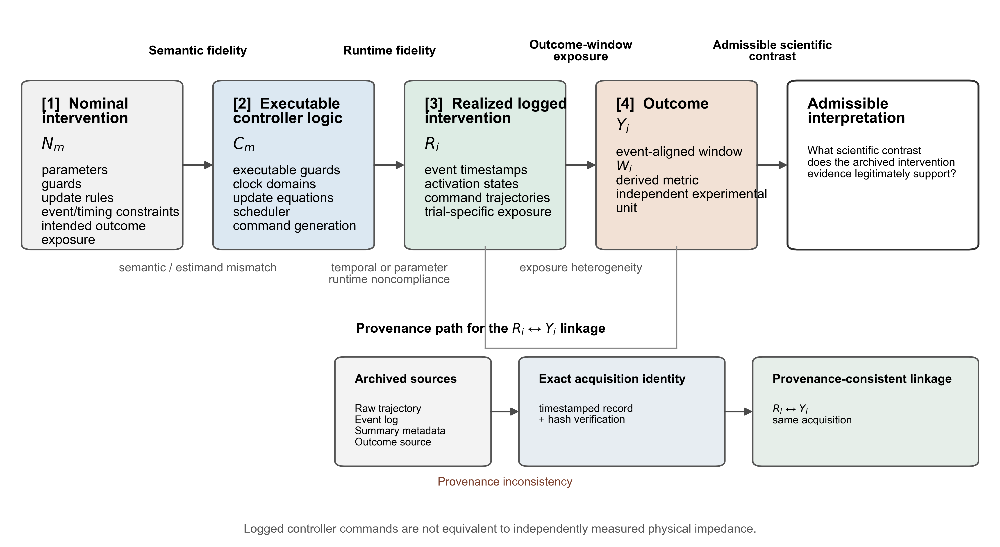
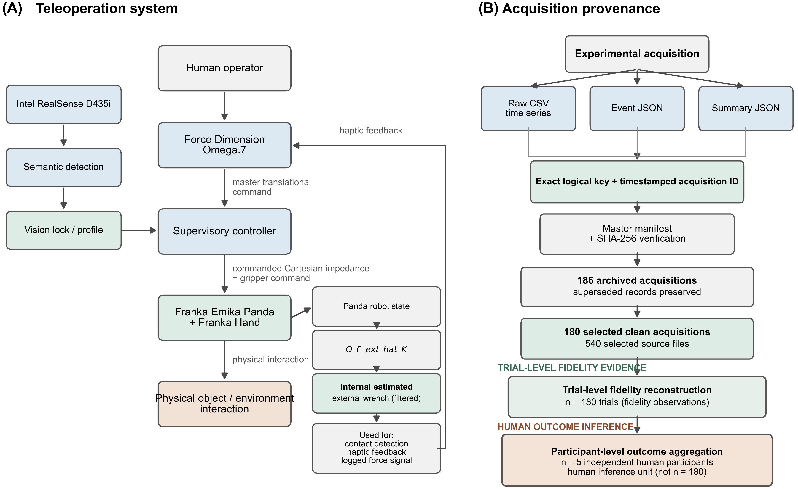
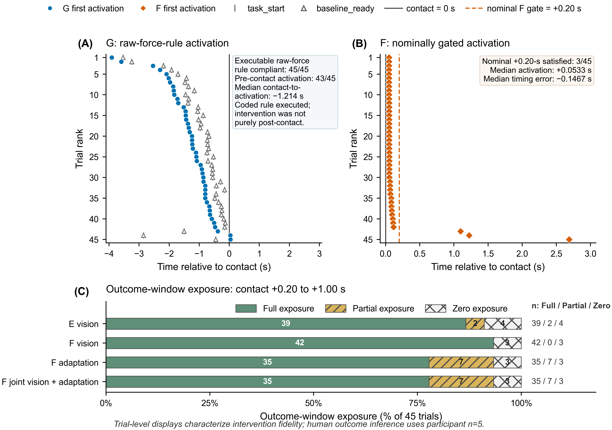
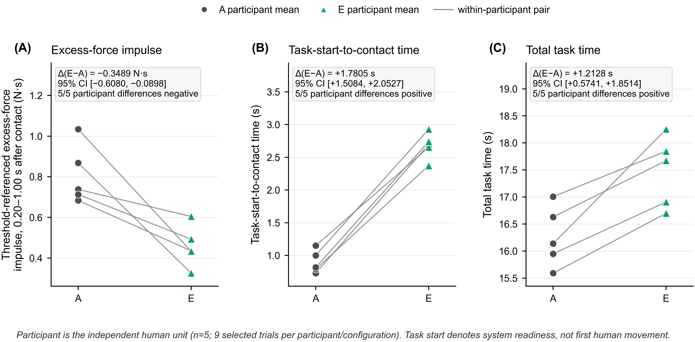
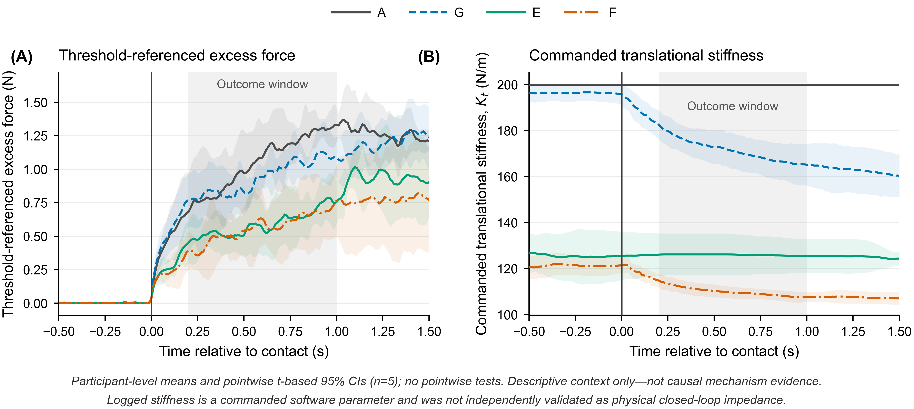

# Realized-Intervention Fidelity in Asynchronous Human-in-the-Loop Teleoperation: An Operational Framework and Retrospective Case Study

**Authors and affiliations:** [TO BE INSERTED]

## Abstract

In asynchronous human-in-the-loop teleoperation, nominal controller labels may not establish the intervention delivered during an outcome window. We operationalized a four-layer realized-intervention fidelity framework linking nominal intervention, executable controller logic, realized logged intervention, and outcome interpretation. Event timing, parameter trajectories, outcome-window exposure, clock integrity, and acquisition provenance were used to determine which controller contrasts were supported by the archived intervention evidence. The retrospective application comprised five participants and 180 repeated trials across four archived configurations (A/G/E/F); participant was the independent human experimental unit for outcome inference. A retained logged-command fidelity in 45/45 trials. G complied with executable raw-force logic in 45/45 trials but activated before contact in 43/45, indicating semantic/estimand mismatch rather than runtime failure. Only 3/45 F trials met the nominal contact-plus-0.20-s target; median activation was +0.0533 s, yielding −0.1467-s median error and temporal runtime noncompliance. E and F exhibited heterogeneous outcome-window exposure. Exact acquisition identity was verified for all 180 intervention–outcome links, including 540 selected source-file hashes. Consequently, the archived conditions did not support an isolated post-contact force effect, a correctly gated F-over-E refinement effect, or a clean realized vision × force factorial interpretation. After reconstruction, exploratory participant-level analysis showed an E-A threshold-referenced excess-force impulse difference of −0.3489 N·s (95% CI, −0.6080 to −0.0898); all five participant differences had the same direction. Exact small-sample and multiplicity-adjusted analyses did not support strong confirmatory inference. Within this case study, realized-intervention reconstruction changed what the nominal controller comparisons could legitimately be interpreted to estimate, without reversing the principal numerical outcome pattern.

**Keywords:** human-in-the-loop teleoperation; realized-intervention fidelity; controller evaluation; outcome-window exposure; acquisition provenance; admissible estimand

# 1. Introduction

Human-in-the-loop contact teleoperation extends human perception and decision-making to robotic tasks that are remote, hazardous, inaccessible, or insufficiently structured for full autonomy. Unlike a fully autonomous controller acting on a predefined state representation, a teleoperation system generates behavior through the coupled actions of the human operator, master interface, perception pipeline, supervisory controller, remote robot, and physical environment (Hannaford, 1989; Lawrence, 1993; Hokayem and Spong, 2006; Passenberg et al., 2010). Contact performance is therefore not produced by the robot controller in isolation. Haptic feedback can inform the operator about remote interaction, impedance regulation can shape the motion–force relationship, vision can provide object or environmental information before contact, and force-dependent adaptation can modify the controller after interaction begins (Hogan, 1985; Walker et al., 2010; Buchli et al., 2011; Ajoudani et al., 2012; Abu-Dakka et al., 2018; Huang et al., 2019; Michel et al., 2021; Gong et al., 2024; Peternel and Ajoudani, 2023). These components may support safer or more effective physical interaction, but they also create a system in which human action, perception, parameter selection, and contact response are mutually dependent. Evaluation must consequently consider not only the nominal control law, but also the intervention that the coupled human–robot system was exposed to during each acquired trial.

Controller experiments commonly operationalize scientific conditions through labels such as *fixed*, *adaptive*, *vision-enabled*, *force-enabled*, or *combined*. These labels provide a practical means of organizing experimental comparisons, and the underlying control literature has developed substantive methods for user-controlled impedance, teleimpedance, force-informed adaptation, human-in-the-loop teaching, shared control, and vision-informed parameter selection (Peternel et al., 2018; Abu-Dakka and Saveriano, 2020; Michel et al., 2021; Michel et al., 2023; Huang et al., 2021; Siegemund et al., 2024; Jekel et al., 2026). However, a mode label also carries implicit intervention semantics. It implies which parameters differ between conditions, which event permits activation, when the change occurs relative to perception or contact, and how long the participant and robot are exposed to the resulting configuration. Those implications are not automatically satisfied by assigning a trial to a named mode. In an asynchronous architecture, image acquisition and inference, semantic locking, human motion, contact detection, parameter transitions, force adaptation, and control-loop scheduling may occur on different timelines. A nominally pre-contact configuration may therefore become available only after contact, while a nominally post-contact mechanism may be activated earlier than intended. Even when an intervention is activated at some point in a trial, it may cover only part—or none—of the time window from which an outcome is calculated. The mode label identifies the intended experimental condition, but it does not by itself establish the intervention exposure realized in a particular acquisition.

Several established research areas address parts of this problem. Teleoperation and visual–haptic research have examined communication delay, onset latency, intermodal timing, and the ways in which operators adapt their behavior to delayed system responses (Vogels, 2004; Rakita et al., 2020; Louca et al., 2024). Perception-aware control has similarly treated latency as a property of the sensing and decision pipeline rather than as a negligible implementation detail (Aldana-López et al., 2023). Runtime-verification research has developed methods for monitoring robot commands and messages against formally specified properties, including monitoring infrastructures for ROS-based systems (Huang et al., 2014). Robotics and human–robot interaction research has also emphasized replicable experiments, transparent reporting, preserved technical artifacts, and measurement of realized robot-response timing (Bonsignorio and del Pobil, 2015; Bonsignorio, 2017; Gunes et al., 2022; Bagchi et al., 2023; Marchesi et al., 2024). In another methodological domain, implementation-fidelity research has distinguished an intervention as designed from the content, duration, and coverage actually delivered (Carroll et al., 2007). A recent protocol for vision–language–action manipulation likewise connects runtime-interface fidelity and provenance to the claims supported or withheld by rollout evidence (Han and Choi, 2026). That work concerns deployment-facing evaluation of autonomous policy rollouts, whereas the present problem concerns event-aligned intervention delivery, outcome-window exposure, acquisition identity, and the human experimental unit in asynchronous contact teleoperation. These literatures establish that delay, specification compliance, logging, reproducibility, provenance, and intervention delivery are not new concerns. The narrower unresolved problem addressed here is how to connect controller semantics, executable event guards, event-aligned command trajectories, outcome-window exposure, exact acquisition provenance, and the independent human experimental unit to determine what a controller contrast is scientifically allowed to estimate. These elements are often reported or analyzed separately; considered separately, they do not determine whether a nominal contrast and its proposed scientific estimand remain aligned in an asynchronous human-operated experiment.

We address this interpretive problem through an operational realized-intervention fidelity framework. The framework separates four linked representations: the nominal intervention \(N_m\), which specifies the intended parameters, guards, update rules, and timing constraints for mode \(m\); the executable or commanded logic \(C_m\), which represents the guards, clocks, update equations, and commands implemented by the acquisition program; the realized logged intervention \(R_i\), reconstructed for trial \(i\) from event times, activation states, parameter trajectories, and exact record identity; and the outcome \(Y_i\), calculated from the corresponding acquisition over an explicitly defined window. Fidelity is evaluated through interpretable dimensions—including event order, activation timing, parameter state, intervention exposure, clock integrity, and provenance—rather than through a composite score. The framework further distinguishes semantic or estimand mismatch, runtime noncompliance, outcome-window exposure heterogeneity, and provenance inconsistency. These categories locate discrepancies at different interfaces in the nominal-to-outcome chain and are not assumed to be mutually exclusive. Most importantly, the objective is not merely to classify trials as correct or incorrect or to discover software faults. It is to determine the *admissible estimand*: given the intervention actually recorded, what outcome contrast or scientific interpretation can the archive legitimately support? The central proposition is correspondingly bounded: realized-intervention reconstruction can change the admissible interpretation of nominal controller comparisons, without necessarily changing controller rankings or numerical outcome patterns.

We demonstrate the framework retrospectively using 180 repeated contact-teleoperation trials from five participants across four archived configurations, denoted A, G, E, and F. These configurations are used as a case-study application rather than as evidence that the framework is universally validated. Within this dataset, A provides a logged-command fidelity-pass case; G illustrates a semantic/estimand mismatch in which the logged behavior was consistent with executable raw-force logic but not with a purely post-contact interpretation; F illustrates temporal runtime noncompliance with an explicit post-contact timing target; and E and F illustrate heterogeneous intervention exposure within the early force-outcome window. Exact provenance reconstruction links each realized intervention and scalar outcome to the same timestamped acquisition. Only after these fidelity properties are established are participant-level force and task-timing outcomes interpreted as exploratory comparisons among the realized logged configurations. The contributions are threefold. First, we formalize and operationalize a four-layer realized-intervention fidelity framework linking controller specification, executable logic, logged intervention delivery, outcome-window exposure, provenance, and admissible estimands. Second, we apply the framework uniformly to all 180 trials—including fidelity-pass, semantically mismatched, temporally noncompliant, and exposure-heterogeneous cases—and show within this dataset how the resulting evidence changes which outcome contrasts the archived controller comparisons can legitimately support. Third, we provide an exploratory participant-level force and timing case study after fidelity-aware interpretation, while avoiding isolated causal attribution to vision, stiffness, or force adaptation and retaining the five participants, rather than the repeated trial count, as the independent human experimental units.

# 2. Realized-Intervention Fidelity Framework

The framework treats intervention reconstruction as a prerequisite for interpreting controller contrasts in asynchronous human-in-the-loop systems. It is intended for experiments in which human input, perception, event detection, supervisory logic, parameter transitions, and robot control can proceed on different schedules. The framework does not assign a composite fidelity score. Instead, it preserves separate, physically interpretable dimensions so that each discrepancy can be traced to the evidence that supports it (Figure 1).

**Figure 1.** Realized-intervention fidelity framework. Nominal intervention semantics are translated into executable controller logic and then reconstructed as trial-specific realized logged interventions. Outcome-window exposure and exact acquisition provenance link the realized intervention to the corresponding outcome and determine the scientific contrast that the archived evidence legitimately supports. Logged controller commands are not equivalent to independently measured physical impedance.

## 2.1 Four-layer intervention representation

For a nominal experimental mode \(m\), the *nominal intervention* is represented as

\[
N_m=(\boldsymbol{\theta}^{0}_m,\mathcal{G}_m,\mathcal{U}_m,\mathcal{Q}_m,W_m),
\]

where \(\boldsymbol{\theta}^{0}_m\) denotes the intended initial parameter state, \(\mathcal{G}_m\) the intended activation guards, \(\mathcal{U}_m\) the intended parameter-update rules, \(\mathcal{Q}_m\) the intended event-order constraints, and \(W_m\) the outcome window within which the intervention is expected to be present. This layer states the scientific meaning assigned to the condition, including what should activate, when it should activate, and which parameter state should enter the outcome calculation.

The *executable or commanded logic* is the implemented mapping

\[
C_m:\{\mathcal{H}_i(t),\boldsymbol{\kappa}_i(t)\}\mapsto\{\boldsymbol{\theta}^{cmd}_i(t),\boldsymbol{a}^{cmd}_i(t)\},
\]

where \(\mathcal{H}_i(t)\) is the observed event and sensor history for trial \(i\), \(\boldsymbol{\kappa}_i(t)\) denotes the clocks and scheduling state used by the program, \(\boldsymbol{\theta}^{cmd}_i(t)\) contains commanded parameters, and \(\boldsymbol{a}^{cmd}_i(t)\) contains commanded activation states. This layer is established from executable guards and update rules rather than from a controller label or prose description.

The *realized logged intervention* is

\[
R_i=\{\mathcal{E}_i,\boldsymbol{\theta}^{log}_i(t),\boldsymbol{a}^{log}_i(t),\mathcal{P}_i\},
\]

where \(\mathcal{E}_i\) is the set of trial events on an aligned time axis, \(\boldsymbol{\theta}^{log}_i(t)\) and \(\boldsymbol{a}^{log}_i(t)\) are the logged parameter and activation trajectories, and \(\mathcal{P}_i\) is the acquisition-provenance record linking the raw trajectory, event log, summary, and derived outcomes. Realized logged commands define the intervention exposure supported by the archive. They are not assumed to equal independently measured physical impedance or the complete physical state of the human–robot system.

Finally, an outcome is defined as

\[
Y_i=h(D_i;W_i),
\]

where \(D_i\) is the raw record identified by \(\mathcal{P}_i\), and \(W_i\) is an event-aligned analysis window. This fourth layer connects the realized intervention to the samples that contribute to the reported outcome. The four layers therefore form the chain \(N_m\rightarrow C_m\rightarrow R_i\rightarrow Y_i\), with evidence required at each transition.

## 2.2 Fidelity dimensions and quantitative metrics

Event-order compliance evaluates each required nominal ordering relation rather than collapsing the sequence into a single label. For a required relation \(e_j\prec e_k\),

\[
O_{i,q}=\mathbb{I}(t_{i,e_j}<t_{i,e_k}), \qquad O_i=\prod_{q\in\mathcal{Q}_m}O_{i,q}.
\]

The individual \(O_{i,q}\) values are retained because a failed contact-to-adaptation constraint has a different interpretation from a failed perception-to-transition constraint.

Executable-guard compliance and nominal-gate compliance are evaluated separately. Let \(g_m^C\{\mathcal{H}_i(t)\}\) be the Boolean guard actually evaluated by the executable logic at the realized first-activation time \(t^R_{act,i}\). Executable-guard compliance is

\[
G^C_i=\mathbb{I}\left[g_m^C\{\mathcal{H}_i(t^R_{act,i})\}=1\right].
\]

Let \(\mathcal{G}_m^N\) be the set of scientific gates implied by the nominal intervention, such as baseline readiness, confirmed contact, or a minimum post-event delay. Nominal-gate compliance is

\[
G^N_i=\prod_{q\in\mathcal{G}_m^N}\mathbb{I}\left[q\{\mathcal{E}_i,t^R_{act,i}\}=1\right].
\]

The two quantities answer different questions. \(G^C_i\) asks whether the logged activation was consistent with the implemented predicate; \(G^N_i\) asks whether that predicate and its realized activation support the scientific semantics assigned to the nominal label. A mode can therefore comply with its executable raw-force rule while failing a nominal post-contact interpretation. Conversely, executable code can contain a nominal delay while its realized runtime violates the target because the delay is evaluated across incompatible clock domains.

If the nominal intervention specifies a target activation time \(t^{N}_{act,i}\), activation timing error is

\[
\epsilon_{act,i}=t^{R}_{act,i}-t^{N}_{act,i}.
\]

Negative values indicate activation earlier than specified and positive values indicate activation later than specified. This metric is not assigned when the nominal description lacks a defensible target time. Pre-contact activation and contact-to-adaptation latency are defined as

\[
P_{pre,i}=\mathbb{I}(t^{R}_{act,i}<t_{contact,i}), \qquad
L_{c\rightarrow a,i}=t^{R}_{act,i}-t_{contact,i}.
\]

For perception-conditioned commands, the logged vision-to-command and transition-completion latencies are

\[
L_{v\rightarrow p,i}=t^{R}_{first\ parameter\ change,i}-t_{vision\ lock,i},
\]

\[
L_{v\rightarrow complete,i}=t^{R}_{transition\ complete,i}-t_{vision\ lock,i}.
\]

These are software-log latencies; they should not be described as end-to-end physical response latency unless sensing, communication, actuation, and physical response were independently measured.

Parameter-state fidelity can be evaluated at scientifically relevant landmarks \(t_\ell\) through

\[
d_{i,k,\ell}=\theta^{log}_{i,k}(t_\ell)-\theta^{N}_{m,k}(t_\ell),
\]

or over a window \(W\) through

\[
D_{i,k}(W)=\frac{1}{|W|}\int_W\left|\theta^{log}_{i,k}(t)-\theta^{N}_{m,k}(t)\right|dt.
\]

For adaptive targets, a continuous deviation is meaningful only when the nominal target can be deterministically replayed from the recorded inputs; otherwise, event order, activation state, and landmark commands are reported without inventing an unavailable reference trajectory. Control-cycle distributions and clock-domain checks are retained as separate diagnostics because a long-tailed scheduler and an invalid cross-clock comparison represent different failure mechanisms.

## 2.3 Outcome-window intervention exposure

An intervention can satisfy its executable logic and still be absent from part or all of the window used to calculate an outcome. For a binary realized activation state \(a_i(t)\) and outcome window \(W=[t_0,t_1]\), exposure duration and exposure fraction are

\[
X_i(W)=\int_{t_0}^{t_1}\mathbb{I}[a_i(t)=1]dt, \qquad
\Phi_i(W)=\frac{X_i(W)}{|W|}.
\]

Trials are described as having full \((\Phi_i=1)\), zero \((\Phi_i=0)\), or partial \((0<\Phi_i<1)\) exposure. These categories describe what entered the outcome window; they are not post hoc exclusion rules. For a condition requiring simultaneous exposure to two components,

\[
X_i^{joint}(W)=\int_W\mathbb{I}[a_{i,1}(t)=1\land a_{i,2}(t)=1]dt.
\]

Outcome-window overlap is therefore reported separately from activation latency. A short latency may still yield incomplete exposure if the outcome window begins immediately after an event, and an early activation may yield full exposure while violating the nominal event order.

## 2.4 Acquisition provenance and clock integrity

Intervention and outcome traces must refer to the same physical acquisition. Let \(r_i^{raw}\), \(r_i^{event}\), \(r_i^{summary}\), and \(r_i^{outcome}\) denote exact acquisition-record identifiers, and let \(\mathcal{F}_i\) denote the files linked to trial \(i\). Provenance consistency is

\[
V_i=\mathbb{I}[r_i^{raw}=r_i^{event}=r_i^{summary}=r_i^{outcome}]
\prod_{f\in\mathcal{F}_i}\mathbb{I}[hash(f)=hash^{manifest}(f)].
\]

This rule uses the exact timestamped acquisition identity rather than a coarser participant–condition–block key that could join an initial attempt to a replacement attempt. Superseded acquisitions remain traceable but are not silently mixed with the selected record.

Clock integrity is evaluated before subtracting timestamps. Each event is assigned to a documented clock domain, transformations to the analysis axis are checked against shared anchor events, and differences are computed only within a common domain or through a verified mapping. An invalid comparison between wall-clock and monotonic timestamps is itself a fidelity finding; it must not be repaired by assuming that the intended delay occurred. Provenance consistency and clock integrity are distinct: the correct files may be joined while their internal event timing remains invalid, and a valid clock may coexist with a cross-record join.

## 2.5 From realized fidelity to admissible estimands

The purpose of fidelity analysis is not merely to classify trials as correct or incorrect. It is to determine what outcome contrast or scientific interpretation is supported by the intervention that was actually logged. A nominal contrast may be written as \(\Delta^N_{m_1,m_0}\), but the archive may support only a realized-intervention contrast

\[
\Delta^R_{m_1,m_0}=
\mathbb{E}[Y\mid R\in\mathcal{R}_{m_1}]
-\mathbb{E}[Y\mid R\in\mathcal{R}_{m_0}],
\]

where \(\mathcal{R}_{m}\) is the observed class of event-aligned logged interventions generated under label \(m\). An *admissible estimand* is the scientific contrast whose intervention semantics, executable guards, realized exposure, provenance, and experimental unit are all supported by the available evidence.

For example, a nominal “post-contact adaptation” label does not support an estimand for post-contact adaptation if the executable logic permits activation before contact. The admissible estimand is instead the difference associated with the realized, potentially pre-activated adaptive configuration. Similarly, if only part of an outcome window was exposed to a parameter state, the condition-level contrast estimates assignment to a heterogeneous realized-exposure distribution, not uniform exposure throughout that window. Fidelity metrics should therefore constrain interpretation rather than be used to create a favorable compliant-only subgroup after outcomes are known.

## 2.6 Fidelity discrepancy taxonomy

Four discrepancy classes organize the evidence without implying that they are mutually exclusive. A **semantic/estimand mismatch** occurs when the scientific meaning assigned to \(N_m\) is not implemented by \(C_m\), such as describing a policy as post-contact when its executable guard does not require contact. **Temporal runtime noncompliance** occurs when \(C_m\) specifies an event order or delay but \(R_i\) does not reproduce it; parameter-state runtime noncompliance is the analogous failure for commanded values or transitions. **Exposure heterogeneity** occurs when trials assigned the same label contribute different realized intervention durations or fractions to the outcome window. It is not inherently an implementation failure, but it invalidates interpretations that assume uniform exposure. **Provenance inconsistency** occurs when the intervention trace and outcome are derived from different acquisition records or when selected files fail identity verification.

A trial can occupy more than one class. For example, a clock-domain error can produce temporal runtime noncompliance and, through delayed or premature activation, outcome-window exposure heterogeneity. The taxonomy is therefore diagnostic rather than exhaustive or exclusive. Its role is to locate where the chain \(N_m\rightarrow C_m\rightarrow R_i\rightarrow Y_i\) ceases to support the nominal scientific interpretation.

## 2.7 Operational procedure and minimum evidence requirements

Application of the framework follows an eight-step procedure. First, the nominal intervention is frozen independently of observed outcomes, including its initial state, intended guards, update rules, event order, timing targets, and expected outcome-window exposure. Second, the executable implementation is inspected to identify the actual predicates, clock calls, update equations, initialization state, and scheduler behavior. Third, all required events are mapped to a documented common analysis axis; cross-clock subtraction is permitted only through a verified transformation. Fourth, trial-specific activation states and commanded parameter trajectories are reconstructed from immutable selected acquisitions. Fifth, executable-guard, nominal-gate, timing, parameter-state, and outcome-window exposure metrics are calculated only where their required evidence exists. Sixth, exact record identity and file hashes are used to verify that the intervention trace, event log, threshold, and outcome originate from the same acquisition. Seventh, discrepancies are assigned to one or more taxonomy classes without forming a composite score or an outcome-selected compliant subgroup. Eighth, the nominal comparison is replaced, when necessary, by the narrowest outcome contrast supported by the realized evidence.

The minimum evidence package therefore comprises: (i) a versioned nominal intervention specification; (ii) executable guards, update rules, initialization behavior, and clock-domain definitions; (iii) event timestamps for every nominal gate used in interpretation; (iv) time-varying activation and commanded-parameter fields; (v) an explicit outcome window and independent experimental unit; and (vi) exact acquisition identifiers linking raw trajectories, events, summaries, and derived outcomes. A metric is reported as not applicable when its nominal target does not exist and as unavailable when its required log field was not recorded. These two states must not be converted to fidelity passes.

# 3. Teleoperation Case Study

## 3.1 Teleoperation system and data acquisition

**Robotic and haptic system.** The experimental platform comprised a Franka Emika Panda robot controlled through the `panda_py`/`libfranka` interface, a Franka Hand gripper, and a Force Dimension Omega.7 haptic device used as the master interface. Incremental translational motion of the Omega.7 was scaled by a factor of 3 and sign-mapped to the Cartesian position target of the Panda; the robot end-effector orientation was held at its initialized value during each trial. Cartesian impedance commands specified translational stiffness, rotational stiffness, and damping ratio. Gripper commands were updated at a nominal rate of 30 Hz, with a commanded speed of 0.05 m/s in all analyzed configurations. The control computer, operating-system version, processor, graphics hardware, and exact library versions were not preserved in the experimental metadata `[NEEDS VERIFICATION]`.

**Force estimation and haptic feedback.** The force signal used for feedback, event detection, and outcome calculation was obtained from the Panda state variable `O_F_ext_hat_K`, i.e., the robot's internal estimate of the external Cartesian wrench, rather than from a separately logged external force/torque sensor. Each wrench component was exponentially filtered according to \(\hat{w}_k=0.3w_k+0.7\hat{w}_{k-1}\). Analyses used the magnitude of the filtered translational components, \(F_k=\sqrt{F_{x,k}^2+F_{y,k}^2+F_{z,k}^2}\). Component-wise haptic force feedback to the Omega.7 applied the configuration-specific feedback gain after a configuration-specific haptic deadband. The absence of an independently acquired external force/torque channel is established for the archived acquisition path; whether any unlogged external sensor was physically mounted during data collection remains `[NEEDS VERIFICATION]`.

**Vision and control processes.** Vision-enabled configurations used an Intel RealSense D435i. The audited acquisition code enabled a 424 × 240 BGR color stream at a nominal 15 frames/s; depth acquisition was not enabled. A `yolo11n.pt` model was executed in a separate process with a confidence threshold of 0.25. The detected class was mapped through the archived physics-mapping module to one of four semantic profiles: soft, medium, hard, or unknown. The first valid mapped detection locked the profile for the remainder of the trial. The supervisory loop requested a nominal frequency of 200 Hz and logged one time-series row per loop iteration. Because the measured `control_dt` was irregular, all time-domain analyses used recorded timestamps rather than assuming a constant 200-Hz sampling rate.

**Recorded channels.** Each archived acquisition produced a raw CSV time series, an event JSON file, and a summary JSON file. The CSV included monotonic relative time, experimental phase and event state, master-device position and gripper input, commanded and measured robot position, filtered force and torque components, force magnitude, commanded impedance and feedback parameters, gripper commands and measured state, vision outputs and lock state, adaptation flags and targets, baseline statistics, contact threshold, and realized control-cycle duration. The event JSON recorded system, task, baseline, contact, grasp, release, completion, and incomplete-trial events when available.

## 3.2 Participants, task, and repeated-measures structure

**Participants.** Five participants, labeled P01–P05 in the clean data, completed the archived experiment. Participant age, sex or gender, handedness, prior teleoperation experience, recruitment procedure, compensation, and training protocol were not recoverable from the supplied data lineage `[NEEDS VERIFICATION]`. The approving ethics body, approval identifier, and informed-consent procedure also require verification from the original study records `[NEEDS VERIFICATION]`. The participant, rather than the trial or participant-by-material block, was treated as the independent human experimental unit.

**Task and event sequence.** The logged protocol represented a teleoperated manipulation sequence comprising approach, threshold-defined initial contact, grasp, transport, release, and task completion. Baseline acquisition occurred during a preparation phase. `task_start` was issued automatically after the force baseline was ready and no controller transition was active; it therefore denoted system readiness rather than the first detected human movement. Contact, grasp, release, and completion were subsequently reconstructed from the event log. The task ended after release, a return to the IDLE gripper state, a measured or last-commanded gripper width of at least 0.075 m, and a 0.50-s settling period. The precise object geometry, start and destination locations, placement tolerances, participant instructions, practice procedure, and rest schedule were not encoded in the archived lineage `[NEEDS VERIFICATION]`.

**Experimental structure.** The clean dataset contained 180 analyzed trials in a within-participant repeated-measures structure: 5 participants × 3 material categories (soft, medium, and hard) × 3 repeated blocks × 4 recorded configurations (A, G, E, and F). Thus, each participant contributed 36 trials, including nine trials per configuration, and each configuration contained 45 trials in total. A matched block was defined by participant, material category, and repeated-block index and contained one trial from each configuration, yielding 45 matched blocks. The clean manifest preserved material category but not a unique object or physical-instance identifier. Consequently, material-category comparisons cannot be interpreted as controlled comparisons of documented physical specimens. Acquisition timestamps showed that configuration order varied, but no prospective randomization or counterbalancing schedule was recovered `[NEEDS VERIFICATION]`.

## 3.3 Nominal experimental configurations

**Configuration definitions.** The four configurations are denoted by their archived labels but are described as bundled supervisory configurations rather than as isolated experimental factors. Their nominal initialization and update rules are summarized in Table I. Configuration A was a fixed high-impedance baseline. Configuration G used no vision and applied force-dependent impedance adaptation. Configuration E used vision to select a bundled material-specific parameter preset. Configuration F used the same vision-dependent preset mechanism as E and additionally contained a nominal force-dependent stiffness-refinement rule. These labels describe the acquisition code's intended roles; realized activation times and logged parameter trajectories were audited separately as described in Section 3.4.

**Table I. Nominal definitions of the four archived configurations.**

| Configuration | Before vision lock or adaptation | Vision-dependent preset | Nominal force-dependent rule | Other common settings |
|---|---|---|---|---|
| A | \(K_t=200\) N/m; \(K_r=13\) N·m/rad; \(\zeta=1.2\); haptic gain \(K_{fb}=0.5\); haptic deadband = 0.3 N | None | None | Scale = 3; gripper speed = 0.05 m/s; gripper force = 20 N |
| G | Base \(K_t=200\) N/m; \(K_r/K_t=0.065\); \(\zeta=1.2\); \(K_{fb}=0.5\); haptic deadband = 0.3 N | None | Raw-force adaptation with 1-N adaptation deadband, 5-N saturation, reduction coefficient 0.5, smoothing factor 0.3, and nominal 0.05-s update interval; no contact gate | Scale = 3; gripper speed = 0.05 m/s; gripper force = 20 N |
| E | Standard preset before lock: \(K_t=150\) N/m; \(K_r=10\) N·m/rad; \(\zeta=1.0\); \(K_{fb}=0.5\); haptic deadband = 0.3 N; gripper force = 20 N | Soft: 50, 5, 0.8, 0.2, 0.3, 8; medium: 120, 8, 1.0, 0.5, 0.4, 15; hard: 200, 13, 1.2, 0.7, 0.5, 20 | None | Preset tuple order: \(K_t\), \(K_r\), \(\zeta\), \(K_{fb}\), haptic deadband, gripper force; scale = 3; speed = 0.05 m/s |
| F | Same standard preset as E before lock | Same soft, medium, hard, and unknown-fallback mapping as E | Class-specific raw-force stiffness refinement, nominally permitted 0.20 s after contact and updated at nominal 0.05-s intervals | Scale = 3; gripper speed = 0.05 m/s; vision preset also set damping, haptic, and gripper parameters |

**Vision-dependent preset transition.** In E and F, the controller began with the standard preset and, after the first valid semantic lock, transitioned over 30 nominal 0.01-s steps (approximately 0.30 s) to the selected profile. The soft, medium, and hard tuples in Table I jointly changed translational stiffness, rotational stiffness, damping ratio, haptic feedback gain, haptic deadband, and commanded gripper force. The unknown label used the medium preset as the fallback for the vision-selected parameters. E and F therefore cannot be interpreted as interventions on translational stiffness alone.

**G adaptation rule.** For G, the raw filtered force magnitude—not a threshold-referenced signal—was converted to the normalized adaptation ratio

\[
r_G(F)=\operatorname{clip}\left(\frac{F-1}{5-1},0,1\right),
\]

and the target translational stiffness was

\[
K_{t,G}^{*}=200\,[1-0.5r_G(F)].
\]

The commanded translational stiffness moved 0.3 of the remaining distance toward this target at each nominal 0.05-s update, and rotational stiffness was maintained at \(0.065K_{t,G}\). The update function did not require baseline completion or logged contact. Consequently, the archived label “force-only” denotes the code path and must not be read as evidence that adaptation occurred only after contact.

**F refinement rule.** For F, force refinement was evaluated only after a vision profile had locked, its transition had completed, and a contact event existed. Within semantic class \(c\), raw filtered force was converted to

\[
r_F(F,c)=\operatorname{clip}\left(\frac{F-F_{db,c}}{F_{sat,c}-F_{db,c}},0,1\right),
\]

with stiffness target

\[
K_{t,F}^{*}=\operatorname{clip}\{K_{t,vision,c}[1+g_c r_F(F,c)],K_{min,c},K_{max,c}\}.
\]

The parameter sets \((g_c,F_{db,c},F_{sat,c},s_c,K_{min,c},K_{max,c})\) were soft: (−0.25, 0.3 N, 2.5 N, 0.40, 30 N/m, 90 N/m); medium: (−0.35, 0.8 N, 6.0 N, 0.25, 85 N/m, 130 N/m); hard: (−0.15, 1.2 N, 8.0 N, 0.20, 140 N/m, 170 N/m); and unknown: (−0.10, 1.0 N, 8.0 N, 0.25, 60 N/m, 135 N/m). Here, \(s_c\) was the smoothing factor applied to translational and proportionally scaled rotational stiffness. Although the source code specified a 0.20-s post-contact gate, the realized timing did not implement that delay reliably because two clock domains were mixed (Section 3.4). F is therefore analyzed as an audited realized logged configuration, not as a correctly gated 0.20-s post-contact intervention.

## 3.4 Realized-intervention reconstruction, provenance, and cleaning

**Case-study mapping to the framework.** The archived mode definitions and intended event gates instantiated the nominal layer \(N_m\). The acquisition source code, including its executable guards, update rules, and clock operations, instantiated \(C_m\). Row-level command and activation fields, aligned event timestamps, and exact record identities instantiated \(R_i\). Event-aligned scalar and trajectory outcomes instantiated \(Y_i\). Analyses and wording concerning intervention timing were based on the realized logged intervention, not solely on mode names or source-code comments. This reconstruction does not constitute an independent measurement of the robot's physical closed-loop impedance; it establishes what the archived software commanded and logged.

**Figure 2.** Case-study teleoperation system and acquisition provenance. (A) The human operator controlled the Franka Emika Panda and Franka Hand through the Force Dimension Omega.7 and supervisory controller; the vision path used the Intel RealSense D435i, while contact detection, haptic feedback, and the logged force signal used the Panda's internal estimated external wrench rather than an independent external force/torque sensor. (B) Raw CSV, event JSON, and summary JSON sources were joined only through the exact logical key and timestamped acquisition identity, verified through a master manifest and SHA-256 hashes. The archive retained 186 acquisitions, selected 180 clean trials for fidelity reconstruction, and aggregated human outcomes at the level of five independent participants; the 180 trials are fidelity observations, not the human sample size.

**A configuration implementation.** The archived A trials were stored under the internal mode name `default`, and the run initialization applied the `experiment_fixed_a` parameter set. Unlike the explicitly locked experimental mode names, `default` was not protected by the code's keyboard-parameter lock. However, the recorded A parameter channels at task start, contact, and across the contact-aligned stiffness trajectories showed the nominal A values without observed stiffness changes. A is therefore described as a realized fixed logged configuration while retaining the distinction between logged constancy and software-enforced locking.

**Trial identity and joins.** Every analyzed time series was selected through the master trial manifest. The exact record identifier combined the logical trial key with its acquisition timestamp. CSV, event JSON, and summary JSON paths and SHA-256 hashes were checked as a triplet. Tables were not joined by logical trial key alone when both an initial record and a replacement record existed. This rule ensured that scalar metrics, event timing, thresholds, and raw trajectories for an analyzed trial originated from the same archived acquisition.

**Time bases.** The protocol initialized a monotonic origin using `time.perf_counter()`. Event times and the CSV `system_time` field were stored as seconds relative to this origin and formed the analysis time base. A Unix wall-clock value from `time.time()` was retained as acquisition metadata and was also used by parts of the runtime scheduler. No ROS timestamp was present in the supplied raw schema. Clean durations were calculated only from events reconstructed on the monotonic relative timeline.

**Timing deviations in G and F.** The G updater used raw filtered force and did not inspect baseline readiness or contact status; its activation was therefore reconstructed as the first row with `force_adapt_active>0`. For F, the main loop supplied a `time.time()` value to a delay check that converted its argument by subtracting the `time.perf_counter()` origin. This wall-clock/monotonic-clock mismatch could satisfy the nominal 0.20-s gate immediately after a contact event existed. F activation was therefore reconstructed as the first row with `fusion_active>0`, without assuming correct enforcement of the nominal delay. Counts and distributions of realized activation timing are reported in Results.

**Realized parameters and cycle timing.** Translational and rotational stiffness, damping ratio, haptic feedback gain, haptic deadband, motion scale, gripper speed and force, vision status, adaptation status, and update targets were extracted from the selected raw CSV at task start, contact, and throughout each trial. Per-loop `control_dt` was summarized by its median, upper quantiles, maximum, and long-cycle fractions. Interpolation of contact-aligned trajectories used logged time and did not replace these realized intervals with the nominal controller period.

**Archived and selected records.** The archive contained 186 acquisition records representing 180 logical trial keys. Of these, 174 were unique main records. Six logical trials had an initial record dated 20260729 and a corresponding replacement record dated 20260730. The six 20260729 records were retained read-only in the archive and classified as known-error records; the six 20260730 records were selected as the main valid replacements. The replacement decision was supplied as part of the data audit, but the contemporaneous technical failure documentation for the affected acquisitions was not found `[NEEDS VERIFICATION]`.

**Lineage checks.** All 186 archived records had a corresponding CSV/events/summary triplet, and the files selected in the master manifest were hash-checked. The clean analysis selected one record for each of the 180 logical trial keys. It then generated the master manifest, lineage audit, trial-level metrics, participant-level metrics, timing audit, statistical summary, leave-one-participant-out summary, contact-aligned trajectory tables, and intervention-fidelity tables. Original acquisition files and source code were treated as read-only inputs; clean outputs were written to a separate analysis directory.

**Inclusion and missingness.** The main analysis included the 180 manifest-selected records. The six superseded 20260729 records were excluded from the main analysis and retained for lineage and sensitivity purposes. No threshold fallback was required in the selected set. Apart from the manifest-based record replacement, no additional trial-level exclusion or outlier deletion was applied by the clean-analysis script. Every participant-by-configuration cell contained all nine planned trials, and no values were missing for the main threshold-referenced impulse outcome, initial peak force, task-start-to-contact time, total task time, or software-log success in the trial-level table. Fidelity classifications were applied uniformly to all selected trials and were not used to construct an outcome-dependent compliant subgroup.

## 3.5 Event detection and outcome definitions

**Baseline and contact detection.** During PREP, force baseline acquisition continued for at least 1.0 s and at least 50 samples. For trial \(i\), the software computed the mean \(\mu_{0,i}\) and population standard deviation \(\sigma_{0,i}\) of force magnitude and set the contact threshold to

\[
T_i=\max(1.0\ \mathrm{N},\mu_{0,i}+3\sigma_{0,i}).
\]

A contact candidate began when force magnitude exceeded \(T_i\). Contact was confirmed only if the threshold remained exceeded for 0.050 s, and the recorded contact onset was assigned to the first threshold-crossing time of that confirmed interval. All 180 selected trials contained a finite logged threshold; the analysis script's fallback threshold reconstruction was therefore not used for the clean dataset.

**Main safety-related outcome.** The main retrospectively defined safety-related outcome was the threshold-referenced excess-force impulse from 0.20 to 1.00 s after contact. For trial \(i\), threshold-referenced excess force was

\[
F_{excess,i}(t)=\max[F_i(t)-T_i,0],
\]

and the outcome was computed by trapezoidal integration,

\[
I_{excess,i}^{0.2:1.0}=\int_{0.20}^{1.00}F_{excess,i}(t_c+\tau)\,d\tau,
\]

reported in N·s. The 0.20–1.00-s window was applied consistently by the clean-analysis script but was not prospectively preregistered; it is therefore described as a retrospective analysis choice rather than a confirmatory primary endpoint.

**Secondary scalar outcomes.** Initial peak force was the maximum uncorrected force magnitude from contact through 0.20 s after contact. Task-start-to-contact time was `contact − task_start`, and total task time was `task_end − task_start`. Because `task_start` represented system readiness rather than first human movement, task-start-to-contact time was interpreted as a pre-contact interval and not as a direct measurement of robot approach duration or operator movement speed. A trial-level software-log success flag required a completed event, a grasp-success flag, and a successful task-end flag. This variable represents completion according to the archived control and event logic, not an independently adjudicated clinical or physical success criterion.

**Contact-aligned trajectories and activation times.** Force and commanded translational stiffness were aligned to contact. Stiffness was interpolated on a common grid from −0.50 to +1.50 s in 0.01-s increments. Trial-level vision timing was reconstructed from the `vision_lock` event and the first row with `vision_locked>0`. G force-adaptation timing was the first row with `force_adapt_active>0`, and F force-refinement timing was the first row with `fusion_active>0`. Where relevant, event times were expressed relative to both `task_start` and contact.

## 3.6 Statistical analysis

**Participant-level aggregation and contrasts.** Statistical inference treated the five participants as the independent units. For each scalar outcome, the nine selected trials within each participant and configuration were averaged to obtain participant-level configuration means. The clean retrospective reanalysis evaluated four contrasts: E-A, G-A, F-E, and F-G. Trial counts and the 45 participant-by-material-by-block matched sets were used to describe the repeated observations and data coverage, not as independent human sample sizes.

**Estimates and paired tests.** For each contrast, the raw paired mean difference across participants and a two-sided 95% confidence interval were calculated. The interval used the Student-\(t\) distribution with four degrees of freedom. A two-sided paired \(t\)-test was implemented as a one-sample test of the five participant-level paired differences against zero. Because the sample was small, two complementary small-sample sensitivity analyses were also reported: an exhaustive two-sided sign-flip test over all \(2^5\) sign assignments using the absolute mean difference as the statistic, and a two-sided exact Wilcoxon signed-rank test. The analysis did not select among these tests according to which produced the smallest p-value.

**Multiplicity and robustness.** Holm adjustment was applied across the four contrasts separately for each outcome and separately within each family of p-values. Unadjusted estimates, confidence intervals, and p-values were retained alongside adjusted inference. Leave-one-participant-out analysis repeated the paired mean and \(t\)-based confidence interval after omitting each participant in turn to assess whether a contrast was driven by a single participant. Given the five-participant sample and retrospective endpoint definition, the analyses were interpreted as exploratory rather than as a definitive confirmatory test.

**Trajectory summaries and software.** For contact-aligned trajectories, trials were first averaged within participant at each time point and configuration. The plotted group trajectory was then the mean of the five participant trajectories, with pointwise \(t\)-based 95% confidence intervals. These bands were descriptive and were not treated as simultaneous confidence bands or as a time-resolved significance test. Data reconstruction and analysis were performed in Python using the archived clean-analysis script; the exact Python and package versions used for the reported run were not captured in the supplied provenance `[NEEDS VERIFICATION]`.

# 4. Fidelity Audit Results

## 4.1 Framework application and data integrity

The four-layer representation was instantiated from a machine-readable specification of the nominal intervention and executable logic, the selected row-level activation and parameter traces, event-aligned outcome windows, and exact acquisition identities. The clean case-study dataset contained 180 unique selected trials, comprising 45 trials for each archived label and nine trials per participant per label. All selected records contained the event and parameter fields required for the applicable fidelity metrics. Fidelity classifications were applied uniformly without reference to the direction or statistical significance of an outcome; no trial was removed or reclassified according to its outcome.

The provenance audit retained all 186 archived acquisition identities. It selected 174 unique main acquisitions and six 20260730 replacements for six superseded 20260729 records, yielding one selected acquisition for each of the 180 logical trial keys. The raw time series, event log, and summary file for every selected trial were linked to the same exact record identifier. All 180 clean acquisition links were valid, and all 540 selected-file SHA-256 hashes were verified. The six superseded records remained traceable in the manifest rather than being overwritten or silently merged. Thus, provenance inconsistency was resolved before intervention and outcome reconstruction (Supplementary Figure S2).

Event and trajectory timing used the monotonic relative analysis axis. The archived F delay logic, however, compared a supplied wall-clock value with a monotonic origin. This cross-clock operation was retained as an observed clock-integrity failure rather than being interpreted as evidence that the nominal delay had elapsed. Participant remained the independent human experimental unit for the exploratory outcome analysis; the 180 trials were the units for trial-level fidelity description, not independent human samples.

## 4.2 Configuration-level fidelity

Configuration A provided a within-dataset logged-command fidelity-pass case. All 45 A trials retained the fixed logged translational-stiffness command throughout the audited landmarks and outcome window, giving 45/45 logged-command fidelity passes and zero observed deviation from the nominal 200-N/m translational-stiffness command. This finding establishes logged command constancy in A; it does not constitute an independent physical impedance measurement.

Configuration G separated executable-logic compliance from nominal semantics. The raw-force adaptation was activated according to the implemented 1-N deadband in all 45 trials, so 45/45 trials were compliant with the executable raw-force logic. However, the first activation occurred before task start in 42/45 trials, before baseline readiness in 42/45 trials, and before logged contact in 43/45 trials. Only 2/45 trials therefore satisfied the nominal post-contact event order. The median activation offsets were -0.379 s relative to task start and -1.214 s relative to contact. G was classified as a semantic/estimand mismatch: the code executed as implemented, but the nominal “post-contact force-only” interpretation was not supported.

Configuration F exhibited temporal runtime noncompliance. No F trial activated before logged contact, but only 3/45 trials satisfied the nominal contact-plus-0.20-s activation time. The median contact-to-activation latency was +0.0533 s, corresponding to a median timing error of -0.1467 s relative to the nominal +0.20-s target. Forty-two of 45 trials activated earlier than the nominal gate. The discrepancy was consistent with the wall-clock/performance-counter mismatch in the executable delay check; the archived F contrast therefore did not represent a reliably executed 0.20-s post-contact intervention.

Outcome-window exposure added information not contained in the activation timestamps alone. Within the 0.20–1.00-s post-contact force-outcome window, E vision exposure was full in 39 trials, partial in 2, and zero in 4. F vision exposure was full in 42 trials, partial in 0, and zero in 3. F force-adaptation exposure was full in 35 trials, partial in 7, and zero in 3; the joint F vision-plus-adaptation exposure counts were likewise 35 full, 7 partial, and 3 zero. These distributions demonstrate exposure heterogeneity within nominal labels. They were retained as descriptive fidelity results and were not used to create outcome-dependent exclusion groups (Figure 3).

The remaining applicable vision-to-command, transition-completion, parameter-state, and clock-integrity diagnostics are reported in Supplementary Tables S1–S2 and in the machine-readable trial-level fidelity files. Metrics without the required nominal target or recorded evidence were retained as not applicable rather than assigned an inferred value.

**Figure 3.** Trial-level realized-intervention fidelity. (A) All 45 G trials are ranked by contact-to-first-adaptation latency and show first activation, task start, baseline readiness, and logged contact. The executable raw-force rule was compliant in 45/45 trials, but 43/45 activations occurred before contact, so G did not realize a purely post-contact intervention. (B) All 45 F trials are ranked by first-activation latency relative to contact; only 3/45 satisfied the nominal +0.20-s gate, with median activation at +0.0533 s and median timing error of −0.1467 s. (C) Full, partial, and zero exposure counts within the contact +0.20-to-+1.00-s outcome window are shown for E vision, F vision, F adaptation, and joint F vision-plus-adaptation exposure. These trial-level displays characterize intervention fidelity; human outcome inference uses participant (n=5).

## 4.3 Nominal versus realized-intervention-aware estimands

Table II maps each nominal label to the interpretation supported after executable-logic, event-timing, exposure, and provenance checks. A retained its fixed logged-configuration interpretation because the commanded state was constant in all 45 trials. G did not support a contrast for a pure post-contact force-only intervention: the admissible comparison was between A and a predominantly pre-activated raw-force adaptive logged configuration. F did not support the effect of a correctly gated +0.20-s force refinement: its admissible comparisons concerned the realized early-post-contact, heterogeneously exposed bundled configuration. E and F also could not be interpreted as interventions on vision or translational stiffness alone because their presets jointly changed several commanded controller, haptic, and gripper parameters.

**Table II. Nominal labels, fidelity classifications, and admissible case-study interpretations.**

| Nominal label or contrast | Nominal estimand | Executable logic | Realized exposure | Fidelity classification | Admissible interpretation | Non-admissible interpretation |
|---|---|---|---|---|---|---|
| A | Fixed high-impedance baseline | Fixed archived A parameter set | 45/45 logged-command fidelity passes | Pass control | Outcomes under the realized fixed logged configuration | Independently verified physical impedance |
| G | Post-contact force-only adaptation | Raw-force adaptation with a 1-N deadband and no baseline-ready or contact gate | 43/45 pre-contact activation; 45/45 executable-logic compliant | Semantic/estimand mismatch | Predominantly pre-activated raw-force adaptive logged configuration | Pure post-contact force-feedback effect |
| E | Vision-enabled pre-contact preset | First valid vision lock initiates a bundled parameter transition | Outcome-window vision exposure: 39 full, 2 partial, 4 zero | Exposure heterogeneity | Assignment to the realized vision-enabled bundled configuration and its exposure distribution | Isolated effect of vision, stiffness, semantics, or another single preset component |
| F | Vision preset plus force refinement after a nominal +0.20-s gate | Vision transition followed by force refinement; delay check mixes wall and monotonic clocks | 3/45 satisfy +0.20 s; median activation +0.0533 s; joint exposure 35 full, 7 partial, 3 zero | Temporal runtime noncompliance and exposure heterogeneity | Assignment to the realized early-post-contact bundled F configuration | Correctly gated +0.20-s force-refinement effect |
| E-A | Vision-enabled bundle versus fixed configuration | Archived E and A logic | Verified provenance; heterogeneous E exposure | Realized bundled contrast | Difference associated with the realized E versus A logged configurations | Effect of vision alone or stiffness alone |
| G-A | Nominal force-only versus fixed | Archived G and A logic | G predominantly active before contact | Semantic/estimand mismatch | Difference associated with realized G versus A | Effect of post-contact force adaptation |
| F-E | Nominal added force refinement | Archived F versus E logic | F gate noncompliant and exposure heterogeneous | Temporal noncompliance | Difference associated with realized F versus E | Incremental effect of a correctly timed +0.20-s refinement |
| F-G | Nominal combined versus force-only | Different bundled and mistimed realized states | Distinct exposure distributions | Multiple discrepancies | Descriptive difference between realized F and G configurations | Isolated visual-by-force interaction |
| A/G/E/F overall | Clean controller-mode or 2 × 2 factorial comparison | Four non-equivalent asynchronous pipelines | Distinct logged bundles, event timing, and exposure distributions | Semantic, temporal, and exposure discrepancies | Descriptive and participant-paired comparisons among realized logged configurations | Independent vision and force main effects or their interaction |

The realized-intervention-aware reconstruction therefore changed which outcome contrasts and scientific interpretations were supported without requiring or implying a change in the numerical outcomes. A label-only analysis would have treated G-A as post-contact force adaptation, F-E as the addition of a correctly delayed refinement, and the four configurations as components of a visual-by-force factorial comparison. The fidelity analysis instead supported bundled realized-configuration contrasts with explicit timing and exposure distributions. This case study consequently supports the narrower proposition that realized-intervention reconstruction can change the admissible interpretation of nominal controller comparisons; it does not establish that such reconstruction changes controller rankings or detects all implementation errors.

# 5. Exploratory Pilot Outcome Patterns

## 5.1 Outcomes across realized logged configurations

The participant-level mean threshold-referenced excess-force impulse from 0.2 to 1.0 s after contact was 0.8073 N·s in A, 0.7330 N·s in G, 0.4584 N·s in E, and 0.4372 N·s in F. The corresponding participant-level mean initial peak forces from 0 to 0.2 s were 2.2309, 2.2635, 1.8169, and 1.8320 N, respectively. These mode means describe the observed realized logged configurations; the clean-reanalysis paired contrasts are reported below. Figure 4 displays the paired participant-level E-A force and timing pattern without replacing participant-level inference by trial counts.

The contact-aligned force and stiffness trajectories were aggregated by first averaging trials within each participant and then summarizing the five participant-level curves. At logged contact, the trial-level median logged translational stiffness was 200 N/m in A, 198.3 N/m in G, and 120 N/m in both E and F. The corresponding ranges were 200-200, 178.9-200, 50-200, and 50-200 N/m. By 0.2 s after contact, the median logged stiffness in F was 116.1 N/m (range, 41.1-189.2 N/m). These trajectories were used descriptively to locate the logged force-estimate and commanded-stiffness profiles and were not subjected to trial-level functional significance testing (Figure 5).

**Figure 4.** Participant-level exploratory E-A force and timing outcomes. Paired participant means are shown for (A) threshold-referenced excess-force impulse from 0.20 to 1.00 s after contact, (B) task-start-to-contact time, and (C) total task time. Annotations report the frozen E-A mean difference, t-based 95% confidence interval, and directional consistency across all five participants. Participant is the independent human experimental unit (n=5); each participant mean comprises nine selected trials per configuration. Task start denotes system readiness rather than first human movement, so task-start-to-contact time must not be interpreted as directly measured approach speed.

**Figure 5.** Contact-aligned force and commanded-stiffness trajectories. (A) Participant-aggregated threshold-referenced excess force. (B) Participant-aggregated logged commanded translational stiffness. Trials were first averaged within participant and configuration; lines then show the mean of the five participant curves and bands show pointwise t-based 95% confidence intervals. The shaded region marks the retrospectively defined contact +0.20-to-+1.00-s outcome window. The bands are descriptive rather than simultaneous confidence bands or time-resolved significance tests, and the trajectories provide physical/controller context rather than proof of a causal mechanism. Logged stiffness is a commanded software parameter and was not independently validated as physical closed-loop impedance.

## 5.2 Participant-level consistency of the E-A contrast

For the main threshold-referenced excess-force impulse, the participant-level mean E-A difference was -0.3489 N·s (95% t-based CI, -0.6080 to -0.0898; t(4) = -3.739, paired t-test p = 0.0201). The exhaustive two-sided sign-flip test and the exact Wilcoxon signed-rank sensitivity test both yielded p = 0.0625. After Holm correction across the four clean-reanalysis contrasts for this metric, the adjusted p values were 0.0633 for the paired t-test and 0.2500 for both exact sensitivity tests. Thus, the unadjusted t-based result was accompanied by directionally consistent estimates, but the exact small-sample and multiplicity-adjusted analyses did not meet the 0.05 criterion.

Each of the five participant-level E-A impulse differences was negative, ranging from -0.6006 to -0.1331 N·s. In leave-one-participant-out analyses, the mean difference remained negative in all five subsets and ranged from -0.4028 to -0.2860 N·s; one of the five leave-one-participant-out 95% intervals crossed zero (Supplementary Figure S1A–B). Initial peak force showed a concordant E-A difference of -0.4140 N (95% CI, -0.7483 to -0.0798; paired t-test p = 0.0263), whereas the exact sign-flip and Wilcoxon p values were 0.0625 and the Holm-adjusted paired-t p value was 0.0789.

## 5.3 Observed force–timing trade-off

The participant-level mean task-start-to-contact time was 0.8974 s in A and 2.6779 s in E. The E-A difference was 1.7805 s (95% CI, 1.5084 to 2.0527; t(4) = 18.165, paired t-test p = 5.40 × 10^-5). All five participant-level differences were positive. The exact sign-flip and Wilcoxon tests both yielded p = 0.0625; after Holm correction, the paired-t p value was 0.000162 and both exact-test p values were 0.2500. Because task start marked system readiness rather than first human movement, this difference describes the logged pre-contact interval and does not directly establish a difference in robot approach duration or operator movement speed.

The participant-level mean total task time was 16.2631 s in A and 17.4758 s in E, corresponding to an E-A difference of 1.2128 s (95% CI, 0.5741 to 1.8514; t(4) = 5.272, paired t-test p = 0.00620). Again, all five participant-level differences were positive. The exact sign-flip and Wilcoxon p values were 0.0625; the Holm-adjusted paired-t p value was 0.0186, whereas both adjusted exact-test p values were 0.2500. Together with the lower E-A force-impulse estimate, these longer time estimates constituted the observed safety-efficiency trade-off pattern.

## 5.4 Limited incremental evidence for G and F configurations

Under the realized logged G implementation, the participant-level G-A difference in threshold-referenced excess-force impulse was -0.0742 N·s (95% CI, -0.1978 to 0.0494; t(4) = -1.667, paired t-test p = 0.1708). Although the five participant differences were negative, the confidence interval included zero, and the Holm-adjusted paired-t p value was 0.3416. This comparison describes the realized logged, predominantly pre-activated G configuration rather than a pure post-contact force-feedback intervention.

The participant-level F-E difference in threshold-referenced excess-force impulse was -0.0212 N·s (95% CI, -0.1433 to 0.1010; t(4) = -0.481, paired t-test p = 0.6556). The exact sign-flip p value was 0.6875 and the Wilcoxon p value was 0.8125. The five individual differences included three negative and two positive values. Across leave-one-participant-out subsets, the mean difference ranged from -0.0537 to 0.0074 N·s and changed sign when P03 was excluded (Supplementary Figure S1C). The clean data therefore showed no stable incremental F-over-E difference under the realized logged implementation.

For completeness, the participant-level F-G threshold-referenced excess-force impulse difference was -0.2958 N·s (95% CI, -0.5000 to -0.0917; t(4) = -4.023, paired t-test p = 0.0158). The exact sign-flip and Wilcoxon p values were both 0.0625, and the Holm-adjusted paired-t p value was 0.0633. Because the timing audit showed different bundled and mistimed realized logged interventions in G and F, this descriptive contrast was not treated as evidence of an isolated visual-force interaction.

# 6. Discussion

## 6.1 Framework findings

The primary result of this study is methodological: applying the four-layer framework changed the scientific interpretations admissible for several nominal controller comparisons. The same reconstruction procedure identified a logged-command fidelity-pass case in A, a semantic/estimand mismatch in G, temporal runtime noncompliance in F, and outcome-window exposure heterogeneity in E and F. These are not interchangeable findings. A showed that the audit did not classify every condition as discrepant. G followed its executable raw-force rule in 45/45 trials, yet that rule did not implement the post-contact semantics associated with the nominal label. F contained the nominal delay in its source logic, but the realized traces reproduced the +0.20-s timing in only 3/45 trials. E and F further showed that even when an intervention component activated, its overlap with the force-outcome window varied across trials.

The acquisition-provenance layer addressed a separate interpretive requirement. Exact record identities and 540 verified selected-file hashes established that the reconstructed intervention trace and its outcome originated from the same acquisition in all 180 clean trials. This step did not validate the controller timing, but it prevented timing, threshold, trajectory, and scalar outcome fields from being combined across an initial and a replacement attempt. Taken together, the findings support the dataset-bounded proposition that realized-intervention reconstruction can change the admissible interpretation of nominal controller comparisons.

## 6.2 Admissible estimands and discrepancy classes

The admissible-estimand concept moves the analysis beyond a binary distinction between “correct” and “incorrect” trials. G is the clearest example: all trials were compliant with the executable raw-force logic, so describing the mode simply as an implementation failure would obscure the more consequential semantic mismatch. The observed G-A contrast remains analyzable, but it estimates the difference associated with a predominantly pre-activated raw-force adaptive logged configuration, not the effect of a pure post-contact force intervention. F represents a different boundary: its realized contrast remains descriptive of the archived F configuration, but it cannot estimate the incremental effect of a correctly gated +0.20-s refinement. Exposure heterogeneity in E and F further means that condition assignment represents a distribution of outcome-window exposures rather than uniform exposure to a single state.

This distinction also limits the claim that the study is merely a report of one software bug. The case includes discrepancies at different links of the intervention chain: nominal semantics versus executable guards, executable timing versus logged runtime, realized activation versus outcome-window overlap, and logical trial identity versus exact acquisition provenance. The equations and metrics in Section 2 are defined independently of A/G/E/F and can be applied wherever the corresponding events, parameter traces, and acquisition identifiers are recorded. Nevertheless, the present study is a retrospective single-system application, not external validation of a universal framework. Its contribution is an operational analysis chain and a worked demonstration of how that chain constrains estimands, rather than evidence that the taxonomy is exhaustive or that the procedure detects every controller error.

## 6.3 Exploratory force and timing case study

After fidelity-aware interpretation, the principal exploratory outcome pattern was an association between the realized vision-enabled bundled configuration E and lower threshold-referenced excess-force impulse than the fixed configuration A, with the same direction in all five participants. This directional consistency remains bounded by the five-participant sample: the exact sign-flip and Wilcoxon tests each yielded \(p=0.0625\), and Holm-adjusted inference did not support a strong confirmatory conclusion. The lower E-A force-exposure estimate was also accompanied by longer task-start-to-contact and total task times, forming an observed safety-efficiency pattern rather than establishing a general trade-off mechanism.

### 6.3.1 Lower early force exposure under the vision-enabled configuration

The logged commanded-stiffness profiles provide one physically plausible context for the E-A difference. A maintained a logged translational-stiffness command of 200 N/m, whereas E had a median logged command of 120 N/m at contact, with values varying across its material-dependent profiles. Lower commanded stiffness around contact could have limited the force developed during early interaction. The concordant E-A direction in initial peak force is compatible with the same overall pattern, but this secondary outcome and its multiplicity-adjusted evidence do not identify a mechanism. More generally, the correspondence does not establish stiffness as the isolated cause: the analysis records controller commands rather than an independent measurement of physical closed-loop impedance, and the experiment did not manipulate translational stiffness as a single factor.

E was a bundled configuration in which the vision-derived profile jointly set translational and rotational stiffness, damping ratio, haptic feedback gain, haptic deadband, and gripper force. The visual pathway determined which bundle became available, but the present comparison cannot distinguish an effect of visual information itself from effects of the selected controller, haptic, or gripper parameters. Vision locking also occurred after contact in a minority of E trials, further showing that the timing and content of the realized intervention were not uniform. The most defensible interpretation is therefore that the observed E-A difference was associated with the realized vision-enabled bundled configuration, not with an isolated visual or stiffness mechanism.

Human adaptation offers another compatible, but unverified, explanation. Participants may have altered when they initiated motion, how they paused, or how they responded to the changing haptic and robot behavior. The longer task-start-to-contact interval under E is consistent with a change in interaction timing, but the archived data did not directly measure attention, caution, intent, decision time, or the onset and speed of voluntary approach motion. Accordingly, more conservative operation is one possible explanation for the joint force and timing pattern, but it cannot be distinguished from delayed initiation, additional pauses, or controller-mediated motion differences in the present dataset.

### 6.3.2 Lower force exposure was accompanied by a longer pre-contact interval

The E-A comparison combined a lower estimate of early threshold-referenced force exposure with longer task-start-to-contact and total task times. Considering these outcomes jointly is important because a force reduction alone would not show whether it was accompanied by additional temporal cost. In the present dataset, the paired pattern is consistent with an observed safety-efficiency trade-off: E was associated with lower early force exposure, but completion of the pre-contact and overall task sequence took longer. This wording describes co-occurring outcomes and does not imply that one outcome caused the other.

The task-start-to-contact measure requires particular caution. Task start was logged when the force baseline and controller were ready, rather than when the participant first moved. The interval could therefore contain reaction time, initial hesitation, actual approach motion, and pauses. The longer pre-contact interval is consistent with more conservative interaction timing, although the archived data cannot distinguish slower physical approach from delayed initiation or additional pauses. It should not be interpreted as direct evidence that participants deliberately moved more slowly.

This combined pattern suggests a practical evaluation principle for human-in-the-loop teleoperation: safety-related physical-interaction metrics and temporal or operator-related metrics should be examined together. A controller configuration that changes early force exposure may also change when interaction begins, how the operator responds, or how long the task takes. The present study cannot determine which temporal component changed, but it illustrates why reporting force exposure without the accompanying task timing could provide an incomplete account of system performance.

## 6.4 Boundaries on the G and F outcome contrasts

The G audit substantially narrows the interpretation of G-A. G was nominally the force-only configuration, but its adaptation used raw filtered force with a fixed 1-N deadband and did not require baseline readiness or logged contact. It became active before task start in 42 of 45 trials and before contact in 43 of 45 trials. G-A therefore compares A with a predominantly pre-activated, force-driven realized logged configuration; it should not be interpreted as the isolated effect of post-contact force feedback. The small G-A force-impulse estimate and its interval cannot establish whether a correctly contact-gated force policy would be beneficial, neutral, or detrimental.

The F audit imposes a corresponding boundary on F-E. Although the nominal source-code logic specified a 0.20-s post-contact delay, the audited wall-clock/monotonic-clock mismatch did not reliably enforce that gate, and the median first logged activation occurred 0.053 s after contact. Consequently, the observed F-E comparison does not estimate the effect of a correctly gated 0.20-s force-refinement policy. The small and leave-one-participant-out-unstable F-E estimate should be read as evidence about the realized logged F configuration only; it does not demonstrate that force refinement in general is ineffective.

Together, these observations illustrate the importance of preserving the complete nominal-to-outcome chain. A mode name states the nominal scientific intervention; executable guards state what the program can command; time-varying fields and activation events describe the realized logged exposure; and event-aligned outcome windows determine which part of that exposure contributes to the analysis. None of these layers is equivalent to an independent measurement of physical impedance. For asynchronous human-in-the-loop systems, the admissible estimand is therefore constrained by the reconstructed timing, parameter state, outcome-window exposure, and provenance rather than inferred from the controller label alone.

## 6.5 Implications for human-in-the-loop teleoperation experiments

The framework application suggests several practical reporting considerations rather than a new universal standard. Event timestamps should accompany mode labels, and logs should preserve the trajectories of commanded stiffness, adaptation state, vision lock, contact, and other parameters that define exposure to an intervention. Reporting nominal controller parameters without their application times may be insufficient when perception, human action, and controller updates proceed asynchronously.

Data identity is equally important. In this study, the raw trajectory, event JSON, summary record, threshold, and scalar metrics were required to originate from the same timestamped acquisition, and initial and replacement records were distinguished by an exact record identifier. This provenance rule prevented a scalar outcome from being combined with event timing or parameter trajectories from a different attempt. Similar analyses benefit from a manifest that retains excluded or superseded records while explicitly identifying the single record used for the main analysis.

The inferential structure should also match the experimental unit. Repeated trials can improve estimation within a participant, but they do not increase the number of independent human participants. Here, inference was therefore based on five participant-level paired means. In addition, software-log completion should be labeled as such: the absence of variation in the archived success flag does not replace independent physical or video adjudication. These distinctions help align the reported precision and outcome meaning with what was actually observed.

## 6.6 Limitations

The framework was operationalized retrospectively on one archived teleoperation system and has not been prospectively or externally validated on another controller architecture. The taxonomy was sufficient to distinguish the discrepancies observed here, but it should not be treated as exhaustive, mutually exclusive, or guaranteed to detect unlogged physical or software behavior. The reconstruction is necessarily bounded by recorded command channels and events; it cannot establish realized physical impedance or recover states that the acquisition system did not preserve.

The principal case-study limitation is the sample of only five independent participants. The 180 clean trials provided repeated observations within those participants, not 180 independent human samples, and exact small-sample inference was correspondingly coarse. The 0.20–1.00-s threshold-referenced impulse window was also selected for the clean retrospective reanalysis and was not prospectively preregistered as a primary endpoint. The outcome results should therefore be regarded as exploratory evidence rather than as an independently powered confirmatory test.

Causal interpretation is further constrained by configuration bundling and incomplete prospective order documentation. E and F jointly changed multiple controller, haptic, and gripper parameters, preventing attribution to any single component. The archived timestamps showed realized order, but a complete prospective randomization or counterbalancing plan was not recovered; learning, fatigue, or order effects therefore cannot be excluded. The present contrasts characterize the observed configurations under this experimental sequence rather than isolated parameter effects.

Measurement and metadata limitations also restrict generalization. Force was derived from the Franka internal estimated external wrench rather than from an independently logged external force/torque sensor. Material-category labels were retained, but unique physical-object identity, pose, and placement were incomplete, precluding a strict claim of object-level generalization. All 180 trials met the software-log success definition, but success was not independently adjudicated from video or manual review. Participant demographics, prior experience, and training details were not recoverable from the current archive; if they cannot be verified from contemporaneous records, their absence should be disclosed because it limits assessment of sample representativeness and operator-related variability.

Finally, the G and F implementation deviations limit conclusions about the nominal force-related mechanisms. G did not realize a contact-gated post-contact policy, and F did not reliably realize its intended 0.20-s delay. These deviations do not invalidate the descriptive comparisons among the realized logged configurations, but they prevent those comparisons from answering whether correctly gated force adaptation would add benefit to the vision-enabled configuration. `[NEEDS VERIFICATION before submission: ethics approval or exemption and informed-consent information must be confirmed from institutional records and reported in the appropriate Methods or declaration section; they must not be inferred in the Discussion.]`

# 7. Conclusion

This study operationalized a four-layer realized-intervention fidelity framework for determining which outcome contrasts are supported by archived evidence from asynchronous human-in-the-loop teleoperation. The framework links nominal intervention semantics, executable controller guards and clocks, trial-specific logged command and activation traces, outcome-window exposure, and exact acquisition provenance. In the retrospective case study, A provided a logged-command fidelity-pass case, G demonstrated a semantic/estimand mismatch despite compliance with its executable raw-force rule, F demonstrated temporal runtime noncompliance with its nominal post-contact delay, and E and F exhibited heterogeneous exposure within the force-outcome window. These findings changed the admissible interpretation of the archived comparisons: the data did not estimate an isolated post-contact force effect, a correctly gated F-over-E refinement effect, or a clean realized vision × force interaction. After these boundaries were established, exploratory participant-level analysis showed a directionally consistent E-A pattern of lower early threshold-referenced excess-force exposure accompanied by longer task timing; with five participants and retrospective outcome definition, this pattern is not a strong confirmatory result. The framework remains a single-system retrospective application rather than a universally validated standard. Within this case study, preserving event timing, commanded parameter trajectories, activation state, clock integrity, acquisition identity, outcome-window exposure, and the independent human experimental unit made explicit what the nominal controller comparisons could—and could not—legitimately be interpreted to estimate.

# References

1. Hannaford, B. (1989). A design framework for teleoperators with kinesthetic feedback. *IEEE Transactions on Robotics and Automation, 5*(4), 426–434. https://doi.org/10.1109/70.88057
2. Lawrence, D. A. (1993). Stability and transparency in bilateral teleoperation. *IEEE Transactions on Robotics and Automation, 9*(5), 624–637. https://doi.org/10.1109/70.258054
3. Hokayem, P. F., & Spong, M. W. (2006). Bilateral teleoperation: An historical survey. *Automatica, 42*(12), 2035–2057. https://doi.org/10.1016/j.automatica.2006.06.027
4. Passenberg, C., Peer, A., & Buss, M. (2010). A survey of environment-, operator-, and task-adapted controllers for teleoperation systems. *Mechatronics, 20*(7), 787–801. https://doi.org/10.1016/j.mechatronics.2010.04.005
5. Huang, K., Chitrakar, D., Rydén, F., & Chizeck, H. J. (2019). Evaluation of haptic guidance virtual fixtures and 3D visualization methods in telemanipulation—A user study. *Intelligent Service Robotics, 12*, 289–301. https://doi.org/10.1007/s11370-019-00283-w
6. Rakita, D., Mutlu, B., & Gleicher, M. (2020). Effects of onset latency and robot speed delays on mimicry-control teleoperation. In *Proceedings of the 2020 ACM/IEEE International Conference on Human-Robot Interaction*. https://doi.org/10.1145/3319502.3374838
7. Louca, J., Eder, K., Vrublevskis, J., & Tzemanaki, A. (2024). Impact of haptic feedback in high latency teleoperation for space applications. *ACM Transactions on Human-Robot Interaction, 13*(2), Article 16, 1–21. https://doi.org/10.1145/3651993
8. Gong, Y., Mat Husin, H., Erol, E., Ortenzi, V., & Kuchenbecker, K. J. (2024). AiroTouch: Enhancing telerobotic assembly through naturalistic haptic feedback of tool vibrations. *Frontiers in Robotics and AI, 11*, 1355205. https://doi.org/10.3389/frobt.2024.1355205
9. Hogan, N. (1985). Impedance control: An approach to manipulation: Part I—Theory. *Journal of Dynamic Systems, Measurement, and Control, 107*(1), 1–7. https://doi.org/10.1115/1.3140702
10. Walker, D. S., Wilson, R. P., & Niemeyer, G. (2010). User-controlled variable impedance teleoperation. In *2010 IEEE International Conference on Robotics and Automation*. https://doi.org/10.1109/ROBOT.2010.5509811
11. Buchli, J., Stulp, F., Theodorou, E., & Schaal, S. (2011). Learning variable impedance control. *The International Journal of Robotics Research, 30*(7), 820–833. https://doi.org/10.1177/0278364911402527
12. Ajoudani, A., Tsagarakis, N. G., & Bicchi, A. (2012). Tele-impedance: Teleoperation with impedance regulation using a body–machine interface. *The International Journal of Robotics Research, 31*(13), 1642–1656. https://doi.org/10.1177/0278364912464668
13. Peternel, L., Petrič, T., & Babič, J. (2018). Robotic assembly solution by human-in-the-loop teaching method based on real-time stiffness modulation. *Autonomous Robots, 42*, 1–17. https://doi.org/10.1007/s10514-017-9635-z
14. Abu-Dakka, F. J., Rozo, L., & Caldwell, D. G. (2018). Force-based variable impedance learning for robotic manipulation. *Robotics and Autonomous Systems, 109*, 156–167. https://doi.org/10.1016/j.robot.2018.07.008
15. Abu-Dakka, F. J., & Saveriano, M. (2020). Variable impedance control and learning—A review. *Frontiers in Robotics and AI, 7*, 590681. https://doi.org/10.3389/frobt.2020.590681
16. Michel, Y., Rahal, R., Pacchierotti, C., Robuffo Giordano, P., & Lee, D. (2021). Bilateral teleoperation with adaptive impedance control for contact tasks. *IEEE Robotics and Automation Letters, 6*(3), 5429–5436. https://doi.org/10.1109/LRA.2021.3066974
17. Peternel, L., & Ajoudani, A. (2023). After a decade of teleimpedance: A survey. *IEEE Transactions on Human-Machine Systems, 53*(2), 401–416. https://doi.org/10.1109/THMS.2022.3231703
18. Michel, Y., Li, Z., & Lee, D. (2023). A learning-based shared control approach for contact tasks. *IEEE Robotics and Automation Letters, 8*(12), 8002–8009. https://doi.org/10.1109/LRA.2023.3322332
19. Huang, Y.-C., Abbink, D. A., & Peternel, L. (2021). A semi-autonomous tele-impedance method based on vision and voice interfaces. In *2021 20th International Conference on Advanced Robotics*, 180–186. https://doi.org/10.1109/ICAR53236.2021.9659427
20. Siegemund, G., Díaz Rosales, A., Glodde, A., Dietrich, F., & Peternel, L. (2024). Semi-autonomous teleimpedance based on visual detection of object geometry and material and its relation to environment. In *2024 IEEE-RAS 23rd International Conference on Humanoid Robots*, 779–786. https://doi.org/10.1109/Humanoids58906.2024.10769858
21. Jekel, H. H. A., Díaz Rosales, A., & Peternel, L. (2026). Visio-verbal teleimpedance interface: Enabling semi-autonomous control of physical interaction via eye tracking and speech. *Frontiers in Robotics and AI, 13*, 1749105. https://doi.org/10.3389/frobt.2026.1749105
22. Vogels, I. M. L. C. (2004). Detection of temporal delays in visual-haptic interfaces. *Human Factors, 46*(1), 118–134. https://doi.org/10.1518/hfes.46.1.118.30394
23. Bonsignorio, F., & del Pobil, A. P. (2015). Toward replicable and measurable robotics research [From the Guest Editors]. *IEEE Robotics & Automation Magazine, 22*(3), 32–35. https://doi.org/10.1109/MRA.2015.2452073
24. Bonsignorio, F. (2017). A new kind of article for reproducible research in intelligent robotics [From the Field]. *IEEE Robotics & Automation Magazine, 24*(3), 178–182. https://doi.org/10.1109/MRA.2017.2722918
25. Gunes, H., Broz, F., Crawford, C. S., Rosenthal-von der Pütten, A., Strait, M., & Riek, L. (2022). Reproducibility in human-robot interaction: Furthering the science of HRI. *Current Robotics Reports, 3*(4), 281–292. https://doi.org/10.1007/s43154-022-00094-5
26. Aldana-López, R., Aragüés, R., & Sagüés, C. (2023). Latency vs precision: Stability preserving perception scheduling. *Automatica, 155*, 111123. https://doi.org/10.1016/j.automatica.2023.111123
27. Bagchi, S., Holthaus, P., Beraldo, G., Senft, E., Hernandez, D., Han, Z., Jayaraman, S. K., Rossi, A., Esterwood, C., Andriella, A., & Pridham, P. S. (2023). Towards improved replicability of human studies in human-robot interaction. In *Companion of the 2023 ACM/IEEE International Conference on Human-Robot Interaction*. https://doi.org/10.1145/3568294.3580162
28. Marchesi, S., De Tommaso, D., Kompatsiari, K., Wu, Y., & Wykowska, A. (2024). Tools and methods to study and replicate experiments addressing human social cognition in interactive scenarios. *Behavior Research Methods, 56*(7), 7543–7560. https://doi.org/10.3758/s13428-024-02434-z
29. Huang, J., Erdogan, C., Zhang, Y., Moore, B., Luo, Q., Sundaresan, A., & Roşu, G. (2014). ROSRV: Runtime verification for robots. In *Runtime Verification* (Lecture Notes in Computer Science, Vol. 8734, pp. 247–254). Springer. https://fsl.cs.illinois.edu/publications/huang-erdogan-zhang-moore-luo-sundaresan-rosu-2014-rvtool.html
30. Carroll, C., Patterson, M., Wood, S., Booth, A., Rick, J., & Balain, S. (2007). A conceptual framework for implementation fidelity. *Implementation Science, 2*, 40. https://doi.org/10.1186/1748-5908-2-40
31. Han, S., & Choi, H. (2026). ROEP: A robotics-oriented evaluation protocol for deployment-facing vision–language–action manipulation policies. *Sensors, 26*(15), 4757. https://doi.org/10.3390/s26154757
