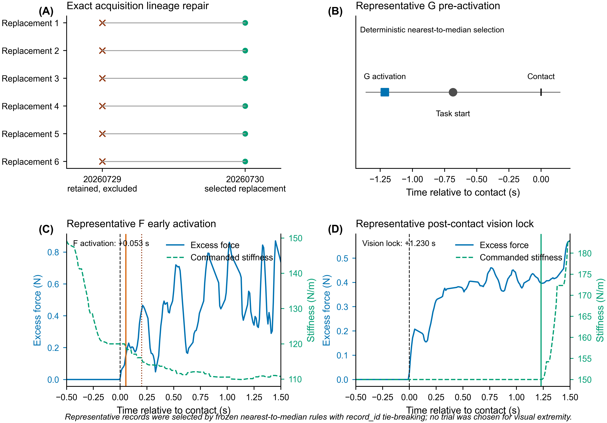

# Supplementary Material

## Realized-Intervention Fidelity in Asynchronous Human-in-the-Loop Teleoperation

This supplement contains framework implementation details, complete small-sample sensitivity results for the principal exploratory force metric, lineage-repair sensitivity, and figures moved from the main manuscript. It introduces no additional experimental acquisitions and does not redefine any frozen outcome.

## Table S1. Metric dictionary, evidence requirements, and applicability

| Metric | Operational definition | Required evidence | Case-study applicability | N/A rule |
|---|---|---|---|---|
| Event-order compliance | Indicator for each required relation \(t_{e_j}<t_{e_k}\); individual relations are retained | Nominal event order and aligned event timestamps | A/G/E/F where a nominal order exists | N/A when no ordering relation is specified |
| Executable-guard compliance | Implemented Boolean guard evaluates true at the realized first activation | Executable predicate, its input fields, and first-activation timestamp | A fixed-command check; G raw-force rule; E/F implemented transition/adaptation guards | N/A when no activation guard exists |
| Nominal-gate compliance | All scientific gates supported by a versioned nominal specification are satisfied at realized activation | Nominal gate specification and aligned event timestamps | F contact-plus-0.20-s target; relevant E/F transition gates | N/A when no defensible nominal gate was specified; a mode label alone does not create a gate |
| Activation timing error | \(t^R_{act}-t^N_{act}\) | Realized activation and defensible nominal target on a common clock | F force refinement | N/A for G because its executable logic contains no post-contact timing target |
| Pre-contact activation | Indicator that realized activation precedes confirmed contact | First activation and confirmed-contact timestamps | G and F adaptation | N/A for non-adaptive A/E |
| Contact-to-adaptation latency | \(t^R_{act}-t_{contact}\) | First activation and confirmed-contact timestamps | G and F | N/A for A/E |
| Vision-to-command latency | First logged parameter change minus vision lock | Vision-lock event and commanded-parameter trajectory | E and F | N/A for A/G |
| Transition-completion latency | Logged transition completion minus vision lock | Vision-lock event and transition-state/parameter trajectory | E and F | N/A for A/G |
| Parameter-state fidelity | Logged minus nominal commanded value at a landmark or integrated absolute deviation where replay is defined | Versioned nominal target and logged command trajectory | Fixed A; landmark summaries for G/E/F | Unavailable if the nominal adaptive target cannot be replayed from recorded inputs |
| Exposure duration/fraction | Duration/fraction of the outcome window carrying the defined realized intervention | Activation/transition state and event-aligned outcome window | A/G mode-specific exposure; E vision; F vision, adaptation, and joint exposure | N/A when the intervention component is absent by design |
| Provenance consistency | Raw trajectory, event log, summary, threshold, and outcome share exact acquisition identity and verified hashes | Exact record identifiers, paths, and file hashes | All 180 selected trials | Never inferred from a logical trial key alone |
| Clock integrity | Compared timestamps share a clock or a verified transformation | Clock calls, origins, stored timestamps, and anchor events | Analysis timeline for all modes; intervention-gate clock path for F | Unavailable when clock origin/domain cannot be reconstructed |

For the case-study implementation, E vision exposure began only when the vision-selected parameter transition was complete; F adaptation exposure used the first logged `fusion_active>0` state; G adaptation used the first logged `force_adapt_active>0` state. Full, partial, and zero exposure were defined relative to the contact +0.20-to-+1.00-s outcome window. These definitions were applied uniformly and were not used to select an efficacy subgroup.

## Table S2. Configuration-level fidelity summary

| Configuration | Executable/command result | Nominal/event result | Timing result, median [Q1, Q3] s | Outcome-window exposure | Provenance/clock result |
|---|---|---|---|---|---|
| A | Fixed commanded state retained in 45/45 | No activation target applicable | Not applicable | Mode-specific state present throughout 45/45 windows | Acquisition lineage 45/45; analysis/gate clock integrity 45/45 |
| G | Raw-force executable logic compliant in 45/45 | Independent contemporaneous post-contact nominal specification unavailable; pre-contact activation in 43/45 | Contact-to-activation −1.2144 [−1.6962, −0.7986] | Active during the window in 45/45 | Acquisition lineage 45/45; analysis clock integrity 45/45 |
| E | Vision executable logic compliant in 45/45 | Transition complete before contact in 38/45 and by window start in 39/45 | Vision-to-first-command 0.0243 [0.0219, 0.0342]; transition completion 0.3910 [0.3384, 0.4244] | Vision exposure: 39 full, 2 partial, 4 zero | Acquisition lineage 45/45; clock integrity 45/45 |
| F | Logged activation reconstructed in 45/45; no separate (C\neq R) claim without replay of the literal mixed-clock predicate | Nominal contact-plus-0.20-s requirement was implemented with incompatible clock domains; timing satisfied in 3/45; pre-contact activation in 0/45 | Contact-to-activation 0.0533 [0.0515, 0.0711]; timing error −0.1467 [−0.1485, −0.1289]; transition completion 0.3950 [0.3432, 0.4298] | Vision: 42 full, 0 partial, 3 zero; adaptation/joint: 35 full, 7 partial, 3 zero | Acquisition lineage 45/45; intervention-gate clock integrity 0/45 because the delay path mixed clock domains |

Trial-level values are provided in `../03_clean_analysis/trial_level_fidelity_metrics.csv` and `../03_clean_analysis/outcome_window_exposure.csv`; the complete configuration summaries are in `../03_clean_analysis/configuration_fidelity_summary.csv`.

## Table S3. Participant-level exploratory contrasts for threshold-referenced excess-force impulse

Participant is the independent human experimental unit in every row (n = 5). Differences use the first-listed configuration minus the second-listed configuration.

| Contrast | Difference, N·s | 95% t CI, N·s | Paired-t p | Exact sign-flip p | Exact Wilcoxon p | Holm paired-t p |
|---|---:|---:|---:|---:|---:|---:|
| E-A | −0.3489 | [−0.6080, −0.0898] | 0.0201 | 0.0625 | 0.0625 | 0.0633 |
| G-A | −0.0742 | [−0.1978, 0.0494] | 0.1708 | 0.0625 | 0.0625 | 0.3416 |
| F-E | −0.0212 | [−0.1433, 0.1010] | 0.6556 | 0.6875 | 0.8125 | 0.6556 |
| F-G | −0.2958 | [−0.5000, −0.0917] | 0.0158 | 0.0625 | 0.0625 | 0.0633 |

The exact and multiplicity-adjusted results are retained irrespective of whether they cross 0.05. The full participant differences and results for initial peak force, task-start-to-contact time, total task time, and software-log success are provided in `../03_clean_analysis/statistics_summary.csv`.

## Table S4. Sensitivity of the principal impulse contrasts to lineage correction

The historical columns reproduce the superseded analysis state; the clean columns use the selected exact acquisitions. Historical results are not treated as valid alternatives. This table documents whether lineage repair materially altered the numerical pattern.

| Contrast | Historical difference, N·s | Clean difference, N·s | Historical 95% CI | Clean 95% CI | Historical paired-t p | Clean paired-t p |
|---|---:|---:|---:|---:|---:|---:|
| E-A | −0.3416 | −0.3489 | [−0.5971, −0.0861] | [−0.6080, −0.0898] | 0.0206 | 0.0201 |
| G-A | −0.0742 | −0.0742 | [−0.1978, 0.0494] | [−0.1978, 0.0494] | 0.1708 | 0.1708 |
| F-E | −0.0469 | −0.0212 | [−0.2052, 0.1113] | [−0.1433, 0.1010] | 0.4565 | 0.6556 |
| F-G | −0.3143 | −0.2958 | [−0.5442, −0.0844] | [−0.5000, −0.0917] | 0.0192 | 0.0158 |

The complete row-level and statistics-level comparisons are provided in `../03_clean_analysis/old_new_trial_metric_comparison.csv` and `../03_clean_analysis/old_new_statistics_comparison.csv`.

## Table S5. Fixed adjacent-window sensitivity for the E-A threshold-referenced excess-force impulse

| Post-contact integration window | E-A mean difference, N·s | t-based 95% CI, N·s | Participant direction | Exact sign-flip p |
|---|---:|---:|---:|---:|
| 0.10–1.00 s | −0.3718 | [−0.6618, −0.0819] | 5/5 negative | 0.0625 |
| 0.30–1.00 s | −0.3238 | [−0.5474, −0.1002] | 5/5 negative | 0.0625 |
| 0.20–0.80 s | −0.2438 | [−0.4635, −0.0241] | 5/5 negative | 0.0625 |
| **0.20–1.00 s (principal exploratory analysis)** | **−0.3489** | **[−0.6080, −0.0898]** | **5/5 negative** | **0.0625** |
| 0.20–1.20 s | −0.4307 | [−0.6960, −0.1653] | 5/5 negative | 0.0625 |

These windows were fixed before inspecting their sensitivity results. They assess directional and magnitude stability and are not additional primary outcomes.

## Supplementary Figure S1. Contact-aligned force and commanded-stiffness context

**Figure S1.** (A) Participant-aggregated threshold-referenced excess force. (B) Participant-aggregated logged commanded translational stiffness. Curves first average trials within participant and assigned configuration and then average the five participant curves; bands are pointwise t-based 95% confidence intervals. The shaded region is the retrospective +0.20-to-+1.00-s outcome window. This figure provides descriptive physical/controller context, not a causal mechanism test. Logged stiffness was not independently validated as physical closed-loop impedance.

## Supplementary Figure S2. Participant consistency and leave-one-participant-out stability

**Figure S2.** (A) Individual E-A participant differences in threshold-referenced excess-force impulse. (B) Full-sample E-A estimate and five leave-one-participant-out estimates with t-based 95% confidence intervals. (C) Corresponding F-E estimates. This is a stability diagnostic; four-participant intervals are not additional independent confirmatory tests.

## Supplementary Figure S3. Lineage repair and deterministic trace examples

**Figure S3.** (A) Six superseded 20260729 acquisitions and their selected 20260730 replacements. (B) The G trial nearest the class-median activation-to-contact offset. (C) The F trial nearest the class-median activation-to-contact offset, with contact, first activation, and the nominal +0.20-s gate. (D) The eligible post-contact E/F vision-lock trial nearest the pooled post-contact median. Representative trials were selected by a frozen nearest-to-median rule rather than visual extremity.

## Machine-readable supplementary files

- `../03_clean_analysis/intervention_specification.csv`
- `../03_clean_analysis/master_trial_manifest.csv`
- `../03_clean_analysis/trial_level_fidelity_metrics.csv`
- `../03_clean_analysis/outcome_window_exposure.csv`
- `../03_clean_analysis/configuration_fidelity_summary.csv`
- `../03_clean_analysis/data_lineage_audit.csv`
- `../03_clean_analysis/statistics_summary.csv`
- `../03_clean_analysis/leave_one_participant_out.csv`
- `../03_clean_analysis/old_new_statistics_comparison.csv`
- `../03_clean_analysis/old_new_trial_metric_comparison.csv`
