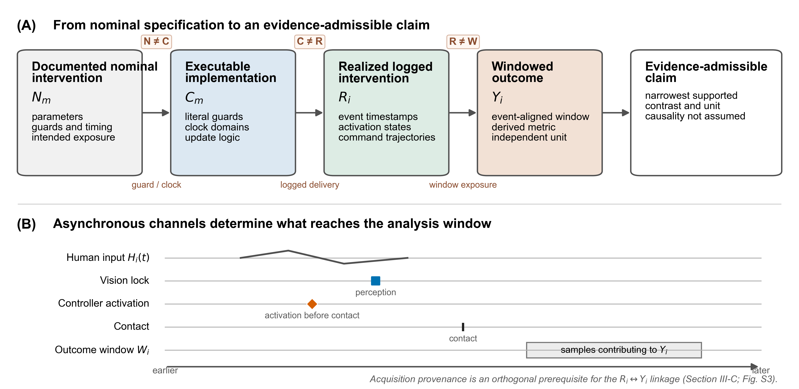
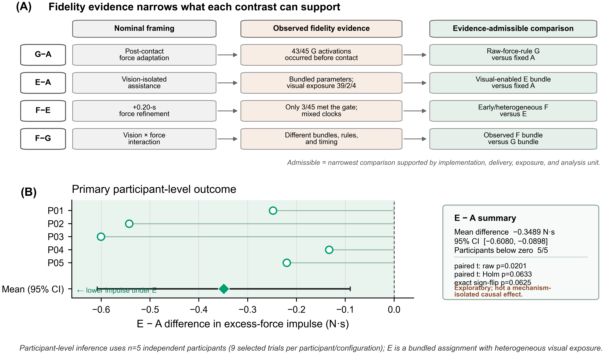

# 从名义控制器标签到实际干预：异步人机遥操作实验评价的保真度框架

*THMS 定向中文母稿（第三版：结构重构与投稿级审查）*

**英文拟题：** *From Nominal Controller Labels to Realized Interventions: A Fidelity Framework for Experimental Evaluation of Asynchronous Human–Machine Teleoperation*

**作者与单位：** `[投稿前必须补充]`

> **审批与投稿状态。** 本稿依据冻结的清理后再分析结果形成。伦理审批或豁免机构、编号、日期及知情同意程序必须依据同期机构记录补齐：`[ETHICS RECORD REQUIRED—DO NOT SUBMIT]`。作者、单位、基金、利益冲突、作者贡献、致谢以及数据和代码可用性声明亦须在投稿前完成。上述信息不得根据现有数据推断，也不得仅作为一般局限删除或绕过。

## 摘要

异步人机实验通常以固定、自适应、视觉使能或组合模式等名义标签定义条件，但标签本身不能证明耦合人—机器系统在结局窗口内实际经历了相应干预。本文提出实际干预保真度框架，以有文档支持的名义干预、源代码实际实现、实际记录干预和结局构成 \(N_m\rightarrow C_m\rightarrow R_i\rightarrow Y_i\) 证据链，并将语义、运行时和结局窗口暴露证据映射到当前证据允许表述的最窄统计比较目标及科学解释。框架在一个回顾性遥操作案例中得到操作化展示：5 名参与者在 4 种存档配置下完成 180 次重复试次，人体结局推断的独立实验单位始终为参与者。G 在 45/45 次试次中遵循可执行原始力规则，但 43/45 次在记录接触前激活；F 未在接触前激活，但混合时钟实现与名义接触后 +0.20 s 要求不一致，仅 3/45 次实现该名义时序。因此，现有证据不支持纯接触后 G 效应、正确门控的 F 增量效应或视觉×力析因解释。在这些边界建立后，具有异质实际视觉暴露的 E 捆绑配置相对固定配置 A 的接触后 0.20–1.00 s 阈值参照超额力冲量差为 −0.3489 N·s（95% CI，−0.6080 至 −0.0898），5 名参与者方向一致；四个固定相邻窗口中的差值亦均为负，但精确小样本检验和多重性校正不支持确认性推断。该案例表明，实际干预保真度不是附加的软件检查，而是限定异步人机系统统计比较与科学解释的推断前提。

**关键词：** 人机系统评价；实际干预保真度；异步遥操作；结局窗口暴露；可容许估计目标；采集溯源

# 1. 引言

人机闭环遥操作把人的感知、决策与适应同触觉接口、感知管线、监督控制器、远端机器人和物理环境耦合起来。接触表现因而不是控制器的孤立输出，而是人在反馈回路中持续行动和响应所形成的系统结局（Hannaford, 1989; Lawrence, 1993; Hokayem and Spong, 2006; Passenberg et al., 2010）。触觉引导、共享控制、视觉或语音辅助、阻抗调节及力相关学习均可能改变交互的安全性与效率（Huang et al., 2019; Peternel et al., 2018; Abu-Dakka et al., 2018; Huang et al., 2021; Michel et al., 2023; Gong et al., 2024）。这些组成部分却常运行于不同线程、调度周期和时钟域（Walker et al., 2010; Buchli et al., 2011; Ajoudani et al., 2012; Michel et al., 2021; Peternel and Ajoudani, 2023）。因此，人机系统评价不仅要说明“分配了什么条件”，还要证明“系统实际经历了什么干预”。

实验标签通常把条件概括为*固定*、*视觉使能*、*力自适应*或*组合*模式。每个标签隐含参数、守卫、事件顺序和持续时间：视觉预设应在何时可用，力相关更新应由何事件允许，相应状态又应覆盖结局窗口的哪一部分。然而，图像采集与推理、人体主端输入、接触检测、参数转换和控制循环可能并行发生。名义上的接触前配置可能直到接触后才完成，名义上的接触后机制也可能提前激活；即使程序进入某条代码路径，结局窗口仍可能只获得部分暴露。名义分配、程序实现、实际交付和统计结局之间由此可能出现不同断点。

时延研究、机器人运行时验证、机器人与 HRI 可重复性、实施保真度和 estimand 研究分别处理了这一问题的若干组成部分，但尚缺少一条面向异步人机实验评价的联合推断链。表 I 说明这些路线与本文所补充连接之间的关系。现有时延工作刻画时间代价，却不必然把逐试次时序转换为结局窗口暴露；运行时验证检查程序是否满足形式属性，却不等同于验证实现是否符合实验名义语义；可重复性和数据血缘保证分析对象可追溯，却不直接证明干预按计划交付；estimand 工作强调统计目标与理论问题的对应，却通常预设干预已经得到充分定义。本文关注的缺口正是：如何把这些证据连接起来，并据此限制比较能够支持的科学表述。

**表 I. 与人机实验评价相关的方法学路线及本文补充的连接。**

| 研究路线 | 已直接处理的问题 | 本文补充的连接 |
|---|---|---|
| 时延与感知调度（Vogels, 2004; Rakita et al., 2020; Louca et al., 2024; Aldana-López et al., 2023） | 时延、跨模态时间代价、操作者响应与稳定性 | 将逐试次时序转化为结局窗口暴露，并限定比较含义 |
| 机器人运行时验证（Huang et al., 2014） | 可执行命令和消息是否满足形式属性 | 区分“程序按实现执行”与“实现符合名义实验语义” |
| 机器人/HRI 可重复性（Bonsignorio and del Pobil, 2015; Bonsignorio, 2017; Gunes et al., 2022; Bagchi et al., 2023; Marchesi et al., 2024） | 透明报告、产物保存与复现 | 在同源数据得到证明后，重建该采集实际交付的干预 |
| 实施保真度（Carroll et al., 2007） | 计划干预与实际交付内容、频率和覆盖的差异 | 将交付概念落实为控制器守卫、事件、时钟和轨迹证据 |
| Estimand 定义（Lundberg et al., 2021） | 使统计目标量与理论问题对应 | 根据实际干预证据决定名义统计比较目标是否仍受支持 |
| **本文** | **联合重建 \(N_m\rightarrow C_m\rightarrow R_i\rightarrow Y_i\)** | **把保真度断点转化为对可容许比较和解释的约束** |

本文回答三个相互衔接的研究问题：

- **RQ1（实际实现）：** 在本回顾性异步遥操作案例中，名义控制器标签、可执行逻辑与实际记录干预之间呈现哪些一致和偏离模式？
- **RQ2（推断后果）：** 当名义干预与实际干预偏离时，这些证据如何改变控制器比较可支持的科学解释？
- **RQ3（有边界的案例结果）：** 完成实际干预重建后，现有案例数据仍支持哪些结局模式？

本文有两项方法学贡献。第一，建立并操作化 \(N_m\rightarrow C_m\rightarrow R_i\rightarrow Y_i\) 证据链，把名义语义、可执行守卫、事件时序、参数轨迹和结局窗口纳入同一评价流程。第二，将语义、运行时和窗口暴露证据连接到证据可容许的统计比较目标与科学解释，而不以综合分数或事后“合规”亚组替代推断判断。5 名参与者的 180 次重复试次仅提供真实回顾性案例示范，不构成第三项概念贡献，也不用于声称框架已得到外部验证。第 2 节定义框架，第 3 节说明案例与分析方法，第 4 节依次回答三个研究问题，第 5 节讨论其人机系统意义、设计启示与局限。

# 2. 实际干预保真度框架

## 2.1 名义—可执行—实际—结局证据链

一次人机实验比较表示为

\[
N_m\rightarrow C_m\rightarrow R_i\rightarrow Y_i.
\]

其中，\(N_m\) 是由同期规范、协议或可追溯代码说明支持的模式 \(m\) 科学意图，包括预期参数、激活守卫、更新规则、事件顺序和预期结局窗口暴露；模式名称本身不能补足缺失的名义规范。\(C_m\) 是采集程序源代码实际实现的守卫、时钟域、初始化和更新逻辑。\(R_i=\{\mathcal{E}_i,a_i(t),\boldsymbol{\theta}^{log}_i(t)\}\) 是试次 \(i\) 中由干预相关事件、激活状态和指令参数轨迹重建的实际记录干预。\(Y_i\) 是在明确窗口内、按预先声明的独立实验单位计算的结局。精确采集溯源 \(\mathcal{P}_i\) 单独作为把 \(R_i\) 可靠连接到 \(Y_i\) 的数据完整性前提，而不是实际干预的组成部分。

人体主端输入和其他可观测人机轨迹另记为 \(H_i(t)\)。它们可用于描述异步事件背景和耦合系统行为，但不被默认定义为控制器实际干预 \(R_i\) 的一部分。人的意图并未被直接记录；主端位置的存在也不自动形成有效的人体行为指标。记录的控制器指令界定存档能够支持的干预证据，但不等同于独立测量的物理阻抗或完整的人—机器人状态。

**图 1.** 有文档支持的名义干预经源代码实现转化为试次特异的实际记录干预，并进入结局窗口和证据可容许解释。简化异步时间线说明人体输入、感知、控制器激活和接触可能错位，因而实现与实际交付均不能由标签默认成立。采集溯源是 \(R_i\rightarrow Y_i\) 连接的正交数据完整性前提，见第 3.3 节和补充图 S3。

## 2.2 时序、窗口暴露与可容许统计比较

若名义干预规定目标激活时间 \(t^{N}_{act,i}\)，实际记录时间为 \(t^{R}_{act,i}\)，则激活时序误差为

\[
\epsilon_{act,i}=t^{R}_{act,i}-t^{N}_{act,i}.
\]

负值表示早于规定时间，正值表示晚于规定时间。只有在目标事件和时钟映射均有证据支持时才计算该量。软件日志时延不能在缺少传感、通信和物理响应测量时被称为端到端物理时延。

干预在试次中出现并不意味着它覆盖了结局。对二元激活状态 \(a_i(t)\) 和窗口 \(W=[t_0,t_1]\)，实际窗口暴露比例定义为

\[
\Phi_i(W)=\frac{1}{|W|}\int_{t_0}^{t_1}\mathbb{I}[a_i(t)=1]dt.
\]

\(\Phi_i=1\)、\(0<\Phi_i<1\) 和 \(\Phi_i=0\) 分别表示完全、部分和零暴露。这些类别描述实际进入结局的干预，不是观察结局后排除试次的规则。

名义比较 \(\Delta^N_{m_1,m_0}\) 只有在相应语义和暴露得到支持时才能按标签解释；否则，存档能够支持的是实际干预类别之间的比较：

\[
\Delta^R_{m_1,m_0}=\mathbb{E}[Y\mid R\in\mathcal{R}_{m_1}]-\mathbb{E}[Y\mid R\in\mathcal{R}_{m_0}].
\]

本文将*可容许估计目标（admissible estimand）*严格限定为：当前干预证据允许表述的最窄统计比较目标。它不是无需额外识别假设即可赋予因果含义的 causal estimand。\(R_i\) 是干预实现后的记录状态，可能与人体动作、系统状态和运行时时序共同变化；条件于 \(R_i\) 的均值差本身不能证明因果效应。框架因此可以收窄解释，而不必改变试次入选或结局数值。

## 2.3 保真度断点与正交溯源前提

干预交付保真度包含三个可以共存的断点。\(N\neq C\) 表示有文档支持的科学规范未被源代码实现，包括缺失守卫或不相容时钟域；\(C\neq R\) 仅表示实际记录未再现依据可执行实现及其记录输入所预测的状态或参数轨迹；实际干预与结局窗口不匹配表示暴露偏差。这些断点不应压缩成单一“正确/错误”评分。采集溯源完整性则处于另一维度：它不是干预是否按计划交付的属性，而是把 \(R_i\) 可信连接到 \(Y_i\) 的数据完整性前提。

**表 II. 人机干预评价的最低证据包。**

| 证据 | 评价用途 |
|---|---|
| 带版本的名义干预规范 | 定义预期参数、守卫、事件顺序和暴露 |
| 可执行守卫、初始化、更新规则与时钟域 | 建立程序实际实现的语义 |
| 人体输入、感知、控制器和机器事件时间戳 | 重建异步事件顺序 |
| 激活状态与指令参数轨迹 | 重建试次特异的实际干预 |
| 明确定义的结局窗口 | 确定进入结局的暴露内容和比例 |
| 独立实验单位 | 确定有效推断层级 |
| 精确采集 ID、文件连接与哈希 | 证明干预和结局来自同一次采集 |

框架按三个阶段使用：采集前冻结名义干预、守卫、时钟、窗口和实验单位；采集中记录人体输入、感知事件、激活状态、参数轨迹、机器/环境事件和采集身份；推断前验证 \(N\rightarrow C\)、\(C\rightarrow R\)，并通过溯源完整性验证 \(R\xleftrightarrow{\mathcal{P}}Y\)，再决定标签比较能够表述为何种统计目标。无名义目标的指标标记为“不适用”，缺少规范或记录字段的指标标记为“不可获得”；二者均不能转换为保真度通过。

# 3. 回顾性遥操作案例示范

## 3.1 人机系统、参与者与实验结构

实验平台由人类操作者、Force Dimension Omega.7 主端触觉设备、监督控制器、Intel RealSense D435i 视觉通道、Franka Emika Panda 机器人与 Franka Hand 夹爪以及物理对象组成。Omega.7 增量平移输入经 3 倍缩放和符号映射形成机器人笛卡尔位置目标；机器人状态估计的外部力/力矩同时用于接触检测、触觉反馈和结局计算。该力通道为 Panda 内部估计 `O_F_ext_hat_K`，不是独立外部力/力矩传感器。记录刚度是软件指令参数，未被独立验证为物理闭环阻抗。

5 名参与者完成了存档实验。清理后数据具有参与者内重复测量结构：5 名参与者 × 3 种材料类别 × 3 个重复区组 × 4 种配置（A/G/E/F），共 180 次分析试次。每名参与者在每种配置下贡献 9 次试次，每种配置共 45 次。重复试次提高参与者内表征精度，但独立人体实验单位始终是参与者（\(n=5\)），不是 180 次试次或 45 个匹配区组。

任务日志表示接近、阈值定义的接触、抓取、搬运、释放和完成序列。`task_start` 在力基线准备就绪且控制器无转换活动时自动发出，表示**系统就绪**而非首次人体运动。原始 CSV 虽包含 Omega.7 位置，但存档没有经外部验证的人体运动起点；本文不新增 human motion onset 终点，也不把 `contact − task_start` 解释为操作者接近时长或移动速度。

图 2 将实验场景与日志重建的连续过程并置：现场照片给出操作者主端、Panda、夹爪、视觉传感器、主机和任务工作区；过程面板则从全部 45 次 F 试次的视觉锁定、参数转换完成、记录接触和力规则激活，连续连接到接触对齐的力暴露与记录指令轨迹。该图展示实验如何实际发生以及时序偏离如何进入预定义结局窗口，而不是选择单条“典型”试次。

参与者人口学、惯用手、经验、招募、补偿和训练方案仍需从同期记录核实。对象几何、物理实例、起始与目标位置、放置容差以及前瞻性随机化或平衡顺序方案未从当前血缘中恢复。最重要的是：`[ETHICS RECORD REQUIRED—DO NOT SUBMIT：审批/豁免机构、编号、日期、知情同意及存档数据使用范围]`。

## 3.2 名义配置与可执行实现

四个存档标签表示捆绑的监督配置，而非可直接分解的单一因子。A 为固定记录配置，名义平移刚度 200 N/m。G 使用无视觉的原始力相关刚度自适应，但其可执行更新器不要求基线就绪或接触，且现有血缘没有恢复独立、同期的“接触后 G”名义规范。E 由首次有效视觉锁定选择材料相关预设，并同时改变平移/旋转刚度、阻尼、触觉反馈和夹爪力。F 在 E 的视觉预设基础上加入有源代码说明支持的名义接触后 +0.20 s 力相关细化。由于 E/F 同时改变多个参数，E-A 不能解释为视觉或刚度的孤立效应。

视觉通道使用 424×240、名义 15 帧/s 彩色流和 `yolo11n.pt` 模型；首次有效语义映射锁定 soft、medium、hard 或 unknown 配置。监督循环名义频率为 200 Hz，但实测控制周期不规则，因此全部时域分析使用记录时间戳。

事件和 CSV `system_time` 来自相对于 `time.perf_counter()` 原点的单调时间线。G 更新器使用原始滤波力且不检查基线或接触。F 延迟逻辑把 `time.time()` 墙上时钟值与 `time.perf_counter()` 原点混合比较，使名义 +0.20 s 门控不能被视为可靠实现。G 首次激活定义为 `force_adapt_active>0` 的首行，F 首次激活定义为 `fusion_active>0` 的首行。

**图 2.** 真实实验场景与连续过程证据。（A）带原始标注的实验照片，显示 Force Dimension Omega.7、Franka Panda、Franka Hand、Intel RealSense D435i、主机及对象工作区；照片未经生成式重绘。（B）全部 45 次 F 试次相对记录接触的视觉锁定、参数转换完成与力规则激活；浅色点为试次，粗线和方形/菱形分别表示四分位距和中位数，绘图区外试次在边界计数，灰带为接触后 0.20–1.00 s 结局窗口。（C）阈值参照超额力的接触对齐轨迹。（D）记录平移刚度指令轨迹。C–D 中曲线先在参与者内汇总，再对 5 名参与者求均值；色带为逐时点基于 \(t\) 分布的 95% 置信区间，不进行逐时点显著性检验。该图把感知、控制器交付、物理接触和进入结局窗口的力暴露连接起来；记录刚度不是独立验证的物理闭环阻抗。

## 3.3 试次重建、结局与数据完整性

每次采集产生原始 CSV、事件 JSON 和摘要 JSON。CSV 包含单调相对时间、主端输入、机器人目标和状态、力/力矩、控制器参数、视觉状态、激活标志、接触阈值和控制周期。名义配置及预期守卫实例化 \(N_m\)，源代码守卫、更新和时钟操作实例化 \(C_m\)，行级事件、激活和参数轨迹实例化 \(R_i\)，事件对齐结局实例化 \(Y_i\)。

存档包含 186 条采集记录，对应 180 个逻辑试次键。174 条为唯一记录，另有 6 个键各包含一条 20260729 初始记录和一条 20260730 替代记录。冻结清单以不读取结局字段的固定身份规则选择 174 条唯一记录和 6 条替代记录；所有初始和替代记录均只读保留。现有材料未保留同期技术故障说明，也不能确定最初认定错误时是否已查看结局，因此替换不被描述为前瞻性盲态排除。

接触阈值为 \(T_i=\max(1.0\,\mathrm{N},\mu_{0,i}+3\sigma_{0,i})\)，并要求连续越阈 0.050 s。回顾性主要安全相关结局为接触后 0.20–1.00 s 的阈值参照超额力冲量：

\[
I_{excess,i}^{0.2:1.0}=\int_{0.20}^{1.00}\max[F_i(t_c+\tau)-T_i,0]d\tau.
\]

该窗口未前瞻性预注册，结局分析属于探索性。为检查 E-A 方向是否依赖 0.20–1.00 s 这一单一回顾性边界，本轮在查看敏感性结果前固定四个相邻窗口：0.10–1.00、0.30–1.00、0.20–0.80 和 0.20–1.20 s。全部窗口使用相同阈值、梯形积分、参与者内聚合和 E-A 配对方向评价；它们不被作为新增主要终点，也不用于选择最有利窗口。次要指标包括接触后 0–0.20 s 初始峰值力、系统就绪至接触间隔、总任务时间和软件日志成功。软件成功不是独立视频或物理裁决。

## 3.4 统计分析

先在每名参与者、每种配置内对 9 次试次求平均，再形成 E-A、G-A、F-E 和 F-G 的参与者层面配对差。报告均值差、自由度 4 的 \(t\) 分布 95% 置信区间、双侧配对 \(t\) 检验、全部 \(2^5\) 种符号分配的精确双侧符号翻转检验及精确 Wilcoxon 符号秩敏感性检验。对每项结局的 4 项对比分别进行 Holm 校正，并进行留一参与者分析。窗口敏感性强调效应方向、幅度范围和参与者一致性，不将相邻窗口作为独立假设族追求显著性。5 名独立参与者的双侧穷举符号翻转检验具有内在离散分辨率：即使 5 个差值方向完全一致，最小双侧 \(p\) 值仍为 0.0625。因此，本文优先报告效应估计、参与者一致性和固定敏感性分析，而非阈值化显著性结论。

# 4. 结果

## 4.1 RQ1：名义标签、可执行逻辑与实际干预

A 提供记录指令通过型对照。45/45 次 A 试次在审计标志时间及结局窗口保持 200 N/m 记录平移刚度，观测指令偏差为零；该结果不构成物理阻抗测量。

G 的 45/45 次试次均按实现的 1 N 死区原始力规则激活，但 42/45 次早于任务开始，42/45 次早于基线就绪，43/45 次早于记录接触；仅 2/45 次满足接触后顺序。相对任务开始和接触的首次激活中位数分别为 −0.379 s 和 −1.214 s。在标签所暗示的接触后语义层面，这属于 nominal semantics / executable implementation mismatch；由于没有恢复独立、同期的接触后规范，该判断用于否定纯接触后解释，而不用于反推更具体的 \(N_m\)。G 因而只能描述为以接触前预激活为主的实际配置。

F 没有试次在接触前激活，但仅 3/45 次满足名义接触后 +0.20 s 门控，42/45 次早于名义门控。接触到激活的中位时延为 +0.0533 s，时序误差中位数为 −0.1467 s。该模式与延迟路径混用墙上时钟和单调时钟的实现检查一致。现有分析未把它另行归为 \(C\neq R\)，因为尚未证明日志违背混合时钟代码实际会产生的判断。

结局窗口暴露进一步显示同一标签内部并非均匀干预。在接触后 0.20–1.00 s 窗口中，E 视觉暴露为 39 次完全、2 次部分和 4 次零暴露；F 视觉暴露为 42 次完全、0 次部分和 3 次零暴露；F 自适应及视觉+自适应联合暴露均为 35 次完全、7 次部分和 3 次零暴露。暴露类别未用于删除试次。

正交溯源检查显示，全部 180 条清理后采集均具有同源 CSV、事件 JSON 和摘要 JSON；180 条干预—结局连接全部有效，540 个入选文件的 SHA-256 哈希全部通过，6 条被替代记录仍可追溯。血缘修复前后 4 项主要冲量对比方向不变：E-A 由 −0.3416 变为 −0.3489 N·s，G-A 保持 −0.0742 N·s，F-E 由 −0.0469 变为 −0.0212 N·s，F-G 由 −0.3143 变为 −0.2958 N·s。该检查只建立 \(R_i\rightarrow Y_i\) 连接的数据完整性，不构成干预交付保真度，也不验证控制器时序。

**图 3.** 试次层面的实际干预保真度。（A）45 次 G 试次的首次激活、任务开始、基线就绪与接触；可执行原始力规则 45/45 合规，但 43/45 次在接触前激活。（B）45 次 F 试次相对接触的首次激活；仅 3/45 次满足名义 +0.20 s 门控，中位激活时间 +0.0533 s，中位时序误差 −0.1467 s。（C）按参与者分组并保留 45 个试次身份的结局窗口暴露矩阵；颜色及符号分别编码完全、部分和零暴露，右侧给出三类计数。试次级结果用于描述干预保真度；人体结局推断使用参与者 \(n=5\)。

## 4.2 RQ2：保真度证据对可容许解释的约束

保真度分析没有根据结局删除或重分类试次，而是把名义比较改写为实际证据支持的最窄解释（表 III）。

**表 III. 名义主张、关键保真度证据与证据可容许解释。**

| 比较 | 名义或标签主张 | 关键保真度证据 | 允许表述 | 禁止表述 |
|---|---|---|---|---|
| G-A | 接触后力相关细化相对固定配置 | G 缺少可恢复的独立接触后名义规范；代码无接触守卫；43/45 次接触前激活 | 以预激活为主的原始力自适应 G 分配相对固定 A 的描述性差异 | 纯接触后力自适应效应 |
| E-A | 视觉或刚度单因素效应 | E 同时改变多个指令参数；视觉暴露 39 次完全、2 次部分和 4 次零暴露 | E 分配及其异质实际视觉暴露分布相对固定 A 的描述性差异 | 单独视觉、刚度或另一参数的因果效应 |
| F-E | 正确执行 +0.20 s 门控的增量力细化 | 混合时钟实现与名义门控不一致；仅 3/45 次满足名义时序；窗口暴露异质 | 实际早期激活且暴露异质的 F 分配相对 E 分配的描述性差异 | 正确执行 +0.20 s 策略的增量效应 |
| F-G | 视觉×力交互或孤立视觉增量 | 两种配置的视觉、力规则、参数捆绑和实现时序均不同 | 两种实际捆绑及暴露分布之间的描述性差异 | 视觉主效应、力主效应或视觉×力交互 |

A/G/E/F 因而不能作为清晰的 2×2 析因设计解释。名义标签只组织分配；有文档支持的规范、源代码实现、实际轨迹和窗口暴露共同决定存档能够支持的描述性统计比较与科学措辞。这些比较不因被称为“可容许估计目标”而自动获得因果含义。

## 4.3 RQ3：重建后仍可解释的结局模式

阈值参照超额力冲量的参与者层面均值在 A、G、E 和 F 中分别为 0.8073、0.7330、0.4584 和 0.4372 N·s。以下结果描述实际记录配置，不用于验证框架，也不构成单个控制成分的因果效应。

E-A 冲量均值差为 −0.3489 N·s（95% CI，−0.6080 至 −0.0898；\(t(4)=-3.739\)，配对 \(t\) 检验 \(p=0.0201\)）。5 名参与者差值均为负，范围为 −0.6006 至 −0.1331 N·s。精确符号翻转和 Wilcoxon 检验均为 \(p=0.0625\)；4 项对比 Holm 校正后，配对 \(t\) 检验 \(p=0.0633\)，两种精确检验均为 0.2500。该方向一致的估计不构成确认性证据。

固定相邻窗口敏感性显示，E-A 差值没有依赖 0.20–1.00 s 这一单一边界（补充表 S5）。在 0.10–1.00、0.30–1.00、0.20–0.80 和 0.20–1.20 s 窗口中，参与者层面均值差均为负（−0.2438 至 −0.4307 N·s），且每个窗口内 5 名参与者方向均一致。全部窗口的双侧精确符号翻转 \(p\) 值均为 0.0625。这些结果评价方向和幅度稳定性，不构造替代主要终点。

留一参与者分析中，5 个 E-A 冲量均值差仍全部为负，范围为 −0.4028 至 −0.2860 N·s；5 个子集的 95% 区间中有 1 个跨越零。该结果说明方向并非由单一参与者决定，但不会增加独立人体样本量，也不会把探索性结果转化为确认性证据。

系统就绪至接触间隔在 A 和 E 中的参与者层面均值分别为 0.8974 s 和 2.6779 s，E-A 差为 1.7805 s（95% CI，1.5084 至 2.0527；\(t(4)=18.165\)，配对 \(t\) 检验 \(p=5.40\times10^{-5}\)）。5 名参与者差值均为正；精确检验均为 \(p=0.0625\)，Holm 校正配对 \(t\) 检验 \(p=0.000162\)，校正精确检验均为 0.2500。该指标只表示系统就绪到接触的记录间隔，不能证明操作者移动更慢或机器人接近时间更长。

总任务时间在 A 和 E 中的均值分别为 16.2631 s 和 17.4758 s，E-A 差为 1.2128 s（95% CI，0.5741 至 1.8514；\(t(4)=5.272\)，配对 \(t\) 检验 \(p=0.00620\)）。5 名参与者差值均为正；精确检验均为 \(p=0.0625\)，Holm 校正配对 \(t\) 检验 \(p=0.0186\)，校正精确检验均为 0.2500。较低的早期力暴露与较长的时间指标共同构成观测到的力—时间模式，但不能证明一般性的安全—效率机制。

G-A 冲量差为 −0.0742 N·s（95% CI，−0.1978 至 0.0494；\(p=0.1708\)），描述以预激活为主的实际 G 配置。F-E 差为 −0.0212 N·s（95% CI，−0.1433 至 0.1010；\(p=0.6556\)），5 名参与者中 3 负 2 正。F-G 差为 −0.2958 N·s（95% CI，−0.5000 至 −0.0917；\(p=0.0158\)），但精确检验均为 0.0625，Holm 校正配对 \(t\) 检验为 0.0633；该比较不是视觉×力交互证据。

**图 4.** 保真度约束下的解释与主要参与者结局。（A）四项名义比较经实际激活、时钟实现、参数捆绑和窗口暴露证据收窄为证据可容许比较；该映射限定图形能够支持的科学主张。（B）主要 E-A 阈值参照超额力冲量的参与者配对差；空心点表示 5 名独立参与者，菱形及横线表示均值差和基于 \(t\) 分布的 95% 置信区间，右侧同时列出原始、Holm 校正及精确检验。E 表示具有异质实际视觉暴露的捆绑配置分配；结果不代表单一视觉或刚度机制的因果效应。

# 5. 讨论

## 5.1 主要发现与人机系统意义

本案例按证据链依次回答了三个研究问题。对 RQ1，A 的记录指令一致；G 在标签所暗示的接触后语义与无接触守卫的可执行实现之间发生错位，其 45/45 次试次遵循可执行规则却以接触前激活为主；F 的混合时钟实现不能可靠实现名义 +0.20 s 门控；E/F 的结局窗口暴露存在异质性。对 RQ2，这些模式分别要求收窄名义语义、区分实现错误与运行时偏离，并把均匀处理标签改写为实际暴露分布；正交溯源检查只决定 \(R_i\) 能否可信连接到 \(Y_i\)。对 RQ3，案例保留了一个有边界的 E-A 力—时间模式：E 捆绑配置相对 A 的早期超额力冲量估计方向一致且在固定相邻窗口中稳定，同时系统就绪至接触间隔和总任务时间更长，但小样本精确推断与多重性校正不支持确认性结论。

这些发现的 THMS 意义在于，评价对象是耦合的人—机器系统，而不是脱离运行上下文的控制器标签。人可能依据视觉、触觉和机器行为改变输入；控制器状态也可能在不同线程和时钟域中改变。若实验只报告条件分配和最终结局，便无法判断差异来自名义机制、实际捆绑配置、时序错位还是暴露异质性。实际干预重建使这种系统级不确定性进入统计比较的定义，而不是在结果出现后仅作为软件局限补充说明。

本框架与既有路线互补而非替代。时延研究说明异步感知与反馈会改变人机表现，本文进一步要求把时序证据定位到具体结局窗口；运行时验证检查程序是否按可执行规则运行，本文区分这种一致性与名义实验语义的一致性；可重复性与血缘工作保证分析可追溯，本文把它保留为 \(R_i\rightarrow Y_i\) 连接的正交前提；实施保真度和 estimand 研究提供计划—交付与目标量的概念基础，本文将其落实为人机控制器的守卫、时钟、事件和指令轨迹。框架的产出因此不是统一分数，而是比较能够支持的最窄科学措辞。

## 5.2 对实验设计、采集与报告的启示

**采集前。** 研究者应冻结带版本的名义干预规范，明确哪些事件允许激活、使用何种时钟、干预应覆盖哪个结局窗口，以及谁或什么是独立实验单位。若设计意图是析因比较，各配置除目标因素外应保持可解释的一致性；模式标签不能代替可执行规范。

**采集中。** 系统应同步记录人体输入、感知事件、激活状态、指令参数、机器/环境事件、时钟域和精确采集身份。试次日志应允许重建从名义守卫到实际窗口暴露的路径。人体输入的存在并不自动提供有效行为指标：本案例虽记录 Omega.7 位置，却没有经验证的人体运动起点，因此不能在分析阶段自行设阈值制造反应时、接近速度或犹豫指标。

**推断前与报告时。** 应在不依据结局方向筛选试次的前提下检查 \(N\rightarrow C\)、\(C\rightarrow R\)，并通过正交溯源验证 \(R\xleftrightarrow{\mathcal{P}}Y\)。试次级保真度观察与参与者级人体推断必须分开报告。若证据只支持实际捆绑配置，标题、摘要、图注和结论也必须停留在该解释层级。对于本案例，这意味着 E-A 只能表述为 actual visual-enabled bundled configuration 与 actual fixed configuration 的差异；G-A、F-E 和 F-G 不能分别改写为纯接触后效应、正确 +0.20 s 细化效应或视觉×力交互。

该最低证据包不要求所有人机实验采用同一传感器或控制架构。它要求每项科学比较都能回答三个问题：计划交付什么、实际记录了什么、结局由同一次采集的哪些样本构成。该原则可用于共享控制、驾驶自动化、辅助机器人、可穿戴交互和其他异步人机系统，但跨系统适用性仍需前瞻性验证。

## 5.3 案例局限与前瞻性验证需求

E 在接触附近的记录平移刚度低于 A（补充图 S1），为较低力暴露提供物理上相容的背景，但记录刚度不是物理闭环阻抗，E 还同时改变旋转刚度、阻尼、触觉反馈和夹爪力。人的等待、停顿或对反馈的适应也可能参与形成结果，但存档没有直接测量注意、谨慎程度、意图或经验证的人体运动起点。因此，E-A 只能解释为 E 分配及其异质实际视觉暴露分布与固定配置 A 之间的差异。

框架仅在一个存档遥操作系统中得到回顾性操作化，不能恢复未记录的软件状态，也未在其他人机系统中外部验证。案例只有 5 名参与者；180 次试次不是 180 个独立人体样本。0.20–1.00 s 冲量窗口为回顾性选择；相邻窗口方向稳定降低了结果依赖单一边界的担忧，但不能把结局转化为前瞻性预注册终点。E/F 为多参数捆绑配置，随机化或平衡顺序未恢复，因而不能排除学习、疲劳和顺序影响。

力信号来自机器人内部外部力估计而非独立传感器；物体身份、姿态、放置和容差信息不完整，软件成功没有视频或人工复核。参与者人口学、经验和训练信息应尽力依据同期记录恢复，否则必须保留为代表性与复现性局限。6 组记录替换遵循固定身份规则并有敏感性分析，但同期故障依据和最初判断是否发生于结局查看前仍未知。伦理审批或豁免及知情同意信息不是可由讨论段吸收的一般局限，必须在投稿前由机构记录支持。

前瞻性研究应在采集前冻结名义语义和统一时钟实现，预先定义结局与容许暴露，保存逐试次的干预轨迹和精确血缘，并在足够参与者样本中验证框架能否跨任务识别并预防解释错位。此类研究应把“框架外部验证”与“某一控制器效果检验”区分为不同目标。

# 6. 结论

异步人机实验中的名义条件分配不能独立证明相应干预已由耦合人—机器系统实际经历。本文提出的 \(N_m\rightarrow C_m\rightarrow R_i\rightarrow Y_i\) 框架连接名义语义、可执行逻辑、实际事件与参数轨迹以及结局窗口，并以正交采集溯源保证 \(R_i\) 与 \(Y_i\) 来自同一次采集。回顾性案例表明，实际干预保真度的主要作用不是事后排除试次，而是在语义、运行时或暴露发生偏离时重新界定证据可容许的统计比较和科学解释；这种界定不自动赋予因果含义。对人机系统评价而言，只有重建实际干预并验证干预—结局连接，模式标签才可能成为有证据支持的推断对象。

# 参考文献

1. Hannaford, B. (1989). A design framework for teleoperators with kinesthetic feedback. *IEEE Transactions on Robotics and Automation, 5*(4), 426–434. https://doi.org/10.1109/70.88057
2. Lawrence, D. A. (1993). Stability and transparency in bilateral teleoperation. *IEEE Transactions on Robotics and Automation, 9*(5), 624–637. https://doi.org/10.1109/70.258054
3. Hokayem, P. F., & Spong, M. W. (2006). Bilateral teleoperation: An historical survey. *Automatica, 42*(12), 2035–2057. https://doi.org/10.1016/j.automatica.2006.06.027
4. Passenberg, C., Peer, A., & Buss, M. (2010). A survey of environment-, operator-, and task-adapted controllers for teleoperation systems. *Mechatronics, 20*(7), 787–801. https://doi.org/10.1016/j.mechatronics.2010.04.005
5. Huang, K., Chitrakar, D., Rydén, F., & Chizeck, H. J. (2019). Evaluation of haptic guidance virtual fixtures and 3D visualization methods in telemanipulation—A user study. *Intelligent Service Robotics, 12*, 289–301. https://doi.org/10.1007/s11370-019-00283-w
6. Rakita, D., Mutlu, B., & Gleicher, M. (2020). Effects of onset latency and robot speed delays on mimicry-control teleoperation. In *Proceedings of the 2020 ACM/IEEE International Conference on Human-Robot Interaction*. https://doi.org/10.1145/3319502.3374838
7. Louca, J., Eder, K., Vrublevskis, J., & Tzemanaki, A. (2024). Impact of haptic feedback in high latency teleoperation for space applications. *ACM Transactions on Human-Robot Interaction, 13*(2), Article 16, 1–21. https://doi.org/10.1145/3651993
8. Gong, Y., Mat Husin, H., Erol, E., Ortenzi, V., & Kuchenbecher, K. J. (2024). AiroTouch: Enhancing telerobotic assembly through naturalistic haptic feedback of tool vibrations. *Frontiers in Robotics and AI, 11*, 1355205. https://doi.org/10.3389/frobt.2024.1355205
9. Hogan, N. (1985). Impedance control: An approach to manipulation: Part I—Theory. *Journal of Dynamic Systems, Measurement, and Control, 107*(1), 1–7. https://doi.org/10.1115/1.3140702
10. Walker, D. S., Wilson, R. P., & Niemeyer, G. (2010). User-controlled variable impedance teleoperation. In *2010 IEEE International Conference on Robotics and Automation*. https://doi.org/10.1109/ROBOT.2010.5509811
11. Buchli, J., Stulp, F., Theodorou, E., & Schaal, S. (2011). Learning variable impedance control. *The International Journal of Robotics Research, 30*(7), 820–833. https://doi.org/10.1177/0278364911402527
12. Ajoudani, A., Tsagarakis, N. G., & Bicchi, A. (2012). Tele-impedance: Teleoperation with impedance regulation using a body–machine interface. *The International Journal of Robotics Research, 31*(13), 1642–1656. https://doi.org/10.1177/0278364912464668
13. Peternel, L., Petrič, T., & Babič, J. (2018). Robotic assembly solution by human-in-the-loop teaching method based on real-time stiffness modulation. *Autonomous Robots, 42*, 1–17. https://doi.org/10.1007/s10514-017-9635-z
14. Abu-Dakka, F. J., Rozo, L., & Caldwell, D. G. (2018). Force-based variable impedance learning for robotic manipulation. *Robotics and Autonomous Systems, 109*, 156–167. https://doi.org/10.1016/j.robot.2018.07.008
15. Abu-Dakka, F. J., & Saveriano, M. (2020). Variable impedance control and learning—A review. *Frontiers in Robotics and AI, 7*, 590681. https://doi.org/10.3389/frobt.2020.590681
16. Michel, Y., Rahal, R., Pacchierotti, C., Robuffo Giordano, P., & Lee, D. (2021). Bilateral teleoperation with adaptive impedance control for contact tasks. *IEEE Robotics and Automation Letters, 6*(3), 5429–5436. https://doi.org/10.1109/LRA.2021.3066974
17. Peternel, L., & Ajoudani, A. (2023). After a decade of teleimpedance: A survey. *IEEE Transactions on Human-Machine Systems, 53*(2), 401–416. https://doi.org/10.1109/THMS.2022.3231703
18. Michel, Y., Li, Z., & Lee, D. (2023). A learning-based shared control approach for contact tasks. *IEEE Robotics and Automation Letters, 8*(12), 8002–8009. https://doi.org/10.1109/LRA.2023.3322332
19. Huang, Y.-C., Abbink, D. A., & Peternel, L. (2021). A semi-autonomous tele-impedance method based on vision and voice interfaces. In *2021 20th International Conference on Advanced Robotics*, 180–186. https://doi.org/10.1109/ICAR53236.2021.9659427
20. Siegemund, G., Díaz Rosales, A., Glodde, A., Dietrich, F., & Peternel, L. (2024). Semi-autonomous teleimpedance based on visual detection of object geometry and material and its relation to environment. In *2024 IEEE-RAS 23rd International Conference on Humanoid Robots*, 779–786. https://doi.org/10.1109/Humanoids58906.2024.10769858
21. Jekel, H. H. A., Díaz Rosales, A., & Peternel, L. (2026). Visio-verbal teleimpedance interface: Enabling semi-autonomous control of physical interaction via eye tracking and speech. *Frontiers in Robotics and AI, 13*, 1749105. https://doi.org/10.3389/frobt.2026.1749105
22. Vogels, I. M. L. C. (2004). Detection of temporal delays in visual-haptic interfaces. *Human Factors, 46*(1), 118–134. https://doi.org/10.1518/hfes.46.1.118.30394
23. Bonsignorio, F., & del Pobil, A. P. (2015). Toward replicable and measurable robotics research [From the Guest Editors]. *IEEE Robotics & Automation Magazine, 22*(3), 32–35. https://doi.org/10.1109/MRA.2015.2452073
24. Bonsignorio, F. (2017). A new kind of article for reproducible research in intelligent robotics [From the Field]. *IEEE Robotics & Automation Magazine, 24*(3), 178–182. https://doi.org/10.1109/MRA.2017.2722918
25. Gunes, H., Broz, F., Crawford, C. S., Rosenthal-von der Pütten, A., Strait, M., & Riek, L. (2022). Reproducibility in human-robot interaction: Furthering the science of HRI. *Current Robotics Reports, 3*(4), 281–292. https://doi.org/10.1007/s43154-022-00094-5
26. Aldana-López, R., Aragüés, R., & Sagüés, C. (2023). Latency vs precision: Stability preserving perception scheduling. *Automatica, 155*, 111123. https://doi.org/10.1016/j.automatica.2023.111123
27. Bagchi, S., Holthaus, P., Beraldo, G., Senft, E., Hernandez, D., Han, Z., Jayaraman, S. K., Rossi, A., Esterwood, C., Andriella, A., & Pridham, P. S. (2023). Towards improved replicability of human studies in human-robot interaction. In *Companion of the 2023 ACM/IEEE International Conference on Human-Robot Interaction*. https://doi.org/10.1145/3568294.3580162
28. Marchesi, S., De Tommaso, D., Kompatsiari, K., Wu, Y., & Wykowska, A. (2024). Tools and methods to study and replicate experiments addressing human social cognition in interactive scenarios. *Behavior Research Methods, 56*(7), 7543–7560. https://doi.org/10.3758/s13428-024-02434-z
29. Huang, J., Erdogan, C., Zhang, Y., Moore, B., Luo, Q., Sundaresan, A., & Roşu, G. (2014). ROSRV: Runtime verification for robots. In *Runtime Verification* (Lecture Notes in Computer Science, Vol. 8734, pp. 247–254). Springer. https://fsl.cs.illinois.edu/publications/huang-erdogan-zhang-moore-luo-sundaresan-rosu-2014-rvtool.html
30. Carroll, C., Patterson, M., Wood, S., Booth, A., Rick, J., & Balain, S. (2007). A conceptual framework for implementation fidelity. *Implementation Science, 2*, 40. https://doi.org/10.1186/1748-5908-2-40
31. Lundberg, I., Johnson, R., & Stewart, B. M. (2021). What is your estimand? Defining the target quantity connects statistical evidence to theory. *American Sociological Review, 86*(3), 532–565. https://doi.org/10.1177/00031224211004187
