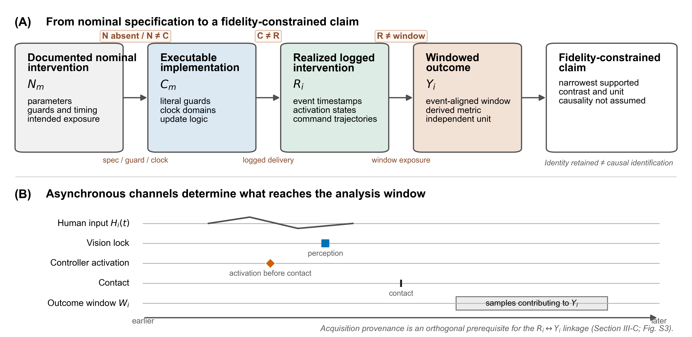
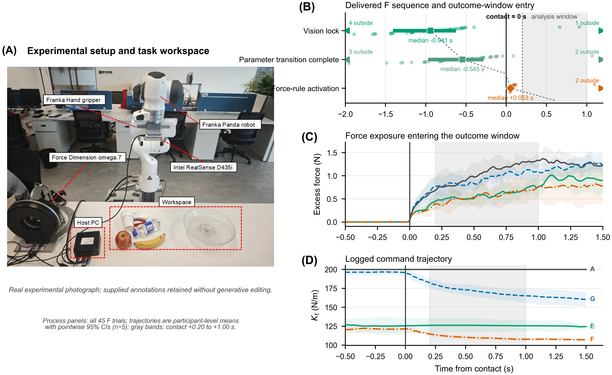
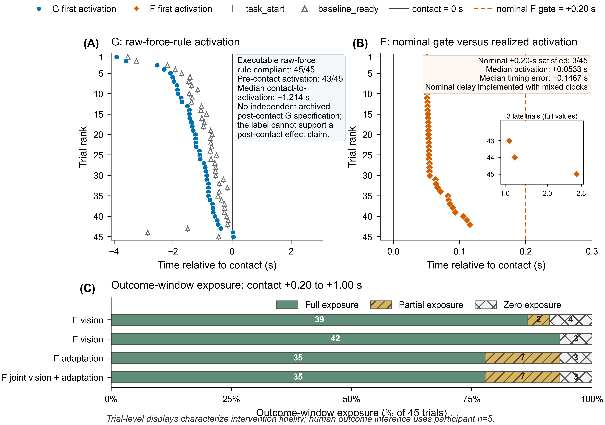
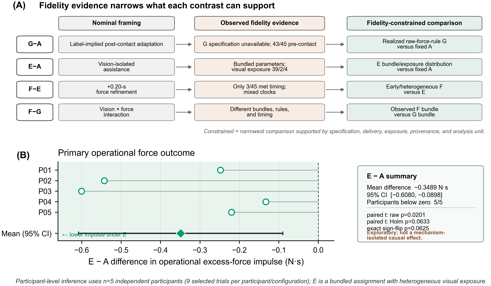

# 从名义条件标签到实际干预：异步人机实验评价的保真度约束框架

*THMS 定向中文审批稿（第三版：决策规则、内部判别验证与记录选择稳健性）*

**英文拟题：** *From Nominal Condition Labels to Realized Interventions: A Fidelity-Constrained Evaluation Framework for Asynchronous Human–Machine Experiments*

**作者与单位：** `[投稿前必须补充]`

> **审批与投稿状态。** 本稿依据冻结的清理后再分析结果和版本化方法验证形成。伦理审批或豁免机构、编号、日期及知情同意程序必须依据同期机构记录补齐：`[ETHICS RECORD REQUIRED—DO NOT SUBMIT]`。作者、单位、基金、利益冲突、作者贡献、致谢以及数据和代码可用性声明亦须在投稿前完成。上述内容不得根据现有数据推断或以一般局限替代。

## 摘要

异步人机实验常以固定、自适应、视觉使能或组合模式等标签定义条件，但标签不能证明耦合人—机器系统在结局窗口内实际经历了相应干预。本文提出实际干预保真度约束框架，以有文档支持的名义干预、源代码实现、实际记录干预和结局构成 (N_m\rightarrow C_m\rightarrow R_i\rightarrow Y_i) 证据链，并把规范可获得性、规范—实现一致性、实现—实际一致性、窗口暴露和精确采集溯源编码为机器可读证据状态。确定性规则将这些状态映射为诊断、名义干预身份是否保留、允许的比较层级及禁止措辞；保真度本身不授权因果解释。在11个预先写定期望输出的离线受控扰动中，判定器11/11准确区分完整证据链、规范缺失、守卫或时钟错配、运行时偏离、部分或零暴露、记录缺失、溯源无效及联合断点。该检查验证规则实现和内部判别，不构成外部验证。框架随后应用于5名参与者在4种存档配置下完成的180次重复遥操作试次。G在45/45次试次中遵循可执行原始力规则，却有43/45次在记录接触前激活；因独立同期接触后规范未恢复，G的名义语义不可判定。F没有接触前激活，但墙上时钟被传入基于单调时钟原点的门控计算，使名义接触后+0.20 s守卫不能可靠实现，仅3/45次达到该时序。E视觉暴露为39次完全、2次部分和4次零暴露，零暴露均由视觉锁定和参数转换晚于结局窗口造成。由此，现有证据不支持纯接触后G效应、正确门控F的增量效应或视觉×力析因解释。重建后，E捆绑配置相对A的接触后0.20–1.00 s操作性超额力冲量差为−0.3489 N·s（95% CI，−0.6080至−0.0898），5名参与者方向一致；但小样本精确检验和多重性校正不支持确认性推断。全部 (2^6=64) 种初始/替代记录选择均保持E-A均值及5名参与者方向为负。结果表明，实际干预保真度是一套限定比较身份与科学措辞的可执行推断前置程序，而不是标签后的软件附加检查。

**关键词：** 人机系统评价；实际干预保真度；异步遥操作；窗口暴露；实验有效性；数据溯源

# 1. 引言

人机闭环遥操作把人的感知、决策与适应同触觉接口、感知管线、监督控制器、远端机器人和物理环境耦合起来。接触表现不是控制器的孤立输出，而是人在反馈回路中持续行动和响应所形成的系统结局（Hannaford, 1989; Lawrence, 1993; Hokayem and Spong, 2006; Passenberg et al., 2010）。触觉引导、共享控制、视觉或语音辅助、阻抗调节及力相关学习均可能改变交互的力暴露与效率（Huang et al., 2019; Peternel et al., 2018; Abu-Dakka et al., 2018; Huang et al., 2021; Michel et al., 2023; Gong et al., 2024）。这些组成部分却常运行于不同线程、调度周期和时钟域（Walker et al., 2010; Buchli et al., 2011; Ajoudani et al., 2012; Michel et al., 2021; Peternel and Ajoudani, 2023）。因此，人机系统评价不仅要说明“分配了什么条件”，还要证明“系统实际经历了什么干预”。

模式标签通常隐含参数、守卫、事件顺序和持续时间。视觉预设应在何时可用，力相关更新由何事件允许，以及相应状态覆盖结局窗口的多少比例，均属于干预身份的一部分。名义接触前配置可能直到接触后才完成，名义接触后机制也可能提前激活。在人机闭环中，这种错位不只是机器参数误差：变化的视觉、触觉或机器反馈可能改变后续人体输入，继而改变之后的接触和结局生成过程。因此，将错位仅记为软件局限而仍按标签解释结局，会混淆名义干预、实际交付和耦合系统响应。

时延研究、机器人运行时验证、可重复性与数据血缘、实施保真度以及统计目标定义分别处理了该问题的组成部分（表I）。本文不声称替代这些路线，而是针对一个尚未被共同操作化的连接：如何把人机控制器的规范、可执行守卫、时钟、逐试次事件和窗口暴露转化为可复现的比较身份与措辞决策。该产出不是“通过/失败”分数，而是每项科学比较在当前证据下能够保留到哪一层。

**表I. 相邻方法学路线与本文的操作化连接。**

| 路线 | 主要评价对象 | 典型产出 | 本文所连接的推断步骤 |
|---|---|---|---|
| 时延与感知调度（Vogels, 2004; Rakita et al., 2020; Louca et al., 2024; Aldana-López et al., 2023） | 跨模态时延、响应与稳定性 | 时延或调度性能 | 将逐试次时序定位到明确结局窗口并计算实际暴露 |
| 机器人运行时验证（Huang et al., 2014） | 可执行命令和消息是否满足形式属性 | 属性满足/违反 | 区分“按代码执行”与“代码符合科学规范” |
| 机器人/HRI可重复性（Bonsignorio and del Pobil, 2015; Bonsignorio, 2017; Gunes et al., 2022; Bagchi et al., 2023; Marchesi et al., 2024） | 产物、过程与数据是否可追溯 | 可复现或血缘记录 | 把精确采集溯源作为 (R_i\leftrightarrow Y_i) 的正交前提 |
| 实施保真度（Carroll et al., 2007） | 计划与实际交付内容、频率和覆盖 | 交付保真度描述 | 将交付落实为守卫、时钟、事件和指令轨迹证据 |
| 统计目标定义（Lundberg et al., 2021） | 理论问题与统计量是否对应 | 预先定义的目标量 | 在不事后制造因果目标的前提下，限定描述性比较身份与措辞 |
| **本文** | **(N_m\rightarrow C_m\rightarrow R_i\rightarrow Y_i) 联合证据链** | **诊断集合、身份状态、比较层级和措辞边界** | **把保真度断点转化为可执行且可测试的解释规则** |

本文回答三个研究问题：

- **RQ1（内部判别）：** 在具有已知证据状态的离线受控扰动中，所实现的规则能否正确区分保真度断点并返回预期解释边界？
- **RQ2（案例诊断）：** 在回顾性异步遥操作案例中，名义标签、可执行逻辑、实际记录干预、窗口暴露与采集溯源呈现哪些一致和偏离模式，它们如何约束比较身份？
- **RQ3（案例示范）：** 完成保真度重建之后，现有案例数据仍支持哪些有边界的描述性结局模式？

本文贡献有三项。第一，提出四层证据链和机器可读证据状态，使规范缺失与已证实的 (N\neq C) 分开表示。第二，给出从证据状态到诊断、干预身份和科学措辞的确定性规则，并以独立保存的11个oracle案例检查实现。第三，在真实回顾性案例中联合重建守卫、时钟、事件、指令轨迹、窗口暴露和精确采集身份。5名参与者的180次重复试次只提供案例证据，不被用于声称框架已得到外部验证。

# 2. 实际干预保真度约束框架

## 2.1 名义—可执行—实际—结局证据链

一次人机实验比较表示为：

\[
N_m\rightarrow C_m\rightarrow R_i\rightarrow Y_i.
\]

(N_m)是由同期规范、协议或可追溯代码说明支持的模式 (m) 科学意图，包括预期参数、激活守卫、更新规则、事件顺序和窗口暴露；标签名称不能补足缺失的规范。(C_m)是采集程序实际实现的守卫、时钟域、初始化和更新逻辑。(R_i=\{\mathcal{E}_i,a_i(t),\boldsymbol{\theta}^{log}_i(t)\}) 是试次 (i) 中由事件、激活状态和指令参数轨迹重建的实际记录干预。(Y_i)是在明确窗口内、按声明的独立实验单位计算的结局。精确采集溯源 (\mathcal{P}_i) 单独作为把 (R_i) 连接到 (Y_i) 的数据完整性前提，而不是干预本身。

人体输入和其他可观察人机轨迹记为 (H_i(t))。它们不是控制器交付干预 (R_i) 的默认组成部分，但人可能根据由 (R_i) 改变的视觉、触觉和机器状态更新后续输入，即 (R_i(t)\rightarrow H_i(t+\delta)\rightarrow R_i(t+\delta)\) 可形成闭环。因而，提前或延迟的干预可能改变整条后续人体响应轨迹，而不只是改变一个机器参数。记录指令定义存档能够支持的软件交付证据，但不等同于独立测量的物理阻抗或完整的人—机器人状态。

**图1.** 四层证据链、机器可读证据状态与解释决策。规范可获得性、(N\rightarrow C)、(C\rightarrow R)、窗口暴露及正交溯源可以同时产生诊断；框架不把它们压缩为综合分数。名义干预身份得到保留也不自动建立因果识别。

## 2.2 时序、窗口暴露与证据状态

若名义干预规定目标激活时间 (t^{N}_{act,i})，实际记录时间为 (t^{R}_{act,i})，则：

\[
\epsilon_{act,i}=t^{R}_{act,i}-t^{N}_{act,i}.
\]

只有目标事件和公共时钟映射均有证据支持时才计算该量。软件日志时延不能在缺少传感、通信和物理响应测量时称为端到端物理时延。

对二元激活状态 (a_i(t)) 和窗口 (W=[t_0,t_1])，实际窗口暴露比例为：

\[
\Phi_i(W)=\frac{1}{|W|}\int_{t_0}^{t_1}\mathbb{I}[a_i(t)=1]dt.
\]

(\Phi_i=1)、(0<\Phi_i<1) 和 (\Phi_i=0) 分别表示完全、部分和零暴露。暴露类别描述进入结局窗口的干预，不是观察结局后删除或重分类试次的规则。

证据状态编码为：

\[
S=(s_N,s_{NC},s_{CR},s_{\Phi},s_{\mathcal P}),
\]

其中 (s_N\in\{\text{available},\text{unavailable}\})；(s_{NC}) 和 (s_{CR}\in\{\text{pass},\text{fail},\text{not evaluable}\})；(s_{\Phi}\in\{\text{full},\text{partial},\text{zero},\text{unavailable},\text{not applicable}\})；(s_{\mathcal P}\in\{\text{valid},\text{invalid}\})。缺少 (N) 时，(N\rightarrow C) 是不可评价，而不是已证实的 (N\neq C)。输出包括可并存的诊断代码、名义干预身份状态、允许的比较层级以及允许和禁止措辞。

当标签语义不能保留时，可报告实际配置间的描述性对比：

\[
D^R_{m_1,m_0}=\mathbb{E}[Y\mid R\in\mathcal{R}_{m_1}]-\mathbb{E}[Y\mid R\in\mathcal{R}_{m_0}].
\]

(D^R) 只定义存档中的描述性比较，不是观察 (R) 后重新定义的因果目标。任何因果识别仍需随机化或分配机制、可交换性、一致性、测量有效性和其他识别条件的独立支持。

## 2.3 从证据状态到解释决策

**表II. 通用证据状态、诊断和解释规则。**

| 证据状态 | 诊断后果 | 允许的比较层级 | 禁止主张 |
|---|---|---|---|
| (s_{\mathcal P}=\text{invalid}) | (R\leftrightarrow Y) 不可信 | 不评价该干预—结局对 | 连接该干预与结局的效果或描述性差异 |
| (s_N=\text{unavailable}) | 名义语义不可判定 | 可恢复实际配置及暴露分布的描述 | 未恢复名义干预的效应 |
| (N\neq C, C=R) | 实现忠实执行但名义语义不受支持 | 披露错配的实现/实际配置描述 | 名义干预或正确策略效应 |
| (C\neq R) | 运行时交付偏离 | 实际记录交付状态描述 | 可执行或名义干预效应 |
| (0<\Phi<1) | 窗口部分暴露 | 以实际暴露分布限定的分配比较 | 均匀完全暴露效应 |
| (\Phi=0) | 结局窗口无记录暴露 | 明示零暴露的分配描述 | 该窗口内的干预效应 |
| 实际记录或暴露不可获得 | (C\rightarrow R) 或窗口状态不可评价 | 实现层描述 | 名义或实际干预效应 |
| (N=C, C=R, \Phi=1, \mathcal P=\text{valid}) | 未检测到保真度断点 | 可保留名义干预身份 | 仅凭保真度宣称因果效应 |

规则以诊断集合而非互斥单标签工作。例如，守卫错配与部分暴露可同时存在；若另有溯源无效，前两项诊断仍被保留，但干预—结局比较被阻断。采集前应冻结名义规范、时钟、窗口和实验单位；采集中应保存事件、激活状态、参数轨迹和精确采集身份；推断前再运行状态判定。完整字段和判定接口见补充表S1及机器可读文件。

# 3. 方法

## 3.1 离线受控扰动与判定器验证

为检查框架是否已从概念清单转化为可执行规则，本文将上述五类状态实现为独立的 `EvidenceState` 接口。判定器只接收保真度字段，不接收结局值、效应方向、(p)值或显著性字段。预期诊断、身份状态和比较层级存储在与判定代码分离的oracle表中。

共构造11个确定性案例：完整证据链、名义规范不可获得、守卫错配、时钟域错配、实现—实际偏离、部分暴露、零暴露、实际记录不可获得、溯源无效、守卫错配加部分暴露，以及实现—实际偏离加溯源无效。验证要求每个案例的诊断集合、身份状态和比较层级与oracle完全一致；联合断点不能被后出现的状态覆盖，溯源无效必须阻断干预—结局比较。该过程是规则实现的内部判别检查，不测试真实世界故障发生率、检测灵敏度或跨系统外部适用性。

## 3.2 人机系统、参与者与实验结构

实验平台由人类操作者、Force Dimension Omega.7主端触觉设备、监督控制器、Intel RealSense D435i视觉通道、Franka Emika Panda机器人与Franka Hand夹爪及物理对象组成。Omega.7增量平移输入经3倍缩放和符号映射形成机器人笛卡尔位置目标；Panda内部外部力估计 `O_F_ext_hat_K` 同时用于接触检测、触觉反馈和力结局。它不是独立外部力/力矩传感器，记录刚度也未被独立验证为物理闭环阻抗。

5名参与者完成4种存档配置（A/G/E/F）下的参与者内重复测量：5名参与者×3种材料×3个重复区组×4种配置，共180次分析试次。每种配置45次。重复试次提高参与者内表征精度，独立人体实验单位仍为参与者（(n=5)）。`task_start`表示系统就绪而非人体运动起点。参与者人口学、训练、对象几何和前瞻性随机化/平衡顺序尚未从当前血缘恢复；伦理信息必须在投稿前由机构记录补齐。

**图2.** 真实实验场景及F试次从视觉锁定、参数转换、接触到力规则激活的过程证据。力和刚度曲线先在参与者内汇总，再对5名参与者求均值；记录刚度不是独立物理阻抗测量。

## 3.3 名义配置、实际干预与结局窗口

A为固定记录配置。G使用无视觉的原始力相关刚度更新器；可执行代码没有基线或接触守卫，且现有血缘没有恢复独立同期的“接触后G”名义规范。E由首次有效视觉锁定选择材料相关预设，同时改变平移/旋转刚度、阻尼、触觉反馈和夹爪力。F在E基础上加入有源码说明支持的名义接触后+0.20 s力相关细化。E/F均为多参数捆绑，A/G/E/F不能解释为清晰的2×2析因设计。

事件和CSV `system_time` 位于相对于 `time.perf_counter()` 原点的单调时间线。F主循环却把 `time.time()` 墙上时钟传入更新器，更新器再执行 `system_time(now)-contact_t`。这使名义延迟判断混合不相容时钟域，在接触事件存在后基本立即通过；实测约53 ms首次激活是其后视觉锁定、转换状态、更新周期和日志采样共同形成的实际时序，不是时钟差直接生成的53 ms延迟。完整源码调用链和代表性轨迹见补充材料。

接触阈值为 (T_i=\max(1.0\,\mathrm{N},\mu_{0,i}+3\sigma_{0,i}))，并要求连续越阈0.050 s。主要操作性力暴露结局为接触后0.20–1.00 s阈值参照超额力冲量：

\[
I_{excess,i}^{0.2:1.0}=\int_{0.20}^{1.00}\max[F_i(t_c+\tau)-T_i,0]d\tau.
\]

接触对齐和结局均来自同一Panda内部力估计，因此两者不是独立传感证据，可能共享测量误差；该指标不能等同于独立测量的物理安全性。窗口未前瞻性预注册，结局分析属于探索性。暴露类别不用于删除试次。

## 3.4 溯源、统计与记录选择稳健性

存档含186条采集记录，对应180个逻辑试次键；6个键各有一条初始记录和一条替代记录。冻结清单以不读取结局字段的身份规则选择记录，全部初始和替代记录只读保留。同期故障依据及最初替换判断是否发生于查看结局之前未恢复。

先在每名参与者、每种配置内对9次试次求平均，再形成参与者层面对比。报告均值差、自由度4的 (t) 分布95%置信区间、双侧配对 (t) 检验、全部 (2^5) 种符号分配的精确双侧符号翻转检验及精确Wilcoxon敏感性；4项对比进行Holm校正。(n=5) 时，5个方向完全一致的最小双侧精确 (p) 值仍为0.0625。

记录选择稳健性另外枚举6组初始/替代记录的全部 (2^6=64) 种组合，保持180个逻辑试次、参与者内聚合和4项对比不变。初始记录已被标记为错误，因此这些组合不是同等有效的替代数据集；该分析只评价潜在记录选择对方向和幅度的影响，不改变主分析清单。

# 4. 结果

## 4.1 RQ1：离线受控扰动的内部判别

判定器在11/11个案例中与预先写定的oracle完全一致。完整证据链保留名义干预身份但仍返回“因果识别在框架之外”的边界；规范缺失与 (N\neq C) 被分开；守卫和时钟错配均定位到 (N\rightarrow C)，运行时偏离定位到 (C\rightarrow R)；部分和零暴露产生不同比较层级。两个联合案例保留全部适用诊断，溯源无效优先阻断干预—结局比较。`EvidenceState` 不包含结局、效应方向或显著性字段。

该结果证明已实现规则能够在定义好的状态空间内执行预期区分，但不证明状态定义完备、真实日志中的每类断点均可观察，或框架可直接推广到其他系统。

## 4.2 RQ2：回顾性案例的保真度状态与解释边界

A在45/45次试次中保持固定记录指令。G在45/45次试次中遵循可执行的1 N死区原始力规则，但43/45次在记录接触前激活。由于接触后G的独立同期名义规范不可获得，G被编码为 (s_N=\text{unavailable})，而不是把标签暗示反推为已证实的 (N\neq C)。

F没有试次在接触前激活，但仅3/45次达到名义接触后+0.20 s时序；42/45次早于该目标。接触至首次激活中位数为+0.0533 s，时序误差中位数为−0.1467 s。源码签名验证了墙上时钟输入、单调时钟原点和混合域门控调用链，因此F属于 (N\neq C) 的时钟实现错配。现有分析不另行声称 (C\neq R)，因为日志没有被证明违背混合时钟代码实际会产生的判断。

E视觉暴露为39次完全、2次部分和4次零暴露。4次零暴露的视觉锁定发生于接触后1.072–1.434 s，参数转换完成于接触后1.501–1.807 s，均晚于结局窗口终点。两次部分暴露比例分别为0.9669和0.00115；后者的转换完成时间为接触后约0.9991 s，故只有极短窗口重叠。F视觉暴露为42次完全和3次零暴露；F自适应及联合暴露均为35次完全、7次部分和3次零暴露。

全部180条清理后记录具有同源CSV、事件JSON和摘要JSON，540个文件哈希通过，因而当前 (R_i\leftrightarrow Y_i) 连接有效。表III给出案例比较的保真度约束措辞。

**表III. 案例证据与保真度约束的比较身份。**

| 比较 | 关键状态 | 允许表述 | 禁止表述 |
|---|---|---|---|
| G-A | G规范不可获得；代码无接触守卫；43/45接触前激活 | 以预激活为主的原始力规则G分配相对固定A的描述性差异 | 纯接触后力自适应效应 |
| E-A | 多参数捆绑；视觉暴露39完全/2部分/4零 | E分配及异质实际视觉暴露分布相对A的描述性差异 | 单独视觉、刚度或其他成分的因果效应 |
| F-E | 混合时钟；仅3/45达到名义时序；暴露异质 | 实际早期激活且暴露异质的F分配相对E的描述性差异 | 正确执行+0.20 s策略的增量效应 |
| F-G | 视觉、力规则、参数捆绑和时序均不同 | 两种实际捆绑及暴露分布之间的描述性差异 | 视觉主效应、力主效应或视觉×力交互 |

**图3.** G与F首次激活时序及E/F窗口暴露。试次级结果用于描述交付保真度；人体结局推断始终使用参与者 (n=5)。

## 4.3 RQ3：保真度重建后的示范性结局

E-A操作性超额力冲量均值差为−0.3489 N·s（95% CI，−0.6080至−0.0898；配对 (t) 检验 (p=0.0201)），5名参与者均为负。精确符号翻转和Wilcoxon检验均为 (p=0.0625)；4项对比Holm校正后，配对 (t) 检验为0.0633，两种精确检验均为0.2500。因此，该估计只构成方向一致的探索性E捆绑配置模式，不是确认性或单成分因果证据。

全部64种初始/替代记录选择中，E-A均值均为负，范围−0.353791至−0.336697 N·s，且64/64种选择均保持5名参与者方向为负。F-E均值同样在64/64种选择中为负（−0.067805至−0.000304 N·s），但每种仅2–3名参与者为负，不能据此声称稳定方向。完整4项对比结果见补充表S6。

四个固定相邻窗口中的E-A差值均为负，留一参与者后的5个估计亦均为负；这些检查不增加独立样本量。E同时伴随更长的系统就绪至接触间隔和总任务时间，但前者不是人体运动起点后的接近时间。G-A、F-E和F-G只描述实际捆绑配置，不能回答正确接触门控、正确+0.20 s细化或视觉×力交互的效果。详细窗口、LOPO及次要指标结果移至补充材料。

**图4.** （A）四项标签比较经规范、实现、实际交付和暴露证据收窄为保真度约束的描述性比较；（B）主要E-A操作性超额力冲量的5名参与者配对差。图中结果不代表单独视觉或刚度机制的因果效应。

# 5. 讨论

## 5.1 方法学贡献与人机系统意义

本文的新增方法不是把既有概念简单并列，而是提供从证据对象到解释后果的可执行接口：守卫、时钟、事件、轨迹、暴露和溯源被编码为状态，状态产生可并存诊断，并进一步决定名义身份能否保留及比较必须停在哪一层。11个oracle案例表明该规则已经可以被机器执行和反例测试；真实案例则展示规范缺失、实现错配、时序后果、暴露异质和溯源前提如何在同一采集中共存。

在人机闭环里，实际交付尤其重要。操作者会依据机器反馈改变后续输入，因而提前0.8 s激活不只是一个静态参数误差，还可能改变随后的人体响应和接触轨迹。框架因此把人体输入 (H_i(t)) 放在事件背景和反馈路径中，同时避免在没有有效行为定义时把任意主端轨迹解释为意图或策略。该原则也可用于驾驶自动化、共享控制、辅助机器人和其他异步闭环系统，但跨任务适用性仍需独立验证。

## 5.2 对实验设计、采集与报告的启示

采集前应冻结带版本的名义规范、守卫、时钟域、结局窗口和独立实验单位。若目标是析因比较，各配置除目标因素外应保持可解释的一致性。采集中应记录人体输入、感知事件、激活状态、指令参数、机器/环境事件、时钟域和精确采集身份。推断前应在不读取结局方向的条件下运行 (N\rightarrow C)、(C\rightarrow R)、窗口暴露及正交溯源检查。

框架的“完全通过”只表示未检测到干预身份断点，不表示随机化正确、测量独立、样本充足或因果识别成立。相反，一个系统可能45/45次严格执行错误的实现；G正说明可执行一致性不能替代名义语义。F则说明源码注释中的0.20 s目标不能替代时钟域和实际轨迹证据。

## 5.3 局限与外部验证需求

离线受控扰动由本文状态定义和规则边界构造，因此只能验证实现是否忠实执行这些规则，不能证明状态空间完备或检测器在未知真实故障上具有灵敏度。框架仅在一个存档遥操作系统中得到回顾性操作化，未在其他系统中外部验证。案例只有5名参与者，结局窗口为回顾性选择，随机化或平衡顺序未恢复，E/F又是多参数捆绑；因此结局只作示范性描述。

接触检测、触觉反馈和力结局共享Panda内部力估计，事件对齐与结局可能共享测量误差。记录刚度不是物理闭环阻抗，物体身份、姿态和放置信息不完整，软件成功也没有视频或人工裁决。6组替换记录的同期故障依据及是否在查看结局前作出判断仍未知；64组合稳健性不能使错误初始记录重新成为有效观测。

前瞻性外部验证应在采集前冻结统一时钟的名义规范和判定oracle，在多个任务或平台中注入已知故障与正常状态，并由独立于结果分析的流程评价诊断正确率。该目标应与某一控制器效果检验分开。伦理审批/豁免和知情同意信息则是当前投稿的硬性前置条件，不能以局限声明代替。

# 6. 结论

名义条件标签不能独立证明异步人机系统实际经历了相应干预。本文把 (N_m\rightarrow C_m\rightarrow R_i\rightarrow Y_i) 证据链转化为机器可读状态和确定性解释规则，并用11个离线扰动检查其内部判别行为。回顾性案例进一步表明，规范缺失、守卫或时钟错配、实际时序、窗口暴露和精确溯源会共同决定一项比较能够支持的最窄描述。该框架不通过删除试次或事后重定义因果目标修复实验，而是在统计分析前明确干预身份、评价边界和禁止措辞。对闭环人机系统而言，只有重建实际干预并验证干预—结局连接，条件标签才能成为有证据支持的推断对象。

# 参考文献

1. Hannaford, B. (1989). A design framework for teleoperators with kinesthetic feedback. *IEEE Transactions on Robotics and Automation, 5*(4), 426–434. https://doi.org/10.1109/70.88057
2. Lawrence, D. A. (1993). Stability and transparency in bilateral teleoperation. *IEEE Transactions on Robotics and Automation, 9*(5), 624–637. https://doi.org/10.1109/70.258054
3. Hokayem, P. F., & Spong, M. W. (2006). Bilateral teleoperation: An historical survey. *Automatica, 42*(12), 2035–2057. https://doi.org/10.1016/j.automatica.2006.06.027
4. Passenberg, C., Peer, A., & Buss, M. (2010). A survey of environment-, operator-, and task-adapted controllers for teleoperation systems. *Mechatronics, 20*(7), 787–801. https://doi.org/10.1016/j.mechatronics.2010.04.005
5. Huang, K., Chitrakar, D., Rydén, F., & Chizeck, H. J. (2019). Evaluation of haptic guidance virtual fixtures and 3D visualization methods in telemanipulation—A user study. *Intelligent Service Robotics, 12*, 289–301. https://doi.org/10.1007/s11370-019-00283-w
6. Rakita, D., Mutlu, B., & Gleicher, M. (2020). Effects of onset latency and robot speed delays on mimicry-control teleoperation. In *Proceedings of the 2020 ACM/IEEE International Conference on Human-Robot Interaction*. https://doi.org/10.1145/3319502.3374838
7. Louca, J., Eder, K., Vrublevskis, J., & Tzemanaki, A. (2024). Impact of haptic feedback in high latency teleoperation for space applications. *ACM Transactions on Human-Robot Interaction, 13*(2), Article 16, 1–21. https://doi.org/10.1145/3651993
8. Gong, Y., Mat Husin, H., Erol, E., Ortenzi, V., & Kuchenbecher, K. J. (2024). AiroTouch: Enhancing telerobotic assembly through naturalistic haptic feedback of tool vibrations. *Frontiers in Robotics and AI, 11*, 1355205. https://doi.org/10.3389/frobt.2024.1355205
9. Hogan, N. (1985). Impedance control: An approach to manipulation: Part I—Theory. *Journal of Dynamic Systems, Measurement, and Control, 107*(1), 1–7. https://doi.org/10.1115/1.3140702
10. Walker, D. S., Wilson, R. P., & Niemeyer, G. (2010). User-controlled variable impedance teleoperation. In *2010 IEEE International Conference on Robotics and Automation*. https://doi.org/10.1109/ROBOT.2010.5509811
11. Buchli, J., Stulp, F., Theodorou, E., & Schaal, S. (2011). Learning variable impedance control. *The International Journal of Robotics Research, 30*(7), 820–833. https://doi.org/10.1177/0278364911402527
12. Ajoudani, A., Tsagarakis, N. G., & Bicchi, A. (2012). Tele-impedance: Teleoperation with impedance regulation using a body–machine interface. *The International Journal of Robotics Research, 31*(13), 1642–1656. https://doi.org/10.1177/0278364912464668
13. Peternel, L., Petrič, T., & Babič, J. (2018). Robotic assembly solution by human-in-the-loop teaching method based on real-time stiffness modulation. *Autonomous Robots, 42*, 1–17. https://doi.org/10.1007/s10514-017-9635-z
14. Abu-Dakka, F. J., Rozo, L., & Caldwell, D. G. (2018). Force-based variable impedance learning for robotic manipulation. *Robotics and Autonomous Systems, 109*, 156–167. https://doi.org/10.1016/j.robot.2018.07.008
15. Abu-Dakka, F. J., & Saveriano, M. (2020). Variable impedance control and learning—A review. *Frontiers in Robotics and AI, 7*, 590681. https://doi.org/10.3389/frobt.2020.590681
16. Michel, Y., Rahal, R., Pacchierotti, C., Robuffo Giordano, P., & Lee, D. (2021). Bilateral teleoperation with adaptive impedance control for contact tasks. *IEEE Robotics and Automation Letters, 6*(3), 5429–5436. https://doi.org/10.1109/LRA.2021.3066974
17. Peternel, L., & Ajoudani, A. (2023). After a decade of teleimpedance: A survey. *IEEE Transactions on Human-Machine Systems, 53*(2), 401–416. https://doi.org/10.1109/THMS.2022.3231703
18. Michel, Y., Li, Z., & Lee, D. (2023). A learning-based shared control approach for contact tasks. *IEEE Robotics and Automation Letters, 8*(12), 8002–8009. https://doi.org/10.1109/LRA.2023.3322332
19. Huang, Y.-C., Abbink, D. A., & Peternel, L. (2021). A semi-autonomous tele-impedance method based on vision and voice interfaces. In *2021 20th International Conference on Advanced Robotics*, 180–186. https://doi.org/10.1109/ICAR53236.2021.9659427
20. Siegemund, G., Díaz Rosales, A., Glodde, A., Dietrich, F., & Peternel, L. (2024). Semi-autonomous teleimpedance based on visual detection of object geometry and material and its relation to environment. In *2024 IEEE-RAS 23rd International Conference on Humanoid Robots*, 779–786. https://doi.org/10.1109/Humanoids58906.2024.10769858
21. Jekel, H. H. A., Díaz Rosales, A., & Peternel, L. (2026). Visio-verbal teleimpedance interface: Enabling semi-autonomous control of physical interaction via eye tracking and speech. *Frontiers in Robotics and AI, 13*, 1749105. https://doi.org/10.3389/frobt.2026.1749105
22. Vogels, I. M. L. C. (2004). Detection of temporal delays in visual-haptic interfaces. *Human Factors, 46*(1), 118–134. https://doi.org/10.1518/hfes.46.1.118.30394
23. Bonsignorio, F., & del Pobil, A. P. (2015). Toward replicable and measurable robotics research [From the Guest Editors]. *IEEE Robotics & Automation Magazine, 22*(3), 32–35. https://doi.org/10.1109/MRA.2015.2452073
24. Bonsignorio, F. (2017). A new kind of article for reproducible research in intelligent robotics [From the Field]. *IEEE Robotics & Automation Magazine, 24*(3), 178–182. https://doi.org/10.1109/MRA.2017.2722918
25. Gunes, H., Broz, F., Crawford, C. S., Rosenthal-von der Pütten, A., Strait, M., & Riek, L. (2022). Reproducibility in human-robot interaction: Furthering the science of HRI. *Current Robotics Reports, 3*(4), 281–292. https://doi.org/10.1007/s43154-022-00094-5
26. Aldana-López, R., Aragüés, R., & Sagüés, C. (2023). Latency vs precision: Stability preserving perception scheduling. *Automatica, 155*, 111123. https://doi.org/10.1016/j.automatica.2023.111123
27. Bagchi, S., Holthaus, P., Beraldo, G., Senft, E., Hernandez, D., Han, Z., Jayaraman, S. K., Rossi, A., Esterwood, C., Andriella, A., & Pridham, P. S. (2023). Towards improved replicability of human studies in human-robot interaction. In *Companion of the 2023 ACM/IEEE International Conference on Human-Robot Interaction*. https://doi.org/10.1145/3568294.3580162
28. Marchesi, S., De Tommaso, D., Kompatsiari, K., Wu, Y., & Wykowska, A. (2024). Tools and methods to study and replicate experiments addressing human social cognition in interactive scenarios. *Behavior Research Methods, 56*(7), 7543–7560. https://doi.org/10.3758/s13428-024-02434-z
29. Huang, J., Erdogan, C., Zhang, Y., Moore, B., Luo, Q., Sundaresan, A., & Roşu, G. (2014). ROSRV: Runtime verification for robots. In *Runtime Verification* (Lecture Notes in Computer Science, Vol. 8734, pp. 247–254). Springer. https://fsl.cs.illinois.edu/publications/huang-erdogan-zhang-moore-luo-sundaresan-rosu-2014-rvtool.html
30. Carroll, C., Patterson, M., Wood, S., Booth, A., Rick, J., & Balain, S. (2007). A conceptual framework for implementation fidelity. *Implementation Science, 2*, 40. https://doi.org/10.1186/1748-5908-2-40
31. Lundberg, I., Johnson, R., & Stewart, B. M. (2021). What is your estimand? Defining the target quantity connects statistical evidence to theory. *American Sociological Review, 86*(3), 532–565. https://doi.org/10.1177/00031224211004187
