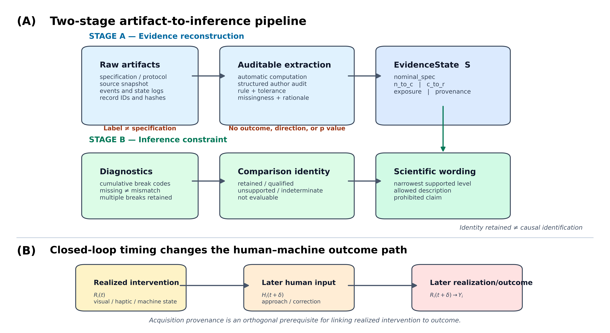
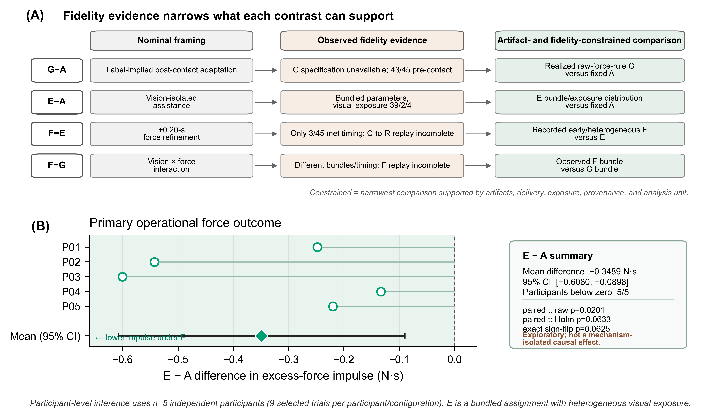

# 从名义条件标签到实际干预：异步人机实验评价的保真度约束框架

*THMS 定向中文审批稿（第四版：证据重建、规则级实现核验与解释约束）*

**English title:** *From Nominal Condition Labels to Realized Interventions: A Fidelity-Constrained Evaluation Framework for Asynchronous Human–Machine Experiments*

> **审批与投稿状态。** 本稿依据冻结的清理后再分析、版本化证据重建和规则级实现核验形成。伦理审批或豁免机构、编号、日期及知情同意程序必须依据同期机构记录补齐：`[ETHICS RECORD REQUIRED—DO NOT SUBMIT]`。作者、单位、基金、利益冲突、作者贡献、致谢以及数据和代码可用性声明亦须在投稿前完成。上述内容不得根据现有数据推断。

## 摘要

异步人机实验常以固定、自适应、视觉使能或组合模式等标签定义条件，但标签不能证明耦合人—机器系统在结局窗口内实际经历了相应干预。本文提出两级实际干预保真度约束框架。第一阶段把同期规范、存档源码、事件、日志轨迹和采集溯源重建为五字段机器可读证据状态；第二阶段以确定性规则把状态映射为可并存诊断、名义身份状态、允许的比较层级及禁止措辞。一个名义条件标签不能替代可恢复的干预规范，保真度通过也不单独授权因果解释。在12个预先冻结期望输出的受控工件案例中，两级实现12/12返回预期状态与解释边界；该结果仅是规则级实现核验和内部判别检查，不构成方法学或外部验证。框架随后应用于5名参与者在4种存档配置下完成的180次重复遥操作试次。G的接触后名义规范不可恢复；F的0.20 s守卫存在时钟域错配，实际激活与暴露可恢复，但完整实现—实际谓词重放不可评价；E视觉暴露为39次完全、2次部分和4次零暴露。由此，现有证据不支持纯接触后G效应、正确门控F的增量效应或视觉×力析因解释。作为示范性结果，E捆绑配置相对A的接触后0.20–1.00 s操作性超额力冲量差为−0.3489 N·s，5名参与者方向一致，但小样本精确检验和多重性校正不支持确认性推断。该框架提供一条可审计的原始证据—状态—解释链，用于在统计分析前限定比较身份和科学措辞。

**关键词：** 人机系统；实际干预；实现保真度；异步控制；遥操作；证据溯源；可复现性

# 1. 引言

遥操作和其他闭环人机实验往往比较固定、视觉辅助、力自适应或组合控制条件 [1]–[20]。论文中的条件标签通常被直接当作受试者实际经历的干预身份，但异步视觉、控制、事件检测和日志通道可能改变干预的启动顺序、持续时间和窗口覆盖。一个配置被命名为“接触后”“视觉使能”或“视觉+力”，并不证明相应守卫、时钟、参数更新和暴露在每个试次中真实成立。

这一问题在人机系统中特别关键。实际干预 (R_i(t)) 改变视觉、触觉或机器状态后，人会更新后续输入 (H_i(t+\delta))，进而改变后续机器状态和完整结局生成过程：

\[
R_i(t)\rightarrow H_i(t+\delta)\rightarrow R_i(t+\delta)\rightarrow Y_i.
\]

因此，提前0.8 s激活并非只把一个机器参数前移，而可能改变人的接近、接触和修正轨迹。该原则也可迁移至其他人处于闭环中的异步系统，但本文的操作化与证据来自遥操作案例。

已有研究分别讨论遥操作透明度与时延 [1]–[8]、可变阻抗 [9]–[20]、视觉—触觉时序 [22]、机器人研究可复现性 [23]–[28]、运行时验证 [29]、实现保真度 [30] 和目标量定义 [31]。本文不把这些概念并列为新理论，而是补上一个可执行接口：把实验工件重建为证据状态，再把证据状态转化为比较身份和科学措辞边界。

**表I. 与相邻研究路线的关系。**

| 路线 | 已有主要产出 | 本文新增操作 |
|---|---|---|
| 遥操作时延与透明度 | 稳定性、感知和性能后果 | 把时钟域与窗口交付作为干预身份证据 |
| 运行时验证 | 对形式化属性进行在线或离线监测 | 把规范、源码、事件、轨迹和溯源连为实验评价状态 |
| 实现保真度 | 计划干预与实际实施的一致性概念 | 给出机器可读状态、累积诊断和措辞边界 |
| 可复现研究 | 工件、代码和过程透明 | 检查精确记录身份及干预—结局连接 |
| 目标量定义 | 理论问题和统计量的对应 | 不事后制造因果目标，只限定可支持的描述性比较 |

本文回答三个问题：

- **RQ1（规则级实现核验）：** 对具有冻结原始工件和期望输出的受控案例，两级实现能否正确完成工件—状态—解释映射？
- **RQ2（案例诊断）：** 回顾性案例呈现哪些规范、实现、交付、暴露或溯源断点，它们如何限制比较身份？
- **RQ3（案例示范）：** 保真度重建后，现有数据还支持哪些有边界的描述性结局模式？

本文贡献有三项。第一，提出 `ArtifactEvidence` 与 `EvidenceState` 两级机器可读接口，使“谁依据什么工件赋予状态”可被审计。第二，给出从五字段状态到诊断、身份、比较层级和措辞边界的确定性规则。第三，在一个真实存档人机系统中联合重建规范、源码、时钟、事件、指令轨迹、窗口暴露及180条精确采集身份。案例证据不被用于声称框架已经外部验证。

# 2. 实际干预保真度约束框架

## 2.1 两级框架

一次比较的科学证据链表示为：

\[
N_m\rightarrow C_m\rightarrow R_i\rightarrow Y_i,
\]

其中 (N_m) 是有同期工件支持的名义干预，(C_m) 是存档采集程序的可执行实现，(R_i) 是试次 (i) 的实际记录干预，(Y_i) 是冻结窗口和实验单位上的结局。采集溯源 (\mathcal P_i) 是连接 (R_i) 与 (Y_i) 的正交前提，不是干预的一部分。

框架分为两个阶段：

\[
\underbrace{\{\text{specification, source, events, logs, lineage}\}
\longrightarrow S}_{\text{Stage A: evidence reconstruction}}
\longrightarrow
\underbrace{\{\text{diagnosis, identity, comparison, wording}\}}_{\text{Stage B: inference constraint}}.
\]

第一阶段回答“证据状态如何得到”；第二阶段回答“该状态允许怎样解释”。二者均不读取人体结局方向、效应量、(p)值或显著性。

**图1.** 原始工件先经自动计算或结构化作者审计重建为五字段证据状态，再由确定性规则生成诊断、身份和科学措辞边界。人机闭环使干预时序能够改变后续人体输入；溯源是实际干预—结局连接的正交前提。完全通过只保留名义身份，不自动建立因果识别。

## 2.2 Stage A：原始工件到证据状态

`ArtifactEvidence` 记录评价单元、配置、试次、结局窗口、工件路径和SHA-256、采集代码提交、规则编号、提取方式、观察值、单位、容差、缺失状态与判定理由；所得 `EvidenceState` 使用 `nominal_spec`、`n_to_c`、`c_to_r`、`exposure` 和 `provenance` 五个核心字段。提取方式只有 `automatic` 和 `structured_author_audit`。前者用于时序、轨迹、暴露、身份与哈希；后者用于名义规范是否充分以及规范—源码的语义对应。本研究没有执行双人独立语义复核，因此不报告审计者一致性。

证据状态为：

\[
S=(s_N,s_{NC},s_{CR},s_{\Phi},s_{\mathcal P}).
\]

状态操作定义如下。

1. (s_N) 只有在同期、版本化且可追溯的工件明确规定参数、守卫、时序或预期暴露时为 `available`。**名义条件标签不能替代可恢复的干预规范。**
2. (s_{NC}) 在 (N) 缺失时为 `not_evaluable`；(N) 存在时逐项核对守卫、时钟、参数、初始化和更新规则。任一已证实错配即为 `fail`，所有适用错配均保留。
3. (s_{CR}) 只有从记录输入完整重放实现逻辑且与日志状态/命令轨迹匹配时为 `pass`；已证实偏离为 `fail`；无法完成重放为 `not_evaluable`。
4. (s_\Phi) 依据完整、单调的状态轨迹在冻结窗口内作左连续积分。轨迹或窗口不完整时为 `unavailable`，不能填为零暴露。
5. (s_{\mathcal P}) 仅当记录身份、路径、时间戳、采集提交和当前哈希全部完整且精确匹配时为 `valid`；缺失或错配为 `invalid`。

对二元激活状态 (a_i(t)) 和窗口 (W=[t_0,t_1])：

\[
\Phi_i(W)=\frac{1}{|W|}\int_{t_0}^{t_1}\mathbb{I}[a_i(t)=1]dt.
\]

(\Phi\le10^{-12})、(10^{-12}<\Phi<1-10^{-12}) 和 (\Phi\ge1-10^{-12}) 分别编码为 `zero`、`partial` 和 `full`；(10^{-12}) 仅为浮点边界，不是科学容差。因此，约1 ms的窗口重叠仍是部分暴露。参数比较容差只表示日志软件命令分辨率，不表示物理阻抗精度：平动刚度0.5 N/m、转动刚度0.05 N·m/rad、阻尼比/力反馈增益/死区/尺度0.005、夹爪速度0.0005 m/s、夹爪力0.05 N。

配置级 (N) 与 (N\rightarrow C) 审计按配置连接至试次级 (C\rightarrow R)、暴露和溯源结果。只要工件版本相同，配置级语义审计不因试次结局而改变；试次级状态则可随实际轨迹和记录完整性变化。完整规则见补充表S1，真实工件审计见补充表S2。

## 2.3 Stage B：证据状态到解释约束

第二阶段输出诊断代码集合、名义身份状态、允许比较层级、允许/禁止措辞，以及固定的 `outside_fidelity_framework` 因果边界。它不产生综合保真度分数。

**表II. 通用状态—解释规则。**

| 状态 | 诊断后果 | 允许层级 | 禁止主张 |
|---|---|---|---|
| (s_{\mathcal P}=invalid) | 干预—结局连接不可信 | 不评价该配对 | 连接该干预和结局的任何差异或效应 |
| (s_N=unavailable) | 名义语义不可判定 | 可恢复实际配置和暴露描述 | 未恢复名义干预的效应 |
| (s_{NC}=fail, s_{CR}=pass) | 实现忠实执行但偏离名义规范 | 披露错配的实现/实际配置 | 名义干预或正确策略效应 |
| (s_{CR}=fail) | 运行时交付偏离 | 实际记录交付状态 | 可执行或名义干预效应 |
| (s_{CR}=not\_evaluable, s_\Phi\text{已知}) | 实际轨迹/暴露可描述，但实现忠实性未知 | 记录实际配置与暴露 | (C=R) 或名义干预已交付 |
| (s_{CR}=not\_evaluable, s_\Phi=unavailable) | 交付与暴露均不可评价 | 仅实现层描述 | 名义或实际干预效应 |
| (0<\Phi<1) | 窗口部分暴露 | 暴露分布限定的分配比较 | 均匀完全暴露效应 |
| (\Phi=0) | 窗口内无记录暴露 | 明示零暴露的分配描述 | 该窗口内干预效应 |
| 全部通过 | 未检测到身份断点 | 保留名义干预身份 | 仅凭保真度声称因果效应 |

多个断点可以并存。例如守卫和时钟错配可同时保留；若另有溯源无效，前述诊断仍输出，但干预—结局比较被阻断。

当名义语义不能保留时，可报告实际配置间的描述性对比：

\[
D^R_{m_1,m_0}=\mathbb{E}[Y\mid R\in\mathcal R_{m_1}]-\mathbb{E}[Y\mid R\in\mathcal R_{m_0}].
\]

(D^R) 是存档实际配置的描述性比较，不是观察 (R) 后重新定义的因果estimand。任何因果识别仍需分配机制、可交换性、一致性、测量有效性和推断单位等独立支持。

# 3. 方法

## 3.1 受控工件扰动与规则级实现核验

两级接口分别实现为 `ArtifactEvidence→EvidenceState` 和 `EvidenceState→Decision`。输入、期望状态和期望决策存储在与执行代码分离的冻结oracle表中。原v3的11类边界被保留，并新增“(C\rightarrow R)不可完整重放但窗口暴露可恢复”案例，共12例。

案例覆盖：完整链、只有标签而规范缺失、守卫错配、时钟错配、运行时交付偏离、约1 ms部分暴露、零暴露、轨迹与暴露不可获得、溯源无效、守卫错配加部分暴露、运行时偏离加无效溯源，以及守卫/时钟联合错配加不可重放但已知部分暴露。要求所有期望状态、累积诊断、身份和比较层级完全一致。该测试仅核验实现忠实执行已声明规则并能在规则空间内被反例检查；不测量未知真实故障的灵敏度、状态空间完备性或跨系统效度。

## 3.2 人机系统、参与者和实验结构

存档系统由Omega.7人体输入设备、Franka Panda机械臂、RGB视觉进程、阻抗/力反馈更新和异步日志组成。5名参与者在3种材料、3个重复区组和4种配置下完成180次分析试次：A/G/E/F各45次。重复试次不增加独立人体单位，统计单位始终为参与者（(n=5)）。参与者人口学、训练、对象几何、前瞻性随机化或平衡顺序尚未从当前血缘恢复。

A为固定命令配置；G执行无视觉的原始力在线规则；E由首次有效视觉锁定触发多参数捆绑配置；F在E基础上加入名义接触后0.20 s的力微调。接触由Panda内部 `O_F_ext_hat_K` 估计产生，操作性超额力冲量也使用该通道。因此事件对齐和结局可能共享测量误差，不能解释为独立物理安全传感证据。

## 3.3 真实工件重建

所有试次指向采集提交 `09c13e0b679905f14f770d820af00841546cb4cc`。配置级语义审计使用该提交的源码快照；试次级自动计算使用180条主清单、原始CSV、事件JSON、摘要JSON、日志状态及当前SHA-256。

对A，固定命令向量与源码初始化匹配，并在45次轨迹中按分辨率容差检查。对G，没有独立同期工件支持“接触后”规范，故 (s_N=unavailable)，而不是根据标签宣称 (N\neq C)。G的可执行公式在45次试次的12,196个记录命令更新处重放，力比、目标平动刚度和0.3平滑更新的最大误差均小于 (10^{-10})，故记录输入支持 (s_{CR}=pass)。

对E，首次视觉锁定、类别—配置映射、立即命令及平滑转换与可恢复规范一致；实际视觉配置暴露按转换完成状态积分。对F，源码把 `time.time()` 传入以 `time.perf_counter()` 为原点的 `system_time()`，所以名义0.20 s守卫语义被破坏，(s_{NC}=fail, detail=clock)。F的激活和暴露轨迹能够重建，但没有逐周期保存足以完整重放所有融合谓词的输入，故保守编码为 (s_{CR}=not\_evaluable)，而不是 `pass` 或 `fail`。

若目标激活 (t^N_{act}) 和公共时钟映射均有支持，定义时序误差 (\epsilon_{act}=t^R_{act}-t^N_{act})。F中该量用于描述名义目标与实际时间之差；约53 ms是其他守卫、调度、状态条件和日志采样共同形成的实际激活时间，不是混合时钟数值上“产生的53 ms延迟”。

## 3.4 结局和统计

主要结局是接触后0.20–1.00 s的操作性阈值以上力冲量。每名参与者先在材料和重复区组内聚合，再计算配置配对差。报告参与者均值、t型95%置信区间、配对t检验、精确符号翻转、精确Wilcoxon及4项比较Holm校正。由于只有5名参与者，精确检验最小双侧边界为0.0625；结果不作为确认性证据。

记录选择稳健性枚举6组初始/替代记录的全部 (2^6=64) 种选择，保持180个逻辑试次、参与者内聚合、结局和4项对比不变。错误初始记录不因此成为溯源有效数据集。固定相邻窗口、留一参与者和次要时间指标留在补充材料。

# 4. 结果

## 4.1 RQ1：规则级实现核验

12/12个冻结案例均得到预期证据状态、累积诊断、身份和比较层级。具体而言：标签不能使缺失规范变为可获得；守卫和时钟错配可并存；0.00125暴露判为部分而非零；缺失轨迹产生 `unavailable` 而非零暴露；无效溯源阻断干预—结局评价；(s_{CR}=not\_evaluable) 可与已知部分暴露并存并保留“记录实际配置”描述层级。接口字段不包含人体结局、效应方向、(p)值或显著性，名义身份保留仍输出因果识别在框架之外的固定边界。

## 4.2 RQ2：真实案例的证据状态

180/180条干预轨迹与结局均通过精确记录、路径、时间戳、采集提交和当前哈希检查。配置级和试次级证据汇总如下。

**表III. 真实案例的工件—状态—解释结果。**

| 配置 | (s_N) | (s_{NC}) | (s_{CR}) | 窗口暴露 | 解释边界 |
|---|---|---|---|---|---|
| A | available | pass | pass | 45 full | 固定A身份可保留；不自动授权因果 |
| G | unavailable | not_evaluable | pass | 40 full/5 partial | 可描述重放一致的原始力G及暴露；不能称纯接触后策略 |
| E | available | pass | pass | 39 full/2 partial/4 zero | E捆绑分配及异质视觉暴露；不能拆为单独视觉效应 |
| F | available | fail: clock | not_evaluable | 35 full/7 partial/3 zero | 可描述记录到的F轨迹/暴露；不能称正确+0.20 s策略或 (C=R) |

G在45/45次执行可重放原始力规则，43/45次在记录接触前激活。因为独立接触后规范不可恢复，这不是已证明的 (N\neq C)，而是名义语义不可判定。F没有接触前激活，但仅3/45次达到接触后至少0.20 s；实际中位接触—激活为0.05327 s。时钟错配破坏名义守卫，53 ms仅是下游实现路径的记录结果。

E的4次零暴露中，视觉锁定发生于接触后1.072–1.434 s，转换完成于1.501–1.807 s，均晚于窗口终点。两次部分暴露为0.966863和0.00115488；后者虽技术上出现干预，但只覆盖窗口末端约1 ms。暴露描述不是观察结局后的删除或重分类规则。

据此，G–A只能描述以预激活为主的实际G相对固定A；E–A只能描述E捆绑分配及异质视觉暴露相对A；F–E只能描述记录到的早期/异质F相对E，同时披露完整 (C\rightarrow R) 重放不可评价；F–G也不能作为视觉、力或交互主效应。

## 4.3 RQ3：有边界的示范性结局

E–A操作性超额力冲量均值差为−0.3489 N·s（95% CI，−0.6080至−0.0898；配对t检验 (p=0.0201)），5名参与者均为负。精确符号翻转和Wilcoxon检验均为 (p=0.0625)；4项对比Holm校正后配对t检验为0.0633，两种精确检验均为0.2500。因此，该估计是方向一致的探索性E捆绑配置模式，不是确认性或单成分因果证据。

记录选择稳健性中，64/64种选择的E–A均值为负，范围−0.353791至−0.336697 N·s，且每种均保持5名参与者为负。F–E的64/64个均值也为负（−0.067805至−0.000304 N·s），但每种只有2–3名参与者为负，不支持稳定参与者方向。固定相邻窗口和留一参与者检查不增加独立样本量。

**图4.** （A）工件与状态证据把标签比较收窄为可支持的描述性比较；（B）5名参与者的E–A操作性超额力冲量配对差。图中不代表单独视觉、刚度或力策略的因果效应。

# 5. 讨论

## 5.1 方法学贡献

本文把上一阶段已经成熟的“状态→解释约束”前移到“原始工件→状态”。方法学核心不是五项检查本身，而是两级、可审计且可反例测试的转换：每项状态都必须指出证据工件、规则、提取方式、容差、缺失处理和理由；状态再确定比较身份与措辞边界。这样可以追问并复核“谁依据什么把 (s_{NC}) 或 (s_{CR}) 赋为fail/pass/not evaluable”。

自动计算与语义审计必须分开。哈希、事件差、轨迹积分和方程重放可以自动完成，但软件不能仅凭字符串可靠判断某份文档是否构成科学规范。本文把后者明确称为结构化作者审计，不伪装成通用源码语义分类器，也不声称独立双人复核。

12例规则级核验说明实现是可执行和可证伪的，但12/12不是方法学有效率。案例由声明的状态空间构造，只证明实现遵守相同的冻结规则。真实案例的作用也不是外部验证，而是展示规范缺失、时钟错配、可重放交付、不可完整重放交付、暴露异质和精确溯源如何在一个采集中共存。

## 5.2 人机实验意义

条件标签不能替代干预规范，是案例最重要的原则。G虽然45/45严格执行可重放的源码方程，但其“接触后”语义没有独立规范支持；执行一致性不能补回缺失科学意图。F则表明，源码常量和注释中的0.20 s目标也不能替代时钟域证据。E的0.00115部分暴露进一步显示，“条件曾经出现”与“干预进入结局窗口”并不相同。

这些问题在人机闭环中不仅是软件质量问题。干预启动会改变操作者收到的视觉、触觉和机器响应，从而改变后续人体输入及整个结局轨迹。前瞻性实验应在采集前冻结规范、公共时钟、窗口和实验单位；采集中保存判定所需输入、状态轨迹和精确身份；推断前独立运行证据重建和解释约束。

## 5.3 局限与外部验证需求

结构化语义审计由作者完成，未进行双人独立编码，因此可能受解释判断影响。配置级规范充分性不是纯算法输出。F缺少逐周期完整谓词重放所需输入，故 (C\rightarrow R) 保守标为不可评价；记录激活和暴露可恢复不等于实现被证明忠实交付。未来系统应保存每个守卫输入、公共时钟时间戳和状态转换理由。

框架只在一个存档遥操作系统中操作化，未跨平台外部验证。参与者只有5名，前瞻性随机化/平衡顺序未恢复，E/F是多参数捆绑。接触和结局共享Panda内部力估计，记录刚度也不是独立物理阻抗测量。6组替换记录的同期故障依据及其是否在查看结局前确定仍未知；64组合不能使错误记录合法化。

前瞻性外部验证需要在采集前冻结统一时钟规范和状态oracle，在多个平台中由独立流程注入正常状态与未知故障，并评价诊断准确率、审计一致性和不可评价率。该目标应与控制器效果实验分开。伦理审批/豁免与知情同意仍是投稿硬性条件。

# 6. 结论

名义条件标签不能独立证明异步人机系统实际经历了相应干预。本文建立了从规范、源码、事件、日志和溯源到五字段证据状态，再到诊断、比较身份与科学措辞的两级接口。12个受控工件案例核验规则实现，真实案例则揭示规范缺失、时钟错配、重放边界、暴露异质和精确身份如何共同限制解释。框架不删除不利试次、不事后制造因果目标，也不以保真度通过授权因果措辞；它要求每项状态都能返回其证据和规则。对闭环人机实验而言，只有先重建实际干预并验证干预—结局连接，条件标签才可能成为有证据支持的比较对象。

# 参考文献

1. Hannaford, B. (1989). A design framework for teleoperators with kinesthetic feedback. *IEEE Transactions on Robotics and Automation, 5*(4), 426–434. https://doi.org/10.1109/70.88057
2. Lawrence, D. A. (1993). Stability and transparency in bilateral teleoperation. *IEEE Transactions on Robotics and Automation, 9*(5), 624–637. https://doi.org/10.1109/70.258054
3. Hokayem, P. F., & Spong, M. W. (2006). Bilateral teleoperation: An historical survey. *Automatica, 42*(12), 2035–2057. https://doi.org/10.1016/j.automatica.2006.06.027
4. Passenberg, C., Peer, A., & Buss, M. (2010). A survey of environment-, operator-, and task-adapted controllers for teleoperation systems. *Mechatronics, 20*(7), 787–801. https://doi.org/10.1016/j.mechatronics.2010.04.005
5. Huang, K., Chitrakar, D., Rydén, F., & Chizeck, H. J. (2019). Evaluation of haptic guidance virtual fixtures and 3D visualization methods in telemanipulation—A user study. *Intelligent Service Robotics, 12*, 289–301. https://doi.org/10.1007/s11370-019-00283-w
6. Rakita, D., Mutlu, B., & Gleicher, M. (2020). Effects of onset latency and robot speed delays on mimicry-control teleoperation. In *Proceedings of the 2020 ACM/IEEE International Conference on Human-Robot Interaction*. https://doi.org/10.1145/3319502.3374838
7. Louca, J., Eder, K., Vrublevskis, J., & Tzemanaki, A. (2024). Impact of haptic feedback in high latency teleoperation for space applications. *ACM Transactions on Human-Robot Interaction, 13*(2), Article 16, 1–21. https://doi.org/10.1145/3651993
8. Gong, Y., Mat Husin, H., Erol, E., Ortenzi, V., & Kuchenbecher, K. J. (2024). AiroTouch: Enhancing telerobotic assembly through naturalistic haptic feedback of tool vibrations. *Frontiers in Robotics and AI, 11*, 1355205. https://doi.org/10.3389/frobt.2024.1355205
9. Hogan, N. (1985). Impedance control: An approach to manipulation: Part I—Theory. *Journal of Dynamic Systems, Measurement, and Control, 107*(1), 1–7. https://doi.org/10.1115/1.3140702
10. Walker, D. S., Wilson, R. P., & Niemeyer, G. (2010). User-controlled variable impedance teleoperation. In *2010 IEEE International Conference on Robotics and Automation*. https://doi.org/10.1109/ROBOT.2010.5509811
11. Buchli, J., Stulp, F., Theodorou, E., & Schaal, S. (2011). Learning variable impedance control. *The International Journal of Robotics Research, 30*(7), 820–833. https://doi.org/10.1177/0278364911402527
12. Ajoudani, A., Tsagarakis, N. G., & Bicchi, A. (2012). Tele-impedance: Teleoperation with impedance regulation using a body–machine interface. *The International Journal of Robotics Research, 31*(13), 1642–1656. https://doi.org/10.1177/0278364912464668
13. Peternel, L., Petrič, T., & Babič, J. (2018). Robotic assembly solution by human-in-the-loop teaching method based on real-time stiffness modulation. *Autonomous Robots, 42*, 1–17. https://doi.org/10.1007/s10514-017-9635-z
14. Abu-Dakka, F. J., Rozo, L., & Caldwell, D. G. (2018). Force-based variable impedance learning for robotic manipulation. *Robotics and Autonomous Systems, 109*, 156–167. https://doi.org/10.1016/j.robot.2018.07.008
15. Abu-Dakka, F. J., & Saveriano, M. (2020). Variable impedance control and learning—A review. *Frontiers in Robotics and AI, 7*, 590681. https://doi.org/10.3389/frobt.2020.590681
16. Michel, Y., Rahal, R., Pacchierotti, C., Robuffo Giordano, P., & Lee, D. (2021). Bilateral teleoperation with adaptive impedance control for contact tasks. *IEEE Robotics and Automation Letters, 6*(3), 5429–5436. https://doi.org/10.1109/LRA.2021.3066974
17. Peternel, L., & Ajoudani, A. (2023). After a decade of teleimpedance: A survey. *IEEE Transactions on Human-Machine Systems, 53*(2), 401–416. https://doi.org/10.1109/THMS.2022.3231703
18. Michel, Y., Li, Z., & Lee, D. (2023). A learning-based shared control approach for contact tasks. *IEEE Robotics and Automation Letters, 8*(12), 8002–8009. https://doi.org/10.1109/LRA.2023.3322332
19. Huang, Y.-C., Abbink, D. A., & Peternel, L. (2021). A semi-autonomous tele-impedance method based on vision and voice interfaces. In *2021 20th International Conference on Advanced Robotics*, 180–186. https://doi.org/10.1109/ICAR53236.2021.9659427
20. Siegemund, G., Díaz Rosales, A., Glodde, A., Dietrich, F., & Peternel, L. (2024). Semi-autonomous teleimpedance based on visual detection of object geometry and material and its relation to environment. In *2024 IEEE-RAS 23rd International Conference on Humanoid Robots*, 779–786. https://doi.org/10.1109/Humanoids58906.2024.10769858
21. Jekel, H. H. A., Díaz Rosales, A., & Peternel, L. (2026). Visio-verbal teleimpedance interface: Enabling semi-autonomous control of physical interaction via eye tracking and speech. *Frontiers in Robotics and AI, 13*, 1749105. https://doi.org/10.3389/frobt.2026.1749105
22. Vogels, I. M. L. C. (2004). Detection of temporal delays in visual-haptic interfaces. *Human Factors, 46*(1), 118–134. https://doi.org/10.1518/hfes.46.1.118.30394
23. Bonsignorio, F., & del Pobil, A. P. (2015). Toward replicable and measurable robotics research [From the Guest Editors]. *IEEE Robotics & Automation Magazine, 22*(3), 32–35. https://doi.org/10.1109/MRA.2015.2452073
24. Bonsignorio, F. (2017). A new kind of article for reproducible research in intelligent robotics [From the Field]. *IEEE Robotics & Automation Magazine, 24*(3), 178–182. https://doi.org/10.1109/MRA.2017.2722918
25. Gunes, H., Broz, F., Crawford, C. S., Rosenthal-von der Pütten, A., Strait, M., & Riek, L. (2022). Reproducibility in human-robot interaction: Furthering the science of HRI. *Current Robotics Reports, 3*(4), 281–292. https://doi.org/10.1007/s43154-022-00094-5
26. Aldana-López, R., Aragüés, R., & Sagüés, C. (2023). Latency vs precision: Stability preserving perception scheduling. *Automatica, 155*, 111123. https://doi.org/10.1016/j.automatica.2023.111123
27. Bagchi, S., Holthaus, P., Beraldo, G., Senft, E., Hernandez, D., Han, Z., Jayaraman, S. K., Rossi, A., Esterwood, C., Andriella, A., & Pridham, P. S. (2023). Towards improved replicability of human studies in human-robot interaction. In *Companion of the 2023 ACM/IEEE International Conference on Human-Robot Interaction*. https://doi.org/10.1145/3568294.3580162
28. Marchesi, S., De Tommaso, D., Kompatsiari, K., Wu, Y., & Wykowska, A. (2024). Tools and methods to study and replicate experiments addressing human social cognition in interactive scenarios. *Behavior Research Methods, 56*(7), 7543–7560. https://doi.org/10.3758/s13428-024-02434-z
29. Huang, J., Erdogan, C., Zhang, Y., Moore, B., Luo, Q., Sundaresan, A., & Roşu, G. (2014). ROSRV: Runtime verification for robots. In *Runtime Verification* (Lecture Notes in Computer Science, Vol. 8734, pp. 247–254). Springer. https://fsl.cs.illinois.edu/publications/huang-erdogan-zhang-moore-luo-sundaresan-rosu-2014-rvtool.html
30. Carroll, C., Patterson, M., Wood, S., Booth, A., Rick, J., & Balain, S. (2007). A conceptual framework for implementation fidelity. *Implementation Science, 2*, 40. https://doi.org/10.1186/1748-5908-2-40
31. Lundberg, I., Johnson, R., & Stewart, B. M. (2021). What is your estimand? Defining the target quantity connects statistical evidence to theory. *American Sociological Review, 86*(3), 532–565. https://doi.org/10.1177/00031224211004187
