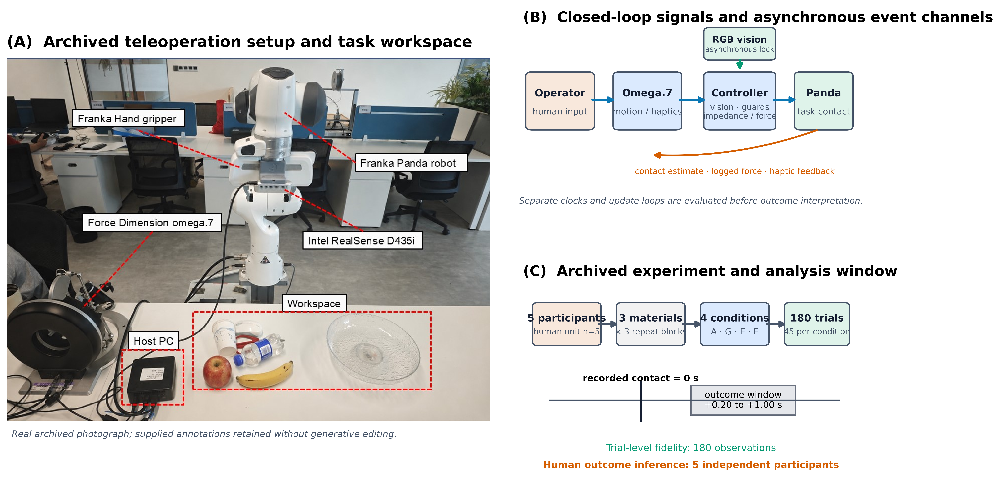
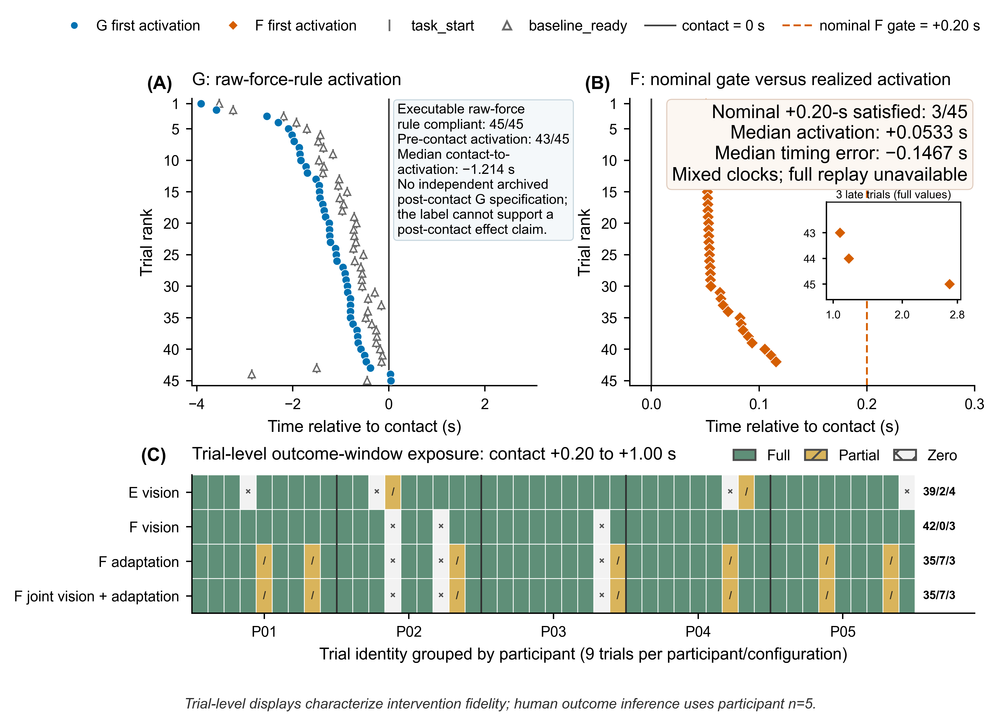
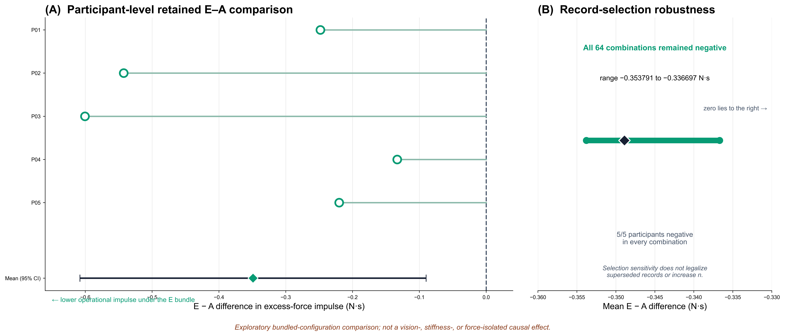

# 从名义条件到实际干预：异步人机实验的保真度框架

*THMS 定向中文审批稿（第五版精修：概念边界与结果叙事收口）*

**English title:** *From Nominal Conditions to Realized Interventions: A Fidelity Framework for Asynchronous Human–Machine Experiments*

> **审批与投稿状态。** 本稿使用冻结的清理后再分析、版本化证据重建和规则级实现核验。伦理审批或豁免机构、编号、日期及知情同意程序必须依据同期机构记录补齐：`[ETHICS RECORD REQUIRED—DO NOT SUBMIT]`。作者、单位、基金、利益冲突、作者贡献、致谢以及数据和代码可用性声明亦须在投稿前完成。上述内容不得根据现有数据推断。

## 摘要

异步人机实验中的视觉、触觉和控制干预会改变操作者在结局窗口内看到、感到和操纵的机器状态；因此，条件标签不能单独证明系统在操作者—机器闭环中实际交付了相应干预。本文提出实际干预保真度框架，以 \(N_m\rightarrow C_m\rightarrow R_i\rightarrow Y_i\) 组织名义规范、可执行实现、试次级实际干预与结局，并以 \(R_i(t)\rightarrow H_i(t+\delta)\rightarrow R_i(t+\delta)\rightarrow Y_i\) 表达人机闭环中的后续响应路径。框架从同期规范、存档源码、事件、状态轨迹和采集溯源重建五字段证据状态，再以不读取结局方向的确定性规则限定可支持的比较身份。框架应用于一个由Omega.7主手、Franka Panda机械臂、RGB视觉、阻抗控制和力反馈构成的存档双边遥操作系统，包括5名参与者的180次试次。重建显示：G的接触后规范不可恢复，且43/45次在记录接触前激活；F的名义接触后0.20 s守卫存在时钟域错配，仅3/45次达到该时序；E在接触后0.20–1.00 s窗口内呈39次完全、2次部分和4次零视觉配置暴露。这些证据把原拟议的纯接触后G效应、正确门控F增量效应和视觉×力交互，重新限定为具有明确时序、捆绑配置和暴露分布的实际配置比较。作为保留比较的探索性示范，E–A操作性超额力冲量平均差为−0.3489 N·s，5/5名参与者方向一致；在 \(n=5\) 下，该模式不构成单独视觉、刚度或力成分的确认性因果证据。实际干预保真度由此把“条件叫什么”转换为“闭环中实际交付和暴露了什么干预，以及科学上还能比较什么”，为异步人机系统实验提供可复现的评价层。

**关键词：** 人机系统；实际干预；实验有效性；异步控制；遥操作；实现保真度；证据溯源

# 1. 引言

遥操作、共享控制和其他闭环人机实验常以固定、自适应、视觉使能、力反馈或组合模式定义实验条件 [1]–[20]。这些标签便于分配和报告，却不能证明相应干预在每个试次中按预定守卫、时钟、参数和持续时间在操作者—机器闭环中得到实际交付。异步视觉进程、控制更新、接触检测和日志通道可能改变干预的启动顺序、持续时间及结局窗口覆盖；“接触后”“视觉使能”或“视觉+力”因而首先是待核实的实验承诺，而不是已经成立的试次级事实。

该差异在人机系统中具有直接科学后果。实际干预 \(R_i(t)\) 改变视觉、触觉或机器状态后，操作者会更新后续输入 \(H_i(t+\delta)\)，继而改变机器的后续实现及完整结局路径：

\[
R_i(t)\rightarrow H_i(t+\delta)\rightarrow R_i(t+\delta)\rightarrow Y_i.
\]

因此，干预提前0.8 s并非只意味着软件参数被提前写入。操作者可能在接近、接触或闭环修正阶段收到不同反馈，进而形成不同的人—机器轨迹。若结局只按名义条件标签比较，统计量可能精确描述了一组数据，却没有回答原本声称的人机干预问题。

现有研究已经分别说明了遥操作透明度和时延 [1]–[8]、可变阻抗与遥阻抗 [9]–[20]、视觉—触觉时序 [22]、人机研究可复现性 [23]–[28]、运行时验证 [29]、实现保真度 [30] 以及目标量定义 [31] 的重要性。然而，仍缺少一个位于统计分析之前的联合接口，用于回答：名义干预是否有规范支持、实现是否编码了该规范、试次中实际交付了什么、结局窗口内暴露了多少，以及该干预能否与所分析的记录精确连接。

本文回答三个问题：

- **RQ1（可重建性）：** 能否在不使用结局数值、方向或显著性的情况下，从存档规范、源码、事件、轨迹和溯源重建实际干预保真度？
- **RQ2（实际断点）：** 在真实异步遥操作系统中，名义规范、可执行实现、实际交付和窗口暴露之间出现了哪些断点？
- **RQ3（比较身份）：** 实际干预重建如何改变现有数据在科学上可支持的条件比较？

本文贡献有三项。第一，把实际干预保真度提出为异步人机实验的独立评价层，使闭环中实际交付和暴露的干预成为统计比较之前必须核实的对象。第二，将该评价层操作化为可审计的证据状态和确定性解释约束，在不查看人体结局的前提下区分身份保留、规范不可恢复、实现或交付错配以及暴露不完整。第三，在一个真实存档遥操作系统中证明，这种重建会把名义析因主张实质性改写为更窄的实际配置比较。本文不把案例解释为框架已获外部验证，也不以保真度通过替代因果识别条件。

**图1.** （A）操作者、Omega.7、异步视觉/监督控制器、Panda及触觉和机器状态反馈构成闭环；干预时序能够改变后续人体输入和结局轨迹。（B）同期工件支持的 \(N\rightarrow C\rightarrow R\rightarrow Y\) 证据链被重建为证据状态，并进一步限定比较身份和科学措辞。溯源是实际干预—结局连接的正交前提；身份保留不等于因果识别。

# 2. 相关工作

## 2.1 闭环遥操作中的时序与干预暴露

双边遥操作研究长期关注稳定性、透明度、通信时延和反馈质量 [1]–[8]。可变阻抗、遥阻抗和视觉辅助方法进一步使控制器能够根据任务、环境或操作者状态在线改变机器人响应 [9]–[20]。这些工作说明视觉、触觉和机器动态会共同塑造人的操作行为。许多人机实验按分配条件组织结局分析，而试次级干预交付及窗口暴露并非主要评价对象。视觉—触觉时序研究则表明，人能够感知相对较小的跨模态时间差 [22]；这加强了对实际启动时序的关注，却不自动提供对存档试次中每次干预的重建。

## 2.2 可复现性、运行时证据与实现保真度

机器人与人机交互研究已强调工件、代码、过程和实验单位透明度 [23]–[28]。运行时验证能够监测形式化的软件属性 [29]，实现保真度研究则区分计划干预与实际实施 [30]。二者为本研究提供重要基础，但单独应用仍不足以确定人机实验的比较身份：软件属性通过不等于操作者在结局窗口内获得完整暴露；反之，日志中观察到某个状态也不能补回缺失的科学规范。

目标量研究提醒我们，理论问题、比较对象和统计量必须一致 [31]。本研究据此不在观察实际干预后制造新的因果目标，而是把证据链用于限定最窄的可支持描述性比较。其方法学缺口不是缺少另一种保真度分数，而是缺少从“规范—实现—实际交付—窗口暴露—记录身份”到“允许比较什么”的可执行转换。

# 3. 实际干预保真度框架

## 3.1 从人机闭环到证据链

图1B所示的一次人机实验比较证据链表示为：

\[
N_m\rightarrow C_m\rightarrow R_i\rightarrow Y_i,
\]

其中，\(N_m\) 是有同期工件支持的名义干预，\(C_m\) 是存档采集程序的可执行实现，\(R_i\) 是试次 \(i\) 中记录到的实际干预，\(Y_i\) 是冻结窗口和实验单位上的结局。采集溯源 \(\mathcal P_i\) 是连接 \(R_i\) 与 \(Y_i\) 的正交前提，不属于干预本身。

## 3.2 五个证据问题

框架以五字段状态表示证据：

\[
S=(s_N,s_{NC},s_{CR},s_{\Phi},s_{\mathcal P}).
\]

五个字段分别回答以下科学问题：

1. \(s_N\)：是否知道该条件原本要在操作者—机器闭环中交付什么干预？
2. \(s_{NC}\)：存档实现是否编码了有工件支持的干预？
3. \(s_{CR}\)：记录输入和轨迹是否支持该实现被实际交付？
4. \(s_{\Phi}\)：干预是否在冻结结局窗口内出现，覆盖了多少时间？
5. \(s_{\mathcal P}\)：该干预轨迹能否精确连接到被分析的结局记录？

状态由自动计算或结构化作者审计得到。前者用于事件差、轨迹、暴露、身份和哈希；后者用于判断同期工件是否构成足够规范以及规范—源码的语义对应。本研究未执行双人独立语义复核，因此不报告审计者一致性。完整字段模式、规则、容差、缺失处理和来源审计见补充表S1–S4。

对于二元激活状态 \(a_i(t)\) 和窗口 \(W=[t_0,t_1]\)，暴露定义为：

\[
\Phi_i(W)=\frac{1}{|W|}\int_{t_0}^{t_1}\mathbb I[a_i(t)=1]dt.
\]

完整、部分、零暴露由冻结的数值边界编码；轨迹或窗口不完整时记为不可获得，不能以零替代。

## 3.3 从状态到允许解释

证据状态不汇总成单一分数，而是确定诊断、干预身份、允许比较层级和禁止措辞。主文使用身份链完整、规范不可恢复、实现/交付错配以及暴露不完整四类解释边界；操作化总结见表II，完整确定性规则见补充表S2。

当名义身份不能保留时，可以报告实际配置间的描述性比较：

\[
D^R_{m_1,m_0}=\mathbb E[Y\mid R\in\mathcal R_{m_1}]-\mathbb E[Y\mid R\in\mathcal R_{m_0}].
\]

\(D^R\) 不是观察 \(R\) 后重新定义的因果目标。任何因果解释仍需分配机制、可交换性、一致性、测量有效性和独立推断单位等额外支持。

# 4. 存档人机实验与重建方法

## 4.1 人机遥操作系统与实验结构

存档系统由Omega.7人体输入设备、Franka Panda机械臂与Franka Hand、Intel RealSense D435i RGB视觉进程、监督控制器、阻抗/力反馈更新和异步日志组成。操作者通过Omega.7输入主手运动；监督控制器结合视觉锁定、接触估计和配置逻辑形成机器指令；Panda内部估计的外力既参与接触相关状态，又经力反馈通道影响操作者。该结构构成视觉、触觉和机器状态共同作用的闭环。

5名参与者在3种材料、3个重复区组和4种配置下完成180次分析试次，每种配置45次。重复试次用于试次级保真度描述，但人体结局的独立统计单位始终是参与者（\(n=5\)）。参与者人口学、训练、对象几何、前瞻性随机化或平衡顺序尚未从当前血缘恢复。

**图2.** （A）真实实验装置，包括Omega.7、Panda、Franka Hand、RealSense和任务工作区。（B）闭环信号和异步事件通道。（C）存档实验结构及结局窗口；该图仅描述系统和测量流程，不报告重建结果。

## 4.2 存档条件与预期操作者侧暴露

四个配置在存档中记为A、G、E和F。表I只陈述可从条件定义和程序说明中恢复的实验结构；“预期操作者侧暴露”不由标签自动补全，最终身份由框架重建决定。

**表I. 存档实验条件及待核实的操作者侧暴露。**

| 配置 | 主要通道与机器变化 | 标签/工件指向的触发或时序 | 待核实的操作者侧暴露 | 评价前提 |
|---|---|---|---|---|
| A | 固定阻抗和固定命令配置 | 初始化后保持固定 | 固定机器响应与力反馈基线 | 核对初始化及试次轨迹 |
| G | 无视觉的原始力在线规则 | 标签暗示接触相关调整 | 力相关机器响应变化；具体“接触后”语义不能由标签单独给出 | 恢复独立规范并重放规则 |
| E | 视觉锁定触发多参数捆绑配置 | 首次有效视觉锁定后转换 | 视觉识别后收到捆绑的机器与触觉变化 | 核对映射、转换和窗口暴露 |
| F | E基础上增加力微调 | 工件指向接触后0.20 s门控 | 先暴露于视觉捆绑变化，再暴露于延迟力微调 | 核对守卫、时钟、交付和暴露 |

## 4.3 评价规则与实际干预重建程序

**表II. 证据情形与允许的科学解释。**

| 证据情形 | 可支持的解释 | 不支持的主张 |
|---|---|---|
| 身份链完整且溯源有效 | 保留有规范支持的名义干预身份 | 仅凭保真度声称因果效应 |
| 名义规范不可恢复 | 描述可恢复的实际配置及暴露 | 把条件标签解释为未恢复的名义干预 |
| 实现或交付发生错配/不可完整评价 | 描述已记录的实现、轨迹或交付状态 | 声称正确策略或 \(C=R\) 已得到证明 |
| 窗口暴露部分、为零或不可获得 | 进行暴露分布限定的分配描述，或停止相应评价 | 声称窗口内均匀完整干预效应 |

所有试次指向采集提交 `09c13e0b679905f14f770d820af00841546cb4cc`。配置级语义审计使用该提交的源码快照；试次级自动计算使用主清单、原始CSV、事件JSON、摘要JSON、日志状态和当前SHA-256。

对每个配置，重建依次检查同期规范、源码中的守卫/时钟/参数/初始化与更新逻辑、记录输入下的状态或命令轨迹、冻结窗口内的左连续暴露，以及逻辑试次—采集记录—文件哈希连接。能够完整重放时，记录输入被送入存档公式并与日志轨迹比较；缺少逐周期谓词输入时，交付忠实性保守记为不可评价，同时保留可以直接重建的激活和暴露描述。任何规范缺失、实现错配、不可重放或暴露不完整都在查看结局之前编码。

若目标激活 \(t^N_{act}\) 和公共时钟映射均有支持，定义时序误差 \(\epsilon_{act}=t^R_{act}-t^N_{act}\)。时钟域检查比较守卫两侧时间值的来源和原点；试次时序则使用已对齐的记录事件描述。方法不从记录到的激活时间反推未知名义规范，也不把调度、其他守卫和日志采样形成的结果归因于单一软件表达式。

## 4.4 结局与统计

主要结局是接触后0.20–1.00 s的操作性阈值以上力冲量。该窗口对应操作者进入接触后闭环修正的阶段，视觉、触觉和机器阻抗均可能影响后续输入。接触对齐与冲量计算都使用Panda内部 `O_F_ext_hat_K` 估计；因此，该结局是在人机闭环内测得的操作性接触结局，不是独立外部力传感器测得的物理安全终点。

每名参与者先在材料和重复区组内聚合，再计算配置配对差。报告参与者均值、t型95%置信区间、配对t检验、精确符号翻转、精确Wilcoxon及4项比较Holm校正。由于只有5名参与者，结果只作探索性示范。记录选择稳健性枚举6组初始/替代记录的全部 \(2^6=64\) 种选择；固定相邻窗口、留一参与者和次要时间指标保留在补充材料。

## 4.5 规则级内部核验

两级接口实现为 `ArtifactEvidence→EvidenceState` 和 `EvidenceState→Decision`。输入、期望状态和期望决策存储在与执行代码分离的冻结oracle表中。12个受控工件案例覆盖完整链、规范缺失、守卫/时钟错配、运行时偏离、部分/零/不可获得暴露、无效溯源以及多个断点并存。该检查只核验实现是否忠实执行已声明规则并可被反例测试，不估计未知故障灵敏度、状态空间完备性或跨系统效度。

# 5. 结果

## 5.1 RQ1–RQ2：真实试次中的实际时序与暴露

180/180条干预轨迹与结局通过精确记录、路径、时间戳、采集提交和当前哈希检查。G的可执行原始力规则在45次试次的12,196个记录命令更新处可重放，力比、目标平动刚度和0.3平滑更新的最大数值误差均小于 \(10^{-10}\)。然而，独立同期工件不能恢复“接触后G”规范，且43/45次G在记录接触前激活。因此，源码方程的交付一致性不能补回缺失的科学意图。

F的源码将 `time.time()` 传入以 `time.perf_counter()` 为原点的系统时间计算，破坏了名义接触后0.20 s守卫的时钟语义。F没有接触前激活，但只有3/45次达到接触后至少0.20 s；实际中位接触—激活为0.05327 s。该53 ms是其他守卫、调度、状态条件和日志采样共同形成的记录结果，不是混合时钟在数值上“产生的53 ms延迟”。F激活与暴露能够重建，但缺少完整逐周期谓词输入，故 \(s_{CR}\) 记为 `not_evaluable`，而非 `pass` 或 `fail`。

E的视觉配置在结局窗口内呈39次完全、2次部分和4次零暴露。4次零暴露的视觉锁定和转换完成均晚于窗口终点；两次部分暴露为0.966863和0.00115488，后者只覆盖窗口末端约1 ms。F的视觉配置为42次完全、3次零暴露；F力适应及视觉—适应联合暴露均为35次完全、7次部分和3次零暴露。

**图3.** （A）G首次激活相对接触的时序及可执行规则重放结果。（B）F实际激活与名义+0.20 s门控的关系；混合时钟和完整 \(C\rightarrow R\) 谓词重放不可获得均被明确标注。（C）E/F在接触后0.20–1.00 s窗口内的试次级完全、部分和零暴露。人体结局推断仍以5名参与者为单位。

## 5.2 RQ3：重建后的比较身份

证据状态和允许解释汇总于表III。重建没有删除试次或根据结局重新分组，而是改变了对原条件比较的科学命名。

**表III. 实际干预保真度与存档条件的可支持比较身份。**

| 配置 | \(s_N\) | \(s_{NC}\) | \(s_{CR}\) | 窗口暴露 | 可支持的身份与比较边界 |
|---|---|---|---|---|---|
| A | available | pass | pass | 45 full | 固定A身份可保留；不自动授权因果解释 |
| G | unavailable | not_evaluable | pass | 40 full/5 partial | 重放一致的实际原始力G相对固定A；不能称纯接触后效应 |
| E | available | pass | pass | 39 full/2 partial/4 zero | E捆绑分配及异质视觉暴露相对A；不能拆为单独视觉、刚度或力效应 |
| F | available | fail: clock | not_evaluable | 35 full/7 partial/3 zero | 记录到的早期/异质F相对E；不能称正确+0.20 s策略或已证明 \(C=R\) |

因此，G–A只能描述以预激活为主的实际原始力规则G相对固定A；E–A描述E捆绑分配及其异质视觉暴露相对A；F–E描述记录到的早期/异质F相对E，并披露完整交付重放不可评价；F–G也不能解释为视觉、力或二者交互的析因主效应。

## 5.3 保留比较下的探索性结局模式

在重建后仍可描述的E–A实际配置比较中，操作性超额力冲量均值差为−0.3489 N·s（95% CI，−0.6080至−0.0898；配对t检验 \(p=0.0201\)），5名参与者均为负。精确符号翻转和Wilcoxon检验均为 \(p=0.0625\)；4项对比Holm校正后配对t检验为0.0633，两种精确检验均为0.2500。因此，该结果是方向一致的探索性E捆绑配置模式，而不是确认性或机制隔离的因果效应。

64/64种记录选择的E–A均值保持为负，范围为−0.353791至−0.336697 N·s，且每种选择均保持5名参与者方向为负。该稳健性检查不改变错误初始记录的溯源状态，也不增加独立样本量。

**图4.** （A）5名参与者的E–A接触后0.20–1.00 s操作性超额力冲量配对差及均值95%置信区间。（B）64种记录选择下的E–A均值范围。图中比较对象是具有异质视觉暴露的E捆绑配置与固定A，不代表单独视觉、刚度或力策略的因果效应。

## 5.4 规则级内部核验

12/12个冻结案例均返回预期证据状态、累积诊断、身份和比较层级。检查确认：标签不能使缺失规范变为可获得；守卫和时钟错配可以并存；约1 ms暴露仍为部分暴露；缺失轨迹产生不可获得而非零暴露；无效溯源阻断干预—结局评价；不可完整重放可以与已知暴露并存。该结果是规则级实现核验，不是诊断准确率、方法学有效率或外部验证。

# 6. 讨论

## 6.1 对人机实验解释的意义

本研究最重要的发现不是某个软件缺陷本身，而是干预交付时间和窗口暴露能够改变操作者实际进入的闭环。G的主要激活发生在接触前，F的实际激活多数早于其名义门控时间，E的一部分试次在结局窗口内没有完整视觉配置暴露。每一种差异都可能改变操作者在接近、接触和修正阶段接收到的机器状态与反馈，进而改变后续输入和结局轨迹。因此，条件标签不是人机干预的充分实验单位。

实际干预重建也改变了结果的科学身份。现有数据不能回答纯接触后G、正确门控F或视觉×力析因效应，但仍能回答更窄的问题：特定存档实现及其记录暴露分布与固定或其他实际配置之间呈现何种描述性差异。这种收窄不是把不利试次排除，而是使比较名称与可复核证据一致。

## 6.2 对前瞻性实验设计的要求

前瞻性异步人机实验应在采集前冻结干预规范、公共时钟、事件定义、结局窗口和独立实验单位；在采集中保存每个守卫输入、状态转换原因、完整激活轨迹和精确记录身份；在推断前独立运行证据重建；在报告时同时给出名义分配、实际交付时序、暴露分布及任何不可评价环节。

这些要求不会替代控制性能、可用性、工作负荷或主观体验评价，而是为这些指标确定可信的处理身份。尤其在视觉、触觉和控制参数异步更新的系统中，交付与暴露应被记录为实验变量，而不是隐含在条件标签中的实现假设。

## 6.3 方法学意义

框架连接了以往分散的几类工作：时延研究说明时序可能影响人机性能，运行时验证检查软件属性，可复现性研究保护工件和过程，实施保真度区分计划与实施，目标量研究连接理论与统计。本文的增量在于把这些证据转换成比较身份和措辞边界，并保持自动计算与语义审计、试次级保真度与参与者级推断、身份核实与因果识别之间的边界。

12个受控案例使规则实现可执行且可反例测试，但不证明规则空间完整。真实案例展示了多种断点可以在同一次采集中共存，也不等于跨系统外部验证。后续方法验证应在多个平台中前瞻性冻结规范和oracle，由独立流程注入已知与未知故障，并评价诊断准确率、不可评价率和语义审计一致性。

## 6.4 局限

人体独立样本只有5名，且框架只在一个存档遥操作系统中操作化；前瞻性随机化或平衡顺序尚未恢复。E和F是多参数捆绑配置，不能把E–A或F–E归因于单独视觉、刚度、力反馈或夹爪参数。接触对齐和结局共享Panda内部力估计，记录刚度也不是独立测得的物理阻抗。

参与者人口学、训练、对象几何和若干实验程序信息尚未从现有血缘恢复。结构化语义审计由作者完成，未进行双人独立编码。F缺少逐周期完整谓词输入，因此完整 \(C\rightarrow R\) 只能记为不可评价。6组替换记录的同期故障依据仍不完整；64组合不能使错误记录成为溯源有效数据。伦理审批或豁免及知情同意必须在投稿前由同期机构记录正面解决。

# 7. 结论

名义条件标签不能单独证明异步人机系统在操作者—机器闭环中实际交付了相应干预。实际干预保真度重建通过连接规范、实现、试次级交付、窗口暴露和记录身份，确定名义比较何时能够保留、何时必须改写以及何时不可评价。在本存档遥操作案例中，这一过程实质性改变了G、E和F相关比较的科学身份，并把E–A限定为探索性的捆绑配置比较。未来人机实验应把干预交付时序和窗口暴露记录为显式实验变量，使“实际比较了什么”在统计推断之前即可复核。

# 参考文献

1. Hannaford, B. (1989). A design framework for teleoperators with kinesthetic feedback. *IEEE Transactions on Robotics and Automation, 5*(4), 426–434. https://doi.org/10.1109/70.88057
2. Lawrence, D. A. (1993). Stability and transparency in bilateral teleoperation. *IEEE Transactions on Robotics and Automation, 9*(5), 624–637. https://doi.org/10.1109/70.258054
3. Hokayem, P. F., & Spong, M. W. (2006). Bilateral teleoperation: An historical survey. *Automatica, 42*(12), 2035–2057. https://doi.org/10.1016/j.automatica.2006.06.027
4. Passenberg, C., Peer, A., & Buss, M. (2010). A survey of environment-, operator-, and task-adapted controllers for teleoperation systems. *Mechatronics, 20*(7), 787–801. https://doi.org/10.1016/j.mechatronics.2010.04.005
5. Huang, K., Chitrakar, D., Rydén, F., & Chizeck, H. J. (2019). Evaluation of haptic guidance virtual fixtures and 3D visualization methods in telemanipulation—A user study. *Intelligent Service Robotics, 12*, 289–301. https://doi.org/10.1007/s11370-019-00283-w
6. Rakita, D., Mutlu, B., & Gleicher, M. (2020). Effects of onset latency and robot speed delays on mimicry-control teleoperation. In *Proceedings of the 2020 ACM/IEEE International Conference on Human-Robot Interaction*. https://doi.org/10.1145/3319502.3374838
7. Louca, J., Eder, K., Vrublevskis, J., & Tzemanaki, A. (2024). Impact of haptic feedback in high latency teleoperation for space applications. *ACM Transactions on Human-Robot Interaction, 13*(2), Article 16, 1–21. https://doi.org/10.1145/3651993
8. Gong, Y., Mat Husin, H., Erol, E., Ortenzi, V., & Kuchenbecher, K. J. (2024). AiroTouch: Enhancing telerobotic assembly through naturalistic haptic feedback of tool vibrations. *Frontiers in Robotics and AI, 11*, 1355205. https://doi.org/10.3389/frobt.2024.1355205
9. Hogan, N. (1985). Impedance control: An approach to manipulation: Part I—Theory. *Journal of Dynamic Systems, Measurement, and Control, 107*(1), 1–7. https://doi.org/10.1115/1.3140702
10. Walker, D. S., Wilson, R. P., & Niemeyer, G. (2010). User-controlled variable impedance teleoperation. In *2010 IEEE International Conference on Robotics and Automation*. https://doi.org/10.1109/ROBOT.2010.5509811
11. Buchli, J., Stulp, F., Theodorou, E., & Schaal, S. (2011). Learning variable impedance control. *The International Journal of Robotics Research, 30*(7), 820–833. https://doi.org/10.1177/0278364911402527
12. Ajoudani, A., Tsagarakis, N. G., & Bicchi, A. (2012). Tele-impedance: Teleoperation with impedance regulation using a body–machine interface. *The International Journal of Robotics Research, 31*(13), 1642–1656. https://doi.org/10.1177/0278364912464668
13. Peternel, L., Petrič, T., & Babič, J. (2018). Robotic assembly solution by human-in-the-loop teaching method based on real-time stiffness modulation. *Autonomous Robots, 42*, 1–17. https://doi.org/10.1007/s10514-017-9635-z
14. Abu-Dakka, F. J., Rozo, L., & Caldwell, D. G. (2018). Force-based variable impedance learning for robotic manipulation. *Robotics and Autonomous Systems, 109*, 156–167. https://doi.org/10.1016/j.robot.2018.07.008
15. Abu-Dakka, F. J., & Saveriano, M. (2020). Variable impedance control and learning—A review. *Frontiers in Robotics and AI, 7*, 590681. https://doi.org/10.3389/frobt.2020.590681
16. Michel, Y., Rahal, R., Pacchierotti, C., Robuffo Giordano, P., & Lee, D. (2021). Bilateral teleoperation with adaptive impedance control for contact tasks. *IEEE Robotics and Automation Letters, 6*(3), 5429–5436. https://doi.org/10.1109/LRA.2021.3066974
17. Peternel, L., & Ajoudani, A. (2023). After a decade of teleimpedance: A survey. *IEEE Transactions on Human-Machine Systems, 53*(2), 401–416. https://doi.org/10.1109/THMS.2022.3231703
18. Michel, Y., Li, Z., & Lee, D. (2023). A learning-based shared control approach for contact tasks. *IEEE Robotics and Automation Letters, 8*(12), 8002–8009. https://doi.org/10.1109/LRA.2023.3322332
19. Huang, Y.-C., Abbink, D. A., & Peternel, L. (2021). A semi-autonomous tele-impedance method based on vision and voice interfaces. In *2021 20th International Conference on Advanced Robotics*, 180–186. https://doi.org/10.1109/ICAR53236.2021.9659427
20. Siegemund, G., Díaz Rosales, A., Glodde, A., Dietrich, F., & Peternel, L. (2024). Semi-autonomous teleimpedance based on visual detection of object geometry and material and its relation to environment. In *2024 IEEE-RAS 23rd International Conference on Humanoid Robots*, 779–786. https://doi.org/10.1109/Humanoids58906.2024.10769858
21. Jekel, H. H. A., Díaz Rosales, A., & Peternel, L. (2026). Visio-verbal teleimpedance interface: Enabling semi-autonomous control of physical interaction via eye tracking and speech. *Frontiers in Robotics and AI, 13*, 1749105. https://doi.org/10.3389/frobt.2026.1749105
22. Vogels, I. M. L. C. (2004). Detection of temporal delays in visual-haptic interfaces. *Human Factors, 46*(1), 118–134. https://doi.org/10.1518/hfes.46.1.118.30394
23. Bonsignorio, F., & del Pobil, A. P. (2015). Toward replicable and measurable robotics research [From the Guest Editors]. *IEEE Robotics & Automation Magazine, 22*(3), 32–35. https://doi.org/10.1109/MRA.2015.2452073
24. Bonsignorio, F. (2017). A new kind of article for reproducible research in intelligent robotics [From the Field]. *IEEE Robotics & Automation Magazine, 24*(3), 178–182. https://doi.org/10.1109/MRA.2017.2722918
25. Gunes, H., Broz, F., Crawford, C. S., Rosenthal-von der Pütten, A., Strait, M., & Riek, L. (2022). Reproducibility in human-robot interaction: Furthering the science of HRI. *Current Robotics Reports, 3*(4), 281–292. https://doi.org/10.1007/s43154-022-00094-5
26. Aldana-López, R., Aragüés, R., & Sagüés, C. (2023). Latency vs precision: Stability preserving perception scheduling. *Automatica, 155*, 111123. https://doi.org/10.1016/j.automatica.2023.111123
27. Bagchi, S., Holthaus, P., Beraldo, G., Senft, E., Hernandez, D., Han, Z., Jayaraman, S. K., Rossi, A., Esterwood, C., Andriella, A., & Pridham, P. S. (2023). Towards improved replicability of human studies in human-robot interaction. In *Companion of the 2023 ACM/IEEE International Conference on Human-Robot Interaction*. https://doi.org/10.1145/3568294.3580162
28. Marchesi, S., De Tommaso, D., Kompatsiari, K., Wu, Y., & Wykowska, A. (2024). Tools and methods to study and replicate experiments addressing human social cognition in interactive scenarios. *Behavior Research Methods, 56*(7), 7543–7560. https://doi.org/10.3758/s13428-024-02434-z
29. Huang, J., Erdogan, C., Zhang, Y., Moore, B., Luo, Q., Sundaresan, A., & Roşu, G. (2014). ROSRV: Runtime verification for robots. In *Runtime Verification* (Lecture Notes in Computer Science, Vol. 8734, pp. 247–254). Springer. https://fsl.cs.illinois.edu/publications/huang-erdogan-zhang-moore-luo-sundaresan-rosu-2014-rvtool.html
30. Carroll, C., Patterson, M., Wood, S., Booth, A., Rick, J., & Balain, S. (2007). A conceptual framework for implementation fidelity. *Implementation Science, 2*, 40. https://doi.org/10.1186/1748-5908-2-40
31. Lundberg, I., Johnson, R., & Stewart, B. M. (2021). What is your estimand? Defining the target quantity connects statistical evidence to theory. *American Sociological Review, 86*(3), 532–565. https://doi.org/10.1177/00031224211004187

