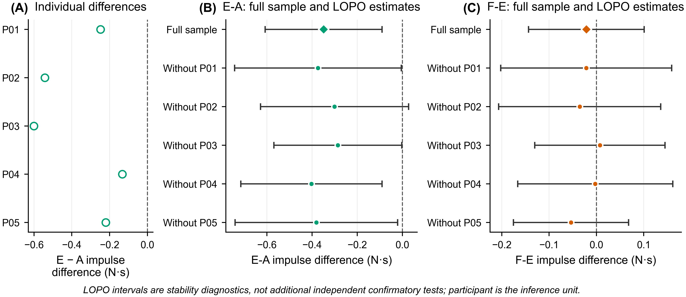

# Supplementary Material — Version 3

## Fidelity-Constrained Evaluation of Asynchronous Human–Machine Experiments

This supplement contains the evidence-state schema, deterministic internal discrimination check, complete small-sample and record-selection sensitivity results, source-level clock evidence, and figures supporting the retrospective case. It introduces no additional human-subject acquisition, does not change the frozen outcome, and does not claim external validation.

## Table S1. Evidence fields, metrics, and applicability

| Field or metric | Operational definition | Required evidence | Not-evaluable rule |
|---|---|---|---|
| `nominal_spec` | Whether a contemporaneous, traceable scientific specification is available | Versioned protocol, specification, or traceable code documentation | A label alone cannot change `unavailable` to `available` |
| `n_to_c` | Whether executable guards, clocks, initialization, and updates implement the available nominal specification | (N_m) and executable source | `not_evaluable` when (N_m) is unavailable |
| `c_to_r` | Whether logged events and command trajectories reproduce what the executable implementation and recorded inputs predict | Executable predicates, inputs, and realized trace | `not_evaluable` when realization fields cannot be reconstructed |
| `exposure` | Full, partial, zero, unavailable, or not-applicable intervention exposure in the outcome window | Activation/transition state and event-aligned window | `unavailable` when the state or window cannot be reconstructed |
| `provenance` | Whether intervention and outcome evidence share exact acquisition identity and verified source hashes | Record IDs, paths, and hashes | Invalid provenance blocks evaluation of the intervention–outcome pair |
| Activation timing error | (t^R_{act}-t^N_{act}) on a common clock | Defensible nominal target and realized activation | Not computed when no target or clock mapping is supported |
| Exposure fraction | (|W|^{-1}\int_W\mathbb I[a_i(t)=1]dt) | Realized state trajectory and outcome window | Not an outcome-dependent exclusion rule |
| Parameter-state fidelity | Logged command minus supported target at a landmark or over a window | Target and logged command trajectory | Unavailable if the adaptive target cannot be replayed from recorded inputs |
| Independent unit | Unit supporting human-outcome inference | Design and repeated-measures structure | Trial counts cannot replace participant counts |

The classifier output contains a diagnostic set, nominal-identity status, comparison level, permitted wording, prohibited wording, and a fixed reminder that causal identification is outside the fidelity framework. It contains no outcome value, effect direction, p value, or significance field.

## Table S2. Configuration-level fidelity summary

| Configuration | Executable/command result | Nominal/event result | Timing result, median [Q1, Q3] s | Outcome-window exposure | Provenance/clock result |
|---|---|---|---|---|---|
| A | Fixed commanded state retained in 45/45 | No activation target applicable | Not applicable | Mode-specific state present throughout 45/45 windows | Acquisition lineage 45/45; analysis/gate clock integrity 45/45 |
| G | Raw-force executable logic compliant in 45/45 | Independent contemporaneous post-contact nominal specification unavailable; pre-contact activation in 43/45 | Contact-to-activation −1.2144 [−1.6962, −0.7986] | Active during the window in 45/45 | Acquisition lineage 45/45; analysis clock integrity 45/45 |
| E | Vision executable logic compliant in 45/45 | Transition complete before contact in 38/45 and by window start in 39/45 | Vision-to-first-command 0.0243 [0.0219, 0.0342]; transition completion 0.3910 [0.3384, 0.4244] | Vision exposure: 39 full, 2 partial, 4 zero | Acquisition lineage 45/45; clock integrity 45/45 |
| F | Logged activation reconstructed in 45/45; no separate (C\neq R) claim without replay of the literal predicate | Nominal contact-plus-0.20-s requirement implemented with incompatible clock domains; timing satisfied in 3/45; pre-contact activation in 0/45 | Contact-to-activation 0.0533 [0.0515, 0.0711]; timing error −0.1467 [−0.1485, −0.1289] | Vision: 42 full, 0 partial, 3 zero; adaptation/joint: 35 full, 7 partial, 3 zero | Acquisition lineage 45/45; intervention-gate clock integrity 0/45 |

## Table S3. Participant-level exploratory contrasts for operational excess-force impulse

Participant is the independent human experimental unit in every row ((n=5)). Differences use the first-listed configuration minus the second-listed configuration.

| Contrast | Difference, N·s | 95% t CI, N·s | Paired-t p | Exact sign-flip p | Exact Wilcoxon p | Holm paired-t p |
|---|---:|---:|---:|---:|---:|---:|
| E-A | −0.3489 | [−0.6080, −0.0898] | 0.0201 | 0.0625 | 0.0625 | 0.0633 |
| G-A | −0.0742 | [−0.1978, 0.0494] | 0.1708 | 0.0625 | 0.0625 | 0.3416 |
| F-E | −0.0212 | [−0.1433, 0.1010] | 0.6556 | 0.6875 | 0.8125 | 0.6556 |
| F-G | −0.2958 | [−0.5000, −0.0917] | 0.0158 | 0.0625 | 0.0625 | 0.0633 |

The outcome is operational because contact alignment and impulse calculation share the Panda internal `O_F_ext_hat_K` estimate. It is not an independently sensed physical-safety endpoint.

## Table S4. Sensitivity to the selected lineage repair

Historical records are superseded, not equally valid alternatives. This two-state comparison documents the numerical consequence of the frozen lineage repair.

| Contrast | Historical difference, N·s | Clean difference, N·s | Historical 95% CI | Clean 95% CI | Historical paired-t p | Clean paired-t p |
|---|---:|---:|---:|---:|---:|---:|
| E-A | −0.3416 | −0.3489 | [−0.5971, −0.0861] | [−0.6080, −0.0898] | 0.0206 | 0.0201 |
| G-A | −0.0742 | −0.0742 | [−0.1978, 0.0494] | [−0.1978, 0.0494] | 0.1708 | 0.1708 |
| F-E | −0.0469 | −0.0212 | [−0.2052, 0.1113] | [−0.1433, 0.1010] | 0.4565 | 0.6556 |
| F-G | −0.3143 | −0.2958 | [−0.5442, −0.0844] | [−0.5000, −0.0917] | 0.0192 | 0.0158 |

## Table S5. Fixed adjacent-window sensitivity for E-A

| Post-contact integration window | E-A mean difference, N·s | t-based 95% CI, N·s | Participant direction | Exact sign-flip p |
|---|---:|---:|---:|---:|
| 0.10–1.00 s | −0.3718 | [−0.6618, −0.0819] | 5/5 negative | 0.0625 |
| 0.30–1.00 s | −0.3238 | [−0.5474, −0.1002] | 5/5 negative | 0.0625 |
| 0.20–0.80 s | −0.2438 | [−0.4635, −0.0241] | 5/5 negative | 0.0625 |
| **0.20–1.00 s** | **−0.3489** | **[−0.6080, −0.0898]** | **5/5 negative** | **0.0625** |
| 0.20–1.20 s | −0.4307 | [−0.6960, −0.1653] | 5/5 negative | 0.0625 |

These windows were fixed before inspecting their sensitivity results. They do not create additional primary outcomes.

## Table S6. Exhaustive record-selection robustness across (2^6=64) combinations

| Contrast | Minimum mean difference, N·s | Maximum mean difference, N·s | Negative mean combinations | Combinations with all 5 participants negative | Participant-negative count range |
|---|---:|---:|---:|---:|---:|
| E-A | −0.353791 | −0.336697 | 64/64 | 64/64 | 5–5 |
| G-A | −0.074218 | −0.074218 | 64/64 | 64/64 | 5–5 |
| F-E | −0.067805 | −0.000304 | 64/64 | 0/64 | 2–3 |
| F-G | −0.330284 | −0.279877 | 64/64 | 64/64 | 5–5 |

Every logical trial remains represented once in each combination. Because the initial records were marked erroneous, the 64 combinations are counterfactual/adversarial record-selection checks rather than 64 provenance-valid datasets. The F-E mean sign is not treated as participant-level directional stability because only two or three participants are negative in each combination.

## Table S7. Deterministic internal discrimination cases

| Case | Perturbation | Expected/observed identity status | Expected/observed comparison level | Exact oracle match |
|---|---|---|---|---:|
| S00 | Complete evidence chain | retained | nominal identity retained | 1 |
| S01 | Nominal specification unavailable | indeterminate | realized configuration | 1 |
| S02 | Guard mismatch | unsupported | implemented/realized configuration | 1 |
| S03 | Clock-domain mismatch | unsupported | implemented/realized configuration | 1 |
| S04 | Runtime delivery mismatch | unsupported | realized delivery | 1 |
| S05 | Partial exposure | exposure-qualified | assignment with exposure distribution | 1 |
| S06 | Zero exposure | unsupported | assignment with zero window exposure | 1 |
| S07 | Realization record unavailable | not evaluable | implementation only | 1 |
| S08 | Invalid provenance | not evaluable | none | 1 |
| S09 | Guard mismatch plus partial exposure | unsupported | implemented/realized configuration | 1 |
| S10 | Runtime mismatch plus invalid provenance | not evaluable | none | 1 |

All 11 cases matched the separately stored oracle. This is an implementation and discrimination check within the declared state space, not evidence of external validity, completeness, or real-world diagnostic accuracy.

## Table S8. F clock path and E non-full exposure mechanisms

The archived F path is summarized by the following literal-equivalent pseudocode:

```text
timeline.start_perf = time.perf_counter()
now = time.time()                         # wall clock in main loop
update_vision_force_fusion(now)

elapsed = timeline.system_time(now) - contact_t
        = (now - timeline.start_perf) - contact_t
if elapsed < 0.20 s:
    return
activate_if_remaining_guards_pass()
```

Because `now` and `start_perf` belong to incompatible clock domains, the elapsed value is not a valid contact-relative duration and the nominal delay guard passes once contact exists. The observed median +0.0532736 s activation is downstream realized timing after the contact event, other executable guards, update scheduling, and logging. It must not be described as a 53-ms delay produced numerically by the mixed clocks. The source signature and collection commit are stored in `v3_data/f_clock_evidence.json`.

For E, the four zero-exposure trials locked vision 1.0716–1.4338 s after contact and completed their transitions 1.5014–1.8069 s after contact, after the +1.00-s outcome-window endpoint. The two mathematically partial exposures were 0.966863 and 0.00115488; the latter completed at approximately contact +0.9991 s and therefore overlapped only a negligible end segment. Exact trial identities are stored in `v3_data/e_nonfull_exposure_mechanisms.csv`.

## Supplementary Figure S1. Contact-aligned force and commanded-stiffness context


**Figure S1.** Participant-aggregated threshold-referenced excess force and logged commanded translational stiffness. Bands are pointwise t-based 95% confidence intervals. Logged stiffness was not independently validated as physical closed-loop impedance.

## Supplementary Figure S2. Participant and leave-one-participant-out stability



**Figure S2.** Individual participant differences and leave-one-participant-out estimates. These are stability diagnostics and do not increase the independent sample size.

## Supplementary Figure S3. Lineage and deterministic trace examples


**Figure S3.** Six superseded/selected acquisition pairs and deterministic G, F, and post-contact vision examples. The F panel displays contact, first activation, and the nominal +0.20-s target; the mixed-clock mechanism is established by source inspection rather than inferred from the 53-ms trace alone.

## Machine-readable v3 files

- `v3_data/controlled_perturbation_results.csv`
- `v3_data/record_selection_64_combinations.csv`
- `v3_data/record_selection_summary.csv`
- `v3_data/e_nonfull_exposure_mechanisms.csv`
- `v3_data/f_clock_evidence.json`
- `../04_logic_and_qa/v3/evidence_decision_matrix.csv`
- `../04_logic_and_qa/v3/v3_validation_report.json`

The frozen v2 clean-analysis files remain the numerical source for all unchanged case-study results.
