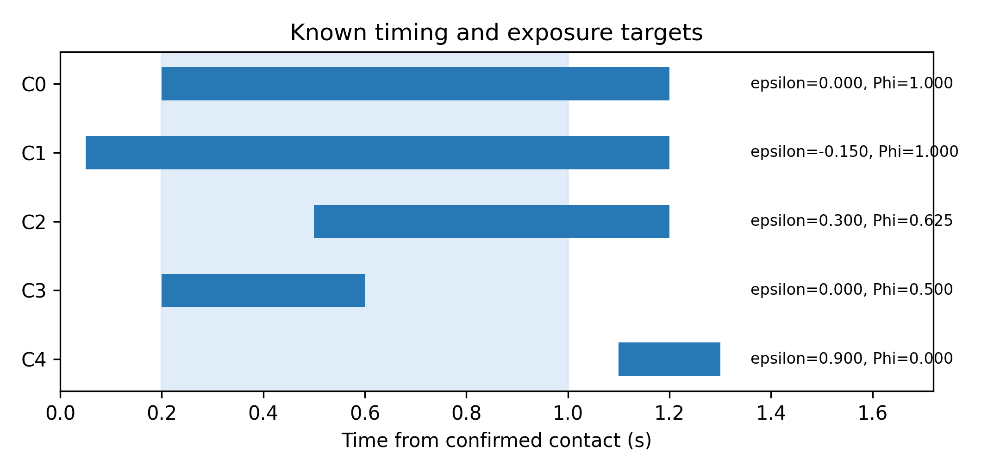
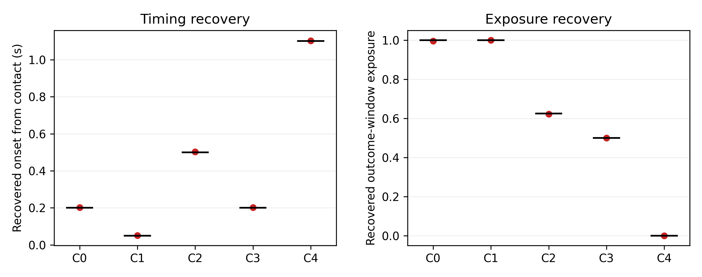
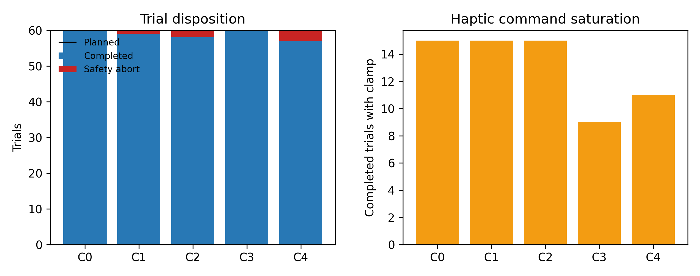

# 从名义控制器标签到实际干预：异步人机实验保真度框架及前瞻性时序—暴露判据验证

> **稿件状态。** THMS定向中文审批稿v2。伦理审批或豁免机构、编号、日期、知情同意程序及存档数据再使用范围必须依据同期机构记录补齐：`[ETHICS RECORD REQUIRED—DO NOT SUBMIT]`。作者、单位、基金、利益冲突、作者贡献、致谢及数据代码可用性声明亦须在投稿前完成，不得由实验文件推断。

## 摘要

异步人机系统实验常以固定、自适应、视觉使能或组合模式等名义标签定义条件，但标签本身不能证明耦合人—机器系统在结局窗口内实际经历了相应干预。本文提出实际干预保真度框架，将有文档支持的名义干预、源代码实际实现、逐试次记录干预与结局连接为(N_m\rightarrow C_m\rightarrow R_i\rightarrow Y_i)证据链，并用激活时序误差\(\epsilon_i\)、结局窗口暴露比例\(\Phi_i\)、时钟完整性和精确采集溯源共同限定证据可容许的统计比较。证据分两阶段建立。首先，框架被回顾性应用于5名参与者、180次重复遥操作试次，识别出名义标签、可执行守卫和实际时序之间的断点，并据此收窄可解释的比较。其次，在同一平台上开展20名彼此独立参与者的前瞻性已知真值判据实验。五种条件系统操纵反馈激活时刻和持续时间，形成预设的\(\epsilon\)与\(\Phi\)组合；300个计划试次中294次完整，6次按5 N阈值安全中止。独立于在线控制器常量的离线重建在294/294个可评估试次中正确识别条件。激活时刻绝对误差的平均值、95百分位数和最大值分别为2.381、4.957和5.408 ms；暴露比例绝对误差分别为0.001798、0.005996和0.006760，全部满足冻结的判据。65/294个完整试次出现触觉命令限幅；该现象不改变时序和窗口暴露重建，但限制实际触觉剂量和探索性人体结局的解释。人体力指标仅作为参与者层面的描述性结果，不构成确认性效应证据。双案例证据表明，实际干预保真度既能诊断存档研究的解释边界，也能在已知真值下得到前瞻性、系统内部的判据验证；它不是外部系统验证，也不自动赋予因果含义。

**关键词：** 人机系统评价；实际干预保真度；异步遥操作；结局窗口暴露；运行时时序；判据验证；采集溯源

# 1. 引言

人机闭环遥操作把人的感知、决策和适应能力与触觉接口、监督控制器、远端机器人及物理环境耦合起来。接触性能不是控制器的孤立输出，而是操作者和机器在反馈回路中持续作用形成的系统结局（Hannaford, 1989; Lawrence, 1993; Hokayem and Spong, 2006; Passenberg et al., 2010）。触觉引导、共享控制、阻抗调节和视觉辅助可能改变交互安全性与效率，但这些组成部分往往分布在不同线程、调度周期和时钟域中（Walker et al., 2010; Buchli et al., 2011; Ajoudani et al., 2012; Peternel and Ajoudani, 2023）。

实验条件通常由“固定”“视觉使能”“力自适应”或“组合”等标签组织。每个标签隐含参数、守卫、事件顺序和持续时间：控制器何时激活、何时关闭，以及干预实际覆盖结局窗口的多少比例。异步执行可能使名义上的接触后机制提前激活，也可能使已经执行的机制仅覆盖部分结局窗口。因此，分配标签、代码实现、实际交付和统计结局之间可能发生相互独立的断点。

时延研究、机器人运行时验证、可重复性、实施保真度和estimand研究分别处理了这一问题的不同部分（Vogels, 2004; Huang et al., 2014; Carroll et al., 2007; Lundberg et al., 2021）。仍缺少的是一条面向人机实验评价的联合规则：如何从名义规范追踪到实际干预，如何把时序转化为结局窗口暴露，以及证据断点出现后原比较还能被解释成什么。

本文回答四个研究问题：

- **RQ1（回顾性诊断）：** 在存档异步遥操作案例中，名义条件、可执行逻辑和实际记录干预之间呈现哪些一致与偏离？
- **RQ2（解释边界）：** 这些偏离如何限制标签比较所允许的统计目标和科学措辞？
- **RQ3（前瞻性判据验证）：** 在预设时序与暴露真值的条件下，框架能否准确恢复\(\epsilon\)、\(\Phi\)和条件类别？
- **RQ4（质量约束）：** 安全中止、控制时序和触觉限幅如何与判据恢复共同报告，而不被错误合并成单一“通过/失败”分数？

本文贡献有三点。第一，提出(N_m\rightarrow C_m\rightarrow R_i\rightarrow Y_i)四层证据链，把事件时序、窗口暴露、时钟和采集身份纳入同一评价流程。第二，提出证据可容许估计目标：当名义语义或实际交付不成立时，统计比较应收窄，而不是把事后实际状态当作自动具有因果意义的处理。第三，以互补的回顾性诊断案例和20人前瞻性已知真值实验验证框架的实际用途。前者展示框架发现真实断点的能力，后者提供系统内部判据验证；两者不被混同为控制器疗效验证。

# 2. 实际干预保真度框架

## 2.1 四层证据链

一次模式\(m\)下的试次\(i\)表示为

\[
N_m\rightarrow C_m\rightarrow R_i\xrightarrow[\mathcal P_i]{}Y_i,
\]

其中，\(N_m\)是由同期协议或可追溯规范支持的名义干预，包括目标参数、激活守卫、事件顺序和预期暴露；\(C_m\)是采集软件实际实现的守卫、时钟域、初始化和更新逻辑；\(R_i=\{\mathcal E_i,a_i(t),\boldsymbol\theta_i^{log}(t)\}\)是事件、激活状态和参数轨迹构成的实际记录干预；\(Y_i\)是明确结局窗口内的测量结果。\(\mathcal P_i\)表示精确采集溯源，用于证明\(R_i\)和\(Y_i\)来自同一次采集。溯源完整不等于干预正确交付，但没有溯源则无法可靠评价干预—结局连接。

三类断点可以共存：\(N\neq C\)表示规范没有被代码实现；\(C\neq R\)表示运行记录没有再现代码在记录输入下应产生的状态；实际干预与结局窗口不匹配表示暴露偏差。它们不能压缩为一个总分，因为不同断点改变的是不同科学命题。

## 2.2 时序误差、窗口暴露与可容许估计目标

若名义激活时刻为\(t^N_{act,i}\)，实际记录激活时刻为\(t^R_{act,i}\)，则

\[
\epsilon_i=t^R_{act,i}-t^N_{act,i}.
\]

对于结局窗口\(W=[t_0,t_1]\)和二元激活状态\(a_i(t)\)，实际暴露比例为

\[
\Phi_i=\frac{1}{t_1-t_0}\int_{t_0}^{t_1}a_i(t)\,dt.
\]

\(\Phi_i=1\)、\(0<\Phi_i<1\)和\(\Phi_i=0\)分别表示完整、部分和零暴露。暴露类别用于描述进入结局窗口的干预，不是观察结局后删除试次的规则。

名义比较只有在规范、实现和交付均得到支持时才能按标签语义解释。否则，存档允许的是更窄的实际分配或暴露分布比较。本文称其为“证据可容许估计目标”，意指现有证据允许表达的最窄统计比较目标；它不因使用实际暴露而自动成为因果estimand。

## 2.3 采集前、采集中和推断前要求

采集前应冻结名义参数、守卫、时钟、窗口和独立实验单位；采集中应记录人体输入、接触、激活状态、参数轨迹、采集软件身份和安全事件；推断前依次检查\(N\rightarrow C\)、\(C\rightarrow R\)及\(R\xleftrightarrow{\mathcal P}Y\)。指标没有名义目标时标为“不适用”，缺少必要记录时标为“不可获得”，均不能转换为“保真度通过”。

# 3. 研究一：5人回顾性诊断案例

## 3.1 系统与数据结构

存档平台包括Omega.7主端触觉设备、Intel RealSense D435i视觉通道、监督控制器、Franka Emika Panda机械臂与夹爪。5名参与者在3种材料、3个重复区组和4种配置A/G/E/F下完成180个清理后试次。人体结局的独立实验单位为参与者\(n=5\)，而不是180次试次。力通道为Panda内部估计外力`O_F_ext_hat_K`，不是独立F/T传感器；记录刚度是软件指令参数，不被解释为经外部验证的物理闭环阻抗。

配置A为固定参照；G包含原始力规则；E同时改变视觉与若干指令参数；F将视觉与自适应路径捆绑。主要回顾性窗口为接触后0.20–1.00 s，主要描述性结局为阈值参照超额力冲量。该窗口未前瞻性预注册，因此人体结局分析为探索性。

## 3.2 回顾性重建

重建使用名义说明、采集代码、事件JSON、逐样本CSV和摘要文件。G的可执行规则、F的名义接触后+0.20 s要求以及E/F的视觉和自适应暴露分别检查。186条采集记录中，冻结的身份规则选出180条分析采集；同源CSV、事件和摘要的采集身份及SHA-256用于验证干预—结局连接。

# 4. 研究二：20人前瞻性已知真值判据实验

## 4.1 设计与参与者

正式判据实验使用同一Omega.7—Panda平台的隔离`kfb_timing`模式，关闭视觉、夹爪动作和其他自适应策略，仅改变\(K_{fb}=0.5\rightarrow0.7\)的启动与关闭时刻。F01–F20对应20名彼此独立的参与者。每人完成3个区组、每区组5个条件各一次，共15个计划试次；分析队列固定为20人、300个计划试次。冻结顺序文件曾预留F01–F24位置，但本研究仅分析已完成的F01–F20，不把未采集位置视为缺失人体结局，也不作确认性效应推断。

任务采用固定接触垫。控制循环目标频率为200 Hz；接触由基线校正力超过阈值并持续0.050 s确认。结局窗口为接触后0.20–1.00 s，试次在接触后1.50 s结束。Panda估计外力超过5 N触发安全中止，触觉命令范数限制为2 N。

## 4.2 已知真值条件

五种条件正交覆盖正确、提前、延迟、缩短和窗口外暴露模式。\(\epsilon\)以名义接触后0.20 s激活为参照。

| 条件 | 含义 | 激活区间（接触后s） | 预期\(\epsilon\)（s） | 预期\(\Phi\) |
|---|---|---:|---:|---:|
| C0 | Correct | 0.20–1.20 | 0.00 | 1.000 |
| C1 | Early | 0.05–1.20 | −0.15 | 1.000 |
| C2 | Late | 0.50–1.20 | +0.30 | 0.625 |
| C3 | Short | 0.20–0.60 | 0.00 | 0.500 |
| C4 | Zero | 1.10–1.30 | +0.90 | 0.000 |

**图1.** 五种冻结条件的激活区间。浅蓝区域为接触后0.20–1.00 s结局窗口。条件操纵提供与人体结局无关的时序和暴露真值。

## 4.3 独立重建、验收标准与溯源

正式分析程序不导入在线控制器的条件常量，而是独立读取冻结的协议JSON和oracle。程序显式允许F01–F20，要求每名参与者恰有15个试次，并验证300个逻辑试次各自的CSV、事件JSON、摘要JSON和manifest。任何额外参与者、缺失、重复、路径错配、掩码错配或配置哈希错配均导致分析失败。历史同名F01–F05目录不在输入根目录内，未被扫描、复制或合并。

CSV要求原始字节哈希与manifest一致。事件和摘要JSON同时报告原始字节哈希和规范化文本哈希；规范化仅移除UTF-8 BOM并把CRLF/CR统一为LF，不改变原文件。当前300个CSV全部字节一致；事件和摘要因换行符转换导致原始字节哈希不同，但规范化后各300/300与采集manifest一致。因此本文表述为“规范化文本内容一致”，而不是“全部原始字节哈希通过”。

主要判据为条件识别准确率、激活时刻绝对误差和暴露比例绝对误差。冻结验收界限为：识别率≥95%；时序MAE≤20 ms、P95≤20 ms、最大值≤50 ms；\(\Phi\) MAE≤0.02。控制周期、Omega有效率、发送失败、安全中止和触觉限幅单独报告，不与主要判据压缩成总分。

## 4.4 探索性人体指标

接触后0.20–1.00 s的阈值参照超额力冲量为

\[
I_i=\int_{0.20}^{1.00}\max(F_i(t)-T_i,0)\,dt.
\]

先在每名参与者、每个条件内对完整试次求平均，再形成C1–C4相对C0的参与者级配对差。报告基于参与者分布的均值差及\(t\)型95%置信区间，不计算确认性\(p\)值。另进行排除任何触觉限幅试次的敏感性分析。安全中止作为安全结果按条件计数，不作为正常完成结局。

# 5. 结果

## 5.1 回顾性案例：框架发现的解释断点

G的45/45次试次均遵循可执行原始力规则，但43/45次在记录接触前激活，因而不能解释为纯接触后力干预。F没有接触前激活，但仅3/45次实现名义接触后+0.20 s门控；其接触至激活中位时间为+0.0533 s，名义时序误差中位数为−0.1467 s。E视觉暴露为39次完整、2次部分、4次零暴露；F联合暴露为35次完整、7次部分、3次零暴露。

因此A/G/E/F不能被解释为清晰的2×2析因设计。E−A只能表示E捆绑配置及其异质视觉暴露分布相对A的描述性差异；G−A不能表示孤立接触后力效应；F−E不能表示正确+0.20 s门控的增量效应；F−G不能表示视觉×力交互。回顾性案例的价值在于界定已有证据允许的最窄解释，而不是把偏离试次删除后恢复原假设。

## 5.2 前瞻性判据恢复

300个计划试次中294次完整并可评估，6次触发安全中止。294个可评估试次均被正确识别为预设条件。

| 条件 | 可评估/计划 | 识别率 | 目标启动（s） | 参与者均值启动（95% CI，s） | 时序MAE（ms） | 目标\(\Phi\) | 参与者均值\(\Phi\)（95% CI） | \(\Phi\) MAE |
|---|---:|---:|---:|---:|---:|---:|---:|---:|
| C0 | 60/60 | 100% | 0.200 | 0.20291 [0.20235, 0.20347] | 2.932 | 1.000 | 0.99635 [0.99565, 0.99704] | 0.003653 |
| C1 | 59/60 | 100% | 0.050 | 0.05109 [0.05101, 0.05117] | 1.095 | 1.000 | 1.00000 [1.00000, 1.00000] | 0.000000 |
| C2 | 58/60 | 100% | 0.500 | 0.50251 [0.50211, 0.50291] | 2.528 | 0.625 | 0.62186 [0.62136, 0.62236] | 0.003160 |
| C3 | 60/60 | 100% | 0.200 | 0.20282 [0.20239, 0.20324] | 2.826 | 0.500 | 0.49977 [0.49906, 0.50048] | 0.002100 |
| C4 | 57/60 | 100% | 1.100 | 1.10248 [1.10206, 1.10289] | 2.513 | 0.000 | 0.00000 [0.00000, 0.00000] | 0.000000 |

总体时序绝对误差MAE为2.381 ms，P95为4.957 ms，最大值为5.408 ms；暴露绝对误差MAE为0.001798，P95为0.005996，最大值为0.006760。识别率和五项误差标准全部通过冻结界限。

**图2.** 294个完整试次的启动时刻和结局窗口暴露恢复。蓝点为试次，红点为均值，黑线为冻结真值。图用于判据恢复，不表示人体效应。

## 5.3 质量、安全和限幅

六次安全中止分布为C0 0次、C1 1次、C2 2次、C3 0次和C4 3次。完整试次分别为60、59、58、60和57次。所有完整试次的Omega窗口有效率均不低于99%；没有试次的控制周期P99超过20 ms或最大值超过50 ms，也没有触觉发送失败。

300个计划试次中71次出现至少一次触觉命令限幅；在294个完整试次中为65次，按C0–C4分别为15、15、15、9和11次。限幅不改变由激活状态计算的\(\epsilon\)和\(\Phi\)，但意味着计划的\(K_{fb}\)变化并不保证实际物理触觉剂量按比例增加。因此限幅被作为人体结局解释的限制，而不是判据恢复失败。

**图3.** 左：各条件60个计划试次中的完整试次和安全中止。右：完整试次中至少出现一次2 N触觉命令限幅的数量。

## 5.4 探索性人体结果

完整试次中，参与者级平均超额力冲量在C0–C4分别为0.6124、0.6621、0.5701、0.5855和0.5076 N·s。相对C0的配对差如下。

| 对比 | 参与者\(n\) | 均值差（N·s） | 95% CI | 负/正方向人数 |
|---|---:|---:|---:|---:|
| C1−C0 | 20 | +0.0498 | [−0.0577, +0.1572] | 11/9 |
| C2−C0 | 20 | −0.0423 | [−0.1551, +0.0705] | 9/11 |
| C3−C0 | 20 | −0.0269 | [−0.1763, +0.1225] | 11/9 |
| C4−C0 | 20 | −0.1048 | [−0.2092, −0.0004] | 15/5 |

C1、C2和C3的区间跨越零且参与者方向不一致。C4的描述性区间上界略低于零，但C4不是确认性人体效应假设，且存在多重比较、条件不均衡安全中止、触觉限幅和内部估计力来源。因此该结果不被表述为确认性效应。排除限幅试次的结果作为补充敏感性表提供，不用于选择最有利分析集。

# 6. 讨论

## 6.1 双案例分别回答什么

回顾性案例和前瞻性实验承担不同证据角色。回顾性案例证明该框架不是抽象检查表：它能在真实异步系统中识别规范、代码和实际交付的断点，并改变A/G/E/F比较的可解释内容。前瞻性实验则在已知真值下证明，\(\epsilon\)、\(\Phi\)和条件类别能够由记录链准确恢复。后者不依赖原5人案例的人体结局是否成功，因而直接回应“框架只是对失败数据的事后再解释”这一质疑。

这并不意味着回顾性案例被前瞻性实验“洗白”。原案例的控制器效应仍受实际交付偏离限制；新实验验证的是测量和推断框架能够识别预设干预模式，而不是证明原A/G/E/F控制器有效。保留两项研究的边界正是双阶段设计的价值。

## 6.2 对THMS人机实验评价的意义

对异步人机系统，实验条件应被视为需要逐试次验证的动态对象，而不是静态标签。最低记录集应包含统一单调时钟、任务和接触事件、控制器激活状态、参数指令轨迹、人体输入有效性、控制周期和精确采集身份。报告应把主要干预判据、系统质量限制和人体结果分层，避免以“总体通过率”掩盖某一证据层的失败。

本研究还说明，实施一致性与物理剂量是不同问题。294个完整试次的激活时序和窗口暴露可以被准确重建，同时65个试次发生触觉命令限幅。前者支持时序—暴露判据，后者限制实际反馈幅值解释。若研究问题是人体效应或物理剂量，应增加独立F/T传感器和端到端触觉输出标定；若研究问题是实现保真度，则必须明确结果只验证命令和记录链。

## 6.3 有效性边界

前瞻性实验是单平台、单软件生态和同一研究团队内的判据验证。虽然离线分析不导入在线条件常量，但控制器、日志架构和实验平台仍存在共同模式错误的可能。因此本文不声称外部验证。进一步验证应在第二套遥操作系统、独立任务或独立团队中复现已知真值恢复。

实验采用固定接触垫和1.5 s保持任务，以减少对象和任务变异并建立最小可控验证环境。它验证框架测量链，不代表复杂抓取、移动、视觉感知或长时延远程任务中的效应。20人队列提供参与者层面的重复实现证据，但冻结顺序预留24个位置而实际分析20人；鉴于本文不作确认性人体效应推断，该差异作为透明设计边界报告，而不通过事后功效计算合理化。

伦理、人口统计、训练和知情同意信息必须由同期机构记录补齐。没有这些记录，稿件不得投稿。数据文件本身不能替代研究治理证据。

# 7. 结论

本文提出并以两阶段证据评价实际干预保真度。5人回顾性案例展示框架如何发现异步系统中名义语义、可执行逻辑和实际交付之间的断点，并据此收窄科学解释；20人前瞻性已知真值实验在294个完整试次中实现100%条件识别，时序误差P95低于5 ms，暴露误差P95低于0.006，支持\(\epsilon\)和\(\Phi\)的系统内部判据有效性。安全中止、触觉限幅和内部估计力来源被独立保留，不被主要判据通过所掩盖。由此，实际干预保真度应作为异步人机实验中从标签分配走向可辩护推断的必要证据层；其验证不自动证明控制器效果、人体因果效应或跨系统推广。

# 参考文献

1. Hannaford, B. (1989). A design framework for teleoperators with kinesthetic feedback. *IEEE Transactions on Robotics and Automation, 5*(4), 426–434. https://doi.org/10.1109/70.88057
2. Lawrence, D. A. (1993). Stability and transparency in bilateral teleoperation. *IEEE Transactions on Robotics and Automation, 9*(5), 624–637. https://doi.org/10.1109/70.258054
3. Hokayem, P. F., & Spong, M. W. (2006). Bilateral teleoperation: An historical survey. *Automatica, 42*(12), 2035–2057. https://doi.org/10.1016/j.automatica.2006.06.027
4. Passenberg, C., Peer, A., & Buss, M. (2010). A survey of environment-, operator-, and task-adapted controllers for teleoperation systems. *Mechatronics, 20*(7), 787–801. https://doi.org/10.1016/j.mechatronics.2010.04.005
5. Huang, K., Chitrakar, D., Rydén, F., & Chizeck, H. J. (2019). Evaluation of haptic guidance virtual fixtures and 3D visualization methods in telemanipulation—A user study. *Intelligent Service Robotics, 12*, 289–301. https://doi.org/10.1007/s11370-019-00283-w
6. Rakita, D., Mutlu, B., & Gleicher, M. (2020). Effects of onset latency and robot speed delays on mimicry-control teleoperation. In *Proceedings of the 2020 ACM/IEEE International Conference on Human-Robot Interaction*. https://doi.org/10.1145/3319502.3374838
7. Louca, J., Eder, K., Vrublevskis, J., & Tzemanaki, A. (2024). Impact of haptic feedback in high latency teleoperation for space applications. *ACM Transactions on Human-Robot Interaction, 13*(2), Article 16. https://doi.org/10.1145/3651993
8. Hogan, N. (1985). Impedance control: An approach to manipulation: Part I—Theory. *Journal of Dynamic Systems, Measurement, and Control, 107*(1), 1–7. https://doi.org/10.1115/1.3140702
9. Walker, D. S., Wilson, R. P., & Niemeyer, G. (2010). User-controlled variable impedance teleoperation. In *2010 IEEE International Conference on Robotics and Automation*. https://doi.org/10.1109/ROBOT.2010.5509811
10. Buchli, J., Stulp, F., Theodorou, E., & Schaal, S. (2011). Learning variable impedance control. *The International Journal of Robotics Research, 30*(7), 820–833. https://doi.org/10.1177/0278364911402527
11. Ajoudani, A., Tsagarakis, N. G., & Bicchi, A. (2012). Tele-impedance: Teleoperation with impedance regulation using a body–machine interface. *The International Journal of Robotics Research, 31*(13), 1642–1656. https://doi.org/10.1177/0278364912464668
12. Peternel, L., Petrič, T., & Babič, J. (2018). Robotic assembly solution by human-in-the-loop teaching method based on real-time stiffness modulation. *Autonomous Robots, 42*, 1–17. https://doi.org/10.1007/s10514-017-9635-z
13. Abu-Dakka, F. J., Rozo, L., & Caldwell, D. G. (2018). Force-based variable impedance learning for robotic manipulation. *Robotics and Autonomous Systems, 109*, 156–167. https://doi.org/10.1016/j.robot.2018.07.008
14. Abu-Dakka, F. J., & Saveriano, M. (2020). Variable impedance control and learning—A review. *Frontiers in Robotics and AI, 7*, 590681. https://doi.org/10.3389/frobt.2020.590681
15. Michel, Y., Rahal, R., Pacchierotti, C., Robuffo Giordano, P., & Lee, D. (2021). Bilateral teleoperation with adaptive impedance control for contact tasks. *IEEE Robotics and Automation Letters, 6*(3), 5429–5436. https://doi.org/10.1109/LRA.2021.3066974
16. Peternel, L., & Ajoudani, A. (2023). After a decade of teleimpedance: A survey. *IEEE Transactions on Human-Machine Systems, 53*(2), 401–416. https://doi.org/10.1109/THMS.2022.3231703
17. Michel, Y., Li, Z., & Lee, D. (2023). A learning-based shared control approach for contact tasks. *IEEE Robotics and Automation Letters, 8*(12), 8002–8009. https://doi.org/10.1109/LRA.2023.3322332
18. Vogels, I. M. L. C. (2004). Detection of temporal delays in visual-haptic interfaces. *Human Factors, 46*(1), 118–134. https://doi.org/10.1518/hfes.46.1.118.30394
19. Bonsignorio, F., & del Pobil, A. P. (2015). Toward replicable and measurable robotics research. *IEEE Robotics & Automation Magazine, 22*(3), 32–35. https://doi.org/10.1109/MRA.2015.2452073
20. Bonsignorio, F. (2017). A new kind of article for reproducible research in intelligent robotics. *IEEE Robotics & Automation Magazine, 24*(3), 178–182. https://doi.org/10.1109/MRA.2017.2722918
21. Gunes, H., et al. (2022). Reproducibility in human-robot interaction: Furthering the science of HRI. *Current Robotics Reports, 3*(4), 281–292. https://doi.org/10.1007/s43154-022-00094-5
22. Aldana-López, R., Aragüés, R., & Sagüés, C. (2023). Latency vs precision: Stability preserving perception scheduling. *Automatica, 155*, 111123. https://doi.org/10.1016/j.automatica.2023.111123
23. Bagchi, S., et al. (2023). Towards improved replicability of human studies in human-robot interaction. In *Companion of HRI 2023*. https://doi.org/10.1145/3568294.3580162
24. Marchesi, S., et al. (2024). Tools and methods to study and replicate experiments addressing human social cognition in interactive scenarios. *Behavior Research Methods, 56*(7), 7543–7560. https://doi.org/10.3758/s13428-024-02434-z
25. Huang, J., et al. (2014). ROSRV: Runtime verification for robots. In *Runtime Verification*, 247–254.
26. Carroll, C., Patterson, M., Wood, S., Booth, A., Rick, J., & Balain, S. (2007). A conceptual framework for implementation fidelity. *Implementation Science, 2*, 40. https://doi.org/10.1186/1748-5908-2-40
27. Lundberg, I., Johnson, R., & Stewart, B. M. (2021). What is your estimand? Defining the target quantity connects statistical evidence to theory. *American Sociological Review, 86*(3), 532–565. https://doi.org/10.1177/00031224211004187
