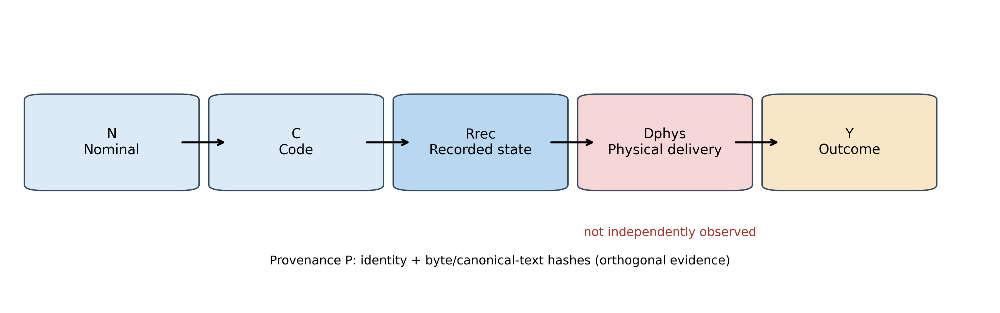
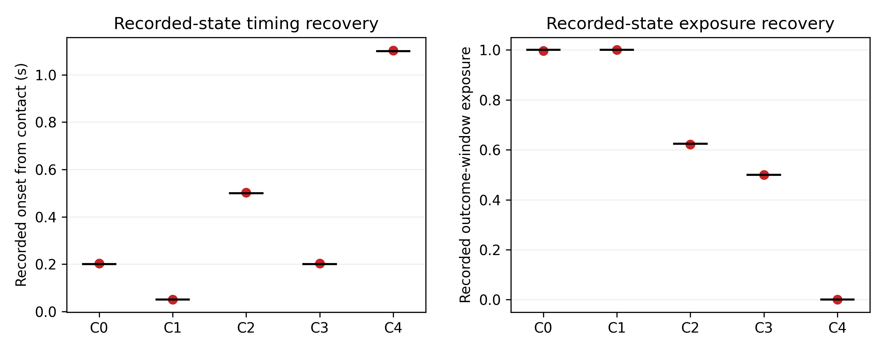
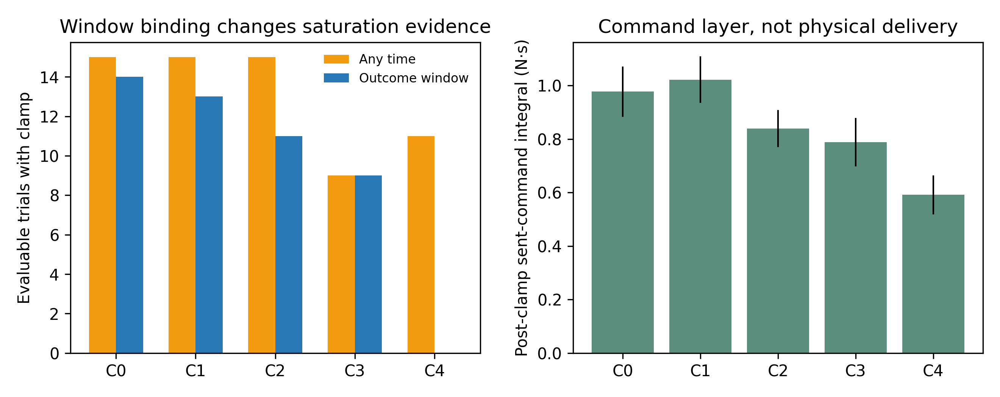
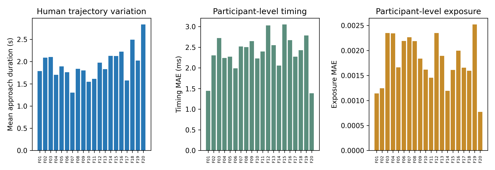

# Beyond Experimental Condition Labels: A Runtime-Exposure Fidelity Framework for Asynchronous Human–Machine Experiments

> **Manuscript status.** THMS-targeted English manuscript v3. The approving or exempting body, identifier, date, consent procedure, and scope of archived-data reuse must be completed from authentic contemporaneous records: `[ETHICS RECORD REQUIRED—DO NOT SUBMIT]`. Author names, affiliations, funding, conflicts of interest, author contributions, acknowledgments, and data/code availability also remain author-verified submission requirements.

## Abstract

Asynchronous human–machine experiments commonly define conditions with labels such as fixed, adaptive, or vision-enabled. A label does not establish that the coupled system entered the intended state during the outcome window, nor that a software command became the intended physical stimulus. We propose a five-layer runtime-exposure fidelity framework linking nominal specification, code implementation, recorded runtime state, independently measured physical delivery, and human outcome as (N_m\rightarrow C_m\rightarrow R_i^{rec}\rightarrow D_i^{phys}\rightarrow Y_i). Acquisition identity and hash-based provenance form an orthogonal evidence dimension. Activation timing error, \(\epsilon_i\), and outcome-window exposure, \(\Phi_i\), bound evidence-admissible comparisons, while fidelity is reported as a vector rather than collapsed into one score. Evidence comes from two complementary studies. A retrospective case involving five participants and 180 cleaned trials located discontinuities among nominal semantics, executable logic, and recorded state. A subsequent study involved 20 independent participants and 300 planned trials. Five frozen conditions systematically manipulated activation onset and duration; 294 complete trials entered the record-layer criterion analysis, while six safety aborts remained in the flow and safety denominator. An offline analyzer recovered the correct condition in 294/294 trials (100%; exact 95% CI, 98.75%–100%). Absolute activation-time error had an MAE, P95, and maximum of 2.381, 4.957, and 5.408 ms; corresponding exposure errors were 0.001798, 0.005996, and 0.006760. Participant-mean approach duration ranged from 1.3033 to 2.8360 s, and recovery remained stable across quartiles of duration, path length, and clamp rate. Command clamping occurred somewhere in 65/294 evaluable trials but within the outcome window in 47/294. C4 had 11 whole-trial clamps and zero window clamps, demonstrating that temporal window binding changes the interpretable exposure evidence. Logged vectors were post-clamp software commands sent to an API; an API return was not physical confirmation. Because no independent output sensor was acquired, the physical-delivery layer remains unobserved. Human force outcomes are participant-level exploratory descriptions only. The results support within-platform criterion validity at the record layer while defining why that evidence cannot substitute for end-to-end physical measurement or causal human-effect evidence.

**Index Terms—** Human–machine systems evaluation, runtime exposure, intervention fidelity, asynchronous teleoperation, outcome window, criterion validity, provenance.

# I. Introduction

Closed-loop teleoperation couples human perception and adaptation with a master haptic interface, supervisory software, a remote robot, and the environment. Contact performance is therefore not an isolated controller output; it emerges from components operating across different loops, threads, and clocks [1]–[4]. Haptic guidance, shared control, and variable impedance continue to extend human–machine capability, but they also create more opportunities for an experimental condition to be delayed, shortened, saturated, or otherwise altered at runtime [13]–[17], [20]–[24].

Consider a condition described as “increase feedback gain 200 ms after contact,” with an outcome window from 200 to 1000 ms after contact. Because the contact-event and control loops are asynchronous, the logged state may change at 203 ms. A 2-N safety limit may then clamp the command before the haptic API call. The records can support that the runtime state activated at 203 ms and that the post-clamp software command saturated. Without an independent sensor, however, they cannot support that physical force at the operator increased proportionally from 203 ms. A single condition label conflates these three propositions.

Several literatures address parts of this problem. Delay and transparency studies quantify communication and control latency [5], [14], [20], [24]. Runtime verification evaluates whether robot executions satisfy formal properties [10]. Implementation-fidelity research examines whether an intervention was implemented as designed [11]. Reproducibility work calls for fuller descriptions of HRI apparatus, procedures, and analyses [12], [17], [19], [23]. Direct haptic-device experiments further show why commanded input and actual output accuracy require an additional force-sensing link [18]. What remains missing is a rule tailored to inference from asynchronous human–machine experiments: how to trace a label to runtime exposure in the outcome window, preserve the gap between software record and physical delivery, and narrow comparisons when a layer is unsupported.

This work addresses three research questions.

1. **RQ1—Discontinuity diagnosis:** Can a five-layer framework locate breaks among nominal labels, implementation, recorded state, physical delivery, and human outcomes?
2. **RQ2—Record-layer criterion validity:** Under heterogeneous human-generated trajectories, can activation timing, outcome-window exposure, and condition identity be recovered accurately at the recorded-state layer?
3. **RQ3—Inferential boundary:** How do layer-specific evidence gaps constrain evidence-admissible comparisons and scientific wording?

Our contributions are threefold. First, we introduce the chain (N\rightarrow C\rightarrow R^{rec}\rightarrow D^{phys}\rightarrow Y), with outcome-window exposure as the connection between dynamic intervention state and the corresponding outcome. Second, we report fidelity as a vector spanning semantics, implementation, recorded timing, window exposure, sent command, physical delivery, and provenance; no aggregate score can conceal a layer-specific failure. Third, a five-participant retrospective diagnosis and a 20-participant record-layer criterion study provide complementary evidence. The latter uses human trajectory variation as a stress test, but participant count is not treated as a substitute for independent hardware measurement.

# II. Runtime-Exposure Fidelity Framework

## A. Five Evidence Layers and Orthogonal Provenance

For trial \(i\) under mode \(m\), the evidence chain is

\[
N_m\rightarrow C_m\rightarrow R_i^{rec}\rightarrow D_i^{phys}\rightarrow Y_i. \tag{1}
\]

Here, \(N_m\) is the contemporaneously supported specification of parameters, guards, event order, and intended exposure. \(C_m\) is the state machine, initialization, update, and saturation logic implemented in the acquisition software. The recorded state is

\[
R_i^{rec}=\{\mathcal E_i,a_i(t),\boldsymbol\theta_i^{log}(t),\mathbf u_i^{cmd}(t)\}, \tag{2}
\]

including events, the logged activation state, parameter trajectories, and post-clamp command sent to the device API. \(D_i^{phys}\) is end-to-end physical stimulation measured by an independent sensor, and \(Y_i\) is a human or system outcome in a defined window.

Acquisition provenance \(\mathcal P_i\) is orthogonal to the chain. It establishes that events, sample records, summaries, and outcomes belong to the same acquisition and identifies software and configuration versions. Hash agreement establishes file identity, not correct physical realization. Likewise, an API success return establishes software-call completion, not device output.

## B. Timing, Outcome-Window Exposure, and Sent Command

Let \(t^N_{act,i}\) be scheduled activation and \(t^{rec}_{act,i}\) be recorded activation. Timing error is

\[
\epsilon_i=t^{rec}_{act,i}-t^N_{act,i}. \tag{3}
\]

For outcome window \(W=[t_0,t_1]\) and recorded binary state \(a_i(t)\), record-layer exposure is

\[
\Phi_i^{rec}=\frac{1}{t_1-t_0}\int_{t_0}^{t_1}a_i(t)\,dt. \tag{4}
\]

The sent-command layer can be described separately by

\[
Q_i^{cmd}=\int_{t_0}^{t_1}\lVert\mathbf u_i^{cmd}(t)\rVert\,dt, \tag{5}
\]

together with the fraction of the window for which the command was clamped. The unit of \(Q_i^{cmd}\) is software-command N·s; it is not an independently measured physical impulse. The criterion study targets \(\epsilon_i\) and \(\Phi_i^{rec}\), and command-layer measurements do not stand in for \(D_i^{phys}\).

## C. Vector-Valued Fidelity and Evidence-Admissible Comparisons

We represent fidelity as

\[
\mathbf F_i=(F_N,F_C,F_{R,t},F_{R,\Phi},F_{R,cmd},F_D,F_P), \tag{6}
\]

whose components can be supported, limited, unavailable, or not independently observed. We do not define a weighted total. Different missing components invalidate different propositions: accurate recorded timing with unobserved physical delivery permits a comparison of recorded exposure, but not an interpretation of command integral as actual haptic dose.

An evidence-admissible comparison is the narrowest comparison supported by the available layers. Full physical-intervention semantics require support across specification, implementation, record, and physical delivery. If evidence ends at the record layer, wording must be limited to runtime state or software-command distributions. Post hoc observed-state grouping does not itself create a causal treatment.

**Fig. 1.** Five runtime-exposure evidence layers. The physical-delivery layer, shown in red, was not independently observed. Provenance provides orthogonal identity evidence.

# III. Study 1: Retrospective Diagnosis

## A. Platform and Archive

The archived platform combined an Omega.7 master, Intel RealSense D435i vision channel, supervisory controller, Franka Emika Panda arm, and gripper. Five participants performed three material conditions, three repeated blocks, and four configurations (A/G/E/F), yielding 180 cleaned trials. The independent unit for human outcomes was the participant (\(n=5\)), not the trial. Force was the Panda internal external-wrench estimate `O_F_ext_hat_K`; logged stiffness was a software command.

A was a fixed reference. G contained the original force rule. E changed vision and several command parameters. F bundled vision with an adaptive path. The retrospective outcome window was 0.20–1.00 s after contact. This study evaluates whether the framework changes the interpretation of archived comparisons; it does not re-establish efficacy of the original controllers.

## B. Reconstruction and Discontinuities

Reconstruction combined nominal descriptions, acquisition code, event JSON, sample-level CSV, and summary files. A frozen identity rule selected 180 analysis acquisitions from 186 records. Acquisition identity and SHA-256 linked each state record to its outcome.

All 45 G trials followed the executable original force rule, yet 43 activated before recorded contact and could not represent a purely post-contact intervention. F showed no precontact activation, but only 3/45 trials achieved the nominal contact +0.20-s gate; median contact-to-activation time was +0.0533 s. Vision exposure was full/partial/zero in 39/2/4 E trials and combined exposure was full/partial/zero in 35/7/3 F trials.

Consequently, A/G/E/F did not form a clean 2 × 2 factorial design. E–A can describe a bundled configuration with heterogeneous vision exposure; G–A cannot identify an isolated post-contact force effect; F–E cannot identify an increment from a correctly timed +0.20-s gate; and F–G cannot identify a vision-by-force interaction. The case demonstrates that the framework narrows claims rather than deleting inconvenient trials to restore nominal semantics.

# IV. Study 2: Record-Layer Criterion Study

## A. Design and Scheduled Patterns

The formal study used an isolated `kfb_timing` mode on the same Omega.7–Panda platform. Vision, gripper actuation, and other adaptive strategies were disabled. Only the onset and duration of recorded \(K_{fb}=0.5\rightarrow0.7\) were manipulated. F01–F20 represented 20 independent participants. Each completed three blocks containing each of five conditions once, for 15 planned trials per participant and 300 in the locked queue. Although the frozen ordering file reserved F01–F24 positions, only completed F01–F20 data were analyzed.

The target control rate was 200 Hz. Contact required baseline-corrected force above threshold for 0.050 s. The outcome window was contact +0.20 to +1.00 s. Panda-estimated external force above 5 N caused a safety abort, and haptic command norm was limited to 2 N before the API call.

| Condition | Scheduled pattern | Active interval after contact, s | Expected \(\epsilon\), s | Expected \(\Phi^{rec}\) |
|---|---|---:|---:|---:|
| C0 | Correct | 0.20–1.20 | 0.00 | 1.000 |
| C1 | Early | 0.05–1.20 | −0.15 | 1.000 |
| C2 | Late | 0.50–1.20 | +0.30 | 0.625 |
| C3 | Short | 0.20–0.60 | 0.00 | 0.500 |
| C4 | Outside window | 1.10–1.30 | +0.90 | 0.000 |

These are truths for the frozen schedule. They benchmark reconstruction from planned to recorded state; they are not truths about physical output.

## B. Independent Analysis Queue and Provenance

The offline analyzer did not import condition constants from the online controller. It read the frozen protocol JSON, private oracle, and formal acquisition files. Only F01–F20 were permitted, with exactly 15 logical trials each. The analyzer verified CSV, event JSON, summary JSON, and manifest files for 300 trial identities. Missing, duplicate, extra-participant, identity, mask, path, or configuration-hash mismatch caused immediate failure. Historical files sharing F01–F05 names were outside the input root and were neither scanned nor merged.

CSV required byte-exact SHA-256 agreement. Event and summary JSON were checked with both byte hashes and normalized-text hashes, where normalization addressed UTF-8 BOM and newline representation only. All 300 CSV files matched byte-for-byte. Event and summary bytes differed because of newline representation, while normalized content matched for 300/300 of each type. No source file was modified.

## C. Endpoints, Limits, and Human-Trajectory Stress Test

Primary record-layer endpoints were condition accuracy with an exact two-sided binomial 95% interval; MAE, P95, and maximum absolute activation-time error; and MAE, P95, and maximum absolute exposure error. Limits were accuracy ≥95%; timing MAE and P95 ≤20 ms; timing maximum ≤50 ms; and \(\Phi\) MAE ≤0.02. At 200 Hz, 20 ms is four cycles and 50 ms is ten cycles. The latter also equals the contact-confirmation hold. A \(\Phi\) error of 0.02 equals 16 ms in the 0.8-s outcome window. These limits existed before the present formal dataset but were not publicly registered in advance.

Control period, Omega validity, API return, safety abort, and command clamp were reported separately. Outcome-window clamp duration used left-hold integration. Post-clamp command norm used trapezoidal integration. `haptic_send_ok` was interpreted only as an API return.

The 20-person sample tested whether human-in-the-loop motion variation disrupted record recovery. Trial metrics comprised task-start-to-contact duration, robot and Omega path, robot peak speed, internal-force impulse, and clamp fraction. Participant summaries were divided descriptively into quartiles of approach duration, robot path, and whole-trial clamp rate. Accuracy, timing MAE, and exposure MAE were summarized without significance screening.

Human outcome contrasts were participant-level and exploratory. Detailed C1–C4 versus C0 paired differences and a sensitivity analysis excluding clamped trials are in the supplement.

# V. Results

## A. Trial Flow and Recorded-State Recovery

Of 300 planned trials, 294 were complete and evaluable; six ended under the 5-N safety rule. All 294 evaluable trials were assigned to the correct scheduled condition: 100% accuracy with an exact 95% CI of 98.75%–100%.

| Condition | Evaluable/planned | Accuracy (exact 95% CI) | Target onset, s | Participant-mean recorded onset, s | Timing MAE, ms | Target \(\Phi\) | Participant-mean recorded \(\Phi\) | \(\Phi\) MAE |
|---|---:|---:|---:|---:|---:|---:|---:|---:|
| C0 | 60/60 | 100% [94.04%, 100%] | 0.200 | 0.20291 | 2.932 | 1.000 | 0.99635 | 0.003653 |
| C1 | 59/60 | 100% [93.94%, 100%] | 0.050 | 0.05109 | 1.095 | 1.000 | 1.00000 | 0.000000 |
| C2 | 58/60 | 100% [93.83%, 100%] | 0.500 | 0.50251 | 2.528 | 0.625 | 0.62186 | 0.003160 |
| C3 | 60/60 | 100% [94.04%, 100%] | 0.200 | 0.20282 | 2.826 | 0.500 | 0.49977 | 0.002100 |
| C4 | 57/60 | 100% [93.73%, 100%] | 1.100 | 1.10248 | 2.513 | 0.000 | 0.00000 | 0.000000 |

Overall absolute timing-error MAE, P95, and maximum were 2.381, 4.957, and 5.408 ms. Absolute exposure-error MAE, P95, and maximum were 0.001798, 0.005996, and 0.006760. Every stated criterion was satisfied.

**Fig. 2.** Frozen scheduled patterns (black), trial records (blue), and means (red). This is a record-layer recovery result, not evidence of physical output or a human effect.

## B. Command Layer and Outcome-Window Binding

Among 294 evaluable trials, 65 contained at least one clamp anywhere in the trial and 47 contained a clamp in the outcome window. Window-clamp counts for C0–C4 were 14, 13, 11, 9, and 0. Mean window-clamp fractions were 0.1103, 0.1021, 0.0610, 0.0230, and 0. C4 had 11 whole-trial clamps but none in the outcome window because scheduled activation occurred after that window. Thus, an unbound “ever clamped” flag does not describe the command exposure corresponding to the outcome.

Participant-mean integrals of the post-clamp sent command for C0–C4 were 0.9773, 1.0224, 0.8394, 0.7891, and 0.5917 software-command N·s. These values describe vectors recorded as sent to the haptic API; they are not actual force impulse at the hand.

**Fig. 3.** Whole-trial versus outcome-window clamp occurrence (left) and post-clamp sent-command integral (right). Both are software-record evidence.

## C. Human-Generated Trajectory Variability

Participant-mean task-start-to-contact duration ranged from 1.3033 to 2.8360 s; the complete-trial range was 0.6145–5.3001 s. Participant-mean approach robot path ranged from 0.00954 to 0.02444 m, internal-force impulse from 0.2492 to 1.1881 N·s, and whole-trial clamp rate from 6.67% to 78.57%.

Despite this variation, every participant had 100% record-layer classification. Participant timing MAE ranged from 1.386 to 3.052 ms and exposure MAE from 0.000771 to 0.002521. Across 12 descriptive quartile groups based on duration, robot path, and clamp rate, mean accuracy remained 100%; timing MAE ranged from 2.23 to 2.62 ms and exposure MAE from 0.00143 to 0.00203.

**Fig. 4.** Participant-mean approach duration and participant-level timing and exposure errors. This is a human-generated trajectory stress test, not independent measurement of device output.

## D. System Quality, Safety, and Exploratory Outcomes

Safety aborts by C0–C4 were 0, 1, 2, 0, and 3. Every complete trial had outcome-window Omega validity of at least 99%. No trial exceeded a control-period P99 of 20 ms or maximum of 50 ms, and no haptic API call was logged as failed.

Participant-level exploratory force contrasts, participant directions, and the unclamped-trial sensitivity analysis are reported in the supplement. No human difference is used as evidence that the framework succeeded. The success criteria concern only recovery of scheduled-pattern \(\epsilon\), \(\Phi\), and condition identity at the record layer.

# VI. Discussion

## A. Novelty of Outcome-Window Binding

The five-layer chain is not simply a longer checklist. Its central operation is binding a dynamic intervention to the outcome window. The retrospective case showed that nominally factorial configurations could generate early, partial, or zero recorded exposure. The formal study then showed that whole-trial and window-specific saturation can support different statements. C4's 11 whole-trial clamps and zero window clamps are the clearest example. An asynchronous experimental condition should therefore be represented as a runtime object with state, timing, and window, not as a static label.

Vector-valued reporting prevents a success in one layer from concealing a gap in another. Recorded timing and exposure met the stated limits, while sent commands were often clamped and physical delivery was not observed. The defensible claim is within-platform support for record-layer criterion validity, not proof of the entire end-to-end chain.

## B. Complementary Roles of the Two Studies

The five-participant case demonstrates that the framework finds interpretation-changing discontinuities in a real archive and narrows A/G/E/F comparisons to what the evidence supports. The 20-participant study evaluates record-layer measurement and classification under frozen scheduled patterns. Its success does not depend on favorable human outcomes in the earlier case, directly addressing the concern that the framework merely continues an unsuccessful experiment. Conversely, it does not retroactively establish efficacy of the original controllers.

The role of 20 participants is trajectory variation rather than multiplication of trial-level sample size. The same patterns experienced different approach durations, paths, speeds, forces, and saturation backgrounds. Quartile summaries show that these differences did not disrupt recovery. All evidence nevertheless came from one platform and logging ecosystem, so common-mode error remains possible.

## C. Validity Boundaries and Future Work

First, scheduled patterns, the online state machine, and logging architecture belong to one system. The offline analyzer reads frozen configuration independently and imports no online condition constants, but shared time-source or implementation error cannot be excluded. Second, `haptic_send_ok` is an API return and the post-clamp vector is a software record. No load cell, handle force sensor, or independent force/torque channel was acquired; therefore \(D^{phys}\) remains unobserved. Direct haptic-output work uses an additional force sensor to establish output accuracy [18], illustrating the evidence required for future end-to-end testing. Third, Panda force is an internal estimate, restricting human force results to exploratory description. Fourth, this single-platform fixed-contact task does not cover complex grasping, vision-dependent interaction, long network delay, or an independent team's software ecosystem.

Research governance is a submission gate. Demographics, training, risk disclosure, consent, and ethics information must come from authentic records; data files and hashes cannot substitute for governance evidence. A recent THMS study validating a formal human-error method used a clearly documented human experiment and ethics process [25], underscoring that method validation does not reduce human-subject reporting obligations.

# VII. Conclusion

We introduced a five-layer runtime-exposure fidelity framework that separates nominal specification, code, recorded state, physical delivery, and human outcome while binding dynamic intervention to its outcome window. The retrospective case demonstrated interpretation-changing semantic and runtime discontinuities. The formal study achieved 294/294 record-condition classification, a timing-error P95 of 4.957 ms, and an exposure-error P95 of 0.005996 across substantial human-generated trajectory variation. Command saturation, API-return semantics, internal force estimation, and the unobserved physical layer remained explicit rather than being hidden by the primary result. The evidence supports criterion validity from scheduled patterns to recorded runtime state within one platform; it does not establish controller efficacy, causal human effects, or end-to-end physical delivery.

# References

[1] B. Hannaford, “A design framework for teleoperators with kinesthetic feedback,” *IEEE Trans. Robot. Autom.*, vol. 5, no. 4, pp. 426–434, 1989, doi: 10.1109/70.88057.

[2] D. A. Lawrence, “Stability and transparency in bilateral teleoperation,” *IEEE Trans. Robot. Autom.*, vol. 9, no. 5, pp. 624–637, 1993, doi: 10.1109/70.258054.

[3] P. F. Hokayem and M. W. Spong, “Bilateral teleoperation: An historical survey,” *Automatica*, vol. 42, no. 12, pp. 2035–2057, 2006, doi: 10.1016/j.automatica.2006.06.027.

[4] C. Passenberg, A. Peer, and M. Buss, “A survey of environment-, operator-, and task-adapted controllers for teleoperation systems,” *Mechatronics*, vol. 20, no. 7, pp. 787–801, 2010, doi: 10.1016/j.mechatronics.2010.04.005.

[5] I. M. L. C. Vogels, “Detection of temporal delays in visual-haptic interfaces,” *Human Factors*, vol. 46, no. 1, pp. 118–134, 2004, doi: 10.1518/hfes.46.1.118.30394.

[6] N. Hogan, “Impedance control: An approach to manipulation: Part I—Theory,” *J. Dyn. Syst. Meas. Control*, vol. 107, no. 1, pp. 1–7, 1985, doi: 10.1115/1.3140702.

[7] D. S. Walker, R. P. Wilson, and G. Niemeyer, “User-controlled variable impedance teleoperation,” in *Proc. IEEE ICRA*, 2010, doi: 10.1109/ROBOT.2010.5509811.

[8] J. Buchli, F. Stulp, E. Theodorou, and S. Schaal, “Learning variable impedance control,” *Int. J. Robot. Res.*, vol. 30, no. 7, pp. 820–833, 2011, doi: 10.1177/0278364911402527.

[9] A. Ajoudani, N. G. Tsagarakis, and A. Bicchi, “Tele-impedance: Teleoperation with impedance regulation using a body–machine interface,” *Int. J. Robot. Res.*, vol. 31, no. 13, pp. 1642–1656, 2012, doi: 10.1177/0278364912464668.

[10] J. Huang *et al.*, “ROSRV: Runtime verification for robots,” in *Runtime Verification*, 2014, pp. 247–254.

[11] C. Carroll, M. Patterson, S. Wood, A. Booth, J. Rick, and S. Balain, “A conceptual framework for implementation fidelity,” *Implementation Science*, vol. 2, art. 40, 2007, doi: 10.1186/1748-5908-2-40.

[12] F. Bonsignorio and A. P. del Pobil, “Toward replicable and measurable robotics research,” *IEEE Robot. Autom. Mag.*, vol. 22, no. 3, pp. 32–35, 2015, doi: 10.1109/MRA.2015.2452073.

[13] K. Huang, D. Chitrakar, F. Rydén, and H. J. Chizeck, “Evaluation of haptic guidance virtual fixtures and 3D visualization methods in telemanipulation—A user study,” *Intell. Serv. Robot.*, vol. 12, pp. 289–301, 2019, doi: 10.1007/s11370-019-00283-w.

[14] D. Rakita, B. Mutlu, and M. Gleicher, “Effects of onset latency and robot speed delays on mimicry-control teleoperation,” in *Proc. ACM/IEEE HRI*, 2020, doi: 10.1145/3319502.3374838.

[15] F. J. Abu-Dakka and M. Saveriano, “Variable impedance control and learning—A review,” *Front. Robot. AI*, vol. 7, art. 590681, 2020, doi: 10.3389/frobt.2020.590681.

[16] Y. Michel, R. Rahal, C. Pacchierotti, P. Robuffo Giordano, and D. Lee, “Bilateral teleoperation with adaptive impedance control for contact tasks,” *IEEE Robot. Autom. Lett.*, vol. 6, no. 3, pp. 5429–5436, 2021, doi: 10.1109/LRA.2021.3066974.

[17] H. Gunes *et al.*, “Reproducibility in human-robot interaction: Furthering the science of HRI,” *Current Robotics Reports*, vol. 3, no. 4, pp. 281–292, 2022, doi: 10.1007/s43154-022-00094-5.

[18] G.-Y. Liu, Y. Wang, C. Huang, C. Guan, D.-T. Ma, Z. Wei, and X. Qiu, “Experimental evaluation on haptic feedback accuracy by using two self-made haptic devices and one additional interface in robotic teleoperation,” *Actuators*, vol. 11, no. 1, art. 24, 2022, doi: 10.3390/act11010024.

[19] S. Bagchi *et al.*, “Towards improved replicability of human studies in human-robot interaction: Recommendations for formalized reporting,” in *HRI 2023 Companion*, 2023, doi: 10.1145/3568294.3580162.

[20] R. Aldana-López, R. Aragüés, and C. Sagüés, “Latency vs precision: Stability preserving perception scheduling,” *Automatica*, vol. 155, art. 111123, 2023, doi: 10.1016/j.automatica.2023.111123.

[21] L. Peternel and A. Ajoudani, “After a decade of teleimpedance: A survey,” *IEEE Trans. Human-Mach. Syst.*, vol. 53, no. 2, pp. 401–416, 2023, doi: 10.1109/THMS.2022.3231703.

[22] Y. Michel, Z. Li, and D. Lee, “A learning-based shared control approach for contact tasks,” *IEEE Robot. Autom. Lett.*, vol. 8, no. 12, pp. 8002–8009, 2023, doi: 10.1109/LRA.2023.3322332.

[23] S. Marchesi, D. De Tommaso, K. Kompatsiari, Y. Wu, and A. Wykowska, “Tools and methods to study and replicate experiments addressing human social cognition in interactive scenarios,” *Behav. Res. Methods*, vol. 56, no. 7, pp. 7543–7560, 2024, doi: 10.3758/s13428-024-02434-z.

[24] J. Louca, K. Eder, J. Vrublevskis, and A. Tzemanaki, “Impact of haptic feedback in high latency teleoperation for space applications,” *ACM Trans. Human-Robot Interact.*, vol. 13, no. 2, art. 16, 2024, doi: 10.1145/3651993.

[25] Y. Son, M. L. Bolton, E. Crooks, H. Palmer, E. Kang, and C. Daly, “Validation of a formal method for human error rate prediction with negative transfer,” *IEEE Trans. Human-Mach. Syst.*, vol. 55, no. 5, pp. 844–854, 2025, doi: 10.1109/THMS.2025.3593085.

[26] I. Lundberg, R. Johnson, and B. M. Stewart, “What is your estimand? Defining the target quantity connects statistical evidence to theory,” *Am. Sociol. Rev.*, vol. 86, no. 3, pp. 532–565, 2021, doi: 10.1177/00031224211004187.
