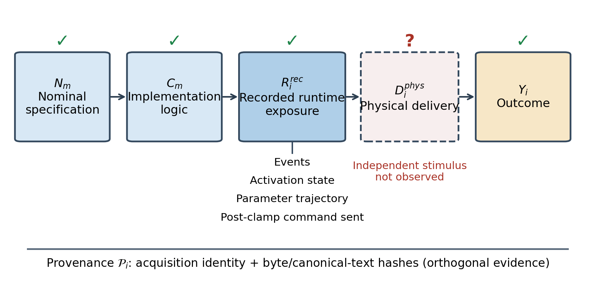
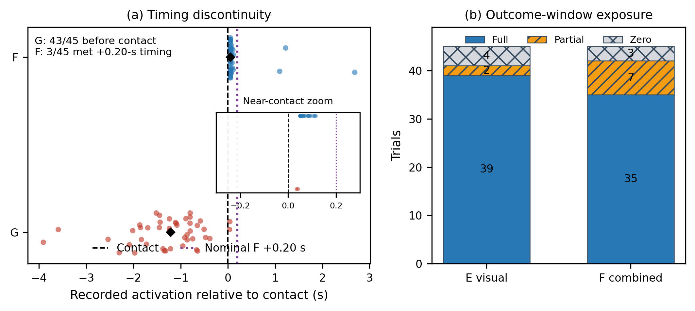
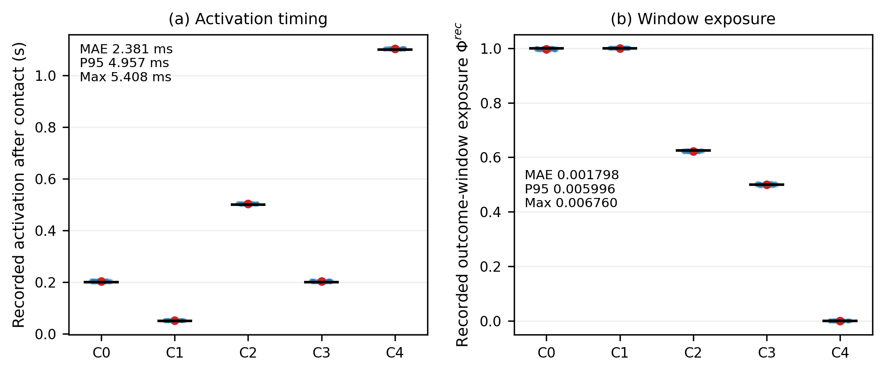
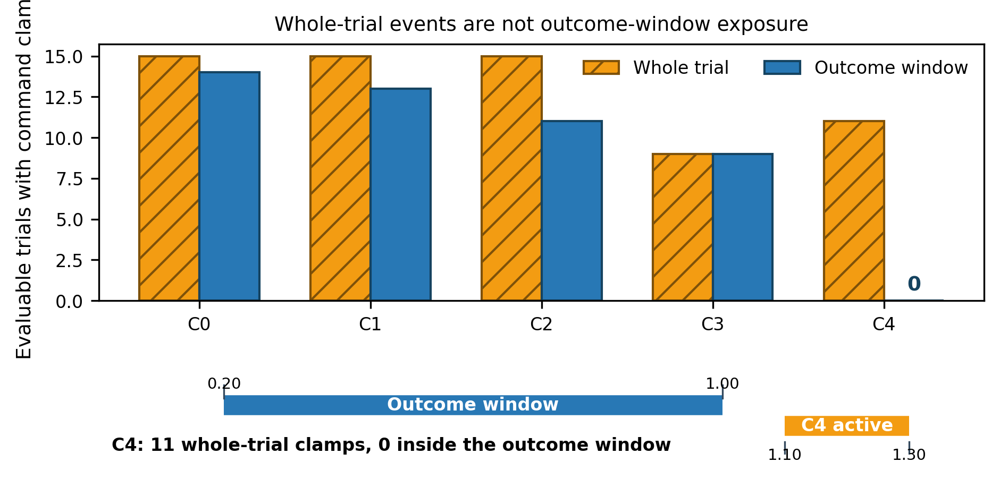
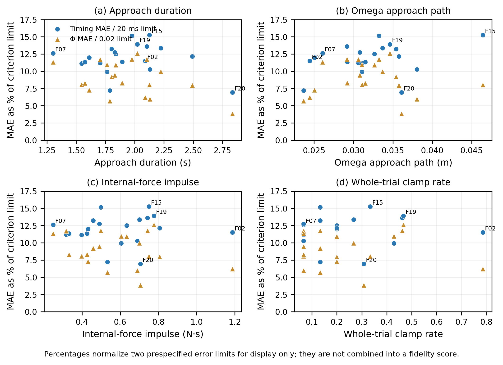

# Beyond Experimental Condition Labels: A Runtime-Exposure Fidelity Framework for Asynchronous Human–Machine Experiments

> **Submission gate.** Author names, affiliations, funding, conflicts, contributions, acknowledgments, data/code availability, and authentic human-subject records remain to be completed. The approving or exempting body, identifier, date, consent procedure, and archived-data-reuse scope must be supplied from contemporaneous records: `[ETHICS RECORD REQUIRED—DO NOT SUBMIT]`.

## Abstract

Asynchronous human–machine experiments often treat a condition label as if it guaranteed the intended intervention. A label, however, does not establish when a coupled system entered the intended state, how much of that state overlapped the outcome window, or whether a software command became the intended physical stimulus. We propose a five-layer runtime-exposure fidelity framework linking nominal specification, implementation logic, recorded runtime state, independently measured physical delivery, and outcome as (N_m\rightarrow C_m\rightarrow R_i^{rec}\rightarrow D_i^{phys}\rightarrow Y_i). Provenance is an orthogonal evidence dimension, and fidelity is retained as a vector rather than collapsed into one score. A retrospective five-participant, 180-trial case located interpretation-changing discontinuities between nominal labels and runtime exposure. A subsequent study used 20 independent participants, 300 planned trials, and five frozen timing/exposure patterns to test record-layer recovery under human-generated trajectory variation. Of 300 trials, 294 were evaluable and six were retained as safety aborts. Condition identity was recovered in 294/294 trials (100%; exact 95% CI, 98.75%–100%). Absolute activation-time error had MAE/P95/maximum values of 2.381/4.957/5.408 ms; exposure-proportion error had corresponding values of 0.001798/0.005996/0.006760. Participant-mean approach duration ranged from 1.3033 to 2.8360 s, Omega path from 0.02367 to 0.04643 m, Panda path from 0.00954 to 0.02444 m, internal-force impulse from 0.2492 to 1.1881 N·s, and whole-trial clamp rate from 6.67% to 78.57%. Nevertheless, the worst participant timing and exposure MAEs used only 15.26% and 12.61% of their prespecified analysis limits. Descriptive participant-level associations and fixed-seed bootstrap intervals showed no criterion failure within the observed variability range; they are not causal-independence tests. Whole-trial command clamping occurred in 65/294 evaluable trials and outcome-window clamping in 47/294, demonstrating why temporal binding matters. The recorded command was the post-clamp vector sent to an API, and no independent output sensor was acquired; physical delivery therefore remains unobserved. Human force outcomes are exploratory. The evidence supports within-platform criterion validity from frozen patterns to recorded runtime exposure under human-in-the-loop variation, while preserving the boundary to physical delivery and human-effect claims.

**Index Terms—** Human–machine systems, runtime exposure, intervention fidelity, asynchronous teleoperation, outcome window, human variability, provenance.

# I. Introduction

Teleoperation couples a human operator, master device, supervisory software, remote robot, environment, and multiple asynchronous loops [1]–[4]. The experimental intervention is therefore not merely a label such as *fixed*, *adaptive*, or *vision-enabled*. It is a time-varying system state realized—or not realized—while a defined outcome is generated. Event latency, state-machine guards, shortened activation, command saturation, or logging gaps can make two trials with the same nominal label have different runtime exposure [5], [10], [14], [20], [24].

Consider an intervention described as “increase feedback gain 200 ms after contact” and an outcome window from 200 to 1000 ms after contact. The record may show activation at 203 ms, followed by a 2-N software clamp before the haptic API call. This supports statements about recorded activation and the post-clamp software command. It does not establish the physical force delivered at the hand unless that output is independently measured. Treating all three propositions as one condition label hides the exact evidence break.

Prior work addresses delay, teleoperation transparency, runtime verification, implementation fidelity, and reproducible HRI reporting [5], [10]–[12], [17]–[20], [23], [24]. Direct haptic-output experiments additionally demonstrate why commanded input and physical output require a separate sensing link [18]. What remains needed is an inference-oriented framework that binds a dynamic intervention to its outcome window, distinguishes recorded command from physical delivery, and specifies which comparisons remain defensible when a layer is absent.

This work addresses three questions:

1. **RQ1:** Can a five-layer framework locate discontinuities among nominal label, implementation, recorded state, physical delivery, and outcome?
2. **RQ2:** Under heterogeneous trajectories produced by human participants, can condition identity, activation timing, and outcome-window exposure be recovered accurately at the recorded-state layer?
3. **RQ3:** How do layer-specific evidence gaps constrain evidence-admissible comparisons and scientific wording?

The contributions are: (1) a five-layer evidence chain with provenance orthogonal to it; (2) outcome-window exposure as the explicit bridge between runtime intervention and outcome; (3) a vector-valued fidelity report that prevents success at one layer from concealing absence at another; and (4) complementary evidence from a real retrospective diagnosis and a prospective, controlled record-layer criterion study. The 20-person sample is used as a human-in-the-loop stress test: participant count increases observed trajectory diversity but does not replace independent physical sensing.

# II. Runtime-Exposure Fidelity Framework

## A. Five Evidence Layers

For trial (i) under mode (m), the chain is

\[
N_m\rightarrow C_m\rightarrow R_i^{rec}\rightarrow D_i^{phys}\rightarrow Y_i. \tag{1}
\]

(N_m) is the contemporaneously supported nominal specification; (C_m) is the executable state, guard, initialization, update, and clamp logic; and

\[
R_i^{rec}=\{\mathcal E_i,a_i(t),\boldsymbol\theta_i^{log}(t),\mathbf u_i^{cmd}(t)\} \tag{2}
\]

contains recorded events, activation state, parameter trajectories, and the post-clamp command sent to the device API. (D_i^{phys}) is end-to-end physical stimulation measured by an independent sensor. (Y_i) is a human or system outcome in a declared window.

Provenance (\mathcal P_i) is orthogonal: acquisition identity, software/configuration identity, and byte or canonical-text hashes establish which records belong together. Hash agreement establishes file identity, not correct physical realization. Likewise, `haptic_send_ok` is an API return, not confirmation of device output.

**Fig. 1.** Five-layer runtime-exposure framework. This study observed the first three layers and outcomes, but did not independently observe physical delivery. Provenance provides orthogonal identity evidence.

## B. Timing, Window Exposure, and Command

Let (t^N_{act,i}) and (t^{rec}_{act,i}) denote nominal and recorded activation. Timing error is

\[
\epsilon_i=t^{rec}_{act,i}-t^N_{act,i}. \tag{3}
\]

For outcome window (W=[t_0,t_1]) and recorded binary activation (a_i(t)),

\[
\Phi_i^{rec}=\frac{1}{t_1-t_0}\int_{t_0}^{t_1}a_i(t)\,dt. \tag{4}
\]

The sent-command quantity

\[
Q_i^{cmd}=\int_{t_0}^{t_1}\lVert\mathbf u_i^{cmd}(t)\rVert\,dt \tag{5}
\]

is reported with outcome-window clamp duration. It has software-command N·s units and cannot be reinterpreted as independently measured physical impulse.

Fidelity remains the vector

\[
\mathbf F_i=(F_N,F_C,F_{R,t},F_{R,\Phi},F_{R,cmd},F_D,F_P), \tag{6}
\]

with components supported, limited, unavailable, or not independently observed. No weighted total is defined. An evidence-admissible comparison is the narrowest comparison supported by the observed layers. Accurate (R^{rec}) allows recorded-exposure comparisons; it does not license claims about (D^{phys}) or causal human response.

# III. Study 1: Retrospective Diagnosis

The archived platform combined an Omega.7 master, RealSense D435i, supervisory controller, Franka Emika Panda, and gripper. Five participants contributed 180 cleaned trials across A/G/E/F configurations. The independent unit for any human outcome was the participant, not 180 trials. The purpose here was diagnostic: determine whether the archived labels represented the intended runtime comparisons.

Reconstruction joined nominal descriptions, acquisition code, event JSON, sample CSV, and summaries under a frozen identity rule and SHA-256 audit. A was the fixed reference; G contained the original force rule; E bundled vision and command changes; F bundled vision with an adaptive path. The outcome window was contact +0.20 to +1.00 s.

**Fig. 2.** Retrospective discontinuities. (a) G commonly activated before contact, whereas only 3/45 F trials realized the nominal +0.20-s gate. (b) E visual exposure and F combined exposure were heterogeneous within the outcome window.

| Configuration | Nominal interpretation | Runtime evidence | Key discrepancy | Evidence-admissible interpretation |
|---|---|---|---|---|
| A | Fixed reference | 45/45 fixed recorded state | No major timing discrepancy identified | Reference configuration |
| G | Post-contact force adaptation | 45/45 followed executable rule | 43/45 activated before contact | Not an isolated post-contact force effect |
| E | Vision-enabled condition | 39/2/4 full/partial/zero visual exposure | Heterogeneous window exposure and bundled changes | Bundled configuration with heterogeneous exposure |
| F | Vision plus +0.20-s adaptive gate | 3/45 met timing; 35/7/3 full/partial/zero combined exposure | Nominal timing largely unrealized | Not a clean incremental +0.20-s effect |

**Table I.** Retrospective diagnostic summary.

These observations invalidate a clean 2×2 reading of A/G/E/F. The framework does not rescue that design by deleting mismatched trials; it narrows the comparisons to the recorded states actually supported. The old human force data remain an illustration of why nominal treatment-effect claims were not admissible, not evidence reused to prove the new framework.

# IV. Study 2: Prospective Record-Layer Criterion Study

## A. Design and Independent Analysis

The isolated `kfb_timing` mode ran on the same Omega.7–Panda platform with vision, gripper actuation, and other adaptive strategies disabled. Only onset and duration of recorded (K_{fb}=0.5\rightarrow0.7) were manipulated. F01–F20 were 20 independent participants; each had three blocks containing the five conditions once, yielding 300 planned trials. The formal input root contained only this cohort; historical names F01–F05 were outside the root and were not scanned or merged.

The target control rate was 200 Hz. Contact required force above threshold for 0.050 s. The outcome window was contact +0.20 to +1.00 s. A Panda internal-force estimate above 5 N triggered a safety abort, and software command norm was clamped to 2 N before the API call.

| Condition | Scheduled pattern | Active interval after contact (s) | Expected \(\epsilon\) (s) | Expected \(\Phi^{rec}\) |
|---|---|---:|---:|---:|
| C0 | Correct | 0.20–1.20 | 0.00 | 1.000 |
| C1 | Early | 0.05–1.20 | −0.15 | 1.000 |
| C2 | Late | 0.50–1.20 | +0.30 | 0.625 |
| C3 | Short | 0.20–0.60 | 0.00 | 0.500 |
| C4 | Outside window | 1.10–1.30 | +0.90 | 0.000 |

**Table II.** Frozen prospective reference conditions. These are schedule-to-record targets, not physical-output targets.

The offline analyzer read the frozen protocol JSON and private oracle without importing online-controller condition constants. It required exactly F01–F20 and 15 logical trials each. Missing, duplicate, illegal-participant, path, identity, configuration-hash, or mask mismatch caused failure. CSV files required byte-level hash agreement. JSON was audited by byte hash and by canonical text after BOM/newline normalization; all 300 CSV bytes matched, while event and summary JSON bytes reflected newline representation but canonical content matched 300/300. Source files were not modified.

## B. Endpoints and Human-Variability Stressors

Primary endpoints were classification accuracy with exact Clopper–Pearson 95% CI; MAE, P95, and maximum absolute timing error; and MAE, P95, and maximum absolute exposure error. Analysis limits were accuracy ≥95%, timing MAE/P95 ≤20 ms, timing maximum ≤50 ms, and exposure MAE ≤0.02. At 200 Hz, 20 ms is four cycles and 50 ms is ten cycles and the contact hold. Exposure error 0.02 equals 16 ms in the 0.8-s window. The limits predated this formal dataset but were not publicly registered.

The stress-test unit was the participant. Six participant-mean stressors were computed: task-start-to-contact duration; Omega path; Panda path; Panda peak speed; Panda internal-force impulse; and whole-trial clamp rate. Outcome-window clamp rate was additionally summarized. Omega path is human-input-related; Panda path, speed, and internal force are coupled human–machine trajectories. Clamp rate is a condition–operator interaction background and not an intrinsic personal trait.

Each participant's classification, timing MAE, exposure MAE, and error-to-limit fractions were reported. For each of six stressors, Spearman correlation with timing and exposure MAE was described with a 10,000-resample participant bootstrap percentile interval using fixed seed 20260827. No p-values were computed or screened. Accuracy was constant at 100%, so no accuracy association was estimated. Quartile summaries were secondary robustness descriptions. Human C1–C4 versus C0 force contrasts and exclusion of clamped trials remained exploratory and are confined to the supplement.

# V. Results

## A. Trial Flow and Primary Recovery

All 300 planned trials remained in the flow. Of these, 294 complete trials were evaluable for record recovery and six safety aborts were retained only in safety denominators. Condition identity was correct in 294/294 evaluable trials: 100%, exact 95% CI 98.75%–100%.

| Condition | Evaluable/planned | Correct | Timing MAE (ms) | Timing P95 (ms) | Timing max (ms) | \(\Phi\) MAE | \(\Phi\) P95 | \(\Phi\) max |
|---|---:|---:|---:|---:|---:|---:|---:|---:|
| C0 | 60/60 | 60/60 | 2.932 | 5.156 | 5.408 | 0.003653 | 0.006446 | 0.006760 |
| C1 | 59/60 | 59/59 | 1.095 | 1.778 | 2.266 | 0.000000 | 0.000000 | 0.000000 |
| C2 | 58/60 | 58/58 | 2.528 | 4.792 | 5.099 | 0.003160 | 0.005990 | 0.006374 |
| C3 | 60/60 | 60/60 | 2.826 | 5.005 | 5.095 | 0.002100 | 0.005215 | 0.005982 |
| C4 | 57/60 | 57/57 | 2.513 | 4.639 | 5.074 | 0.000000 | 0.000000 | 0.000000 |
| Overall | 294/300 | 294/294 | 2.381 | 4.957 | 5.408 | 0.001798 | 0.005996 | 0.006760 |

**Table III.** Prospective record-layer criterion results. The overall classification interval was 98.75%–100%; all stated limits were met.

**Fig. 3.** Trial-level recorded activation and window exposure by condition. Black segments are frozen targets, blue points are evaluable trials, and red points are means.

## B. Outcome-Window Binding at the Command Layer

Among 294 evaluable trials, 65 contained a clamp somewhere in the trial and 47 contained a clamp in the outcome window. Window-clamp counts for C0–C4 were 14, 13, 11, 9, and 0. Mean window-clamp fractions were 0.1103, 0.1021, 0.0610, 0.0230, and 0. C4 had 11 whole-trial clamps but no window clamps because its scheduled activation was outside the outcome window. Therefore, an “ever clamped” flag cannot characterize the command exposure associated with a windowed outcome.

Participant-mean integrals of the post-clamp command for C0–C4 were 0.9773, 1.0224, 0.8394, 0.7891, and 0.5917 software-command N·s. They describe software vectors sent to the API, not physical impulse at the hand.

**Fig. 4.** Whole-trial versus outcome-window clamp occurrence and participant-mean post-clamp sent-command integral. C4 illustrates why exposure must be bound to the outcome window.

## C. Human Variability as a Stress Test

Participant means covered 1.3033–2.8360 s for approach duration, 0.02367–0.04643 m for Omega path, 0.00954–0.02444 m for Panda path, 0.02677–0.03421 m/s for Panda peak speed, 0.2492–1.1881 N·s for internal-force impulse, and 6.67%–78.57% for whole-trial clamp rate. The complete-trial duration envelope was 0.6145–5.3001 s. These ranges document materially different interaction trajectories, while avoiding attribution of coupled metrics to participant traits alone.

Every participant retained 100% classification. Participant timing MAE ranged from 1.386 to 3.052 ms and exposure MAE from 0.000771 to 0.002521. Thus, the worst participant used 15.26% of the 20-ms timing limit and 12.61% of the 0.02 exposure limit. Across the 12 continuous stressor–error relationships, Spearman (\rho) ranged from −0.395 to 0.403 and every bootstrap interval included zero. With only 20 independent units, these wide descriptive intervals should not be read as proof of independence. The defensible finding is narrower: no participant-level criterion failure was observed within this sample's variability range.

**Fig. 5.** Four representative participant-level stressors versus timing and exposure MAEs normalized to their respective limits. Normalization is for joint visualization only and is not a composite fidelity score.

## D. System Quality, Safety, and Exploratory Outcomes

Safety abort counts for C0–C4 were 0, 1, 2, 0, and 3. Every complete trial had outcome-window Omega validity ≥99%; no trial exceeded control-period P99 of 20 ms or maximum of 50 ms; and no haptic API call was logged as failed. API success still does not establish physical output.

Participant-level exploratory force contrasts, participant directions, and unclamped-trial sensitivity results are reported in the supplement. None is used as evidence that the framework passed. The framework succeeds or fails against condition, (\epsilon), and (\Phi^{rec}) recovery criteria.

# VI. Discussion

## A. What Human Data Add

The human data are methodologically useful because they generated varied timing, motion, force-estimate, and saturation backgrounds. The result is not that human differences can never affect recovery. It is that, within the observed range on this platform, no record-layer criterion failure occurred and the worst participant retained substantial margin to both primary limits. This role—human variability as a stressor—is stronger and better aligned with the study design than claiming that one controller improved a human outcome.

Continuous participant-level analyses improve on presenting only quartile groups. They preserve ordering and reveal that the estimated relationships are uncertain at (n=20). Reporting correlations without p-value selection prevents a favorable subset from defining the story. The constant 100% accuracy outcome was appropriately excluded from association analysis because it contains no participant-level variation.

## B. Why Window Binding Changes Interpretation

The framework's central operation is not merely adding logging fields; it binds a dynamic intervention to the same time window as the outcome. The retrospective study showed early, partial, and zero runtime exposure under nominal labels. The prospective study showed that whole-trial and outcome-window clamp summaries answer different questions. C4 is decisive: 11 trials clamped somewhere, but none clamped while the outcome window was active. A static trial-level label would erase this distinction.

Vector-valued reporting also prevents accurate recorded recovery from obscuring the missing physical link. (N\rightarrow C\rightarrow R^{rec}) was supported, command saturation was characterized, and (D^{phys}) remained unobserved. The resulting comparison is restricted to recorded exposure and software command—not end-to-end delivered stimulus.

## C. Complementary Studies and Limits

The five-person archive demonstrates diagnostic value in an imperfect real experiment. The 20-person study tests the record-layer metric under frozen patterns and heterogeneous trajectories. The second study does not recycle the old human outcomes as success evidence, and it does not retroactively establish efficacy of A/G/E/F. Their roles are complementary rather than cumulative treatment-effect evidence.

Several limits remain. All prospective evidence came from one platform, time base, and logging ecosystem, leaving common-mode error possible. The offline analyzer independently reads frozen configuration and oracle files, but this cannot remove every shared-system dependency. No load cell, handle force sensor, or independent force/torque channel was acquired, so physical delivery cannot be evaluated. Panda force is an internal estimate. The fixed-contact task does not cover grasping, vision-dependent interaction, long network delay, or an independent team's implementation. Finally, bootstrap intervals from 20 participants are descriptive and often wide; replication should deliberately broaden operator, task, platform, and sensor variation.

Human-subject governance remains a hard submission gate. Demographics, training, consent, risk disclosure, and approval or exemption details must be supplied from authentic records. Hashes and technically sound analysis cannot substitute for ethics documentation.

# VII. Conclusion

The five-layer runtime-exposure framework separates nominal specification, implementation, recorded state, physical delivery, and outcome while binding dynamic exposure to the outcome window. A retrospective case located interpretation-changing discontinuities. In a prospective record-layer study, 294/294 evaluable trials were correctly identified, timing P95 was 4.957 ms, and exposure P95 was 0.005996 across substantial human-generated trajectory variation. The worst participant used only 15.26% and 12.61% of timing and exposure limits. These findings support within-platform schedule-to-record criterion validity under the observed human-in-the-loop variability. They do not establish physical delivery, controller efficacy, or a causal human response.

# References

[1] B. Hannaford, “A design framework for teleoperators with kinesthetic feedback,” *IEEE Trans. Robot. Autom.*, vol. 5, no. 4, pp. 426–434, 1989.

[2] D. A. Lawrence, “Stability and transparency in bilateral teleoperation,” *IEEE Trans. Robot. Autom.*, vol. 9, no. 5, pp. 624–637, 1993.

[3] P. F. Hokayem and M. W. Spong, “Bilateral teleoperation: An historical survey,” *Automatica*, vol. 42, no. 12, pp. 2035–2057, 2006.

[4] C. Passenberg, A. Peer, and M. Buss, “A survey of environment-, operator-, and task-adapted controllers for teleoperation systems,” *Mechatronics*, vol. 20, no. 7, pp. 787–801, 2010.

[5] I. M. L. C. Vogels, “Detection of temporal delays in visual-haptic interfaces,” *Human Factors*, vol. 46, no. 1, pp. 118–134, 2004.

[6] N. Hogan, “Impedance control: An approach to manipulation: Part I—Theory,” *J. Dyn. Syst. Meas. Control*, vol. 107, no. 1, pp. 1–7, 1985.

[7] D. S. Walker, R. P. Wilson, and G. Niemeyer, “User-controlled variable impedance teleoperation,” in *Proc. IEEE ICRA*, 2010.

[8] J. Buchli, F. Stulp, E. Theodorou, and S. Schaal, “Learning variable impedance control,” *Int. J. Robot. Res.*, vol. 30, no. 7, pp. 820–833, 2011.

[9] A. Ajoudani, N. G. Tsagarakis, and A. Bicchi, “Tele-impedance: Teleoperation with impedance regulation using a body–machine interface,” *Int. J. Robot. Res.*, vol. 31, no. 13, pp. 1642–1656, 2012.

[10] J. Huang et al., “ROSRV: Runtime verification for robots,” in *Runtime Verification*, 2014, pp. 247–254.

[11] C. Carroll et al., “A conceptual framework for implementation fidelity,” *Implementation Science*, vol. 2, art. 40, 2007.

[12] F. Bonsignorio and A. P. del Pobil, “Toward replicable and measurable robotics research,” *IEEE Robot. Autom. Mag.*, vol. 22, no. 3, pp. 32–35, 2015.

[13] K. Huang et al., “Evaluation of haptic guidance virtual fixtures and 3D visualization methods in telemanipulation—A user study,” *Intell. Serv. Robot.*, vol. 12, pp. 289–301, 2019.

[14] D. Rakita, B. Mutlu, and M. Gleicher, “Effects of onset latency and robot speed delays on mimicry-control teleoperation,” in *Proc. ACM/IEEE HRI*, 2020.

[15] F. J. Abu-Dakka and M. Saveriano, “Variable impedance control and learning—A review,” *Front. Robot. AI*, vol. 7, art. 590681, 2020.

[16] Y. Michel et al., “Bilateral teleoperation with adaptive impedance control for contact tasks,” *IEEE Robot. Autom. Lett.*, vol. 6, no. 3, pp. 5429–5436, 2021.

[17] H. Gunes et al., “Reproducibility in human-robot interaction: Furthering the science of HRI,” *Current Robotics Reports*, vol. 3, no. 4, pp. 281–292, 2022.

[18] G.-Y. Liu et al., “Experimental evaluation on haptic feedback accuracy by using two self-made haptic devices and one additional interface in robotic teleoperation,” *Actuators*, vol. 11, no. 1, art. 24, 2022.

[19] S. Bagchi et al., “Towards improved replicability of human studies in human-robot interaction,” in *HRI 2023 Companion*, 2023.

[20] R. Aldana-López et al., “Latency vs precision: Stability preserving perception scheduling,” *Automatica*, vol. 155, art. 111123, 2023.

[21] L. Peternel and A. Ajoudani, “After a decade of teleimpedance: A survey,” *IEEE Trans. Human-Mach. Syst.*, vol. 53, no. 2, pp. 401–416, 2023.

[22] Y. Michel et al., “A learning-based shared control approach for contact tasks,” *IEEE Robot. Autom. Lett.*, vol. 8, no. 12, pp. 8002–8009, 2023.

[23] S. Marchesi et al., “Tools and methods to study and replicate experiments addressing human social cognition in interactive scenarios,” *Behav. Res. Methods*, vol. 56, no. 7, pp. 7543–7560, 2024.

[24] J. Louca et al., “Impact of haptic feedback in high latency teleoperation for space applications,” *ACM Trans. Human-Robot Interact.*, vol. 13, no. 2, art. 16, 2024.

[25] Y. Son et al., “Validation of a formal method for human error rate prediction with negative transfer,” *IEEE Trans. Human-Mach. Syst.*, vol. 55, no. 5, pp. 844–854, 2025.

[26] I. Lundberg, R. Johnson, and B. M. Stewart, “What is your estimand? Defining the target quantity connects statistical evidence to theory,” *Am. Sociol. Rev.*, vol. 86, no. 3, pp. 532–565, 2021.
