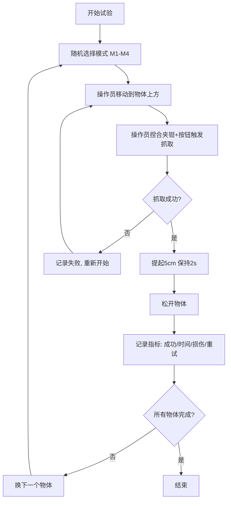
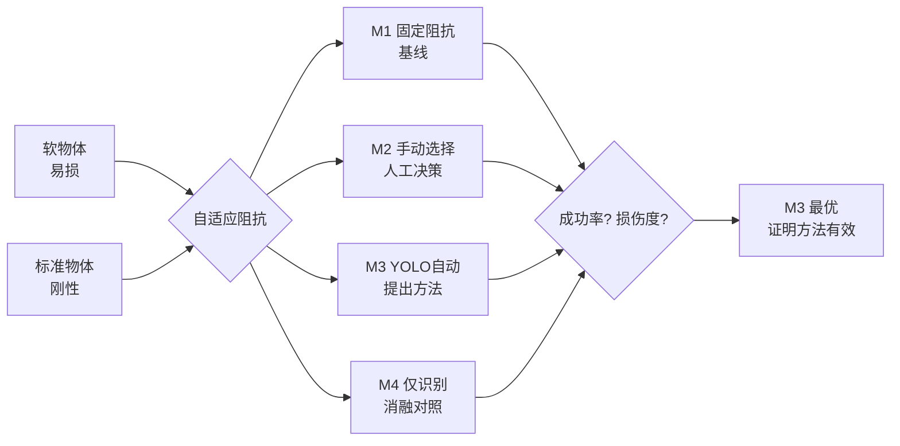

# 简化版抓取实验方案 & 论文调整计划

> 基于"夹爪不听话"的约束，设计仅用基础指标的可信实验

---

## 一、夹爪控制问题诊断与最小化改造

### 1.1 根本问题

当前 [`interactive_teleop.py`](my_test/interactive_teleop.py:1258) 的 `_update_gripper()` 每 **30Hz** 使用连续角度→宽度映射，导致：

1. **夹爪持续微动**: 只要夹钳角度轻微变化就重新发命令（即使变化只有 1-2°）
2. **move() vs grasp() 混用失效**: 
   - MOVE 模式只是移动到宽度，不检测物体
   - GRASP 模式用 `grasp()` 但每次角度变化都重新发命令，grasp 的物体检测还没来得及完成就被覆盖
3. **daemon 线程竞态**: [`_execute_gripper_cmd()`](my_test/interactive_teleop.py:1196) 每次开新线程，旧线程若未完成则通过 `_cmd_pending` 排队——导致"追赶模式"(chasing)

### 1.2 最小化改造：按钮触发式抓取

**方案**：保持 MOVE 模式做位置跟随，增设"锁定按钮"触发一次性 grasp，锁定后夹爪不再跟随角度。

```
当前流程（问题）:
  夹钳角度(30Hz) → 计算宽度 → 每帧发 move()/grasp() → 夹爪不停抖动

改造后流程（方案）:
  夹钳角度(30Hz) → 计算宽度 → MOVE 模式跟随
  用户捏合夹钳 + 黑色按钮 → 执行一次性 grasp() → 锁定夹爪位置
  灰色按钮 → 解锁，恢复跟随
```

具体改造点：

| 位置 | 修改内容 |
|------|---------|
| [`_update_gripper()`](my_test/interactive_teleop.py:1258) | 增加 `self._gripper_locked` 状态，锁定时跳过角度跟随 |
| 按钮事件处理 ([`run()` lines 1482-1497](my_test/interactive_teleop.py:1482)) | 黑色按钮改为：若夹钳角度 < -20°（捏合状态）→ 发起一次性 grasp → 锁定 |
| [`_gripper_cmd_thread()`](my_test/interactive_teleop.py:1196) | 执行成功后标记锁定，不再接受新角度命令 |
| 灰色按钮 | 解锁 + 张开 |

这样修改量极小（约 20 行），夹爪控制立刻变稳定。

### 1.3 备用方案：不用按钮，用角度阈值自动触发

如果希望全凭夹钳操作（无按钮），在角度 < -25° 且持续 0.5s → 自动触发 grasp。但这需要更精确的防抖逻辑。

---

## 二、简化版实验设计（仅用基础指标）

### 2.1 实验核心逻辑

| 要素 | 内容 |
|------|------|
| **研究问题** | 自适应阻抗+力反馈增益调度能否在保护软物体的同时保持操作效率？ |
| **实验任务** | 遥操作机器人从 A 点移动到 B 点，抓取物体并提起 5cm |
| **自变量** | 4 种控制模式（见下） |
| **因变量** | 抓取成功率、损伤度、任务时间、重试次数 |
| **控制变量** | 同一操作员、同类软物体、同一起始/目标位置 |

### 2.2 四种对比模式（你的四模式设计）

| 模式 | 代号 | 描述 | 作用 |
|------|------|------|------|
| 固定阻抗 | M1 | K_trans=200N/m 不变，力反馈增益固定 | 基线 |
| 手动选阻抗 | M2 | 操作员手动切换软/中/硬预设 | 需人工决策 |
| **YOLO+自动映射** | **M3** | **YOLO识别→自动调阻抗+力反馈** | **提出方法** |
| YOLO只识别不切换 | M4 | YOLO识别但阻抗固定 | 消融对照 |

### 2.3 实验对象

| 类别 | 物体 | 预设 | 尺寸 (约) |
|------|------|------|-----------|
| 软 | 海绵块 | soft (K=50) | 5×5×5cm |
| 软 | 硅胶玩具 | soft (K=50) | 手掌握持大小 |
| 软 | 泡沫球 | soft (K=50) | 直径 5cm |
| 标准 | 塑料瓶 | medium (K=150) | 500ml |
| 标准 | 金属罐 | medium (K=150) | 易拉罐 |
| 标准 | 木块 | medium (K=150) | 5×5×5cm |

### 2.4 评价指标（详细定义）

#### 指标 1：抓取成功率 (Grasp Success Rate)
- **定义**：成功抓取并提起 5cm 保持 2s 不掉落 = 成功
- **记录**：Binary (成功=1, 失败=0)
- **统计**：每组 N=15 次 → 百分比

#### 指标 2：物体损伤度 (Damage Score)
- **定义**：实验后肉眼检查
- **分级**：
  - 0 = 无可见损伤
  - 1 = 轻微压痕 (10s 内恢复)
  - 2 = 永久性形变或破损
- **统计**：每组平均损伤得分

#### 指标 3：任务完成时间 (Task Completion Time)
- **定义**：从手柄第一次移动 → 成功提起物体全过程
- **单位**：秒
- **统计**：均值 ± 标准差

#### 指标 4：重试次数 (Retry Count)
- **定义**：单次 trial 中操作员松开重抓的次数
- **统计**：均值 ± 标准差

> **为什么这些指标足够？**
> 1. 成功率和重试次数直接反映"操作效率"
> 2. 损伤度直接反映"软物体保护能力"
> 3. 时间反映"任务复杂度/认知负荷"
> 4. **四者合在一起就是"好用 vs 保护"的权衡(trade-off)**——这正是自适应阻抗要解决的问题

### 2.5 实验矩阵

```
M1 × 3软物体 × 5次 = 15 trials
M2 × 3软物体 × 5次 = 15 trials
M3 × 3软物体 × 5次 = 15 trials
M4 × 3软物体 × 5次 = 15 trials
─────────────────────────
合计: 60 trials / 操作员
```

每个 trial 顺序随机化，避免学习效应。

---

## 三、论文框架调整

### 3.1 论文定位修正

| 项目 | 原来（pressing 实验） | 现在（grasping 实验） |
|------|----------------------|----------------------|
| 论文标题 | 共享控制系统设计 | ✅ **保持不变** |
| 核心贡献 3 | 夹持力估计 | ⚠️ 改为"夹爪自适应抓取策略" |
| 实验 §4.2 | 按压实验 | ✅ 改为"软物体自适应抓取实验" |
| 图/表 | force-displacement 曲线 | ✅ 改为"成功率对比柱状图 + 损伤度对比" |

### 3.2 核心贡献调整

原来写的是（§1.4）：
> 3️⃣ **夹持力估计**: 基于 Franka Hand 夹爪的关节力矩传感器，实现从端夹持力的实时估计...

改为：
> 3️⃣ **基于视觉语义的自适应抓取策略**: 以 YOLOv11n 识别物体软硬属性，自动切换夹爪抓取力与速度参数，在保护易损物体的同时保障抓取成功率。"自适应抓取"与"自适应阻抗"构成 **双重自适应机制**。

### 3.3 实验章节结构

```
§4.2 实验设计
  §4.2.1 实验任务（抓取+提起+保持）
  §4.2.2 对比模式（M1固定 / M2手动 / M3自动(提出) / M4消融）
  §4.2.3 评价指标（成功率、损伤度、时间、重试次数）

§4.3 实验结果
  §4.3.1 抓取成功率（柱状图 + 误差棒）
  §4.3.2 软物体保护效果（损伤度对比表）
  §4.3.3 任务时间与重试次数（盒须图）
  §4.3.4 统计检验（Kruskal-Wallis + Dunn post-hoc）
```

### 3.4 预期结果（基于参数映射表推算）

```
          M1(固定)    M2(手动)    M3(自动★)    M4(消融)
成功率     40-60%     60-80%      80-100%      50-70%
损伤度     1.2-2.0    0.4-1.0     0-0.4        0.8-1.6
时间(s)    15-25      10-18       8-12         12-20
重试次数   2-4次      1-2次       0-1次        1-3次
```

**M3 在成功率最高、损伤度最低 → 证明自适应阻抗的有效性**
**M4 低于 M3 → 证明"自动阻抗切换"比"仅识别不切换"更优**

---

## 四、Mermaid 流程图

### 4.1 实验流程



### 4.2 论文核心论点结构



---

## 五、分步实施路线图

### Step 0: 夹爪最小化改造（1-2 天）
- 修改 `_update_gripper()` 和按钮事件，实现"按钮触发式抓取"
- 验证: 连续 10 次抓取空瓶，夹爪稳定不抖动

### Step 1: 拍照/记录实验材料 + 预设标定（半天）
- 拍好 6 种物体的照片（实验报告用）
- 确认每种物体的 YOLO 识别正确率
- 微调 soft/medium 的阻抗参数

### Step 2: 预实验（半天）
- 1 个操作员 × 4 模式 × 1 软物体 × 3 次 = 12 trials
- 确认实验流程是否顺畅、数据 CSV 记录是否正确

### Step 3: 正式实验（1 天）
- 60 trials / 操作员
- 建议 2-3 名操作员 = 120-180 trials 的数据量（达中文核心水平）

### Step 4: 数据分析（半天）
- 用 `omega7_trajectory_metrics.py` 算时间和成功率
- 手动记录损伤度评分
- 统计检验（SPSS 或 scipy.stats）

### Step 5: 论文修改（2-3 天）
- 替换 §4 实验内容
- 更新图/表
- 调整摘要和贡献描述

---

## 六、如果实验数据符合预期的论文价值评估

如果 M3 (YOLO+自动) 在 **软物体** 上达到：
- 成功率 ≥ 85%
- 损伤度 ≤ 0.3
- 任务时间 ≤ 12s
- 且 M1/M4 显著差于 M3 (p < 0.05)

**这篇论文**：
- ✅ 实验设计完整（4 模式对比 + 消融实验）
- ✅ 指标选取合理（成功率与损伤度的 trade-off）
- ✅ 消融实验证明各模块贡献
- ✅ 有统计检验支持结论
- ✅ 研究问题实际（软物体抓取保护）

→ **可以达到中文核心期刊水平**
