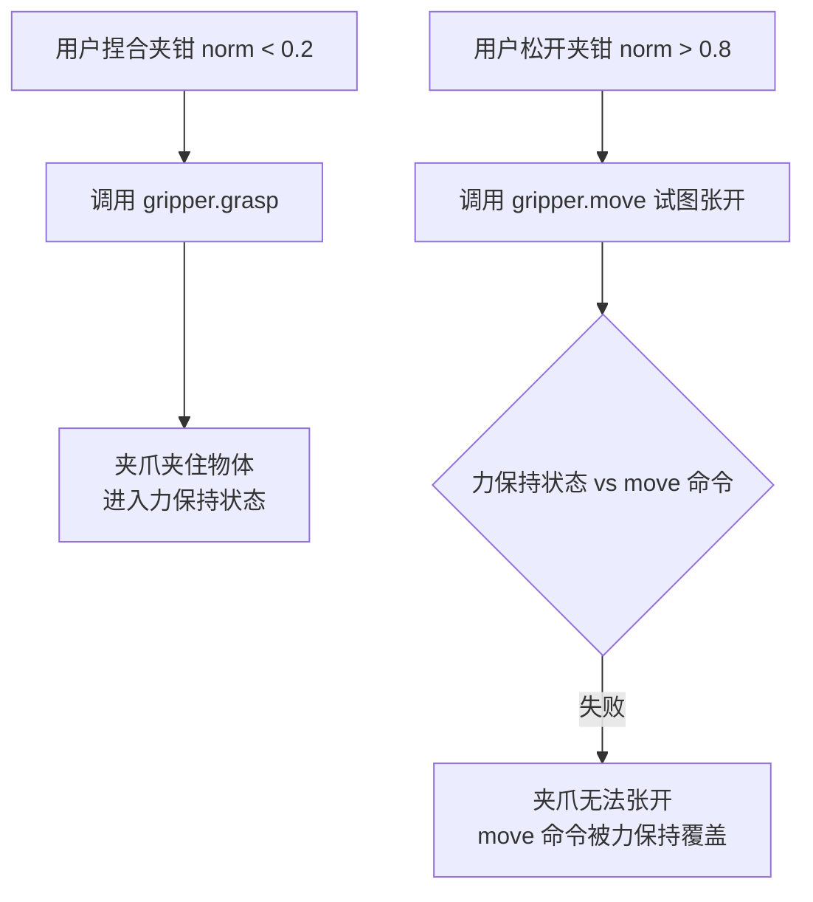
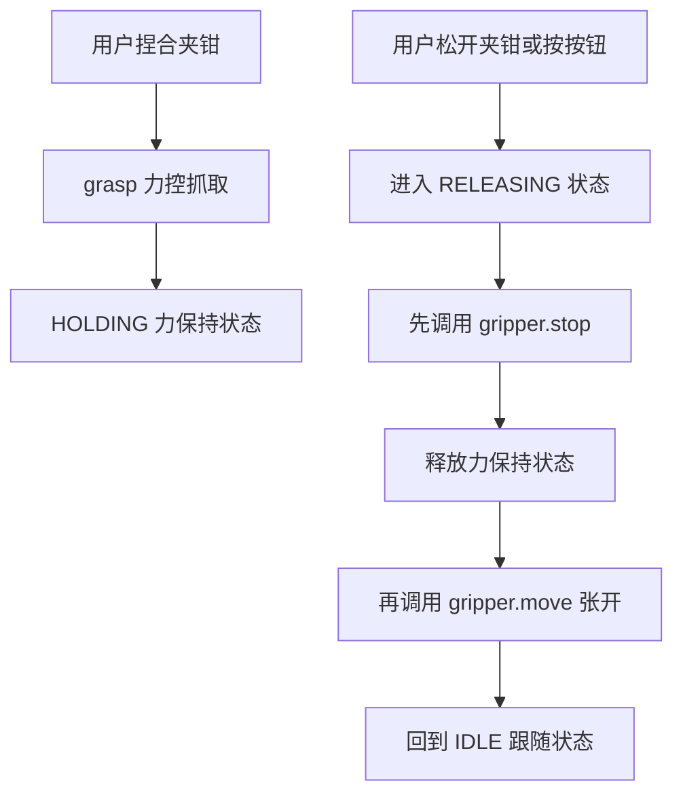

# Franka 夹爪 grasp 后无法松开的问题分析

## 问题现象

在 [`teleop_omega7_franka.py`](my_test/teleop_omega7_franka.py) 中，夹爪通过 `grasp()` 夹住物体后，用户松开 Omega.7 夹钳，夹爪无法再张开松开物体。

## 根因分析

### 1. Franka 夹爪 API 的关键差异

Franka 夹爪有两种截然不同的命令模式：

| 命令 | 行为 | 状态 |
|------|------|------|
| [`move(width, speed)`](libfranka/include/franka/gripper.h:116) | 纯位置控制 — 移动到指定宽度然后停止 | 无保持力 |
| [`grasp(width, speed, force, eps_inner, eps_outer)`](libfranka/include/franka/gripper.h:99) | 力控抓取 — 用指定力夹持，夹住后**持续施加保持力** | **力保持状态** |

### 2. libfranka 官方示例的正确做法

在 [`libfranka/examples/grasp_object.cpp`](libfranka/examples/grasp_object.cpp:60-61) 中，官方展示了正确流程：

```cpp
// Line 60-61:
std::cout << "Grasped object, will release it now." << std::endl;
gripper.stop();  // ← 必须先 stop() 释放力保持状态
```

**关键**：官方示例在 `grasp()` 之后释放时，先调用了 `stop()` 来退出力保持状态，而不是直接调 `move()`。

### 3. 问题代码的执行路径

在 [`teleop_omega7_franka.py`](my_test/teleop_omega7_franka.py) 的 [`gripper_worker()`](my_test/teleop_omega7_franka.py:159-181) 函数中：



**问题序列**：
1. `grasp()` 成功 → 夹爪进入**力保持状态**（内部持续施加夹持力）
2. 用户想松开 → 代码调用 `gripper.move(tw, speed)` 试图张开
3. `move()` 命令发送到夹爪，但夹爪内部力控制环仍在运行，`move()` 无法覆盖 `grasp()` 的力保持状态
4. 夹爪保持闭合，无法张开

### 4. 为什么 move() 无法覆盖力保持

从 [`research_interface/gripper/types.h`](libfranka/common/include/research_interface/gripper/types.h:20) 可以看到，`Grasp` 和 `Move` 是**独立的命令类型**（`kGrasp` vs `kMove`）。Franka 夹爪固件对这两种命令的处理路径不同：

- `Grasp` 命令设置了一个**力控制的目标**，启动力闭环控制
- `Move` 命令设置的是一个**位置控制的目标**
- 当力控制环激活时，位置控制命令可能被力控制环压制，无法实际执行张开动作

## 已存在的修复方案

作者已经意识到了这个问题，并在 [`omega7_gripper_control.py`](my_test/omega7_gripper_control.py) 中实现了修复方案。该文件第 30-31 行的文档明确说明了：

```
对比工作版 teleop_omega7_franka.py 的改进:
  - 有限状态机代替简单的 busy 标志
  - HOLDING→RELEASING 时先 stop() 释放力保持，再 move() 张开
```

修复后的流程：



核心修复代码在 [`_execute_release()`](my_test/omega7_gripper_control.py:348-372)：

```python
def _execute_release(self, width: float):
    """RELEASING 状态：先 stop 释放力保持，再 move 张开"""
    # 第一步：stop 释放力保持
    self._gripper_stop()
    # 第二步：move 到目标开度
    self.gripper.move(width, GRIPPER_SPEED)
```

## 修复建议

若要修复 `teleop_omega7_franka.py`，需要对 [`gripper_worker()`](my_test/teleop_omega7_franka.py:159-181) 做如下改造：

1. **引入状态机**跟踪夹爪状态（IDLE / HOLDING / RELEASING），区分 `move` 和 `grasp` 后的不同行为
2. **在 grasp 成功后标记力保持状态**，记录夹爪当前处于力保持模式
3. **从力保持状态松开时，先 `stop()` 再 `move()`**，确保可靠释放
4. **引入追赶模式**确保命令不丢失

最简洁的修复方案（不改动现有架构，仅在 `gripper_worker` 中增加逻辑）：

```python
def gripper_worker():
    nonlocal gripper_busy, gripper_last_cmd, gripper_pending_width, gripper_holding
    try:
        tw = gripper_pending_width
        if abs(tw - gripper_last_cmd) <= gripper_hysteresis:
            return
        grip_norm = tw / GRIPPER_MAX
        if gripper_holding and grip_norm > 0.2:
            # 力保持状态中 → 需要张开 → 先 stop 再 move
            gripper.stop()
            time.sleep(0.05)
            gripper.move(tw, GRIPPER_SPEED)
            gripper_holding = False
        elif grip_norm < 0.2:
            gripper.grasp(tw, GRIPPER_SPEED, GRIPPER_FORCE,
                          GRIPPER_EPS_INNER, GRIPPER_EPS_OUTER)
            gripper_holding = True
        else:
            gripper.move(tw, GRIPPER_SPEED)
            gripper_holding = False
        gripper_last_cmd = tw
    except Exception as e:
        print(f"\n   ⚠️ 夹爪命令失败: {e}")
    finally:
        gripper_busy = False
```

## 总结

| 项目 | 说明 |
|------|------|
| **根因** | `grasp()` 成功后夹爪进入力保持状态，直接 `move()` 无法覆盖该状态 |
| **修复方法** | 从力保持切换到张开时，必须先 `stop()` 释放保持力，再 `move()` 张开 |
| **参考实现** | [`omega7_gripper_control.py`](my_test/omega7_gripper_control.py) 中的有限状态机方案 |
| **官方示例** | [`grasp_object.cpp`](libfranka/examples/grasp_object.cpp:60-61) 使用 `stop()` 释放 |
