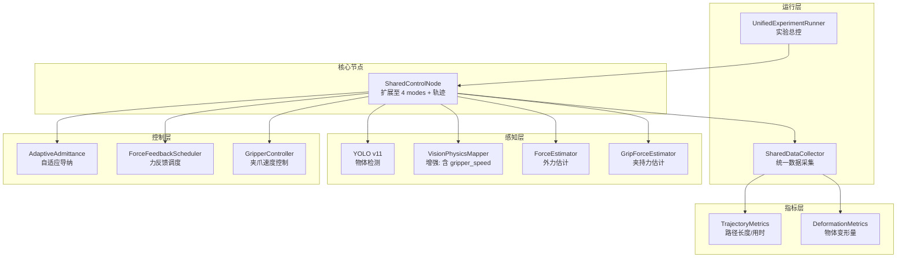
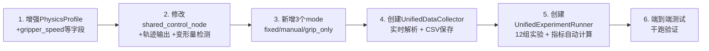

# 统一实验系统架构设计

## 1. 需求回顾：12组实验矩阵

| 组 | 实验条件 | 软 (soft, e.g. apple) | 中 (medium, e.g. bottle) | 硬 (hard, e.g. book) |
|---|---------|----------------------|--------------------------|----------------------|
| 1 | 固定阻抗 | trial | trial | trial |
| 2 | 人工选阻抗 | trial | trial | trial |
| 3 | 自动YOLO+查表 | trial | trial | trial |
| 4 | YOLO只选夹爪速度 | trial | trial | trial |

每 trial 采集 4 个指标:
- **用时** (completion time): 从开始移动到物体释放的时间
- **变形量** (object deformation): 物体被夹持时的形变程度
- **Omega.7 路径长度**: 主端操作手柄的累计3D轨迹长度
- **所夹物体变形量**: 通过夹爪宽度变化间接测量

---

## 2. 现有系统与目标系统的差异分析

### 2.1 现有模式 vs 新条件映射

| 新条件 | shared_control_node 现有能力 | 差距 |
|--------|---------------------------|------|
| 组1: 固定阻抗 | mode a (无YOLO, 零力反馈) | mode a 是零力反馈，不是"固定阻抗"。需新增：固定阻抗参数但无YOLO、有力反馈 |
| 组2: 人工选阻抗 | interactive_teleop.py (键盘调参) | 需融合到 shared_control_node 架构中，加 YOLO 感知但人工决策 |
| 组3: 自动YOLO+查表 | mode c (完整自适应) | 基本可用，需增强轨迹记录 |
| 组4: YOLO只选夹爪速度 | mode b (YOLO + 固定K=0.6) | mode b 的固定增益是力反馈增益，并非"阻抗固定+夹爪速度自适应"。需新 mode |

### 2.2 关键缺失能力

| 能力 | 所在文件 | 状态 |
|------|---------|------|
| Omega.7 轨迹记录 | `interactive_teleop.py:848-884` | ✅ 存在，但 shared_control_node 未集成 |
| 轨迹指标计算 | `omega7_trajectory_metrics.py` | ✅ 存在 |
| 物体变形量测量 | 无 | ❌ 不存在 |
| 夹爪速度自适应 | 无 | ❌ 不存在 |
| 增强型 PhysicsProfile | `vision_physics_mapper.py` | ⚠️ 需添加 gripper_speed |
| 4条件实验运行器 | `experiment_runner.py` (3模式) | ⚠️ 需扩展到4条件 |

---

## 3. 系统架构总览



---

## 4. 四种实验条件的详细定义

### 4.1 组1: 固定阻抗 (FIXED_IMPEDANCE)
```
YOLO:        ❌ 不启用
用户调节:    ❌ 不可调
K_trans:     固定值 (如 200 N/m)
K_rot:       固定值 (如 10 Nm/rad)
deadband:    固定值 (如 0.4 N)
K_fb:        固定值 (如 0.6)
gripper_speed: 固定值 (如 0.05 m/s)
力反馈:      ✅ 固定增益力反馈
说明:        传统固定参数遥操作基线
```
→ 对应新 mode: `fixed` (注意: 不同于现有 mode a 的零力反馈)

### 4.2 组2: 人工选阻抗 (MANUAL_SELECT)
```
YOLO:        ✅ 启用（仅显示检测结果给操作员）
用户调节:    ✅ 操作员根据 YOLO 结果手动按键调节 K_trans/deadband/K_fb
K_trans:     操作员自选
deadband:    操作员自选
K_fb:        操作员自选
gripper_speed: 操作员自选
力反馈:      根据操作员设定
说明:        融合 interactive_teleop.py 键盘交互机制
```
→ 对应新 mode: `manual`

### 4.3 组3: 自动YOLO+查表 (AUTO_FULL)
```
YOLO:        ✅ 启用
查表:        ✅ 自动查 PhysicsProfile (含 gripper_speed)
自适应导纳:  ✅ AdaptiveAdmittance 平滑切换
力反馈:      ✅ ForceFeedbackScheduler 自适应增益
gripper_speed: ✅ 查表自动设定
说明:        完整的视觉-导纳-力觉协同方法 (原 mode c)
```
→ 对应现有 mode: `c` (基本可用，需增强轨迹记录)

### 4.4 组4: YOLO只选夹爪速度 (YOLO_GRIP_ONLY)
```
YOLO:        ✅ 启用
查表:        ⚠️ 仅查询 gripper_speed，不使用 K_trans/deadband/K_fb
自适应导纳:  ❌ 不启用，使用固定 K_trans
力反馈:      固定增益力反馈
K_trans:     固定值
deadband:    固定值
K_fb:        固定值
gripper_speed: ✅ 查表自动设定（唯一自适应参数）
说明:        消融实验 — 证明仅靠夹爪速度调整不够，阻抗自适应是关键
```
→ 对应新 mode: `grip_only`

---

## 5. 增强型 PhysicsProfile（查表模型）

### 5.1 现有字段
```python
@dataclass
class PhysicsProfile:
    K_trans: float         # 平动刚度 (N/m)
    K_grip: float          # 夹持通道增益
    F_target: float        # 目标接触力 (N)
    deadband: float        # 力反馈死区 (N)
    admittance_K: float    # 导纳刚度 (N/m)
    approach_speed: float  # 接近速度 (m/s) ← 目前未使用
    label: str             # soft/medium/hard
    description: str
```

### 5.2 需添加字段
```python
    gripper_speed: float = 0.05    # 夹爪闭合速度 (m/s)
    gripper_width_target: float    # 目标夹持宽度 (m) — 用于变形量计算基准
    gripper_force_limit: float     # 夹爪力上限 (N) — 虽不可控但可记录参考
```

### 5.3 增强后的查表示例
```json
{
  "apple": {
    "K_trans": 50, "K_grip": 0.3, "F_target": 1.5,
    "deadband": 0.3, "admittance_K": 50, "approach_speed": 0.03,
    "gripper_speed": 0.02, "gripper_width_target": 0.065,
    "gripper_force_limit": 5.0,
    "label": "soft", "description": "苹果 — 软物体"
  },
  "bottle": {
    "K_trans": 150, "K_grip": 0.5, "F_target": 3.0,
    "deadband": 0.4, "admittance_K": 150, "approach_speed": 0.05,
    "gripper_speed": 0.04, "gripper_width_target": 0.055,
    "gripper_force_limit": 15.0,
    "label": "medium", "description": "水瓶 — 中等硬度"
  },
  "book": {
    "K_trans": 300, "K_grip": 1.0, "F_target": 8.0,
    "deadband": 0.5, "admittance_K": 300, "approach_speed": 0.08,
    "gripper_speed": 0.06, "gripper_width_target": 0.025,
    "gripper_force_limit": 30.0,
    "label": "hard", "description": "书 — 硬物体"
  }
}
```

---

## 6. 物体变形量测量方案

### 6.1 定义
```
变形量 Δ = w_initial - w_stable

其中:
  w_initial = 接触瞬间的夹爪宽度 (m)
  w_stable  = 夹持稳定后的夹爪宽度 (m)

当夹爪闭合遇到物体阻力后，继续闭合会导致:
- 软物体: 显著压缩，Δ 较大
- 硬物体: 几乎不压缩，Δ ≈ 0
```

### 6.2 测量流程
```
1. 夹爪开始闭合 (gripper_width 开始减小)
2. 检测接触: f_grip > threshold AND width变化率显著降低
   → 记录 w_initial = 当前 gripper_width
3. 夹持稳定: width 变化 < ε 持续 N 帧
   → 记录 w_stable = 当前 gripper_width
4. Δ = w_initial - w_stable
```

### 6.3 实现位置
在 `SharedControlNode._update_gripper()` 中增加变形量检测逻辑，将 w_initial 和 w_stable 写入状态数据流。

---

## 7. 统一数据采集方案

### 7.1 单次 trial CSV 字段
```csv
timestamp_ms, loop_count,
omega_x, omega_y, omega_z, omega_qw, omega_qx, omega_qy, omega_qz,  # Omega.7 位姿 (7D)
omega_gripper_deg, omega_button,
F_ext_x, F_ext_y, F_ext_z,                                            # 外力 (3D)
F_fb_x, F_fb_y, F_fb_z,                                               # 力反馈 (3D)
f_grip, f_grip_filtered, contact_detected,                            # 夹持力
K_trans, K_rot, deadband, K_fb,                                       # 当前控制参数
target_x, target_y, target_z, actual_x, actual_y, actual_z,           # 末端位置
pos_error_x, pos_error_y, pos_error_z,                                # 位置误差
gripper_width, gripper_speed,                                         # 夹爪状态
object_label, object_class_name,                                      # YOLO 检测结果
mode, condition, is_grasping, phase                                   # 实验元数据
```

### 7.2 从 CSV 自动提取指标
```
用时:          last_timestamp_ms - first_timestamp_ms
Omega.7路径:   Σ ||pos_i - pos_{i-1}||  (3D欧氏距离累加)
变形量:        在接触阶段: w_initial - w_stable
所夹物体变形量: 同变形量（从 gripper_width 变化间接测量）
```

---

## 8. 文件修改/创建清单

### 8.1 需创建的新文件

| 文件 | 说明 |
|------|------|
| `plans/unified_experiment_runner.py` | 统一实验运行器，支持 4 条件 × 3 物体 = 12 组 |
| `plans/unified_data_collector.py` | 统一数据采集器，实时解析 shared_control_node stdout |
| `plans/deformation_estimator.py` | 变形量估计器，从夹爪宽度变化计算物体形变 |
| `plans/enhanced_physics_table.json` | 增强型查表（含 gripper_speed, gripper_width_target 等） |

### 8.2 需修改的现有文件

| 文件 | 修改内容 |
|------|---------|
| `plans/shared_control_node.py` | 1. 新增 mode `fixed` / `manual` / `grip_only`<br>2. 集成 Omega.7 轨迹数据到 stdout 输出<br>3. 集成变形量检测到 `_update_gripper`<br>4. 集成 gripper_speed 从 PhysicsProfile 读取<br>5. 新增键盘交互模块（融合 interactive_teleop.py） |
| `biaoding/vision_physics_mapper.py` | PhysicsProfile 增加 `gripper_speed`, `gripper_width_target`, `gripper_force_limit` 字段 |
| `biaoding/physics_table.json` | 所有条目补充新增字段 |
| `plans/experiment_design.md` | 更新为 4 条件 × 3 物体设计 |

### 8.3 可选复用的现有文件

| 文件 | 复用内容 |
|------|---------|
| `my_test/interactive_teleop.py` | 键盘交互逻辑 + 轨迹记录逻辑 |
| `my_test/omega7_trajectory_metrics.py` | 轨迹指标计算函数 |
| `plans/grip_force_estimator.py` | 接触检测 + f_grip 计算 |

---

## 9. 执行流程

### 9.1 单次 trial 流程
```
1. 实验运行器启动 shared_control_node 子进程
2. shared_control_node 初始化 (Franka + Omega.7 + YOLO)
3. 等待操作员就绪
4. [记录开始] 操作员开始遥操作
5. 每帧 (5ms) 输出结构化 status 行 + 轨迹数据
6. YOLO 检测到物体 → 根据 mode 决定控制策略
7. 操作员夹持物体 → 变形量检测
8. 操作员将物体移至目标位置 → 释放
9. [记录结束] saved to CSV
10. 自动计算用时、路径长度、变形量
```

### 9.2 每名操作员实验流程
```
拉丁方随机化 4 条件顺序
  ├── 条件 i:
  │     ├── 软物体: N 次 trial (如 3-5次)
  │     ├── 中物体: N 次 trial
  │     └── 硬物体: N 次 trial
  │     └── NASA-TLX 问卷 (每条件结束后)
  └── ...
总计: 4条件 × 3物体 × N次 = 12N trials/人
```

---

## 10. shared_control_node.py 修改要点

### 10.1 模式扩展
```python
# 新 mode 参数:
#   "a" / "traditional"    → 组1: 固定阻抗 (修改: 需有力反馈，不是零力)
#   "b" / "fixed_gain"     → 保留 (YOLO + 固定力反馈增益)
#   "c" / "adaptive"       → 组3: 自动YOLO+查表 (保持不变)
#   "fixed"                → 组1: 固定阻抗 (无YOLO, 固定参数, 有力反馈)
#   "manual"               → 组2: 人工选阻抗 (YOLO显示 + 键盘调参)
#   "grip_only"            → 组4: YOLO只选夹爪速度
```

### 10.2 轨迹输出增强
在 [`_print_status()`](plans/shared_control_node.py:895) 中追加 Omega.7 位姿数据：
```python
# 在现有 status 行末尾追加:
# omega_pos=(x, y, z) omega_quat=(qw, qx, qy, qz) omega_grip=deg omega_btn=0/1
```

### 10.3 键盘交互集成
从 [`interactive_teleop.py`](my_test/interactive_teleop.py:484-586) 移植 `_keyboard_loop` 和 `_process_keyboard` 到 shared_control_node，仅在 mode=manual 时激活。

### 10.4 变形量检测
在 [`_update_gripper()`](plans/shared_control_node.py:830) 中增加变形量状态机：
```
状态: IDLE → CLOSING → CONTACT → STABLE → DONE
触发: 夹爪宽度变化 → f_grip超阈值 → width变化<ε持续N帧
记录: w_initial (CONTACT时), w_stable (STABLE时)
```

---

## 11. 开发优先级与依赖关系



---

## 12. 关键设计决策（待确认）

| # | 问题 | 建议 | 原因 |
|---|------|------|------|
| 1 | Omega.7 数据通过 stdout 还是独立文件？ | stdout 内嵌 | 保持单一数据流，避免同步问题 |
| 2 | 变形量用 w_initial - w_stable 还是 Force-Z 积分？ | w_initial - w_stable | 更直接，不与力估计误差耦合 |
| 3 | 键盘交互放 shared_control_node 内还是外层？ | shared_control_node 内 | 需要实时修改控制参数，外层延迟不可接受 |
| 4 | 每条件每物体的 trial 次数？ | 建议 5 次 | 与现有 experiment_design.md 一致 |
| 5 | 组1的固定阻抗应等于组3查表中哪个值？ | 使用 medium 级别 (bottle) 的固定参数 | 作为中位基线合理 |
