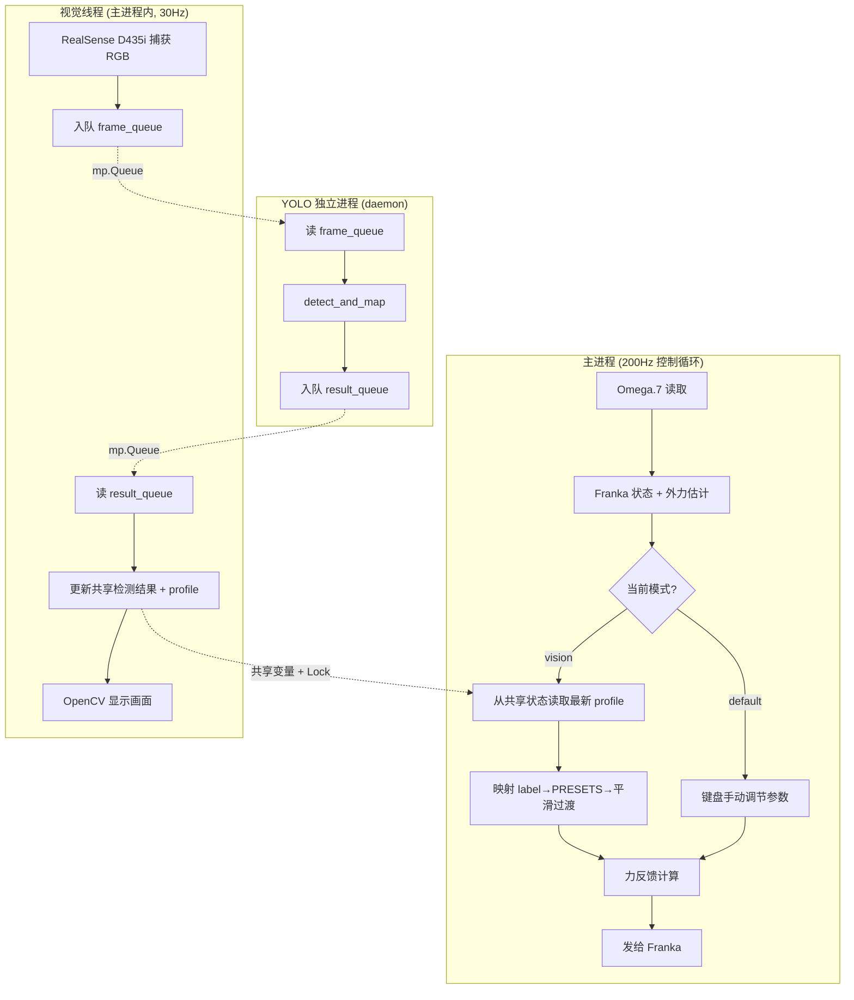

# interactive_teleop.py 视觉模式扩展计划

## 目标

在 [`my_test/interactive_teleop.py`](my_test/interactive_teleop.py) 中新增 `--mode vision` 模式，
通过 YOLO 子进程识别相机中的物体，自动将识别的物体类别映射到对应的软/中/硬物体手感预设。

## 整体架构



## 详细步骤

### Step 1: 增加 `--mode` 命令行参数

修改 `main()` 中的 `argparse`，新增：

```python
parser.add_argument("--mode", "-m", type=str, default="default",
                    choices=["default", "vision"],
                    help="运行模式: default=手动调节, vision=YOLO视觉自动映射")
```

传递 `mode` 给 [`InteractiveTeleop.__init__()`](my_test/interactive_teleop.py:222)。

### Step 2: 增加 `_yolo_process_main()` 独立进程函数

复刻 [`shared_control_node.py`](plans/shared_control_node.py:117) 中的函数，放到 `interactive_teleop.py` 模块级别：

- 参数: `model_path`, `conf_threshold`, `frame_queue`, `result_queue`
- 使用 [`biaoding/vision_physics_mapper.py`](biaoding/vision_physics_mapper.py) 中的 `VisionPhysicsMapper`
- `detect_and_map(rgb)` → 返回 `{class, bbox, profile, conf}` 或 `None`
- 通过 `result_queue` 回传结果

### Step 3: 增加 `_vision_loop()` 视觉线程

在 `InteractiveTeleop` 类中新增方法，仅在 `vision` 模式下启动：

- 初始化 RealSense D435i (640x480, 30fps)
- 创建 `mp.Queue(maxsize=2)` × 2（frame_queue, result_queue）
- 启动 YOLO 子进程 `mp.Process(target=_yolo_process_main, ...)`
- 主循环: `wait_for_frames` → 入队 frame_queue → 读 result_queue → 更新共享状态 → imshow
- 共享状态更新时需要获取 `self._vision_lock`:
  - `self._vision_detection`: 最新检测结果 dict
  - `self._vision_profile`: 最新 PhysicsProfile
  - `self._vision_last_time`: 最后检测成功时间戳
- OpenCV 窗口显示 (按 'q' 关闭画面)

### Step 4: 增加 `_profile_to_preset()` 映射函数

```python
def _profile_to_preset(self, profile: PhysicsProfile) -> str:
    """将 PhysicsProfile.label 映射到 PRESETS 字典的 key"""
    mapping = {
        "soft": "soft_obj",
        "medium": "medium_obj",
        "hard": "hard_obj",
        "unknown": "medium_obj",  # 默认回退到中物体
    }
    return mapping.get(profile.label, "medium_obj")
```

### Step 5: 修改 `__init__` 增加 vision 模式状态变量

在 [`InteractiveTeleop.__init__()`](my_test/interactive_teleop.py:222) 中新增：

```python
self.mode = mode  # "default" | "vision"

# ── Vision 模式状态 ──
self._vision_enabled = (mode == "vision")
self._vision_lock = threading.Lock()
self._vision_detection: dict = None       # 最新 YOLO 检测结果
self._vision_profile: PhysicsProfile = None  # 最新 PhysicsProfile
self._vision_last_time = 0.0              # 最后检测成功时间
self._vision_current_preset = "standard"  # 当前应用的 PRESET key
self._vision_active = False               # 视觉线程是否已启动
```

### Step 6: 修改 `initialize()` 在 vision 模式下启动视觉

在 [`InteractiveTeleop.initialize()`](my_test/interactive_teleop.py:287) 末尾增加：

```python
if self._vision_enabled:
    print("[5] 启动视觉模块 (YOLO + RealSense) ...")
    self._vision_thread = threading.Thread(
        target=self._vision_loop, daemon=True, name="VisionThread"
    )
    self._vision_thread.start()
    self._vision_active = True
    print("    ✅ 视觉线程已启动")
```

### Step 7: 修改 `run()` 主循环

在 [`InteractiveTeleop.run()`](my_test/interactive_teleop.py:779) 主循环中，在步骤 4（位置映射）之前或步骤 7（键盘处理）之前新增 vision 模式逻辑：

```
# ── Vision 模式：从检测结果自动同步参数 ──
if self._vision_enabled:
    with self._vision_lock:
        profile = self._vision_profile
        det_time = self._vision_last_time
    now_ts = time.time()

    if profile is not None and (now_ts - det_time) < 5.0:
        # 有有效检测 → 映射到 PRESET → 平滑过渡
        preset_key = self._profile_to_preset(profile)
        if preset_key != self._vision_current_preset:
            self._vision_current_preset = preset_key
            self._set_preset(preset_key)  # 平滑过渡
    elif (now_ts - det_time) >= 5.0:
        # 检测超时 → 回退到 standard
        if self._vision_current_preset != "standard":
            self._vision_current_preset = "standard"
            self._set_preset("standard")
```

注意：`_set_preset()` 中的 `_smooth_transition()` 是异步的，不会阻塞主循环。

键盘处理（步骤 7）在 vision 模式下跳过手动参数调节（见 Step 8）。

### Step 8: 修改 `_process_keyboard()` — vision 模式下禁用参数调节

在 [`InteractiveTeleop._process_keyboard()`](my_test/interactive_teleop.py:579) 开头增加判断：

```python
def _process_keyboard(self):
    # Vision 模式下：禁用所有手动参数调节按键
    if self._vision_enabled:
        key = ""
        with self._key_lock:
            if self._key_pressed and not self._key_held:
                key = self._key_pressed
                self._key_pressed = ""
        if key == "h":
            self._print_help()
        elif key == "v":
            self._save_params()
        elif key == "b":
            self._load_params()
        # 忽略所有参数调节按键 (1-0, q/w, a-f, z-c)
        return
    # ... 原有逻辑保持不变
```

### Step 9: 修改 `_shutdown()` — 增加视觉资源清理

在 [`InteractiveTeleop._shutdown()`](my_test/interactive_teleop.py:972) 中增加：

```python
# 清理视觉资源
if self._vision_enabled and self._vision_active:
    self._vision_active = False
    # YOLO 进程是 daemon=True，主进程退出时自动终止
    # RealSense pipeline 在 _vision_loop 中 stop
    print("\n   视觉模块已停止")
```

### Step 10: 修改 `_print_status()` 和 `_print_help()`

- `_print_status()`: vision 模式下增加显示当前检测物体类别和 label
- `_print_help()`: vision 模式下显示不同的按键帮助（标注哪些按键被禁用）

## 文件修改清单

| 文件 | 修改类型 | 说明 |
|------|---------|------|
| [`my_test/interactive_teleop.py`](my_test/interactive_teleop.py) | 修改 | 主要修改文件，所有改动集中于此 |

## 依赖关系

```
interactive_teleop.py (vision mode)
 ├── biaoding/vision_physics_mapper.py  (PhysicsProfile, VisionPhysicsMapper)
 ├── yolo/ultralytics-8.3.163/          (YOLO 模型)
 ├── pyrealsense2                        (RealSense D435i)
 ├── opencv (cv2)                        (画面显示)
 └── multiprocessing                     (跨进程 Queue + Process)
```

## 使用的现有 PRESETS 映射

| PhysicsProfile.label | PRESETS key | 手感描述 |
|---------------------|-------------|---------|
| `soft` | `soft_obj` | 低力反馈 + 低刚度 (K=50, ζ=0.8, Kfb=0.2) |
| `medium` | `medium_obj` | 中力反馈 + 中刚度 (K=150, ζ=1.0, Kfb=0.5) |
| `hard` | `hard_obj` | 强力反馈 + 高刚度 (K=250, ζ=1.2, Kfb=1.0) |
| `unknown` | `medium_obj` | 默认回退到中物体 |

## 预期行为

1. **启动**: `python3 my_test/interactive_teleop.py --mode vision`
2. **初始化**: 先连接 Omega.7 + Franka，再启动 RealSense + YOLO 子进程
3. **运行中**: 相机画面显示检测框，主循环每帧检查是否有新的 PhysicsProfile
4. **自动切换**: 检测到 apple → 自动过渡到软物体手感；检测到 book → 自动过渡到硬物体手感
5. **检测丢失**: 5 秒超时后回退到 standard 预设
6. **键盘**: 仅 h (帮助)、v (保存)、b (加载) 可用，参数调节键被忽略
7. **退出**: Ctrl+C 安全停止，YOLO 进程自动终止
